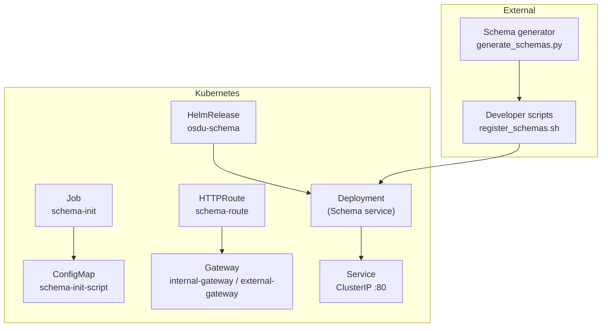
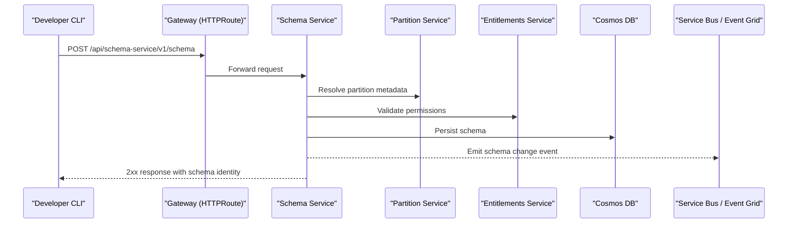
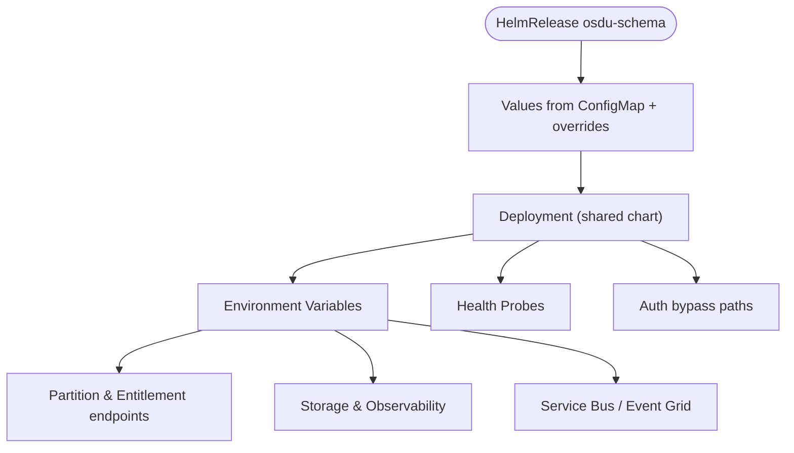
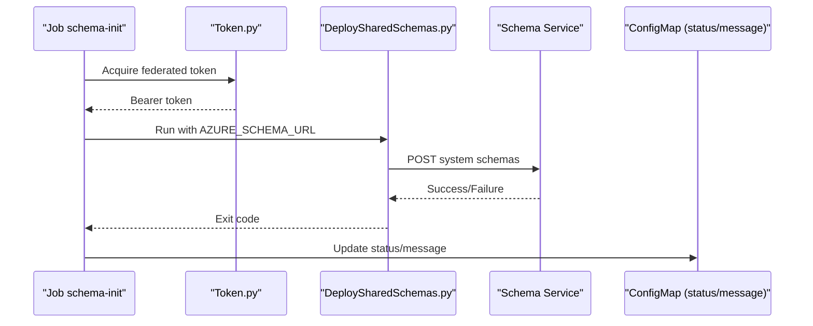
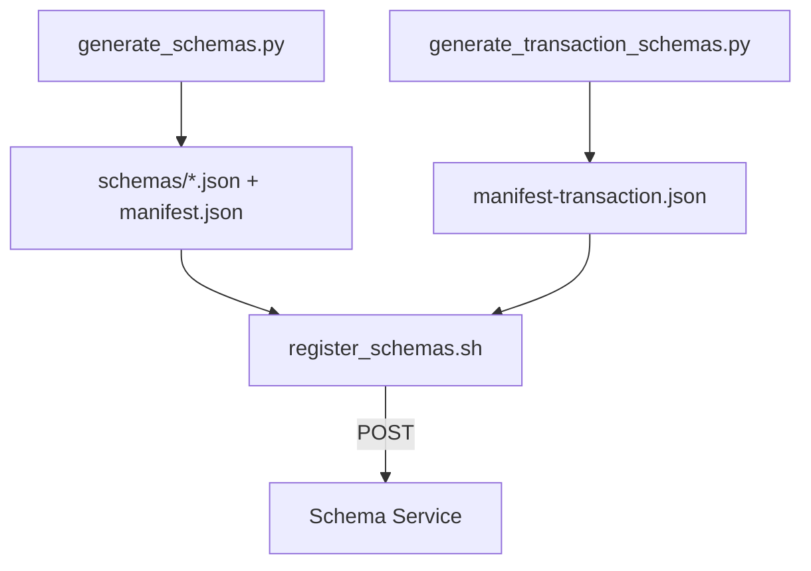
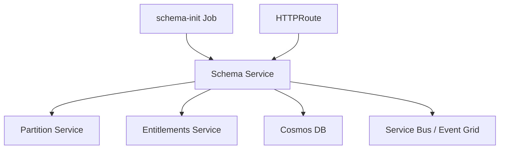

# Schema Service

<cite>
**Referenced Files in This Document**
- [services_core_schema.md](file://docs/src/services_core_schema.md)
- [schema.yaml](file://software/applications/osdu-core/schema.yaml)
- [schema-init.yaml](file://charts/osdu-developer-init/templates/schema-init.yaml)
- [deployment.yaml](file://charts/osdu-developer-service/templates/deployment.yaml)
- [http-route.yaml](file://charts/osdu-developer-service/templates/http-route.yaml)
- [values.yaml](file://charts/osdu-developer-service/values.yaml)
- [README.md](file://ofp-schema-deploy/README.md)
- [register_schemas.sh](file://ofp-schema-deploy/register_schemas.sh)
- [generate_schemas.py](file://ofp-schema-deploy/generate_schemas.py)
- [generate_transaction_schemas.py](file://ofp-schema-deploy/generate_transaction_schemas.py)
- [gateway-api-crd.yaml](file://software/components/global/gateway-api-crd.yaml)
</cite>

## Table of Contents
1. Introduction
2. Project Structure
3. Core Components
4. Architecture Overview
5. Detailed Component Analysis
6. Dependency Analysis
7. Performance Considerations
8. Troubleshooting Guide
9. Conclusion

## Introduction
This document provides deployment and operational guidance for the OSDU Schema service within this repository. It covers Kubernetes manifests, schema registry configuration, version management strategies, validation rules, migration processes, compatibility checking, integration with data ingestion pipelines, API gateway configuration, developer tools, schema definition formats, best practices for schema evolution, and troubleshooting schema-related issues.

## Project Structure
The Schema service is deployed as part of the core OSDU platform using Helm-based releases managed by Flux. The key elements include:
- A HelmRelease that deploys the Schema service via a shared service template
- An initialization Job that seeds system schemas into the Schema service
- Gateway API HTTPRoute resources to expose the service through internal and external gateways
- Scripts and generators to produce and register domain-specific schemas (OFP) into the Schema service

**Diagram sources**
- [schema.yaml:1-169](file://software/applications/osdu-core/schema.yaml#L1-L169)
- [schema-init.yaml:1-172](file://charts/osdu-developer-init/templates/schema-init.yaml#L1-L172)
- [http-route.yaml:1-45](file://charts/osdu-developer-service/templates/http-route.yaml#L1-L45)
- [deployment.yaml:1-178](file://charts/osdu-developer-service/templates/deployment.yaml#L1-L178)

**Section sources**
- [schema.yaml:1-169](file://software/applications/osdu-core/schema.yaml#L1-L169)
- [http-route.yaml:1-45](file://charts/osdu-developer-service/templates/http-route.yaml#L1-L45)
- [deployment.yaml:1-178](file://charts/osdu-developer-service/templates/deployment.yaml#L1-L178)

## Core Components
- Schema service deployment: Configured via a HelmRelease that references a shared service chart, sets environment variables, health probes, CORS, and gateway exposure.
- Initialization job: Boots a one-time job to load system schemas using a script and token helper, with Workload Identity authentication.
- Gateway routing: HTTPRoute resources bind the service to internal and external gateways, enabling path-based routing and optional CORS headers.
- Schema generation and registration: Python scripts generate draft-07 JSON Schema bodies from an entity model mapping; a bash script posts them to the Schema service in a safe, idempotent manner.

**Section sources**
- [schema.yaml:32-117](file://software/applications/osdu-core/schema.yaml#L32-L117)
- [schema-init.yaml:1-172](file://charts/osdu-developer-init/templates/schema-init.yaml#L1-L172)
- [http-route.yaml:1-45](file://charts/osdu-developer-service/templates/http-route.yaml#L1-L45)
- [README.md:1-70](file://ofp-schema-deploy/README.md#L1-L70)
- [register_schemas.sh:1-91](file://ofp-schema-deploy/register_schemas.sh#L1-L91)
- [generate_schemas.py:1-149](file://ofp-schema-deploy/generate_schemas.py#L1-L149)

## Architecture Overview
The Schema service exposes REST endpoints under a versioned context path. Traffic enters via Kubernetes Gateway API (HTTPRoute), which forwards requests to the service’s ClusterIP. The service integrates with partition and entitlement services, persists schemas in Cosmos DB, and emits events to Service Bus or Event Grid on schema changes.

**Diagram sources**
- [schema.yaml:69-117](file://software/applications/osdu-core/schema.yaml#L69-L117)
- [http-route.yaml:1-45](file://charts/osdu-developer-service/templates/http-route.yaml#L1-L45)
- [deployment.yaml:94-175](file://charts/osdu-developer-service/templates/deployment.yaml#L94-L175)

## Detailed Component Analysis

### Schema Service Deployment (HelmRelease + Shared Chart)
- The HelmRelease defines dependencies, target namespace, values sources, and per-service configuration including image, port, probes, auth bypass paths, and environment variables.
- Environment variables configure Key Vault URI, Azure AD client ID, Application Insights, Istio auth flags, context path, server port, storage container name, Service Bus topic, partition and entitlement endpoints, and feature toggles.
- Probes are configured against Actuator health endpoints for readiness/liveness checks.

**Diagram sources**
- [schema.yaml:1-117](file://software/applications/osdu-core/schema.yaml#L1-L117)
- [deployment.yaml:94-175](file://charts/osdu-developer-service/templates/deployment.yaml#L94-L175)

**Section sources**
- [schema.yaml:1-117](file://software/applications/osdu-core/schema.yaml#L1-L117)
- [deployment.yaml:1-178](file://charts/osdu-developer-service/templates/deployment.yaml#L1-L178)

### Initialization Job (System Schemas)
- A Kubernetes Job runs a bootstrap script that obtains a bearer token using Workload Identity and calls a shared schema loader against the Schema service endpoint.
- The script writes status and message back to a ConfigMap for observability and exits with appropriate codes.

**Diagram sources**
- [schema-init.yaml:1-172](file://charts/osdu-developer-init/templates/schema-init.yaml#L1-L172)

**Section sources**
- [schema-init.yaml:1-172](file://charts/osdu-developer-init/templates/schema-init.yaml#L1-L172)

### Gateway Exposure (HTTPRoute)
- HTTPRoute binds the service to one or more Gateways (internal and external).
- PathPrefix routing directs traffic to the service port.
- Optional CORS headers can be injected at the gateway layer.

**Diagram sources**
- [http-route.yaml:1-45](file://charts/osdu-developer-service/templates/http-route.yaml#L1-L45)
- [gateway-api-crd.yaml:763-9723](file://software/components/global/gateway-api-crd.yaml#L763-L9723)

**Section sources**
- [http-route.yaml:1-45](file://charts/osdu-developer-service/templates/http-route.yaml#L1-L45)
- [gateway-api-crd.yaml:763-9723](file://software/components/global/gateway-api-crd.yaml#L763-L9723)

### Schema Generation and Registration (OFP Domain)
- The generator reads an entity mapping and Hackolade models to produce self-contained draft-07 JSON Schema bodies with OSDU system properties inlined.
- The manifest controls registration order (reference-data before master-data) and deduplicates entries.
- The registration script posts each schema to the Schema service with proper headers, handling idempotency and errors.

**Diagram sources**
- [generate_schemas.py:1-149](file://ofp-schema-deploy/generate_schemas.py#L1-L149)
- [generate_transaction_schemas.py:60-135](file://ofp-schema-deploy/generate_transaction_schemas.py#L60-L135)
- [register_schemas.sh:1-91](file://ofp-schema-deploy/register_schemas.sh#L1-L91)

**Section sources**
- [README.md:1-70](file://ofp-schema-deploy/README.md#L1-L70)
- [generate_schemas.py:1-149](file://ofp-schema-deploy/generate_schemas.py#L1-L149)
- [generate_transaction_schemas.py:60-135](file://ofp-schema-deploy/generate_transaction_schemas.py#L60-L135)
- [register_schemas.sh:1-91](file://ofp-schema-deploy/register_schemas.sh#L1-L91)

## Dependency Analysis
- The Schema service depends on:
  - Partition service for partition resolution
  - Entitlements service for authorization
  - Cosmos DB for persistence
  - Service Bus or Event Grid for change notifications
- The initialization job depends on Workload Identity and the Schema service being available.
- Gateway routing depends on Gateway API CRDs and configured Gateways.

**Diagram sources**
- [schema.yaml:69-117](file://software/applications/osdu-core/schema.yaml#L69-L117)
- [schema-init.yaml:1-172](file://charts/osdu-developer-init/templates/schema-init.yaml#L1-L172)
- [http-route.yaml:1-45](file://charts/osdu-developer-service/templates/http-route.yaml#L1-L45)

**Section sources**
- [schema.yaml:69-117](file://software/applications/osdu-core/schema.yaml#L69-L117)
- [schema-init.yaml:1-172](file://charts/osdu-developer-init/templates/schema-init.yaml#L1-L172)
- [http-route.yaml:1-45](file://charts/osdu-developer-service/templates/http-route.yaml#L1-L45)

## Performance Considerations
- Use readiness and liveness probes to ensure rolling updates do not disrupt availability.
- Configure resource requests/limits in the deployment to avoid noisy neighbor issues.
- Prefer horizontal scaling where supported; the shared chart supports autoscaling configurations.
- Keep schema payloads minimal and well-structured to reduce parsing overhead.
- Enable caching at the gateway or application layer if read-heavy access patterns are observed.

[No sources needed since this section provides general guidance]

## Troubleshooting Guide
Common issues and resolutions:
- Authentication failures during initialization:
  - Ensure Workload Identity is enabled and the correct federated token file is mounted.
  - Verify tenant and client IDs are set correctly.
- Schema registration errors:
  - Confirm bearer token has required scopes and the base URL points to the correct platform.
  - Check for “already present” responses indicating idempotent skips.
- Gateway routing problems:
  - Validate HTTPRoute parentRefs match existing Gateway names and namespaces.
  - Ensure CORS settings align with client origins when needed.
- Health probe failures:
  - Confirm Actuator endpoints are exposed and reachable inside the pod.

**Section sources**
- [schema-init.yaml:119-170](file://charts/osdu-developer-init/templates/schema-init.yaml#L119-L170)
- [register_schemas.sh:33-49](file://ofp-schema-deploy/register_schemas.sh#L33-L49)
- [http-route.yaml:1-45](file://charts/osdu-developer-service/templates/http-route.yaml#L1-L45)
- [deployment.yaml:102-115](file://charts/osdu-developer-service/templates/deployment.yaml#L102-L115)

## Conclusion
This repository provides a complete, GitOps-driven deployment of the OSDU Schema service with robust initialization, secure authentication, and clear gateway exposure. The included generators and registration scripts enable safe, repeatable schema evolution aligned with OSDU conventions. By following the outlined best practices and troubleshooting steps, teams can manage schema versions, validate records, and integrate smoothly with ingestion pipelines and API gateways.

[No sources needed since this section summarizes without analyzing specific files]

## Appendices

### Schema Definition Formats and Validation Rules
- Generated schemas follow JSON Schema draft-07 with OSDU system properties inlined (id, kind, version, acl, legal, tags, create/modify timestamps and users).
- Required fields include kind, acl, legal, and data; additionalProperties is disabled to enforce strict schemas.
- Arrays must declare items to satisfy indexer requirements.

**Section sources**
- [generate_schemas.py:80-129](file://ofp-schema-deploy/generate_schemas.py#L80-L129)
- [generate_transaction_schemas.py:115-122](file://ofp-schema-deploy/generate_transaction_schemas.py#L115-L122)

### Version Management Strategies
- Schemas are registered with status DEVELOPMENT and scope INTERNAL initially, allowing mutable edits until promoted.
- Promotion to PUBLISHED freezes the schema; subsequent changes require new major/minor/patch versions.
- Manifests control dependency ordering to ensure reference-data precedes master-data during registration.

**Section sources**
- [README.md:37-70](file://ofp-schema-deploy/README.md#L37-L70)
- [generate_schemas.py:105-141](file://ofp-schema-deploy/generate_schemas.py#L105-L141)
- [register_schemas.sh:51-88](file://ofp-schema-deploy/register_schemas.sh#L51-L88)

### Integration with Data Ingestion Pipelines
- Ingestion DAGs are configured with the Schema service endpoint alongside other core services, enabling runtime schema validation during record processing.

**Section sources**
- [README.md:22-68](file://charts/airflow-dags/scripts/README.md#L22-L68)
- [main.bicep:66-108](file://bicep/modules/script-share-csvdag/main.bicep#L66-L108)

### API Gateway Configuration
- HTTPRoute resources define path prefix matching and backend service binding.
- Optional ResponseHeaderModifier filters add CORS headers for browser-based clients.

**Section sources**
- [http-route.yaml:1-45](file://charts/osdu-developer-service/templates/http-route.yaml#L1-L45)
- [gateway-api-crd.yaml:763-9723](file://software/components/global/gateway-api-crd.yaml#L763-L9723)

### Developer Tools
- Local development configuration includes Java SDK, module, main class, and environment variables for running the Schema service locally.

**Section sources**
- [services_core_schema.md:1-40](file://docs/src/services_core_schema.md#L1-L40)