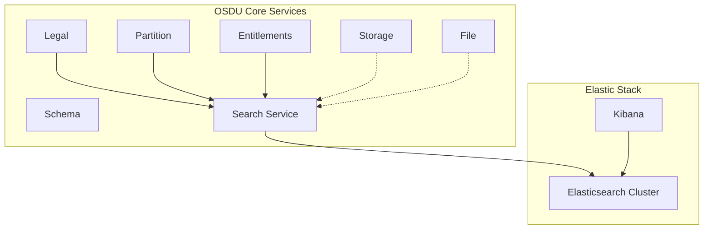
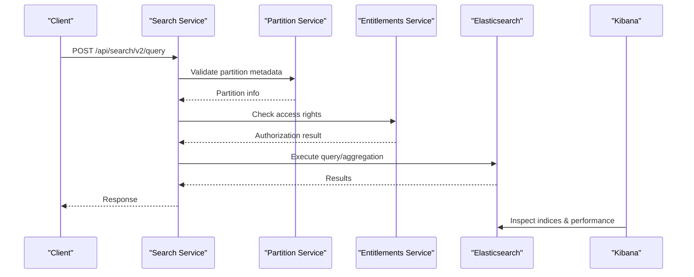
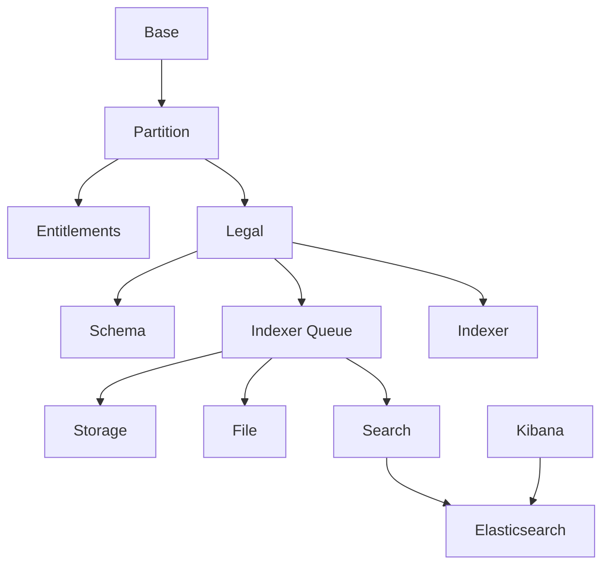

# Search Service

<cite>
**Referenced Files in This Document**
- [services_core_search.md](file://docs/src/services_core_search.md)
- [search.yaml](file://software/applications/osdu-core/search.yaml)
- [elastic-search.yaml](file://software/components/elastic-search/elastic-search.yaml)
- [kibana.yaml](file://software/components/elastic-search/kibana.yaml)
- [elastic.yaml](file://software/components/osdu-system/elastic.yaml)
- [check-csv.http](file://tools/rest-scripts/check-csv.http)
- [README.md](file://software/applications/osdu-core/README.md)
- [docker-bake.hcl](file://src/docker-bake.hcl)
</cite>

## Table of Contents
1. [Introduction](#introduction)
2. [Project Structure](#project-structure)
3. [Core Components](#core-components)
4. [Architecture Overview](#architecture-overview)
5. [Detailed Component Analysis](#detailed-component-analysis)
6. [Dependency Analysis](#dependency-analysis)
7. [Performance Considerations](#performance-considerations)
8. [Troubleshooting Guide](#troubleshooting-guide)
9. [Conclusion](#conclusion)

## Introduction
This document explains the OSDU Search service deployment and its integration with Elasticsearch for full-text search, faceted search, and aggregation queries. It covers cluster configuration, scaling considerations, performance tuning, API endpoints, query syntax, and integration with other services for data discovery and retrieval. The guidance is grounded in the repository’s deployment manifests, Helm releases, and example HTTP requests.

## Project Structure
The Search service is deployed as a Kubernetes application using Helm and Flux. It depends on:
- An Elasticsearch cluster managed by the Elastic Cloud on Kubernetes (ECK) operator
- Kibana for visualization and diagnostics
- Other OSDU core services such as Partition, Entitlements, Legal, Schema, Storage, and File

**Diagram sources**
- [search.yaml:30-123](file://software/applications/osdu-core/search.yaml#L30-L123)
- [elastic-search.yaml:1-89](file://software/components/elastic-search/elastic-search.yaml#L1-L89)
- [kibana.yaml:1-49](file://software/components/elastic-search/kibana.yaml#L1-L49)
- [README.md:1-33](file://software/applications/osdu-core/README.md#L1-L33)

**Section sources**
- [search.yaml:30-123](file://software/applications/osdu-core/search.yaml#L30-L123)
- [README.md:1-33](file://software/applications/osdu-core/README.md#L1-L33)

## Core Components
- Search Service (HelmRelease): Exposes the Search API under /api/search/v2/, integrates with Istio for authentication, and configures environment variables for runtime behavior.
- Elasticsearch Cluster: Deployed via ECK with three node sets configured for master/data/ingest roles, zone-awareness, and resource limits.
- Kibana: Configured to connect to the Elasticsearch cluster for observability and debugging.
- Operator and Repository: ECK operator installed via HelmRelease; Helm repository for the operator is declared.

Key configuration highlights:
- Search service context path: /api/search/v2/
- Health probe endpoint: /actuator/health
- Environment variables include Key Vault URI, AAD client ID, App Insights keys, service endpoints, cache settings, and logging level.

**Section sources**
- [search.yaml:30-123](file://software/applications/osdu-core/search.yaml#L30-L123)
- [elastic-search.yaml:1-89](file://software/components/elastic-search/elastic-search.yaml#L1-L89)
- [kibana.yaml:1-49](file://software/components/elastic-search/kibana.yaml#L1-L49)
- [elastic.yaml:1-29](file://software/components/osdu-system/elastic.yaml#L1-L29)

## Architecture Overview
The Search service receives search requests, applies partition and entitlement checks, and executes queries against Elasticsearch. Indexing is driven by the indexer pipeline that writes into Elasticsearch based on schema and legal constraints. Kibana provides visibility into indices and query performance.

**Diagram sources**
- [search.yaml:30-123](file://software/applications/osdu-core/search.yaml#L30-L123)
- [elastic-search.yaml:1-89](file://software/components/elastic-search/elastic-search.yaml#L1-L89)
- [kibana.yaml:1-49](file://software/components/elastic-search/kibana.yaml#L1-L49)

## Detailed Component Analysis

### Elasticsearch Integration and Cluster Configuration
- Version and topology:
  - Elasticsearch version is set in the cluster manifest.
  - Node roles are configured to combine master, data, and ingest roles.
  - Zone awareness uses Kubernetes labels to distribute nodes across zones.
- Resources and storage:
  - Persistent volumes are provisioned per node with specified storage class and size.
  - JVM heap is set via environment variable; CPU/memory requests and limits are defined.
- Networking:
  - TLS is disabled for HTTP in this deployment configuration.
  - Service type is ClusterIP for internal access.

Scaling considerations:
- Increase node count or adjust resources to handle larger datasets and higher throughput.
- Use topology spread constraints to balance nodes across zones.
- Monitor disk usage and adjust storage sizes accordingly.

**Section sources**
- [elastic-search.yaml:1-89](file://software/components/elastic-search/elastic-search.yaml#L1-L89)

### Search Service Deployment and Endpoints
- Service exposure:
  - Context path is /api/search/v2/.
  - Health check at /actuator/health.
- Authentication and authorization:
  - Istio auth enabled; certain paths are exempt from auth (e.g., health, swagger).
  - Integrates with Partition and Entitlements services for access control.
- Environment configuration:
  - Key Vault, AAD client ID, App Insights connection string.
  - Cache expiration and max cache value size.
  - Logging level and service names.

API usage examples:
- Example search request is provided in the REST scripts, demonstrating POST to /query with kind, query, offset, and limit fields.

**Section sources**
- [search.yaml:30-123](file://software/applications/osdu-core/search.yaml#L30-L123)
- [check-csv.http:720-763](file://tools/rest-scripts/check-csv.http#L720-L763)

### Indexing Strategies and Data Flow
- Indexer pipeline:
  - The installation sequence shows Legal triggers Indexer and Indexer Queue, which then interact with Storage, File, and Search.
  - This indicates indexing is event-driven and coordinated through queues and services.
- Data flow:
  - Records are stored in Storage and indexed into Elasticsearch via the indexer pipeline.
  - Search queries read from Elasticsearch after appropriate authorization checks.

Operational notes:
- Ensure indexer queue capacity matches ingestion volume.
- Align index mappings with schema definitions to support efficient querying.

**Section sources**
- [README.md:1-33](file://software/applications/osdu-core/README.md#L1-L33)

### Query Optimization and Faceted Search
- Query patterns:
  - Example queries use field-based filters and text matching within the query DSL.
  - Pagination parameters (offset, limit) are used to control result sets.
- Aggregations and facets:
  - While specific aggregation examples are not shown in the repository, Elasticsearch supports aggregations and facets for grouping and metrics.
  - Tune index mappings and analyzers to optimize aggregation performance.
- Caching:
  - Cache-related environment variables are present in the Search service configuration, indicating caching strategies for query results or metadata.

Best practices:
- Prefer exact-match filters over text queries where possible.
- Use appropriate field types and analyzers to improve relevance and speed.
- Monitor slow queries and adjust index design accordingly.

**Section sources**
- [check-csv.http:720-763](file://tools/rest-scripts/check-csv.http#L720-L763)
- [search.yaml:71-123](file://software/applications/osdu-core/search.yaml#L71-L123)

### Kibana Integration for Observability
- Kibana connects to the Elasticsearch cluster for visualizing indices, logs, and query performance.
- Useful for diagnosing slow queries, index health, and shard distribution.

**Section sources**
- [kibana.yaml:1-49](file://software/components/elastic-search/kibana.yaml#L1-L49)

## Dependency Analysis
The Search service depends on several core services and the Elasticsearch stack. The installation order ensures prerequisites are available before Search is deployed.

**Diagram sources**
- [README.md:1-33](file://software/applications/osdu-core/README.md#L1-L33)
- [search.yaml:30-123](file://software/applications/osdu-core/search.yaml#L30-L123)
- [elastic-search.yaml:1-89](file://software/components/elastic-search/elastic-search.yaml#L1-L89)
- [kibana.yaml:1-49](file://software/components/elastic-search/kibana.yaml#L1-L49)

**Section sources**
- [README.md:1-33](file://software/applications/osdu-core/README.md#L1-L33)

## Performance Considerations
- Elasticsearch cluster sizing:
  - Adjust node count, CPU/memory limits, and storage capacity based on dataset size and query load.
  - Use zone-awareness and topology spread constraints for resilience.
- JVM tuning:
  - Heap size is configured via environment variables; ensure it aligns with allocated memory.
- Query optimization:
  - Use precise filters and avoid heavy text queries when possible.
  - Leverage caching via environment variables to reduce repeated workloads.
- Monitoring:
  - Use Kibana to track index health, shard allocation, and slow queries.
  - Enable Application Insights for service-level telemetry.

[No sources needed since this section provides general guidance]

## Troubleshooting Guide
Common issues and checks:
- Health checks:
  - Verify the Search service health endpoint responds correctly.
- Authentication:
  - Confirm Istio auth bypass paths are configured for health and documentation endpoints.
- Connectivity:
  - Ensure Elasticsearch is reachable and Kibana can connect to it.
- Logs and metrics:
  - Review Application Insights and Kibana dashboards for errors and performance bottlenecks.

**Section sources**
- [search.yaml:50-70](file://software/applications/osdu-core/search.yaml#L50-L70)
- [kibana.yaml:36-49](file://software/components/elastic-search/kibana.yaml#L36-L49)

## Conclusion
The OSDU Search service is deployed as a Helm-managed application integrated with an Elasticsearch cluster for powerful full-text search, faceted search, and aggregation capabilities. Proper configuration of the Elasticsearch cluster, careful attention to query optimization, and robust monitoring via Kibana and Application Insights are essential for reliable performance. The service integrates with Partition, Entitlements, Legal, Schema, Storage, and File services to enforce access control and coordinate indexing workflows.

[No sources needed since this section summarizes without analyzing specific files]