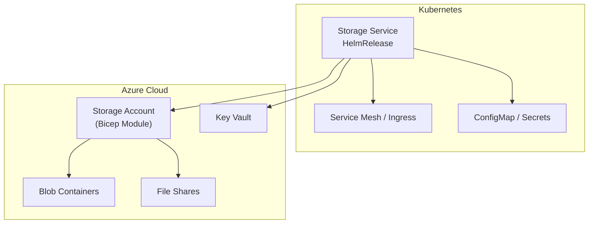
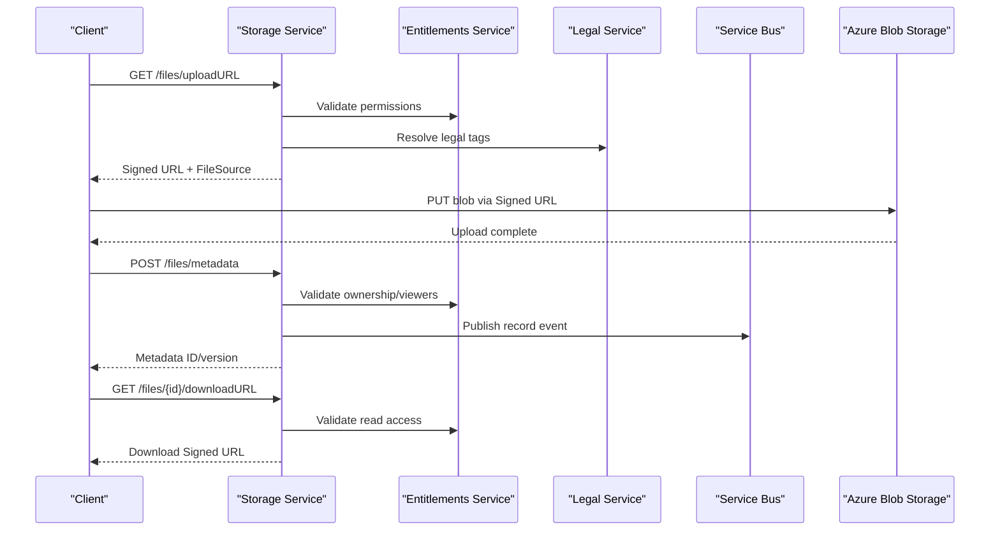
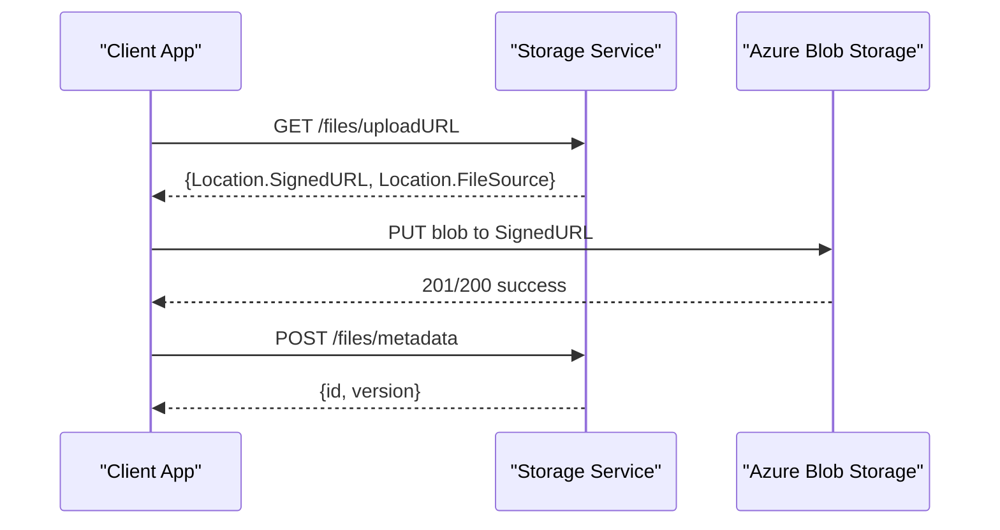
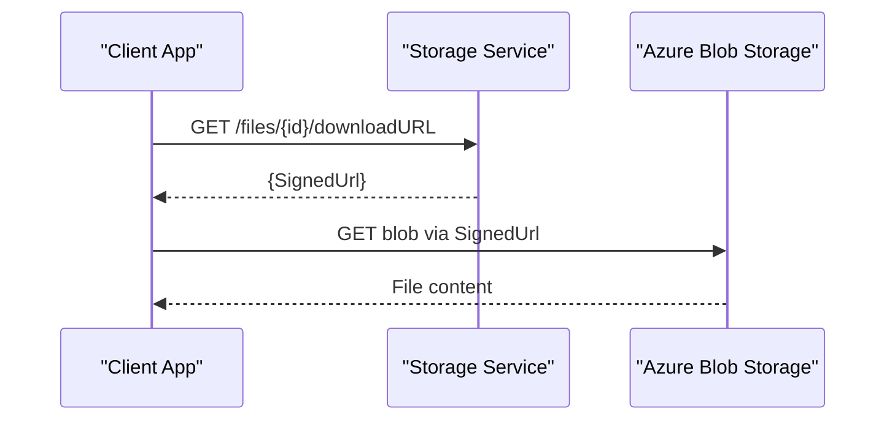
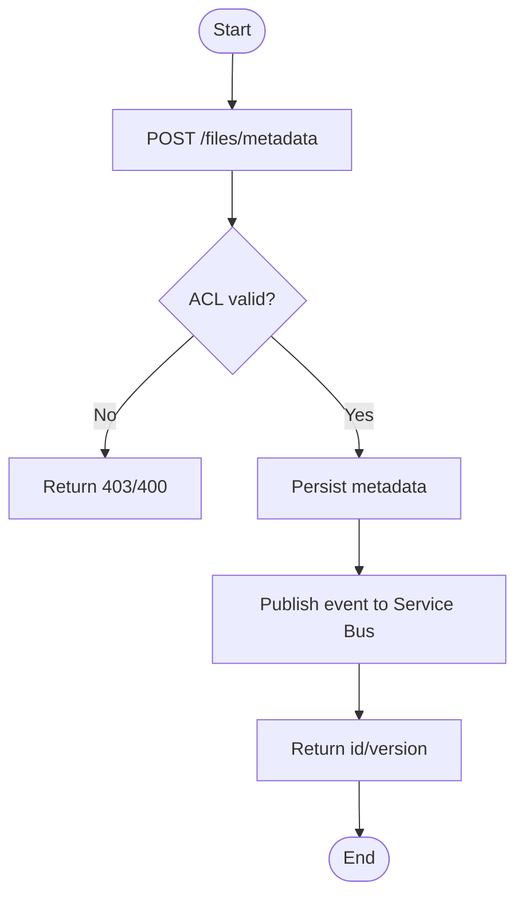
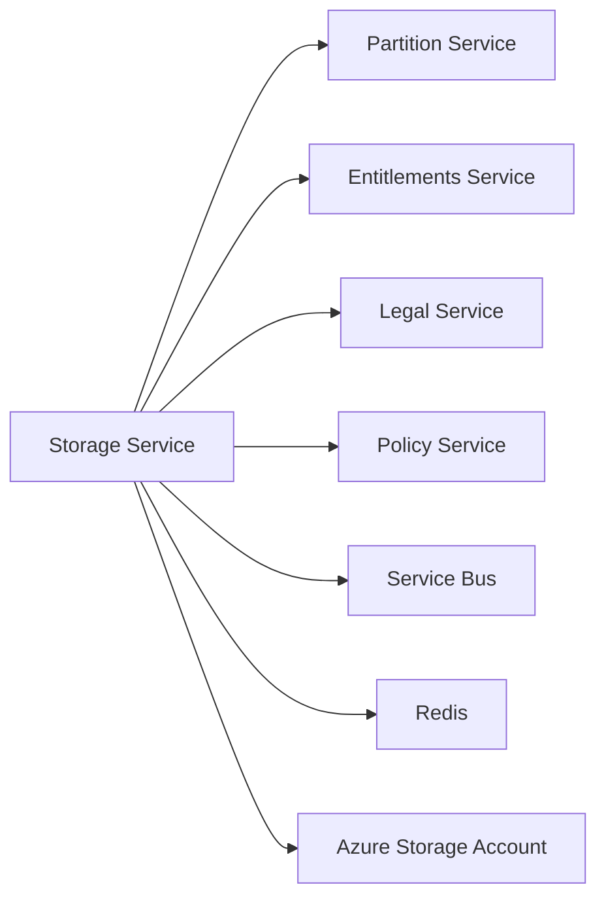

# Storage Service

<cite>
**Referenced Files in This Document**
- [services_core_storage.md](file://docs/src/services_core_storage.md)
- [storage.yaml](file://software/applications/osdu-core/storage.yaml)
- [storage.http](file://tools/rest-scripts/storage.http)
- [check-file.http](file://tools/rest-scripts/check-file.http)
- [main.bicep](file://bicep/modules/storage-account/main.bicep)
- [main.json](file://bicep/modules/storage-account/main.json)
- [blob_upload.sh](file://bicep/modules/deploy-scripts/blob_upload.sh)
- [script.sh](file://bicep/modules/script-share-upload/script.sh)
- [storage-share-job.yaml](file://charts/osdu-developer-base/templates/storage-share-job.yaml)
- [README.md](file://charts/storage-volumes/README.md)
</cite>

## Table of Contents
1. [Introduction](#introduction)
2. [Project Structure](#project-structure)
3. [Core Components](#core-components)
4. [Architecture Overview](#architecture-overview)
5. [Detailed Component Analysis](#detailed-component-analysis)
6. [Dependency Analysis](#dependency-analysis)
7. [Performance Considerations](#performance-considerations)
8. [Troubleshooting Guide](#troubleshooting-guide)
9. [Conclusion](#conclusion)
10. [Appendices](#appendices)

## Introduction
This document provides comprehensive deployment and operational guidance for the OSDU Storage service, focusing on file upload/download operations, metadata management, access controls, storage backend configuration (Azure Blob Storage), chunking strategies, performance optimization, security measures, encryption settings, API endpoints, error handling, and monitoring setup for production environments. It synthesizes configuration manifests, REST examples, and infrastructure templates to present a cohesive view of how the service is deployed and operated with Azure Blob Storage.

## Project Structure
The OSDU Storage service is deployed as part of the core services stack using Helm releases and Kubernetes manifests. The service exposes an OpenAPI-compliant REST API under a versioned path and integrates with partitioning, entitlements, legal, policy, and message bus components. Infrastructure resources such as Azure Storage Accounts are provisioned via Bicep modules, and auxiliary jobs handle blob/file uploads and data movement tasks.

**Diagram sources**
- [storage.yaml:30-141](file://software/applications/osdu-core/storage.yaml#L30-L141)
- [main.bicep:351-427](file://bicep/modules/storage-account/main.bicep#L351-L427)

**Section sources**
- [storage.yaml:30-141](file://software/applications/osdu-core/storage.yaml#L30-L141)
- [main.bicep:351-427](file://bicep/modules/storage-account/main.bicep#L351-L427)

## Core Components
- Storage Service Deployment: Configured via a HelmRelease that sets environment variables, health probes, CORS, gateway exposure, and integration endpoints for partitioning, entitlements, legal, policy, and message bus.
- Azure Storage Backend: Provisioned through a Bicep module that configures storage account kind, SKU, encryption, TLS, network ACLs, containers, shares, queues, tables, and diagnostics.
- File Operations: Demonstrated by REST scripts showing upload URL acquisition, direct blob PUT, metadata creation/retrieval, download URL generation, and deletion flows.
- Auxiliary Jobs: Scripts and jobs to download, extract, compress, and upload files to blob or file share destinations, including retry logic and optional compression.

**Section sources**
- [storage.yaml:30-141](file://software/applications/osdu-core/storage.yaml#L30-L141)
- [main.bicep:351-427](file://bicep/modules/storage-account/main.bicep#L351-L427)
- [check-file.http:108-215](file://tools/rest-scripts/check-file.http#L108-L215)
- [blob_upload.sh:1-12](file://bicep/modules/deploy-scripts/blob_upload.sh#L1-L12)
- [script.sh:1-59](file://bicep/modules/script-share-upload/script.sh#L1-L59)

## Architecture Overview
The Storage service orchestrates secure, authenticated file operations against Azure Blob Storage. Clients obtain signed URLs from the service to perform direct uploads/downloads, while metadata is managed via dedicated endpoints. Access control is enforced through entitlements and legal tags, and persistence is backed by Azure Storage with encryption at rest and in transit.

**Diagram sources**
- [check-file.http:108-215](file://tools/rest-scripts/check-file.http#L108-L215)
- [storage.yaml:117-134](file://software/applications/osdu-core/storage.yaml#L117-L134)

## Detailed Component Analysis

### File Upload Flow
Clients request a signed upload URL from the Storage service, then directly upload blobs to Azure Blob Storage using the returned URL. After upload, clients register metadata linking the blob to a record.

**Diagram sources**
- [check-file.http:108-149](file://tools/rest-scripts/check-file.http#L108-L149)

**Section sources**
- [check-file.http:108-149](file://tools/rest-scripts/check-file.http#L108-L149)

### File Download Flow
Clients request a signed download URL for a specific file ID and retrieve the content directly from Azure Blob Storage.

**Diagram sources**
- [check-file.http:204-215](file://tools/rest-scripts/check-file.http#L204-L215)

**Section sources**
- [check-file.http:204-215](file://tools/rest-scripts/check-file.http#L204-L215)

### Metadata Management
Metadata associates a stored file with OSDU schema, ACLs, legal tags, and data properties. The flow includes creating metadata after upload and retrieving it later.

**Diagram sources**
- [check-file.http:143-187](file://tools/rest-scripts/check-file.http#L143-L187)
- [storage.yaml:117-134](file://software/applications/osdu-core/storage.yaml#L117-L134)

**Section sources**
- [check-file.http:143-187](file://tools/rest-scripts/check-file.http#L143-L187)
- [storage.yaml:117-134](file://software/applications/osdu-core/storage.yaml#L117-L134)

### Access Controls
Access to records and files is governed by entitlements and legal tags. The Storage service validates permissions before issuing signed URLs or persisting metadata.

- Entitlements integration endpoint configured in deployment.
- Legal service integration endpoint configured in deployment.
- Examples show setting ACLs and legal tags in metadata requests.

**Section sources**
- [storage.yaml:117-134](file://software/applications/osdu-core/storage.yaml#L117-L134)
- [check-file.http:143-187](file://tools/rest-scripts/check-file.http#L143-L187)

### Storage Backend Configuration (Azure Blob Storage)
The Azure Storage Account is provisioned with encryption, TLS enforcement, network ACLs, and optional customer-managed keys. Containers and shares can be created as needed.

- Encryption enabled for blob/file/table/queue services; supports customer-managed keys via Key Vault.
- Minimum TLS version enforced.
- Public access disabled by default; private endpoints recommended.
- Containers and shares defined in main deployment parameters.

**Section sources**
- [main.bicep:351-427](file://bicep/modules/storage-account/main.bicep#L351-L427)
- [main.json:2539-2565](file://bicep/modules/storage-account/main.json#L2539-L2565)

### Chunking Strategies
Direct blob uploads use BlockBlob type in examples. For large files, consider leveraging Azure SDK features (e.g., block lists or parallel transfers) within client applications. The repository demonstrates single-block uploads via signed URLs; chunking specifics are not implemented in the provided scripts.

[No sources needed since this section provides general guidance]

### Performance Optimization
- Use appropriate storage SKU and access tier based on workload patterns.
- Enable HTTPS-only traffic and enforce minimum TLS versions.
- Configure retention policies for containers to manage lifecycle and costs.
- Utilize Service Bus topics for asynchronous processing and decoupling.
- Tune replica counts and resource limits in the Helm release for scaling needs.

**Section sources**
- [main.bicep:351-427](file://bicep/modules/storage-account/main.bicep#L351-L427)
- [storage.yaml:30-141](file://software/applications/osdu-core/storage.yaml#L30-L141)

### Security Measures and Encryption
- DefaultToOAuthAuthentication and allowSharedKeyAccess configurable; prefer OAuth-based authentication.
- requireInfrastructureEncryption set to true by default.
- Customer Managed Keys supported via Key Vault.
- SupportsHttpsTrafficOnly enforced.
- Private endpoints recommended for secure access.

**Section sources**
- [main.bicep:351-427](file://bicep/modules/storage-account/main.bicep#L351-L427)

### Integration with Azure Blob Storage
- Signed URLs enable direct client-to-blob uploads/downloads without proxying payload through the service.
- Auxiliary scripts demonstrate uploading files to blob containers and file shares using Azure CLI with identity-based authentication.
- Persistent volumes backed by Azure Blob CSI driver available for workloads requiring mounted storage.

**Section sources**
- [blob_upload.sh:1-12](file://bicep/modules/deploy-scripts/blob_upload.sh#L1-L12)
- [script.sh:1-59](file://bicep/modules/script-share-upload/script.sh#L1-L59)
- [README.md:1-45](file://charts/storage-volumes/README.md#L1-L45)

### API Endpoints
Examples demonstrate the following endpoints:
- Version/info: GET /api/storage/v2/info
- Records CRUD: PUT/GET/DELETE /api/storage/v2/records/*
- Query records: POST /api/storage/v2/query/records
- File operations: GET/POST /api/file/v2/files/* (uploadURL, metadata, downloadURL)

**Section sources**
- [storage.http:54-197](file://tools/rest-scripts/storage.http#L54-L197)
- [check-file.http:108-215](file://tools/rest-scripts/check-file.http#L108-L215)

### Error Handling
- Retry mechanisms are implemented in auxiliary jobs when downloading external files prior to upload.
- HTTP status codes and validation errors are expected from the Storage service when ACL/legal checks fail or inputs are invalid.

**Section sources**
- [storage-share-job.yaml:64-104](file://charts/osdu-developer-base/templates/storage-share-job.yaml#L64-L104)

### Monitoring Setup
- Health probe configured at /actuator/health on port 8081.
- Application Insights key and connection string injected via secrets.
- Diagnostic settings linked to Log Analytics workspace for storage account telemetry.

**Section sources**
- [storage.yaml:52-92](file://software/applications/osdu-core/storage.yaml#L52-L92)
- [main.bicep:729-733](file://bicep/main.bicep#L729-L733)

## Dependency Analysis
The Storage service depends on several internal services and Azure resources:
- Partition service for data partition resolution.
- Entitlements service for access control decisions.
- Legal service for tag resolution and compliance.
- Policy service for policy evaluation.
- Service Bus for asynchronous messaging.
- Redis for caching/session state.
- Azure Storage Account for persistent data.

**Diagram sources**
- [storage.yaml:117-141](file://software/applications/osdu-core/storage.yaml#L117-L141)

**Section sources**
- [storage.yaml:117-141](file://software/applications/osdu-core/storage.yaml#L117-L141)

## Performance Considerations
- Scale replicas and resource requests/limits according to throughput requirements.
- Choose storage SKUs and tiers aligned with access patterns (Hot/Cool/Premium).
- Leverage signed URLs to offload large transfers directly to Azure Blob Storage.
- Use Service Bus topics to decouple heavy processing from request paths.
- Monitor metrics via Application Insights and Azure Diagnostics to identify bottlenecks.

[No sources needed since this section provides general guidance]

## Troubleshooting Guide
Common issues and resolutions:
- Authentication failures: Ensure correct AAD client ID, scopes, and token usage; verify Istio auth and pod identity settings.
- Permission denied: Validate ACLs and legal tags in metadata; confirm entitlements service connectivity.
- Upload failures: Check signed URL validity and network egress to Azure Blob Storage; inspect retry logs in auxiliary jobs.
- Monitoring gaps: Verify Application Insights keys and diagnostic settings are correctly configured.

**Section sources**
- [storage.yaml:76-141](file://software/applications/osdu-core/storage.yaml#L76-L141)
- [storage-share-job.yaml:64-104](file://charts/osdu-developer-base/templates/storage-share-job.yaml#L64-L104)

## Conclusion
The OSDU Storage service integrates tightly with Azure Blob Storage to provide secure, scalable file operations with robust metadata management and access controls. Deployment configurations emphasize encryption, TLS enforcement, and observability. Using signed URLs enables efficient direct transfers, while auxiliary jobs support complex ingestion workflows. Proper configuration of entitlements, legal tags, and Service Bus ensures reliable, compliant operations in production.

[No sources needed since this section summarizes without analyzing specific files]

## Appendices

### Local Development Configuration
- Java SDK and Spring Boot module details for running locally.
- Environment variables for local execution include endpoints for partition, entitlements, legal, and storage-related settings.

**Section sources**
- [services_core_storage.md:5-39](file://docs/src/services_core_storage.md#L5-L39)