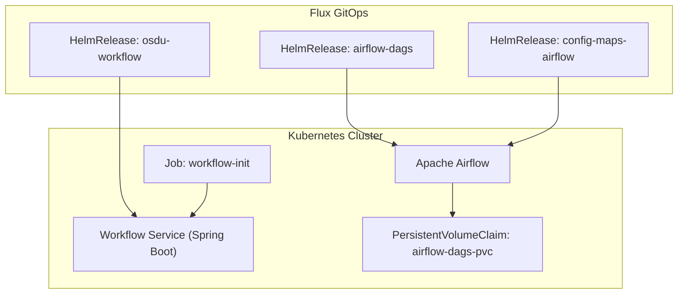
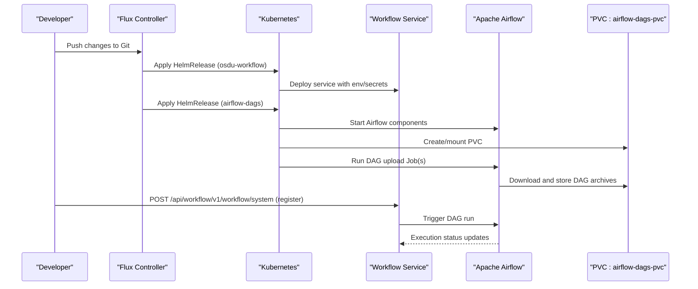
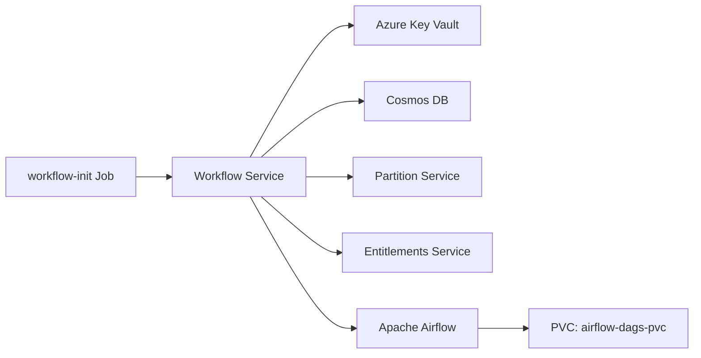

# Workflow Service

<cite>
**Referenced Files in This Document**
- [services_core_workflow.md](file://docs/src/services_core_workflow.md)
- [workflow.yaml](file://software/applications/osdu-core/workflow.yaml)
- [config-maps-airflow.yaml](file://software/components/airflow/config-maps.yaml)
- [dag-jobs.yaml](file://software/components/airflow/dag-jobs.yaml)
- [values.yaml](file://charts/airflow-dags/values.yaml)
- [dag-csv-job.yaml](file://charts/airflow-dags/templates/dag-csv-job.yaml)
- [workflow-init.yaml](file://charts/osdu-developer-init/templates/workflow-init.yaml)
</cite>

## Table of Contents
1. [Introduction](#introduction)
2. [Project Structure](#project-structure)
3. [Core Components](#core-components)
4. [Architecture Overview](#architecture-overview)
5. [Detailed Component Analysis](#detailed-component-analysis)
6. [Dependency Analysis](#dependency-analysis)
7. [Performance Considerations](#performance-considerations)
8. [Troubleshooting Guide](#troubleshooting-guide)
9. [Conclusion](#conclusion)

## Introduction
This document explains the OSDU Workflow service deployment with a focus on Apache Airflow integration, workflow orchestration, and task scheduling. It covers DAG definitions, dependency management, execution monitoring, container orchestration, resource allocation, scaling strategies, workflow APIs, custom operator development guidance, and debugging techniques for complex business processes. The content is derived from the repository’s deployment manifests, Helm charts, and configuration files.

## Project Structure
The workflow subsystem is composed of:
- A Spring-based Workflow service deployed via a HelmRelease that configures environment variables, secrets, and routing.
- An Apache Airflow installation managed by Flux HelmReleases, including DAG upload jobs and shared storage.
- An initialization job that registers system workflows with the Workflow service API.

**Diagram sources**
- [workflow.yaml:1-198](file://software/applications/osdu-core/workflow.yaml#L1-L198)
- [dag-jobs.yaml:1-56](file://software/components/airflow/dag-jobs.yaml#L1-L56)
- [config-maps-airflow.yaml:1-30](file://software/components/airflow/config-maps.yaml#L1-L30)
- [workflow-init.yaml:1-126](file://charts/osdu-developer-init/templates/workflow-init.yaml#L1-L126)

**Section sources**
- [workflow.yaml:1-198](file://software/applications/osdu-core/workflow.yaml#L1-L198)
- [dag-jobs.yaml:1-56](file://software/components/airflow/dag-jobs.yaml#L1-L56)
- [config-maps-airflow.yaml:1-30](file://software/components/airflow/config-maps.yaml#L1-L30)
- [workflow-init.yaml:1-126](file://charts/osdu-developer-init/templates/workflow-init.yaml#L1-L126)

## Core Components
- Workflow Service (Spring Boot): Exposes REST endpoints under /api/workflow/, integrates with Azure Key Vault, Cosmos DB, Partition and Entitlements services, and connects to Apache Airflow for DAG execution.
- Apache Airflow: Orchestrates DAGs; DAG artifacts are downloaded and mounted into the cluster via Jobs and PVCs.
- Initialization Job: Registers system workflows with the Workflow service using Workload Identity and an internal HTTP call.

Key responsibilities:
- Configuration and secrets injection for the Workflow service.
- DAG packaging and distribution to Airflow workers.
- Registration of system workflows at deploy time.

**Section sources**
- [services_core_workflow.md:1-39](file://docs/src/services_core_workflow.md#L1-L39)
- [workflow.yaml:30-144](file://software/applications/osdu-core/workflow.yaml#L30-L144)
- [dag-jobs.yaml:41-56](file://software/components/airflow/dag-jobs.yaml#L41-L56)
- [workflow-init.yaml:53-126](file://charts/osdu-developer-init/templates/workflow-init.yaml#L53-L126)

## Architecture Overview
The deployment uses Flux to manage HelmReleases that provision the Workflow service and Airflow components. DAGs are packaged from remote archives and uploaded to a shared PVC consumed by Airflow. The Workflow service calls Airflow to trigger DAG runs and monitors their status.

**Diagram sources**
- [workflow.yaml:1-198](file://software/applications/osdu-core/workflow.yaml#L1-L198)
- [dag-jobs.yaml:1-56](file://software/components/airflow/dag-jobs.yaml#L1-L56)
- [dag-csv-job.yaml:1-50](file://charts/airflow-dags/templates/dag-csv-job.yaml#L1-L50)
- [workflow-init.yaml:1-126](file://charts/osdu-developer-init/templates/workflow-init.yaml#L1-L126)

## Detailed Component Analysis

### Workflow Service Deployment
- Exposed path: /api/workflow/
- Health probes configured for readiness/liveness
- Environment variables include Key Vault URI, App Insights, partition and entitlements endpoints, and Airflow URL
- Authentication disabled for health and OpenAPI endpoints
- Integrates with Azure Storage for Airflow artifacts

Operational notes:
- Secrets are sourced from Key Vault-backed ConfigMaps/Secrets.
- Context path and port are set for ingress routing.
- Feature flags control Airflow version behavior and whether to ignore DAG/operator content.

**Section sources**
- [workflow.yaml:30-144](file://software/applications/osdu-core/workflow.yaml#L30-L144)
- [services_core_workflow.md:15-39](file://docs/src/services_core_workflow.md#L15-L39)

### Apache Airflow Integration and DAG Management
- Two DAG sources are supported:
  - Manifest DAGs from a remote archive
  - CSV parser DAGs from a separate archive
- Both use a PVC to persist DAG artifacts across restarts
- Jobs mount scripts and volumes to download, extract, and place DAGs into the Airflow directory structure

Configuration highlights:
- Enabled features toggled via values
- PVC name referenced for persistent storage
- URLs point to external archives containing DAG packages

**Section sources**
- [dag-jobs.yaml:41-56](file://software/components/airflow/dag-jobs.yaml#L41-L56)
- [values.yaml:1-13](file://charts/airflow-dags/values.yaml#L1-L13)
- [dag-csv-job.yaml:1-50](file://charts/airflow-dags/templates/dag-csv-job.yaml#L1-L50)

### Workflow Initialization Job
- Runs once after the Workflow service is available
- Uses Workload Identity to authenticate to Azure and obtain a token
- Iterates over a list of workflows and registers each via the Workflow service API endpoint
- Handles existing workflow conflicts gracefully

Execution flow:
- Install dependencies, login with federated token
- Validate JSON input for workflows
- Call the Workflow service to register system workflows
- Exit with appropriate status based on HTTP responses

**Section sources**
- [workflow-init.yaml:1-126](file://charts/osdu-developer-init/templates/workflow-init.yaml#L1-L126)

### Container Orchestration, Resource Allocation, and Scaling
- Services are deployed via Kubernetes workloads managed by HelmReleases
- Persistent storage is used for DAG artifacts to ensure durability
- Health checks are defined for liveness/readiness
- Ingress and routing are configured through gateway references and context paths

Scaling considerations:
- Horizontal Pod Autoscaler or replica counts can be tuned per workload
- DAG execution scale depends on Airflow worker replicas and concurrency settings
- PVC sizing should match DAG package sizes and retention policies

**Section sources**
- [workflow.yaml:52-68](file://software/applications/osdu-core/workflow.yaml#L52-L68)
- [dag-jobs.yaml:1-56](file://software/components/airflow/dag-jobs.yaml#L1-L56)
- [dag-csv-job.yaml:1-50](file://charts/airflow-dags/templates/dag-csv-job.yaml#L1-L50)

### Workflow APIs and Execution Monitoring
- System workflow registration endpoint is called during initialization
- The Workflow service exposes health and OpenAPI endpoints for diagnostics
- Airflow provides its own UI and APIs for DAG execution monitoring

Monitoring recommendations:
- Use Application Insights keys configured in the Workflow service
- Inspect Airflow logs and DAG run history
- Leverage Kubernetes events and pod logs for troubleshooting

**Section sources**
- [workflow.yaml:59-68](file://software/applications/osdu-core/workflow.yaml#L59-L68)
- [workflow-init.yaml:90-122](file://charts/osdu-developer-init/templates/workflow-init.yaml#L90-L122)

### Custom Operator Development Guidance
- The Workflow service supports ignoring custom operator content via a feature flag, enabling environments where operators are not required
- When developing custom operators:
  - Package operators into the same artifact pipeline as DAGs
  - Ensure operator dependencies are included in the image or sidecar if needed
  - Validate operator compatibility with the target Airflow version

**Section sources**
- [services_core_workflow.md:35-39](file://docs/src/services_core_workflow.md#L35-L39)
- [dag-jobs.yaml:41-56](file://software/components/airflow/dag-jobs.yaml#L41-L56)

## Dependency Analysis
The following diagram shows key runtime dependencies between components:

**Diagram sources**
- [workflow.yaml:70-144](file://software/applications/osdu-core/workflow.yaml#L70-L144)
- [dag-jobs.yaml:41-56](file://software/components/airflow/dag-jobs.yaml#L41-L56)
- [workflow-init.yaml:53-126](file://charts/osdu-developer-init/templates/workflow-init.yaml#L53-L126)

**Section sources**
- [workflow.yaml:70-144](file://software/applications/osdu-core/workflow.yaml#L70-L144)
- [dag-jobs.yaml:41-56](file://software/components/airflow/dag-jobs.yaml#L41-L56)
- [workflow-init.yaml:53-126](file://charts/osdu-developer-init/templates/workflow-init.yaml#L53-L126)

## Performance Considerations
- Concurrency: Configure concurrent workflow and task run limits in workflow registrations to balance throughput and resource usage.
- DAG size: Keep DAG packages minimal; leverage compression when downloading archives.
- Storage: Size PVCs appropriately for DAG retention and avoid excessive churn.
- Observability: Enable Application Insights and Airflow metrics to track performance bottlenecks.
- Scaling: Scale Airflow workers horizontally for CPU-bound tasks; tune executor settings based on workload characteristics.

[No sources needed since this section provides general guidance]

## Troubleshooting Guide
Common issues and resolutions:
- Workflow registration failures:
  - Verify the initialization job has network access to the Workflow service and valid tokens.
  - Check HTTP status codes returned by the registration endpoint.
- DAG not appearing in Airflow:
  - Confirm DAG upload jobs completed successfully and PVC is mounted.
  - Validate URLs and archive integrity.
- Authentication errors:
  - Ensure Workload Identity is correctly bound and secrets are present.
  - Review Key Vault and Active Directory configurations.
- Health and readiness:
  - Probe endpoints must respond; check liveness/readiness paths and ports.

Useful commands and locations:
- Inspect initialization job logs and outputs.
- Check Airflow DAG upload job status and PVC contents.
- Validate Workflow service health endpoints.

**Section sources**
- [workflow-init.yaml:53-126](file://charts/osdu-developer-init/templates/workflow-init.yaml#L53-L126)
- [dag-csv-job.yaml:1-50](file://charts/airflow-dags/templates/dag-csv-job.yaml#L1-L50)
- [workflow.yaml:52-68](file://software/applications/osdu-core/workflow.yaml#L52-L68)

## Conclusion
The OSDU Workflow service integrates tightly with Apache Airflow to provide robust workflow orchestration. Deployment is managed via Flux and Helm, with DAGs distributed through Jobs and PVCs. The initialization job ensures system workflows are registered at startup. Operators can extend functionality by packaging custom operators alongside DAGs. Proper configuration of concurrency, storage, and observability enables scalable and reliable execution of complex business processes.

[No sources needed since this section summarizes without analyzing specific files]