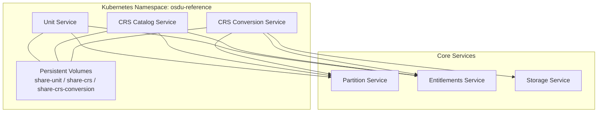
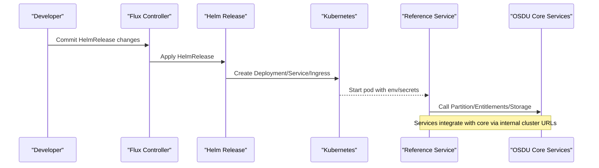
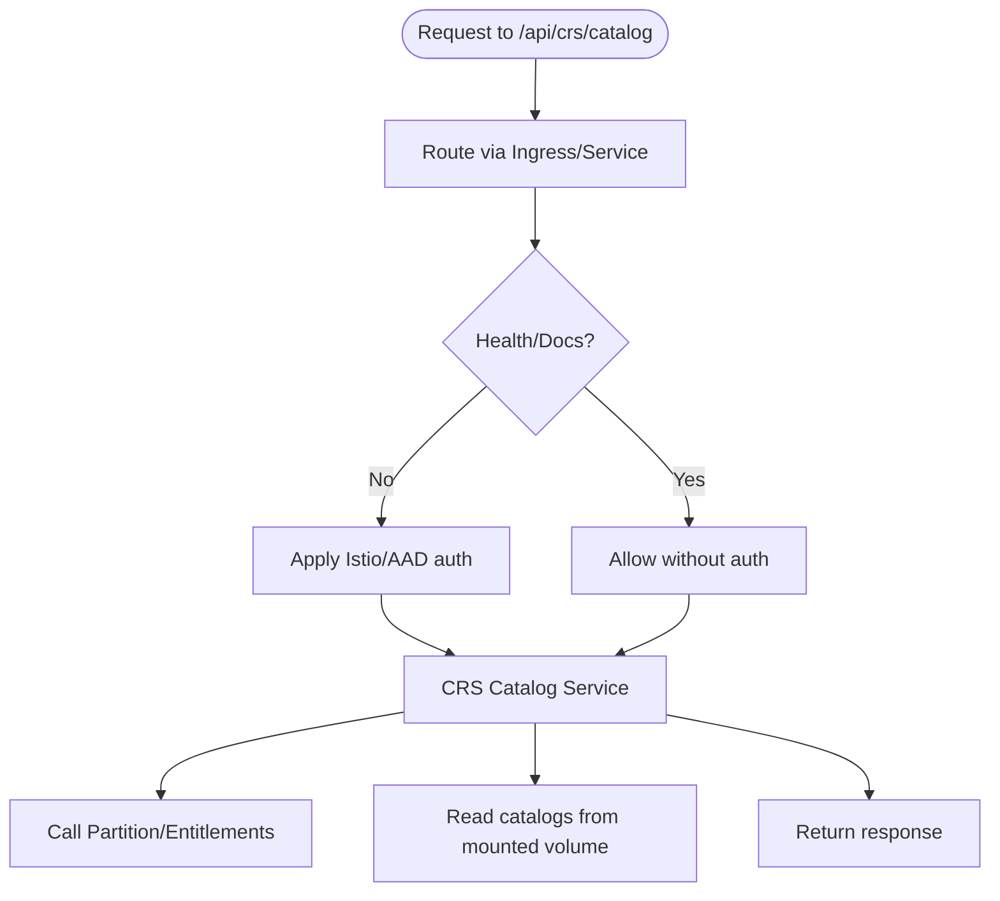
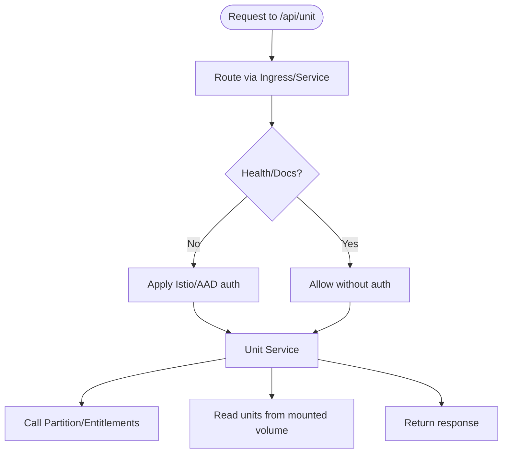
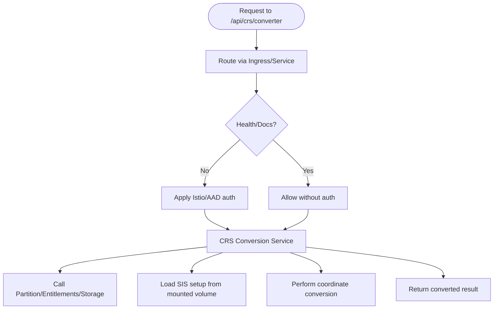
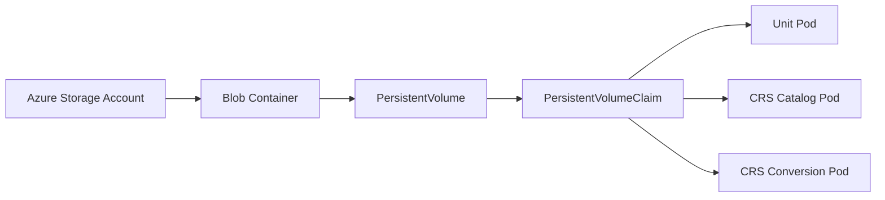
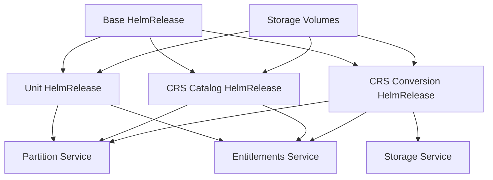

# Reference Implementations

<cite>
**Referenced Files in This Document**
- [base.yaml](file://software/applications/osdu-reference/base.yaml)
- [crs-catalog.yaml](file://software/applications/osdu-reference/crs-catalog.yaml)
- [unit.yaml](file://software/applications/osdu-reference/unit.yaml)
- [crs-conversion.yaml](file://software/applications/osdu-reference/crs-conversion.yaml)
- [storage-volumes.yaml](file://software/applications/osdu-reference/storage-volumes.yaml)
- [values.yaml (osdu-developer-service)](file://charts/osdu-developer-service/values.yaml)
- [values.yaml (storage-volumes)](file://charts/storage-volumes/values.yaml)
- [README.md (storage-volumes chart)](file://charts/storage-volumes/README.md)
- [values.yaml (osdu-developer-base)](file://charts/osdu-developer-base/values.yaml)
- [crs-catalog.http](file://tools/rest-scripts/crs-catalog.http)
- [unit.http](file://tools/rest-scripts/unit.http)
- [crs-conversion.http](file://tools/rest-scripts/crs-conversion.http)
</cite>

## Table of Contents
1. Introduction
2. Project Structure
3. Core Components
4. Architecture Overview
5. Detailed Component Analysis
6. Dependency Analysis
7. Performance Considerations
8. Troubleshooting Guide
9. Conclusion
10. Appendices

## Introduction
This document explains the reference implementation deployments for OSDU integration, focusing on:
- CRS Catalog service
- Unit Conversion service
- Authentication and authorization configuration
- Storage volumes for shared data

It details how these services are deployed via HelmRelease manifests, their configuration options, testing capabilities using HTTP scripts, and development workflows. It also provides guidance on extending these implementations for custom use cases while following best practices for OSDU integration.

## Project Structure
The reference deployment is composed of:
- A base HelmRelease that configures Azure integration, resource limits, and optional file shares to download catalog data into persistent storage.
- Individual HelmRelease definitions for each reference service (CRS Catalog, Unit, CRS Conversion), each exposing an API path and health probes.
- A dedicated HelmRelease for provisioning Azure Blob-backed PersistentVolumes and Claims used by the services.
- Shared Helm chart values that define common patterns for service exposure, authentication bypasses, environment variables, and PVC mounts.

**Diagram sources**
- [unit.yaml:38-109](file://software/applications/osdu-reference/unit.yaml#L38-L109)
- [crs-catalog.yaml:38-107](file://software/applications/osdu-reference/crs-catalog.yaml#L38-L107)
- [crs-conversion.yaml:38-114](file://software/applications/osdu-reference/crs-conversion.yaml#L38-L114)
- [storage-volumes.yaml:28-34](file://software/applications/osdu-reference/storage-volumes.yaml#L28-L34)

**Section sources**
- [base.yaml:1-48](file://software/applications/osdu-reference/base.yaml#L1-L48)
- [storage-volumes.yaml:1-34](file://software/applications/osdu-reference/storage-volumes.yaml#L1-L34)

## Core Components
- Base configuration: Enables Azure integration, sets default resource requests/limits, and optionally downloads catalog files into PVCs via a share mechanism.
- Unit service: Exposes unit catalogs and measurements under a defined path with readiness probes and auth bypasses for health and docs endpoints.
- CRS Catalog service: Exposes CRS catalog APIs under a defined path with readiness probes and auth bypasses for health and docs endpoints.
- CRS Conversion service: Exposes conversion APIs under a defined path, mounts Apache SIS setup data from a shared volume, and integrates with partition, entitlements, and storage services.
- Storage volumes: Provisions Azure Blob-backed PV/PVC pairs consumed by the services as shared data stores.

Best practices demonstrated:
- Centralized service template usage via a shared Helm chart pattern for consistent exposure, probes, and security settings.
- Explicit separation of concerns: base configuration, per-service releases, and infrastructure (volumes).
- Secure secrets handling through KeyVault-backed environment variables.
- Clear health and readiness probes for observability.
- Controlled authentication bypass for non-sensitive endpoints.

**Section sources**
- [base.yaml:27-48](file://software/applications/osdu-reference/base.yaml#L27-L48)
- [unit.yaml:31-109](file://software/applications/osdu-reference/unit.yaml#L31-L109)
- [crs-catalog.yaml:31-107](file://software/applications/osdu-reference/crs-catalog.yaml#L31-L107)
- [crs-conversion.yaml:31-114](file://software/applications/osdu-reference/crs-conversion.yaml#L31-L114)
- [storage-volumes.yaml:28-34](file://software/applications/osdu-reference/storage-volumes.yaml#L28-L34)

## Architecture Overview
The reference deployment uses a GitOps-driven approach where Flux manages HelmReleases. Each service is deployed with a consistent pattern:
- Image repository and tag are specified per service.
- Ingress paths are configured to expose APIs under well-known prefixes.
- Health probes ensure liveness/readiness checks.
- Secrets are injected via KeyVault references.
- Environment variables configure service behavior and dependencies.

**Diagram sources**
- [crs-catalog.yaml:9-107](file://software/applications/osdu-reference/crs-catalog.yaml#L9-L107)
- [unit.yaml:9-109](file://software/applications/osdu-reference/unit.yaml#L9-L109)
- [crs-conversion.yaml:9-114](file://software/applications/osdu-reference/crs-conversion.yaml#L9-L114)

## Detailed Component Analysis

### CRS Catalog Service
- Purpose: Provides access to Coordinate Reference System catalogs.
- Exposure: Path prefix configured for routing; health probe targets Swagger UI index.
- Security: Auth disabled for health and documentation endpoints; KeyVault enabled for secrets.
- Integration: Connects to Partition and Entitlements services via environment variables.
- Data: Mounts a shared volume at a specific path for catalogs.

**Diagram sources**
- [crs-catalog.yaml:38-107](file://software/applications/osdu-reference/crs-catalog.yaml#L38-L107)

**Section sources**
- [crs-catalog.yaml:31-107](file://software/applications/osdu-reference/crs-catalog.yaml#L31-L107)

### Unit Service
- Purpose: Provides unit catalogs, measurement lists, and unit systems.
- Exposure: Path prefix configured for routing; readiness probe targets readiness endpoint.
- Security: Auth disabled for health and documentation endpoints; KeyVault enabled for secrets.
- Integration: Connects to Partition and Entitlements services via environment variables.
- Data: Mounts a shared volume at a specific path for catalogs.

**Diagram sources**
- [unit.yaml:38-109](file://software/applications/osdu-reference/unit.yaml#L38-L109)

**Section sources**
- [unit.yaml:31-109](file://software/applications/osdu-reference/unit.yaml#L31-L109)

### CRS Conversion Service
- Purpose: Converts coordinates between CRS definitions and supports trajectory computations.
- Exposure: Path prefix configured for routing; health probe targets Swagger UI index.
- Security: Auth disabled for health and documentation endpoints; KeyVault enabled for secrets.
- Integration: Connects to Partition, Entitlements, and Storage services via environment variables.
- Data: Mounts Apache SIS setup data from a shared volume at a subpath.

**Diagram sources**
- [crs-conversion.yaml:38-114](file://software/applications/osdu-reference/crs-conversion.yaml#L38-L114)

**Section sources**
- [crs-conversion.yaml:31-114](file://software/applications/osdu-reference/crs-conversion.yaml#L31-L114)

### Storage Volumes
- Purpose: Provision Azure Blob-backed PersistentVolumes and PersistentVolumeClaims for shared data.
- Configuration: Defines multiple volumes with container names and sizes; supports ReadWriteMany access mode.
- Usage: Referenced by services via existing PVC names and mounted at specific paths.

**Diagram sources**
- [storage-volumes.yaml:28-34](file://software/applications/osdu-reference/storage-volumes.yaml#L28-L34)
- [values.yaml (storage-volumes):1-13](file://charts/storage-volumes/values.yaml#L1-L13)
- [README.md (storage-volumes chart):1-45](file://charts/storage-volumes/README.md#L1-L45)

**Section sources**
- [storage-volumes.yaml:1-34](file://software/applications/osdu-reference/storage-volumes.yaml#L1-L34)
- [values.yaml (storage-volumes):1-13](file://charts/storage-volumes/values.yaml#L1-L13)
- [README.md (storage-volumes chart):1-45](file://charts/storage-volumes/README.md#L1-L45)

## Dependency Analysis
- Base configuration enables Azure integration and optional share items to populate PVCs with catalog data.
- Each service depends on the base release and exposes its API via a shared service chart pattern.
- Services depend on core OSDU services (Partition, Entitlements, Storage) through environment-configured endpoints.
- Storage volumes provide shared data accessible by all three services.

**Diagram sources**
- [base.yaml:27-48](file://software/applications/osdu-reference/base.yaml#L27-L48)
- [unit.yaml:9-109](file://software/applications/osdu-reference/unit.yaml#L9-L109)
- [crs-catalog.yaml:9-107](file://software/applications/osdu-reference/crs-catalog.yaml#L9-L107)
- [crs-conversion.yaml:9-114](file://software/applications/osdu-reference/crs-conversion.yaml#L9-L114)
- [storage-volumes.yaml:28-34](file://software/applications/osdu-reference/storage-volumes.yaml#L28-L34)

**Section sources**
- [base.yaml:1-48](file://software/applications/osdu-reference/base.yaml#L1-L48)
- [values.yaml (osdu-developer-base):1-38](file://charts/osdu-developer-base/values.yaml#L1-L38)

## Performance Considerations
- Replica count: Default single replica for reference services; adjust based on expected load.
- Resource limits: Configure CPU/memory requests and limits in base or per-service values to avoid throttling.
- Probes: Ensure health and readiness endpoints are responsive to prevent premature scaling or traffic routing.
- Storage I/O: Use appropriate access modes (ReadWriteMany) and sizing for shared volumes to handle concurrent reads/writes.
- Network: Keep service endpoints internal to minimize latency; external gateways only when necessary.

[No sources needed since this section provides general guidance]

## Troubleshooting Guide
Common issues and resolutions:
- Authentication failures: Verify KeyVault secrets and AAD client ID are correctly set; ensure auth bypass paths include required endpoints.
- Health check failures: Confirm probe paths and ports match service endpoints; validate ingress/service exposure.
- Missing catalog data: Ensure share items are enabled and PVCs are provisioned; verify URLs are reachable and archives extract correctly.
- Service connectivity: Validate environment variables for Partition, Entitlements, and Storage endpoints; check network policies and Istio configurations.
- Storage mount errors: Confirm PVC names and mount paths match service configuration; verify Azure Blob CSI driver permissions.

**Section sources**
- [unit.yaml:56-109](file://software/applications/osdu-reference/unit.yaml#L56-L109)
- [crs-catalog.yaml:56-107](file://software/applications/osdu-reference/crs-catalog.yaml#L56-L107)
- [crs-conversion.yaml:56-114](file://software/applications/osdu-reference/crs-conversion.yaml#L56-L114)
- [base.yaml:27-48](file://software/applications/osdu-reference/base.yaml#L27-L48)
- [storage-volumes.yaml:28-34](file://software/applications/osdu-reference/storage-volumes.yaml#L28-L34)

## Conclusion
The reference implementations demonstrate robust, repeatable deployment patterns for OSDU integration:
- Consistent service exposure and security via a shared Helm chart pattern.
- Secure secret management with KeyVault and controlled auth bypasses.
- Reliable data sharing through Azure Blob-backed volumes.
- Clear integration points with core OSDU services.

These patterns provide a solid foundation for extending services to meet custom requirements while maintaining operational excellence.

[No sources needed since this section summarizes without analyzing specific files]

## Appendices

### Testing Capabilities
- HTTP request scripts are provided for each service to exercise APIs with OAuth flows and sample payloads.
- Use the scripts to validate authentication, API availability, and functional correctness post-deployment.

Examples:
- CRS Catalog: info, area, catalog, crs endpoints.
- Unit: info, unit, catalog, measurement list, unit maps, unit systems endpoints.
- CRS Conversion: info, convert, convertGeoJson, convertTrajectory endpoints.

**Section sources**
- [crs-catalog.http:1-77](file://tools/rest-scripts/crs-catalog.http#L1-L77)
- [unit.http:1-89](file://tools/rest-scripts/unit.http#L1-L89)
- [crs-conversion.http:1-143](file://tools/rest-scripts/crs-conversion.http#L1-L143)

### Development Workflow
- Manage deployments via GitOps: commit HelmRelease changes to trigger Flux reconciliation.
- Iterate on service configuration by updating per-service HelmRelease values (image tags, paths, probes, env vars).
- Extend shared patterns by adding new services following the established structure (service definition, auth bypass, probes, mounts, env).
- Populate shared data via base share items or direct uploads to Azure Blob containers referenced by PVCs.

**Section sources**
- [base.yaml:27-48](file://software/applications/osdu-reference/base.yaml#L27-L48)
- [values.yaml (osdu-developer-service):60-142](file://charts/osdu-developer-service/values.yaml#L60-L142)
- [values.yaml (storage-volumes):1-13](file://charts/storage-volumes/values.yaml#L1-L13)

### Extending for Custom Use Cases
- Add a new reference service:
  - Create a HelmRelease similar to existing ones, specifying repository, tag, path, probes, auth bypass, PVC mounts, and environment variables.
  - Ensure integration with Partition, Entitlements, and Storage if needed.
  - Optionally add share items in base to pre-populate data into PVCs.
- Customize storage:
  - Adjust volume sizes and access modes in storage-volumes values to match workload needs.
  - Use subPath mounts to isolate data per service within shared volumes.
- Enhance security:
  - Refine auth bypass lists to include only necessary endpoints.
  - Rotate secrets via KeyVault updates and ensure pods pick up changes.

**Section sources**
- [crs-catalog.yaml:31-107](file://software/applications/osdu-reference/crs-catalog.yaml#L31-L107)
- [unit.yaml:31-109](file://software/applications/osdu-reference/unit.yaml#L31-L109)
- [crs-conversion.yaml:31-114](file://software/applications/osdu-reference/crs-conversion.yaml#L31-L114)
- [base.yaml:27-48](file://software/applications/osdu-reference/base.yaml#L27-L48)
- [values.yaml (storage-volumes):1-13](file://charts/storage-volumes/values.yaml#L1-L13)