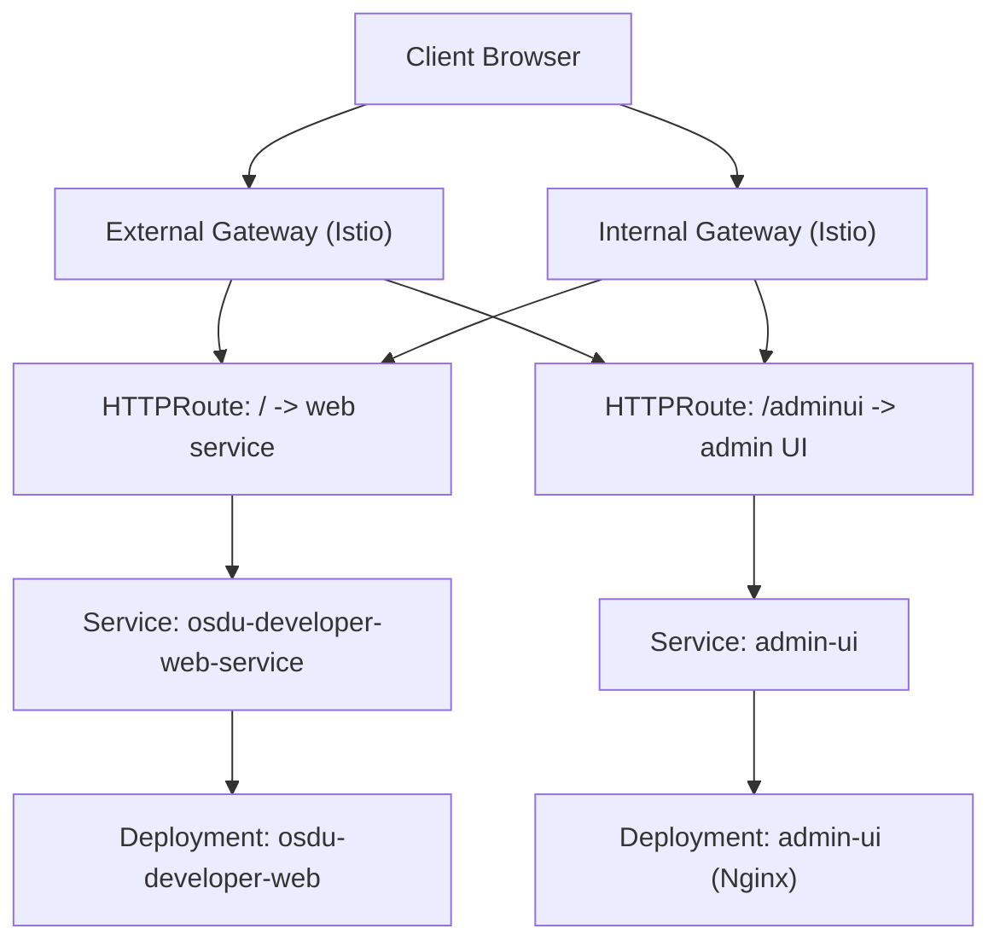
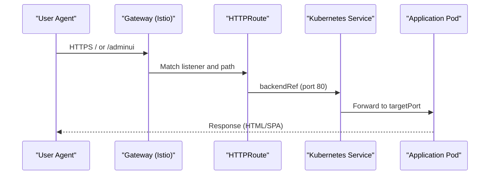
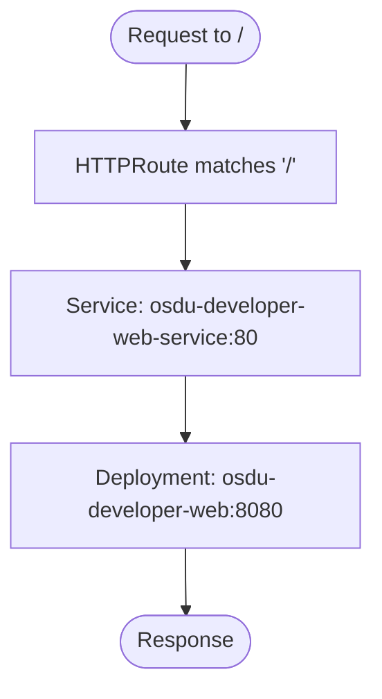
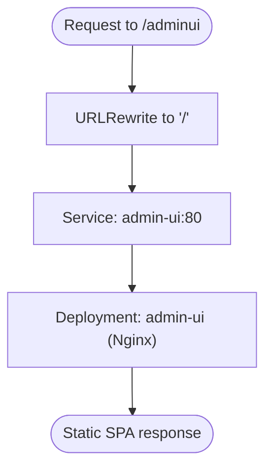
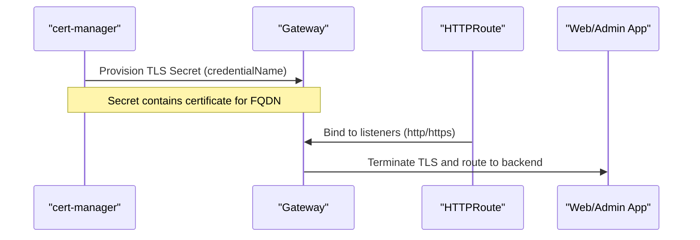
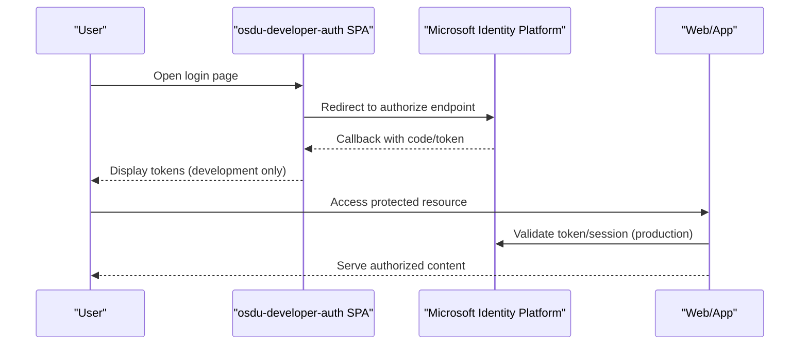
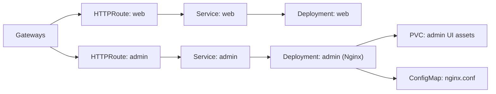

# Web Interface

<cite>
**Referenced Files in This Document**
- [httproute.yaml](file://software/applications/web-site/httproute.yaml)
- [ingress.yaml](file://software/applications/web-site/ingress.yaml)
- [web-site.yaml](file://software/applications/web-site/web-site.yaml)
- [httproute.yaml](file://software/experimental/admin-ui/httproute.yaml)
- [ingress.yaml](file://software/experimental/admin-ui/ingress.yaml)
- [release.yaml](file://software/experimental/admin-ui/release.yaml)
- [gateways.yaml](file://charts/istio-ingress/templates/gateways.yaml)
- [values.yaml](file://charts/istio-ingress/values.yaml)
- [certificate.yaml](file://charts/istio-ingress/templates/certificate.yaml)
- [config-map.yaml](file://charts/osdu-developer-auth/templates/config-map.yaml)
- [deployment.yaml](file://charts/osdu-developer-auth/templates/deployment.yaml)
- [web-site.yaml](file://charts/osdu-admin-ui/templates/web-site.yaml)
- [README.md](file://web/README.md)
</cite>

## Table of Contents
1. Introduction
2. Project Structure
3. Core Components
4. Architecture Overview
5. Detailed Component Analysis
6. Dependency Analysis
7. Performance Considerations
8. Troubleshooting Guide
9. Conclusion

## Introduction
This document explains how the main web site and the experimental admin UI are deployed and exposed, including ingress routing via Gateway API HTTPRoute, SSL/TLS termination with cert-manager, authentication integration with Microsoft Identity Platform, authorization policies, session handling, and customization options for branding and functionality extensions.

## Project Structure
The web interface is composed of:
- Main web site application served by a Kubernetes Deployment and Service, routed through an HTTPRoute to external and internal gateways.
- Experimental admin UI packaged as a Helm chart that builds static assets into a persistent volume and serves them via Nginx, also exposed through HTTPRoute.
- Ingress configuration provided by the istio-ingress chart which defines Gateways (HTTP/HTTPS) and TLS termination using secrets managed by cert-manager.
- Authentication helper SPA served by osdu-developer-auth to facilitate OAuth flows.

**Diagram sources**
- [httproute.yaml:1-24](file://software/applications/web-site/httproute.yaml#L1-L24)
- [httproute.yaml:1-28](file://software/experimental/admin-ui/httproute.yaml#L1-L28)
- [gateways.yaml:31-95](file://charts/istio-ingress/templates/gateways.yaml#L31-L95)
- [web-site.yaml:1-34](file://software/applications/web-site/web-site.yaml#L1-L34)
- [web-site.yaml:1-70](file://charts/osdu-admin-ui/templates/web-site.yaml#L1-L70)

**Section sources**
- [httproute.yaml:1-24](file://software/applications/web-site/httproute.yaml#L1-L24)
- [httproute.yaml:1-28](file://software/experimental/admin-ui/httproute.yaml#L1-L28)
- [gateways.yaml:1-96](file://charts/istio-ingress/templates/gateways.yaml#L1-L96)
- [web-site.yaml:1-34](file://software/applications/web-site/web-site.yaml#L1-L34)
- [web-site.yaml:1-70](file://charts/osdu-admin-ui/templates/web-site.yaml#L1-L70)

## Core Components
- Main web site:
  - Deployment and Service expose a containerized web app on port 8080 inside the pod and port 80 externally via Service.
  - HTTPRoute maps path prefix "/" to the web service on both external and internal gateways.
- Experimental admin UI:
  - Helm chart builds static content into a PVC and serves it via Nginx on port 80.
  - HTTPRoute maps "/adminui" to the admin UI service with URL rewrite to "/".
- Ingress/Gateways:
  - Istio-based Gateways define HTTP (80) and HTTPS (443) listeners.
  - TLS termination uses certificate secrets referenced from values; cert-manager provisions certificates.
- Authentication:
  - A small SPA hosted by osdu-developer-auth helps obtain tokens from Microsoft Identity Platform for development/testing.

**Section sources**
- [web-site.yaml:1-34](file://software/applications/web-site/web-site.yaml#L1-L34)
- [httproute.yaml:1-24](file://software/applications/web-site/httproute.yaml#L1-L24)
- [httproute.yaml:1-28](file://software/experimental/admin-ui/httproute.yaml#L1-L28)
- [gateways.yaml:31-95](file://charts/istio-ingress/templates/gateways.yaml#L31-L95)
- [config-map.yaml:1-169](file://charts/osdu-developer-auth/templates/config-map.yaml#L1-L169)
- [deployment.yaml:1-31](file://charts/osdu-developer-auth/templates/deployment.yaml#L1-L31)

## Architecture Overview
The request flow for both the main web site and the admin UI goes through Gateway API HTTPRoute resources bound to Istio Gateways. TLS is terminated at the gateway using secrets provisioned by cert-manager. The routes forward traffic to respective Services and Pods.

**Diagram sources**
- [gateways.yaml:31-95](file://charts/istio-ingress/templates/gateways.yaml#L31-L95)
- [httproute.yaml:1-24](file://software/applications/web-site/httproute.yaml#L1-L24)
- [httproute.yaml:1-28](file://software/experimental/admin-ui/httproute.yaml#L1-L28)

## Detailed Component Analysis

### Main Web Site
- Routing:
  - HTTPRoute binds to both external and internal gateways and forwards all requests under "/" to the web service.
- Service and Deployment:
  - Service exposes port 80 and targets container port 8080.
  - Deployment runs the official web image with one replica.
- Customization:
  - The web application source is available in the repository and can be rebuilt and redeployed to customize branding and behavior.

**Diagram sources**
- [httproute.yaml:1-24](file://software/applications/web-site/httproute.yaml#L1-L24)
- [web-site.yaml:1-34](file://software/applications/web-site/web-site.yaml#L1-L34)

**Section sources**
- [httproute.yaml:1-24](file://software/applications/web-site/httproute.yaml#L1-L24)
- [web-site.yaml:1-34](file://software/applications/web-site/web-site.yaml#L1-L34)
- [README.md:1-16](file://web/README.md#L1-L16)

### Experimental Admin UI
- Routing:
  - HTTPRoute matches "/adminui", rewrites to "/", and forwards to the admin UI service.
- Packaging and Serving:
  - Helm chart creates a ConfigMap with Nginx config, a PVC to store built artifacts, and a Deployment running Nginx serving from the PVC.
- Integration:
  - Values are injected via Flux HelmRelease from ConfigMaps and Secrets for runtime configuration such as redirect URIs and client identifiers.

**Diagram sources**
- [httproute.yaml:1-28](file://software/experimental/admin-ui/httproute.yaml#L1-L28)
- [web-site.yaml:1-70](file://charts/osdu-admin-ui/templates/web-site.yaml#L1-L70)

**Section sources**
- [httproute.yaml:1-28](file://software/experimental/admin-ui/httproute.yaml#L1-L28)
- [web-site.yaml:1-70](file://charts/osdu-admin-ui/templates/web-site.yaml#L1-L70)
- [release.yaml:1-54](file://software/experimental/admin-ui/release.yaml#L1-L54)

### Ingress and SSL Certificate Management
- Gateways:
  - External and internal Gateways expose HTTP (80) and HTTPS (443).
  - TLS termination references certificate secrets created by cert-manager.
- Certificates:
  - A Job prepares DNS and issues certificates; HTTP-01 challenges are supported via Gateway API.
- Values:
  - Default values enable both gateways and set credential names for TLS secrets.

**Diagram sources**
- [gateways.yaml:31-95](file://charts/istio-ingress/templates/gateways.yaml#L31-L95)
- [values.yaml:1-18](file://charts/istio-ingress/values.yaml#L1-L18)
- [certificate.yaml:1-8](file://charts/istio-ingress/templates/certificate.yaml#L1-L8)

**Section sources**
- [gateways.yaml:1-96](file://charts/istio-ingress/templates/gateways.yaml#L1-L96)
- [values.yaml:1-18](file://charts/istio-ingress/values.yaml#L1-L18)
- [certificate.yaml:1-8](file://charts/istio-ingress/templates/certificate.yaml#L1-L8)

### Authentication Integration and Session Management
- Development Auth Helper:
  - A small SPA served by osdu-developer-auth enables interactive OAuth flows with Microsoft Identity Platform for testing.
  - It constructs authorize URLs and displays returned tokens for inspection.
- Production Considerations:
  - For production, integrate your application with Microsoft Identity Platform using standard OAuth/OIDC flows. Configure redirect URIs and scopes according to your app’s needs.
- Session Handling:
  - The web application should manage sessions server-side or via secure cookies after successful authentication. Ensure CSRF protection and token storage best practices are applied.

**Diagram sources**
- [config-map.yaml:1-169](file://charts/osdu-developer-auth/templates/config-map.yaml#L1-L169)
- [deployment.yaml:1-31](file://charts/osdu-developer-auth/templates/deployment.yaml#L1-L31)

**Section sources**
- [config-map.yaml:1-169](file://charts/osdu-developer-auth/templates/config-map.yaml#L1-L169)
- [deployment.yaml:1-31](file://charts/osdu-developer-auth/templates/deployment.yaml#L1-L31)

### Authorization Policies
- Gateway-level access:
  - Both external and internal gateways allow routes from all namespaces by default. Restrict to specific namespaces if needed.
- Application-level authorization:
  - Enforce role-based or policy-based access control within the web application based on validated tokens and entitlements.

[No sources needed since this section provides general guidance]

### Customization Options
- Branding and UI:
  - Rebuild the main web site from source and redeploy to update branding, logos, and UI elements.
  - For the admin UI, rebuild static assets and repopulate the PVC used by Nginx.
- Functionality Extensions:
  - Extend the web application logic and add new endpoints or features, then redeploy the Deployment.
  - Use environment variables and ConfigMaps/Secrets to configure behavior without changing images.

**Section sources**
- [README.md:1-16](file://web/README.md#L1-L16)
- [web-site.yaml:1-70](file://charts/osdu-admin-ui/templates/web-site.yaml#L1-L70)

## Dependency Analysis
- HTTPRoute depends on Gateway definitions and TLS secrets.
- Web and Admin UI Services depend on their respective Deployments.
- Admin UI depends on a PVC for built assets and a ConfigMap for Nginx configuration.
- Authentication SPA depends on a ConfigMap containing HTML and JavaScript.

**Diagram sources**
- [gateways.yaml:31-95](file://charts/istio-ingress/templates/gateways.yaml#L31-L95)
- [httproute.yaml:1-24](file://software/applications/web-site/httproute.yaml#L1-L24)
- [httproute.yaml:1-28](file://software/experimental/admin-ui/httproute.yaml#L1-L28)
- [web-site.yaml:1-34](file://software/applications/web-site/web-site.yaml#L1-L34)
- [web-site.yaml:1-70](file://charts/osdu-admin-ui/templates/web-site.yaml#L1-L70)

**Section sources**
- [gateways.yaml:31-95](file://charts/istio-ingress/templates/gateways.yaml#L31-L95)
- [httproute.yaml:1-24](file://software/applications/web-site/httproute.yaml#L1-L24)
- [httproute.yaml:1-28](file://software/experimental/admin-ui/httproute.yaml#L1-L28)
- [web-site.yaml:1-34](file://software/applications/web-site/web-site.yaml#L1-L34)
- [web-site.yaml:1-70](file://charts/osdu-admin-ui/templates/web-site.yaml#L1-L70)

## Performance Considerations
- Keep replicas minimal for dev environments; scale out for production based on load.
- Use appropriate resource requests/limits in Deployments to ensure stable performance.
- Prefer HTTPS with proper caching headers for static assets to reduce bandwidth and improve latency.
- Monitor gateway and application metrics to identify bottlenecks.

[No sources needed since this section provides general guidance]

## Troubleshooting Guide
- TLS errors:
  - Verify that the Gateway references the correct secret name and that cert-manager has issued the certificate for the FQDN.
- Routing not working:
  - Confirm HTTPRoute parentRefs match the Gateway names and namespaces.
  - Check that backend services exist and ports match.
- Admin UI not loading:
  - Ensure the PVC is populated with built assets and Nginx is serving from the correct path.
  - Verify URL rewrite rules for "/adminui" to "/".
- Authentication issues:
  - Validate redirect URIs and scopes configured in the auth SPA or application.
  - Ensure Microsoft Identity Platform app registration matches your deployment.

**Section sources**
- [gateways.yaml:31-95](file://charts/istio-ingress/templates/gateways.yaml#L31-L95)
- [httproute.yaml:1-24](file://software/applications/web-site/httproute.yaml#L1-L24)
- [httproute.yaml:1-28](file://software/experimental/admin-ui/httproute.yaml#L1-L28)
- [web-site.yaml:1-70](file://charts/osdu-admin-ui/templates/web-site.yaml#L1-L70)
- [config-map.yaml:1-169](file://charts/osdu-developer-auth/templates/config-map.yaml#L1-L169)

## Conclusion
The web interface is exposed via Gateway API HTTPRoute with TLS termination at Istio Gateways. The main web site and experimental admin UI follow consistent patterns for routing, service exposure, and packaging. Authentication integrates with Microsoft Identity Platform, with a development SPA to simplify testing. Customize branding and extend functionality by rebuilding and redeploying the applications, and enforce authorization at the application layer.

[No sources needed since this section summarizes without analyzing specific files]