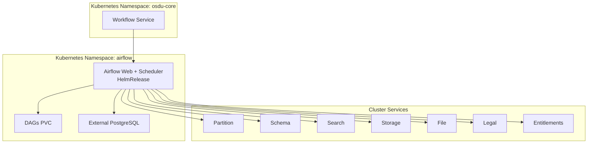
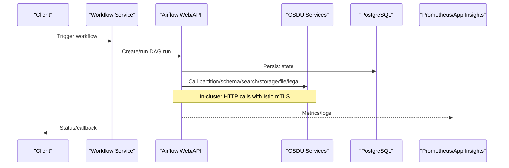
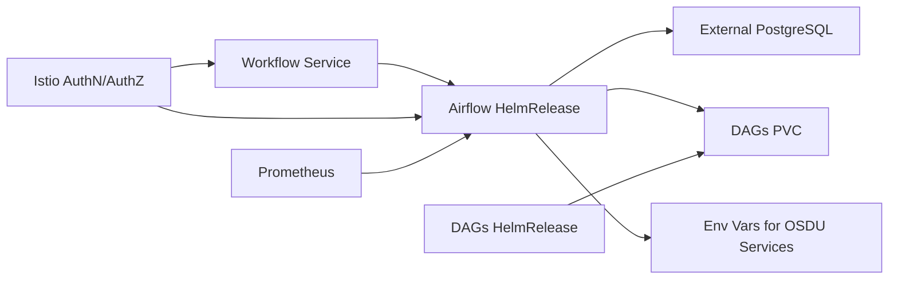

# Workflow Engine (Airflow)

<cite>
**Referenced Files in This Document**
- [release.yaml](file://software/components/airflow/release.yaml)
- [dag-jobs.yaml](file://software/components/airflow/dag-jobs.yaml)
- [config-map-airflow.yaml](file://charts/config-maps/templates/config-map-airflow.yaml)
- [workflow.yaml](file://software/applications/osdu-core/workflow.yaml)
- [services_core_workflow.md](file://docs/src/services_core_workflow.md)
- [services_core.md](file://docs/src/services_core.md)
- [prometheus.yaml](file://software/components/observability/prometheus.yaml)
- [peer-authentication.yaml](file://charts/osdu-developer-base/templates/peer-authentication.yaml)
- [request-authentication.yaml](file://charts/osdu-developer-base/templates/request-authentication.yaml)
- [envoy-filter.yaml](file://charts/osdu-developer-base/templates/envoy-filter.yaml)
- [auth-policy.yaml](file://charts/osdu-developer-service/templates/auth-policy.yaml)
- [README.md](file://charts/airflow-dags/README.md)
- [scripts README.md](file://charts/airflow-dags/scripts/README.md)
</cite>

## Table of Contents
1. [Introduction](#introduction)
2. [Project Structure](#project-structure)
3. [Core Components](#core-components)
4. [Architecture Overview](#architecture-overview)
5. [Detailed Component Analysis](#detailed-component-analysis)
6. [Dependency Analysis](#dependency-analysis)
7. [Performance Considerations](#performance-considerations)
8. [Troubleshooting Guide](#troubleshooting-guide)
9. [Conclusion](#conclusion)
10. [Appendices](#appendices)

## Introduction
This document explains how Apache Airflow is deployed and configured as the workflow engine within the OSDU platform. It covers DAG management, task orchestration with KubernetesExecutor, worker scaling via pod-based execution, integration with OSDU services (partition, schema, search, storage, file, legal, entitlements), security configurations (Istio mTLS, JWT authentication, Envoy filters), logging and metrics collection, and common troubleshooting steps for workflow execution issues.

## Project Structure
The Airflow deployment is managed through Flux HelmReleases that install:
- The official Apache Airflow chart with custom values for executor, persistence, external database, secrets, and environment variables.
- A dedicated HelmRelease to deploy and sync DAG artifacts into a persistent volume.
- Configuration injected via Azure App Configuration provider into a ConfigMap consumed by Airflow components.
- The OSDU workflow service that orchestrates workflows and calls into Airflow.

**Diagram sources**
- [release.yaml:34-215](file://software/components/airflow/release.yaml#L34-L215)
- [dag-jobs.yaml:41-56](file://software/components/airflow/dag-jobs.yaml#L41-L56)
- [workflow.yaml:70-144](file://software/applications/osdu-core/workflow.yaml#L70-L144)

**Section sources**
- [release.yaml:34-215](file://software/components/airflow/release.yaml#L34-L215)
- [dag-jobs.yaml:41-56](file://software/components/airflow/dag-jobs.yaml#L41-L56)
- [config-map-airflow.yaml:1-30](file://charts/config-maps/templates/config-map-airflow.yaml#L1-L30)
- [workflow.yaml:70-144](file://software/applications/osdu-core/workflow.yaml#L70-L144)

## Core Components
- Airflow runtime: Official chart with KubernetesExecutor, external PostgreSQL, Redis disabled, statsd enabled, RBAC and basic auth configured, high concurrency settings, and OSDU Python packages installed.
- DAG provisioning: Separate HelmRelease pulls DAG archives from GitLab repositories and writes them to a shared PVC for Airflow to discover.
- Configuration injection: Azure App Configuration Provider creates a ConfigMap containing Airflow configuration values; refresh interval configured for dynamic updates.
- Integration with OSDU services: Environment variables point Airflow tasks to internal cluster endpoints for partition, schema, search, storage, file, legal, and dataset services.
- Workflow service: Deploys the ingestion-workflow service which integrates with Airflow and uses Key Vault and Application Insights.

Key implementation references:
- Airflow chart values and environment variables are defined in the main HelmRelease.
- DAG artifacts are sourced and persisted via the DAGs HelmRelease.
- ConfigMap generation via Azure App Configuration Provider is templated in the config map template.
- OSDU service endpoints are set as environment variables for Airflow tasks.

**Section sources**
- [release.yaml:34-215](file://software/components/airflow/release.yaml#L34-L215)
- [dag-jobs.yaml:41-56](file://software/components/airflow/dag-jobs.yaml#L41-L56)
- [config-map-airflow.yaml:1-30](file://charts/config-maps/templates/config-map-airflow.yaml#L1-L30)
- [workflow.yaml:70-144](file://software/applications/osdu-core/workflow.yaml#L70-L144)

## Architecture Overview
The system deploys Airflow using KubernetesExecutor so each task runs as an isolated pod. Tasks call OSDU core services via in-cluster DNS. The workflow service triggers or manages workflows and can invoke Airflow programmatically. Security is enforced by Istio mTLS and JWT-based request authentication, with Envoy filters enriching requests with user and app identity headers.

**Diagram sources**
- [workflow.yaml:70-144](file://software/applications/osdu-core/workflow.yaml#L70-L144)
- [release.yaml:34-215](file://software/components/airflow/release.yaml#L34-L215)
- [prometheus.yaml:39-53](file://software/components/observability/prometheus.yaml#L39-L53)

## Detailed Component Analysis

### Airflow Runtime and Orchestration
- Executor: KubernetesExecutor enables scalable task execution by spawning pods per task.
- Concurrency: High parallelism and DAG concurrency values are set to support large-scale workloads.
- Persistence: DAGs and logs are backed by PersistentVolumeClaims; metadata stored in external PostgreSQL.
- Secrets and keys: Fernet and webserver secret keys are sourced from existing secrets; admin credentials from secrets.
- Packages: OSDU Python SDKs and providers are installed via extraPipPackages for both the base image and kubernetesPodTemplate.

Operational notes:
- External database connection details and password secret are provided.
- StatsD is enabled for metrics collection.
- RBAC and basic auth are enabled for the web server.

**Section sources**
- [release.yaml:34-215](file://software/components/airflow/release.yaml#L34-L215)

### DAG Management
- Two DAG sources are configured:
  - Manifest DAGs pulled from a GitLab archive and compressed before writing to PVC.
  - CSV parser DAGs similarly pulled and mounted into the Airflow DAGs directory.
- A separate HelmRelease handles these jobs and depends on secrets and config maps being available.

Operational notes:
- PVC name is specified for DAG persistence.
- Scripts exist to assist with local testing and replacement of placeholders for service endpoints and identities.

**Section sources**
- [dag-jobs.yaml:41-56](file://software/components/airflow/dag-jobs.yaml#L41-L56)
- [README.md:104-115](file://charts/airflow-dags/README.md#L104-L115)
- [scripts README.md:1-68](file://charts/airflow-dags/scripts/README.md#L1-L68)

### Configuration Injection via Azure App Configuration
- An AzureAppConfigurationProvider resource generates a ConfigMap named airflow-configmap from Azure App Configuration using workload identity.
- Refresh is enabled with a one-minute interval and monitoring key values configured.

Operational notes:
- The ConfigMap data is templated as YAML with a dot separator for nested keys.
- Workload identity service account is used for secure access.

**Section sources**
- [config-map-airflow.yaml:1-30](file://charts/config-maps/templates/config-map-airflow.yaml#L1-L30)

### Integration with OSDU Services
- Airflow tasks receive environment variables pointing to internal service endpoints for partition, schema, search, storage, file, legal, and dataset services.
- The workflow service is configured with its own environment variables including Key Vault URI, Application Insights, and Airflow URL.

Operational notes:
- These variables enable tasks to authenticate and communicate with OSDU services securely within the mesh.

**Section sources**
- [release.yaml:133-201](file://software/components/airflow/release.yaml#L133-L201)
- [workflow.yaml:70-144](file://software/applications/osdu-core/workflow.yaml#L70-L144)
- [services_core_workflow.md:15-39](file://docs/src/services_core_workflow.md#L15-L39)
- [services_core.md:358-382](file://docs/src/services_core.md#L358-L382)

### Security Configuration
- Istio PeerAuthentication is set to PERMISSIVE mode to allow gradual enforcement of mTLS.
- RequestAuthentication validates JWT tokens from Microsoft Entra ID issuers and forwards payloads to headers.
- AuthorizationPolicy denies unauthenticated requests except for explicitly allowed paths.
- EnvoyFilter injects x-user-id and x-app-id headers based on JWT claims and issuer, handling both v1 and v2 token formats and special cases for management audience.

Operational notes:
- Ensure OIDC audiences and issuers match your tenant configuration.
- Use AuthorizationPolicy to restrict access to sensitive endpoints while allowing health checks and public assets.

**Section sources**
- [peer-authentication.yaml:1-7](file://charts/osdu-developer-base/templates/peer-authentication.yaml#L1-L7)
- [request-authentication.yaml:1-33](file://charts/osdu-developer-base/templates/request-authentication.yaml#L1-L33)
- [auth-policy.yaml:1-28](file://charts/osdu-developer-service/templates/auth-policy.yaml#L1-L28)
- [envoy-filter.yaml:1-143](file://charts/osdu-developer-base/templates/envoy-filter.yaml#L1-L143)

### Logging and Monitoring
- Airflow logs are persisted to a PVC and can be inspected via Kubernetes logs.
- StatsD is enabled for metrics collection.
- Prometheus is deployed with scrape configs for Kubernetes services and pods; retention and readiness/liveness probes are configured.
- Application Insights keys are referenced in environment variables for telemetry.

Operational notes:
- Verify Prometheus targets include Airflow components if exposing metrics endpoints.
- Use Kubernetes log commands to inspect scheduler, web, and task pods.

**Section sources**
- [release.yaml:203-215](file://software/components/airflow/release.yaml#L203-L215)
- [prometheus.yaml:39-53](file://software/components/observability/prometheus.yaml#L39-L53)
- [workflow.yaml:79-86](file://software/applications/osdu-core/workflow.yaml#L79-L86)

### Worker Scaling
- With KubernetesExecutor, each task runs as a separate pod, enabling horizontal scaling by increasing concurrent tasks and DAG runs.
- Affinity and topology spread constraints distribute pods across node pools and zones for resilience.
- Tolerations allow scheduling onto specific nodes labeled for application use.

Operational notes:
- Tune AIRFLOW__CORE__PARALLELISM, AIRFLOW__CORE__MAX_ACTIVE_RUNS_PER_DAG, and AIRFLOW__CORE__DAG_CONCURRENCY according to cluster capacity.
- Monitor pod autoscaling and resource limits to avoid overcommitting nodes.

**Section sources**
- [release.yaml:47-129](file://software/components/airflow/release.yaml#L47-L129)
- [release.yaml:277-301](file://software/components/airflow/release.yaml#L277-L301)

## Dependency Analysis
The following diagram shows key dependencies between components:

**Diagram sources**
- [release.yaml:34-215](file://software/components/airflow/release.yaml#L34-L215)
- [dag-jobs.yaml:41-56](file://software/components/airflow/dag-jobs.yaml#L41-L56)
- [workflow.yaml:70-144](file://software/applications/osdu-core/workflow.yaml#L70-L144)
- [peer-authentication.yaml:1-7](file://charts/osdu-developer-base/templates/peer-authentication.yaml#L1-L7)
- [request-authentication.yaml:1-33](file://charts/osdu-developer-base/templates/request-authentication.yaml#L1-L33)
- [auth-policy.yaml:1-28](file://charts/osdu-developer-service/templates/auth-policy.yaml#L1-L28)
- [prometheus.yaml:39-53](file://software/components/observability/prometheus.yaml#L39-L53)

**Section sources**
- [release.yaml:34-215](file://software/components/airflow/release.yaml#L34-L215)
- [dag-jobs.yaml:41-56](file://software/components/airflow/dag-jobs.yaml#L41-L56)
- [workflow.yaml:70-144](file://software/applications/osdu-core/workflow.yaml#L70-L144)

## Performance Considerations
- Concurrency tuning: Adjust parallelism and DAG concurrency to match cluster resources and task durations.
- Executor choice: KubernetesExecutor provides scalability but increases pod churn; ensure sufficient node capacity and appropriate resource requests/limits.
- Storage: Use ReadWriteMany PVCs for logs and DAGs to support multiple workers reading/writing concurrently.
- Metrics: Enable StatsD and verify Prometheus scraping to monitor throughput and latency.
- Network: Leverage Istio mTLS and efficient in-cluster DNS for low-latency service calls.

[No sources needed since this section provides general guidance]

## Troubleshooting Guide
Common issues and diagnostics:
- DAG not discovered:
  - Verify DAGs PVC is mounted and populated by the DAGs HelmRelease jobs.
  - Check job logs for download and compression errors.
- Task fails to start:
  - Inspect scheduler and worker pod logs for executor errors.
  - Confirm environment variables for OSDU service endpoints are correct.
- Authentication failures:
  - Validate Istio RequestAuthentication and AuthorizationPolicy rules.
  - Ensure JWT audiences and issuers match your tenant and client IDs.
  - Review Envoy filter logs for header injection behavior.
- Configuration not applied:
  - Confirm Azure App Configuration Provider created airflow-configmap and refresh intervals.
  - Check selectors and labels for key filtering.
- Observability gaps:
  - Verify Prometheus scrape targets include Airflow components.
  - Ensure Application Insights keys are present in environment variables.

Useful commands and references:
- Inspect DAG upload job logs and describe ConfigMaps/Secrets for verification.
- Reference scripts README for manual testing and environment variable replacement examples.

**Section sources**
- [README.md:104-115](file://charts/airflow-dags/README.md#L104-L115)
- [scripts README.md:1-68](file://charts/airflow-dags/scripts/README.md#L1-L68)
- [config-map-airflow.yaml:1-30](file://charts/config-maps/templates/config-map-airflow.yaml#L1-L30)
- [request-authentication.yaml:1-33](file://charts/osdu-developer-base/templates/request-authentication.yaml#L1-L33)
- [auth-policy.yaml:1-28](file://charts/osdu-developer-service/templates/auth-policy.yaml#L1-L28)
- [envoy-filter.yaml:1-143](file://charts/osdu-developer-base/templates/envoy-filter.yaml#L1-L143)

## Conclusion
Airflow is deployed as a scalable, secure workflow engine integrated with OSDU services. KubernetesExecutor enables horizontal scaling, while Istio enforces strong security policies. Configuration is dynamically injected via Azure App Configuration, and observability is provided through Prometheus and Application Insights. Proper tuning of concurrency, storage, and network policies ensures reliable and performant workflow execution.

[No sources needed since this section summarizes without analyzing specific files]

## Appendices

### Common Workflow Patterns
- Manifest ingestion:
  - Triggered by the workflow service; uses Airflow DAGs to orchestrate ingestion tasks against storage, schema, and search services.
- CSV parsing:
  - Uses CSV parser DAGs to process datasets, write results to storage, and update indexes.
- Data validation and enrichment:
  - Tasks call partition and entitlements services to validate context and permissions before processing.

Implementation references:
- DAG sources and persistence via DAGs HelmRelease.
- Environment variables for service endpoints in Airflow runtime.

**Section sources**
- [dag-jobs.yaml:41-56](file://software/components/airflow/dag-jobs.yaml#L41-L56)
- [release.yaml:133-201](file://software/components/airflow/release.yaml#L133-L201)