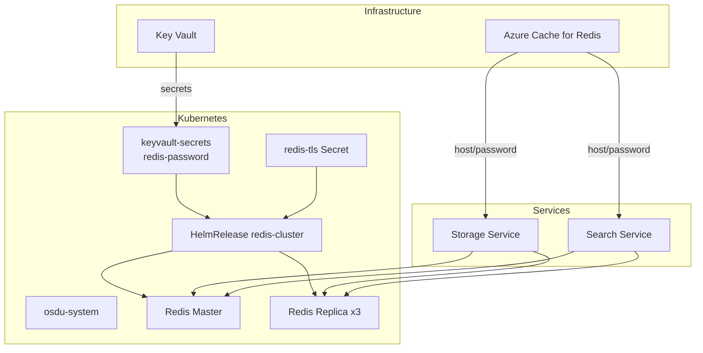
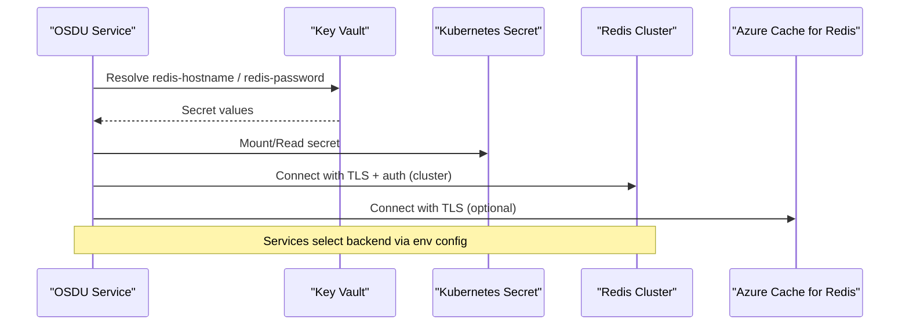
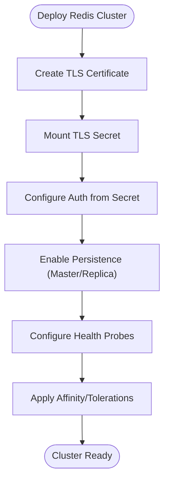
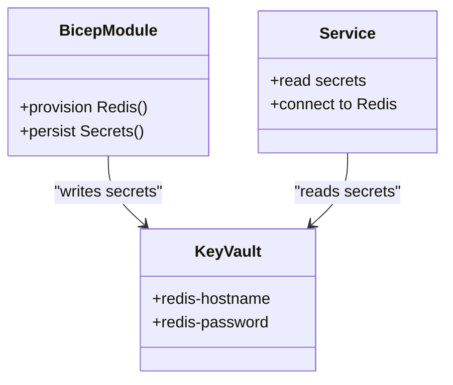
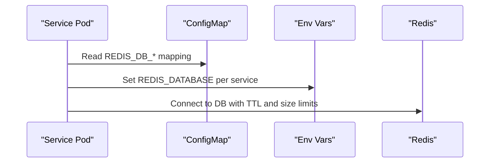
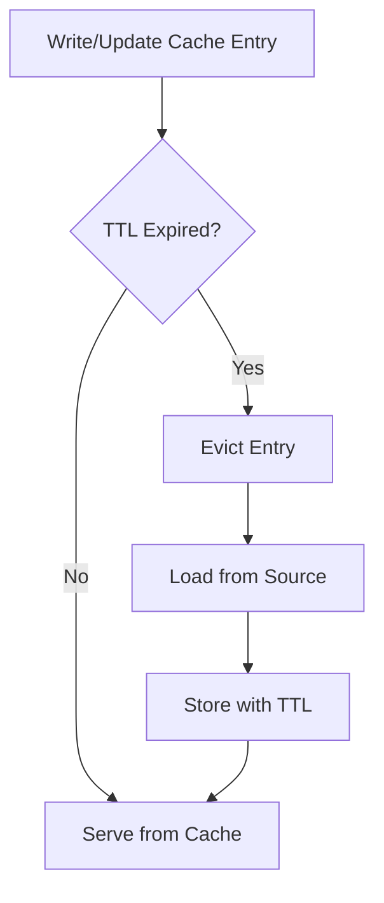
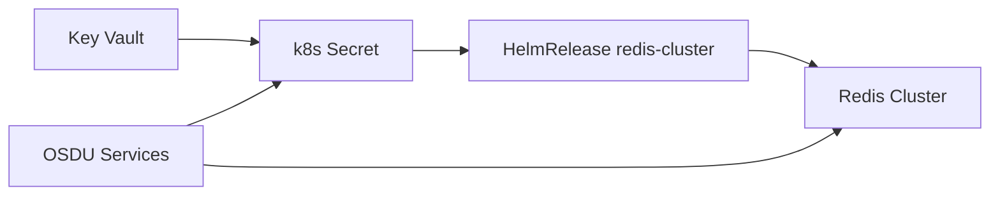

# Caching Systems

<cite>
**Referenced Files in This Document**
- [cache.yaml](file://software/components/osdu-system/cache.yaml)
- [main.bicep](file://bicep/main.bicep)
- [keyvault_secrets.bicep](file://bicep/modules/keyvault_secrets.bicep)
- [config-map.yaml](file://charts/osdu-developer-base/templates/config-map.yaml)
- [storage.yaml](file://software/applications/osdu-core/storage.yaml)
- [search.yaml](file://software/applications/osdu-core/search.yaml)
- [services_core_search.md](file://docs/src/services_core_search.md)
</cite>

## Table of Contents
1. Introduction
2. Project Structure
3. Core Components
4. Architecture Overview
5. Detailed Component Analysis
6. Dependency Analysis
7. Performance Considerations
8. Troubleshooting Guide
9. Conclusion

## Introduction
This document describes the caching infrastructure used by OSDU services, focusing on Redis deployment options (Azure Cache for Redis and in-cluster Redis Cluster), memory and persistence configuration, cache invalidation strategies via TTLs, clustering and security settings, integration patterns with OSDU services, performance tuning parameters, and monitoring setup for cache hit rates and memory usage.

## Project Structure
Caching is provisioned through two complementary paths:
- Azure-managed Redis Cache for shared or external access
- In-cluster Redis Cluster deployed via Helm/Flux for high availability within Kubernetes

Secrets for Redis are stored in Azure Key Vault and injected into the cluster as Kubernetes secrets consumed by applications and the Redis Helm chart.

**Diagram sources**
- [cache.yaml:1-172](file://software/components/osdu-system/cache.yaml#L1-L172)
- [main.bicep:259-279](file://bicep/main.bicep#L259-L279)
- [keyvault_secrets.bicep:29-49](file://bicep/modules/keyvault_secrets.bicep#L29-L49)
- [storage.yaml:115-140](file://software/applications/osdu-core/storage.yaml#L115-L140)
- [search.yaml:106-113](file://software/applications/osdu-core/search.yaml#L106-L113)

**Section sources**
- [cache.yaml:1-172](file://software/components/osdu-system/cache.yaml#L1-L172)
- [main.bicep:259-279](file://bicep/main.bicep#L259-L279)
- [keyvault_secrets.bicep:29-49](file://bicep/modules/keyvault_secrets.bicep#L29-L49)

## Core Components
- Redis Cluster (in-cluster): Deployed via Bitnami Redis Helm chart with cluster mode enabled, TLS, authentication from Key Vault-backed secret, and persistent volumes for master and replicas.
- Azure Cache for Redis: Provisioned via Bicep module; host and password are persisted to Key Vault and referenced by services.
- Secrets Management: Key Vault secrets (redis-hostname, redis-password) are synced into a Kubernetes secret consumed by both services and Redis Helm chart.
- Service Integration: Storage and Search services configure Redis database numbers and TTLs per service.

Key configuration highlights:
- Cluster mode enabled with 3 replicas
- TLS enabled with cert-manager managed certificate
- Authentication using existing secret key for password
- Persistence enabled with ReadWriteOnce volumes
- Services use separate Redis databases per component

**Section sources**
- [cache.yaml:57-172](file://software/components/osdu-system/cache.yaml#L57-L172)
- [main.bicep:259-279](file://bicep/main.bicep#L259-L279)
- [keyvault_secrets.bicep:29-49](file://bicep/modules/keyvault_secrets.bicep#L29-L49)
- [config-map.yaml:7-15](file://charts/osdu-developer-base/templates/config-map.yaml#L7-L15)
- [storage.yaml:115-140](file://software/applications/osdu-core/storage.yaml#L115-L140)
- [search.yaml:106-113](file://software/applications/osdu-core/search.yaml#L106-L113)

## Architecture Overview
The architecture supports two Redis backends:
- In-cluster Redis Cluster for internal OSDU services with TLS and persistence
- Azure Cache for Redis for scenarios requiring external/shared caching

Services connect to either backend based on environment configuration. Secrets are centrally managed in Key Vault and injected securely.

**Diagram sources**
- [keyvault_secrets.bicep:29-49](file://bicep/modules/keyvault_secrets.bicep#L29-L49)
- [cache.yaml:80-93](file://software/components/osdu-system/cache.yaml#L80-L93)
- [storage.yaml:115-140](file://software/applications/osdu-core/storage.yaml#L115-L140)
- [search.yaml:106-113](file://software/applications/osdu-core/search.yaml#L106-L113)

## Detailed Component Analysis

### Redis Cluster Deployment and Security
- Cluster mode enabled with 3 replicas for HA
- TLS enabled; certificates issued by cert-manager and mounted as a secret
- Authentication configured using an existing secret containing the Redis password
- Liveness/readiness probes configured for master and replica pods
- Persistent storage enabled for both master and replicas with ReadWriteOnce access mode
- Node affinity and tolerations constrain placement across zones and pools

**Diagram sources**
- [cache.yaml:1-15](file://software/components/osdu-system/cache.yaml#L1-L15)
- [cache.yaml:80-172](file://software/components/osdu-system/cache.yaml#L80-L172)

**Section sources**
- [cache.yaml:57-172](file://software/components/osdu-system/cache.yaml#L57-L172)

### Azure Cache for Redis Provisioning and Secrets
- Azure Cache for Redis provisioned via Bicep module with Basic SKU and non-SSL port enabled
- Hostname and primary key are written to Key Vault as secrets
- These secrets are consumed by services and/or in-cluster components

**Diagram sources**
- [main.bicep:259-279](file://bicep/main.bicep#L259-L279)
- [keyvault_secrets.bicep:29-49](file://bicep/modules/keyvault_secrets.bicep#L29-L49)

**Section sources**
- [main.bicep:259-279](file://bicep/main.bicep#L259-L279)
- [keyvault_secrets.bicep:29-49](file://bicep/modules/keyvault_secrets.bicep#L29-L49)

### Service Integration Patterns
- Storage service uses a dedicated Redis database number and references Key Vault keys for host and password
- Search service uses its own Redis database number and sets cache expiration and max value size
- A central ConfigMap defines per-service Redis database assignments to avoid collisions

**Diagram sources**
- [config-map.yaml:7-15](file://charts/osdu-developer-base/templates/config-map.yaml#L7-L15)
- [storage.yaml:115-140](file://software/applications/osdu-core/storage.yaml#L115-L140)
- [search.yaml:106-113](file://software/applications/osdu-core/search.yaml#L106-L113)

**Section sources**
- [config-map.yaml:7-15](file://charts/osdu-developer-base/templates/config-map.yaml#L7-L15)
- [storage.yaml:115-140](file://software/applications/osdu-core/storage.yaml#L115-L140)
- [search.yaml:106-113](file://software/applications/osdu-core/search.yaml#L106-L113)

### Cache Invalidation Strategies
- Per-service TTLs control cache lifetime and ensure timely invalidation
- Elastic cache expiration and maximum cache value size are set for search-related caches
- Separate Redis databases isolate data per service, reducing cross-service invalidation complexity

**Diagram sources**
- [search.yaml:110-113](file://software/applications/osdu-core/search.yaml#L110-L113)
- [services_core_search.md:32-35](file://docs/src/services_core_search.md#L32-L35)

**Section sources**
- [search.yaml:110-113](file://software/applications/osdu-core/search.yaml#L110-L113)
- [services_core_search.md:32-35](file://docs/src/services_core_search.md#L32-L35)

### Clustering Options
- In-cluster Redis Cluster with 3 replicas for horizontal scaling and resilience
- Zone-aware scheduling via node affinity and tolerations
- Optional Azure Cache for Redis for external/shared caching needs

**Section sources**
- [cache.yaml:80-172](file://software/components/osdu-system/cache.yaml#L80-L172)
- [main.bicep:259-279](file://bicep/main.bicep#L259-L279)

### Security Configuration
- TLS enabled for Redis with cert-manager managed certificates
- Authentication via secret-based password
- Secrets sourced from Key Vault and mounted into pods

**Section sources**
- [cache.yaml:1-15](file://software/components/osdu-system/cache.yaml#L1-L15)
- [cache.yaml:80-93](file://software/components/osdu-system/cache.yaml#L80-L93)
- [keyvault_secrets.bicep:29-49](file://bicep/modules/keyvault_secrets.bicep#L29-L49)

## Dependency Analysis
- Redis Cluster depends on TLS secret and Key Vault-backed password secret
- Services depend on Key Vault secrets for Redis host and password
- Central ConfigMap provides consistent Redis database assignments per service

**Diagram sources**
- [cache.yaml:19-46](file://software/components/osdu-system/cache.yaml#L19-L46)
- [cache.yaml:57-93](file://software/components/osdu-system/cache.yaml#L57-L93)
- [config-map.yaml:7-15](file://charts/osdu-developer-base/templates/config-map.yaml#L7-L15)
- [storage.yaml:115-140](file://software/applications/osdu-core/storage.yaml#L115-L140)
- [search.yaml:106-113](file://software/applications/osdu-core/search.yaml#L106-L113)

**Section sources**
- [cache.yaml:19-93](file://software/components/osdu-system/cache.yaml#L19-L93)
- [config-map.yaml:7-15](file://charts/osdu-developer-base/templates/config-map.yaml#L7-L15)
- [storage.yaml:115-140](file://software/applications/osdu-core/storage.yaml#L115-L140)
- [search.yaml:106-113](file://software/applications/osdu-core/search.yaml#L106-L113)

## Performance Considerations
- Use separate Redis databases per service to reduce contention and simplify invalidation
- Configure appropriate TTLs per service to balance freshness and load
- Tune max cache value sizes to prevent oversized entries
- Enable persistence for durability at the cost of I/O overhead
- Ensure sufficient CPU/memory requests for Redis pods and services
- Monitor cache hit rates and memory usage via observability tools

[No sources needed since this section provides general guidance]

## Troubleshooting Guide
Common issues and checks:
- TLS connectivity failures: verify cert-manager issued certificate and that clients trust the CA
- Authentication errors: confirm Key Vault secret contains correct password and is mounted correctly
- Database conflicts: ensure each service uses its designated Redis database number
- High memory usage: review TTLs and max cache value sizes; consider eviction policies if exposed
- Cluster health: check liveness/readiness probes and pod events for scheduling constraints

Actionable references:
- Verify TLS and auth settings in Redis Helm values
- Validate Key Vault secret names and keys used by services
- Confirm per-service Redis database assignments in ConfigMap and service manifests

**Section sources**
- [cache.yaml:80-93](file://software/components/osdu-system/cache.yaml#L80-L93)
- [config-map.yaml:7-15](file://charts/osdu-developer-base/templates/config-map.yaml#L7-L15)
- [storage.yaml:115-140](file://software/applications/osdu-core/storage.yaml#L115-L140)
- [search.yaml:106-113](file://software/applications/osdu-core/search.yaml#L106-L113)

## Conclusion
OSDU’s caching infrastructure combines an in-cluster Redis Cluster with optional Azure Cache for Redis, secured by TLS and Key Vault-backed secrets. Services integrate via isolated Redis databases and controlled TTLs to manage invalidation and performance. Monitoring and proper sizing ensure reliability and scalability across environments.