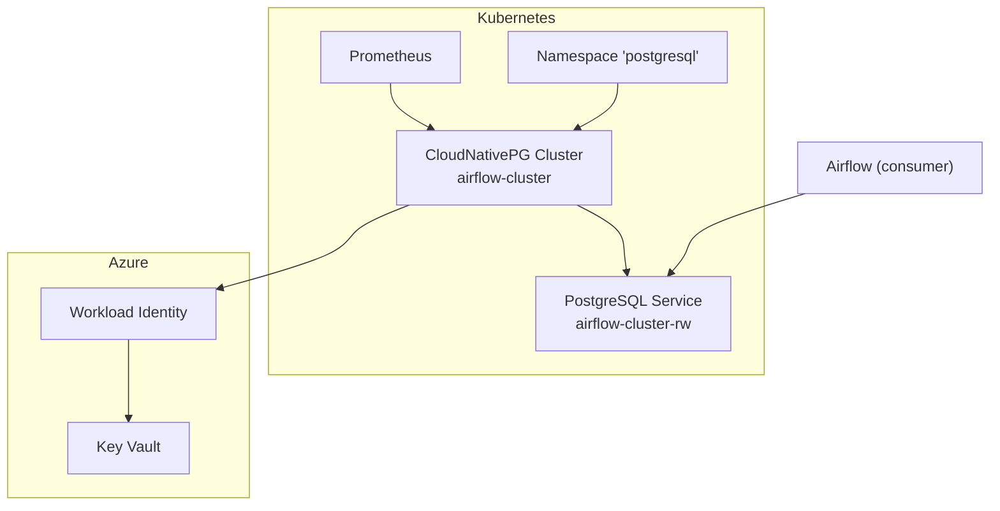
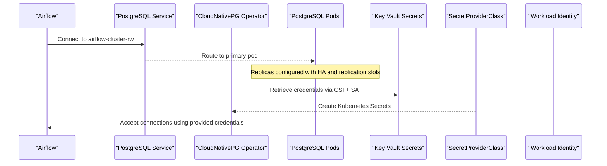
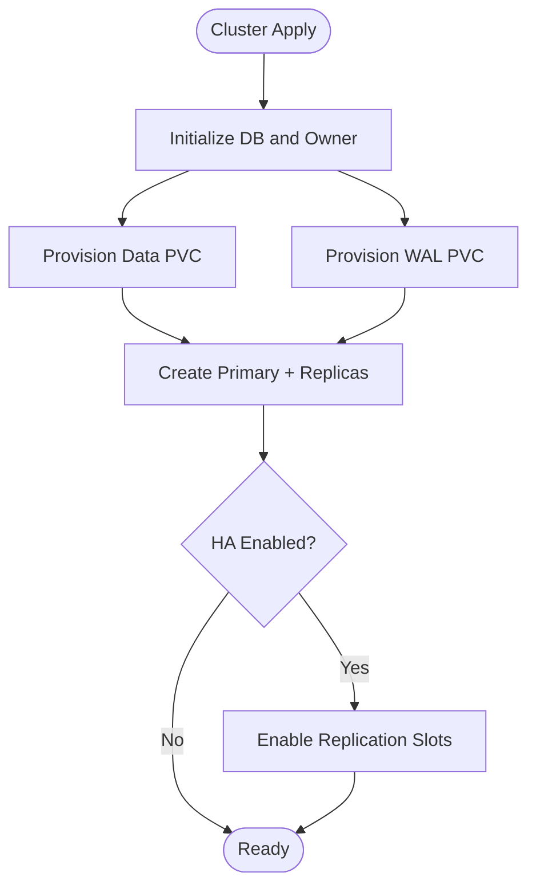
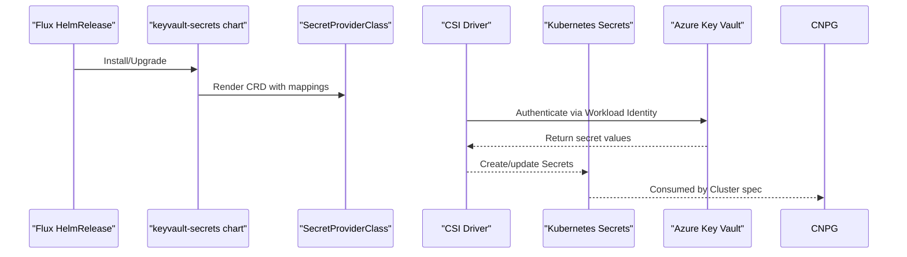
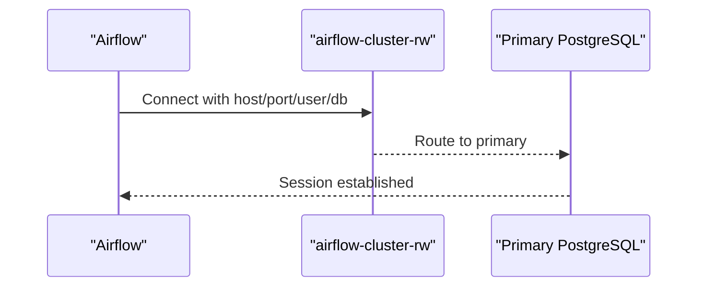
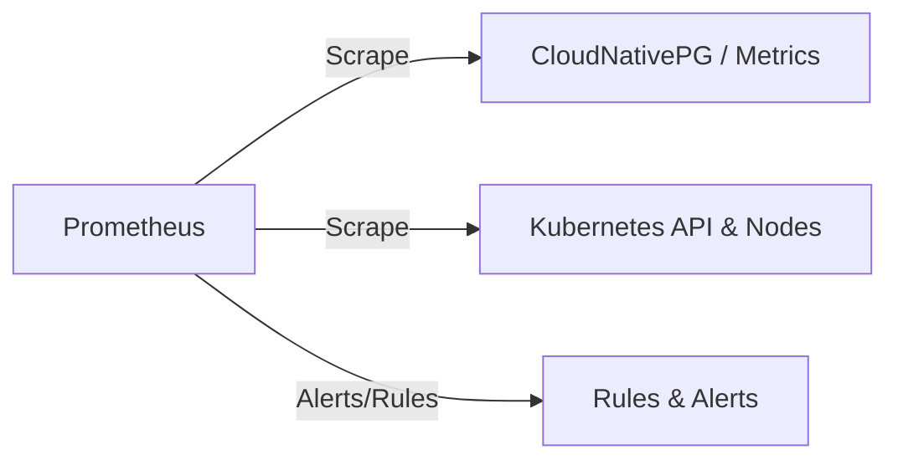
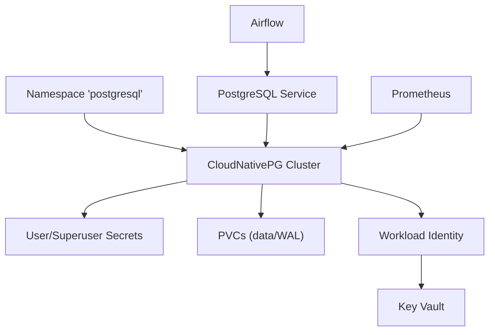

# Database Components

<cite>
**Referenced Files in This Document**
- [postgresql.yaml](file://software/components/database/postgresql.yaml)
- [namespace.yaml](file://software/components/database/namespace.yaml)
- [vault-secrets.yaml](file://software/components/database/vault-secrets.yaml)
- [kv-secrets.yaml](file://charts/keyvault-secrets/templates/kv-secrets.yaml)
- [values.yaml](file://charts/keyvault-secrets/values.yaml)
- [database.yaml](file://software/components/osdu-system/database.yaml)
- [release.yaml](file://software/components/airflow/release.yaml)
- [prometheus.yaml](file://software/components/observability/prometheus.yaml)
</cite>

## Table of Contents
1. Introduction
2. Project Structure
3. Core Components
4. Architecture Overview
5. Detailed Component Analysis
6. Dependency Analysis
7. Performance Considerations
8. Troubleshooting Guide
9. Conclusion

## Introduction
This document describes the database infrastructure components for a PostgreSQL-based deployment within Kubernetes. It covers namespace isolation, secret management via Azure Key Vault, instance specifications, storage configuration, connection parameters, security settings, monitoring setup, health checks, and scaling considerations. The deployment uses CloudNativePG to manage the PostgreSQL cluster and integrates with Azure Workload Identity and Key Vault for secure credential handling.

## Project Structure
The database stack is organized into focused Kubernetes manifests and Helm charts:
- Namespace isolation for the database workload
- CloudNativePG Cluster definition for PostgreSQL
- Flux-managed HelmRelease resources that populate Kubernetes Secrets from Azure Key Vault
- A shared chart template that provisions SecretProviderClass objects for CSI integration
- Consumer application configuration (Airflow) connecting to the external PostgreSQL service

**Diagram sources**
- [postgresql.yaml:1-89](file://software/components/database/postgresql.yaml#L1-L89)
- [namespace.yaml:1-6](file://software/components/database/namespace.yaml#L1-L6)
- [release.yaml:220-241](file://software/components/airflow/release.yaml#L220-L241)
- [prometheus.yaml:39-53](file://software/components/observability/prometheus.yaml#L39-L53)

**Section sources**
- [namespace.yaml:1-6](file://software/components/database/namespace.yaml#L1-L6)
- [postgresql.yaml:1-89](file://software/components/database/postgresql.yaml#L1-L89)

## Core Components
- Namespace isolation: A dedicated namespace isolates database resources and labels them for tenant scoping.
- PostgreSQL cluster: Managed by CloudNativePG with high availability, replication slots, zone-aware scheduling, and separate WAL storage.
- Secret management: Azure Key Vault-backed secrets are provisioned into Kubernetes using a SecretProviderClass and exposed as standard Kubernetes Secrets consumed by the cluster and applications.
- Monitoring: Prometheus is deployed to scrape metrics; PodMonitor support is available for CloudNativePG.

**Section sources**
- [namespace.yaml:1-6](file://software/components/database/namespace.yaml#L1-L6)
- [postgresql.yaml:1-89](file://software/components/database/postgresql.yaml#L1-L89)
- [vault-secrets.yaml:1-69](file://software/components/database/vault-secrets.yaml#L1-L69)
- [kv-secrets.yaml:1-30](file://charts/keyvault-secrets/templates/kv-secrets.yaml#L1-L30)
- [prometheus.yaml:39-53](file://software/components/observability/prometheus.yaml#L39-L53)

## Architecture Overview
The architecture deploys a highly available PostgreSQL cluster using CloudNativePG. Credentials are sourced from Azure Key Vault and mounted into the cluster via Kubernetes Secrets. Applications connect to the read-write endpoint provided by the cluster service. Monitoring is enabled through Prometheus and optional PodMonitor for database metrics.

**Diagram sources**
- [release.yaml:220-241](file://software/components/airflow/release.yaml#L220-L241)
- [postgresql.yaml:1-89](file://software/components/database/postgresql.yaml#L1-L89)
- [vault-secrets.yaml:1-69](file://software/components/database/vault-secrets.yaml#L1-L69)
- [kv-secrets.yaml:1-30](file://charts/keyvault-secrets/templates/kv-secrets.yaml#L1-L30)

## Detailed Component Analysis

### Namespace Isolation
- Purpose: Isolates database workloads and applies tenant labeling for policy enforcement and observability.
- Key aspects:
  - Namespace name: postgresql
  - Labeling for tenant identification

**Section sources**
- [namespace.yaml:1-6](file://software/components/database/namespace.yaml#L1-L6)

### PostgreSQL Cluster Configuration
- Instance count and HA:
  - Three instances with synchronous replication configured for durability.
  - Replication slots enabled for high availability and safe failover.
- Storage:
  - Data volume and WAL volume both provisioned with ReadWriteOnce access modes and premium managed storage class.
  - Separate WAL storage improves performance and recovery characteristics.
- Bootstrap and credentials:
  - Initial database and owner defined at bootstrap.
  - User credentials sourced from a Kubernetes Secret populated by Key Vault.
  - Superuser credentials also sourced from a separate Secret.
- Security:
  - pg_hba rule allows password-based connections for the application database user.
  - Workload Identity annotations enable secure access to Azure Key Vault without long-lived secrets.
- Scheduling and resilience:
  - Topology spread constraints across zones to distribute replicas.
  - Tolerations allow scheduling on designated node pools.
- Monitoring:
  - PodMonitor can be enabled to expose metrics to Prometheus.

**Diagram sources**
- [postgresql.yaml:45-71](file://software/components/database/postgresql.yaml#L45-L71)
- [postgresql.yaml:17-20](file://software/components/database/postgresql.yaml#L17-L20)

**Section sources**
- [postgresql.yaml:1-89](file://software/components/database/postgresql.yaml#L1-L89)

### Secret Management with Azure Key Vault
- Mechanism:
  - Two Flux HelmRelease resources target the postgresql namespace and deploy the keyvault-secrets chart.
  - The chart renders a SecretProviderClass that mounts Key Vault secrets into Kubernetes Secrets.
- Secrets provisioned:
  - postgresql-user-credentials: username and password for the application database user.
  - postgresql-superuser-credentials: username and password for superuser operations.
- Values:
  - Azure client ID, Key Vault name, and tenant ID are supplied via values configuration.
- Integration:
  - CloudNativePG references these Secrets for bootstrap and superuser authentication.

**Diagram sources**
- [vault-secrets.yaml:1-69](file://software/components/database/vault-secrets.yaml#L1-L69)
- [kv-secrets.yaml:1-30](file://charts/keyvault-secrets/templates/kv-secrets.yaml#L1-L30)
- [values.yaml:1-11](file://charts/keyvault-secrets/values.yaml#L1-L11)
- [postgresql.yaml:45-51](file://software/components/database/postgresql.yaml#L45-L51)
- [postgresql.yaml:83-84](file://software/components/database/postgresql.yaml#L83-L84)

**Section sources**
- [vault-secrets.yaml:1-69](file://software/components/database/vault-secrets.yaml#L1-L69)
- [kv-secrets.yaml:1-30](file://charts/keyvault-secrets/templates/kv-secrets.yaml#L1-L30)
- [values.yaml:1-11](file://charts/keyvault-secrets/values.yaml#L1-L11)

### Application Connection Parameters
- Airflow connects to an external PostgreSQL instance:
  - Host points to the read-write service of the CloudNativePG cluster.
  - Port is the default PostgreSQL port.
  - Database and user are specified explicitly.
  - Password is retrieved from a secret referenced by the application.

**Diagram sources**
- [release.yaml:220-241](file://software/components/airflow/release.yaml#L220-L241)

**Section sources**
- [release.yaml:220-241](file://software/components/airflow/release.yaml#L220-L241)

### Monitoring and Health Checks
- Prometheus:
  - Deployed with scraping configurations for Kubernetes services and pods.
  - Can discover endpoints annotated for scraping.
- CloudNativePG metrics:
  - PodMonitor can be enabled to expose database metrics to Prometheus.
- Health probes:
  - Prometheus exposes readiness and liveness endpoints for its own health.

**Diagram sources**
- [prometheus.yaml:39-53](file://software/components/observability/prometheus.yaml#L39-L53)
- [prometheus.yaml:519-538](file://software/components/observability/prometheus.yaml#L519-L538)
- [postgresql.yaml:73-74](file://software/components/database/postgresql.yaml#L73-L74)

**Section sources**
- [prometheus.yaml:39-53](file://software/components/observability/prometheus.yaml#L39-L53)
- [prometheus.yaml:519-538](file://software/components/observability/prometheus.yaml#L519-L538)
- [postgresql.yaml:73-74](file://software/components/database/postgresql.yaml#L73-L74)

### Operator Installation
- CloudNativePG operator is installed via a HelmRelease targeting the osdu-system namespace.
- Ensures the necessary CRDs and controllers are present to manage PostgreSQL clusters.

**Section sources**
- [database.yaml:1-29](file://software/components/osdu-system/database.yaml#L1-L29)

## Dependency Analysis
- Namespace provides isolation for all database-related resources.
- CloudNativePG Cluster depends on:
  - Persistent volumes for data and WAL.
  - Secrets for user and superuser credentials.
  - Workload Identity for accessing Key Vault.
- Airflow depends on:
  - The PostgreSQL service endpoint.
  - Its own secrets for passwords.
- Prometheus depends on:
  - Scrape targets and RBAC permissions.

**Diagram sources**
- [namespace.yaml:1-6](file://software/components/database/namespace.yaml#L1-L6)
- [postgresql.yaml:1-89](file://software/components/database/postgresql.yaml#L1-L89)
- [vault-secrets.yaml:1-69](file://software/components/database/vault-secrets.yaml#L1-L69)
- [release.yaml:220-241](file://software/components/airflow/release.yaml#L220-L241)
- [prometheus.yaml:39-53](file://software/components/observability/prometheus.yaml#L39-L53)

**Section sources**
- [postgresql.yaml:1-89](file://software/components/database/postgresql.yaml#L1-L89)
- [vault-secrets.yaml:1-69](file://software/components/database/vault-secrets.yaml#L1-L69)
- [release.yaml:220-241](file://software/components/airflow/release.yaml#L220-L241)
- [prometheus.yaml:39-53](file://software/components/observability/prometheus.yaml#L39-L53)

## Performance Considerations
- Storage:
  - Use premium managed storage classes for both data and WAL volumes to reduce latency and improve throughput.
  - Separate WAL storage helps isolate write-ahead log I/O from data I/O.
- Replication:
  - Synchronous replication ensures durability at the cost of additional latency; tune min/max sync replicas based on workload requirements.
- Scheduling:
  - Zone-aware topology spread improves resilience against node or zone failures.
- Monitoring:
  - Enable PodMonitor to collect database metrics for capacity planning and performance tuning.
- Scaling:
  - Increase replica count for read scaling if supported by your application pattern.
  - Adjust resource requests/limits when uncommenting and configuring CPU/memory reservations for production workloads.

[No sources needed since this section provides general guidance]

## Troubleshooting Guide
- Cannot connect to PostgreSQL:
  - Verify the application’s host points to the correct read-write service and that the database name and user match the cluster bootstrap configuration.
- Authentication failures:
  - Ensure the Kubernetes Secrets for user and superuser exist and contain the expected keys.
  - Confirm Key Vault secrets are correctly mapped and accessible via Workload Identity.
- High latency or timeouts:
  - Check storage performance and consider enabling WAL on a dedicated volume.
  - Review replication settings and network connectivity between nodes.
- Missing metrics:
  - Enable PodMonitor in the cluster spec and ensure Prometheus has scrape permissions.
  - Validate Prometheus scraping jobs and relabeling rules.

**Section sources**
- [release.yaml:220-241](file://software/components/airflow/release.yaml#L220-L241)
- [vault-secrets.yaml:1-69](file://software/components/database/vault-secrets.yaml#L1-L69)
- [kv-secrets.yaml:1-30](file://charts/keyvault-secrets/templates/kv-secrets.yaml#L1-L30)
- [postgresql.yaml:73-74](file://software/components/database/postgresql.yaml#L73-L74)
- [prometheus.yaml:39-53](file://software/components/observability/prometheus.yaml#L39-L53)

## Conclusion
The database infrastructure leverages CloudNativePG to deliver a highly available, secure, and observable PostgreSQL deployment. Secrets are centrally managed in Azure Key Vault and securely injected into Kubernetes. The configuration supports zone-aware distribution, robust storage separation, and integrated monitoring. For production, enable metrics collection, review resource limits, and align replication and storage settings with your SLAs and performance targets.

[No sources needed since this section summarizes without analyzing specific files]