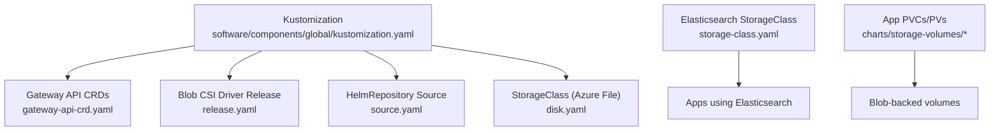
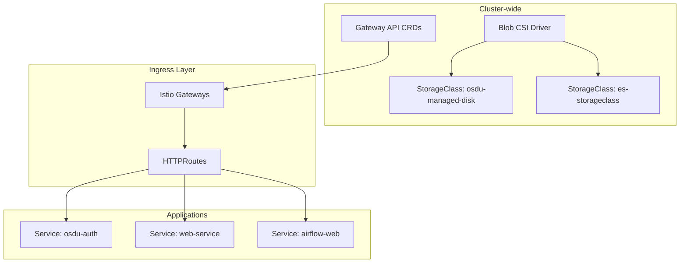
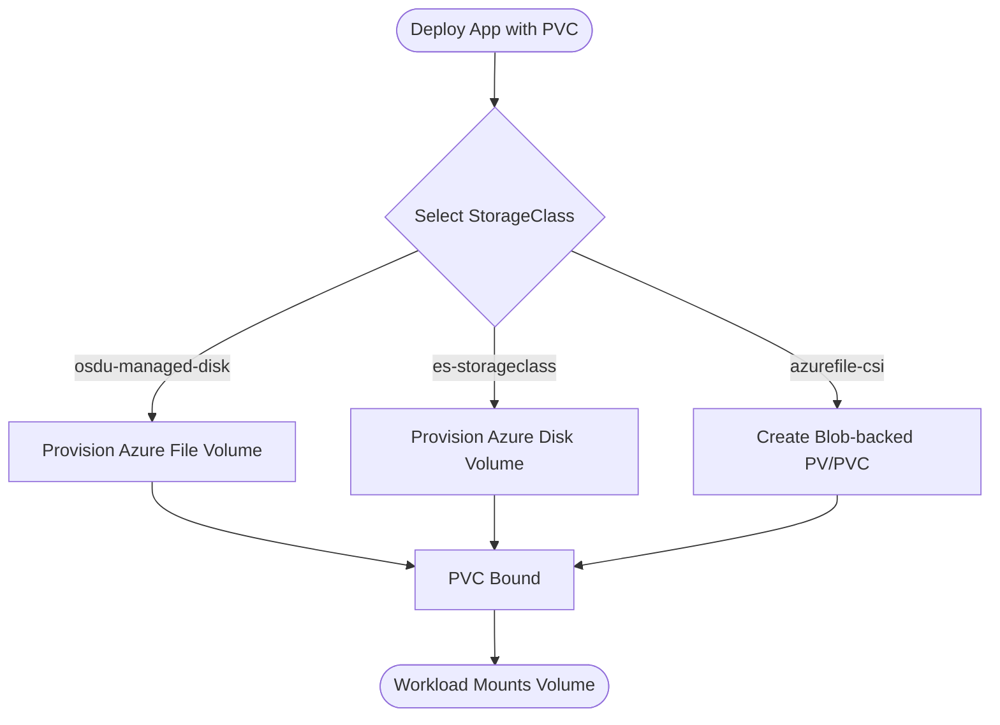
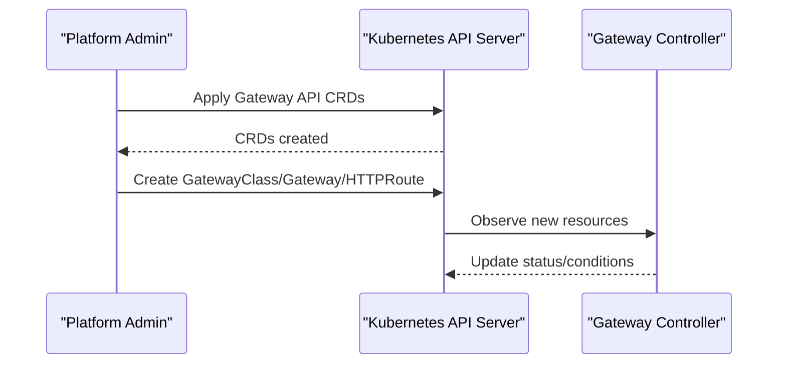
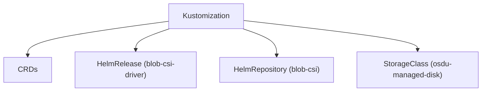
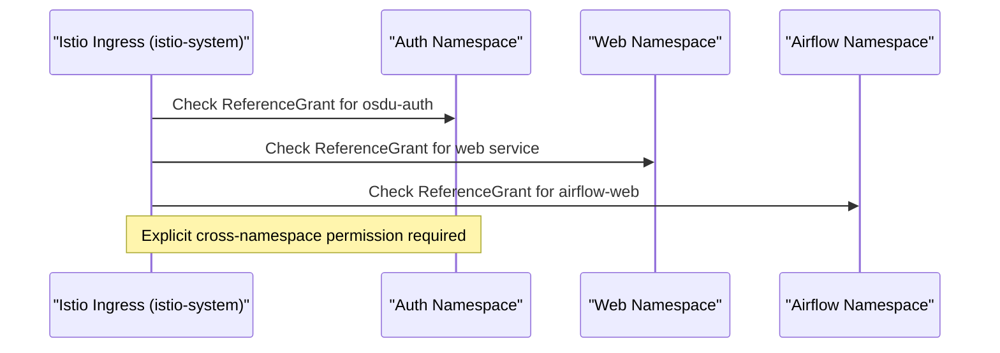
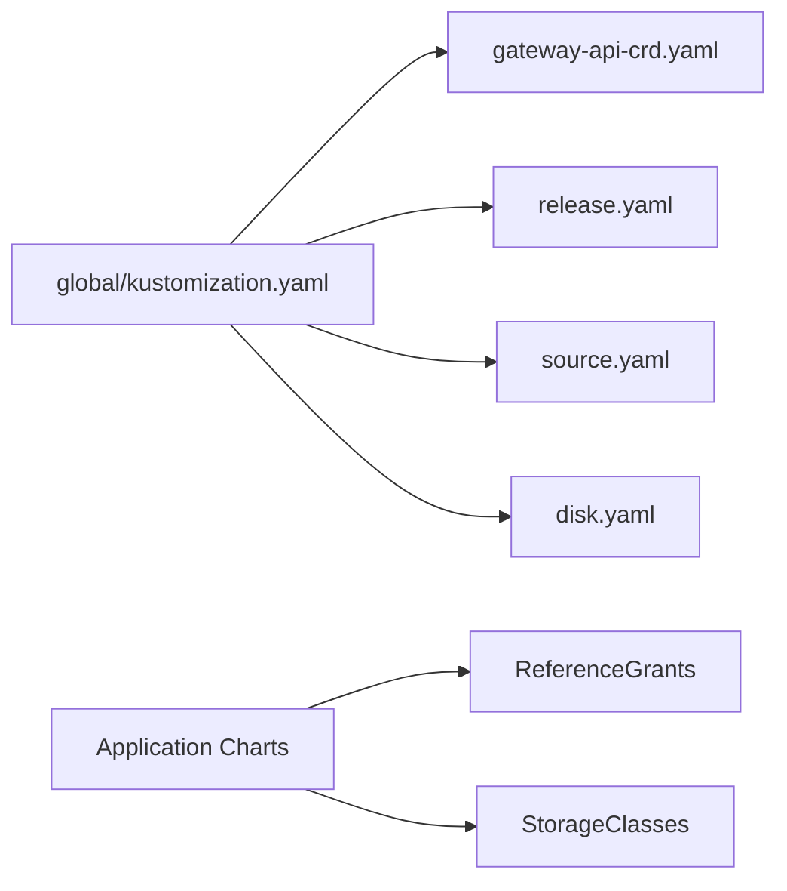

# Global Resources

<cite>
**Referenced Files in This Document**
- [disk.yaml](file://software/components/global/disk.yaml)
- [gateway-api-crd.yaml](file://software/components/global/gateway-api-crd.yaml)
- [kustomization.yaml](file://software/components/global/kustomization.yaml)
- [release.yaml](file://software/components/global/release.yaml)
- [source.yaml](file://software/components/global/source.yaml)
- [storage-class.yaml](file://software/components/elastic-storage/storage-class.yaml)
- [pv.yaml](file://charts/storage-volumes/templates/pv.yaml)
- [pvc.yaml](file://charts/storage-volumes/templates/pvc.yaml)
- [reference-grant.yaml](file://charts/osdu-developer-auth/templates/reference-grant.yaml)
- [reference-grant.yaml](file://software/applications/web-site/referencegrant.yaml)
- [referencegrant.yaml](file://software/components/airflow/referencegrant.yaml)
- [referencegrants.yaml](file://charts/istio-ingress/templates/referencegrants.yaml)
- [httproutes.yaml](file://charts/istio-ingress/templates/httproutes.yaml)
- [values.yaml](file://charts/istio-ingress/values.yaml)
- [gateway.yaml](file://software/components/mesh-ingress/gateway.yaml)
</cite>

## Table of Contents
1. [Introduction](#introduction)
2. [Project Structure](#project-structure)
3. [Core Components](#core-components)
4. [Architecture Overview](#architecture-overview)
5. [Detailed Component Analysis](#detailed-component-analysis)
6. [Dependency Analysis](#dependency-analysis)
7. [Performance Considerations](#performance-considerations)
8. [Troubleshooting Guide](#troubleshooting-guide)
9. [Conclusion](#conclusion)

## Introduction
This document explains the global Kubernetes resources that provide shared infrastructure for the platform: persistent disk configurations, Gateway API Custom Resource Definitions (CRDs), and global kustomization settings. It describes how these resources are packaged and installed, how they enable cross-namespace resource sharing, and how they underpin the API gateway and storage layers used by application components.

## Project Structure
Global resources are grouped under software/components/global and assembled via a Kustomization that references CRDs, HelmRelease definitions, and source repositories. Additional cluster-wide storage classes and application-specific ReferenceGrants complement the core setup to support multi-tenant routing and storage patterns.

**Diagram sources**
- [kustomization.yaml:1-9](file://software/components/global/kustomization.yaml#L1-L9)
- [gateway-api-crd.yaml:1-800](file://software/components/global/gateway-api-crd.yaml#L1-L800)
- [release.yaml:1-43](file://software/components/global/release.yaml#L1-L43)
- [source.yaml:1-9](file://software/components/global/source.yaml#L1-L9)
- [disk.yaml:1-12](file://software/components/global/disk.yaml#L1-L12)
- [storage-class.yaml:1-14](file://software/components/elastic-storage/storage-class.yaml#L1-L14)
- [pv.yaml:1-33](file://charts/storage-volumes/templates/pv.yaml#L1-L33)
- [pvc.yaml:1-17](file://charts/storage-volumes/templates/pvc.yaml#L1-L17)

**Section sources**
- [kustomization.yaml:1-9](file://software/components/global/kustomization.yaml#L1-L9)
- [gateway-api-crd.yaml:1-800](file://software/components/global/gateway-api-crd.yaml#L1-L800)
- [release.yaml:1-43](file://software/components/global/release.yaml#L1-L43)
- [source.yaml:1-9](file://software/components/global/source.yaml#L1-L9)
- [disk.yaml:1-12](file://software/components/global/disk.yaml#L1-L12)
- [storage-class.yaml:1-14](file://software/components/elastic-storage/storage-class.yaml#L1-L14)
- [pv.yaml:1-33](file://charts/storage-volumes/templates/pv.yaml#L1-L33)
- [pvc.yaml:1-17](file://charts/storage-volumes/templates/pvc.yaml#L1-L17)

## Core Components
- Gateway API CRDs: Install standard Gateway API types (GatewayClass, Gateway, HTTPRoute, ReferenceGrant, etc.) to enable modern, policy-driven ingress and routing.
- Blob CSI Driver: Installed via Flux HelmRelease to back Azure File-based PersistentVolumes and claims with the blob.csi.azure.com driver.
- StorageClasses: Define cluster-wide storage profiles:
  - osdu-managed-disk (Azure File) for general workloads
  - es-storageclass (Azure Disk) for Elasticsearch performance needs
- Cross-namespace Routing Permissions: ReferenceGrants allow HTTPRoutes in istio-system to reference Services in application namespaces.

These components collectively provide:
- Shared networking primitives for all services
- Reusable storage classes and volume provisioning
- Secure, explicit cross-namespace access control for routing

**Section sources**
- [gateway-api-crd.yaml:1-800](file://software/components/global/gateway-api-crd.yaml#L1-L800)
- [release.yaml:1-43](file://software/components/global/release.yaml#L1-L43)
- [source.yaml:1-9](file://software/components/global/source.yaml#L1-L9)
- [disk.yaml:1-12](file://software/components/global/disk.yaml#L1-L12)
- [storage-class.yaml:1-14](file://software/components/elastic-storage/storage-class.yaml#L1-L14)
- [reference-grant.yaml:1-33](file://charts/osdu-developer-auth/templates/reference-grant.yaml#L1-L33)
- [reference-grant.yaml:1-16](file://software/applications/web-site/referencegrant.yaml#L1-L16)
- [referencegrant.yaml:1-15](file://software/components/airflow/referencegrant.yaml#L1-L15)

## Architecture Overview
The global layer installs CRDs and drivers once per cluster. Applications then declare routes and storage needs using standardized APIs and storage classes. The Istio-based mesh ingress consumes Gateway API resources to route traffic to services across namespaces, with explicit permissions enforced via ReferenceGrants.

**Diagram sources**
- [gateway-api-crd.yaml:1-800](file://software/components/global/gateway-api-crd.yaml#L1-L800)
- [release.yaml:1-43](file://software/components/global/release.yaml#L1-L43)
- [disk.yaml:1-12](file://software/components/global/disk.yaml#L1-L12)
- [storage-class.yaml:1-14](file://software/components/elastic-storage/storage-class.yaml#L1-L14)
- [reference-grant.yaml:1-33](file://charts/osdu-developer-auth/templates/reference-grant.yaml#L1-L33)
- [reference-grant.yaml:1-16](file://software/applications/web-site/referencegrant.yaml#L1-L16)
- [referencegrant.yaml:1-15](file://software/components/airflow/referencegrant.yaml#L1-L15)

## Detailed Component Analysis

### Persistent Disk Configurations
- Azure File StorageClass (osdu-managed-disk): Provides a cluster-wide profile for Azure File-backed volumes with expansion enabled and immediate binding. Used by applications requiring file shares.
- Azure Disk StorageClass (es-storageclass): Optimized for Elasticsearch with Premium_LRS disks, WaitForFirstConsumer binding, and Retain reclaim policy to protect data.
- Blob-backed PV/PVC templates: Generate PVs and PVCs bound to Azure Blob containers via the blob.csi.azure.com driver, enabling ReadWriteMany access patterns where supported.

**Diagram sources**
- [disk.yaml:1-12](file://software/components/global/disk.yaml#L1-L12)
- [storage-class.yaml:1-14](file://software/components/elastic-storage/storage-class.yaml#L1-L14)
- [pv.yaml:1-33](file://charts/storage-volumes/templates/pv.yaml#L1-L33)
- [pvc.yaml:1-17](file://charts/storage-volumes/templates/pvc.yaml#L1-L17)

**Section sources**
- [disk.yaml:1-12](file://software/components/global/disk.yaml#L1-L12)
- [storage-class.yaml:1-14](file://software/components/elastic-storage/storage-class.yaml#L1-L14)
- [pv.yaml:1-33](file://charts/storage-volumes/templates/pv.yaml#L1-L33)
- [pvc.yaml:1-17](file://charts/storage-volumes/templates/pvc.yaml#L1-L17)

### Gateway API Custom Resource Definitions
- CRDs installed include GatewayClass, Gateway, HTTPRoute, and ReferenceGrant, enabling declarative, policy-driven ingress and cross-namespace routing.
- These CRDs define the schema and validation rules that controllers enforce, ensuring consistent behavior across environments.

**Diagram sources**
- [gateway-api-crd.yaml:1-800](file://software/components/global/gateway-api-crd.yaml#L1-L800)

**Section sources**
- [gateway-api-crd.yaml:1-800](file://software/components/global/gateway-api-crd.yaml#L1-L800)

### Global Kustomization Settings
- The global Kustomization bundles CRDs, the Blob CSI HelmRelease, its repository source, and the Azure File StorageClass into a single deployable unit.
- This ensures consistent installation order and reduces drift between environments.

**Diagram sources**
- [kustomization.yaml:1-9](file://software/components/global/kustomization.yaml#L1-L9)
- [release.yaml:1-43](file://software/components/global/release.yaml#L1-L43)
- [source.yaml:1-9](file://software/components/global/source.yaml#L1-L9)
- [disk.yaml:1-12](file://software/components/global/disk.yaml#L1-L12)

**Section sources**
- [kustomization.yaml:1-9](file://software/components/global/kustomization.yaml#L1-L9)
- [release.yaml:1-43](file://software/components/global/release.yaml#L1-L43)
- [source.yaml:1-9](file://software/components/global/source.yaml#L1-L9)
- [disk.yaml:1-12](file://software/components/global/disk.yaml#L1-L12)

### API Gateway Configuration and Cross-Namespace Routing
- Istio-based ingress is managed via a HelmRelease targeting istio-system, with values controlling internal and external gateways and CORS policies.
- Application charts create ReferenceGrants to explicitly permit HTTPRoutes in istio-system to reference Services in their namespaces, avoiding circular deployment dependencies.
- ACME challenge handling notes indicate that application-level HTTPRoutes or cert-manager may handle challenges without hard dependencies on infrastructure manifests.

**Diagram sources**
- [gateway.yaml:1-55](file://software/components/mesh-ingress/gateway.yaml#L1-L55)
- [values.yaml:1-18](file://charts/istio-ingress/values.yaml#L1-L18)
- [reference-grant.yaml:1-33](file://charts/osdu-developer-auth/templates/reference-grant.yaml#L1-L33)
- [reference-grant.yaml:1-16](file://software/applications/web-site/referencegrant.yaml#L1-L16)
- [referencegrant.yaml:1-15](file://software/components/airflow/referencegrant.yaml#L1-L15)
- [referencegrants.yaml:1-10](file://charts/istio-ingress/templates/referencegrants.yaml#L1-L10)
- [httproutes.yaml:1-13](file://charts/istio-ingress/templates/httproutes.yaml#L1-L13)

**Section sources**
- [gateway.yaml:1-55](file://software/components/mesh-ingress/gateway.yaml#L1-L55)
- [values.yaml:1-18](file://charts/istio-ingress/values.yaml#L1-L18)
- [reference-grant.yaml:1-33](file://charts/osdu-developer-auth/templates/reference-grant.yaml#L1-L33)
- [reference-grant.yaml:1-16](file://software/applications/web-site/referencegrant.yaml#L1-L16)
- [referencegrant.yaml:1-15](file://software/components/airflow/referencegrant.yaml#L1-L15)
- [referencegrants.yaml:1-10](file://charts/istio-ingress/templates/referencegrants.yaml#L1-L10)
- [httproutes.yaml:1-13](file://charts/istio-ingress/templates/httproutes.yaml#L1-L13)

## Dependency Analysis
- Global Kustomization depends on:
  - Gateway API CRDs being present before any Gateway/HTTPRoute objects are applied
  - Blob CSI Driver HelmRelease to provision Azure File-backed volumes
  - StorageClass definitions consumed by PVCs across namespaces
- Application charts depend on:
  - ReferenceGrants to be present for cross-namespace routing from istio-system
  - StorageClasses to match their volume requirements

**Diagram sources**
- [kustomization.yaml:1-9](file://software/components/global/kustomization.yaml#L1-L9)
- [gateway-api-crd.yaml:1-800](file://software/components/global/gateway-api-crd.yaml#L1-L800)
- [release.yaml:1-43](file://software/components/global/release.yaml#L1-L43)
- [source.yaml:1-9](file://software/components/global/source.yaml#L1-L9)
- [disk.yaml:1-12](file://software/components/global/disk.yaml#L1-L12)
- [reference-grant.yaml:1-33](file://charts/osdu-developer-auth/templates/reference-grant.yaml#L1-L33)
- [reference-grant.yaml:1-16](file://software/applications/web-site/referencegrant.yaml#L1-L16)
- [referencegrant.yaml:1-15](file://software/components/airflow/referencegrant.yaml#L1-L15)

**Section sources**
- [kustomization.yaml:1-9](file://software/components/global/kustomization.yaml#L1-L9)
- [gateway-api-crd.yaml:1-800](file://software/components/global/gateway-api-crd.yaml#L1-L800)
- [release.yaml:1-43](file://software/components/global/release.yaml#L1-L43)
- [source.yaml:1-9](file://software/components/global/source.yaml#L1-L9)
- [disk.yaml:1-12](file://software/components/global/disk.yaml#L1-L12)
- [reference-grant.yaml:1-33](file://charts/osdu-developer-auth/templates/reference-grant.yaml#L1-L33)
- [reference-grant.yaml:1-16](file://software/applications/web-site/referencegrant.yaml#L1-L16)
- [referencegrant.yaml:1-15](file://software/components/airflow/referencegrant.yaml#L1-L15)

## Performance Considerations
- Use es-storageclass for Elasticsearch to leverage Premium_LRS disks and WaitForFirstConsumer binding for optimal placement and performance.
- For general workloads, osdu-managed-disk provides flexible Azure File storage with immediate binding; consider workload access patterns when choosing between file shares and block storage.
- Blob-backed PVs use mount options tuned for caching and attribute handling; validate performance for large datasets and concurrent access.

[No sources needed since this section provides general guidance]

## Troubleshooting Guide
- Gateway API not recognized: Ensure CRDs from gateway-api-crd.yaml are applied before creating Gateway/HTTPRoute resources.
- Cross-namespace routing denied: Verify corresponding ReferenceGrants exist in the target namespace allowing HTTPRoutes from istio-system to reference the Service.
- PVC pending: Confirm the requested StorageClass exists and matches the underlying driver (e.g., osdu-managed-disk for Azure File, es-storageclass for Azure Disk).
- Blob CSI issues: Validate the Blob CSI Driver HelmRelease is healthy and that the referenced HelmRepository is reachable.

**Section sources**
- [gateway-api-crd.yaml:1-800](file://software/components/global/gateway-api-crd.yaml#L1-L800)
- [reference-grant.yaml:1-33](file://charts/osdu-developer-auth/templates/reference-grant.yaml#L1-L33)
- [reference-grant.yaml:1-16](file://software/applications/web-site/referencegrant.yaml#L1-L16)
- [referencegrant.yaml:1-15](file://software/components/airflow/referencegrant.yaml#L1-L15)
- [disk.yaml:1-12](file://software/components/global/disk.yaml#L1-L12)
- [storage-class.yaml:1-14](file://software/components/elastic-storage/storage-class.yaml#L1-L14)
- [release.yaml:1-43](file://software/components/global/release.yaml#L1-L43)
- [source.yaml:1-9](file://software/components/global/source.yaml#L1-L9)

## Conclusion
The global resources establish a robust foundation for the platform:
- Gateway API CRDs standardize ingress and routing capabilities
- StorageClasses and Blob CSI integration deliver scalable, shareable storage
- ReferenceGrants enforce secure, explicit cross-namespace access for routing
Together, these components enable consistent, portable, and secure deployments across namespaces while keeping infrastructure concerns centralized and reusable.

[No sources needed since this section summarizes without analyzing specific files]