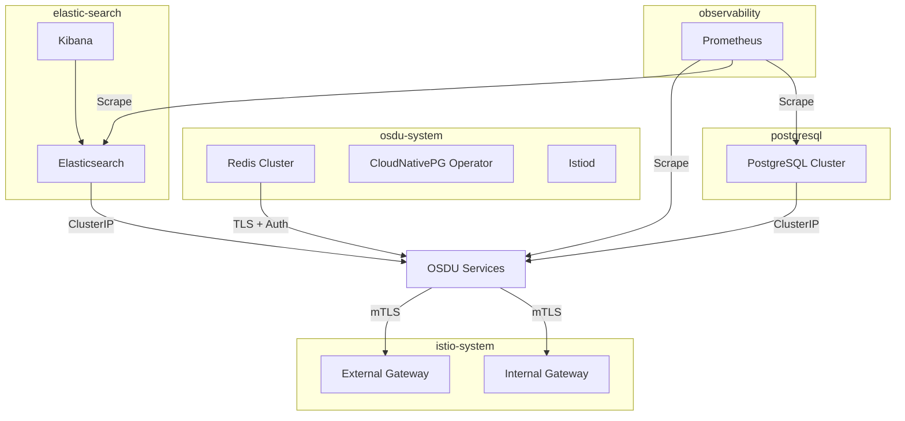
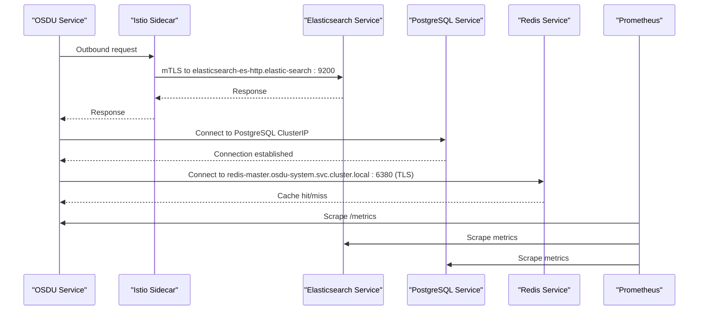
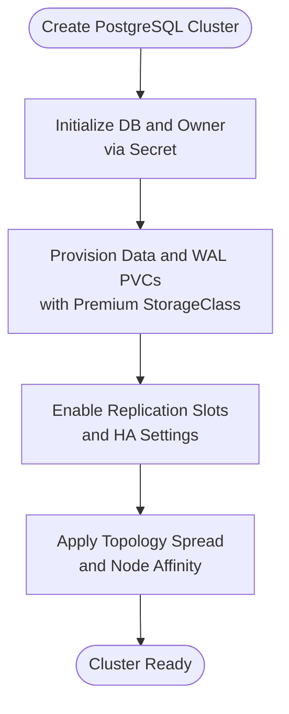
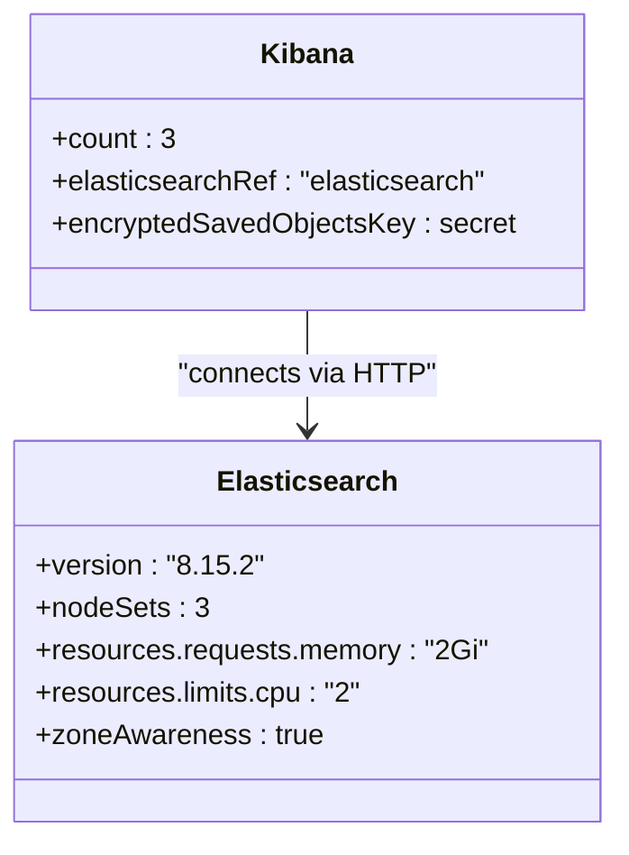
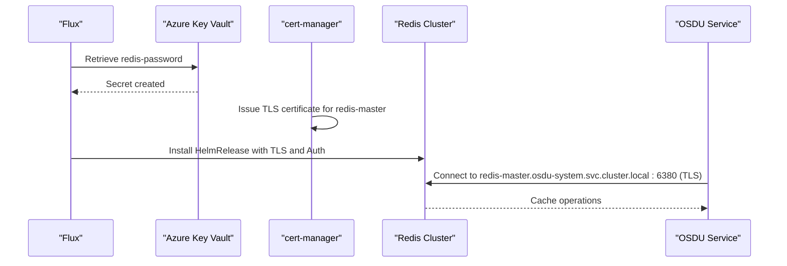
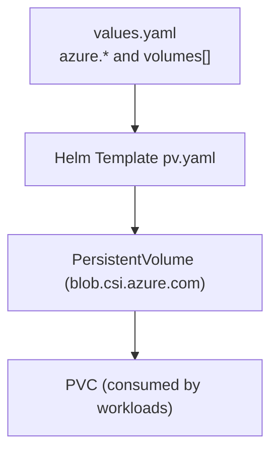
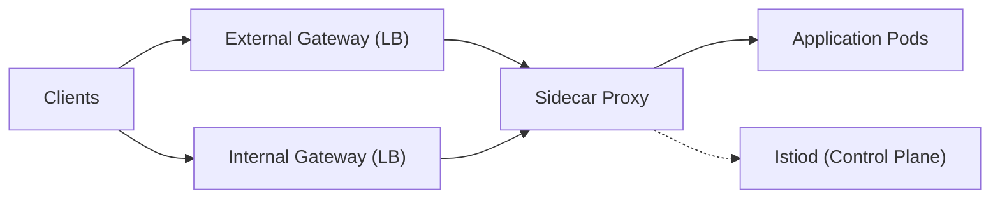
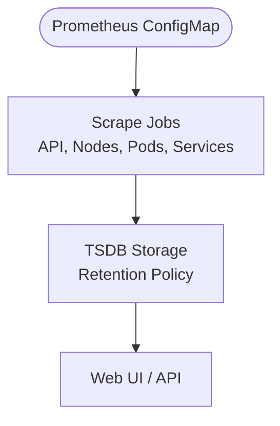
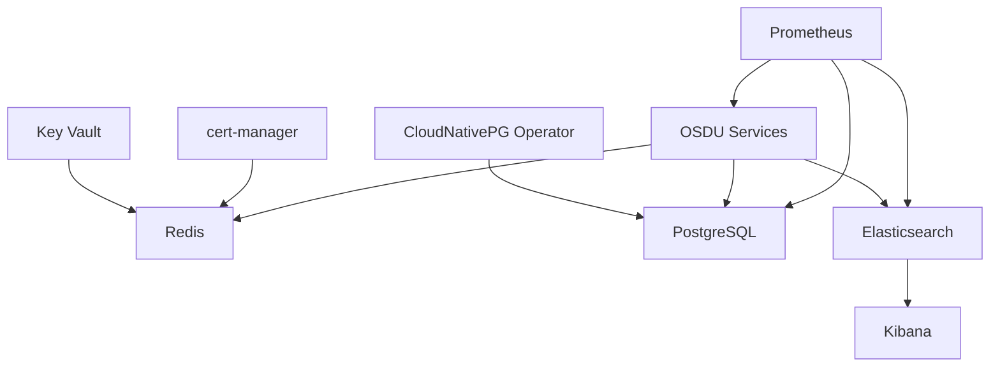

# Infrastructure Components

<cite>
**Referenced Files in This Document**
- [postgresql.yaml](file://software/components/database/postgresql.yaml)
- [elastic-search.yaml](file://software/components/elastic-search/elastic-search.yaml)
- [kibana.yaml](file://software/components/elastic-search/kibana.yaml)
- [cache.yaml](file://software/components/osdu-system/cache.yaml)
- [database.yaml](file://software/components/osdu-system/database.yaml)
- [mesh.yaml](file://software/components/osdu-system/mesh.yaml)
- [prometheus.yaml](file://software/components/observability/prometheus.yaml)
- [pv.yaml](file://charts/storage-volumes/templates/pv.yaml)
- [values.yaml](file://charts/storage-volumes/values.yaml)
</cite>

## Table of Contents
1. Introduction
2. Project Structure
3. Core Components
4. Architecture Overview
5. Detailed Component Analysis
6. Dependency Analysis
7. Performance Considerations
8. Troubleshooting Guide
9. Conclusion

## Introduction
This document describes the OSDU infrastructure components for production deployments, focusing on:
- Database (PostgreSQL via CloudNativePG)
- Search (Elasticsearch and Kibana)
- Caching (Redis cluster with TLS and secrets)
- Global resources (storage classes and persistent volumes)
- Service mesh (Istio) for secure service discovery and traffic management
- Observability (Prometheus) for health checks and monitoring

It explains resource configurations, scaling parameters, storage classes, inter-component dependencies, namespace isolation, service discovery patterns, persistent volume management, health checks, resource limits, and monitoring setup.

## Project Structure
The infrastructure is organized into Kubernetes namespaces and Helm releases managed by Flux:
- osdu-system: core platform services (Redis, database operator, Istio control plane)
- postgresql: PostgreSQL clusters
- elastic-search: Elasticsearch and Kibana
- istio-system: service mesh control plane and gateways
- observability: Prometheus metrics collection

**Diagram sources**
- [cache.yaml:57-172](file://software/components/osdu-system/cache.yaml#L57-L172)
- [database.yaml:1-29](file://software/components/osdu-system/database.yaml#L1-L29)
- [postgresql.yaml:1-89](file://software/components/database/postgresql.yaml#L1-L89)
- [elastic-search.yaml:1-89](file://software/components/elastic-search/elastic-search.yaml#L1-L89)
- [kibana.yaml:1-49](file://software/components/elastic-search/kibana.yaml#L1-L49)
- [mesh.yaml:47-241](file://software/components/osdu-system/mesh.yaml#L47-L241)
- [prometheus.yaml:39-348](file://software/components/observability/prometheus.yaml#L39-L348)

**Section sources**
- [cache.yaml:57-172](file://software/components/osdu-system/cache.yaml#L57-L172)
- [database.yaml:1-29](file://software/components/osdu-system/database.yaml#L1-L29)
- [postgresql.yaml:1-89](file://software/components/database/postgresql.yaml#L1-L89)
- [elastic-search.yaml:1-89](file://software/components/elastic-search/elastic-search.yaml#L1-L89)
- [kibana.yaml:1-49](file://software/components/elastic-search/kibana.yaml#L1-L49)
- [mesh.yaml:47-241](file://software/components/osdu-system/mesh.yaml#L47-L241)
- [prometheus.yaml:39-348](file://software/components/observability/prometheus.yaml#L39-L348)

## Core Components
- PostgreSQL (CloudNativePG): Multi-instance cluster with replication slots, WAL storage, and Azure Workload Identity.
- Elasticsearch: 3-node mixed-role cluster with zone-aware allocation and per-pod resource requests/limits.
- Redis: Cluster mode with auth, TLS, and persistence across zones; secrets sourced from Key Vault via Flux.
- Storage: PersistentVolumes backed by Azure Blob CSI with configurable sizes and access modes.
- Istio: Control plane and two gateways (internal/external) for mTLS and routing.
- Prometheus: Centralized metrics scraping with readiness/liveness probes and retention settings.

**Section sources**
- [postgresql.yaml:1-89](file://software/components/database/postgresql.yaml#L1-L89)
- [elastic-search.yaml:1-89](file://software/components/elastic-search/elastic-search.yaml#L1-L89)
- [cache.yaml:57-172](file://software/components/osdu-system/cache.yaml#L57-L172)
- [pv.yaml:1-33](file://charts/storage-volumes/templates/pv.yaml#L1-L33)
- [mesh.yaml:47-241](file://software/components/osdu-system/mesh.yaml#L47-L241)
- [prometheus.yaml:39-348](file://software/components/observability/prometheus.yaml#L39-L348)

## Architecture Overview
The system uses namespace isolation to separate concerns:
- osdu-system: shared platform services (Redis, operators, mesh)
- postgresql: database workloads
- elastic-search: search and visualization
- istio-system: ingress/egress and mTLS policy enforcement
- observability: metrics collection

Service discovery is achieved via Kubernetes Services and DNS within each namespace. The Istio mesh enforces mutual TLS between services and exposes them through internal/external gateways.

**Diagram sources**
- [elastic-search.yaml:10-17](file://software/components/elastic-search/elastic-search.yaml#L10-L17)
- [kibana.yaml:44-45](file://software/components/elastic-search/kibana.yaml#L44-L45)
- [cache.yaml:87-99](file://software/components/osdu-system/cache.yaml#L87-L99)
- [postgresql.yaml:1-89](file://software/components/database/postgresql.yaml#L1-L89)
- [prometheus.yaml:39-348](file://software/components/observability/prometheus.yaml#L39-L348)

## Detailed Component Analysis

### PostgreSQL (CloudNativePG)
- Cluster configuration: multi-instance with replication slots and high availability toggles.
- Storage: dedicated data and WAL PVCs using a premium storage class with ReadWriteOnce.
- Scheduling: topology spread constraints across zones and node affinity/tolerations for cluster pools.
- Security: Azure Workload Identity annotations on service account template and inherited metadata.
- Bootstrap: initial database and owner configured via secret reference.

**Diagram sources**
- [postgresql.yaml:45-71](file://software/components/database/postgresql.yaml#L45-L71)
- [postgresql.yaml:22-35](file://software/components/database/postgresql.yaml#L22-L35)
- [postgresql.yaml:76-89](file://software/components/database/postgresql.yaml#L76-L89)

**Section sources**
- [postgresql.yaml:1-89](file://software/components/database/postgresql.yaml#L1-L89)

### Elasticsearch and Kibana
- Elasticsearch: 3 nodes with mixed roles, zone-aware allocation, and per-pod memory/CPU requests and limits.
- Networking: HTTP service exposed as ClusterIP; TLS disabled for self-signed certificate in this config.
- Kibana: 3 replicas referencing the Elasticsearch service; encrypted saved objects key sourced from a secret.

**Diagram sources**
- [elastic-search.yaml:8-87](file://software/components/elastic-search/elastic-search.yaml#L8-L87)
- [kibana.yaml:7-49](file://software/components/elastic-search/kibana.yaml#L7-L49)

**Section sources**
- [elastic-search.yaml:1-89](file://software/components/elastic-search/elastic-search.yaml#L1-L89)
- [kibana.yaml:1-49](file://software/components/elastic-search/kibana.yaml#L1-L49)

### Redis Cache
- Deployment: HelmRelease installs Redis cluster with authentication and TLS enabled.
- Secrets: Password retrieved from Key Vault via a Flux-managed secret; TLS certificate issued by cert-manager.
- Persistence: Persistent storage enabled for master and replicas with ReadWriteOnce.
- Health checks: Liveness and readiness probes configured for master and replica containers.
- Scheduling: Node affinity and tolerations target specific agent pools and zones.

**Diagram sources**
- [cache.yaml:3-15](file://software/components/osdu-system/cache.yaml#L3-L15)
- [cache.yaml:16-46](file://software/components/osdu-system/cache.yaml#L16-L46)
- [cache.yaml:57-172](file://software/components/osdu-system/cache.yaml#L57-L172)

**Section sources**
- [cache.yaml:1-172](file://software/components/osdu-system/cache.yaml#L1-L172)

### Storage Volumes (PersistentVolumes)
- Provisioning: PVs are templated to back Azure Blob CSI volumes with configurable sizes and access modes.
- Mount options: FUSE-based mount options tuned for performance and caching behavior.
- Values: Externalized via values.yaml including Azure identity, resource group, and storage account details.

**Diagram sources**
- [values.yaml:1-13](file://charts/storage-volumes/values.yaml#L1-L13)
- [pv.yaml:1-33](file://charts/storage-volumes/templates/pv.yaml#L1-L33)

**Section sources**
- [values.yaml:1-13](file://charts/storage-volumes/values.yaml#L1-L13)
- [pv.yaml:1-33](file://charts/storage-volumes/templates/pv.yaml#L1-L33)

### Service Mesh (Istio)
- Control Plane: Istiod installed with mTLS minimum protocol version set and native sidecars enabled.
- Gateways: Internal and external LoadBalancer gateways exposing HTTP/HTTPS ports.
- Certificates: Integration with cert-manager for CSR-based certificates.

**Diagram sources**
- [mesh.yaml:47-241](file://software/components/osdu-system/mesh.yaml#L47-L241)

**Section sources**
- [mesh.yaml:1-241](file://software/components/osdu-system/mesh.yaml#L1-L241)

### Observability (Prometheus)
- Configuration: Centralized scrape configs for Kubernetes APIs, nodes, pods, and services.
- Probes: Readiness and liveness endpoints configured for Prometheus itself.
- Retention: Time-based retention configured; storage mounted via emptyDir in current manifest.

**Diagram sources**
- [prometheus.yaml:39-348](file://software/components/observability/prometheus.yaml#L39-L348)
- [prometheus.yaml:519-538](file://software/components/observability/prometheus.yaml#L519-L538)

**Section sources**
- [prometheus.yaml:1-554](file://software/components/observability/prometheus.yaml#L1-L554)

## Dependency Analysis
- Redis depends on Key Vault secrets and cert-manager for TLS.
- Elasticsearch and Kibana depend on each other; Kibana references the Elasticsearch service name.
- PostgreSQL depends on CloudNativePG operator installed in osdu-system.
- All services communicate over mTLS via Istio sidecars when injected.
- Prometheus scrapes metrics from multiple components based on labels and annotations.

**Diagram sources**
- [cache.yaml:16-46](file://software/components/osdu-system/cache.yaml#L16-L46)
- [cache.yaml:57-172](file://software/components/osdu-system/cache.yaml#L57-L172)
- [database.yaml:1-29](file://software/components/osdu-system/database.yaml#L1-L29)
- [elastic-search.yaml:1-89](file://software/components/elastic-search/elastic-search.yaml#L1-L89)
- [kibana.yaml:1-49](file://software/components/elastic-search/kibana.yaml#L1-L49)
- [prometheus.yaml:39-348](file://software/components/observability/prometheus.yaml#L39-L348)

**Section sources**
- [cache.yaml:16-46](file://software/components/osdu-system/cache.yaml#L16-L46)
- [database.yaml:1-29](file://software/components/osdu-system/database.yaml#L1-L29)
- [elastic-search.yaml:1-89](file://software/components/elastic-search/elastic-search.yaml#L1-L89)
- [kibana.yaml:1-49](file://software/components/elastic-search/kibana.yaml#L1-L49)
- [prometheus.yaml:39-348](file://software/components/observability/prometheus.yaml#L39-L348)

## Performance Considerations
- PostgreSQL:
  - Use premium storage class for data and WAL to reduce latency.
  - Enable replication slots and tune sync replicas for durability vs. performance trade-offs.
  - Apply topology spread constraints to distribute instances across zones.
- Elasticsearch:
  - Set per-pod CPU/memory requests and limits to ensure stable scheduling.
  - Use zone-aware allocation to improve resilience during node failures.
- Redis:
  - Enable persistence for durability; size PVCs appropriately for cache workload.
  - Use TLS to avoid plaintext overhead while maintaining security.
- Istio:
  - Enforce mTLS with minimum TLS version to balance security and performance.
  - Use separate internal/external gateways to optimize routing paths.
- Prometheus:
  - Tune scrape intervals and timeouts to match component metrics volume.
  - Configure retention policies aligned with storage capacity.

[No sources needed since this section provides general guidance]

## Troubleshooting Guide
- PostgreSQL not ready:
  - Verify secrets exist for user credentials and superuser credentials.
  - Check PVC provisioning status and storage class availability.
  - Inspect pod events for scheduling issues related to topology spread or node affinity.
- Elasticsearch connectivity:
  - Confirm service endpoint exists in elastic-search namespace.
  - Validate node roles and resource requests/limits to prevent OOM kills.
  - Ensure zone annotations and affinity rules match cluster topology.
- Redis TLS/auth errors:
  - Ensure cert-manager has issued the certificate and secret is present.
  - Verify password secret key matches expected value from Key Vault.
  - Check container port mapping and service exposure.
- Prometheus scraping failures:
  - Confirm RBAC permissions and service discovery labels/annotations.
  - Validate readiness/liveness endpoints and network policies.
  - Review scrape logs and adjust intervals/timeouts if necessary.

**Section sources**
- [postgresql.yaml:45-89](file://software/components/database/postgresql.yaml#L45-L89)
- [elastic-search.yaml:30-87](file://software/components/elastic-search/elastic-search.yaml#L30-L87)
- [cache.yaml:87-172](file://software/components/osdu-system/cache.yaml#L87-L172)
- [prometheus.yaml:39-348](file://software/components/observability/prometheus.yaml#L39-L348)

## Conclusion
This infrastructure leverages Kubernetes-native operators and Helm releases to deploy resilient, scalable, and secure components:
- PostgreSQL with replication and premium storage ensures data durability.
- Elasticsearch with zone awareness and resource limits supports robust search workloads.
- Redis with TLS and persistence provides secure, reliable caching.
- Istio enables secure service-to-service communication and controlled ingress/egress.
- Prometheus centralizes observability with configurable scraping and retention.

For production, validate all secrets, storage classes, and network policies, and continuously monitor resource utilization and health endpoints.

[No sources needed since this section summarizes without analyzing specific files]