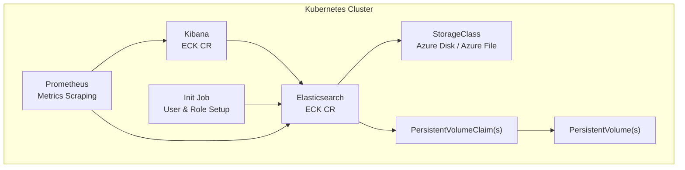
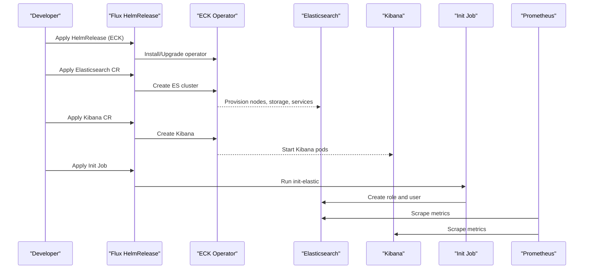
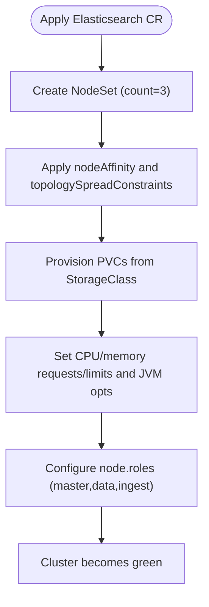
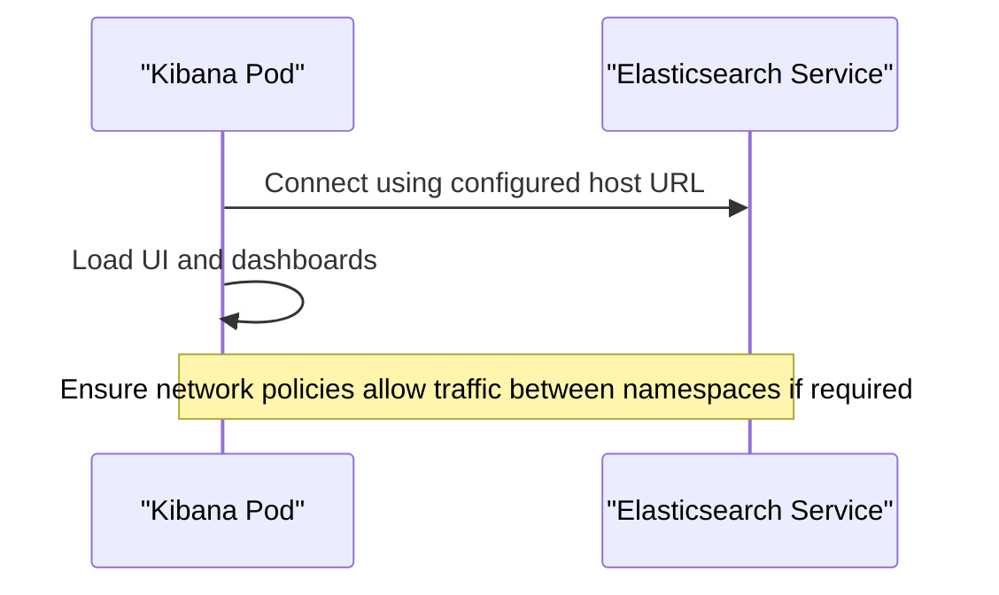
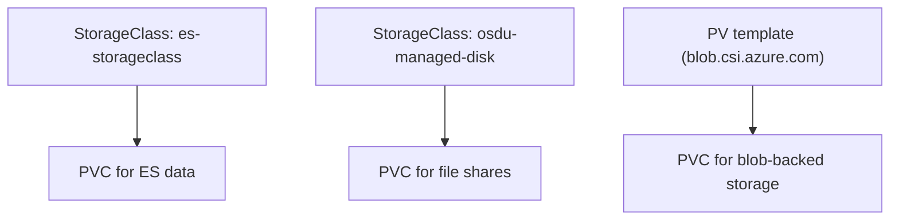
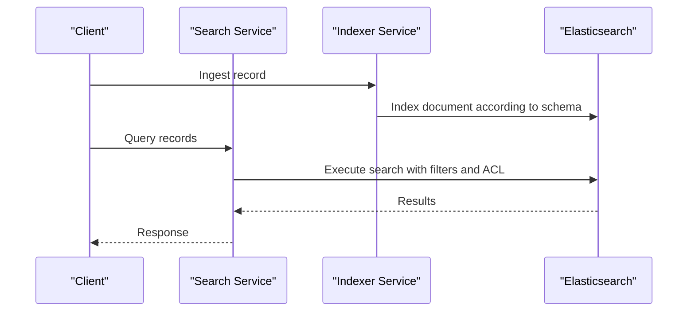
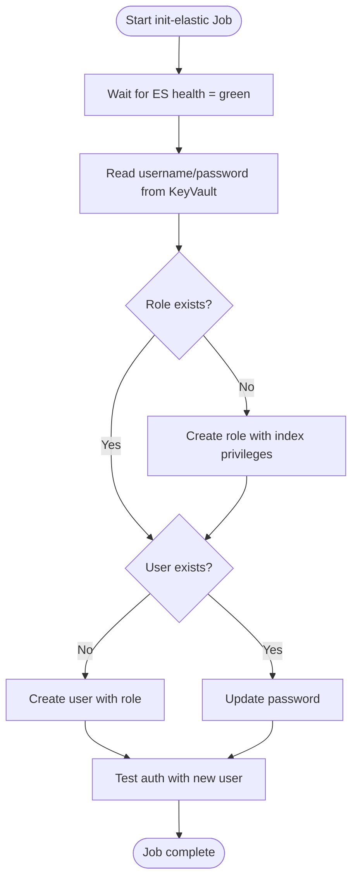
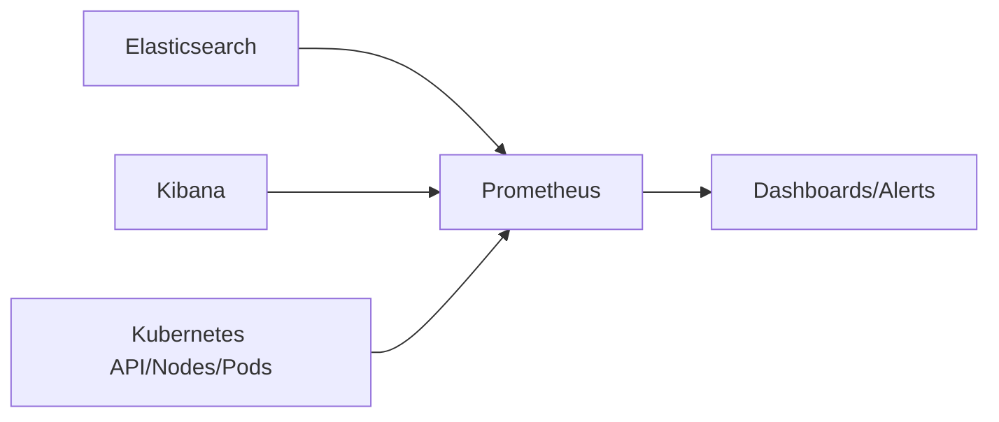
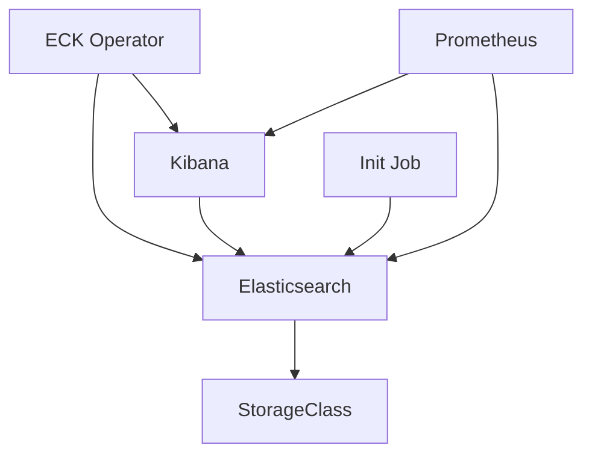

# Search Infrastructure

<cite>
**Referenced Files in This Document**
- [elastic-search.yaml](file://software/components/elastic-search/elastic-search.yaml)
- [kibana.yaml](file://software/components/elastic-search/kibana.yaml)
- [storage-class.yaml](file://software/components/elastic-storage/storage-class.yaml)
- [elastic-job.yaml](file://software/components/elastic-search/elastic-job.yaml)
- [elastic-init.yaml](file://charts/osdu-developer-init/templates/elastic-init.yaml)
- [elastic.yaml](file://software/components/osdu-system/elastic.yaml)
- [services_core_search.md](file://docs/src/services_core_search.md)
- [debugging_kibana.md](file://docs/src/debugging_kibana.md)
- [prometheus.yaml](file://software/components/observability/prometheus.yaml)
- [disk.yaml](file://software/components/global/disk.yaml)
- [pv.yaml](file://charts/storage-volumes/templates/pv.yaml)
- [pvc.yaml](file://charts/storage-volumes/templates/pvc.yaml)
- [README.md](file://software/applications/osdu-core/README.md)
</cite>

## Table of Contents
1. Introduction
2. Project Structure
3. Core Components
4. Architecture Overview
5. Detailed Component Analysis
6. Dependency Analysis
7. Performance Considerations
8. Troubleshooting Guide
9. Conclusion

## Introduction
This document describes the search infrastructure for the platform, focusing on Elasticsearch cluster configuration, Kibana setup, storage classes, and related operational components. It explains node configurations, indexing strategies via the indexer service, data retention policies, performance tuning, job execution for initialization tasks, storage provisioning, monitoring capabilities, troubleshooting steps, and scaling recommendations.

## Project Structure
The search stack is deployed as Kubernetes resources:
- Elasticsearch cluster managed by the Elastic Cloud on Kubernetes (ECK) operator
- Kibana instance connected to the Elasticsearch cluster
- StorageClass definitions for persistent volumes used by Elasticsearch and other workloads
- Initialization Job that configures Elasticsearch security roles and users
- HelmRelease to install the ECK operator
- Monitoring with Prometheus for metrics collection

**Diagram sources**
- [elastic-search.yaml:1-89](file://software/components/elastic-search/elastic-search.yaml#L1-L89)
- [kibana.yaml:1-49](file://software/components/elastic-search/kibana.yaml#L1-L49)
- [storage-class.yaml:1-14](file://software/components/elastic-storage/storage-class.yaml#L1-L14)
- [elastic-job.yaml:1-28](file://software/components/elastic-search/elastic-job.yaml#L1-L28)
- [elastic-init.yaml:1-176](file://charts/osdu-developer-init/templates/elastic-init.yaml#L1-L176)
- [prometheus.yaml:1-554](file://software/components/observability/prometheus.yaml#L1-L554)

**Section sources**
- [elastic-search.yaml:1-89](file://software/components/elastic-search/elastic-search.yaml#L1-L89)
- [kibana.yaml:1-49](file://software/components/elastic-search/kibana.yaml#L1-L49)
- [storage-class.yaml:1-14](file://software/components/elastic-storage/storage-class.yaml#L1-L14)
- [elastic-job.yaml:1-28](file://software/components/elastic-search/elastic-job.yaml#L1-L28)
- [elastic-init.yaml:1-176](file://charts/osdu-developer-init/templates/elastic-init.yaml#L1-L176)
- [prometheus.yaml:1-554](file://software/components/observability/prometheus.yaml#L1-L554)

## Core Components
- Elasticsearch cluster: Multi-node, zone-aware deployment with dedicated node roles and resource limits.
- Kibana: Multiple replicas with encrypted saved objects and cross-zone affinity.
- Storage: Premium managed disks via a StorageClass; additional Azure Blob/File volumes for general use.
- Initialization Job: Creates a custom role and user for application access to Elasticsearch.
- Operator: ECK operator installed via HelmRelease to manage Elasticsearch and Kibana lifecycle.
- Monitoring: Prometheus scrapes cluster and service endpoints for observability.

**Section sources**
- [elastic-search.yaml:1-89](file://software/components/elastic-search/elastic-search.yaml#L1-L89)
- [kibana.yaml:1-49](file://software/components/elastic-search/kibana.yaml#L1-L49)
- [storage-class.yaml:1-14](file://software/components/elastic-storage/storage-class.yaml#L1-L14)
- [elastic-init.yaml:1-176](file://charts/osdu-developer-init/templates/elastic-init.yaml#L1-L176)
- [elastic.yaml:1-29](file://software/components/osdu-system/elastic.yaml#L1-L29)
- [prometheus.yaml:1-554](file://software/components/observability/prometheus.yaml#L1-L554)

## Architecture Overview
The architecture uses ECK to provision and operate Elasticsearch and Kibana. The Elasticsearch cluster spans multiple availability zones with node affinity and topology spread constraints for resilience. Persistent storage is backed by premium managed disks through a StorageClass. An initialization Job sets up a non-root user and a custom role for application access. Prometheus provides metrics scraping for health and performance visibility.

**Diagram sources**
- [elastic.yaml:1-29](file://software/components/osdu-system/elastic.yaml#L1-L29)
- [elastic-search.yaml:1-89](file://software/components/elastic-search/elastic-search.yaml#L1-L89)
- [kibana.yaml:1-49](file://software/components/elastic-search/kibana.yaml#L1-L49)
- [elastic-job.yaml:1-28](file://software/components/elastic-search/elastic-job.yaml#L1-L28)
- [elastic-init.yaml:1-176](file://charts/osdu-developer-init/templates/elastic-init.yaml#L1-L176)
- [prometheus.yaml:1-554](file://software/components/observability/prometheus.yaml#L1-L554)

## Detailed Component Analysis

### Elasticsearch Cluster Configuration
- Version and HTTP: Configured with explicit version and HTTP service type. TLS can be disabled for development or enabled per policy.
- NodeSets:
  - Count: 3 nodes for high availability.
  - Roles: master, data, ingest combined on each node for simplicity in development.
  - Storage: Persistent volume templates requesting 128Gi using a premium managed disk StorageClass.
  - Affinity and Topology:
    - Node affinity targets specific agent pools and zones.
    - Topology spread constraints distribute pods across zones with strict scheduling.
  - Resources:
    - Requests and limits for CPU and memory are set.
    - JVM heap size configured via environment variable.
  - MMap: Explicitly disabled for compatibility in containerized environments.
  - Zone awareness: Uses Kubernetes zone labels for allocation awareness.

**Diagram sources**
- [elastic-search.yaml:1-89](file://software/components/elastic-search/elastic-search.yaml#L1-L89)

**Section sources**
- [elastic-search.yaml:1-89](file://software/components/elastic-search/elastic-search.yaml#L1-L89)

### Kibana Dashboard Setup
- Version matches Elasticsearch for compatibility.
- References the Elasticsearch service by name within the same namespace.
- Replicas: 3 for HA.
- Affinity: Targets specific agent pools and zones similar to Elasticsearch.
- Environment:
  - Encrypted saved objects key sourced from a secret.
  - Elasticsearch hosts URL configured to point to the Elasticsearch HTTP service.
  - Region injected from pod labels.

**Diagram sources**
- [kibana.yaml:1-49](file://software/components/elastic-search/kibana.yaml#L1-L49)

**Section sources**
- [kibana.yaml:1-49](file://software/components/elastic-search/kibana.yaml#L1-L49)

### Storage Class Definitions and Data Retention
- Elasticsearch StorageClass:
  - Name: es-storageclass
  - Provisioner: Azure disk
  - Type: Premium_LRS
  - ReclaimPolicy: Retain to preserve disks after PVC deletion
  - VolumeBindingMode: WaitForFirstConsumer to bind at pod scheduling time
- Additional StorageClasses:
  - osdu-managed-disk: Azure file CSI with Standard_LRS SKU and immediate binding mode
  - Azure Blob-backed PV/PVC templates for shared storage scenarios

**Diagram sources**
- [storage-class.yaml:1-14](file://software/components/elastic-storage/storage-class.yaml#L1-L14)
- [disk.yaml:1-12](file://software/components/global/disk.yaml#L1-L12)
- [pv.yaml:1-33](file://charts/storage-volumes/templates/pv.yaml#L1-L33)
- [pvc.yaml:1-17](file://charts/storage-volumes/templates/pvc.yaml#L1-L17)

**Section sources**
- [storage-class.yaml:1-14](file://software/components/elastic-storage/storage-class.yaml#L1-L14)
- [disk.yaml:1-12](file://software/components/global/disk.yaml#L1-L12)
- [pv.yaml:1-33](file://charts/storage-volumes/templates/pv.yaml#L1-L33)
- [pvc.yaml:1-17](file://charts/storage-volumes/templates/pvc.yaml#L1-L17)

### Indexing Strategy and Data Flow
- Indexer Service:
  - Part of core services pipeline; indexes records into Elasticsearch based on schemas and entitlements.
  - Communicates with Partition, Schema, Storage, and Entitlement services during ingestion and indexing.
- Search Service:
  - Provides query APIs backed by Elasticsearch; integrates with partition and entitlements for access control.

**Diagram sources**
- [README.md:1-33](file://software/applications/osdu-core/README.md#L1-L33)
- [services_core_indexer.md:1-31](file://docs/src/services_core_indexer.md#L1-L31)
- [services_core_search.md:1-38](file://docs/src/services_core_search.md#L1-L38)

**Section sources**
- [README.md:1-33](file://software/applications/osdu-core/README.md#L1-L33)
- [services_core_indexer.md:1-31](file://docs/src/services_core_indexer.md#L1-L31)
- [services_core_search.md:1-38](file://docs/src/services_core_search.md#L1-L38)

### Job Execution for Data Processing and Initialization
- ECK Operator Installation:
  - Installed via HelmRelease targeting the elastic-operator chart from the official repository.
- Initialization Job:
  - Waits for Elasticsearch to be healthy before proceeding.
  - Reads credentials from KeyVault and creates a custom role and user for application access.
  - Verifies authentication with the new user credentials.

**Diagram sources**
- [elastic-job.yaml:1-28](file://software/components/elastic-search/elastic-job.yaml#L1-L28)
- [elastic-init.yaml:1-176](file://charts/osdu-developer-init/templates/elastic-init.yaml#L1-L176)

**Section sources**
- [elastic-job.yaml:1-28](file://software/components/elastic-search/elastic-job.yaml#L1-L28)
- [elastic-init.yaml:1-176](file://charts/osdu-developer-init/templates/elastic-init.yaml#L1-L176)

### Monitoring Capabilities
- Prometheus:
  - Scrapes Kubernetes API servers, nodes, cAdvisor, services, and pods.
  - Configurable scrape intervals and timeouts.
  - Exposes metrics endpoint for visualization and alerting.
- Integration:
  - Can be extended to scrape Elasticsearch and Kibana endpoints for cluster-level metrics.

**Diagram sources**
- [prometheus.yaml:1-554](file://software/components/observability/prometheus.yaml#L1-L554)

**Section sources**
- [prometheus.yaml:1-554](file://software/components/observability/prometheus.yaml#L1-L554)

## Dependency Analysis
- ECK Operator manages Elasticsearch and Kibana CRs.
- Elasticsearch depends on StorageClass for persistent storage.
- Kibana depends on Elasticsearch service connectivity.
- Initialization Job depends on Elasticsearch being healthy and secrets available.
- Prometheus depends on service discovery annotations and RBAC permissions.

**Diagram sources**
- [elastic.yaml:1-29](file://software/components/osdu-system/elastic.yaml#L1-L29)
- [elastic-search.yaml:1-89](file://software/components/elastic-search/elastic-search.yaml#L1-L89)
- [kibana.yaml:1-49](file://software/components/elastic-search/kibana.yaml#L1-L49)
- [storage-class.yaml:1-14](file://software/components/elastic-storage/storage-class.yaml#L1-L14)
- [elastic-init.yaml:1-176](file://charts/osdu-developer-init/templates/elastic-init.yaml#L1-L176)
- [prometheus.yaml:1-554](file://software/components/observability/prometheus.yaml#L1-L554)

**Section sources**
- [elastic.yaml:1-29](file://software/components/osdu-system/elastic.yaml#L1-L29)
- [elastic-search.yaml:1-89](file://software/components/elastic-search/elastic-search.yaml#L1-L89)
- [kibana.yaml:1-49](file://software/components/elastic-search/kibana.yaml#L1-L49)
- [storage-class.yaml:1-14](file://software/components/elastic-storage/storage-class.yaml#L1-L14)
- [elastic-init.yaml:1-176](file://charts/osdu-developer-init/templates/elastic-init.yaml#L1-L176)
- [prometheus.yaml:1-554](file://software/components/observability/prometheus.yaml#L1-L554)

## Performance Considerations
- Elasticsearch:
  - JVM heap sizing via environment variables should match workload requirements.
  - Resource requests/limits ensure fair scheduling and prevent noisy neighbor issues.
  - Zone-aware allocation and topology spread improve resilience and reduce latency.
  - MMap disabled for container compatibility; verify impact on performance.
- Storage:
  - Premium managed disks provide low-latency I/O suitable for search workloads.
  - WaitForFirstConsumer binding reduces premature provisioning and optimizes placement.
- Kibana:
  - Multiple replicas improve dashboard responsiveness under load.
  - Encrypted saved objects require secure secret management.
- Monitoring:
  - Adjust Prometheus scrape intervals to balance detail vs overhead.
  - Use recording rules and alerts to proactively detect performance degradation.

[No sources needed since this section provides general guidance]

## Troubleshooting Guide
- Elasticsearch not reachable:
  - Verify service DNS and network policies allow traffic between namespaces.
  - Check node affinity and zone constraints to ensure pods can schedule.
- Initialization Job fails:
  - Confirm Elasticsearch health endpoint returns green before job runs.
  - Validate KeyVault secrets are mounted and contain correct credentials.
  - Review logs for HTTP status codes indicating role/user creation failures.
- Kibana cannot connect:
  - Ensure ELASTICSEARCH_HOSTS points to the correct service URL.
  - Verify xpack.encryptedSavedObjects encryption key secret exists and is readable.
- Storage issues:
  - Confirm StorageClass exists and provisioner is available in the cluster.
  - Check reclaim policy and volume binding mode for expected behavior.
- Monitoring gaps:
  - Validate Prometheus RBAC and service discovery annotations.
  - Inspect scrape targets and error logs in Prometheus UI.

**Section sources**
- [elastic-init.yaml:1-176](file://charts/osdu-developer-init/templates/elastic-init.yaml#L1-L176)
- [kibana.yaml:1-49](file://software/components/elastic-search/kibana.yaml#L1-L49)
- [storage-class.yaml:1-14](file://software/components/elastic-storage/storage-class.yaml#L1-L14)
- [prometheus.yaml:1-554](file://software/components/observability/prometheus.yaml#L1-L554)

## Conclusion
The search infrastructure leverages ECK to deploy a resilient, zone-aware Elasticsearch cluster with Kibana for visualization. Storage is provisioned via premium managed disks with retention policies suited for production-like environments. An initialization Job ensures secure access with custom roles and users. Prometheus provides foundational metrics collection. For production hardening, consider enabling TLS, fine-grained RBAC, index lifecycle management for data retention, and expanded monitoring for Elasticsearch and Kibana. Scaling recommendations include increasing node counts, adjusting JVM heap and resource limits, and optimizing storage class choices based on workload characteristics.

[No sources needed since this section summarizes without analyzing specific files]