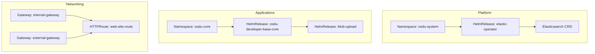
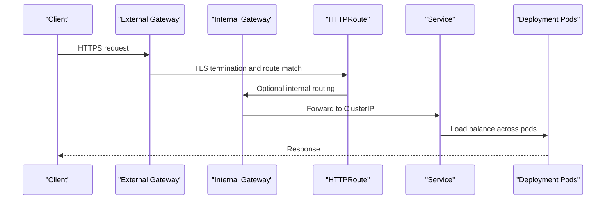
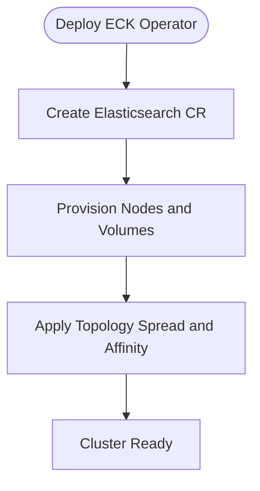
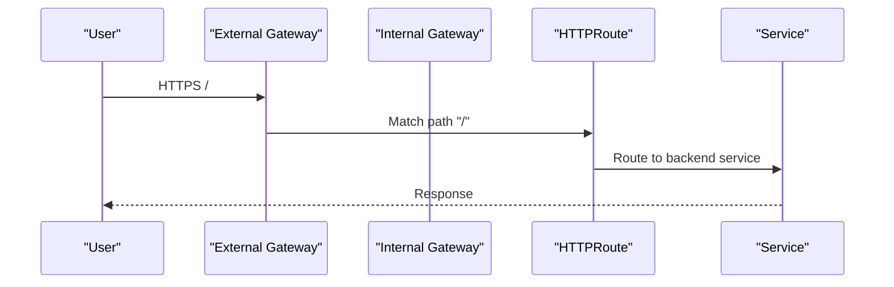
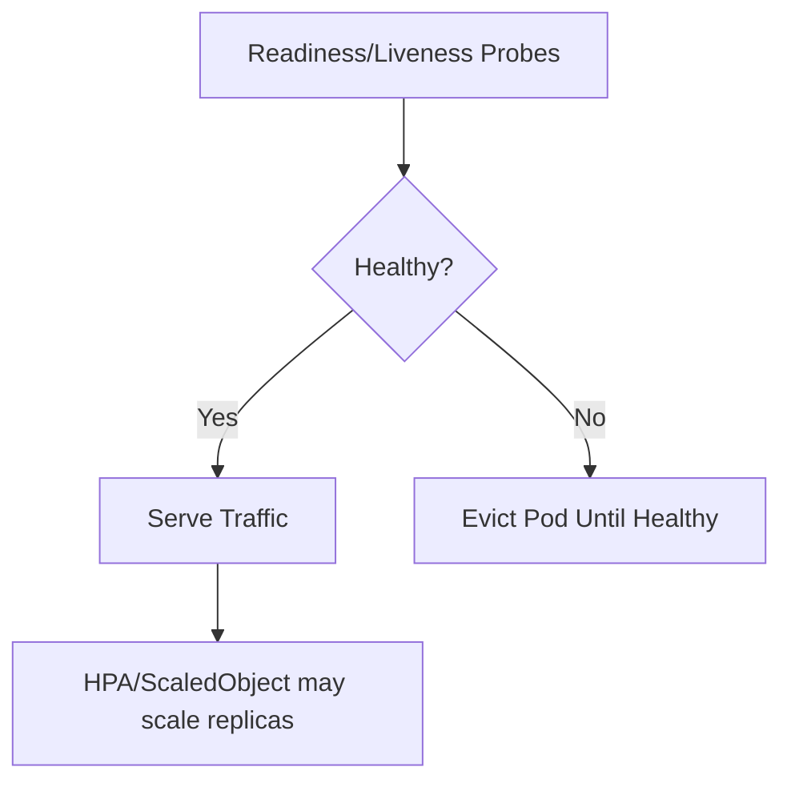
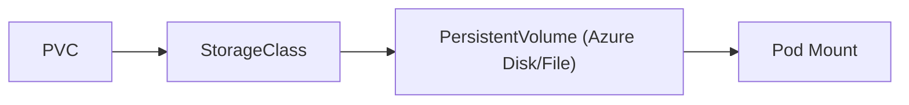
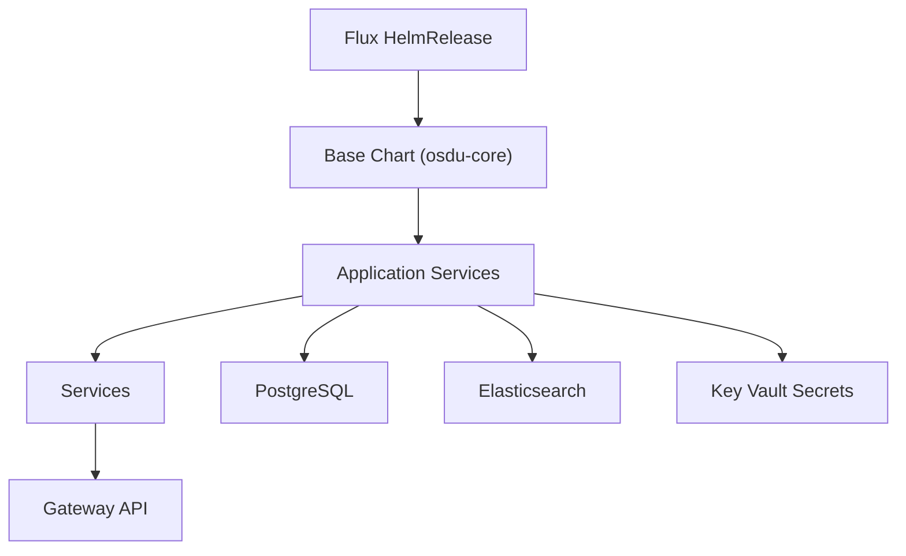

# Kubernetes Manifests and Resources

<cite>
**Referenced Files in This Document**
- [namespace.yaml](file://software/components/osdu-system/namespace.yaml)
- [namespace.yaml](file://software/applications/osdu-core/namespace.yaml)
- [gateway.yaml](file://software/components/mesh-ingress/gateway.yaml)
- [ingress.yaml](file://software/applications/web-site/ingress.yaml)
- [httproute.yaml](file://software/applications/web-site/httproute.yaml)
- [storage-class.yaml](file://software/components/elastic-storage/storage-class.yaml)
- [base.yaml](file://software/applications/osdu-core/base.yaml)
- [elastic-search.yaml](file://software/components/elastic-search/elastic-search.yaml)
- [postgresql.yaml](file://software/components/database/postgresql.yaml)
- [gateways.yaml](file://charts/istio-ingress/templates/gateways.yaml)
- [elastic.yaml](file://software/components/osdu-system/elastic.yaml)
- [deployment.yaml](file://charts/osdu-developer-service/templates/deployment.yaml)
- [service.yaml](file://charts/osdu-developer-service/templates/service.yaml)
- [pv.yaml](file://charts/storage-volumes/templates/pv.yaml)
- [kv-secrets.yaml](file://charts/keyvault-secrets/templates/kv-secrets.yaml)
</cite>

## Table of Contents
1. Introduction
2. Project Structure
3. Core Components
4. Architecture Overview
5. Detailed Component Analysis
6. Dependency Analysis
7. Performance Considerations
8. Troubleshooting Guide
9. Conclusion

## Introduction
This document provides comprehensive documentation for the Kubernetes resources deployed in this repository. It covers deployments, services, configmaps, secrets, persistent volumes, storage classes, ingress/Gateway API configuration, service discovery, external access patterns, scaling, health checks, resource limits, cluster networking, storage classes, and security contexts suitable for production environments. The manifests are primarily managed via Flux HelmReleases and Kustomize overlays, with application-specific Helm charts templating core workloads.

## Project Structure
The repository organizes Kubernetes resources into:
- software/components: foundational platform components (namespaces, operators, databases, search, mesh ingress, observability).
- software/applications: application-level releases (core services, web site, experimental features).
- charts: reusable Helm chart templates that generate Deployments, Services, HTTPRoutes, Secrets, PVCs, and more.
- bicep: infrastructure-as-code modules for Azure resources (not covered here beyond their impact on storage classes and identities).

Namespaces are explicitly created per component/application to isolate workloads and control sidecar injection and tenant labeling.

**Diagram sources**
- [namespace.yaml:1-8](file://software/components/osdu-system/namespace.yaml#L1-L8)
- [namespace.yaml:1-8](file://software/applications/osdu-core/namespace.yaml#L1-L8)
- [elastic.yaml:1-29](file://software/components/osdu-system/elastic.yaml#L1-L29)
- [base.yaml:1-72](file://software/applications/osdu-core/base.yaml#L1-L72)
- [gateways.yaml:1-96](file://charts/istio-ingress/templates/gateways.yaml#L1-L96)
- [httproute.yaml:1-24](file://software/applications/web-site/httproute.yaml#L1-L24)

**Section sources**
- [namespace.yaml:1-8](file://software/components/osdu-system/namespace.yaml#L1-L8)
- [namespace.yaml:1-8](file://software/applications/osdu-core/namespace.yaml#L1-L8)
- [base.yaml:1-72](file://software/applications/osdu-core/base.yaml#L1-L72)

## Core Components
- Namespaces:
  - osdu-system: system-level namespace with Istio injection disabled for operator/control plane isolation.
  - osdu-core: application namespace with Istio injection enabled for service mesh integration.
- Operators and CRDs:
  - Elastic Cloud on Kubernetes (ECK) operator installed via Flux HelmRelease to manage Elasticsearch clusters.
- Storage:
  - Elasticsearch uses a dedicated StorageClass for premium managed disks with retention policy.
  - PostgreSQL uses managed CSI storage classes for data and WAL volumes.
- Ingress and Gateway API:
  - Two Gateways (internal and external) provisioned by an Istio-backed GatewayClass.
  - HTTPRoute maps external/internal traffic to backend services.
- Workload Templates:
  - Service Deployment template supports readiness/liveness probes, resource requests/limits, environment variables from ConfigMaps/Secrets, and optional Key Vault mounts.
- Secrets:
  - Azure Key Vault integration via SecretProviderClass to mount secrets as files or sync to Kubernetes Secrets.

**Section sources**
- [namespace.yaml:1-8](file://software/components/osdu-system/namespace.yaml#L1-L8)
- [namespace.yaml:1-8](file://software/applications/osdu-core/namespace.yaml#L1-L8)
- [elastic.yaml:1-29](file://software/components/osdu-system/elastic.yaml#L1-L29)
- [storage-class.yaml:1-14](file://software/components/elastic-storage/storage-class.yaml#L1-L14)
- [postgresql.yaml:1-89](file://software/components/database/postgresql.yaml#L1-L89)
- [gateways.yaml:1-96](file://charts/istio-ingress/templates/gateways.yaml#L1-L96)
- [httproute.yaml:1-24](file://software/applications/web-site/httproute.yaml#L1-L24)
- [deployment.yaml:1-178](file://charts/osdu-developer-service/templates/deployment.yaml#L1-L178)
- [service.yaml:1-26](file://charts/osdu-developer-service/templates/service.yaml#L1-L26)
- [kv-secrets.yaml:1-30](file://charts/keyvault-secrets/templates/kv-secrets.yaml#L1-L30)

## Architecture Overview
The deployment model uses GitOps-driven Flux to reconcile HelmReleases into target namespaces. Application services are exposed through Gateway API-based Gateways with HTTPRoutes routing to ClusterIP Services. Persistent storage is provided via CSI-backed StorageClasses. Secrets are sourced from Azure Key Vault using the CSI driver.

**Diagram sources**
- [gateways.yaml:1-96](file://charts/istio-ingress/templates/gateways.yaml#L1-L96)
- [httproute.yaml:1-24](file://software/applications/web-site/httproute.yaml#L1-L24)
- [service.yaml:1-26](file://charts/osdu-developer-service/templates/service.yaml#L1-L26)
- [deployment.yaml:1-178](file://charts/osdu-developer-service/templates/deployment.yaml#L1-L178)

## Detailed Component Analysis

### Namespace Strategy and Mesh Integration
- osdu-system disables Istio sidecar injection to avoid interfering with operators and control-plane components.
- osdu-core enables Istio injection for application services requiring mTLS and traffic management.
- Labels support tenant scoping and toolchain integration (Flux labels).

**Section sources**
- [namespace.yaml:1-8](file://software/components/osdu-system/namespace.yaml#L1-L8)
- [namespace.yaml:1-8](file://software/applications/osdu-core/namespace.yaml#L1-L8)

### Operator Installation and Elasticsearch Management
- ECK operator is installed via Flux HelmRelease targeting osdu-system.
- Elasticsearch instances are defined as CRDs with node sets, volume claim templates, and topology spread constraints for zone-aware distribution.
- Node affinity and tolerations ensure placement on designated pools/zones.

**Diagram sources**
- [elastic.yaml:1-29](file://software/components/osdu-system/elastic.yaml#L1-L29)
- [elastic-search.yaml:1-89](file://software/components/elastic-search/elastic-search.yaml#L1-L89)

**Section sources**
- [elastic.yaml:1-29](file://software/components/osdu-system/elastic.yaml#L1-L29)
- [elastic-search.yaml:1-89](file://software/components/elastic-search/elastic-search.yaml#L1-L89)

### PostgreSQL High Availability
- PostgreSQL cluster defined via CNPG Cluster CR with replication slots and HA settings.
- Storage uses managed CSI classes for both data and WAL volumes.
- Service account annotations enable workload identity integration.

**Section sources**
- [postgresql.yaml:1-89](file://software/components/database/postgresql.yaml#L1-L89)

### Ingress and External Access Patterns
- Two Gateways (internal and external) expose HTTP/HTTPS listeners.
- TLS termination configured with certificate references stored in istio-system.
- HTTPRoute binds to both gateways to serve the same backend service under different exposure boundaries.
- Legacy VirtualService manifest is retained as comments indicating migration to Gateway API.

**Diagram sources**
- [gateways.yaml:1-96](file://charts/istio-ingress/templates/gateways.yaml#L1-L96)
- [httproute.yaml:1-24](file://software/applications/web-site/httproute.yaml#L1-L24)
- [ingress.yaml:1-27](file://software/applications/web-site/ingress.yaml#L1-L27)

**Section sources**
- [gateways.yaml:1-96](file://charts/istio-ingress/templates/gateways.yaml#L1-L96)
- [httproute.yaml:1-24](file://software/applications/web-site/httproute.yaml#L1-L24)
- [ingress.yaml:1-27](file://software/applications/web-site/ingress.yaml#L1-L27)

### Service Discovery and Backend Routing
- Services are templated with selectors matching pod labels; ports named “http” for consistent referencing.
- HTTPRoute backendRefs reference service names and ports to complete the external-to-internal routing chain.

**Section sources**
- [service.yaml:1-26](file://charts/osdu-developer-service/templates/service.yaml#L1-L26)
- [httproute.yaml:1-24](file://software/applications/web-site/httproute.yaml#L1-L24)

### Scaling, Health Checks, and Resource Limits
- Deployment template supports:
  - Readiness and liveness probes with configurable paths and ports.
  - Resource requests and limits per container.
  - Environment variables injected from ConfigMaps and Secrets.
  - Optional autoscaling via separate HPA/ScaledObject configurations (templated elsewhere).
- Base HelmRelease sets default resource requests/limits for all services in osdu-core.

**Diagram sources**
- [deployment.yaml:1-178](file://charts/osdu-developer-service/templates/deployment.yaml#L1-L178)
- [base.yaml:1-72](file://software/applications/osdu-core/base.yaml#L1-L72)

**Section sources**
- [deployment.yaml:1-178](file://charts/osdu-developer-service/templates/deployment.yaml#L1-L178)
- [base.yaml:1-72](file://software/applications/osdu-core/base.yaml#L1-L72)

### Persistent Volumes and Storage Classes
- Elasticsearch uses a custom StorageClass with Azure managed disks, Retain reclaim policy, and WaitForFirstConsumer binding mode.
- PostgreSQL uses managed CSI storage classes for data and WAL volumes.
- Blob-based PVs provisioned via Azure File CSI with specific mount options and attributes for performance and caching behavior.

**Diagram sources**
- [storage-class.yaml:1-14](file://software/components/elastic-storage/storage-class.yaml#L1-L14)
- [postgresql.yaml:1-89](file://software/components/database/postgresql.yaml#L1-L89)
- [pv.yaml:1-33](file://charts/storage-volumes/templates/pv.yaml#L1-L33)

**Section sources**
- [storage-class.yaml:1-14](file://software/components/elastic-storage/storage-class.yaml#L1-L14)
- [postgresql.yaml:1-89](file://software/components/database/postgresql.yaml#L1-L89)
- [pv.yaml:1-33](file://charts/storage-volumes/templates/pv.yaml#L1-L33)

### Secrets and Security Contexts
- Azure Key Vault integration via SecretProviderClass:
  - Maps vault secrets to Kubernetes Secrets or mounts them directly into pods.
  - Uses client ID and tenant ID for authentication.
- Workload identity annotations on service accounts enable secure access to Azure resources without long-lived credentials.
- Pod specs include labels and annotations for mesh integration and identity usage.

**Section sources**
- [kv-secrets.yaml:1-30](file://charts/keyvault-secrets/templates/kv-secrets.yaml#L1-L30)
- [deployment.yaml:1-178](file://charts/osdu-developer-service/templates/deployment.yaml#L1-L178)
- [postgresql.yaml:1-89](file://software/components/database/postgresql.yaml#L1-L89)

### HelmRelease Orchestration and Values
- HelmRelease resources orchestrate installation of base services and applications into target namespaces.
- Values are sourced from ConfigMaps and inline values, enabling centralized configuration management.
- Dependencies between releases ensure correct ordering (e.g., blob-upload depends on base-core).

**Section sources**
- [base.yaml:1-72](file://software/applications/osdu-core/base.yaml#L1-L72)
- [gateway.yaml:1-55](file://software/components/mesh-ingress/gateway.yaml#L1-L55)

## Dependency Analysis
- Flux manages HelmReleases that install operators and application charts into specific namespaces.
- Application services depend on:
  - Gateway API resources (Gateways and HTTPRoutes) for external exposure.
  - Services for internal discovery.
  - Persistent storage via StorageClasses and PVs/PVCs.
  - Secrets from Key Vault via CSI.
- Elasticsearch and PostgreSQL provide stateful backends consumed by application services.

**Diagram sources**
- [base.yaml:1-72](file://software/applications/osdu-core/base.yaml#L1-L72)
- [gateways.yaml:1-96](file://charts/istio-ingress/templates/gateways.yaml#L1-L96)
- [postgresql.yaml:1-89](file://software/components/database/postgresql.yaml#L1-L89)
- [elastic-search.yaml:1-89](file://software/components/elastic-search/elastic-search.yaml#L1-L89)
- [kv-secrets.yaml:1-30](file://charts/keyvault-secrets/templates/kv-secrets.yaml#L1-L30)

**Section sources**
- [base.yaml:1-72](file://software/applications/osdu-core/base.yaml#L1-L72)
- [gateways.yaml:1-96](file://charts/istio-ingress/templates/gateways.yaml#L1-L96)
- [postgresql.yaml:1-89](file://software/components/database/postgresql.yaml#L1-L89)
- [elastic-search.yaml:1-89](file://software/components/elastic-search/elastic-search.yaml#L1-L89)
- [kv-secrets.yaml:1-30](file://charts/keyvault-secrets/templates/kv-secrets.yaml#L1-L30)

## Performance Considerations
- Use WaitForFirstConsumer binding mode to optimize scheduling and locality.
- Apply topology spread constraints to distribute stateful workloads across zones.
- Set appropriate resource requests/limits to prevent noisy neighbor issues.
- Enable readiness/liveness probes to ensure only healthy pods receive traffic.
- For high-throughput storage, use premium disk classes and tune mount options for file shares.

[No sources needed since this section provides general guidance]

## Troubleshooting Guide
- If services are unreachable externally:
  - Verify Gateways are provisioned and have valid TLS certificates.
  - Confirm HTTPRoute matches and backendRefs point to correct services and ports.
- If pods fail readiness:
  - Inspect probe endpoints and initial delay settings.
  - Check resource constraints and logs for startup errors.
- If storage fails to bind:
  - Validate StorageClass exists and has sufficient quota.
  - Ensure CSI drivers are installed and permissions are granted.
- If secrets are not mounted:
  - Confirm SecretProviderClass parameters and workload identity annotations.
  - Verify Key Vault access policies and client IDs.

**Section sources**
- [gateways.yaml:1-96](file://charts/istio-ingress/templates/gateways.yaml#L1-L96)
- [httproute.yaml:1-24](file://software/applications/web-site/httproute.yaml#L1-L24)
- [deployment.yaml:1-178](file://charts/osdu-developer-service/templates/deployment.yaml#L1-L178)
- [storage-class.yaml:1-14](file://software/components/elastic-storage/storage-class.yaml#L1-L14)
- [kv-secrets.yaml:1-30](file://charts/keyvault-secrets/templates/kv-secrets.yaml#L1-L30)

## Conclusion
This repository implements a production-ready Kubernetes deployment model using Flux-managed HelmReleases, Gateway API-based ingress, and robust storage and secret management. Namespaces isolate system and application layers, while operators manage stateful components like Elasticsearch and PostgreSQL. Services are exposed securely via Gateways with TLS termination and routed through HTTPRoutes. Scaling, health checks, and resource limits are templated for consistency across services. Secrets are integrated with Azure Key Vault using CSI, and storage classes are tuned for performance and reliability.