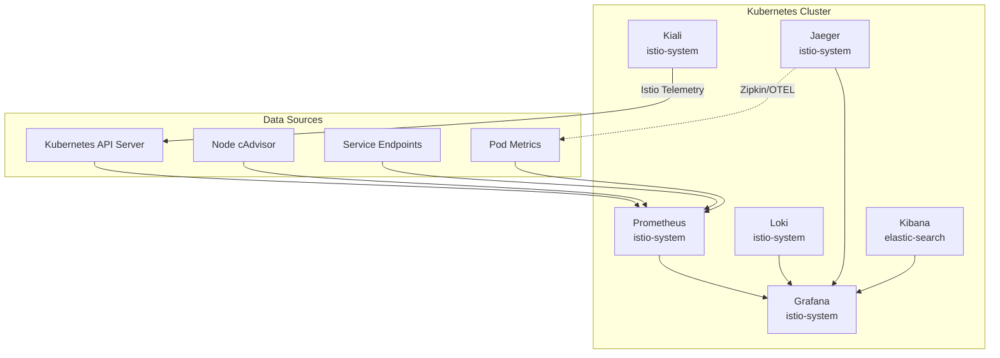
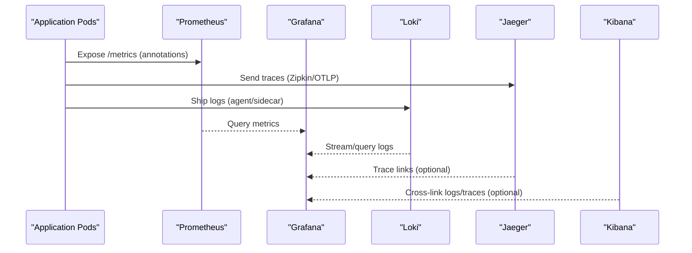
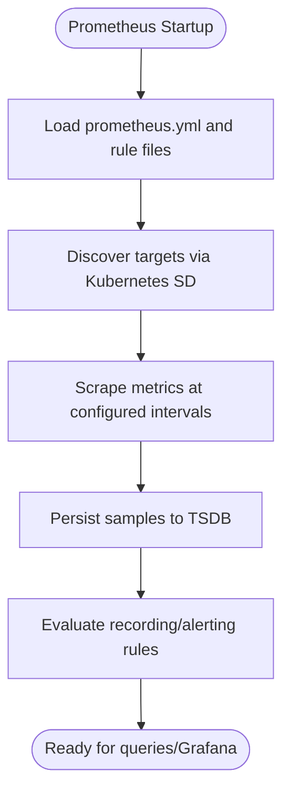
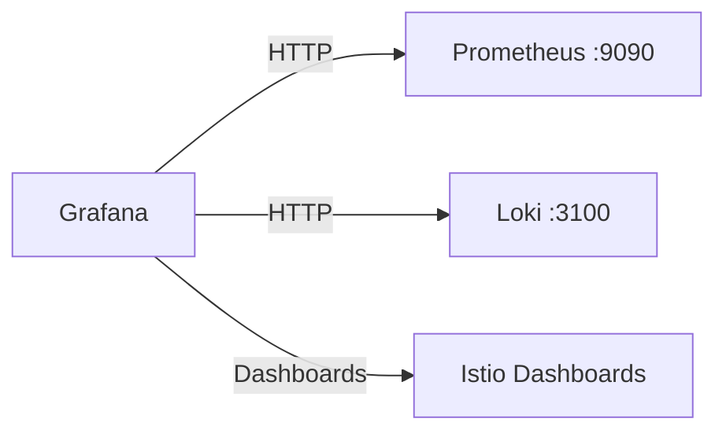
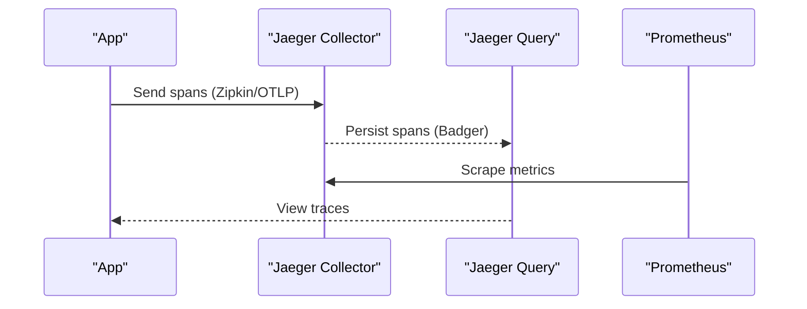
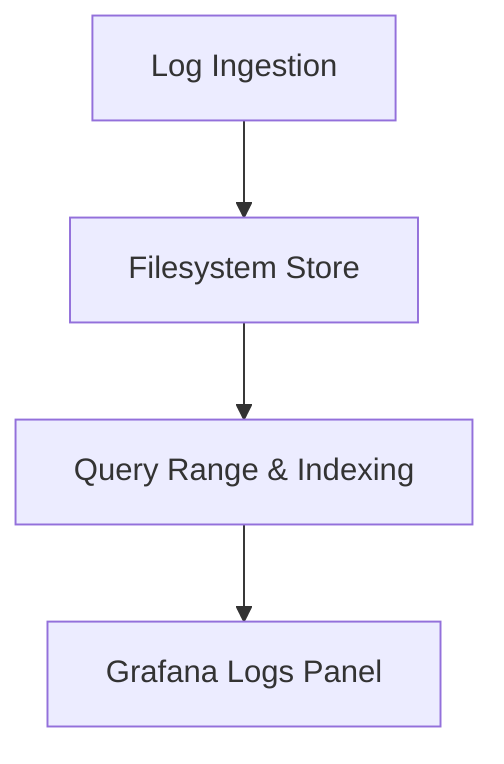
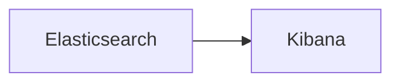
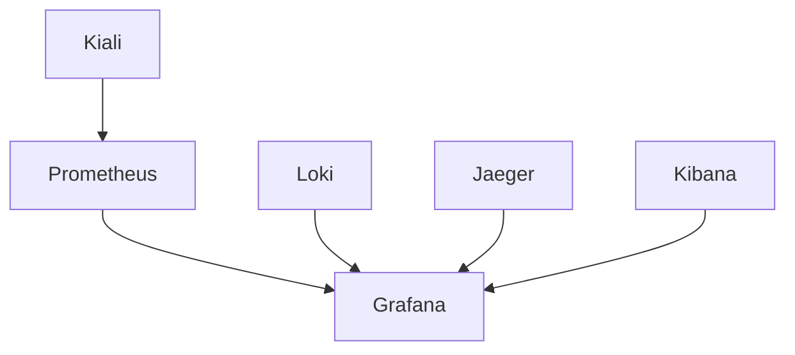

# Monitoring and Observability

<cite>
**Referenced Files in This Document**
- [prometheus.yaml](file://software/components/observability/prometheus.yaml)
- [grafana.yaml](file://software/components/observability/grafana.yaml)
- [jaeger.yaml](file://software/components/observability/jaeger.yaml)
- [loki.yaml](file://software/components/observability/loki.yaml)
- [kiali.yaml](file://software/components/observability/kiali.yaml)
- [kibana.yaml](file://software/components/elastic-search/kibana.yaml)
- [subnet_monitoring.yaml](file://software/components/observability/subnet_monitoring.yaml)
</cite>

## Table of Contents
1. Introduction
2. Project Structure
3. Core Components
4. Architecture Overview
5. Detailed Component Analysis
6. Dependency Analysis
7. Performance Considerations
8. Troubleshooting Guide
9. Conclusion

## Introduction
This document describes the observability stack deployed in the repository, covering metrics collection with Prometheus, visualization with Grafana, distributed tracing with Jaeger, log aggregation with Loki, and log analytics via Kibana. It explains how components are configured, how data flows between them, and how to set up alerting rules, custom metrics, log retention policies, and debugging workflows for both development and production environments.

## Project Structure
The observability stack is defined as Kubernetes manifests under software/components/observability and elastic-search:
- Metrics: Prometheus (scrapes Kubernetes, services, pods, nodes)
- Visualization: Grafana (provisions datasources and dashboards)
- Tracing: Jaeger (all-in-one with Badger storage)
- Logs: Loki (single-binary mode with filesystem storage)
- Service mesh visibility: Kiali (Istio integration)
- Log analytics: Kibana (Elasticsearch-based)

**Diagram sources**
- [prometheus.yaml:39-348](file://software/components/observability/prometheus.yaml#L39-L348)
- [grafana.yaml:42-63](file://software/components/observability/grafana.yaml#L42-L63)
- [jaeger.yaml:21-55](file://software/components/observability/jaeger.yaml#L21-L55)
- [loki.yaml:29-75](file://software/components/observability/loki.yaml#L29-L75)
- [kibana.yaml:1-49](file://software/components/elastic-search/kibana.yaml#L1-L49)

**Section sources**
- [prometheus.yaml:1-554](file://software/components/observability/prometheus.yaml#L1-L554)
- [grafana.yaml:1-200](file://software/components/observability/grafana.yaml#L1-L200)
- [jaeger.yaml:1-122](file://software/components/observability/jaeger.yaml#L1-L122)
- [loki.yaml:1-290](file://software/components/observability/loki.yaml#L1-L290)
- [kiali.yaml:1-563](file://software/components/observability/kiali.yaml#L1-L563)
- [kibana.yaml:1-49](file://software/components/elastic-search/kibana.yaml#L1-L49)

## Core Components
- Prometheus: Central time-series database and scraper; discovers and scrapes Kubernetes API server, nodes/cAdvisor, service endpoints, and pods using annotations; supports rule files for recording and alerting rules.
- Grafana: Visualization platform provisioned with Prometheus and Loki datasources; includes Istio dashboard providers.
- Jaeger: Distributed tracing backend exposing Zipkin-compatible endpoint and OpenTelemetry ports; stores spans in Badger on disk.
- Loki: Log aggregation system running single-binary mode with filesystem storage; exposes HTTP and gRPC endpoints; supports query range alignment and retention controls.
- Kibana: Elasticsearch-based UI for log analytics; configured to connect to an Elasticsearch cluster.
- Kiali: Service mesh observability for Istio; integrates with Prometheus and provides mesh-level insights.

**Section sources**
- [prometheus.yaml:39-348](file://software/components/observability/prometheus.yaml#L39-L348)
- [grafana.yaml:28-63](file://software/components/observability/grafana.yaml#L28-L63)
- [jaeger.yaml:21-55](file://software/components/observability/jaeger.yaml#L21-L55)
- [loki.yaml:29-75](file://software/components/observability/loki.yaml#L29-L75)
- [kibana.yaml:1-49](file://software/components/elastic-search/kibana.yaml#L1-L49)
- [kiali.yaml:35-140](file://software/components/observability/kiali.yaml#L35-L140)

## Architecture Overview
The stack follows a standard observability pattern:
- Application workloads emit metrics, logs, and traces.
- Prometheus scrapes metrics from Kubernetes resources and annotated services/pods.
- Loki ingests logs via sidecars or agents and persists them locally.
- Jaeger receives traces via Zipkin/OTLP endpoints.
- Grafana visualizes metrics and logs and can integrate tracing.
- Kibana provides advanced log search and analytics over Elasticsearch.
- Kiali offers Istio-specific service mesh visibility.

**Diagram sources**
- [prometheus.yaml:105-348](file://software/components/observability/prometheus.yaml#L105-L348)
- [grafana.yaml:42-63](file://software/components/observability/grafana.yaml#L42-L63)
- [jaeger.yaml:79-122](file://software/components/observability/jaeger.yaml#L79-L122)
- [loki.yaml:143-170](file://software/components/observability/loki.yaml#L143-L170)
- [kibana.yaml:1-49](file://software/components/elastic-search/kibana.yaml#L1-L49)

## Detailed Component Analysis

### Prometheus: Metrics Collection and Alerting
- Scraping targets:
  - Kubernetes API server, nodes, and cAdvisor via RBAC and HTTPS.
  - Service endpoints and pods discovered through annotations (e.g., prometheus.io/scrape).
  - Slow scrape jobs for expensive endpoints.
- Rule files:
  - Recording rules and alerting rules are mounted via ConfigMap paths.
- Storage and lifecycle:
  - Time-based retention configured via command-line flags.
  - Lifecycle API enabled for hot reloads.

**Diagram sources**
- [prometheus.yaml:39-348](file://software/components/observability/prometheus.yaml#L39-L348)
- [prometheus.yaml:455-554](file://software/components/observability/prometheus.yaml#L455-L554)

**Section sources**
- [prometheus.yaml:39-348](file://software/components/observability/prometheus.yaml#L39-L348)
- [prometheus.yaml:455-554](file://software/components/observability/prometheus.yaml#L455-L554)

### Grafana: Dashboards and Datasources
- Datasources provisioned via ConfigMap:
  - Prometheus as default datasource.
  - Loki for unified log exploration.
- Dashboard providers:
  - Istio dashboards loaded from mounted directories.
- Access:
  - Anonymous access enabled for quick setup; admin credentials configured via environment variables.

**Diagram sources**
- [grafana.yaml:42-63](file://software/components/observability/grafana.yaml#L42-L63)
- [grafana.yaml:104-200](file://software/components/observability/grafana.yaml#L104-L200)

**Section sources**
- [grafana.yaml:28-63](file://software/components/observability/grafana.yaml#L28-L63)
- [grafana.yaml:104-200](file://software/components/observability/grafana.yaml#L104-L200)

### Jaeger: Distributed Tracing
- All-in-one deployment with Badger storage on emptyDir.
- Zipkin-compatible endpoint exposed for compatibility.
- OpenTelemetry gRPC/HTTP endpoints exposed for modern instrumentation.
- Prometheus scraping enabled for Jaeger metrics.

**Diagram sources**
- [jaeger.yaml:21-55](file://software/components/observability/jaeger.yaml#L21-L55)
- [jaeger.yaml:79-122](file://software/components/observability/jaeger.yaml#L79-L122)

**Section sources**
- [jaeger.yaml:1-122](file://software/components/observability/jaeger.yaml#L1-L122)

### Loki: Log Aggregation
- Single-binary mode with filesystem storage under /var/loki.
- HTTP and gRPC endpoints exposed.
- Retention and query tuning via config (reject old samples, split queries).
- Persistent volume provisioned for durability.

**Diagram sources**
- [loki.yaml:29-75](file://software/components/observability/loki.yaml#L29-L75)
- [loki.yaml:171-290](file://software/components/observability/loki.yaml#L171-L290)

**Section sources**
- [loki.yaml:1-290](file://software/components/observability/loki.yaml#L1-L290)

### Kibana: Log Analytics
- Kibana resource references an Elasticsearch cluster by name.
- Count set to 3 for high availability.
- Environment variables configure encryption key and Elasticsearch hosts.

**Diagram sources**
- [kibana.yaml:1-49](file://software/components/elastic-search/kibana.yaml#L1-L49)

**Section sources**
- [kibana.yaml:1-49](file://software/components/elastic-search/kibana.yaml#L1-L49)

### Kiali: Service Mesh Visibility
- Configured for anonymous auth and Istio namespace.
- Integrates with Prometheus for metrics and displays Istio dashboards.
- RBAC grants read/write access to Istio CRDs and core Kubernetes objects.

**Section sources**
- [kiali.yaml:35-140](file://software/components/observability/kiali.yaml#L35-L140)
- [kiali.yaml:412-563](file://software/components/observability/kiali.yaml#L412-L563)

## Dependency Analysis
- Grafana depends on Prometheus and Loki datasources.
- Prometheus depends on Kubernetes API permissions and annotated services/pods.
- Jaeger exposes multiple protocols for instrumentation backends.
- Loki runs as a StatefulSet with persistent storage.
- Kibana depends on an Elasticsearch cluster referenced by name.

**Diagram sources**
- [grafana.yaml:42-63](file://software/components/observability/grafana.yaml#L42-L63)
- [prometheus.yaml:39-348](file://software/components/observability/prometheus.yaml#L39-L348)
- [loki.yaml:143-170](file://software/components/observability/loki.yaml#L143-L170)
- [jaeger.yaml:79-122](file://software/components/observability/jaeger.yaml#L79-L122)
- [kibana.yaml:1-49](file://software/components/elastic-search/kibana.yaml#L1-L49)

**Section sources**
- [grafana.yaml:42-63](file://software/components/observability/grafana.yaml#L42-L63)
- [prometheus.yaml:39-348](file://software/components/observability/prometheus.yaml#L39-L348)
- [loki.yaml:143-170](file://software/components/observability/loki.yaml#L143-L170)
- [jaeger.yaml:79-122](file://software/components/observability/jaeger.yaml#L79-L122)
- [kibana.yaml:1-49](file://software/components/elastic-search/kibana.yaml#L1-L49)

## Performance Considerations
- Prometheus:
  - Use slow scrape jobs for expensive endpoints to reduce load.
  - Tune evaluation_interval and scrape intervals based on workload size.
  - Ensure adequate storage for TSDB retention.
- Loki:
  - Configure reject_old_samples_max_age for log retention.
  - Enable hedging and tune query_range settings for performance.
  - Size persistent volumes appropriately for log volume.
- Jaeger:
  - Set MEMORY_MAX_TRACES and use persistent storage for spans in production.
  - Use separate collector and query deployments at scale.
- Grafana:
  - Provision datasources and dashboards via ConfigMaps for reproducibility.
  - Limit anonymous access in production and secure with authentication.
- Kibana:
  - Scale Elasticsearch and Kibana replicas for resilience and throughput.
  - Use appropriate index lifecycle management for log retention.

[No sources needed since this section provides general guidance]

## Troubleshooting Guide
- Prometheus not scraping:
  - Verify annotations on services/pods and RBAC permissions.
  - Check scrape configs and relabel rules.
- Grafana cannot connect to datasources:
  - Confirm service names and ports in datasources provisioning.
  - Validate network policies and DNS resolution within the cluster.
- Jaeger not receiving traces:
  - Ensure applications send traces to correct endpoints (Zipkin/OTLP).
  - Check readiness/liveness probes and storage mounts.
- Loki ingestion issues:
  - Inspect HTTP/gRPC endpoints and health checks.
  - Review storage capacity and retention configuration.
- Kibana connectivity:
  - Validate Elasticsearch hosts and credentials.
  - Check pod affinity/tolerations and node selectors.

**Section sources**
- [prometheus.yaml:39-348](file://software/components/observability/prometheus.yaml#L39-L348)
- [grafana.yaml:42-63](file://software/components/observability/grafana.yaml#L42-L63)
- [jaeger.yaml:21-55](file://software/components/observability/jaeger.yaml#L21-L55)
- [loki.yaml:29-75](file://software/components/observability/loki.yaml#L29-L75)
- [kibana.yaml:1-49](file://software/components/elastic-search/kibana.yaml#L1-L49)

## Conclusion
The repository deploys a comprehensive observability stack that covers metrics, logs, traces, and visualization. Prometheus collects and evaluates metrics; Grafana provides unified dashboards; Jaeger enables distributed tracing; Loki aggregates logs; Kibana offers advanced log analytics; and Kiali adds service mesh visibility. With proper configuration of alerting rules, custom metrics, and retention policies, this stack supports robust monitoring and debugging across development and production environments.

[No sources needed since this section summarizes without analyzing specific files]