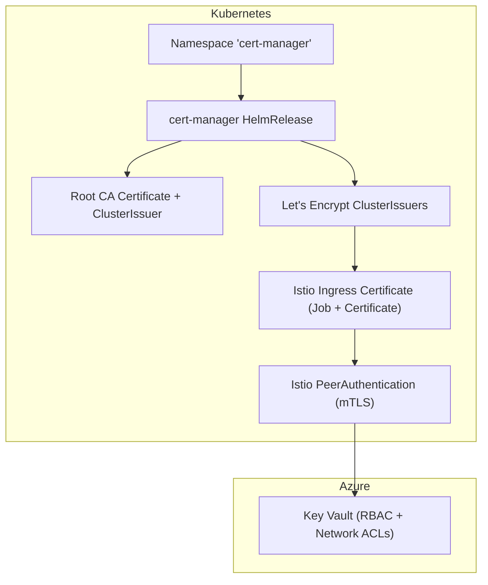
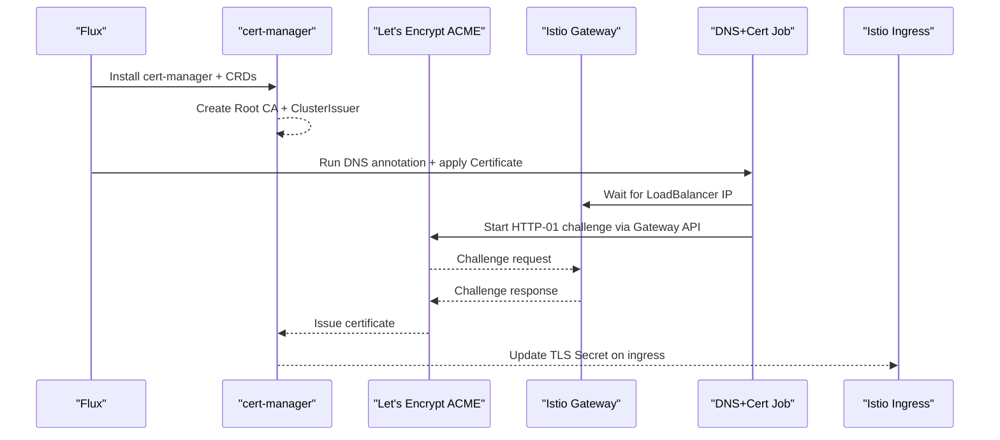
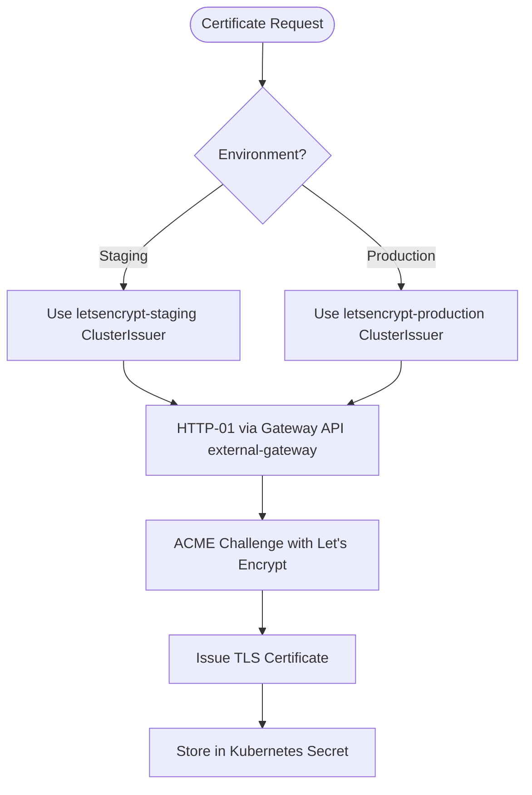
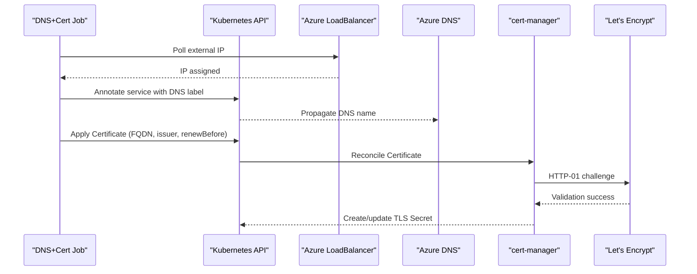
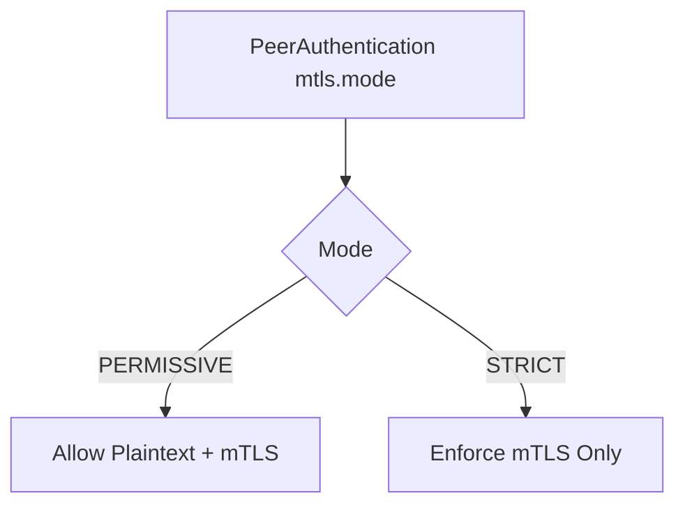
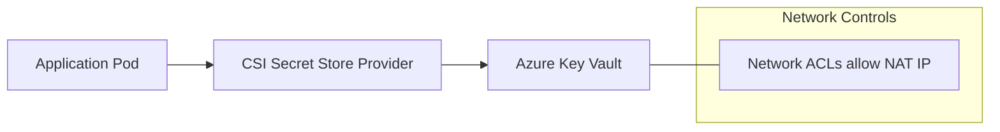
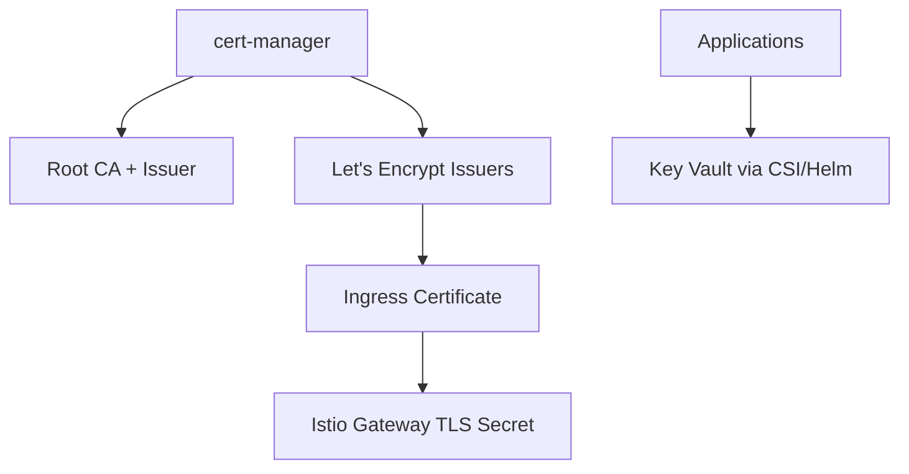

# Certificate Management

<cite>
**Referenced Files in This Document**
- [release.yaml](file://software/components/certs/release.yaml)
- [namespace.yaml](file://software/components/certs/namespace.yaml)
- [certificate.yaml](file://software/components/certs-ca/certificate.yaml)
- [issuer.yaml](file://software/components/certs-issuer/issuer.yaml)
- [lets-encrypt.yaml](file://software/components/certs-issuer/lets-encrypt.yaml)
- [configmap.yaml](file://charts/istio-certs/templates/configmap.yaml)
- [certificate.yaml](file://charts/istio-ingress/templates/certificate.yaml)
- [httproutes.yaml](file://charts/istio-ingress/templates/httproutes.yaml)
- [peer-authentication.yaml](file://charts/osdu-developer-base/templates/peer-authentication.yaml)
- [certs.yaml](file://software/components/mesh-ingress/certs.yaml)
- [main.bicep](file://bicep/main.bicep)
- [network_acl_vault.bicep](file://bicep/modules/network_acl_vault.bicep)
- [values.yaml](file://charts/keyvault-secrets/values.yaml)
- [kv-secret.yaml](file://charts/osdu-developer-service/templates/kv-secret.yaml)
</cite>

## Table of Contents
1. Introduction
2. Project Structure
3. Core Components
4. Architecture Overview
5. Detailed Component Analysis
6. Dependency Analysis
7. Performance Considerations
8. Troubleshooting Guide
9. Conclusion

## Introduction
This document explains how the repository provisions and manages TLS certificates using cert-manager with Let’s Encrypt, establishes a private root CA for internal trust, configures mutual TLS (mTLS) between services via Istio, and integrates secret management with Azure Key Vault. It covers issuer configuration, certificate lifecycle automation, rotation policies, validation chains, monitoring considerations, and production best practices.

## Project Structure
Certificate-related resources are organized into:
- cert-manager installation and namespace
- Private root CA creation and ClusterIssuer
- Let’s Encrypt ClusterIssuers (staging and production)
- Istio ingress certificate provisioning via a Job that waits for LoadBalancer IP, sets DNS, and applies a Certificate resource
- Istio mTLS policy
- Azure Key Vault integration for secrets used by applications



**Diagram sources**
- [release.yaml:1-23](file://software/components/certs/release.yaml#L1-L23)
- [namespace.yaml:1-8](file://software/components/certs/namespace.yaml#L1-L8)
- [certificate.yaml:1-23](file://software/components/certs-ca/certificate.yaml#L1-L23)
- [lets-encrypt.yaml:1-34](file://software/components/certs-issuer/lets-encrypt.yaml#L1-L34)
- [configmap.yaml:44-87](file://charts/istio-certs/templates/configmap.yaml#L44-L87)
- [peer-authentication.yaml:1-7](file://charts/osdu-developer-base/templates/peer-authentication.yaml#L1-L7)
- [main.bicep:599-661](file://bicep/main.bicep#L599-L661)
- [network_acl_vault.bicep:25-47](file://bicep/modules/network_acl_vault.bicep#L25-L47)

**Section sources**
- [release.yaml:1-23](file://software/components/certs/release.yaml#L1-L23)
- [namespace.yaml:1-8](file://software/components/certs/namespace.yaml#L1-L8)

## Core Components
- cert-manager installation and CRDs
- Private root CA and ClusterIssuer for internal issuance
- Let’s Encrypt ClusterIssuers (staging and production) with HTTP-01 solver over Gateway API
- Istio ingress certificate provisioning job that sets DNS and applies a Certificate
- Istio mTLS policy for service-to-service encryption
- Azure Key Vault integration for application secrets

**Section sources**
- [release.yaml:1-23](file://software/components/certs/release.yaml#L1-L23)
- [certificate.yaml:1-23](file://software/components/certs-ca/certificate.yaml#L1-L23)
- [issuer.yaml:1-9](file://software/components/certs-issuer/issuer.yaml#L1-L9)
- [lets-encrypt.yaml:1-34](file://software/components/certs-issuer/lets-encrypt.yaml#L1-L34)
- [configmap.yaml:44-87](file://charts/istio-certs/templates/configmap.yaml#L44-L87)
- [peer-authentication.yaml:1-7](file://charts/osdu-developer-base/templates/peer-authentication.yaml#L1-L7)

## Architecture Overview
The system uses cert-manager to automate TLS certificate lifecycle:
- A private root CA is created and exposed as a ClusterIssuer for internal workloads.
- External-facing traffic terminates at the Istio gateway; a Job ensures DNS is configured and then applies a Certificate resource referencing a Let’s Encrypt ClusterIssuer.
- The HTTP-01 challenge is routed through the Gateway API external-gateway.
- Services communicate via mTLS enforced or permitted by Istio policies.
- Secrets required by services are provisioned from Azure Key Vault using CSI Secret Store or Helm-based mechanisms.



**Diagram sources**
- [release.yaml:1-23](file://software/components/certs/release.yaml#L1-L23)
- [certificate.yaml:1-23](file://software/components/certs-ca/certificate.yaml#L1-L23)
- [lets-encrypt.yaml:1-34](file://software/components/certs-issuer/lets-encrypt.yaml#L1-L34)
- [configmap.yaml:23-57](file://charts/istio-certs/templates/configmap.yaml#L23-L57)
- [configmap.yaml:60-87](file://charts/istio-certs/templates/configmap.yaml#L60-L87)
- [httproutes.yaml:1-12](file://charts/istio-ingress/templates/httproutes.yaml#L1-L12)

## Detailed Component Analysis

### Private Root CA and Internal Issuer
- A self-signed ClusterIssuer creates a root CA certificate stored in a Kubernetes Secret.
- A ClusterIssuer references this CA Secret to issue internal certificates for mesh or internal services.

```mermaid
classDiagram
class SelfSignedClusterIssuer {
+name : "selfsigned-cluster-issuer"
+spec.selfSigned : {}
}
class RootCACertificate {
+name : "root-ca"
+isCA : true
+secretName : "root-ca-secret"
+commonName : "root-ca"
}
class RootCAIssuer {
+name : "root-ca-cluster-issuer"
+spec.ca.secretName : "root-ca-secret"
}
SelfSignedClusterIssuer --> RootCACertificate : "issues"
RootCACertificate --> RootCAIssuer : "enables"
```

**Diagram sources**
- [certificate.yaml:1-23](file://software/components/certs-ca/certificate.yaml#L1-L23)
- [issuer.yaml:1-9](file://software/components/certs-issuer/issuer.yaml#L1-L9)

**Section sources**
- [certificate.yaml:1-23](file://software/components/certs-ca/certificate.yaml#L1-L23)
- [issuer.yaml:1-9](file://software/components/certs-issuer/issuer.yaml#L1-L9)

### Let’s Encrypt Integration (Staging and Production)
- Two ClusterIssuers target Let’s Encrypt staging and production ACME servers.
- Both use the HTTP-01 solver bound to the Gateway API external-gateway in istio-system.
- Private keys are stored in dedicated Secrets per environment.



**Diagram sources**
- [lets-encrypt.yaml:1-34](file://software/components/certs-issuer/lets-encrypt.yaml#L1-L34)

**Section sources**
- [lets-encrypt.yaml:1-34](file://software/components/certs-issuer/lets-encrypt.yaml#L1-L34)

### Istio Ingress Certificate Automation
- A Job script waits for the external LoadBalancer IP, annotates the service with an Azure DNS label, and applies a Certificate resource targeting the correct FQDN.
- The Certificate specifies duration and renewal timing, and references the appropriate ClusterIssuer.



**Diagram sources**
- [configmap.yaml:23-57](file://charts/istio-certs/templates/configmap.yaml#L23-L57)
- [configmap.yaml:60-87](file://charts/istio-certs/templates/configmap.yaml#L60-L87)
- [certificate.yaml:1-8](file://charts/istio-ingress/templates/certificate.yaml#L1-L8)

**Section sources**
- [configmap.yaml:23-57](file://charts/istio-certs/templates/configmap.yaml#L23-L57)
- [configmap.yaml:60-87](file://charts/istio-certs/templates/configmap.yaml#L60-L87)
- [certificate.yaml:1-8](file://charts/istio-ingress/templates/certificate.yaml#L1-L8)

### Mutual TLS (mTLS) Between Services
- A PeerAuthentication resource sets mTLS mode to PERMISSIVE, allowing both plaintext and mTLS traffic during transition.
- For strict enforcement, change the mode to STRICT after validating service compatibility.



**Diagram sources**
- [peer-authentication.yaml:1-7](file://charts/osdu-developer-base/templates/peer-authentication.yaml#L1-L7)

**Section sources**
- [peer-authentication.yaml:1-7](file://charts/osdu-developer-base/templates/peer-authentication.yaml#L1-L7)

### Azure Key Vault Integration for Secrets
- Key Vault is provisioned with RBAC roles and network ACLs restricting access to cluster NAT IP.
- Applications can mount secrets via CSI Secret Store or Helm templates mapping Key Vault secrets to Kubernetes Secrets.



**Diagram sources**
- [main.bicep:599-661](file://bicep/main.bicep#L599-L661)
- [network_acl_vault.bicep:25-47](file://bicep/modules/network_acl_vault.bicep#L25-L47)
- [kv-secret.yaml:1-36](file://charts/osdu-developer-service/templates/kv-secret.yaml#L1-L36)
- [values.yaml:1-11](file://charts/keyvault-secrets/values.yaml#L1-L11)

**Section sources**
- [main.bicep:599-661](file://bicep/main.bicep#L599-L661)
- [network_acl_vault.bicep:25-47](file://bicep/modules/network_acl_vault.bicep#L25-L47)
- [kv-secret.yaml:1-36](file://charts/osdu-developer-service/templates/kv-secret.yaml#L1-L36)
- [values.yaml:1-11](file://charts/keyvault-secrets/values.yaml#L1-L11)

## Dependency Analysis
- cert-manager must be installed before any Certificate or Issuer resources are applied.
- Root CA must exist before the internal ClusterIssuer can reference it.
- Let’s Encrypt issuers depend on Gateway API external-gateway being available for HTTP-01 challenges.
- The Istio ingress certificate Job depends on the external LoadBalancer IP and DNS propagation.
- Application secret mounts depend on Key Vault RBAC and network ACLs.



**Diagram sources**
- [release.yaml:1-23](file://software/components/certs/release.yaml#L1-L23)
- [certificate.yaml:1-23](file://software/components/certs-ca/certificate.yaml#L1-L23)
- [lets-encrypt.yaml:1-34](file://software/components/certs-issuer/lets-encrypt.yaml#L1-L34)
- [configmap.yaml:60-87](file://charts/istio-certs/templates/configmap.yaml#L60-L87)
- [kv-secret.yaml:1-36](file://charts/osdu-developer-service/templates/kv-secret.yaml#L1-L36)

**Section sources**
- [release.yaml:1-23](file://software/components/certs/release.yaml#L1-L23)
- [lets-encrypt.yaml:1-34](file://software/components/certs-issuer/lets-encrypt.yaml#L1-L34)
- [configmap.yaml:60-87](file://charts/istio-certs/templates/configmap.yaml#L60-L87)

## Performance Considerations
- Use staging ClusterIssuer for testing to avoid rate limits and ensure routing correctness before enabling production.
- Ensure Gateway API external-gateway has sufficient capacity to handle ACME challenge requests.
- Keep Certificate duration and renewBefore values balanced to minimize churn while ensuring timely renewals.
- Restrict Key Vault network access to only necessary IPs to reduce latency and improve security posture.

[No sources needed since this section provides general guidance]

## Troubleshooting Guide
Common issues and resolutions:
- ACME HTTP-01 challenge fails:
  - Verify the external-gateway exists in istio-system and is reachable.
  - Confirm DNS label annotation was applied and propagates correctly.
  - Check that the Certificate references the correct ClusterIssuer and FQDN.
- Certificate not issued:
  - Inspect cert-manager logs and Certificate status conditions.
  - Validate that the private key Secret exists and is writable.
- mTLS connectivity errors:
  - Review PeerAuthentication mode; switch to STRICT only after verifying all clients support mTLS.
  - Ensure sidecar injection and destination rules are correctly configured.
- Key Vault access denied:
  - Confirm RBAC role assignments (e.g., Key Vault Secrets User).
  - Validate network ACLs allow the cluster NAT IP.

**Section sources**
- [httproutes.yaml:1-12](file://charts/istio-ingress/templates/httproutes.yaml#L1-L12)
- [configmap.yaml:23-57](file://charts/istio-certs/templates/configmap.yaml#L23-L57)
- [configmap.yaml:60-87](file://charts/istio-certs/templates/configmap.yaml#L60-L87)
- [peer-authentication.yaml:1-7](file://charts/osdu-developer-base/templates/peer-authentication.yaml#L1-L7)
- [main.bicep:599-661](file://bicep/main.bicep#L599-L661)
- [network_acl_vault.bicep:25-47](file://bicep/modules/network_acl_vault.bicep#L25-L47)

## Conclusion
This repository automates TLS certificate management using cert-manager with Let’s Encrypt for external traffic and a private root CA for internal trust. Istio enforces mTLS for secure service communication, while Azure Key Vault centralizes secret management. By following the issuer configurations, certificate automation flow, and Key Vault integration patterns outlined here, teams can achieve reliable, secure, and maintainable certificate operations in production environments.

[No sources needed since this section summarizes without analyzing specific files]