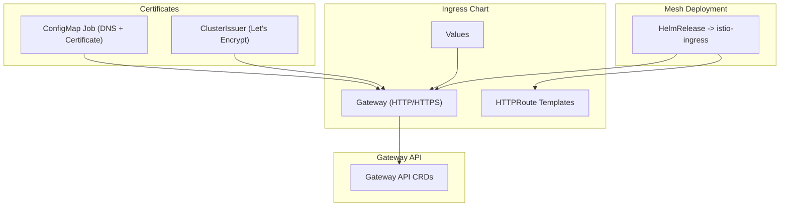
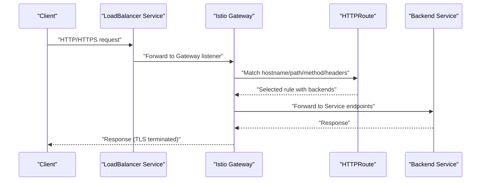
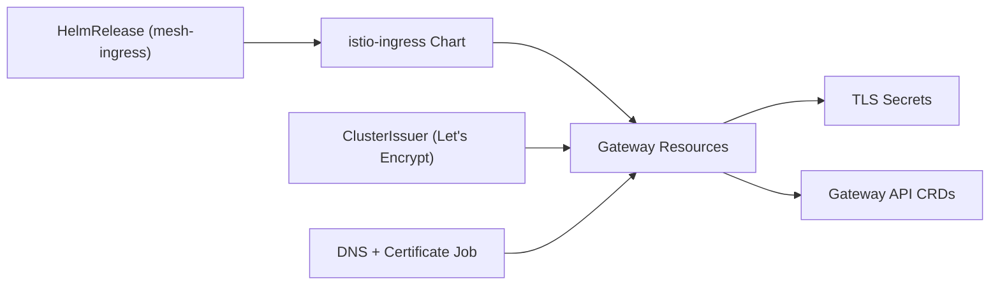

# Ingress Controller Setup

<cite>
**Referenced Files in This Document**
- [gateways.yaml](file://charts/istio-ingress/templates/gateways.yaml)
- [httproutes.yaml](file://charts/istio-ingress/templates/httproutes.yaml)
- [certificate.yaml](file://charts/istio-ingress/templates/certificate.yaml)
- [referencegrants.yaml](file://charts/istio-ingress/templates/referencegrants.yaml)
- [values.yaml](file://charts/istio-ingress/values.yaml)
- [gateway.yaml](file://software/components/mesh-ingress/gateway.yaml)
- [lets-encrypt.yaml](file://software/components/certs-issuer/lets-encrypt.yaml)
- [configmap.yaml](file://charts/istio-certs/templates/configmap.yaml)
- [gateway-api-crd.yaml](file://software/components/global/gateway-api-crd.yaml)
- [gateway-migration-summary.md](file://docs/gateway-migration-summary.md)
</cite>

## Table of Contents
1. [Introduction](#introduction)
2. [Project Structure](#project-structure)
3. [Core Components](#core-components)
4. [Architecture Overview](#architecture-overview)
5. [Detailed Component Analysis](#detailed-component-analysis)
6. [Dependency Analysis](#dependency-analysis)
7. [Performance Considerations](#performance-considerations)
8. [Troubleshooting Guide](#troubleshooting-guide)
9. [Conclusion](#conclusion)

## Introduction
This document explains how ingress and HTTP routing are implemented using the Kubernetes Gateway API with Istio, covering:
- Gateway definitions for external and internal traffic
- HTTP route management via HTTPRoute resources
- Certificate management with cert-manager and Let’s Encrypt
- SSL/TLS termination at the gateway
- Domain name configuration and DNS integration
- Request/response transformation and header manipulation
- Advanced routing patterns such as weighted routing and canary deployments
- Troubleshooting common ingress issues
- Performance optimization techniques for high-traffic scenarios

## Project Structure
The ingress setup is organized around Helm charts and component manifests:
- The istio-ingress chart defines Gateways and HTTPRoutes templates, values, and certificate references
- The mesh-ingress component deploys the istio-ingress chart into the istio-system namespace
- Certificates are provisioned by a dedicated job that configures DNS labels and applies a Certificate resource
- Let’s Encrypt ClusterIssuers are configured to use the external-gateway for ACME challenges
- Gateway API CRDs define behavior for hostnames, listeners, TLS, filters, and routing precedence

**Diagram sources**
- [gateways.yaml:1-96](file://charts/istio-ingress/templates/gateways.yaml#L1-L96)
- [gateway.yaml:1-55](file://software/components/mesh-ingress/gateway.yaml#L1-L55)
- [lets-encrypt.yaml:1-34](file://software/components/certs-issuer/lets-encrypt.yaml#L1-L34)
- [configmap.yaml:1-87](file://charts/istio-certs/templates/configmap.yaml#L1-L87)
- [gateway-api-crd.yaml:809-9516](file://software/components/global/gateway-api-crd.yaml#L809-L9516)

**Section sources**
- [gateways.yaml:1-96](file://charts/istio-ingress/templates/gateways.yaml#L1-L96)
- [gateway.yaml:1-55](file://software/components/mesh-ingress/gateway.yaml#L1-L55)
- [configmap.yaml:1-87](file://charts/istio-certs/templates/configmap.yaml#L1-L87)
- [gateway-api-crd.yaml:809-9516](file://software/components/global/gateway-api-crd.yaml#L809-L9516)

## Core Components
- Gateway resources expose HTTP (port 80) and HTTPS (port 443) listeners in the istio-system namespace, bound to the Istio gatewayClassName.
- Two gateways are commonly used:
  - external-gateway: for internet-facing traffic
  - internal-gateway: for VNet/internal access
- TLS termination is configured on HTTPS listeners using Secrets referenced by name.
- Values control enabling/disabling of gateways and TLS credential names.
- A HelmRelease deploys the istio-ingress chart into istio-system and injects CORS settings per gateway.

Key behaviors:
- Allowed routes from all namespaces are permitted on both HTTP and HTTPS listeners.
- Hostname-based listener selection follows Gateway API rules (exact > wildcard > fallback).
- Certificate management uses cert-manager with Let’s Encrypt ClusterIssuers configured to solve HTTP-01 challenges via the external-gateway.

**Section sources**
- [gateways.yaml:1-96](file://charts/istio-ingress/templates/gateways.yaml#L1-L96)
- [values.yaml:1-18](file://charts/istio-ingress/values.yaml#L1-L18)
- [gateway.yaml:1-55](file://software/components/mesh-ingress/gateway.yaml#L1-L55)
- [lets-encrypt.yaml:1-34](file://software/components/certs-issuer/lets-encrypt.yaml#L1-L34)
- [gateway-api-crd.yaml:809-9516](file://software/components/global/gateway-api-crd.yaml#L809-L9516)

## Architecture Overview
The end-to-end flow for inbound requests:
- Client request arrives at the external or internal LoadBalancer service backed by an Istio Gateway.
- The Gateway listener selects the appropriate route based on hostname and protocol.
- HTTPRoute matches path, headers, methods, and query parameters according to precedence rules.
- Optional filters modify request/response headers or mirror traffic.
- Traffic is forwarded to backend Services; weights enable canary and weighted routing.
- For HTTPS, TLS is terminated at the Gateway using certificates managed by cert-manager.

**Diagram sources**
- [gateways.yaml:1-96](file://charts/istio-ingress/templates/gateways.yaml#L1-L96)
- [gateway-api-crd.yaml:809-9516](file://software/components/global/gateway-api-crd.yaml#L809-L9516)

## Detailed Component Analysis

### Gateway Definitions (External and Internal)
- Both external-gateway and internal-gateway are defined with HTTP and HTTPS listeners.
- HTTPS listeners terminate TLS using Secrets named in values.
- allowedRoutes permits HTTPRoutes from all namespaces.
- Hostname binding for HTTPS can be set via template variables or values.

Operational notes:
- Ensure the corresponding LoadBalancer services exist and are labeled appropriately for Istio to bind them.
- Verify that the TLS Secret exists before applying the Gateway.

**Section sources**
- [gateways.yaml:1-96](file://charts/istio-ingress/templates/gateways.yaml#L1-L96)
- [values.yaml:1-18](file://charts/istio-ingress/values.yaml#L1-L18)

### HTTP Route Management and Routing Precedence
- HTTPRoute matching supports hostnames, paths, methods, headers, and query parameters.
- Precedence rules prioritize exact path matches, then longest prefix, method, header count, and query param count.
- When multiple backends are specified, weights determine traffic distribution, enabling canary deployments.
- Invalid backends result in 500 responses for matched traffic; missing ready endpoints should return 503.

Advanced features:
- Header modifiers allow adding, setting, or removing request/response headers.
- Request mirroring is supported for testing and observability.
- Filters must be compatible; URL rewrite and request redirect cannot be combined.

**Section sources**
- [gateway-api-crd.yaml:809-9516](file://software/components/global/gateway-api-crd.yaml#L809-L9516)
- [gateway-api-crd.yaml:3407-3528](file://software/components/global/gateway-api-crd.yaml#L3407-L3528)
- [gateway-api-crd.yaml:7915-9428](file://software/components/global/gateway-api-crd.yaml#L7915-L9428)

### Certificate Management and SSL/TLS Termination
- Certificates are created by a job that waits for the external LoadBalancer IP, annotates the service with a DNS label, and applies a Certificate resource targeting the FQDN.
- Let’s Encrypt ClusterIssuers are configured to use the external-gateway for HTTP-01 challenges.
- The Gateway terminates TLS using Secrets referenced by name; ensure the Secret contains valid TLS keys and certificates.

Workflow:
- Job obtains external IP and sets Azure DNS label annotation.
- Certificate resource requests certs from Let’s Encrypt staging or production.
- Once issued, the Secret is updated and the Gateway uses it for HTTPS termination.

**Section sources**
- [configmap.yaml:1-87](file://charts/istio-certs/templates/configmap.yaml#L1-L87)
- [lets-encrypt.yaml:1-34](file://software/components/certs-issuer/lets-encrypt.yaml#L1-L34)
- [gateways.yaml:1-96](file://charts/istio-ingress/templates/gateways.yaml#L1-L96)

### Domain Name Configuration
- External domain names are derived from Azure DNS name and region, forming an FQDN used for certificate issuance and listener hostname binding.
- The job annotates the external-gateway service with the DNS label required by Azure to map the LoadBalancer IP to the desired domain.

Verification:
- Confirm the external-gateway service has an assigned external IP.
- Ensure DNS resolution points to the LoadBalancer IP.

**Section sources**
- [configmap.yaml:1-87](file://charts/istio-certs/templates/configmap.yaml#L1-L87)
- [gateways.yaml:1-96](file://charts/istio-ingress/templates/gateways.yaml#L1-L96)

### Request/Response Transformation and Header Manipulation
- HTTPRoute filters support:
  - RequestHeaderModifier: add, set, remove headers on requests
  - ResponseHeaderModifier: add, set, remove headers on responses
  - RequestMirror: send mirrored copies to another backend
- These filters enable advanced routing behaviors like injecting tracing headers, rewriting authorization metadata, or mirroring traffic for testing.

Constraints:
- Certain filter combinations are incompatible (e.g., URLRewrite and RequestRedirect).
- Validation ensures correct usage of filter types and fields.

**Section sources**
- [gateway-api-crd.yaml:3407-3528](file://software/components/global/gateway-api-crd.yaml#L3407-L3528)
- [gateway-api-crd.yaml:7915-9428](file://software/components/global/gateway-api-crd.yaml#L7915-L9428)

### Weighted Routing and Canary Deployments
- Multiple BackendRefs with weights allow splitting traffic between versions (e.g., stable vs canary).
- If some backends are invalid, proportionally matched traffic may receive error responses; ensure readiness probes and endpoint health are properly configured.
- Use header or path matches to target specific subsets of traffic for canary rollouts.

**Section sources**
- [gateway-api-crd.yaml:4991-5016](file://software/components/global/gateway-api-crd.yaml#L4991-L5016)
- [gateway-api-crd.yaml:7747-7770](file://software/components/global/gateway-api-crd.yaml#L7747-L7770)

### Cross-Namespace Access with ReferenceGrants
- ReferenceGrants are managed by individual application charts to avoid deployment dependencies.
- This approach allows istio-ingress to deploy independently while applications declare cross-namespace permissions for their HTTPRoutes.

**Section sources**
- [referencegrants.yaml:1-10](file://charts/istio-ingress/templates/referencegrants.yaml#L1-L10)

## Dependency Analysis
- The mesh-ingress HelmRelease installs the istio-ingress chart into istio-system, passing values including CORS settings.
- The istio-ingress chart renders Gateway resources referencing TLS Secrets and allowing routes from all namespaces.
- Cert-manager ClusterIssuers depend on the external-gateway being available for ACME challenges.
- The DNS configuration job depends on the external-gateway service having an assigned LoadBalancer IP.

**Diagram sources**
- [gateway.yaml:1-55](file://software/components/mesh-ingress/gateway.yaml#L1-L55)
- [gateways.yaml:1-96](file://charts/istio-ingress/templates/gateways.yaml#L1-L96)
- [lets-encrypt.yaml:1-34](file://software/components/certs-issuer/lets-encrypt.yaml#L1-L34)
- [configmap.yaml:1-87](file://charts/istio-certs/templates/configmap.yaml#L1-L87)
- [gateway-api-crd.yaml:809-9516](file://software/components/global/gateway-api-crd.yaml#L809-L9516)

**Section sources**
- [gateway.yaml:1-55](file://software/components/mesh-ingress/gateway.yaml#L1-L55)
- [gateways.yaml:1-96](file://charts/istio-ingress/templates/gateways.yaml#L1-L96)
- [lets-encrypt.yaml:1-34](file://software/components/certs-issuer/lets-encrypt.yaml#L1-L34)
- [configmap.yaml:1-87](file://charts/istio-certs/templates/configmap.yaml#L1-L87)

## Performance Considerations
- Prefer precise path and header matches to reduce routing complexity and improve performance.
- Avoid excessive header modifications; batch changes where possible.
- Use readiness probes and healthy endpoints to prevent 503 errors under load.
- Monitor Gateway status conditions and HTTPRoute Accepted/ResolvedRefs states for early detection of misconfigurations.
- For high-traffic scenarios:
  - Scale backend Services and ensure adequate pod resources.
  - Enable connection pooling and keep-alive at the proxy layer if supported.
  - Use weighted routing to gradually shift traffic during updates.
  - Leverage response caching at the edge if applicable.

[No sources needed since this section provides general guidance]

## Troubleshooting Guide
Common issues and resolutions:
- Gateway not accepting routes:
  - Check Gateway status and Listener conditions for conflicts or invalid configurations.
  - Verify allowedRoutes and namespace permissions.
- HTTPRoute not matching:
  - Inspect hostname, path, method, header, and query parameter matches against precedence rules.
  - Validate that backends are valid and have ready endpoints.
- TLS handshake failures:
  - Ensure the TLS Secret exists and contains valid certificates.
  - Confirm cert-manager has issued the certificate and the Secret is updated.
- ACME challenge failures:
  - Verify the external-gateway is reachable and annotated with the correct DNS label.
  - Check ClusterIssuer configuration and solver settings.
- CORS issues:
  - Confirm response header modifiers are applied correctly.
  - Validate allowed origins, methods, headers, and credentials settings.

Useful commands:
- List Gateways and HTTPRoutes across namespaces
- Describe Gateway and HTTPRoute statuses
- Inspect proxy configuration for route resolution

**Section sources**
- [gateway-migration-summary.md:48-138](file://docs/gateway-migration-summary.md#L48-L138)
- [gateway-api-crd.yaml:809-9516](file://software/components/global/gateway-api-crd.yaml#L809-L9516)

## Conclusion
This setup leverages the Kubernetes Gateway API with Istio to provide robust ingress and HTTP routing for both external and internal traffic. It integrates cert-manager and Let’s Encrypt for automated certificate management, supports advanced routing features like weighted routing and header manipulation, and includes operational guidance for troubleshooting and performance optimization. By following the documented patterns, teams can confidently manage high-traffic ingress scenarios with clear separation of concerns and standardized configuration practices.