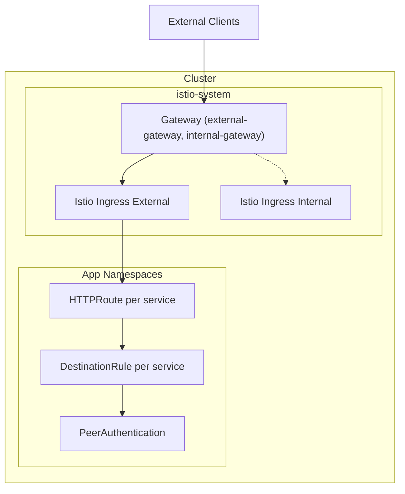
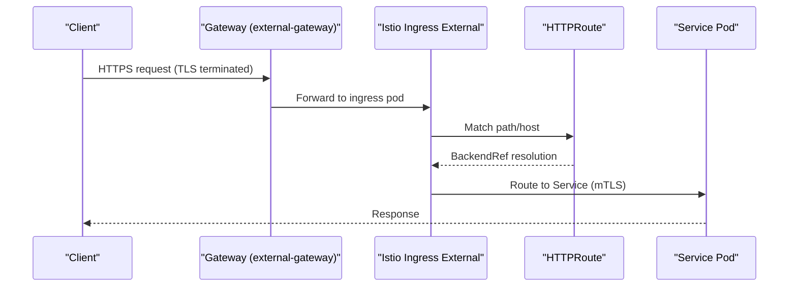
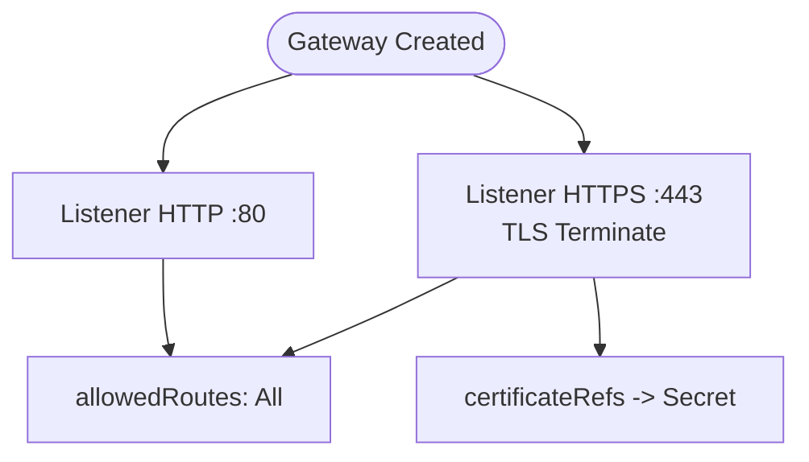
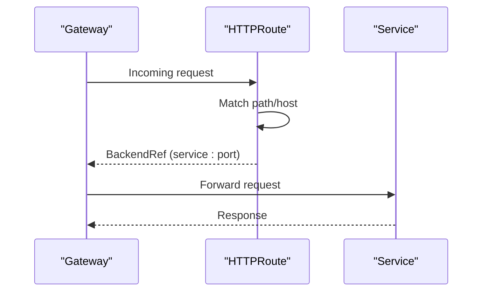
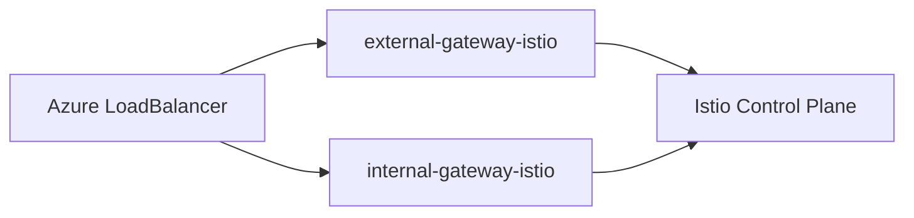
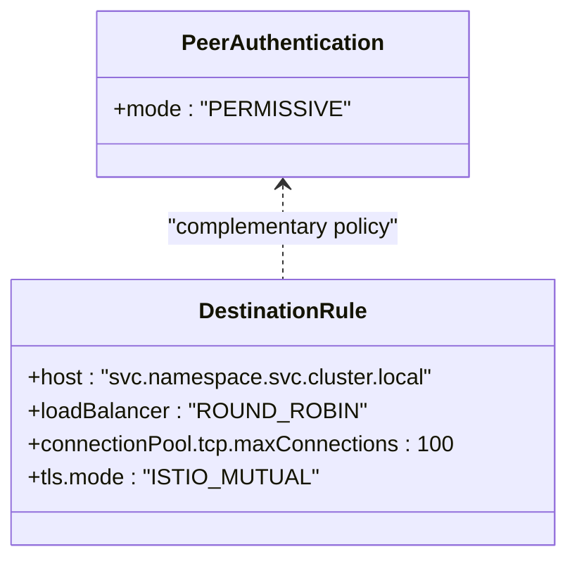
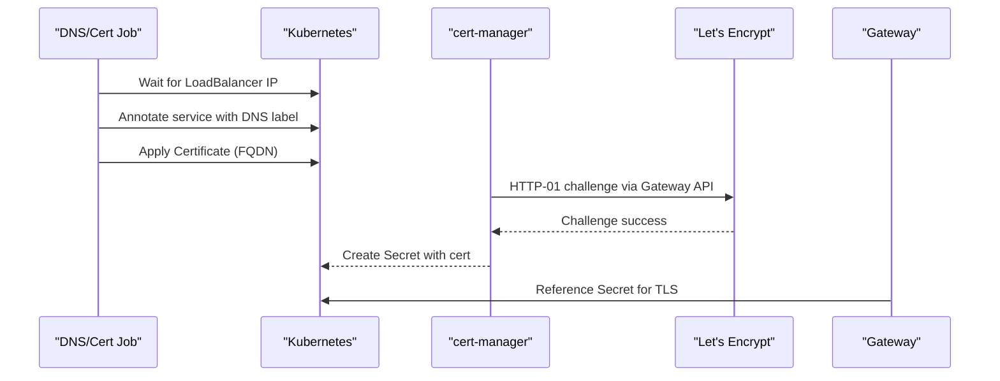
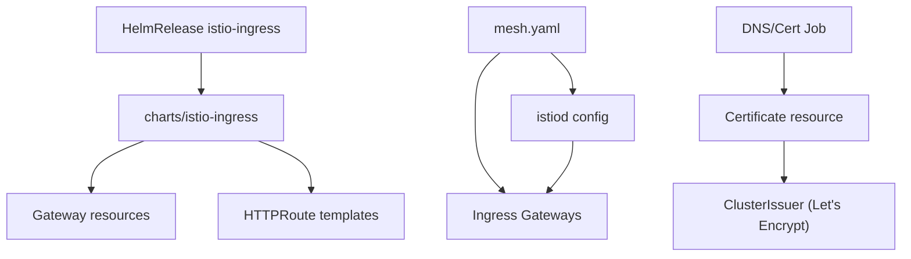

# Networking and Ingress

<cite>
**Referenced Files in This Document**
- [gateway.yaml](file://charts/istio-ingress/templates/gateways.yaml)
- [certificate.yaml](file://charts/istio-ingress/templates/certificate.yaml)
- [httproutes.yaml](file://charts/istio-ingress/templates/httproutes.yaml)
- [lets-encrypt.yaml](file://software/components/certs-issuer/lets-encrypt.yaml)
- [job.yaml](file://charts/istio-certs/templates/job.yaml)
- [configmap.yaml](file://charts/istio-certs/templates/configmap.yaml)
- [mesh.yaml](file://software/components/osdu-system/mesh.yaml)
- [peer-authentication.yaml](file://charts/osdu-developer-base/templates/peer-authentication.yaml)
- [destination-rule.yaml](file://charts/osdu-developer-service/templates/destination-rule.yaml)
- [http-route.yaml](file://charts/osdu-developer-service/templates/http-route.yaml)
- [values.yaml](file://charts/istio-ingress/values.yaml)
- [gateway-helmrelease.yaml](file://software/components/mesh-ingress/gateway.yaml)
</cite>

## Table of Contents
1. Introduction
2. Project Structure
3. Core Components
4. Architecture Overview
5. Detailed Component Analysis
6. Dependency Analysis
7. Performance Considerations
8. Troubleshooting Guide
9. Conclusion

## Introduction
This document explains the networking stack for external access, service mesh integration, TLS management, and traffic routing. It covers Gateway API resources (Gateway, HTTPRoute), ingress controllers via Istio, mutual TLS between services, certificate automation with Let’s Encrypt, and performance tuning for high-throughput scenarios including load balancing and connection pooling.

## Project Structure
The networking configuration is split across Helm charts and Kubernetes manifests:
- Ingress and Gateway API definitions live under charts/istio-ingress.
- Certificate automation and DNS wiring are provided by charts/istio-certs.
- Service mesh control plane and gateways are deployed via software/components/osdu-system/mesh.yaml.
- Per-service routing and mTLS policies are defined in charts/osdu-developer-base and charts/osdu-developer-service.
- A Flux HelmRelease wires the istio-ingress chart into the cluster.

**Diagram sources**
- [gateway.yaml:1-96](file://charts/istio-ingress/templates/gateways.yaml#L1-L96)
- [mesh.yaml:147-241](file://software/components/osdu-system/mesh.yaml#L147-L241)
- [http-route.yaml:1-45](file://charts/osdu-developer-service/templates/http-route.yaml#L1-L45)
- [destination-rule.yaml:1-27](file://charts/osdu-developer-service/templates/destination-rule.yaml#L1-L27)
- [peer-authentication.yaml:1-7](file://charts/osdu-developer-base/templates/peer-authentication.yaml#L1-L7)

**Section sources**
- [gateway.yaml:1-96](file://charts/istio-ingress/templates/gateways.yaml#L1-L96)
- [mesh.yaml:101-241](file://software/components/osdu-system/mesh.yaml#L101-L241)
- [http-route.yaml:1-45](file://charts/osdu-developer-service/templates/http-route.yaml#L1-L45)
- [destination-rule.yaml:1-27](file://charts/osdu-developer-service/templates/destination-rule.yaml#L1-L27)
- [peer-authentication.yaml:1-7](file://charts/osdu-developer-base/templates/peer-authentication.yaml#L1-L7)

## Core Components
- Gateway API Gateways: Define listeners for HTTP/HTTPS and TLS termination using Secrets.
- Istio Ingress Gateways: Deployed as LoadBalancers for internal and external traffic.
- HTTPRoutes: Bind host/path rules to backend Services through Gateway parents.
- DestinationRules: Configure per-service load balancing, connection pools, and mTLS mode.
- PeerAuthentication: Enforce or permit mTLS at namespace scope.
- Certificates and Issuers: Automate TLS issuance with cert-manager and Let’s Encrypt via HTTP-01 challenges routed through Gateway API.

**Section sources**
- [gateway.yaml:1-96](file://charts/istio-ingress/templates/gateways.yaml#L1-L96)
- [mesh.yaml:147-241](file://software/components/osdu-system/mesh.yaml#L147-L241)
- [http-route.yaml:1-45](file://charts/osdu-developer-service/templates/http-route.yaml#L1-L45)
- [destination-rule.yaml:1-27](file://charts/osdu-developer-service/templates/destination-rule.yaml#L1-L27)
- [peer-authentication.yaml:1-7](file://charts/osdu-developer-base/templates/peer-authentication.yaml#L1-L7)
- [lets-encrypt.yaml:1-34](file://software/components/certs-issuer/lets-encrypt.yaml#L1-L34)

## Architecture Overview
External requests enter via an Azure LoadBalancer-backed Istio gateway, terminate TLS, and are routed by Gateway API HTTPRoutes to application Services. The mesh enforces mTLS between sidecars, while DestinationRules tune load balancing and connection limits.

**Diagram sources**
- [gateway.yaml:31-62](file://charts/istio-ingress/templates/gateways.yaml#L31-L62)
- [mesh.yaml:193-241](file://software/components/osdu-system/mesh.yaml#L193-L241)
- [http-route.yaml:1-45](file://charts/osdu-developer-service/templates/http-route.yaml#L1-L45)

## Detailed Component Analysis

### Gateway API Gateways and Listeners
- Two Gateways are templated: external-gateway and internal-gateway, both exposing HTTP (80) and HTTPS (443).
- HTTPS listeners terminate TLS using a Secret referenced by name; hostname can be set for external listener.
- allowedRoutes permits routes from all namespaces for flexibility.

**Diagram sources**
- [gateway.yaml:1-96](file://charts/istio-ingress/templates/gateways.yaml#L1-L96)

**Section sources**
- [gateway.yaml:1-96](file://charts/istio-ingress/templates/gateways.yaml#L1-L96)
- [values.yaml:4-18](file://charts/istio-ingress/values.yaml#L4-L18)

### HTTPRoutes and CORS
- Each service defines an HTTPRoute that binds to one or more Gateway parents and matches paths.
- Optional CORS headers can be injected via filters when configured.

**Diagram sources**
- [http-route.yaml:1-45](file://charts/osdu-developer-service/templates/http-route.yaml#L1-L45)

**Section sources**
- [http-route.yaml:1-45](file://charts/osdu-developer-service/templates/http-route.yaml#L1-L45)

### Istio Ingress Gateways (LoadBalancers)
- Two Istio gateway deployments are managed via HelmReleases:
  - external-gateway-istio: public-facing LoadBalancer.
  - internal-gateway-istio: internal LoadBalancer.
- Both expose status, HTTP, and HTTPS ports.

**Diagram sources**
- [mesh.yaml:147-241](file://software/components/osdu-system/mesh.yaml#L147-L241)

**Section sources**
- [mesh.yaml:147-241](file://software/components/osdu-system/mesh.yaml#L147-L241)
- [gateway-helmrelease.yaml:1-55](file://software/components/mesh-ingress/gateway.yaml#L1-L55)

### Mutual TLS and Traffic Policies
- PeerAuthentication sets mTLS to PERMISSIVE at the base level, allowing mixed plaintext and mTLS during transitions.
- DestinationRule per service enables ISTIO_MUTUAL for outbound client-side mTLS and configures load balancing and connection pooling.

**Diagram sources**
- [peer-authentication.yaml:1-7](file://charts/osdu-developer-base/templates/peer-authentication.yaml#L1-L7)
- [destination-rule.yaml:1-27](file://charts/osdu-developer-service/templates/destination-rule.yaml#L1-L27)

**Section sources**
- [peer-authentication.yaml:1-7](file://charts/osdu-developer-base/templates/peer-authentication.yaml#L1-L7)
- [destination-rule.yaml:1-27](file://charts/osdu-developer-service/templates/destination-rule.yaml#L1-L27)

### TLS Certificate Management with Let’s Encrypt
- ClusterIssuers for staging and production point to Let’s Encrypt ACME servers and use HTTP-01 challenge solver backed by Gateway API HTTPRoute on external-gateway.
- A Job waits for the external LoadBalancer IP, annotates the service with an Azure DNS label, and applies a Certificate resource referencing the appropriate issuer.
- The Gateway references a Secret containing the issued certificate for TLS termination.

**Diagram sources**
- [lets-encrypt.yaml:1-34](file://software/components/certs-issuer/lets-encrypt.yaml#L1-L34)
- [job.yaml:1-47](file://charts/istio-certs/templates/job.yaml#L1-L47)
- [configmap.yaml:1-87](file://charts/istio-certs/templates/configmap.yaml#L1-L87)
- [gateway.yaml:16-29](file://charts/istio-ingress/templates/gateways.yaml#L16-L29)

**Section sources**
- [lets-encrypt.yaml:1-34](file://software/components/certs-issuer/lets-encrypt.yaml#L1-L34)
- [job.yaml:1-47](file://charts/istio-certs/templates/job.yaml#L1-L47)
- [configmap.yaml:1-87](file://charts/istio-certs/templates/configmap.yaml#L1-L87)
- [certificate.yaml:1-8](file://charts/istio-ingress/templates/certificate.yaml#L1-L8)
- [httproutes.yaml:1-13](file://charts/istio-ingress/templates/httproutes.yaml#L1-L13)

### External Access Patterns and CORS
- External clients reach the external-gateway over HTTPS; HTTP is also exposed for redirects or health checks.
- CORS can be applied at the HTTPRoute level or via gateway values; ensure credentials and origins align with browser security requirements.

**Section sources**
- [gateway.yaml:31-62](file://charts/istio-ingress/templates/gateways.yaml#L31-L62)
- [http-route.yaml:28-43](file://charts/osdu-developer-service/templates/http-route.yaml#L28-L43)
- [gateway-helmrelease.yaml:26-55](file://software/components/mesh-ingress/gateway.yaml#L26-L55)

## Dependency Analysis
- Istiod is configured to select the external gateway for native ingress handling.
- The istio-ingress chart is installed via a Flux HelmRelease, sourcing values from a ConfigMap.
- Certificate issuance depends on DNS annotation and Gateway API HTTPRoute availability for ACME challenges.

**Diagram sources**
- [gateway-helmrelease.yaml:1-55](file://software/components/mesh-ingress/gateway.yaml#L1-L55)
- [mesh.yaml:101-142](file://software/components/osdu-system/mesh.yaml#L101-L142)
- [job.yaml:1-47](file://charts/istio-certs/templates/job.yaml#L1-L47)
- [lets-encrypt.yaml:1-34](file://software/components/certs-issuer/lets-encrypt.yaml#L1-L34)

**Section sources**
- [gateway-helmrelease.yaml:1-55](file://software/components/mesh-ingress/gateway.yaml#L1-L55)
- [mesh.yaml:101-142](file://software/components/osdu-system/mesh.yaml#L101-L142)

## Performance Considerations
- Load Balancing: DestinationRule uses ROUND_ROBIN; adjust strategy based on session affinity needs.
- Connection Pooling: TCP maxConnections is set per DestinationRule; increase for high-throughput workloads and monitor connection saturation.
- TLS Overhead: Ensure minimum TLS versions are aligned (mesh and TLSConfig) to balance security and performance.
- Gateway Scaling: Scale Istio ingress pods horizontally and tune resource requests/limits to handle peak traffic.
- Observability: Enable access logs and metrics to identify bottlenecks and optimize routing rules.

[No sources needed since this section provides general guidance]

## Troubleshooting Guide
- Certificate not issued:
  - Verify the external LoadBalancer has an IP and the DNS annotation is applied.
  - Confirm the HTTP-01 challenge path is reachable via the external-gateway.
  - Check ClusterIssuer configuration and ACME server endpoints.
- Routes not matching:
  - Validate HTTPRoute parentRefs match the Gateway names and namespaces.
  - Ensure path prefixes and hosts align with expected traffic.
- mTLS failures:
  - Confirm PeerAuthentication mode and DestinationRule tls.mode settings.
  - Verify sidecar injection and trust bundle distribution.

**Section sources**
- [configmap.yaml:23-57](file://charts/istio-certs/templates/configmap.yaml#L23-L57)
- [lets-encrypt.yaml:1-34](file://software/components/certs-issuer/lets-encrypt.yaml#L1-L34)
- [http-route.yaml:1-45](file://charts/osdu-developer-service/templates/http-route.yaml#L1-L45)
- [destination-rule.yaml:1-27](file://charts/osdu-developer-service/templates/destination-rule.yaml#L1-L27)
- [peer-authentication.yaml:1-7](file://charts/osdu-developer-base/templates/peer-authentication.yaml#L1-L7)

## Conclusion
The repository implements a robust, modern networking stack using Gateway API and Istio. External and internal gateways provide clear separation of concerns, while cert-manager automates TLS with Let’s Encrypt. Per-service routing and mTLS policies enable secure, scalable traffic management. For high-throughput environments, tune DestinationRule connection pools and load balancing strategies, and leverage observability to maintain performance and reliability.