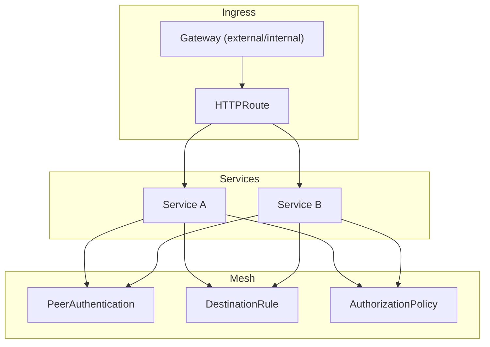
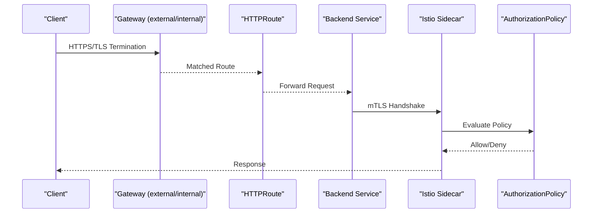
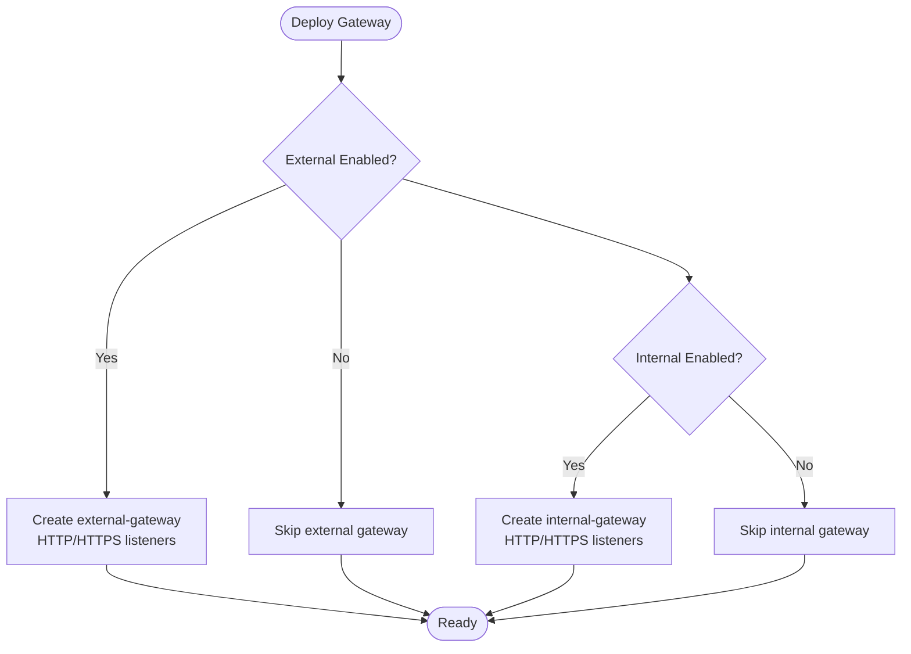
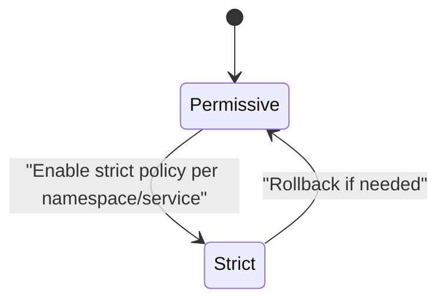
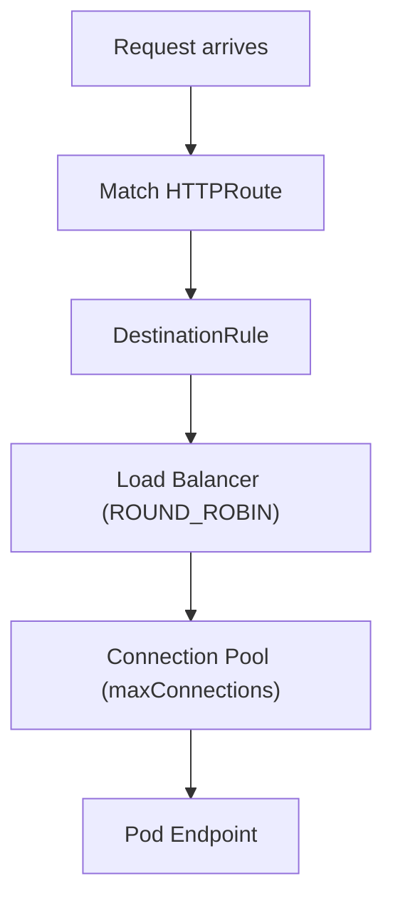
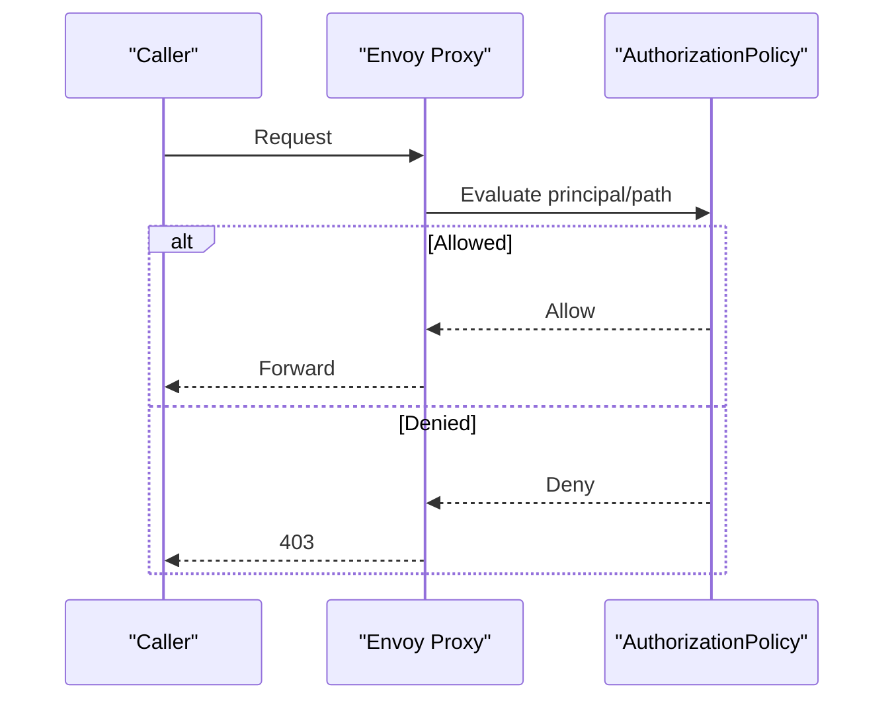
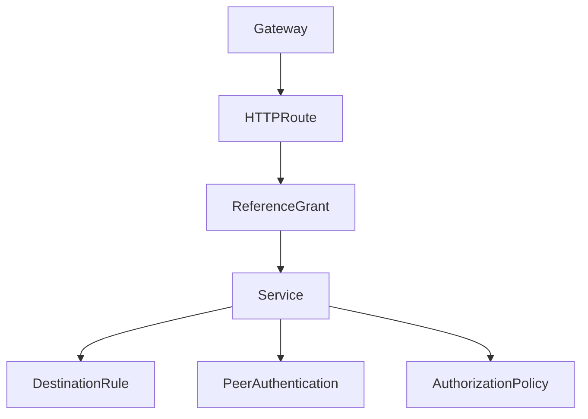

# Service Mesh Configuration

<cite>
**Referenced Files in This Document**
- [gateways.yaml](file://charts/istio-ingress/templates/gateways.yaml)
- [httproutes.yaml](file://charts/istio-ingress/templates/httproutes.yaml)
- [peer-authentication.yaml](file://charts/osdu-developer-base/templates/peer-authentication.yaml)
- [request-authentication.yaml](file://charts/osdu-developer-base/templates/request-authentication.yaml)
- [destination-rule.yaml](file://charts/osdu-developer-service/templates/destination-rule.yaml)
- [auth-policy.yaml](file://charts/osdu-developer-service/templates/auth-policy.yaml)
- [reference-grant.yaml](file://charts/osdu-developer-service/templates/reference-grant.yaml)
- [gateway.yaml](file://software/components/mesh-ingress/gateway.yaml)
- [role.yaml](file://software/components/mesh-ingress/role.yaml)
- [referencegrant.yaml](file://software/experimental/admin-ui/referencegrant.yaml)
- [gateway-migration-summary.md](file://docs/gateway-migration-summary.md)
</cite>

## Table of Contents
1. Introduction
2. Project Structure
3. Core Components
4. Architecture Overview
5. Detailed Component Analysis
6. Dependency Analysis
7. Performance Considerations
8. Troubleshooting Guide
9. Conclusion

## Introduction
This document explains how the OSDU platform configures and operates an Istio-based service mesh with Gateway API-driven ingress, mutual TLS (mTLS), traffic routing, and security policies. It covers gateway resources, service-to-service authentication patterns, role-based access control (RBAC) for mesh components, and resilience settings such as load balancing and connection pooling. The goal is to help operators understand how external and internal traffic enters the mesh, how services authenticate each other, and how to customize routing and resilience per service.

## Project Structure
The service mesh configuration spans Helm charts and Kubernetes manifests:
- Ingress gateways are defined via Gateway API resources in the istio-ingress chart and deployed through a Flux HelmRelease.
- Per-service traffic policies and mTLS behavior are configured using DestinationRule and PeerAuthentication.
- Authorization policies enforce request-level access controls per service.
- ReferenceGrants allow HTTPRoutes in the mesh ingress namespace to reference backend Services across namespaces.
- RBAC roles and bindings grant minimal permissions to workloads interacting with mesh resources.

**Diagram sources**
- [gateways.yaml:1-96](file://charts/istio-ingress/templates/gateways.yaml#L1-L96)
- [httproutes.yaml:1-13](file://charts/istio-ingress/templates/httproutes.yaml#L1-L13)
- [peer-authentication.yaml:1-7](file://charts/osdu-developer-base/templates/peer-authentication.yaml#L1-L7)
- [destination-rule.yaml:1-27](file://charts/osdu-developer-service/templates/destination-rule.yaml#L1-L27)
- [auth-policy.yaml:1-29](file://charts/osdu-developer-service/templates/auth-policy.yaml#L1-L29)

**Section sources**
- [gateways.yaml:1-96](file://charts/istio-ingress/templates/gateways.yaml#L1-L96)
- [gateway.yaml:1-55](file://software/components/mesh-ingress/gateway.yaml#L1-L55)

## Core Components
- Gateway API Gateways: Define external and internal ingress listeners with TLS termination and allowed routes from all namespaces.
- HTTPRoutes: Application-specific route definitions that bind to the gateways; ACME challenge handling is delegated to applications or cert-manager.
- PeerAuthentication: Sets mesh-wide mTLS mode to PERMISSIVE to ease migration while enabling encrypted sidecar communication.
- DestinationRule: Configures per-service subsets, load balancing (ROUND_ROBIN), connection pool limits, and ISTIO_MUTUAL TLS for outbound traffic.
- AuthorizationPolicy: Denies requests without valid principals except on explicitly allowed paths.
- ReferenceGrant: Allows HTTPRoutes in istio-system to reference Services in application namespaces.
- RBAC Role and Binding: Grants read-only access to Services in istio-system for a specific workload identity.

**Section sources**
- [gateways.yaml:1-96](file://charts/istio-ingress/templates/gateways.yaml#L1-L96)
- [httproutes.yaml:1-13](file://charts/istio-ingress/templates/httproutes.yaml#L1-L13)
- [peer-authentication.yaml:1-7](file://charts/osdu-developer-base/templates/peer-authentication.yaml#L1-L7)
- [destination-rule.yaml:1-27](file://charts/osdu-developer-service/templates/destination-rule.yaml#L1-L27)
- [auth-policy.yaml:1-29](file://charts/osdu-developer-service/templates/auth-policy.yaml#L1-L29)
- [reference-grant.yaml:1-21](file://charts/osdu-developer-service/templates/reference-grant.yaml#L1-L21)
- [referencegrant.yaml:1-15](file://software/experimental/admin-ui/referencegrant.yaml#L1-L15)
- [role.yaml:1-23](file://software/components/mesh-ingress/role.yaml#L1-L23)

## Architecture Overview
External and internal clients reach OSDU services via Gateway API Gateways. Requests are routed by HTTPRoutes to backend Services. Sidecars enforce mTLS between services and apply authorization policies. DestinationRules define traffic policies like load balancing and connection pools.

**Diagram sources**
- [gateways.yaml:1-96](file://charts/istio-ingress/templates/gateways.yaml#L1-L96)
- [httproutes.yaml:1-13](file://charts/istio-ingress/templates/httproutes.yaml#L1-L13)
- [auth-policy.yaml:1-29](file://charts/osdu-developer-service/templates/auth-policy.yaml#L1-L29)
- [destination-rule.yaml:1-27](file://charts/osdu-developer-service/templates/destination-rule.yaml#L1-L27)

## Detailed Component Analysis

### Gateway Resources (External and Internal)
- Two Gateways are templated: external-gateway and internal-gateway, both bound to the Istio gateway class.
- Listeners expose HTTP (port 80) and HTTPS (port 443) with TLS termination using secrets in istio-system.
- Allowed routes are permitted from all namespaces to simplify cross-namespace routing.
- Values for CORS and TLS credentials are supplied via Helm values and can be tuned per environment.

**Diagram sources**
- [gateways.yaml:31-96](file://charts/istio-ingress/templates/gateways.yaml#L31-L96)

**Section sources**
- [gateways.yaml:1-96](file://charts/istio-ingress/templates/gateways.yaml#L1-L96)
- [gateway.yaml:1-55](file://software/components/mesh-ingress/gateway.yaml#L1-L55)

### HTTPRoutes and Cross-Namespace References
- HTTPRoutes are typically created per application to bind hostnames and paths to Services.
- For cross-namespace references, ReferenceGrants allow HTTPRoutes in istio-system to target Services in application namespaces.
- ACME challenges are handled by applications or cert-manager; this chart avoids hardcoding infrastructure-level challenge routes to prevent namespace dependencies.

**Diagram sources**
- [reference-grant.yaml:1-21](file://charts/osdu-developer-service/templates/reference-grant.yaml#L1-L21)
- [referencegrant.yaml:1-15](file://software/experimental/admin-ui/referencegrant.yaml#L1-L15)
- [httproutes.yaml:1-13](file://charts/istio-ingress/templates/httproutes.yaml#L1-L13)

**Section sources**
- [httproutes.yaml:1-13](file://charts/istio-ingress/templates/httproutes.yaml#L1-L13)
- [reference-grant.yaml:1-21](file://charts/osdu-developer-service/templates/reference-grant.yaml#L1-L21)
- [referencegrant.yaml:1-15](file://software/experimental/admin-ui/referencegrant.yaml#L1-L15)

### Mutual TLS (mTLS) Enforcement
- PeerAuthentication sets mTLS to PERMISSIVE at the base level, allowing gradual rollout while still enabling encrypted sidecar communication.
- DestinationRule uses ISTIO_MUTUAL for outbound connections to ensure sidecars negotiate mTLS automatically.

**Diagram sources**
- [peer-authentication.yaml:1-7](file://charts/osdu-developer-base/templates/peer-authentication.yaml#L1-L7)
- [destination-rule.yaml:18-26](file://charts/osdu-developer-service/templates/destination-rule.yaml#L18-L26)

**Section sources**
- [peer-authentication.yaml:1-7](file://charts/osdu-developer-base/templates/peer-authentication.yaml#L1-L7)
- [destination-rule.yaml:1-27](file://charts/osdu-developer-service/templates/destination-rule.yaml#L1-L27)

### Traffic Routing Rules and Load Balancing
- DestinationRule defines subsets per version and applies ROUND_ROBIN load balancing.
- Connection pooling limits max TCP connections to protect backends under load.
- TLS mode set to ISTIO_MUTUAL ensures secure egress within the mesh.

**Diagram sources**
- [destination-rule.yaml:11-26](file://charts/osdu-developer-service/templates/destination-rule.yaml#L11-L26)

**Section sources**
- [destination-rule.yaml:1-27](file://charts/osdu-developer-service/templates/destination-rule.yaml#L1-L27)

### Security Policies and RBAC
- AuthorizationPolicy denies requests lacking valid principals except on configured paths, enforcing service-to-service authentication.
- RBAC Role and RoleBinding grant minimal read access to Services in istio-system for a specific workload identity used by mesh-related operations.

**Diagram sources**
- [auth-policy.yaml:11-27](file://charts/osdu-developer-service/templates/auth-policy.yaml#L11-L27)
- [role.yaml:1-23](file://software/components/mesh-ingress/role.yaml#L1-L23)

**Section sources**
- [auth-policy.yaml:1-29](file://charts/osdu-developer-service/templates/auth-policy.yaml#L1-L29)
- [role.yaml:1-23](file://software/components/mesh-ingress/role.yaml#L1-L23)

### Request Authentication
- RequestAuthentication resources can be used to validate JWTs or other tokens before reaching services. While not shown in detail here, they complement AuthorizationPolicy for end-to-end authentication.

**Section sources**
- [request-authentication.yaml](file://charts/osdu-developer-base/templates/request-authentication.yaml)

## Dependency Analysis
- Gateway API Gateways depend on Istio control plane and certificate secrets in istio-system.
- HTTPRoutes depend on ReferenceGrants when referencing Services outside their namespace.
- DestinationRules and PeerAuthentication coordinate to enforce mTLS and traffic policies per service.
- AuthorizationPolicies rely on authenticated identities established by mTLS and optional request authentication.

**Diagram sources**
- [gateways.yaml:1-96](file://charts/istio-ingress/templates/gateways.yaml#L1-L96)
- [httproutes.yaml:1-13](file://charts/istio-ingress/templates/httproutes.yaml#L1-L13)
- [reference-grant.yaml:1-21](file://charts/osdu-developer-service/templates/reference-grant.yaml#L1-L21)
- [destination-rule.yaml:1-27](file://charts/osdu-developer-service/templates/destination-rule.yaml#L1-L27)
- [peer-authentication.yaml:1-7](file://charts/osdu-developer-base/templates/peer-authentication.yaml#L1-L7)
- [auth-policy.yaml:1-29](file://charts/osdu-developer-service/templates/auth-policy.yaml#L1-L29)

**Section sources**
- [gateways.yaml:1-96](file://charts/istio-ingress/templates/gateways.yaml#L1-L96)
- [httproutes.yaml:1-13](file://charts/istio-ingress/templates/httproutes.yaml#L1-L13)
- [reference-grant.yaml:1-21](file://charts/osdu-developer-service/templates/reference-grant.yaml#L1-L21)
- [destination-rule.yaml:1-27](file://charts/osdu-developer-service/templates/destination-rule.yaml#L1-L27)
- [peer-authentication.yaml:1-7](file://charts/osdu-developer-base/templates/peer-authentication.yaml#L1-L7)
- [auth-policy.yaml:1-29](file://charts/osdu-developer-service/templates/auth-policy.yaml#L1-L29)

## Performance Considerations
- Use ROUND_ROBIN load balancing for even distribution unless sticky sessions are required.
- Tune connectionPool.tcp.maxConnections per service based on expected concurrency and backend capacity.
- Keep mTLS in PERMISSIVE during rollout; switch to STRICT once all services support it.
- Monitor gateway services and adjust CORS and TLS settings to balance security and performance.

[No sources needed since this section provides general guidance]

## Troubleshooting Guide
- Verify gateway services exist and have correct IPs for external and internal access.
- Confirm Gateway API resources (Gateways, HTTPRoutes, ReferenceGrants) are applied and healthy.
- Test external and internal endpoints to ensure routing works as expected.
- If mTLS errors occur, check PeerAuthentication mode and DestinationRule TLS settings.
- For authorization denials, review AuthorizationPolicy rules and ensure callers present valid principals.

**Section sources**
- [gateway-migration-summary.md:48-103](file://docs/gateway-migration-summary.md#L48-L103)

## Conclusion
OSDU’s service mesh leverages Gateway API Gateways for ingress, DestinationRules for resilient traffic management, and Istio security resources for mTLS and authorization. By combining ReferenceGrants, RBAC, and per-service policies, the platform achieves secure, flexible, and observable service-to-service communication. Operators should tailor load balancing, connection pools, and mTLS modes to their environments and gradually move toward stricter policies as services stabilize.

[No sources needed since this section summarizes without analyzing specific files]