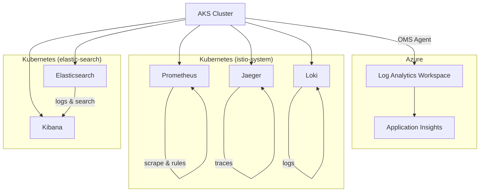
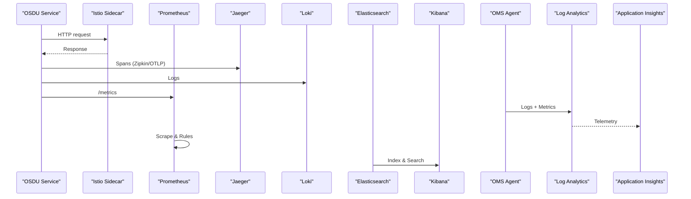
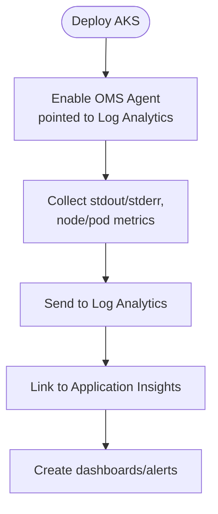
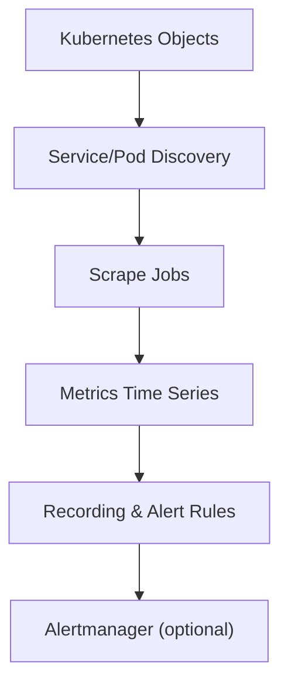
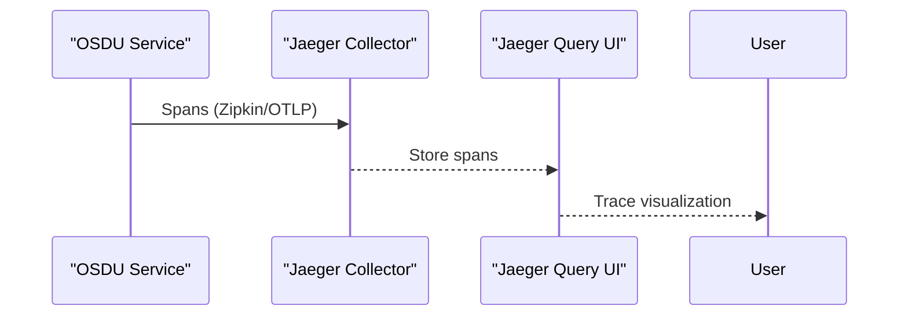
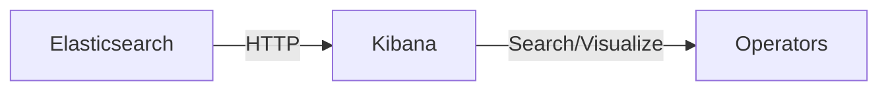
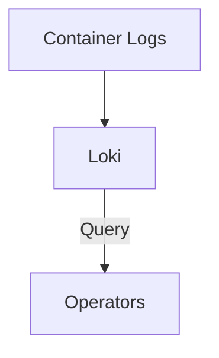
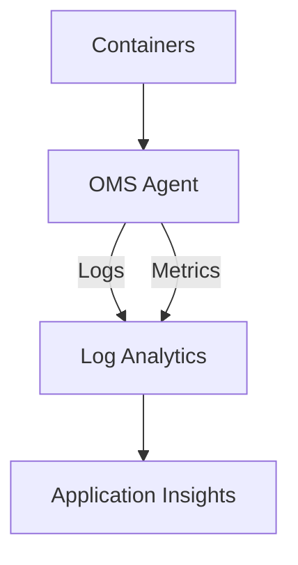
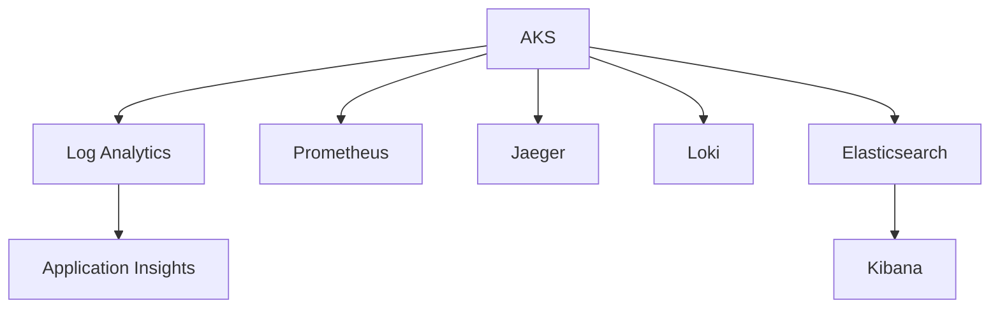

# Monitoring and Alerting Setup

<cite>
**Referenced Files in This Document**
- [Application_Insights.md](file://src/Application_Insights.md)
- [main.bicep](file://bicep/main.bicep)
- [main.bicep (managed cluster)](file://bicep/modules/managed-cluster/main.bicep)
- [prometheus.yaml](file://software/components/observability/prometheus.yaml)
- [jaeger.yaml](file://software/components/observability/jaeger.yaml)
- [kibana.yaml](file://software/components/elastic-search/kibana.yaml)
- [elastic-search.yaml](file://software/components/elastic-search/elastic-search.yaml)
- [loki.yaml](file://software/components/observability/loki.yaml)
- [subnet_monitoring.yaml](file://software/components/observability/subnet_monitoring.yaml)
- [index.md](file://docs/src/index.md)
</cite>

## Table of Contents
1. Introduction
2. Project Structure
3. Core Components
4. Architecture Overview
5. Detailed Component Analysis
6. Dependency Analysis
7. Performance Considerations
8. Troubleshooting Guide
9. Conclusion

## Introduction
This document provides operational guidance for monitoring and alerting the OSDU platform. It covers Application Insights integration, Prometheus metrics collection, Grafana dashboards, Jaeger distributed tracing, log aggregation with Kibana and Loki, alert rule configuration, and notification channels. It also includes performance baseline establishment, anomaly detection strategies, incident response procedures, and guidance for custom metric collection and log parsing to achieve end-to-end operational visibility.

## Project Structure
The repository deploys observability components into Kubernetes via Helm charts and manifests under software/components/observability and elastic-search. Azure infrastructure is provisioned using Bicep modules that enable Log Analytics and Application Insights. The documentation index highlights mesh observability and application logging integrations.

**Diagram sources**
- [main.bicep:218-247](file://bicep/main.bicep#L218-L247)
- [main.bicep (managed cluster):614-622](file://bicep/modules/managed-cluster/main.bicep#L614-L622)
- [prometheus.yaml:39-196](file://software/components/observability/prometheus.yaml#L39-L196)
- [jaeger.yaml:1-122](file://software/components/observability/jaeger.yaml#L1-L122)
- [loki.yaml:155-252](file://software/components/observability/loki.yaml#L155-L252)
- [elastic-search.yaml:1-89](file://software/components/elastic-search/elastic-search.yaml#L1-L89)
- [kibana.yaml:1-49](file://software/components/elastic-search/kibana.yaml#L1-L49)

**Section sources**
- [index.md:122-136](file://docs/src/index.md#L122-L136)

## Core Components
- Application Insights and Log Analytics: Provisioned via Bicep; OMS agent on AKS forwards telemetry to Log Analytics; diagnostic settings export metrics.
- Prometheus: Installed in istio-system with scrape configs for Kubernetes nodes, pods, services, and blackbox probes; supports recording and alerting rules via ConfigMap.
- Jaeger: All-in-one deployment with Zipkin-compatible endpoint and OpenTelemetry ports; exposed via Services for query and ingestion.
- Elasticsearch and Kibana: ECK-managed Elasticsearch cluster with Kibana instance configured to connect to Elasticsearch.
- Loki: Single-binary Loki deployed in istio-system exposing metrics and gRPC endpoints.
- Azure Container Insights: ConfigMap controls stdout/stderr collection, Prometheus scraping by the agent, and alertable thresholds for container resources and persistent volumes.

**Section sources**
- [main.bicep:218-247](file://bicep/main.bicep#L218-L247)
- [main.bicep (managed cluster):614-622](file://bicep/modules/managed-cluster/main.bicep#L614-L622)
- [prometheus.yaml:39-196](file://software/components/observability/prometheus.yaml#L39-L196)
- [jaeger.yaml:1-122](file://software/components/observability/jaeger.yaml#L1-L122)
- [elastic-search.yaml:1-89](file://software/components/elastic-search/elastic-search.yaml#L1-L89)
- [kibana.yaml:1-49](file://software/components/elastic-search/kibana.yaml#L1-L49)
- [loki.yaml:155-252](file://software/components/observability/loki.yaml#L155-L252)
- [subnet_monitoring.yaml:13-158](file://software/components/observability/subnet_monitoring.yaml#L13-L158)

## Architecture Overview
The observability architecture integrates Azure-native telemetry with Kubernetes-native tools:
- Application code emits logs and metrics; OMS agent collects container logs and node/pod metrics to Log Analytics; Application Insights receives diagnostics.
- Prometheus scrapes Kubernetes targets and can be extended with annotations or service discovery.
- Jaeger captures distributed traces from applications and Istio sidecars.
- Elasticsearch stores logs searchable via Kibana; Loki complements log querying within the same namespace as other observability tools.

**Diagram sources**
- [jaeger.yaml:21-38](file://software/components/observability/jaeger.yaml#L21-L38)
- [prometheus.yaml:39-196](file://software/components/observability/prometheus.yaml#L39-L196)
- [loki.yaml:222-252](file://software/components/observability/loki.yaml#L222-L252)
- [elastic-search.yaml:17-35](file://software/components/elastic-search/elastic-search.yaml#L17-L35)
- [kibana.yaml:7-49](file://software/components/elastic-search/kibana.yaml#L7-L49)
- [subnet_monitoring.yaml:13-158](file://software/components/observability/subnet_monitoring.yaml#L13-L158)
- [main.bicep:218-247](file://bicep/main.bicep#L218-L247)

## Detailed Component Analysis

### Application Insights and Log Analytics
- Provisioning: An Application Insights component is created and linked to a Log Analytics workspace; diagnostic settings export all metrics.
- AKS Integration: OMS agent is enabled and pointed at the Log Analytics workspace to collect cluster-level logs and metrics.
- Local Development: Java services require the Application Insights Java agent and connection string to emit telemetry locally.

**Diagram sources**
- [main.bicep:218-247](file://bicep/main.bicep#L218-L247)
- [main.bicep (managed cluster):614-622](file://bicep/modules/managed-cluster/main.bicep#L614-L622)
- [subnet_monitoring.yaml:13-158](file://software/components/observability/subnet_monitoring.yaml#L13-L158)

**Section sources**
- [main.bicep:218-247](file://bicep/main.bicep#L218-L247)
- [main.bicep (managed cluster):614-622](file://bicep/modules/managed-cluster/main.bicep#L614-L622)
- [Application_Insights.md:1-71](file://src/Application_Insights.md#L1-L71)

### Prometheus Metrics Collection
- Scrape Targets: Built-in jobs discover Kubernetes API servers, nodes, cadvisor, services, and pods. Slow-scrape jobs are provided for lower-frequency targets.
- Rule Files: Recording rules, alerting rules, and additional rules files are mounted via ConfigMap.
- RBAC: ClusterRole and ClusterRoleBinding grant read access to required Kubernetes resources.
- Storage: In-memory storage with retention set; suitable for short-term metrics.

**Diagram sources**
- [prometheus.yaml:39-196](file://software/components/observability/prometheus.yaml#L39-L196)
- [prometheus.yaml:354-427](file://software/components/observability/prometheus.yaml#L354-L427)
- [prometheus.yaml:455-554](file://software/components/observability/prometheus.yaml#L455-L554)

**Section sources**
- [prometheus.yaml:39-196](file://software/components/observability/prometheus.yaml#L39-L196)
- [prometheus.yaml:354-427](file://software/components/observability/prometheus.yaml#L354-L427)
- [prometheus.yaml:455-554](file://software/components/observability/prometheus.yaml#L455-L554)

### Jaeger Distributed Tracing
- Deployment: All-in-one image with Badger storage; Zipkin-compatible collector port exposed.
- Services: Query UI, gRPC query, Zipkin compatibility, and OpenTelemetry gRPC/HTTP endpoints.
- Scraping: Prometheus scrape annotation configured for Jaeger metrics.

**Diagram sources**
- [jaeger.yaml:21-38](file://software/components/observability/jaeger.yaml#L21-L38)
- [jaeger.yaml:57-122](file://software/components/observability/jaeger.yaml#L57-L122)

**Section sources**
- [jaeger.yaml:1-122](file://software/components/observability/jaeger.yaml#L1-L122)

### Elasticsearch and Kibana
- Elasticsearch: ECR-managed cluster with mixed roles, zone-aware allocation, and TLS disabled for self-signed setup.
- Kibana: Multi-replica deployment referencing Elasticsearch service and encrypted saved objects key.

**Diagram sources**
- [elastic-search.yaml:1-89](file://software/components/elastic-search/elastic-search.yaml#L1-L89)
- [kibana.yaml:1-49](file://software/components/elastic-search/kibana.yaml#L1-L49)

**Section sources**
- [elastic-search.yaml:1-89](file://software/components/elastic-search/elastic-search.yaml#L1-L89)
- [kibana.yaml:1-49](file://software/components/elastic-search/kibana.yaml#L1-L49)

### Loki Logs
- Deployment: Single-binary Loki with metrics and gRPC endpoints; runs as StatefulSet with security context and readiness probe.

**Diagram sources**
- [loki.yaml:155-252](file://software/components/observability/loki.yaml#L155-L252)

**Section sources**
- [loki.yaml:155-252](file://software/components/observability/loki.yaml#L155-L252)

### Azure Container Insights (Agent Configuration)
- Log Collection: stdout/stderr enabled; ContainerLog v2 schema; optional multiline stacktrace stitching.
- Prometheus Scraping: Agent-level Prometheus scraping configurable for cluster and node endpoints.
- Alertable Thresholds: CPU/memory utilization and persistent volume usage thresholds defined to reduce noise.

**Diagram sources**
- [subnet_monitoring.yaml:13-158](file://software/components/observability/subnet_monitoring.yaml#L13-L158)

**Section sources**
- [subnet_monitoring.yaml:13-158](file://software/components/observability/subnet_monitoring.yaml#L13-L158)

## Dependency Analysis
- AKS depends on Log Analytics and Application Insights for centralized telemetry.
- Prometheus depends on Kubernetes API and service/pod annotations for discovery.
- Jaeger exposes multiple protocols for trace ingestion and querying.
- Kibana depends on Elasticsearch service availability.
- Loki operates independently but complements Kibana for log analysis.

**Diagram sources**
- [main.bicep:218-247](file://bicep/main.bicep#L218-L247)
- [prometheus.yaml:39-196](file://software/components/observability/prometheus.yaml#L39-L196)
- [jaeger.yaml:1-122](file://software/components/observability/jaeger.yaml#L1-L122)
- [loki.yaml:155-252](file://software/components/observability/loki.yaml#L155-L252)
- [elastic-search.yaml:1-89](file://software/components/elastic-search/elastic-search.yaml#L1-L89)
- [kibana.yaml:1-49](file://software/components/elastic-search/kibana.yaml#L1-L49)

**Section sources**
- [main.bicep:218-247](file://bicep/main.bicep#L218-L247)
- [prometheus.yaml:39-196](file://software/components/observability/prometheus.yaml#L39-L196)
- [jaeger.yaml:1-122](file://software/components/observability/jaeger.yaml#L1-L122)
- [loki.yaml:155-252](file://software/components/observability/loki.yaml#L155-L252)
- [elastic-search.yaml:1-89](file://software/components/elastic-search/elastic-search.yaml#L1-L89)
- [kibana.yaml:1-49](file://software/components/elastic-search/kibana.yaml#L1-L49)

## Performance Considerations
- Prometheus Retention: Short-term TSDB retention is configured; adjust based on workload size and cost constraints.
- Scrape Intervals: Default intervals balance freshness and overhead; slow jobs use longer intervals to reduce load.
- Jaeger Storage: Badger in-memory store with limits; consider external backends for production scale.
- Elasticsearch Resources: Node memory and CPU requests/limits are set; ensure capacity matches expected ingest rate.
- Container Insights Thresholds: Tune alertable thresholds to avoid excessive alerts while capturing real issues.

[No sources needed since this section provides general guidance]

## Troubleshooting Guide
- Application Insights Local Dev: Ensure the Java agent JAR is present and VM arguments include the agent; set environment variables for connection string. Missing agent may cause runtime exceptions related to telemetry context.
- AKS Telemetry: Verify OMS agent is enabled and points to the correct Log Analytics workspace; check agent events for scraping errors.
- Prometheus: Validate scrape targets via UI; confirm RBAC permissions and annotation-based discovery; review rule files for syntax errors.
- Jaeger: Confirm collectors are reachable on Zipkin/OTLP ports; verify storage backend health.
- Elasticsearch/Kibana: Check pod status and network policies; ensure Kibana references the correct Elasticsearch service URL.
- Loki: Inspect readiness probe and logs; verify metrics endpoint exposure.

**Section sources**
- [Application_Insights.md:1-71](file://src/Application_Insights.md#L1-L71)
- [main.bicep (managed cluster):614-622](file://bicep/modules/managed-cluster/main.bicep#L614-L622)
- [prometheus.yaml:354-427](file://software/components/observability/prometheus.yaml#L354-L427)
- [jaeger.yaml:21-38](file://software/components/observability/jaeger.yaml#L21-L38)
- [kibana.yaml:7-49](file://software/components/elastic-search/kibana.yaml#L7-L49)
- [loki.yaml:222-252](file://software/components/observability/loki.yaml#L222-L252)

## Conclusion
The OSDU platform integrates Azure-native and Kubernetes-native observability tools to provide comprehensive monitoring and alerting. Application Insights and Log Analytics centralize telemetry, Prometheus enables metrics collection and alerting, Jaeger supports distributed tracing, and Elasticsearch/Kibana plus Loki offer robust log analysis. By tuning thresholds, configuring rules, and establishing baselines, operators can detect anomalies early and respond effectively to incidents.

[No sources needed since this section summarizes without analyzing specific files]