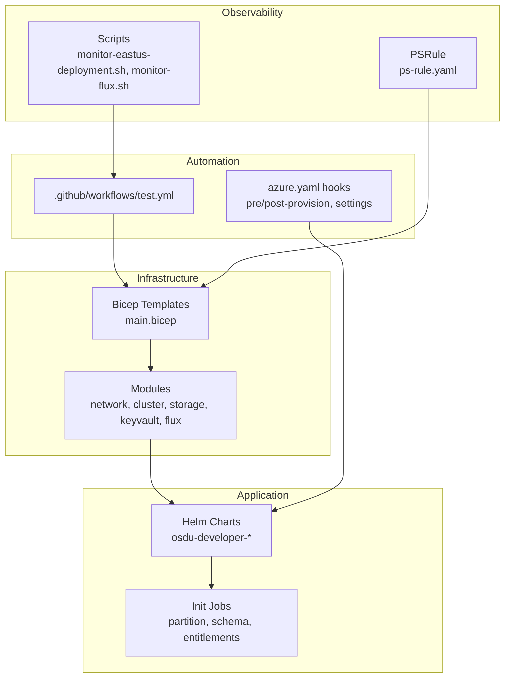
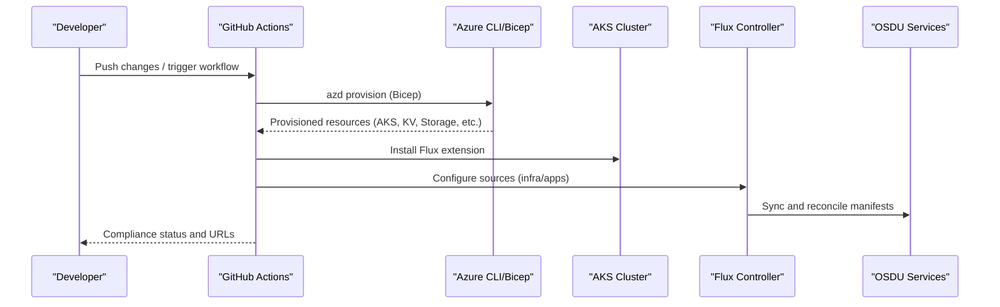
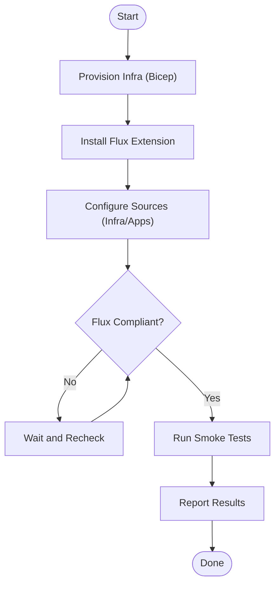
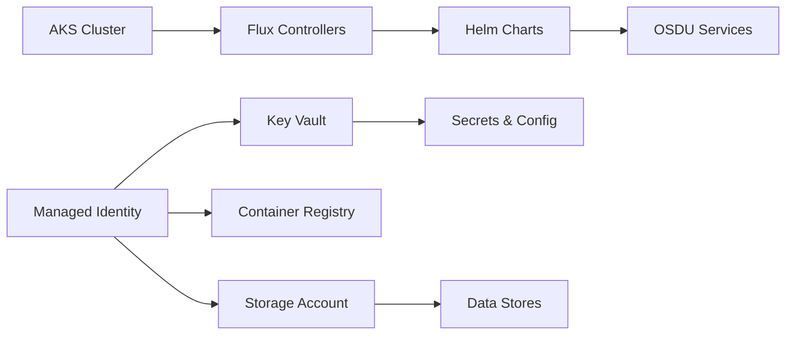

# Production Deployment Best Practices

<cite>
**Referenced Files in This Document**
- [README.md](file://README.md)
- [SECURITY.md](file://SECURITY.md)
- [DEPLOYMENT_SUMMARY.md](file://DEPLOYMENT_SUMMARY.md)
- [bicep/README.md](file://bicep/README.md)
- [bicep/main.bicep](file://bicep/main.bicep)
- [bicep/main.parameters.json](file://bicep/main.parameters.json)
- [azure.yaml](file://azure.yaml)
- [ps-rule.yaml](file://ps-rule.yaml)
- [.github/workflows/test.yml](file://.github/workflows/test.yml)
- [monitor-eastus-deployment.sh](file://monitor-eastus-deployment.sh)
- [monitor-flux.sh](file://monitor-flux.sh)
- [scripts/post-provision.ps1](file://scripts/post-provision.ps1)
- [AUTH_CODE_GUIDE.md](file://AUTH_CODE_GUIDE.md)
- [docs/src/getting_started.md](file://docs/src/getting_started.md)
- [docs/pipelines.md](file://docs/pipelines.md)
- [charts/osdu-developer-init/templates/partition-init.yaml](file://charts/osdu-developer-init/templates/partition-init.yaml)
</cite>

## Table of Contents
1. Introduction
2. Project Structure
3. Core Components
4. Architecture Overview
5. Detailed Component Analysis
6. Dependency Analysis
7. Performance Considerations
8. Troubleshooting Guide
9. Conclusion
10. Appendices

## Introduction
This document provides production deployment best practices for the OSDU platform using this repository’s Azure-native IaC and GitOps tooling. It covers environment preparation, security hardening, network configuration, compliance validation, deployment verification, smoke testing, rollback strategies, capacity planning, cost management, multi-region considerations, high availability, disaster recovery, operational runbooks, change management, and maintenance windows. The guidance is grounded in the repository’s Bicep templates, Helm charts, GitHub Actions workflows, and monitoring scripts.

## Project Structure
The repository organizes infrastructure as code (IaC), application manifests, and operational automation:
- Infrastructure: Bicep modules under bicep/, including cluster, networking, storage, Key Vault, monitoring, and Flux/GitOps integration.
- Application: Helm charts under charts/ for OSDU services, ingress, certificates, secrets, and initialization jobs.
- Automation: GitHub Actions workflow for validation, provisioning, and post-deploy checks; PowerShell hooks for pre/post provisioning and settings.
- Monitoring: Scripts to observe AKS and Flux compliance during deployments.

**Diagram sources**
- [bicep/main.bicep:1-120](file://bicep/main.bicep#L1-L120)
- [bicep/README.md:1-87](file://bicep/README.md#L1-L87)
- [.github/workflows/test.yml:1-120](file://.github/workflows/test.yml#L1-L120)
- [azure.yaml:1-26](file://azure.yaml#L1-L26)
- [ps-rule.yaml:1-57](file://ps-rule.yaml#L1-L57)
- [monitor-eastus-deployment.sh:1-43](file://monitor-eastus-deployment.sh#L1-L43)
- [monitor-flux.sh:1-52](file://monitor-flux.sh#L1-L52)

**Section sources**
- [bicep/main.bicep:1-120](file://bicep/main.bicep#L1-L120)
- [bicep/README.md:1-87](file://bicep/README.md#L1-L87)
- [azure.yaml:1-26](file://azure.yaml#L1-L26)
- [ps-rule.yaml:1-57](file://ps-rule.yaml#L1-L57)

## Core Components
- Identity and Access: User-assigned managed identity, federated identities for Flux, RBAC on Key Vault and Storage.
- Compute: AKS with system/user node pools, optional private cluster, node resource group lockdown, auto-provisioning controls.
- Networking: Optional BYO VNet injection, pod subnet support, NAT IP for egress, private endpoints via modules.
- Data Plane: Cosmos DB (multi-region write support in module), Storage Account (blob/table/file), Redis Cache, Postgres (via components).
- Secrets and Config: Key Vault with RBAC, exported secrets, App Configuration integration via Flux/Helm provider.
- Observability: Log Analytics, Application Insights, Prometheus/Grafana via Flux when enabled.
- GitOps: Flux extension installed on AKS; source-controller/helm-controller/kustomize-controller configured; compliance-driven rollout.

Key parameterization is centralized in parameters files and environment variables, enabling repeatable, auditable deployments across environments.

**Section sources**
- [bicep/main.bicep:155-800](file://bicep/main.bicep#L155-L800)
- [bicep/main.parameters.json:1-83](file://bicep/main.parameters.json#L1-L83)
- [bicep/modules/cosmos-db/main.bicep:269-307](file://bicep/modules/cosmos-db/main.bicep#L269-L307)

## Architecture Overview
End-to-end flow from CI to running OSDU services:

**Diagram sources**
- [.github/workflows/test.yml:342-374](file://.github/workflows/test.yml#L342-L374)
- [bicep/main.bicep:398-421](file://bicep/main.bicep#L398-L421)
- [bicep/main.bicep:432-474](file://bicep/main.bicep#L432-L474)

## Detailed Component Analysis

### Environment Preparation
- Subscription quotas: Ensure sufficient vCPU quota per region and Cosmos DB availability. Request increases if needed.
- Authentication: Use Azure CLI and Azure Developer CLI (azd) with appropriate scopes and service principals.
- Region selection: Choose regions with adequate capacity; consider multi-region strategy later.
- Parameters: Populate environment variables or parameter files for location, ingress type, cluster features, software versions, and networking.

Operational notes:
- Pre/post provisioning hooks are defined in azure.yaml and executed by azd.
- PSRule enforces standards and can be integrated into PR gates.

**Section sources**
- [docs/src/getting_started.md:1-7](file://docs/src/getting_started.md#L1-L7)
- [README.md:25-65](file://README.md#L25-L65)
- [azure.yaml:1-26](file://azure.yaml#L1-L26)
- [ps-rule.yaml:1-57](file://ps-rule.yaml#L1-L57)
- [bicep/main.parameters.json:1-83](file://bicep/main.parameters.json#L1-L83)

### Security Hardening
- Managed Identities: Central identity for secure access to Key Vault, Storage, and other services.
- Key Vault: Enable RBAC, restrict network ACLs to cluster NAT IP, store secrets securely.
- Storage: Disable public blob access where possible; use private endpoints; configure network ACLs.
- AKS: Consider private cluster mode; enable node resource group lockdown; restrict inbound/outbound traffic.
- Ingress: Use HTTPS via managed certificates; configure reference grants and policies.
- Secrets Management: Avoid embedding secrets in manifests; use Key Vault references and init jobs.

Compliance and policy:
- PSRule ruleset included; customize exclusions based on organizational policy.
- Well-Architected assessments available via GitHub Actions.

**Section sources**
- [bicep/main.bicep:599-661](file://bicep/main.bicep#L599-L661)
- [bicep/main.bicep:715-800](file://bicep/main.bicep#L715-L800)
- [ps-rule.yaml:21-57](file://ps-rule.yaml#L21-L57)
- [SECURITY.md:1-42](file://SECURITY.md#L1-L42)

### Network Configuration
- BYO VNet Injection: Optional; supports AKS and pod subnets for advanced networking.
- Private Endpoints: Modules exist for private endpoints; integrate with DNS zones and firewall policies as required.
- Egress: NAT IP exposed for outbound traffic; ensure NSGs and route tables align with least privilege.
- Ingress: External or internal ingress types configurable; certificate management via Helm charts.

**Section sources**
- [bicep/main.bicep:59-81](file://bicep/main.bicep#L59-L81)
- [bicep/main.bicep:296-336](file://bicep/main.bicep#L296-L336)
- [bicep/main.bicep:353-385](file://bicep/main.bicep#L353-L385)

### Compliance Requirements
- Standards Checks: PSRule runs in CI; results can gate merges or inform remediation.
- Well-Architected: Workflow includes a step to assess against Azure best practices.
- Post-deploy Validation: Verify Flux compliance state before considering deployment successful.

**Section sources**
- [ps-rule.yaml:1-57](file://ps-rule.yaml#L1-L57)
- [.github/workflows/test.yml:78-103](file://.github/workflows/test.yml#L78-L103)
- [docs/pipelines.md:33-66](file://docs/pipelines.md#L33-L66)

### Deployment Validation and Smoke Testing
- Automated Provisioning: GitHub Actions provisions infrastructure and installs Flux.
- Compliance Monitoring: Scripts poll AKS and Flux compliance; open browser to auth endpoint after success.
- Smoke Tests: Validate core endpoints and services via HTTP tests in tools/rest-scripts; confirm partition/schema/entitlements initialized.

**Diagram sources**
- [.github/workflows/test.yml:342-374](file://.github/workflows/test.yml#L342-L374)
- [monitor-flux.sh:1-52](file://monitor-flux.sh#L1-L52)
- [scripts/post-provision.ps1:284-319](file://scripts/post-provision.ps1#L284-L319)

**Section sources**
- [.github/workflows/test.yml:342-374](file://.github/workflows/test.yml#L342-L374)
- [monitor-flux.sh:1-52](file://monitor-flux.sh#L1-L52)
- [scripts/post-provision.ps1:284-319](file://scripts/post-provision.ps1#L284-L319)

### Rollback Procedures
- GitOps-based Rollback: Revert Helm chart or Kustomize overlays in the Git source; Flux reconciles back to desired state.
- Infrastructure Rollback: Redeploy previous Bicep version or use ARM template artifacts produced by release workflows.
- Data Safety: Ensure backups and immutability policies for critical storage; validate restore procedures prior to incidents.

**Section sources**
- [bicep/README.md:1-87](file://bicep/README.md#L1-L87)
- [docs/pipelines.md:33-66](file://docs/pipelines.md#L33-L66)

### Resource Optimization and Cost Management
- Node Pools: Right-size system/user pools; leverage burstable VMs for dev/test; scale out for peak loads.
- Auto-provisioning: Enable controlled scaling; set minimum/maximum nodes to balance cost and performance.
- Storage Tiers: Use LRS for non-critical data; consider RA-GRS or ZRS for critical workloads; manage lifecycle policies.
- Monitoring: Use Application Insights and Log Analytics to identify underutilized resources and optimize sizing.

**Section sources**
- [bicep/main.bicep:46-57](file://bicep/main.bicep#L46-L57)
- [bicep/main.bicep:259-279](file://bicep/main.bicep#L259-L279)
- [DEPLOYMENT_SUMMARY.md:124-141](file://DEPLOYMENT_SUMMARY.md#L124-L141)

### Capacity Planning
- Quotas: Ensure regional vCPU quotas meet workload demands; plan for growth and spikes.
- Database Throughput: Size Cosmos DB RU/s and backup policies appropriately; evaluate multi-region writes for DR.
- Storage IOPS: Plan blob/table/file capacities based on ingestion rates and retention requirements.

**Section sources**
- [docs/src/getting_started.md:1-7](file://docs/src/getting_started.md#L1-L7)
- [bicep/modules/cosmos-db/main.bicep:269-307](file://bicep/modules/cosmos-db/main.bicep#L269-L307)

### Multi-Region Deployments
- Strategy: Deploy separate clusters per region with isolated storage and databases; use global routing at ingress level.
- Data Replication: Configure Cosmos DB multi-write regions for low-latency reads/writes; define failover priorities.
- Consistency: Align consistency models with application needs; test cross-region latency and failure scenarios.

**Section sources**
- [bicep/modules/cosmos-db/main.bicep:269-307](file://bicep/modules/cosmos-db/main.bicep#L269-L307)

### High Availability Configurations
- AKS: Multiple node pools across zones; enable auto-provisioning; configure maintenance windows.
- Storage: Use zone-redundant storage where supported; enable immutability for compliance-sensitive data.
- Monitoring: Centralize logs and metrics; alert on failures and degraded states.

**Section sources**
- [bicep/main.bicep:353-385](file://bicep/main.bicep#L353-L385)
- [bicep/main.bicep:715-800](file://bicep/main.bicep#L715-L800)

### Disaster Recovery Planning
- Backups: Configure continuous or periodic backups for databases; export storage snapshots; maintain immutable copies.
- Restore Runbook: Document steps to rebuild infrastructure from IaC; validate restores regularly.
- RTO/RPO: Define targets aligned with business SLAs; test failover and recovery procedures.

[No sources needed since this section provides general guidance]

### Operational Runbooks
- Post-Provision: Waits for Flux compliance, sets local auth, updates application, opens browser to auth URL.
- Monitoring: Poll AKS and Flux status; surface ingress URL for authentication; guide next steps.
- Change Management: Use Git-driven changes; enforce PR reviews; automate validation and standards checks.

**Section sources**
- [scripts/post-provision.ps1:284-319](file://scripts/post-provision.ps1#L284-L319)
- [monitor-flux.sh:1-52](file://monitor-flux.sh#L1-L52)
- [.github/workflows/test.yml:78-103](file://.github/workflows/test.yml#L78-L103)

### Maintenance Windows
- AKS Maintenance: Configure maintenance configurations with weekly schedules and duration; coordinate with app teams.
- Rolling Updates: Leverage GitOps to apply updates during planned windows; monitor reconciliation and health.

**Section sources**
- [bicep/modules/managed-cluster/tests/e2e/automatic/main.test.bicep:34-73](file://bicep/modules/managed-cluster/tests/e2e/automatic/main.test.bicep#L34-L73)
- [bicep/modules/managed-cluster/maintenance-configurations/main.json:38-68](file://bicep/modules/managed-cluster/maintenance-configurations/main.json#L38-L68)

## Dependency Analysis
Infrastructure dependencies and control flow:

**Diagram sources**
- [bicep/main.bicep:166-180](file://bicep/main.bicep#L166-L180)
- [bicep/main.bicep:485-529](file://bicep/main.bicep#L485-L529)
- [bicep/main.bicep:599-661](file://bicep/main.bicep#L599-L661)
- [bicep/main.bicep:398-421](file://bicep/main.bicep#L398-L421)

**Section sources**
- [bicep/main.bicep:166-180](file://bicep/main.bicep#L166-L180)
- [bicep/main.bicep:485-529](file://bicep/main.bicep#L485-L529)
- [bicep/main.bicep:599-661](file://bicep/main.bicep#L599-L661)
- [bicep/main.bicep:398-421](file://bicep/main.bicep#L398-L421)

## Performance Considerations
- Autoscaling: Tune HPA and cluster autoscaler; set resource requests/limits per service.
- Caching: Use Redis strategically for hot paths; monitor hit ratios and latency.
- Indexing: Optimize search indices and query patterns; avoid heavy scans.
- Observability: Instrument services; collect traces and metrics; set alerts for SLO breaches.

[No sources needed since this section provides general guidance]

## Troubleshooting Guide
Common issues and resolutions:
- Quota Failures: Increase vCPU quotas or deploy to alternative regions; consult quota guides.
- Auth Code Flow: After deployment, obtain AUTH_CODE from the opened browser and set it via azd env; then run settings hook.
- Flux Non-Compliant: Monitor compliance state; wait for reconciliation; inspect sources and Helm releases.
- Network Access: Validate Key Vault and Storage network ACLs; ensure cluster NAT IP is permitted.

**Section sources**
- [AUTH_CODE_GUIDE.md:50-94](file://AUTH_CODE_GUIDE.md#L50-L94)
- [AUTH_CODE_GUIDE.md:169-228](file://AUTH_CODE_GUIDE.md#L169-L228)
- [monitor-eastus-deployment.sh:1-43](file://monitor-eastus-deployment.sh#L1-L43)
- [monitor-flux.sh:1-52](file://monitor-flux.sh#L1-L52)

## Conclusion
This repository provides a robust, GitOps-driven foundation for deploying OSDU on Azure with strong security, observability, and compliance capabilities. By following the outlined best practices—environment preparation, security hardening, network configuration, validation, and operational runbooks—you can achieve reliable, scalable, and compliant production deployments. Adopt multi-region strategies and disaster recovery plans aligned with your SLAs, and continuously refine capacity and cost through monitoring and right-sizing.

[No sources needed since this section summarizes without analyzing specific files]

## Appendices

### Deployment Validation Checklist
- Confirm subscription quotas and region capacity.
- Validate Bicep build and PSRule checks pass in CI.
- Provision infrastructure and install Flux.
- Verify Flux compliance state and application readiness.
- Execute smoke tests against core endpoints.
- Review logs and metrics for anomalies.

**Section sources**
- [.github/workflows/test.yml:78-103](file://.github/workflows/test.yml#L78-L103)
- [docs/pipelines.md:33-66](file://docs/pipelines.md#L33-L66)

### Initialization and Secrets
- Partition and service initialization jobs inject sensitive values via ConfigMaps and Kubernetes secrets.
- Ensure secrets are sourced from Key Vault and not hardcoded.

**Section sources**
- [charts/osdu-developer-init/templates/partition-init.yaml:45-94](file://charts/osdu-developer-init/templates/partition-init.yaml#L45-L94)
- [charts/osdu-developer-init/templates/partition-init.yaml:164-204](file://charts/osdu-developer-init/templates/partition-init.yaml#L164-L204)