# Scaling and Performance Optimization

<cite>
**Referenced Files in This Document**
- [hpa.yaml](file://charts/osdu-developer-service/templates/hpa.yaml)
- [resource-limits.yaml](file://charts/osdu-developer-base/templates/resource-limits.yaml)
- [cache.yaml](file://software/components/osdu-system/cache.yaml)
- [main.bicep](file://bicep/main.bicep)
- [grafana.yaml](file://software/components/observability/grafana.yaml)
- [subnet_monitoring.yaml](file://software/components/observability/subnet_monitoring.yaml)
- [elastic-search.yaml](file://software/components/elastic-search/elastic-search.yaml)
- [storage-class.yaml](file://software/components/elastic-storage/storage-class.yaml)
- [search.yaml](file://software/applications/osdu-core/search.yaml)
- [services_core_search.md](file://docs/src/services_core_search.md)
- [services_core_entitlements.md](file://docs/src/services_core_entitlements.md)
- [cosmos-db main.bicep](file://bicep/modules/cosmos-db/main.bicep)
- [cosmos-db README.md](file://bicep/modules/cosmos-db/README.md)
- [database.yaml](file://software/components/osdu-system/database.yaml)
- [partition-init.yaml](file://charts/osdu-developer-init/templates/partition-init.yaml)
- [gateway-api-crd.yaml](file://software/components/global/gateway-api-crd.yaml)
</cite>

## Table of Contents
1. Introduction
2. Project Structure
3. Core Components
4. Architecture Overview
5. Detailed Component Analysis
6. Dependency Analysis
7. Performance Considerations
8. Troubleshooting Guide
9. Conclusion
10. Appendices

## Introduction
This document provides a comprehensive guide to scaling and performance optimization for the OSDU platform as implemented in this repository. It covers horizontal pod autoscaling (HPA), vertical resource limits, cluster-level scaling via AKS agent pools, caching with Redis, database configuration for Cosmos DB and PostgreSQL, search engine tuning for Elasticsearch, observability and monitoring with Prometheus/Grafana/Loki, and API gateway timeout controls. It also includes load testing methodologies, capacity planning guidelines, and best practices for high-throughput scenarios including caching strategies, connection pooling considerations, and rate limiting approaches.

## Project Structure
The repository organizes deployment artifacts across several layers:
- Infrastructure-as-code (Bicep) provisions Azure resources such as Redis Cache and AKS clusters with auto-scaling capabilities.
- Kubernetes manifests and Helm charts deploy core services (Elasticsearch, Redis, Grafana, Loki, Prometheus) and application workloads.
- Service configurations define environment variables, resource requests/limits, and integration points (e.g., search service endpoints).
- Observability components provide dashboards and metrics collection for performance analysis.

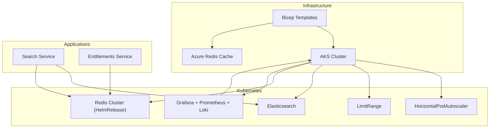

**Diagram sources**
- [main.bicep:250-279](file://bicep/main.bicep#L250-L279)
- [hpa.yaml:1-33](file://charts/osdu-developer-service/templates/hpa.yaml#L1-L33)
- [resource-limits.yaml:15-27](file://charts/osdu-developer-base/templates/resource-limits.yaml#L15-L27)
- [elastic-search.yaml:1-89](file://software/components/elastic-search/elastic-search.yaml#L1-L89)
- [cache.yaml:57-172](file://software/components/osdu-system/cache.yaml#L57-L172)
- [grafana.yaml:42-63](file://software/components/observability/grafana.yaml#L42-L63)

**Section sources**
- [main.bicep:250-279](file://bicep/main.bicep#L250-L279)
- [hpa.yaml:1-33](file://charts/osdu-developer-service/templates/hpa.yaml#L1-L33)
- [resource-limits.yaml:15-27](file://charts/osdu-developer-base/templates/resource-limits.yaml#L15-L27)
- [elastic-search.yaml:1-89](file://software/components/elastic-search/elastic-search.yaml#L1-L89)
- [cache.yaml:57-172](file://software/components/osdu-system/cache.yaml#L57-L172)
- [grafana.yaml:42-63](file://software/components/observability/grafana.yaml#L42-L63)

## Core Components
- Horizontal Pod Autoscaling (HPA): Configured per service to scale based on CPU utilization targets.
- Vertical Resource Limits: Namespace-wide LimitRange sets default CPU/memory requests and limits for containers.
- Caching Layer: Redis cluster deployed via HelmRelease with TLS and persistence; Azure Redis Cache provisioned via Bicep for alternative or supplementary caching.
- Search Engine: Elasticsearch cluster with node roles, zone-aware scheduling, and resource constraints.
- Database Layer: Cosmos DB account with configurable throughput and consistency; PostgreSQL via CloudNativePG operator.
- Observability: Prometheus scraping, Grafana dashboards, Loki logs, and subnet monitoring for system metrics.
- API Gateway Controls: Gateway API CRDs include request timeout semantics for backend calls.

**Section sources**
- [hpa.yaml:1-33](file://charts/osdu-developer-service/templates/hpa.yaml#L1-L33)
- [resource-limits.yaml:15-27](file://charts/osdu-developer-base/templates/resource-limits.yaml#L15-L27)
- [cache.yaml:57-172](file://software/components/osdu-system/cache.yaml#L57-L172)
- [elastic-search.yaml:1-89](file://software/components/elastic-search/elastic-search.yaml#L1-L89)
- [cosmos-db main.bicep:295-386](file://bicep/modules/cosmos-db/main.bicep#L295-L386)
- [database.yaml:1-29](file://software/components/osdu-system/database.yaml#L1-L29)
- [grafana.yaml:42-63](file://software/components/observability/grafana.yaml#L42-L63)
- [gateway-api-crd.yaml:9771-9789](file://software/components/global/gateway-api-crd.yaml#L9771-L9789)

## Architecture Overview
The platform uses a layered architecture where applications interact with search and storage backends, while autoscaling and resource policies ensure responsiveness under load. Observability is embedded to capture metrics and logs for performance tuning.

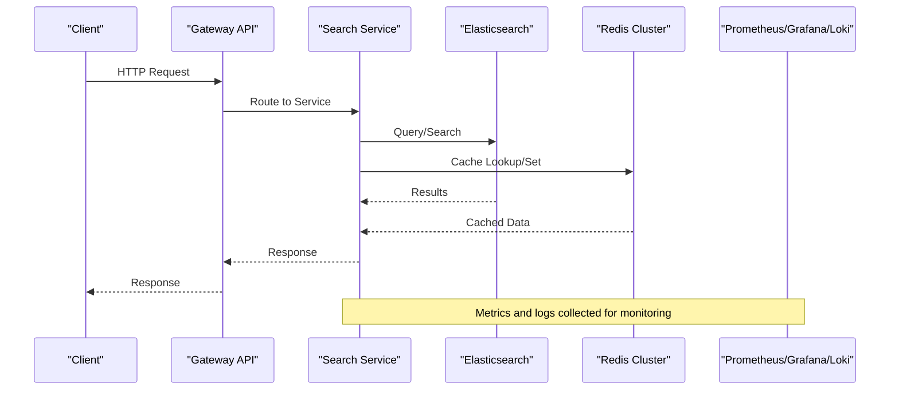

**Diagram sources**
- [gateway-api-crd.yaml:9771-9789](file://software/components/global/gateway-api-crd.yaml#L9771-L9789)
- [search.yaml:55-104](file://software/applications/osdu-core/search.yaml#L55-L104)
- [elastic-search.yaml:1-89](file://software/components/elastic-search/elastic-search.yaml#L1-L89)
- [cache.yaml:57-172](file://software/components/osdu-system/cache.yaml#L57-L172)
- [grafana.yaml:42-63](file://software/components/observability/grafana.yaml#L42-L63)

## Detailed Component Analysis

### Horizontal Pod Autoscaling (HPA)
- Purpose: Scale pods horizontally based on CPU utilization target to handle variable load.
- Configuration: Per-service HPA created from Helm template values; min/max replicas and target CPU utilization are parameterized.
- Integration: Works alongside LimitRange defaults to ensure predictable scheduling and scaling behavior.

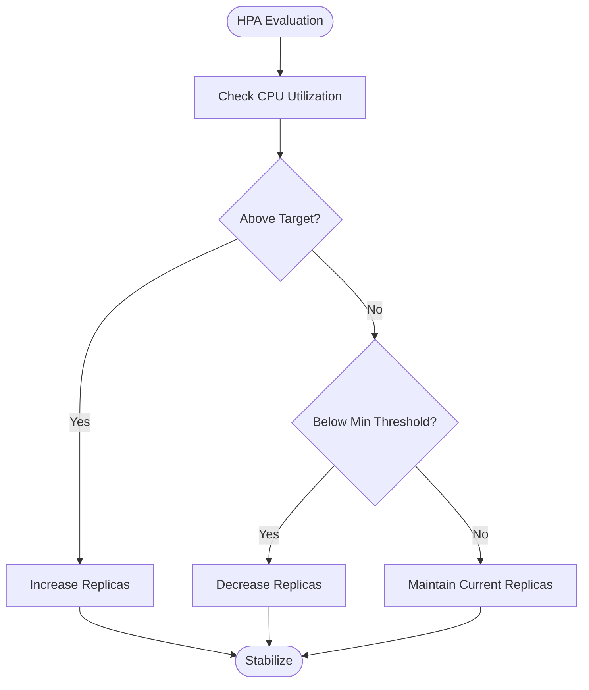

**Diagram sources**
- [hpa.yaml:1-33](file://charts/osdu-developer-service/templates/hpa.yaml#L1-L33)

**Section sources**
- [hpa.yaml:1-33](file://charts/osdu-developer-service/templates/hpa.yaml#L1-L33)
- [resource-limits.yaml:15-27](file://charts/osdu-developer-base/templates/resource-limits.yaml#L15-L27)

### Vertical Scaling Strategies
- Namespace Defaults: LimitRange defines default CPU/memory requests and limits to prevent resource starvation and improve scheduling efficiency.
- Application-Specific Requests: Services like Search specify CPU/memory requests to align with workload characteristics.
- Node Pool Sizing: AKS agent pool parameters (minCount, maxCount, maxPods) control cluster capacity and pod density.

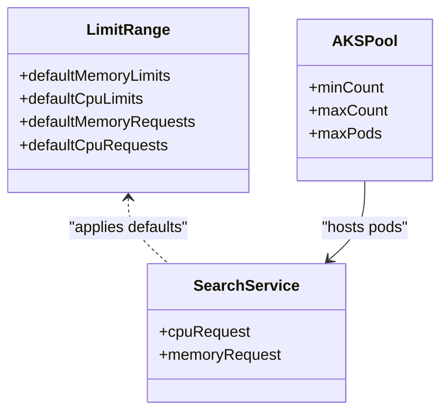

**Diagram sources**
- [resource-limits.yaml:15-27](file://charts/osdu-developer-base/templates/resource-limits.yaml#L15-L27)
- [search.yaml:55-104](file://software/applications/osdu-core/search.yaml#L55-L104)
- [managed-cluster main.json:2346-2365](file://bicep/modules/managed-cluster/main.json#L2346-L2365)

**Section sources**
- [resource-limits.yaml:15-27](file://charts/osdu-developer-base/templates/resource-limits.yaml#L15-L27)
- [search.yaml:55-104](file://software/applications/osdu-core/search.yaml#L55-L104)
- [managed-cluster main.json:2346-2365](file://bicep/modules/managed-cluster/main.json#L2346-L2365)

### Cluster-Level Scaling
- AKS Agent Pools: Auto-scaling enabled via minCount/maxCount; node labels and taints influence pod placement.
- Zone Awareness: Elasticsearch and Redis use topology spread and affinity to distribute across availability zones for resilience.
- Storage Class: Elasticsearch uses managed-premium disks with retention policy to preserve data during lifecycle changes.

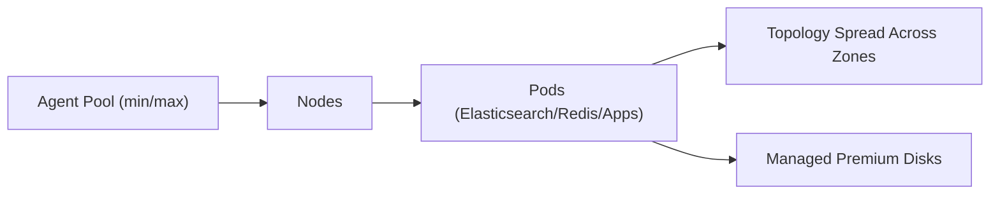

**Diagram sources**
- [elastic-search.yaml:1-89](file://software/components/elastic-search/elastic-search.yaml#L1-L89)
- [cache.yaml:57-172](file://software/components/osdu-system/cache.yaml#L57-L172)
- [storage-class.yaml:1-13](file://software/components/elastic-storage/storage-class.yaml#L1-L13)

**Section sources**
- [elastic-search.yaml:1-89](file://software/components/elastic-search/elastic-search.yaml#L1-L89)
- [cache.yaml:57-172](file://software/components/osdu-system/cache.yaml#L57-L172)
- [storage-class.yaml:1-13](file://software/components/elastic-storage/storage-class.yaml#L1-L13)

### Caching Strategies
- Redis Cluster: Deployed with TLS, authentication via Key Vault secrets, persistence enabled, and multi-zone affinity.
- Azure Redis Cache: Provisioned via Bicep for additional caching needs or external integrations.
- Service Usage: Search and Entitlements services reference Redis settings (e.g., TTL, database number) to optimize cache behavior.

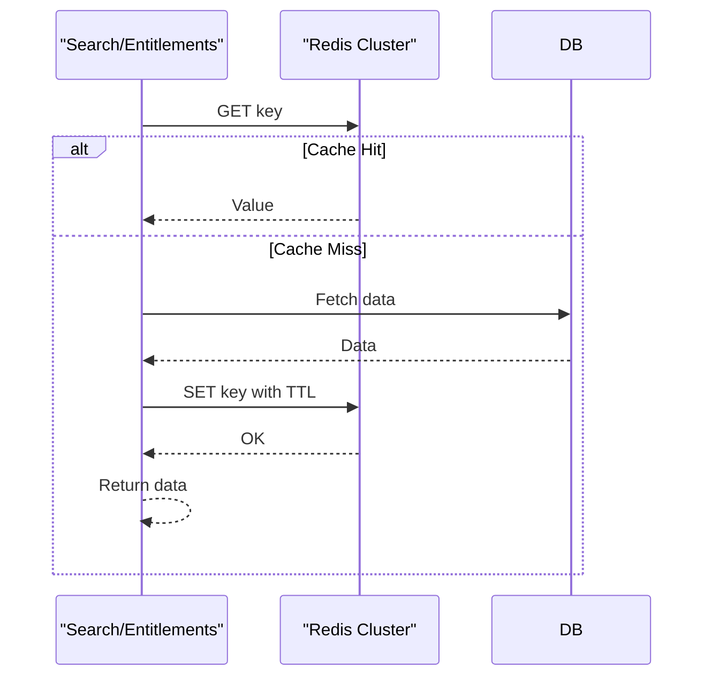

**Diagram sources**
- [cache.yaml:57-172](file://software/components/osdu-system/cache.yaml#L57-L172)
- [main.bicep:250-279](file://bicep/main.bicep#L250-L279)
- [services_core_search.md:14-38](file://docs/src/services_core_search.md#L14-L38)
- [services_core_entitlements.md:14-27](file://docs/src/services_core_entitlements.md#L14-L27)

**Section sources**
- [cache.yaml:57-172](file://software/components/osdu-system/cache.yaml#L57-L172)
- [main.bicep:250-279](file://bicep/main.bicep#L250-L279)
- [services_core_search.md:14-38](file://docs/src/services_core_search.md#L14-L38)
- [services_core_entitlements.md:14-27](file://docs/src/services_core_entitlements.md#L14-L27)

### Database Configuration and Scaling
- Cosmos DB: Configurable throughput (RU/s) and maximum throughput for autoscale; consistency level and multi-region write locations can be tuned.
- PostgreSQL: CloudNativePG operator installed to manage databases within the cluster.
- Partition Initialization: Includes placeholders for Cosmos and Elastic endpoints used by partition setup.

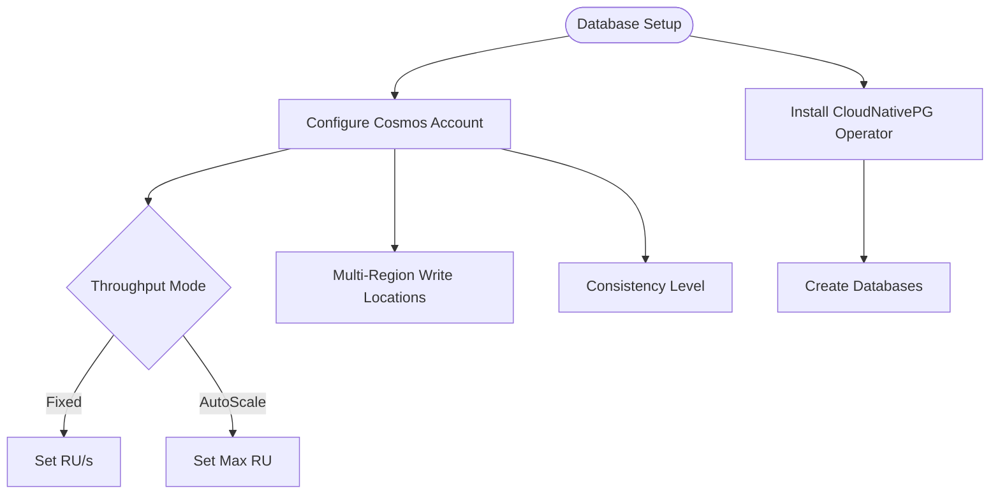

**Diagram sources**
- [cosmos-db main.bicep:295-386](file://bicep/modules/cosmos-db/main.bicep#L295-L386)
- [cosmos-db README.md:9-52](file://bicep/modules/cosmos-db/README.md#L9-L52)
- [database.yaml:1-29](file://software/components/osdu-system/database.yaml#L1-L29)
- [partition-init.yaml:57-94](file://charts/osdu-developer-init/templates/partition-init.yaml#L57-L94)

**Section sources**
- [cosmos-db main.bicep:295-386](file://bicep/modules/cosmos-db/main.bicep#L295-L386)
- [cosmos-db README.md:9-52](file://bicep/modules/cosmos-db/README.md#L9-L52)
- [database.yaml:1-29](file://software/components/osdu-system/database.yaml#L1-L29)
- [partition-init.yaml:57-94](file://charts/osdu-developer-init/templates/partition-init.yaml#L57-L94)

### Search Engine Tuning
- Elasticsearch: Node roles set to master/data/ingest; Java heap configured; resources requested/limited; zone-aware scheduling and topology spread constraints applied.
- Storage: Persistent volumes backed by managed-premium storage class with retain policy.

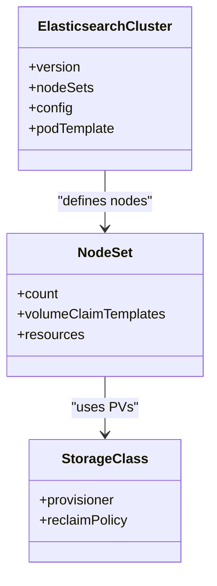

**Diagram sources**
- [elastic-search.yaml:1-89](file://software/components/elastic-search/elastic-search.yaml#L1-L89)
- [storage-class.yaml:1-13](file://software/components/elastic-storage/storage-class.yaml#L1-L13)

**Section sources**
- [elastic-search.yaml:1-89](file://software/components/elastic-search/elastic-search.yaml#L1-L89)
- [storage-class.yaml:1-13](file://software/components/elastic-storage/storage-class.yaml#L1-L13)

### Observability and Monitoring
- Prometheus: Scrapes metrics from services; Grafana visualizes Istio and workload metrics.
- Loki: Centralized logging integrated into Grafana.
- Subnet Monitoring: Configurable metric collection settings for Kubernetes system metrics.

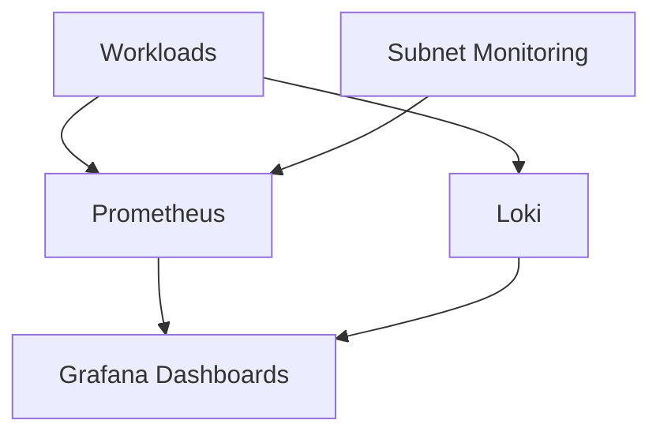

**Diagram sources**
- [grafana.yaml:42-63](file://software/components/observability/grafana.yaml#L42-L63)
- [subnet_monitoring.yaml:94-112](file://software/components/observability/subnet_monitoring.yaml#L94-L112)
- [subnet_monitoring.yaml:132-142](file://software/components/observability/subnet_monitoring.yaml#L132-L142)

**Section sources**
- [grafana.yaml:42-63](file://software/components/observability/grafana.yaml#L42-L63)
- [subnet_monitoring.yaml:94-112](file://software/components/observability/subnet_monitoring.yaml#L94-L112)
- [subnet_monitoring.yaml:132-142](file://software/components/observability/subnet_monitoring.yaml#L132-L142)

### API Rate Limiting and Timeouts
- Gateway API: Request timeouts govern end-to-end client transactions; backend request timeouts must not exceed request timeouts.
- Practical Approach: Use gateway-level timeouts and service-level circuit breakers/retries to protect backends under load.

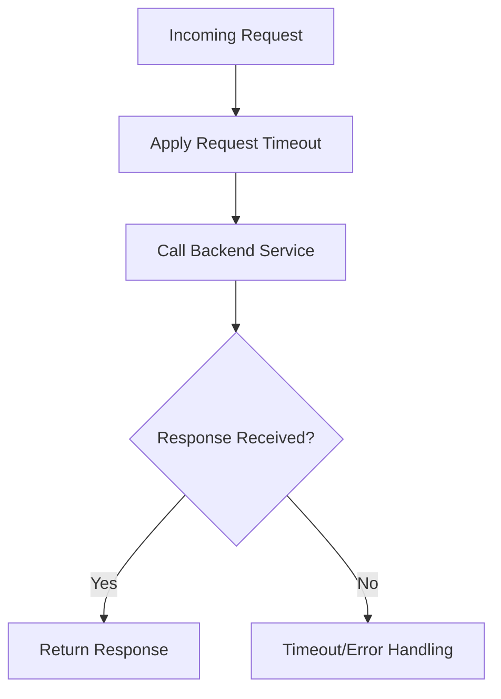

**Diagram sources**
- [gateway-api-crd.yaml:9771-9789](file://software/components/global/gateway-api-crd.yaml#L9771-L9789)

**Section sources**
- [gateway-api-crd.yaml:9771-9789](file://software/components/global/gateway-api-crd.yaml#L9771-L9789)

## Dependency Analysis
Key dependencies and relationships:
- Applications depend on Elasticsearch and Redis for search and caching.
- Observability depends on Prometheus and Loki for metrics and logs.
- Infrastructure (Bicep) provisions Redis Cache and AKS clusters that host these components.
- HPA and LimitRange coordinate scaling and resource allocation.

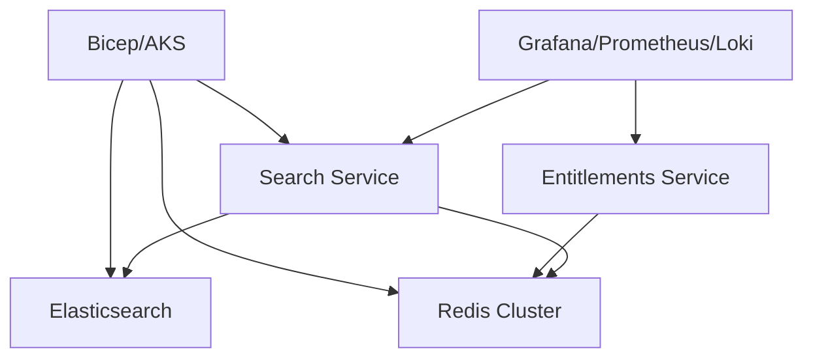

**Diagram sources**
- [search.yaml:55-104](file://software/applications/osdu-core/search.yaml#L55-L104)
- [elastic-search.yaml:1-89](file://software/components/elastic-search/elastic-search.yaml#L1-L89)
- [cache.yaml:57-172](file://software/components/osdu-system/cache.yaml#L57-L172)
- [grafana.yaml:42-63](file://software/components/observability/grafana.yaml#L42-L63)
- [main.bicep:250-279](file://bicep/main.bicep#L250-L279)

**Section sources**
- [search.yaml:55-104](file://software/applications/osdu-core/search.yaml#L55-L104)
- [elastic-search.yaml:1-89](file://software/components/elastic-search/elastic-search.yaml#L1-L89)
- [cache.yaml:57-172](file://software/components/osdu-system/cache.yaml#L57-L172)
- [grafana.yaml:42-63](file://software/components/observability/grafana.yaml#L42-L63)
- [main.bicep:250-279](file://bicep/main.bicep#L250-L279)

## Performance Considerations
- Autoscaling: Tune HPA CPU targets and replica bounds to match traffic patterns; monitor scaling events via Grafana.
- Resource Limits: Align LimitRange defaults with actual workload profiles; adjust per-service requests to avoid throttling.
- Caching: Configure appropriate TTLs and cache sizes; leverage Redis persistence and TLS for reliability and security.
- Database: Choose Cosmos DB throughput mode (fixed vs autoscale) based on peak loads; tune consistency levels for latency vs durability trade-offs.
- Search: Set Elasticsearch JVM heap appropriately; ensure sufficient disk I/O with premium storage; distribute nodes across zones.
- Observability: Enable comprehensive metrics and logs; create dashboards for latency, error rates, and saturation.
- Timeouts: Set sensible request timeouts at the gateway; implement retries and backoff in services.

[No sources needed since this section provides general guidance]

## Troubleshooting Guide
- High Latency: Check HPA scaling events, CPU/memory pressure, and network timeouts; review Grafana dashboards for error rates and latency spikes.
- Cache Misses: Validate Redis connectivity, TLS configuration, and TTL settings; inspect service logs for cache-related errors.
- Database Bottlenecks: Monitor Cosmos DB RU consumption and consistency delays; verify CloudNativePG health and backups.
- Search Degradation: Inspect Elasticsearch node health, disk usage, and JVM GC; confirm zone distribution and resource limits.
- Gateway Timeouts: Adjust request timeouts and backend call durations; analyze logs for failed backend responses.

**Section sources**
- [hpa.yaml:1-33](file://charts/osdu-developer-service/templates/hpa.yaml#L1-L33)
- [grafana.yaml:42-63](file://software/components/observability/grafana.yaml#L42-L63)
- [cache.yaml:57-172](file://software/components/osdu-system/cache.yaml#L57-L172)
- [cosmos-db main.bicep:295-386](file://bicep/modules/cosmos-db/main.bicep#L295-L386)
- [elastic-search.yaml:1-89](file://software/components/elastic-search/elastic-search.yaml#L1-L89)
- [gateway-api-crd.yaml:9771-9789](file://software/components/global/gateway-api-crd.yaml#L9771-L9789)

## Conclusion
The OSDU platform implements robust scaling and performance mechanisms through HPA, LimitRange, AKS agent pool auto-scaling, Redis caching, Elasticsearch tuning, and comprehensive observability. By carefully configuring throughput, consistency, timeouts, and resource limits, operators can achieve high throughput and low latency under varying loads. Continuous monitoring and iterative tuning are essential to maintain optimal performance.

[No sources needed since this section summarizes without analyzing specific files]

## Appendices

### Load Testing Methodologies
- Define realistic user journeys and mix of read/write operations.
- Use distributed load generators to simulate concurrent users and measure latency, error rates, and throughput.
- Correlate load test results with Grafana dashboards and logs to identify bottlenecks.

[No sources needed since this section provides general guidance]

### Capacity Planning Guidelines
- Estimate peak RPS and average response times; size HPA min/max replicas accordingly.
- Plan AKS node pool capacity based on pod density and resource requests; consider zone distribution for resilience.
- Size Elasticsearch and Redis based on data volume and query patterns; ensure adequate storage and memory.

[No sources needed since this section provides general guidance]

### Resource Utilization Best Practices
- Right-size CPU/memory requests and limits; avoid over-provisioning.
- Use topology spread and affinity to balance workloads across zones and node pools.
- Enable persistent storage with appropriate reclaim policies to preserve critical data.

[No sources needed since this section provides general guidance]