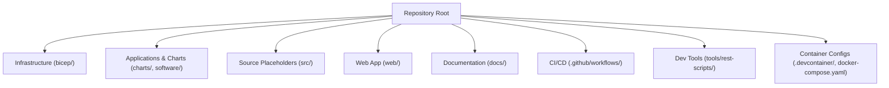
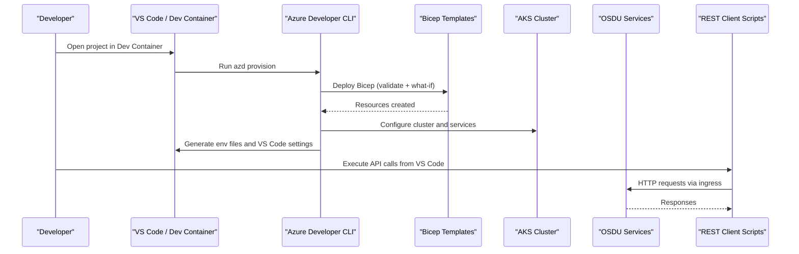
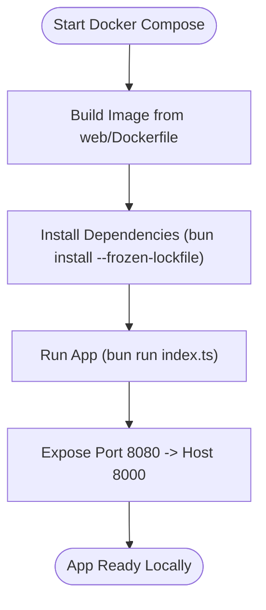
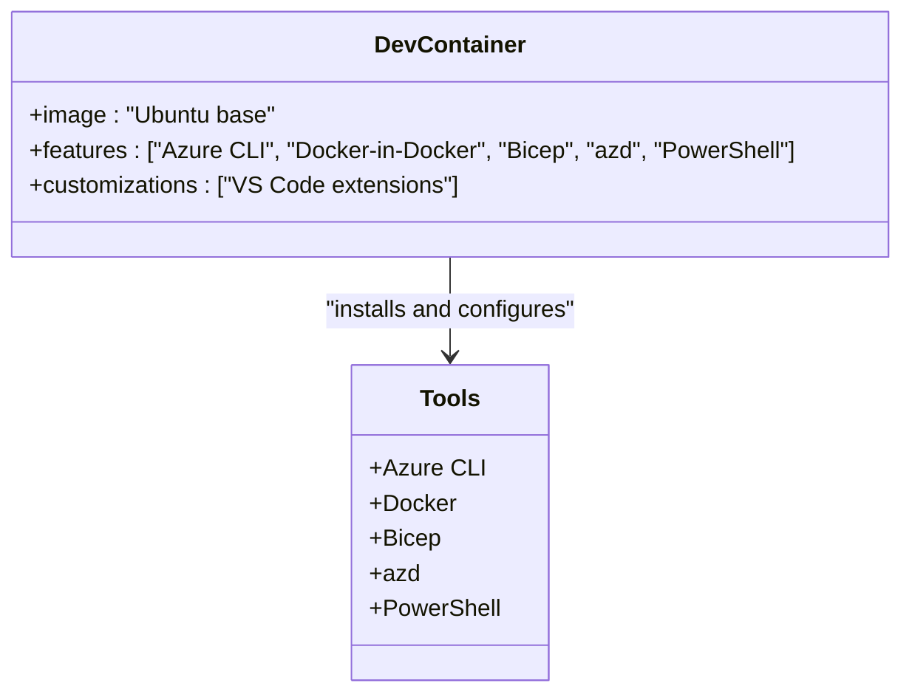
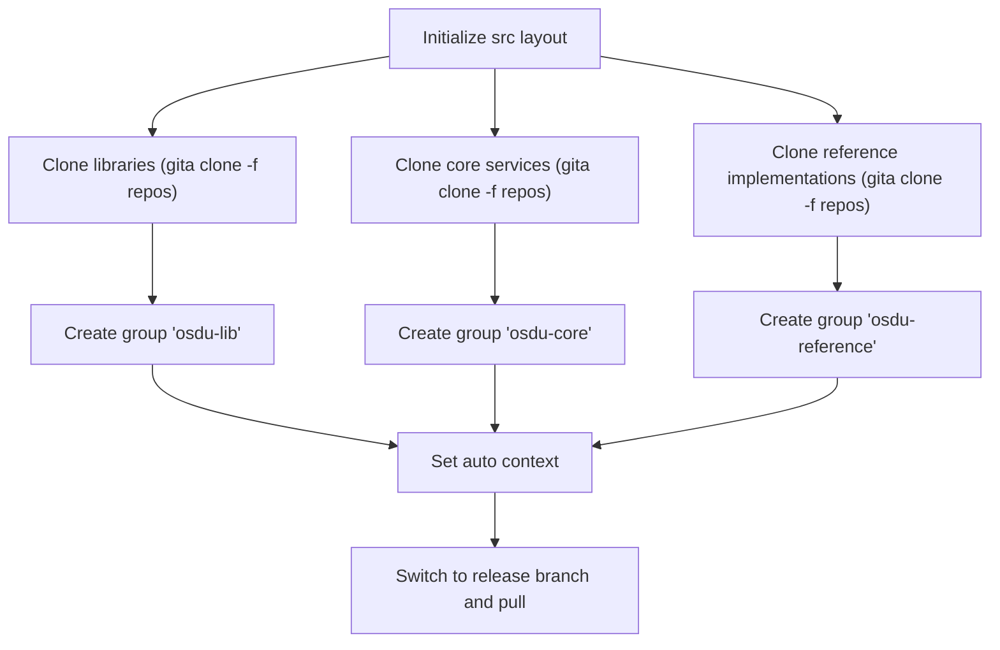
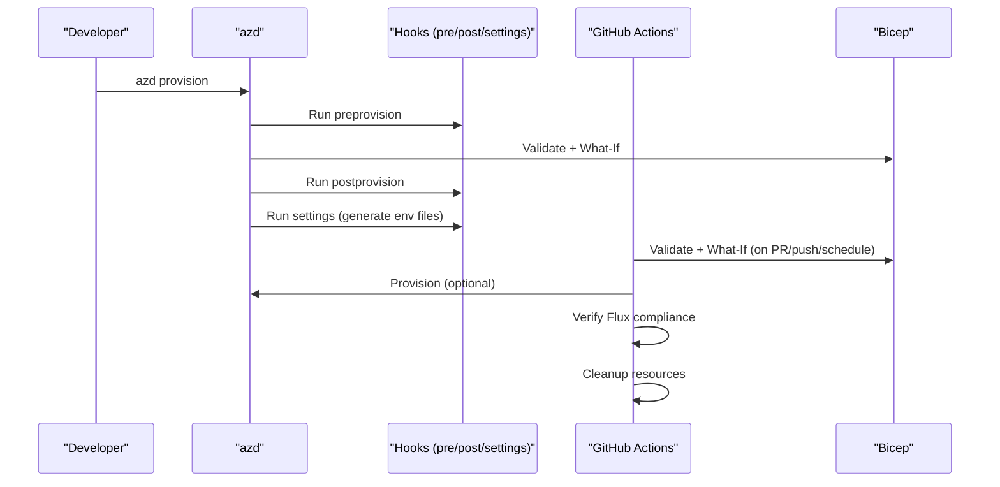
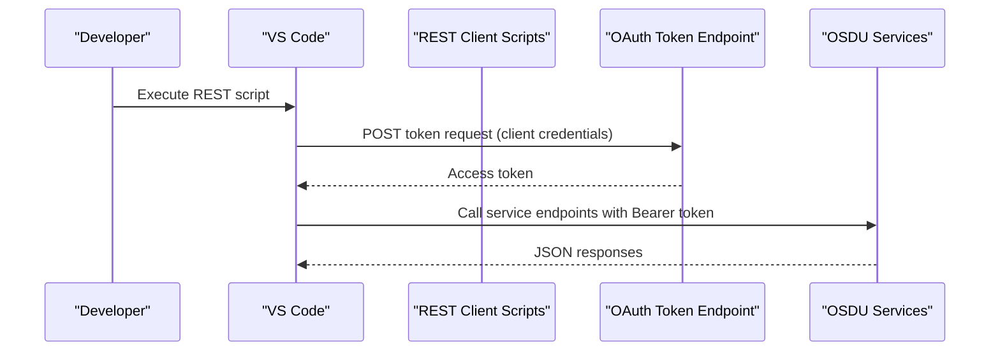
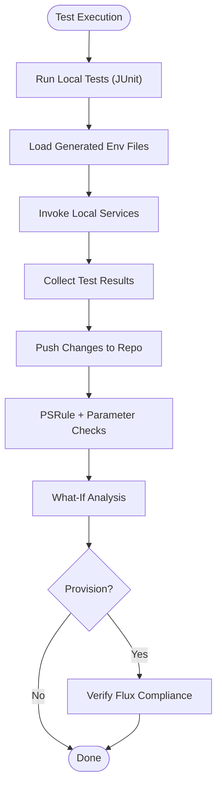
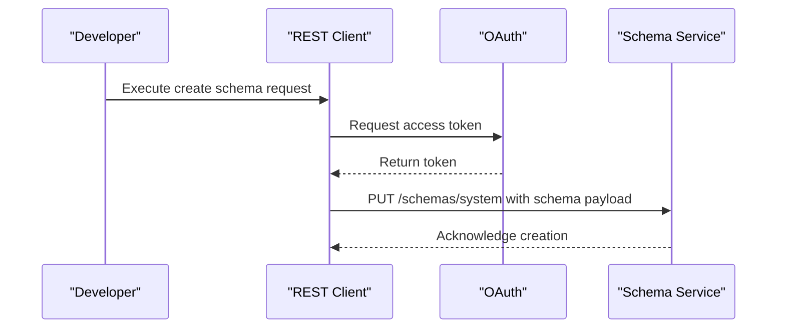
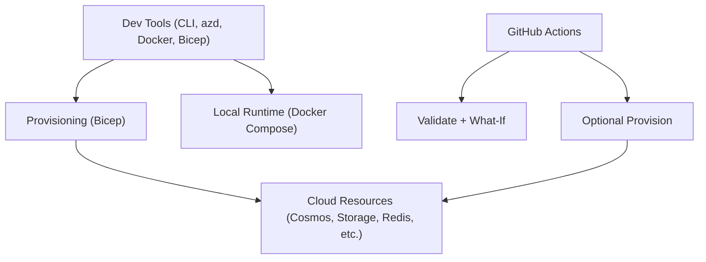

# Development Environment

<cite>
**Referenced Files in This Document**
- [README.md](file://README.md)
- [CONTRIBUTING.md](file://CONTRIBUTING.md)
- [docker-compose.yaml](file://docker-compose.yaml)
- [.devcontainer/devcontainer.json](file://.devcontainer/devcontainer.json)
- [azure.yaml](file://azure.yaml)
- [scripts/settings.ps1](file://scripts/settings.ps1)
- [web/Dockerfile](file://web/Dockerfile)
- [docs/src/getting_started.md](file://docs/src/getting_started.md)
- [docs/src/services_core.md](file://docs/src/services_core.md)
- [docs/src/debugging_rest.md](file://docs/src/debugging_rest.md)
- [tools/rest-scripts/local.http](file://tools/rest-scripts/local.http)
- [src/README.md](file://src/README.md)
- [src/Application_Insights.md](file://src/Application_Insights.md)
- [.github/workflows/test.yml](file://.github/workflows/test.yml)
</cite>

## Table of Contents
1. Introduction
2. Project Structure
3. Core Components
4. Architecture Overview
5. Detailed Component Analysis
6. Dependency Analysis
7. Performance Considerations
8. Troubleshooting Guide
9. Conclusion
10. Appendices

## Introduction
This document provides a comprehensive guide for setting up and using the development environment for OSDU contributors and developers. It covers local development with Docker Compose, VS Code Dev Containers, and GitHub Codespaces; explains source code structure and build processes; details debugging techniques, testing strategies, and code quality tools; and includes guidelines for contributing to core services, creating custom schemas, and developing integrations. It also addresses environment configuration, dependency management, and development best practices.

## Project Structure
The repository is organized to support both infrastructure-as-code (IaC) deployments and local development workflows:
- Root-level orchestration and configuration files define deployment hooks and container definitions.
- The src directory is a placeholder for cloning and managing multiple OSDU service repositories via gita.
- The web directory contains a small Node/Bun application used for local demos or tooling.
- Documentation lives under docs and is built with MkDocs.
- Infrastructure is defined in bicep modules and deployed via Azure Developer CLI (azd).
- CI/CD pipelines are defined under .github/workflows.

**Section sources**
- [README.md:1-86](file://README.md#L1-L86)
- [src/README.md:1-64](file://src/README.md#L1-L64)

## Core Components
- Local runtime: A lightweight Bun-based app is packaged and run via Docker Compose for quick local validation.
- Dev container: A preconfigured Ubuntu-based dev container with Azure CLI, Docker-in-Docker, Bicep, azd, and PowerShell features to standardize developer environments.
- Deployment automation: Azure Developer CLI orchestrates provisioning and post-provision settings, including generating environment files and VS Code configurations.
- REST client integration: VS Code REST Client scripts enable interactive API testing against local or remote endpoints.

Key responsibilities:
- docker-compose.yaml defines a single service that builds and runs the web app locally on port 8000.
- .devcontainer/devcontainer.json provisions a consistent dev environment with required tools.
- azure.yaml configures azd hooks for pre/post provisioning and settings generation.
- scripts/settings.ps1 generates environment files, VS Code settings, and downloads Application Insights agent for local debugging.

**Section sources**
- [docker-compose.yaml:1-13](file://docker-compose.yaml#L1-L13)
- [.devcontainer/devcontainer.json:1-33](file://.devcontainer/devcontainer.json#L1-L33)
- [azure.yaml:1-26](file://azure.yaml#L1-L26)
- [scripts/settings.ps1:1-524](file://scripts/settings.ps1#L1-L524)
- [web/Dockerfile:1-19](file://web/Dockerfile#L1-L19)

## Architecture Overview
The development architecture integrates local containers, cloud provisioning, and IDE tooling:
- Developers use VS Code Dev Containers or GitHub Codespaces to get a standardized environment.
- Azure Developer CLI provisions infrastructure using Bicep templates and runs post-provision hooks to configure local development settings.
- REST Client scripts interact with running services through an ingress endpoint configured during setup.
- CI validates infrastructure changes and can provision test environments on schedule or dispatch.

**Diagram sources**
- [.github/workflows/test.yml:104-358](file://.github/workflows/test.yml#L104-L358)
- [azure.yaml:1-26](file://azure.yaml#L1-L26)
- [scripts/settings.ps1:164-220](file://scripts/settings.ps1#L164-L220)
- [docs/src/debugging_rest.md:1-14](file://docs/src/debugging_rest.md#L1-L14)

## Detailed Component Analysis

### Local Development with Docker Compose
- Purpose: Quickly build and run the web application locally for basic validation or demo purposes.
- Key elements:
  - Service name and build context point to the web directory.
  - Port mapping exposes the app on host port 8000.
  - Environment sets production mode for the app.
- Notes:
  - The Dockerfile uses a Bun image and installs dependencies via bun.lockb for reproducible builds.
  - The container exposes port 8080 internally and maps it to 8000 on the host.

**Diagram sources**
- [docker-compose.yaml:1-13](file://docker-compose.yaml#L1-L13)
- [web/Dockerfile:1-19](file://web/Dockerfile#L1-L19)

**Section sources**
- [docker-compose.yaml:1-13](file://docker-compose.yaml#L1-L13)
- [web/Dockerfile:1-19](file://web/Dockerfile#L1-L19)

### VS Code Dev Containers and GitHub Codespaces
- Purpose: Provide a consistent, preconfigured development environment with required tools installed.
- Features included:
  - Azure CLI, Docker-in-Docker, Bicep, azd, and PowerShell.
  - Optional VS Code extensions for resource monitoring and REST client usage.
- Usage:
  - Open the repository in VS Code and select “Reopen in Container” to start the dev container.
  - Alternatively, open directly in GitHub Codespaces using the provided badge.

**Diagram sources**
- [.devcontainer/devcontainer.json:1-33](file://.devcontainer/devcontainer.json#L1-L33)

**Section sources**
- [.devcontainer/devcontainer.json:1-33](file://.devcontainer/devcontainer.json#L1-L33)
- [README.md:41-45](file://README.md#L41-L45)

### Source Code Structure and Cloning OSDU Services
- The src directory is designed to hold cloned OSDU service repositories using gita.
- Recommended workflow:
  - Install gita and clone repos into lib, core, and reference subdirectories.
  - Create groups and set auto context to manage multiple repos efficiently.
  - Switch to release branches and pull updates as needed.
- Note: Working with OSDU services is best suited for direct execution on a local machine rather than in remote containers or codespaces.

**Diagram sources**
- [src/README.md:1-64](file://src/README.md#L1-L64)

**Section sources**
- [src/README.md:1-64](file://src/README.md#L1-L64)

### Build Processes and Deployment Automation
- Azure Developer CLI orchestrates:
  - Pre-provision hooks (interactive).
  - Post-provision hooks (interactive).
  - Settings hook to generate environment files and VS Code configurations.
- CI pipeline:
  - Validates Bicep templates and parameters.
  - Runs What-If analysis to preview changes.
  - Optionally provisions infrastructure on schedule or dispatch.
  - Verifies Flux compliance and cleans up resources.

**Diagram sources**
- [azure.yaml:1-26](file://azure.yaml#L1-L26)
- [.github/workflows/test.yml:104-358](file://.github/workflows/test.yml#L104-L358)

**Section sources**
- [azure.yaml:1-26](file://azure.yaml#L1-L26)
- [.github/workflows/test.yml:104-358](file://.github/workflows/test.yml#L104-L358)

### Debugging Techniques
- REST Client Integration:
  - After running azd hooks run settings, VS Code REST Client scripts become available for immediate API execution.
  - Scripts demonstrate authentication flows and sample API calls across Partition, Entitlements, Legal, Schema, Storage, and Workflow services.
- Application Insights:
  - For Java services, download the Application Insights agent and configure VM options and environment variables in your IDE.
  - VS Code launch configurations can include the javaagent and connection string for telemetry.

**Diagram sources**
- [docs/src/debugging_rest.md:1-14](file://docs/src/debugging_rest.md#L1-L14)
- [tools/rest-scripts/local.http:1-411](file://tools/rest-scripts/local.http#L1-L411)
- [src/Application_Insights.md:36-71](file://src/Application_Insights.md#L36-L71)

**Section sources**
- [docs/src/debugging_rest.md:1-14](file://docs/src/debugging_rest.md#L1-L14)
- [tools/rest-scripts/local.http:1-411](file://tools/rest-scripts/local.http#L1-L411)
- [src/Application_Insights.md:36-71](file://src/Application_Insights.md#L36-L71)

### Testing Strategies
- Local Service Testing:
  - Each core service has recommended IntelliJ run configurations and JUnit test modules.
  - Environment variables are generated by the settings hook and can be referenced via IDE plugins.
- CI Validation:
  - PSRule checks Well-Architected recommendations.
  - ARM parameter file checks and What-If analyses validate infrastructure changes before deployment.
  - Scheduled jobs provision and verify full stack compliance.

**Diagram sources**
- [docs/src/services_core.md:1-384](file://docs/src/services_core.md#L1-L384)
- [.github/workflows/test.yml:78-103](file://.github/workflows/test.yml#L78-L103)
- [.github/workflows/test.yml:263-316](file://.github/workflows/test.yml#L263-L316)
- [.github/workflows/test.yml:360-438](file://.github/workflows/test.yml#L360-L438)

**Section sources**
- [docs/src/services_core.md:1-384](file://docs/src/services_core.md#L1-L384)
- [.github/workflows/test.yml:78-103](file://.github/workflows/test.yml#L78-L103)
- [.github/workflows/test.yml:263-316](file://.github/workflows/test.yml#L263-L316)
- [.github/workflows/test.yml:360-438](file://.github/workflows/test.yml#L360-L438)

### Code Quality Tools
- PSRule for Azure:
  - Enforces Well-Architected Framework recommendations on parameter files and templates.
- GitHub Actions:
  - Automated validation steps ensure consistency and safety of infrastructure changes.
- Documentation Linting:
  - Docs folder supports local testing via MkDocs and spell checking prior to PR submission.

**Section sources**
- [.github/workflows/test.yml:78-103](file://.github/workflows/test.yml#L78-L103)
- [docs/README.md:1-44](file://docs/README.md#L1-L44)

### Contributing Guidelines
- Branching model:
  - Feature branches target main; significant changes may go through develop for full CI testing.
- PR checks:
  - Validation job must pass before merging; bug-tagged PRs touching IaC or workflows require all jobs to pass.
- Fork contributions:
  - Limited access to secrets means core team performs additional checks; target branches may be adjusted for proper testing.

**Section sources**
- [CONTRIBUTING.md:1-58](file://CONTRIBUTING.md#L1-L58)

### Creating Custom Schemas and Developing Integrations
- Schema Service:
  - Use the schema service endpoints to create and manage schemas; REST scripts provide examples for listing and creating schemas.
- Integration Patterns:
  - Use OAuth client credentials flow to obtain tokens and call service APIs.
  - Configure environment variables via the settings hook to avoid hardcoding sensitive values.

**Diagram sources**
- [tools/rest-scripts/local.http:280-357](file://tools/rest-scripts/local.http#L280-L357)
- [docs/src/services_core.md:159-198](file://docs/src/services_core.md#L159-L198)

**Section sources**
- [tools/rest-scripts/local.http:280-357](file://tools/rest-scripts/local.http#L280-L357)
- [docs/src/services_core.md:159-198](file://docs/src/services_core.md#L159-L198)

## Dependency Analysis
- Toolchain dependencies:
  - Azure CLI, azd, Docker, Bicep, PowerShell are required for provisioning and local development.
- Runtime dependencies:
  - Services depend on Azure resources such as Cosmos DB, Storage, Redis, Service Bus, and Key Vault.
- CI dependencies:
  - GitHub Actions rely on Azure login, Az CLI, and PSRule modules.

**Diagram sources**
- [.devcontainer/devcontainer.json:1-33](file://.devcontainer/devcontainer.json#L1-L33)
- [.github/workflows/test.yml:104-358](file://.github/workflows/test.yml#L104-L358)
- [docs/src/getting_started.md:100-130](file://docs/src/getting_started.md#L100-L130)

**Section sources**
- [.devcontainer/devcontainer.json:1-33](file://.devcontainer/devcontainer.json#L1-L33)
- [.github/workflows/test.yml:104-358](file://.github/workflows/test.yml#L104-L358)
- [docs/src/getting_started.md:100-130](file://docs/src/getting_started.md#L100-L130)

## Performance Considerations
- Ensure sufficient compute quotas in the target region to avoid deployment failures due to resource constraints.
- Use What-If analysis to minimize unnecessary changes and reduce provisioning time.
- Prefer local containerized runs for quick iteration; reserve full cloud provisioning for validation stages.

[No sources needed since this section provides general guidance]

## Troubleshooting Guide
- Authentication issues:
  - Ensure AUTH_CODE or AUTH_REFRESH is set; the settings script retrieves a refresh token using the authorization code flow.
  - Verify tenant ID, client ID, and client secret are correctly configured in environment variables.
- Ingress resolution:
  - The settings script fetches the ingress IP address (internal or public) and stores it for REST client usage.
- Resource provider registration:
  - Confirm required Azure resource providers are registered; follow the getting started guide to register them if missing.
- CI failures:
  - Check PSRule outputs and What-If results for infrastructure validation errors.
  - Review active deployments and feature registration status in the subscription.

**Section sources**
- [scripts/settings.ps1:51-91](file://scripts/settings.ps1#L51-L91)
- [scripts/settings.ps1:93-127](file://scripts/settings.ps1#L93-L127)
- [docs/src/getting_started.md:70-89](file://docs/src/getting_started.md#L70-L89)
- [.github/workflows/test.yml:222-249](file://.github/workflows/test.yml#L222-L249)

## Conclusion
This guide outlines how to set up a robust development environment for OSDU using Docker Compose, VS Code Dev Containers, and GitHub Codespaces. It explains the source structure, build and deployment automation, debugging techniques, testing strategies, and code quality tools. By following these practices, contributors can efficiently develop, test, and integrate changes while maintaining high standards for security and reliability.

[No sources needed since this section summarizes without analyzing specific files]

## Appendices

### Environment Configuration Summary
- Required tools: Azure CLI, azd, Docker, Bicep, PowerShell.
- Key environment variables:
  - AZURE_TENANT_ID, AZURE_SUBSCRIPTION_ID, AZURE_CLIENT_ID, AZURE_CLIENT_SECRET.
  - AUTH_INGRESS, AUTH_REFRESH, DATA_PARTITION.
- Post-provision steps:
  - Run azd hooks run settings to generate environment files and VS Code configurations.

**Section sources**
- [azure.yaml:1-26](file://azure.yaml#L1-L26)
- [scripts/settings.ps1:164-220](file://scripts/settings.ps1#L164-L220)

### Quickstart Commands
- Authenticate and prepare:
  - az login, az account set, azd auth login, azd init -e dev.
- Provision and configure:
  - azd provision, azd env set AUTH_CODE <auth_code>, azd hooks run settings.
- Cleanup:
  - azd down --force --purge.

**Section sources**
- [README.md:46-65](file://README.md#L46-L65)