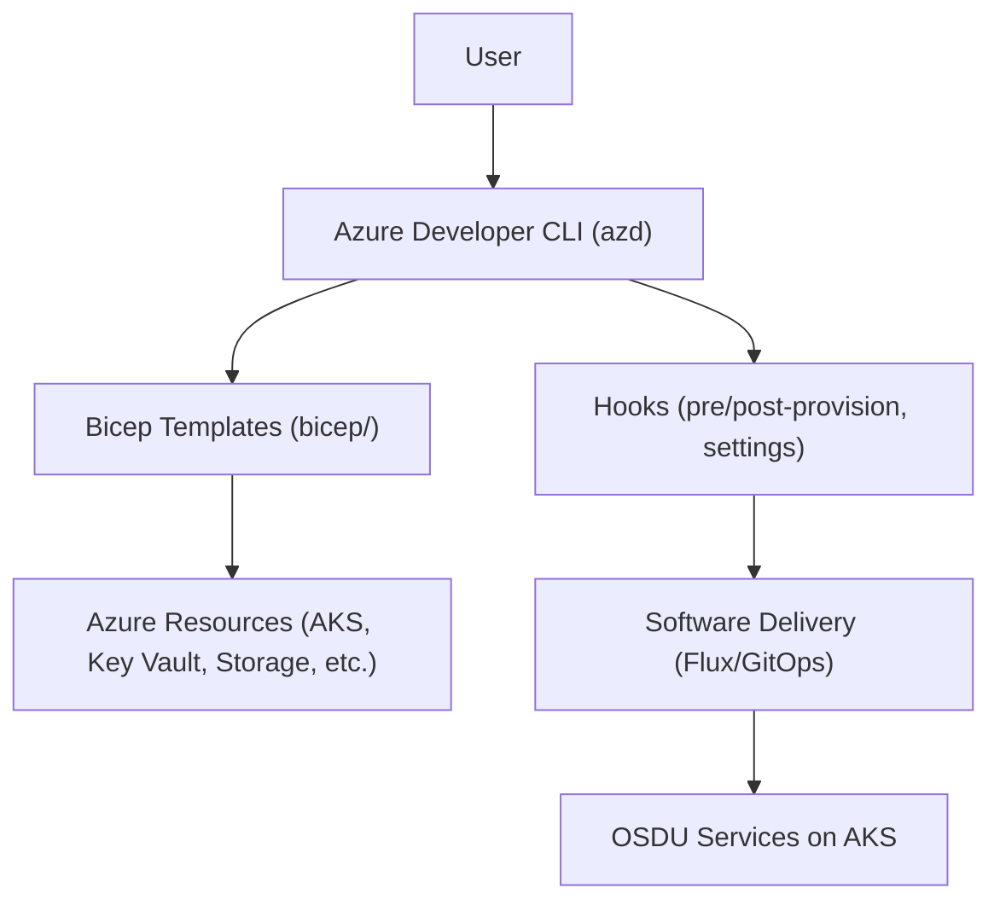
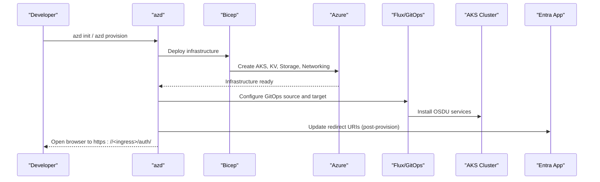
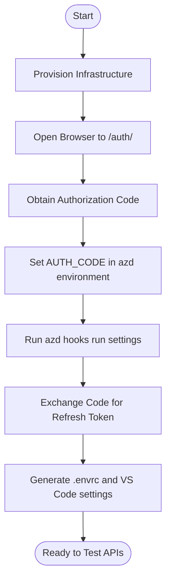
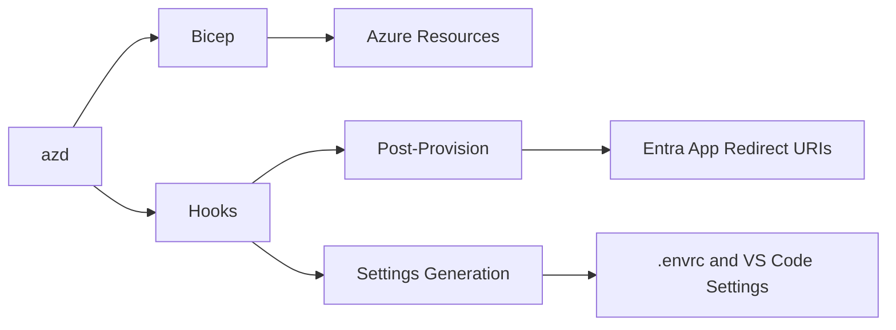

# Getting Started

<cite>
**Referenced Files in This Document**
- [README.md](file://README.md)
- [getting_started.md](file://docs/src/getting_started.md)
- [install_prerequisites.md](file://docs/src/install_prerequisites.md)
- [tutorial_cli.md](file://docs/src/tutorial_cli.md)
- [tutorial_arm.md](file://docs/src/tutorial_arm.md)
- [install_portal.md](file://docs/src/install_portal.md)
- [azure.yaml](file://azure.yaml)
- [pre-provision.ps1](file://scripts/pre-provision.ps1)
- [post-provision.ps1](file://scripts/post-provision.ps1)
- [settings.ps1](file://scripts/settings.ps1)
- [bicep/README.md](file://bicep/README.md)
- [parameters.json](file://parameters.json)
</cite>

## Table of Contents
1. [Introduction](#introduction)
2. [Project Structure](#project-structure)
3. [Core Components](#core-components)
4. [Architecture Overview](#architecture-overview)
5. [Detailed Component Analysis](#detailed-component-analysis)
6. [Dependency Analysis](#dependency-analysis)
7. [Performance Considerations](#performance-considerations)
8. [Troubleshooting Guide](#troubleshooting-guide)
9. [Conclusion](#conclusion)
10. [Appendices](#appendices)

## Introduction
This guide helps you deploy the OSDU Developer platform on Microsoft Azure quickly and reliably. OSDU is a subsurface data management platform that standardizes how geoscience and energy organizations store, share, and govern data. The developer edition simplifies deployment to Azure using Infrastructure as Code (Bicep), GitOps-based software delivery (Flux), and AKS-based services. You can deploy via:
- Command line with Azure Developer CLI (azd)
- Azure Portal using an ARM template

The quickstart covers prerequisites, environment setup, authentication configuration, and initial deployment steps for both methods.

**Section sources**
- [README.md:16-73](file://README.md#L16-L73)
- [getting_started.md:1-169](file://docs/src/getting_started.md#L1-L169)

## Project Structure
At a high level, this repository provides:
- Bicep infrastructure templates under bicep/
- Helm charts and Kustomize overlays under charts/ and software/
- Deployment orchestration via Azure Developer CLI hooks defined in azure.yaml
- Documentation and tutorials under docs/src/
- Scripts for pre/post provisioning and settings generation under scripts/

**Diagram sources**
- [azure.yaml:1-26](file://azure.yaml#L1-L26)
- [bicep/README.md:1-87](file://bicep/README.md#L1-L87)

**Section sources**
- [azure.yaml:1-26](file://azure.yaml#L1-L26)
- [bicep/README.md:1-87](file://bicep/README.md#L1-L87)

## Core Components
- Azure Developer CLI (azd): Orchestrates provisioning and post-deployment tasks via hooks.
- Bicep templates: Define Azure resources including AKS, storage, key vaults, networking, and monitoring.
- Flux/GitOps: Delivers and reconciles software components onto AKS after infrastructure is ready.
- Authentication: Uses Microsoft Entra ID app registration and redirect URIs configured during deployment.
- Settings automation: Generates local environment files and VS Code settings for API testing.

Key responsibilities:
- Pre-provision script validates tool versions, ensures login, creates or reuses an Entra app, and sets environment variables.
- Post-provision script waits for software compliance, updates Entra app redirect URIs, and opens the auth page.
- Settings script obtains refresh tokens, generates .envrc and service-specific env files, and configures VS Code REST Client.

**Section sources**
- [pre-provision.ps1:1-254](file://scripts/pre-provision.ps1#L1-L254)
- [post-provision.ps1:1-320](file://scripts/post-provision.ps1#L1-L320)
- [settings.ps1:1-524](file://scripts/settings.ps1#L1-L524)
- [azure.yaml:1-26](file://azure.yaml#L1-L26)

## Architecture Overview
The deployment flow uses azd to run Bicep for infrastructure, then Flux to deliver software to AKS. Authentication integrates with Microsoft Entra ID, and the portal exposes an ingress endpoint used for authorization flows.

**Diagram sources**
- [azure.yaml:1-26](file://azure.yaml#L1-L26)
- [post-provision.ps1:174-247](file://scripts/post-provision.ps1#L174-L247)
- [bicep/README.md:1-87](file://bicep/README.md#L1-L87)

## Detailed Component Analysis

### Prerequisites and Environment Setup
- Operating systems: macOS, Linux, Windows supported.
- Tools:
  - Visual Studio Code with REST Client extension
  - PowerShell Core
  - Azure CLI
  - Azure Developer CLI (azd)
- Subscription quotas: Ensure sufficient vCPU quota per region; Cosmos DB availability varies by region.
- Preview features: Register required Container Service preview features and refresh provider registration.
- Resource providers: Register all required resource providers listed in the getting started guide.
- Role assignments: Contributor, RBAC Administrator, Resource Policy Contributor.
- Microsoft Entra app registration: Required for authentication; collect client id, secret, and principal object id.

**Section sources**
- [install_prerequisites.md:1-58](file://docs/src/install_prerequisites.md#L1-L58)
- [getting_started.md:5-169](file://docs/src/getting_started.md#L5-L169)

### Quickstart: CLI Deployment (Recommended)
Steps:
1. Authenticate and set subscription:
   - Use Azure CLI to log in with Graph scope and set your subscription.
   - Log in with Azure Developer CLI.
2. Initialize and provision:
   - Initialize azd environment.
   - Run azd provision to deploy infrastructure and start software delivery.
3. Configure authentication:
   - After provisioning completes, retrieve an authorization code from the opened Identity Provider page.
   - Set AUTH_CODE and run azd hooks run settings to generate environment files and VS Code settings.
4. Verify deployment:
   - Clone core services repositories and load environment variables.
   - Run integration tests for services such as Partition and Entitlements.
5. Clean up:
   - Remove resources and environments using azd down and cleanup steps.

Notes:
- The process may take over an hour; sessions can time out but can be resumed.
- The pre-provision script checks Azure CLI version, installs required extensions, logs in if needed, creates or reuses an Entra app, and sets environment variables.
- The post-provision script waits for software compliance, updates Entra app redirect URIs, and opens the auth URL.

**Section sources**
- [README.md:37-65](file://README.md#L37-L65)
- [tutorial_cli.md:1-189](file://docs/src/tutorial_cli.md#L1-L189)
- [pre-provision.ps1:49-254](file://scripts/pre-provision.ps1#L49-L254)
- [post-provision.ps1:117-320](file://scripts/post-provision.ps1#L117-L320)
- [settings.ps1:72-220](file://scripts/settings.ps1#L72-L220)

### Quickstart: Portal Deployment (ARM Template)
Steps:
1. Create a Microsoft Entra application registration and note:
   - Application Client Id
   - Application Client Secret
   - Enterprise Application Object Id (Principal OID)
2. Deploy using the “Deploy to Azure” button and fill required parameters:
   - Email Address (admin user)
   - Application Client Id
   - Application Client Secret
   - Application Client Principal OID
3. Validate completion:
   - Check resource group deployments for success.
   - Check AKS GitOps status for software compliance.
4. Configure authentication:
   - Locate the ingress IP address under AKS services and ingresses.
   - Add redirect URI https://<ingress_ip>/auth/spa/ to the SPA platform in Entra app.
5. Retrieve token and test APIs:
   - Navigate to https://<ingress_ip>/auth/spa/, authorize, get tokens, and use them with service swagger pages.

**Section sources**
- [tutorial_arm.md:1-81](file://docs/src/tutorial_arm.md#L1-L81)
- [install_portal.md:1-82](file://docs/src/install_portal.md#L1-L82)

### Authentication Configuration Flow

**Diagram sources**
- [post-provision.ps1:174-247](file://scripts/post-provision.ps1#L174-L247)
- [settings.ps1:93-220](file://scripts/settings.ps1#L93-L220)

**Section sources**
- [settings.ps1:93-220](file://scripts/settings.ps1#L93-L220)
- [post-provision.ps1:174-247](file://scripts/post-provision.ps1#L174-L247)

## Dependency Analysis
- azd orchestrates Bicep deployment and runs hooks before and after provisioning.
- Bicep defines AKS, storage, key vaults, networking, and monitoring resources.
- Flux/GitOps delivers software to AKS after infrastructure is ready.
- Post-provision updates Entra app redirect URIs based on discovered ingress endpoints.
- Settings script depends on ingress IP, tenant id, client id, and client secret to generate local development configurations.

**Diagram sources**
- [azure.yaml:1-26](file://azure.yaml#L1-L26)
- [post-provision.ps1:174-247](file://scripts/post-provision.ps1#L174-L247)
- [settings.ps1:129-220](file://scripts/settings.ps1#L129-L220)

**Section sources**
- [azure.yaml:1-26](file://azure.yaml#L1-L26)
- [post-provision.ps1:174-247](file://scripts/post-provision.ps1#L174-L247)
- [settings.ps1:129-220](file://scripts/settings.ps1#L129-L220)

## Performance Considerations
- Ensure adequate vCPU quota per region; defaults may require increases.
- Choose regions with available Cosmos DB support.
- Monitor Flux compliance state during software installation; it can take significant time.
- Consider node pool sizing and VM families aligned with workload needs.

[No sources needed since this section provides general guidance]

## Troubleshooting Guide
Common issues and resolutions:
- Insufficient regional vCPU quota:
  - Request quota increase or switch to a region with available capacity.
  - Re-run provisioning after quota is approved.
- Session timeouts during long deployments:
  - Resume azd commands; they continue from where they left off.
- Missing or incorrect Entra app configuration:
  - Ensure redirect URIs are added for both web and SPA platforms.
  - Verify client id, secret, and principal object id are correct.
- Software not compliant:
  - Wait for Flux to reconcile; check AKS GitOps status.
  - Investigate pod states and logs if services fail to start.
- Local authentication disabled/enabled unexpectedly:
  - Scripts toggle local auth for App Configuration; verify current state if access fails.

Operational tips:
- Use az feature show to verify preview feature registration status.
- Confirm resource providers are registered.
- Validate ingress IP/DNS and add appropriate redirect URIs.

**Section sources**
- [AUTH_CODE_GUIDE.md:19-94](file://AUTH_CODE_GUIDE.md#L19-L94)
- [getting_started.md:70-98](file://docs/src/getting_started.md#L70-L98)
- [post-provision.ps1:117-172](file://scripts/post-provision.ps1#L117-L172)
- [post-provision.ps1:174-247](file://scripts/post-provision.ps1#L174-L247)

## Conclusion
You now have the essentials to deploy OSDU Developer on Azure using either the CLI or Portal method. Follow the prerequisites, configure authentication, and use the provided scripts to streamline setup. For ongoing work, leverage the generated environment files and VS Code settings to interact with OSDU services securely and efficiently.

[No sources needed since this section summarizes without analyzing specific files]

## Appendices

### Appendix A: Initial Commands Summary
- CLI quickstart:
  - Authenticate and set subscription
  - Initialize azd environment
  - Provision infrastructure
  - Set AUTH_CODE and run settings hook
  - Clean up with azd down when done
- Portal quickstart:
  - Create Entra app registration
  - Deploy via ARM template
  - Configure redirect URIs
  - Retrieve tokens and test APIs

**Section sources**
- [README.md:37-73](file://README.md#L37-L73)
- [tutorial_cli.md:104-189](file://docs/src/tutorial_cli.md#L104-L189)
- [tutorial_arm.md:21-81](file://docs/src/tutorial_arm.md#L21-L81)

### Appendix B: Parameters and Configuration
- Default parameter file includes placeholders for application client id.
- Feature flags and optional parameters can be adjusted via azd environment variables or ARM template parameters.

**Section sources**
- [parameters.json:1-9](file://parameters.json#L1-L9)