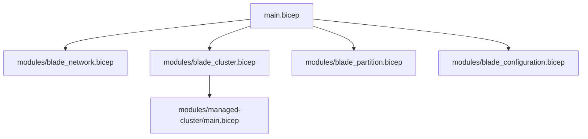
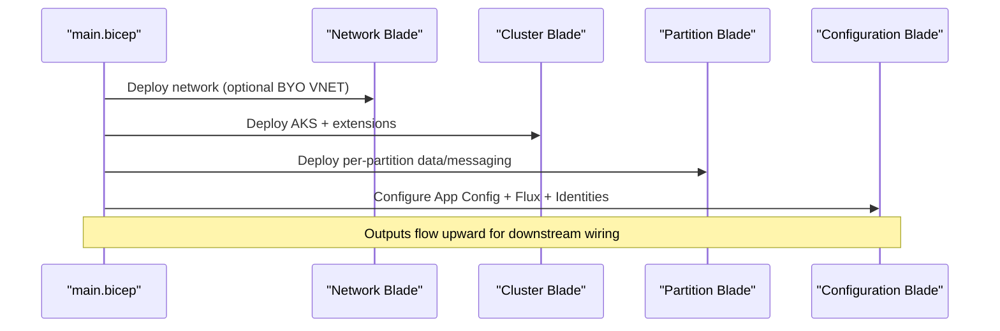
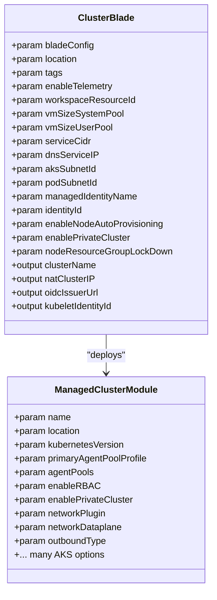
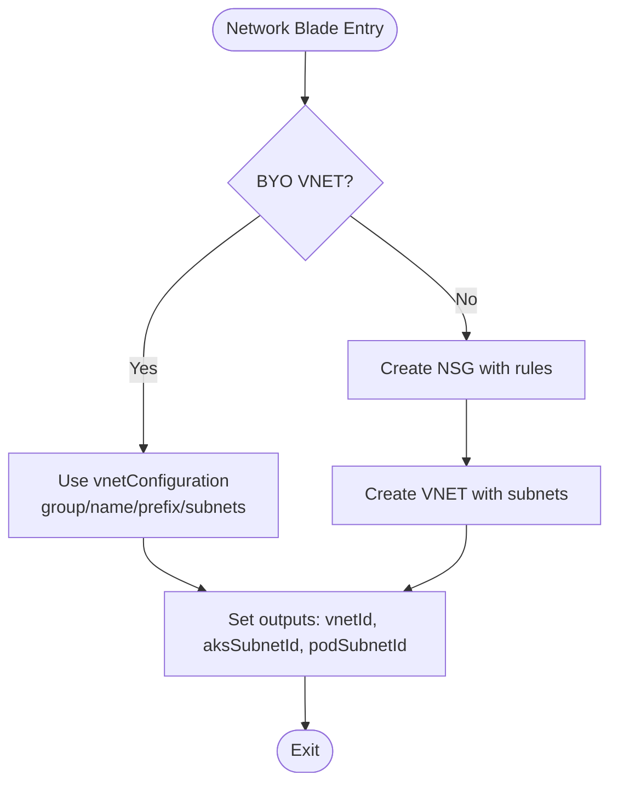
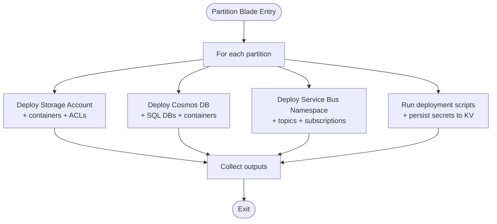
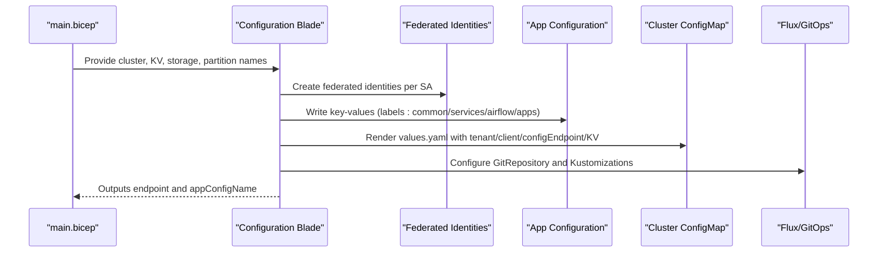
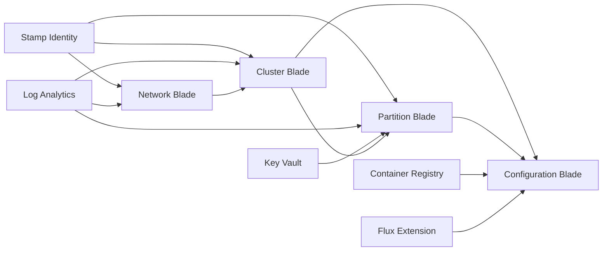

# Blade Modules Architecture

<cite>
**Referenced Files in This Document**
- [main.bicep](file://bicep/main.bicep)
- [blade_cluster.bicep](file://bicep/modules/blade_cluster.bicep)
- [blade_network.bicep](file://bicep/modules/blade_network.bicep)
- [blade_partition.bicep](file://bicep/modules/blade_partition.bicep)
- [blade_configuration.bicep](file://bicep/modules/blade_configuration.bicep)
- [managed-cluster/main.bicep](file://bicep/modules/managed-cluster/main.bicep)
</cite>

## Table of Contents
1. [Introduction](#introduction)
2. [Project Structure](#project-structure)
3. [Core Components](#core-components)
4. [Architecture Overview](#architecture-overview)
5. [Detailed Component Analysis](#detailed-component-analysis)
6. [Dependency Analysis](#dependency-analysis)
7. [Performance Considerations](#performance-considerations)
8. [Troubleshooting Guide](#troubleshooting-guide)
9. [Conclusion](#conclusion)
10. [Appendices](#appendices)

## Introduction
This document explains the blade module architecture used to organize Azure resources into logical functional groups for deploying an AKS-based platform. The design centers on four primary blades:
- Cluster management
- Networking
- Partitioning (data and messaging per partition)
- Configuration (App Configuration, Flux/GitOps, federated identities, and application wiring)

The blade interface pattern standardizes how each blade receives configuration, exposes outputs, and participates in dependency orchestration from a top-level deployment entry point. This approach improves modularity, reusability, and extensibility while keeping cross-cutting concerns like identity, diagnostics, and secrets centralized.

## Project Structure
At the root of the deployment is a main Bicep file that orchestrates the lifecycle and dependencies between blades and shared infrastructure. Each blade encapsulates a specific domain and exposes typed parameters and outputs.

**Diagram sources**
- [main.bicep:296-385](file://bicep/main.bicep#L296-L385)
- [main.bicep:984-1105](file://bicep/main.bicep#L984-L1105)
- [blade_cluster.bicep:103-265](file://bicep/modules/blade_cluster.bicep#L103-L265)
- [managed-cluster/main.bicep:1-200](file://bicep/modules/managed-cluster/main.bicep#L1-L200)

**Section sources**
- [main.bicep:296-385](file://bicep/main.bicep#L296-L385)
- [main.bicep:984-1105](file://bicep/main.bicep#L984-L1105)

## Core Components
- Blade interface pattern:
  - Every blade accepts a standardized bladeConfig object with sectionName and displayName.
  - Blades accept common cross-cutting parameters such as location, tags, enableTelemetry, and workspaceResourceId.
  - Blades expose outputs consumed by other blades or the root deployment.
- Parameter passing:
  - Root main.bicep composes blade configurations and wires outputs across modules using dependsOn and explicit parameter mapping.
- Dependency management:
  - Explicit dependsOn blocks ensure correct ordering (e.g., network before cluster; cluster before configuration).
- Reusability patterns:
  - Shared submodules (e.g., managed-cluster, storage-account, cosmos-db) are reused within blades to avoid duplication.
  - Arrays of partitions drive resource replication via Bicep loops.

**Section sources**
- [blade_cluster.bicep:5-58](file://bicep/modules/blade_cluster.bicep#L5-L58)
- [blade_network.bicep:5-31](file://bicep/modules/blade_network.bicep#L5-L31)
- [blade_partition.bicep:5-42](file://bicep/modules/blade_partition.bicep#L5-L42)
- [blade_configuration.bicep:5-107](file://bicep/modules/blade_configuration.bicep#L5-L107)
- [main.bicep:353-385](file://bicep/main.bicep#L353-L385)
- [main.bicep:984-1105](file://bicep/main.bicep#L984-L1105)

## Architecture Overview
The deployment follows a layered architecture:
- Infrastructure layer: networking, identity, logging, storage, key vault, container registry.
- Platform layer: AKS cluster, extensions, policies, NAT IP.
- Data layer: per-partition storage accounts, Cosmos DB, Service Bus namespaces.
- Configuration layer: App Configuration, GitOps (Flux), federated identities, Helm values, software source selection.

**Diagram sources**
- [main.bicep:296-385](file://bicep/main.bicep#L296-L385)
- [main.bicep:984-1105](file://bicep/main.bicep#L984-L1105)

## Detailed Component Analysis

### Cluster Management Blade
Responsibilities:
- Provision AKS cluster with secure defaults (RBAC, private cluster option, OIDC issuer, workload identity).
- Configure agent pools (system/user), autoscaling, maintenance windows, and addons.
- Attach policy, app config extension, and NAT public IP for outbound access.
- Expose outputs: cluster name, NAT IP, OIDC issuer URL, kubelet identity ID.

Key implementation highlights:
- Uses a reusable managed-cluster submodule with comprehensive AKS settings.
- Integrates diagnostics via workspaceResourceId.
- Applies role assignments for cluster admin and operator roles to the stamp identity.
- Supports pod subnet injection when provided.

**Diagram sources**
- [blade_cluster.bicep:5-58](file://bicep/modules/blade_cluster.bicep#L5-L58)
- [blade_cluster.bicep:103-265](file://bicep/modules/blade_cluster.bicep#L103-L265)
- [managed-cluster/main.bicep:1-200](file://bicep/modules/managed-cluster/main.bicep#L1-L200)

**Section sources**
- [blade_cluster.bicep:103-343](file://bicep/modules/blade_cluster.bicep#L103-L343)
- [main.bicep:353-385](file://bicep/main.bicep#L353-L385)

### Networking Blade
Responsibilities:
- Create or integrate with a virtual network and subnets for AKS nodes and optional pod subnet.
- Apply NSG rules and service endpoints for storage, Key Vault, and container registry.
- Assign network contributor roles to the stamp identity where needed.
- Output vnetId, aksSubnetId, podSubnetId, and consolidated networkConfiguration.

Key implementation highlights:
- Supports BYO VNET via vnetConfiguration; otherwise creates a new VNET with default address spaces.
- Conditionally applies NSGs only when not injecting an existing VNET.
- Provides consistent naming derived from bladeConfig.sectionName.

**Diagram sources**
- [blade_network.bicep:37-49](file://bicep/modules/blade_network.bicep#L37-L49)
- [blade_network.bicep:205-287](file://bicep/modules/blade_network.bicep#L205-L287)
- [blade_network.bicep:294-297](file://bicep/modules/blade_network.bicep#L294-L297)

**Section sources**
- [blade_network.bicep:5-31](file://bicep/modules/blade_network.bicep#L5-L31)
- [blade_network.bicep:205-297](file://bicep/modules/blade_network.bicep#L205-L297)
- [main.bicep:296-336](file://bicep/main.bicep#L296-L336)

### Partitioning Blade
Responsibilities:
- For each data partition, provision:
  - Storage account with containers and hierarchical namespace enabled.
  - Cosmos DB account with system and/or partition databases and containers.
  - Service Bus namespace with topics and subscriptions.
  - Deployment scripts to upload initial content and persist secrets to Key Vault.
  - Role assignments for stamp identity.
- Output arrays of storage and Service Bus names for later wiring.

Key implementation highlights:
- Loops over partitions to create isolated resource sets tagged with partition metadata.
- First partition can be marked as system partition to include system databases.
- Secrets export configuration persists storage and database credentials to Key Vault.

**Diagram sources**
- [blade_partition.bicep:475-547](file://bicep/modules/blade_partition.bicep#L475-L547)
- [blade_partition.bicep:550-618](file://bicep/modules/blade_partition.bicep#L550-L618)
- [blade_partition.bicep:651-711](file://bicep/modules/blade_partition.bicep#L651-L711)
- [blade_partition.bicep:715-742](file://bicep/modules/blade_partition.bicep#L715-L742)
- [blade_partition.bicep:773-774](file://bicep/modules/blade_partition.bicep#L773-L774)

**Section sources**
- [blade_partition.bicep:5-42](file://bicep/modules/blade_partition.bicep#L5-L42)
- [blade_partition.bicep:475-774](file://bicep/modules/blade_partition.bicep#L475-L774)
- [main.bicep:984-1016](file://bicep/main.bicep#L984-L1016)

### Configuration Blade
Responsibilities:
- Create federated identities for Kubernetes service accounts to authenticate to Azure.
- Populate App Configuration with environment-specific settings and labels.
- Generate and apply a ConfigMap for cluster-side configuration (including ingress toggles).
- Configure Flux/GitOps to sync components, applications, and experimental stacks from a repository or private blob source.
- Wire partition storage and Service Bus names into application configuration.

Key implementation highlights:
- Uses batched module instantiation for federated credentials.
- Merges multiple setting lists (common, services, airflow, OS DU apps) into App Configuration.
- Supports switching software source between Git repository and Azure Blob for private deployments.

**Diagram sources**
- [blade_configuration.bicep:141-206](file://bicep/modules/blade_configuration.bicep#L141-L206)
- [blade_configuration.bicep:212-387](file://bicep/modules/blade_configuration.bicep#L212-L387)
- [blade_configuration.bicep:396-465](file://bicep/modules/blade_configuration.bicep#L396-L465)
- [blade_configuration.bicep:470-564](file://bicep/modules/blade_configuration.bicep#L470-L564)
- [main.bicep:1033-1105](file://bicep/main.bicep#L1033-L1105)

**Section sources**
- [blade_configuration.bicep:5-107](file://bicep/modules/blade_configuration.bicep#L5-L107)
- [blade_configuration.bicep:141-564](file://bicep/modules/blade_configuration.bicep#L141-L564)
- [main.bicep:1033-1105](file://bicep/main.bicep#L1033-L1105)

## Dependency Analysis
Top-level orchestration ensures correct sequencing:
- Network Blade depends on identity and log analytics; optionally conditional on VNET injection flags.
- Cluster Blade depends on identity and log analytics; consumes network outputs if BYO VNET.
- Partition Blade depends on identity, log analytics, Key Vault, and optionally network; uses cluster NAT IP for network ACLs.
- Configuration Blade depends on cluster, partition, registry, and flux extension; consumes outputs from all prior layers.

**Diagram sources**
- [main.bicep:296-385](file://bicep/main.bicep#L296-L385)
- [main.bicep:984-1105](file://bicep/main.bicep#L984-L1105)

**Section sources**
- [main.bicep:296-385](file://bicep/main.bicep#L296-L385)
- [main.bicep:984-1105](file://bicep/main.bicep#L984-L1105)

## Performance Considerations
- Conditional deployments: Network Blade is conditionally deployed based on VNET injection flags to avoid unnecessary resources.
- Batched operations: Federated identities are created with batchSize(1) to control concurrency and reduce contention.
- Resource reuse: Submodules (managed-cluster, storage-account, cosmos-db) centralize best practices and reduce duplication.
- Outbound routing: NAT IP usage and load balancer vs NAT Gateway choices impact egress performance and cost.
- Autoscaling: Node auto-provisioning and agent pool scaling settings affect responsiveness under load.

[No sources needed since this section provides general guidance]

## Troubleshooting Guide
Common issues and mitigations:
- Network connectivity failures:
  - Ensure NAT IP from cluster blade is allowed in storage/network ACLs.
  - Verify service endpoints and NSG rules for required Azure services.
- Private cluster access:
  - Confirm Key Vault and storage networkAcls allow cluster NAT IP.
  - Validate that private DNS zones and A records are configured if required.
- Flux/GitOps sync errors:
  - Check repository URL, branch/tag, and authentication via federated identities.
  - Validate ConfigMap values and App Configuration endpoints.
- Permission errors:
  - Confirm stamp identity has Contributor/Data Owner roles where needed.
  - Ensure role assignments for AKS extensions and operators are present.

**Section sources**
- [blade_partition.bicep:523-531](file://bicep/modules/blade_partition.bicep#L523-L531)
- [blade_partition.bicep:571-578](file://bicep/modules/blade_partition.bicep#L571-L578)
- [blade_configuration.bicep:494-564](file://bicep/modules/blade_configuration.bicep#L494-L564)
- [main.bicep:984-1105](file://bicep/main.bicep#L984-L1105)

## Conclusion
The blade architecture cleanly separates concerns across networking, cluster, partitioning, and configuration. By standardizing the blade interface, explicitly managing dependencies, and leveraging reusable submodules, the deployment remains modular, testable, and extensible. Teams can add new blades or customize existing ones without disrupting the overall pipeline.

[No sources needed since this section summarizes without analyzing specific files]

## Appendices

### Creating a New Blade
Steps to introduce a new blade:
- Define a bladeSettings type with sectionName and displayName at the bottom of your blade file.
- Accept common parameters: location, tags, enableTelemetry, workspaceResourceId.
- Implement domain-specific logic and expose clear outputs.
- In main.bicep:
  - Add a module block referencing your blade.
  - Pass bladeConfig and necessary inputs from upstream blades.
  - Declare dependsOn to enforce ordering.
  - Map outputs to downstream consumers.

Example references:
- Blade interface pattern and types:
  - [blade_cluster.bicep:349-355](file://bicep/modules/blade_cluster.bicep#L349-L355)
  - [blade_network.bicep:304-332](file://bicep/modules/blade_network.bicep#L304-L332)
  - [blade_partition.bicep:781-787](file://bicep/modules/blade_partition.bicep#L781-L787)
  - [blade_configuration.bicep:582-599](file://bicep/modules/blade_configuration.bicep#L582-L599)
- Wiring in main.bicep:
  - [main.bicep:296-385](file://bicep/main.bicep#L296-L385)
  - [main.bicep:984-1105](file://bicep/main.bicep#L984-L1105)

### Extending Existing Blades
- Cluster Blade:
  - Adjust agent pools, addons, or security profiles via parameters.
  - Reference: [blade_cluster.bicep:103-265](file://bicep/modules/blade_cluster.bicep#L103-L265)
- Network Blade:
  - Add NSG rules or service endpoints; toggle pod subnet creation.
  - Reference: [blade_network.bicep:52-156](file://bicep/modules/blade_network.bicep#L52-L156)
- Partition Blade:
  - Add new topics/subscriptions or database containers; adjust throughput and backup policies.
  - Reference: [blade_partition.bicep:280-439](file://bicep/modules/blade_partition.bicep#L280-L439)
  - Reference: [blade_partition.bicep:105-279](file://bicep/modules/blade_partition.bicep#L105-L279)
- Configuration Blade:
  - Add new key-values to App Configuration; update Flux paths or branches/tags.
  - Reference: [blade_configuration.bicep:212-387](file://bicep/modules/blade_configuration.bicep#L212-L387)
  - Reference: [blade_configuration.bicep:470-564](file://bicep/modules/blade_configuration.bicep#L470-L564)

### Integrating Into the Deployment Pipeline
- Update main.bicep to include your blade module with appropriate bladeConfig and dependencies.
- Ensure outputs are consumed by downstream blades or exported at the root level.
- Validate with tests or dry runs before production deployments.

References:
- [main.bicep:296-385](file://bicep/main.bicep#L296-L385)
- [main.bicep:984-1105](file://bicep/main.bicep#L984-L1105)