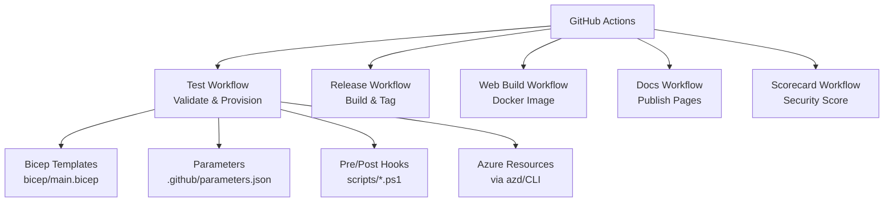
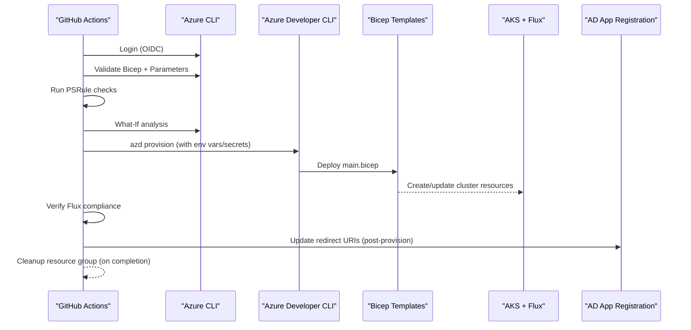
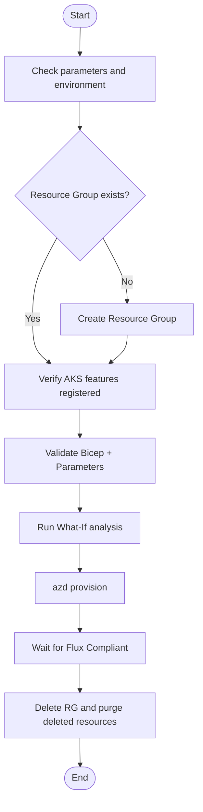
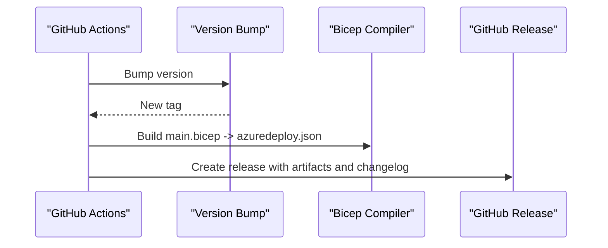
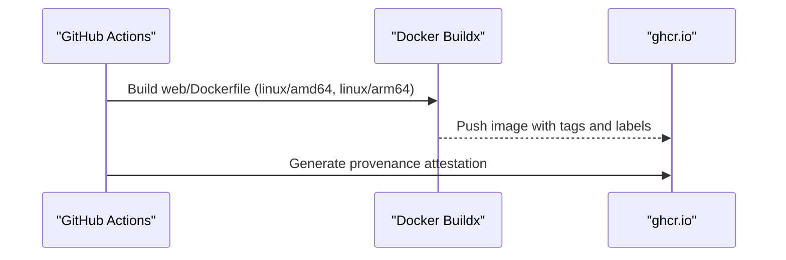
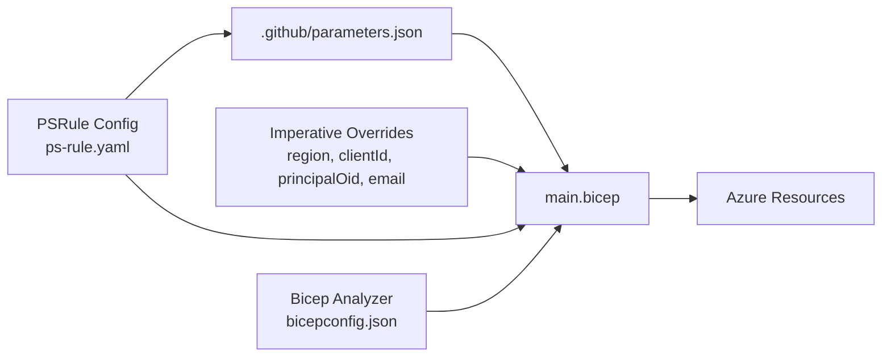
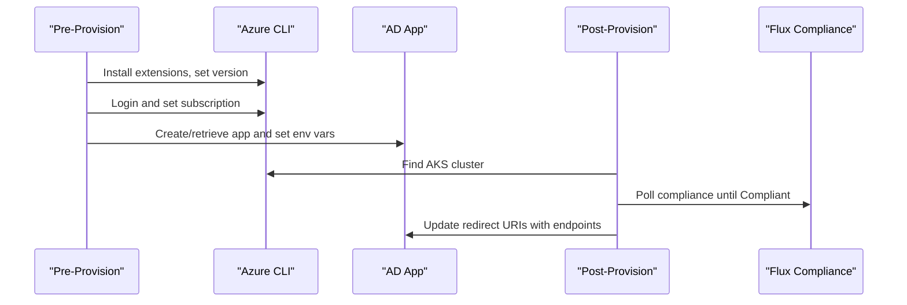
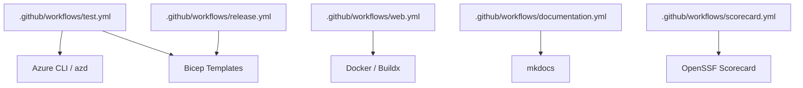

# CI/CD Pipelines and Automation

<cite>
**Referenced Files in This Document**
- [test.yml](file://.github/workflows/test.yml)
- [release.yml](file://.github/workflows/release.yml)
- [web.yml](file://.github/workflows/web.yml)
- [documentation.yml](file://.github/workflows/documentation.yml)
- [scorecard.yml](file://.github/workflows/scorecard.yml)
- [main.bicep](file://bicep/main.bicep)
- [parameters.json](file://parameters.json)
- [.github/parameters.json](file://.github/parameters.json)
- [azure.yaml](file://azure.yaml)
- [pre-provision.ps1](file://scripts/pre-provision.ps1)
- [post-provision.ps1](file://scripts/post-provision.ps1)
- [ps-rule.yaml](file://ps-rule.yaml)
- [bicepconfig.json](file://bicepconfig.json)
</cite>

## Table of Contents
1. Introduction
2. Project Structure
3. Core Components
4. Architecture Overview
5. Detailed Component Analysis
6. Dependency Analysis
7. Performance Considerations
8. Troubleshooting Guide
9. Conclusion

## Introduction
This document explains the CI/CD automation for the OSDU platform using GitHub Actions, Azure CLI, Bicep, and Azure Developer CLI (azd). It covers automated testing strategies, build processes, deployment pipelines across environments, Bicep template validation, parameter management, infrastructure provisioning, secrets handling, rollback guidance, monitoring, debugging, and performance optimization.

## Project Structure
The repository organizes CI/CD around:
- GitHub Actions workflows under .github/workflows for testing, release packaging, web image builds, documentation publishing, and supply-chain security scoring.
- Infrastructure as Code (IaC) with Bicep templates under bicep, including a main entrypoint and modules.
- Parameter files for deployments and environment-specific overrides.
- Pre- and post-provisioning scripts to prepare and finalize Azure resources and application configuration.
- Policy and analysis configurations for compliance and code quality.

**Diagram sources**
- [test.yml:1-496](file://.github/workflows/test.yml#L1-L496)
- [release.yml:1-82](file://.github/workflows/release.yml#L1-L82)
- [web.yml:1-62](file://.github/workflows/web.yml#L1-L62)
- [documentation.yml:1-62](file://.github/workflows/documentation.yml#L1-L62)
- [scorecard.yml:1-74](file://.github/workflows/scorecard.yml#L1-L74)
- [main.bicep:1-200](file://bicep/main.bicep#L1-L200)
- [.github/parameters.json:1-9](file://.github/parameters.json#L1-L9)
- [pre-provision.ps1:1-254](file://scripts/pre-provision.ps1#L1-L254)
- [post-provision.ps1:1-320](file://scripts/post-provision.ps1#L1-L320)

**Section sources**
- [test.yml:1-496](file://.github/workflows/test.yml#L1-L496)
- [release.yml:1-82](file://.github/workflows/release.yml#L1-L82)
- [web.yml:1-62](file://.github/workflows/web.yml#L1-L62)
- [documentation.yml:1-62](file://.github/workflows/documentation.yml#L1-L62)
- [scorecard.yml:1-74](file://.github/workflows/scorecard.yml#L1-L74)
- [main.bicep:1-200](file://bicep/main.bicep#L1-L200)
- [.github/parameters.json:1-9](file://.github/parameters.json#L1-L9)
- [pre-provision.ps1:1-254](file://scripts/pre-provision.ps1#L1-L254)
- [post-provision.ps1:1-320](file://scripts/post-provision.ps1#L1-L320)

## Core Components
- Test workflow: Validates parameters, runs PSRule checks, performs ARM What-If, provisions via azd, verifies Flux compliance, and cleans up resources.
- Release workflow: Bumps version, compiles Bicep to ARM JSON, commits artifacts, generates changelog, and creates a GitHub release.
- Web workflow: Builds and pushes multi-arch Docker images with provenance attestation.
- Documentation workflow: Spell-checks docs and publishes to GitHub Pages.
- Scorecard workflow: Runs OpenSSF supply-chain security analysis on schedule and branch events.
- IaC: Bicep main template defines core resources; parameters are supplied via parameter files and imperative overrides.
- Hooks: Pre-provision prepares Azure CLI, extensions, and AD app; post-provision waits for software installation and updates app registration endpoints.

**Section sources**
- [test.yml:1-496](file://.github/workflows/test.yml#L1-L496)
- [release.yml:1-82](file://.github/workflows/release.yml#L1-L82)
- [web.yml:1-62](file://.github/workflows/web.yml#L1-L62)
- [documentation.yml:1-62](file://.github/workflows/documentation.yml#L1-L62)
- [scorecard.yml:1-74](file://.github/workflows/scorecard.yml#L1-L74)
- [main.bicep:1-200](file://bicep/main.bicep#L1-L200)
- [pre-provision.ps1:1-254](file://scripts/pre-provision.ps1#L1-L254)
- [post-provision.ps1:1-320](file://scripts/post-provision.ps1#L1-L320)

## Architecture Overview
The end-to-end flow integrates GitHub Actions with Azure services:
- On push or PR to main, the test workflow validates and optionally provisions infrastructure.
- The release workflow packages compiled ARM templates and tags releases.
- The web workflow produces container images for the web component.
- Post-provision hooks update application registrations and ensure software is compliant before exposing endpoints.

**Diagram sources**
- [test.yml:1-496](file://.github/workflows/test.yml#L1-L496)
- [main.bicep:1-200](file://bicep/main.bicep#L1-L200)
- [post-provision.ps1:174-247](file://scripts/post-provision.ps1#L174-L247)

## Detailed Component Analysis

### Test Workflow: Validation, Provisioning, Verification, Cleanup
- Triggers: push/PR to main for infra changes, scheduled weekly run, manual dispatch with inputs for region, resource group, standards check, debug steps, and verify steps.
- Standards job: Runs PSRule against parameter files to assess Well-Architected alignment.
- Validate job:
  - Checks parameter file existence and content.
  - Augments parameters from event inputs.
  - Ensures resource group exists.
  - Verifies no active deployments and required AKS features are registered.
  - Performs ARM deployment validation and What-If analysis.
- Provision job: Uses azd with federated credentials to provision infrastructure; reads environment config from secrets.
- Verify job: Waits for Flux configuration to reach Compliant state with timeouts and retries.
- Cleanup job: Deletes resource group and purges deleted Key Vault and App Configuration instances.

**Diagram sources**
- [test.yml:104-357](file://.github/workflows/test.yml#L104-L357)
- [test.yml:360-496](file://.github/workflows/test.yml#L360-L496)

**Section sources**
- [test.yml:1-496](file://.github/workflows/test.yml#L1-L496)

### Release Workflow: Versioning, Bicep Build, Changelog, Release Artifacts
- Bumps version and writes version metadata.
- Installs Bicep and compiles main.bicep to azuredeploy.json.
- Commits generated artifacts and creates a GitHub release with changelog.

**Diagram sources**
- [release.yml:1-82](file://.github/workflows/release.yml#L1-L82)

**Section sources**
- [release.yml:1-82](file://.github/workflows/release.yml#L1-L82)

### Web Workflow: Multi-Arch Image Build and Attestation
- Builds and pushes a multi-architecture Docker image to GitHub Container Registry.
- Generates artifact attestation for supply chain transparency.

**Diagram sources**
- [web.yml:1-62](file://.github/workflows/web.yml#L1-L62)

**Section sources**
- [web.yml:1-62](file://.github/workflows/web.yml#L1-L62)

### Documentation Workflow: Spell Check and Pages Deployment
- Runs spell checking on markdown files.
- Deploys documentation site to GitHub Pages on pushes to main or manual dispatch.

**Section sources**
- [documentation.yml:1-62](file://.github/workflows/documentation.yml#L1-L62)

### Supply Chain Security: OpenSSF Scorecard
- Runs on schedule and branch protection events.
- Publishes results and uploads SARIF to code scanning dashboard.

**Section sources**
- [scorecard.yml:1-74](file://.github/workflows/scorecard.yml#L1-L74)

### Bicep Template and Parameter Management
- Main template defines core resources and accepts parameters such as location, email, application client ID, ingress type, and optional software/configuration overrides.
- Parameter files provide base values; imperative overrides inject runtime values like region and application identity details.
- PSRule and Bicep analyzer rules enforce best practices and project-specific constraints.

**Diagram sources**
- [main.bicep:1-200](file://bicep/main.bicep#L1-L200)
- [.github/parameters.json:1-9](file://.github/parameters.json#L1-L9)
- [ps-rule.yaml:1-57](file://ps-rule.yaml#L1-L57)
- [bicepconfig.json:1-35](file://bicepconfig.json#L1-L35)

**Section sources**
- [main.bicep:1-200](file://bicep/main.bicep#L1-L200)
- [parameters.json:1-9](file://parameters.json#L1-L9)
- [.github/parameters.json:1-9](file://.github/parameters.json#L1-L9)
- [ps-rule.yaml:1-57](file://ps-rule.yaml#L1-L57)
- [bicepconfig.json:1-35](file://bicepconfig.json#L1-L35)

### Pre- and Post-Provisioning Scripts
- Pre-provision:
  - Enforces Azure CLI version and installs required extensions.
  - Authenticates and ensures subscription context.
  - Creates or retrieves an AD application and sets environment variables for subsequent steps.
  - Adjusts local authentication settings for App Configuration when needed.
- Post-provision:
  - Logs into Azure and locates the AKS cluster.
  - Waits for Flux to report Compliant status.
  - Updates AD application redirect URIs based on discovered public/private endpoints.
  - Optionally opens the external endpoint URL locally.

**Diagram sources**
- [pre-provision.ps1:49-218](file://scripts/pre-provision.ps1#L49-L218)
- [post-provision.ps1:78-247](file://scripts/post-provision.ps1#L78-L247)

**Section sources**
- [pre-provision.ps1:1-254](file://scripts/pre-provision.ps1#L1-L254)
- [post-provision.ps1:1-320](file://scripts/post-provision.ps1#L1-L320)

### Environment-Specific Pipelines and Customization
- Development/Staging/Production differentiation:
  - Use GitHub Environments to gate deployments and scope secrets per environment.
  - Configure AZURE_ENV_NAME and AZURE_LOCATION via environment variables or secrets to target regions and environments.
  - Adjust parameter files and imperative overrides to tailor deployments per environment.
- Manual controls:
  - workflow_dispatch inputs allow selecting resource group, region, enabling standards checks, debug steps, and verification steps.

**Section sources**
- [test.yml:18-66](file://.github/workflows/test.yml#L18-L66)
- [test.yml:69-76](file://.github/workflows/test.yml#L69-L76)
- [test.yml:317-357](file://.github/workflows/test.yml#L317-L357)

### Secrets Management
- Required GitHub Variables:
  - AZURE_TENANT_ID, AZURE_SUBSCRIPTION_ID, AZURE_CLIENT_ID, AZURE_PRINCIPAL_ID, AZURE_ENV_NAME, AZURE_LOCATION.
- Required GitHub Secrets:
  - EMAIL_ADDRESS, AZD_INITIAL_ENVIRONMENT_CONFIG.
- OIDC-based login avoids long-lived service principals by using id-token write permissions.

**Section sources**
- [test.yml:1-16](file://.github/workflows/test.yml#L1-L16)
- [test.yml:69-76](file://.github/workflows/test.yml#L69-L76)
- [test.yml:333-357](file://.github/workflows/test.yml#L333-L357)

### Rollback Strategies
- Infrastructure rollbacks:
  - Use Azure deployment names created during What-If/validation to delete or redeploy previous versions.
  - Leverage az deployment group delete to remove failed deployments and re-run with corrected parameters.
- Application rollbacks:
  - Revert Helm/Kustomize manifests or GitOps repositories managed by Flux to prior commits.
  - Use Flux rollback commands or revert Git references to restore previous application states.
- Image rollbacks:
  - Pin container images to specific digests/tags in manifests to revert to known-good versions.

[No sources needed since this section provides general guidance]

### Monitoring Pipeline Execution
- GitHub Actions:
  - Inspect workflow runs, jobs, and steps logs for failures.
  - Use concurrency groups to manage parallel runs and avoid conflicts.
- Azure:
  - Review deployment history and provisioning states via Azure CLI.
  - Monitor Flux compliance status and cluster resources.
- Supply Chain:
  - Review Scorecard results and SARIF outputs for security posture.

**Section sources**
- [test.yml:67-67](file://.github/workflows/test.yml#L67-L67)
- [test.yml:205-220](file://.github/workflows/test.yml#L205-L220)
- [test.yml:386-438](file://.github/workflows/test.yml#L386-L438)
- [scorecard.yml:33-74](file://.github/workflows/scorecard.yml#L33-L74)

### Debugging Failed Deployments
- Enable debug steps via workflow_dispatch to print parameter paths, deployment names, and environment variables.
- Validate parameter files and inspect What-If output for change previews.
- Check feature registration status for AKS-related capabilities.
- Review pre/post-provision logs for AD app creation and endpoint updates.

**Section sources**
- [test.yml:115-127](file://.github/workflows/test.yml#L115-L127)
- [test.yml:222-249](file://.github/workflows/test.yml#L222-L249)
- [test.yml:277-315](file://.github/workflows/test.yml#L277-L315)
- [pre-provision.ps1:146-218](file://scripts/pre-provision.ps1#L146-L218)
- [post-provision.ps1:174-247](file://scripts/post-provision.ps1#L174-L247)

### Optimizing Build Performance
- Cache dependencies:
  - Cache PowerShell modules and Azure CLI extensions where possible.
- Parallelism:
  - Split independent tasks into parallel jobs (e.g., standards vs. validate/provision).
- Incremental builds:
  - Use Docker layers effectively and pin tool versions to reduce rebuild times.
- Avoid unnecessary runs:
  - Use path filters to trigger workflows only on relevant changes.
- Reduce What-If overhead:
  - Limit What-If to critical branches or use it selectively via inputs.

[No sources needed since this section provides general guidance]

## Dependency Analysis
Workflows depend on:
- GitHub Actions runner environment and permissions (id-token, contents, pages).
- Azure CLI and azd for provisioning and management.
- Bicep compiler for building templates.
- External tools: PSRule, Docker, mkdocs, OpenSSF Scorecard.

**Diagram sources**
- [test.yml:1-496](file://.github/workflows/test.yml#L1-L496)
- [release.yml:1-82](file://.github/workflows/release.yml#L1-L82)
- [web.yml:1-62](file://.github/workflows/web.yml#L1-L62)
- [documentation.yml:1-62](file://.github/workflows/documentation.yml#L1-L62)
- [scorecard.yml:1-74](file://.github/workflows/scorecard.yml#L1-L74)

**Section sources**
- [test.yml:1-496](file://.github/workflows/test.yml#L1-L496)
- [release.yml:1-82](file://.github/workflows/release.yml#L1-L82)
- [web.yml:1-62](file://.github/workflows/web.yml#L1-L62)
- [documentation.yml:1-62](file://.github/workflows/documentation.yml#L1-L62)
- [scorecard.yml:1-74](file://.github/workflows/scorecard.yml#L1-L74)

## Performance Considerations
- Concurrency control:
  - Use concurrency groups to prevent overlapping runs on the same branch.
- Selective triggers:
  - Restrict workflow triggers to relevant paths to minimize unnecessary executions.
- Efficient validation:
  - Run What-If only when necessary; rely on static validation for fast feedback.
- Resource cleanup:
  - Ensure cleanup jobs always run to free resources and reduce costs.

[No sources needed since this section provides general guidance]

## Troubleshooting Guide
Common issues and resolutions:
- Authentication failures:
  - Ensure OIDC permissions (id-token: write) and correct tenant/subscription variables are set.
- Feature registration delays:
  - Wait for AKS features to register; check feature list and retry after delay.
- Flux not compliant:
  - Increase wait time or investigate Flux configuration errors; review logs in AKS.
- Parameter validation errors:
  - Inspect parameter files and imperative overrides; use What-If output to identify mismatches.
- Cleanup failures:
  - Manually delete resource groups and purge deleted Key Vault/App Configuration if needed.

**Section sources**
- [test.yml:222-249](file://.github/workflows/test.yml#L222-L249)
- [test.yml:386-438](file://.github/workflows/test.yml#L386-L438)
- [test.yml:459-496](file://.github/workflows/test.yml#L459-L496)

## Conclusion
The OSDU CI/CD pipeline leverages GitHub Actions, Bicep, and Azure tooling to automate validation, provisioning, and verification of infrastructure and applications. With robust pre/post hooks, policy enforcement, and comprehensive workflows for releases, web builds, documentation, and security scoring, the system supports continuous integration and deployment across environments. Following the guidance here will help you customize pipelines, manage secrets safely, implement rollbacks, monitor execution, debug issues, and optimize performance.