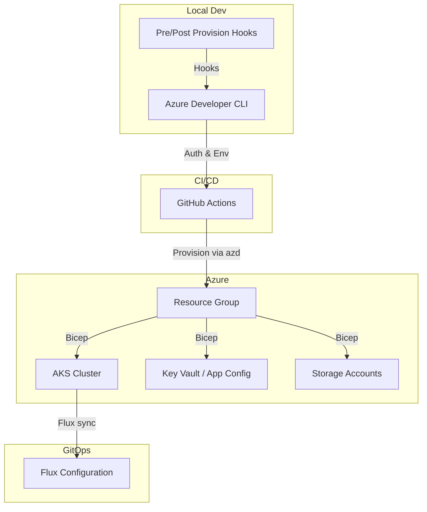
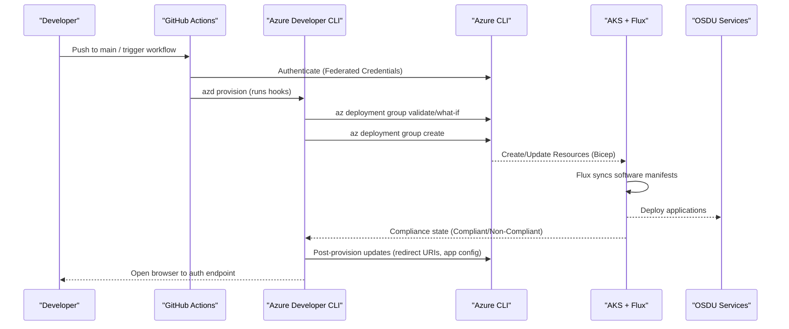
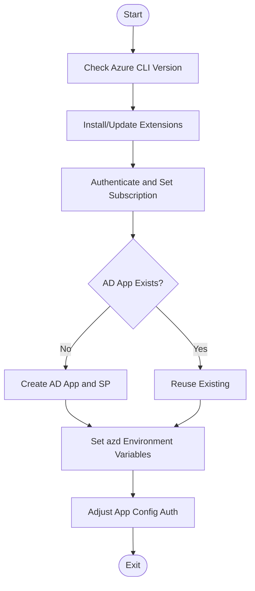
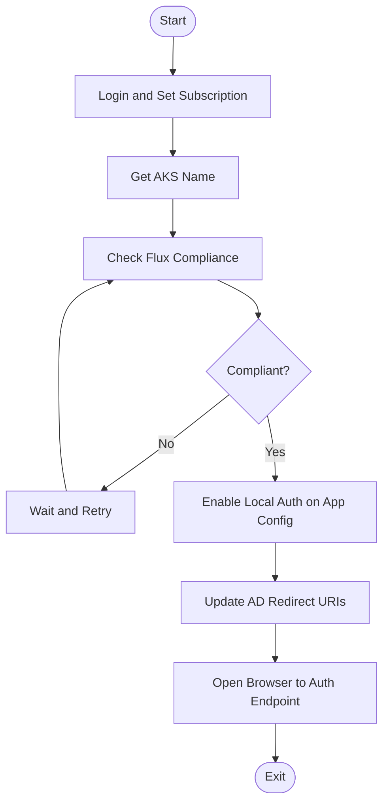
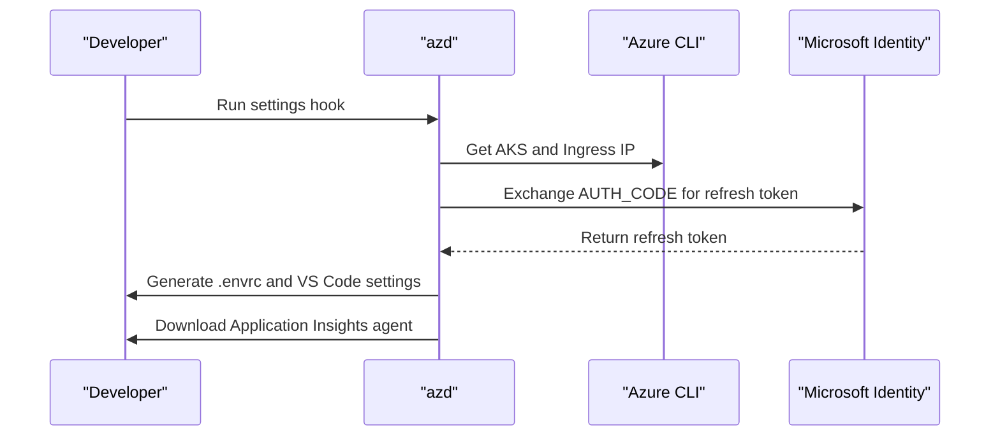
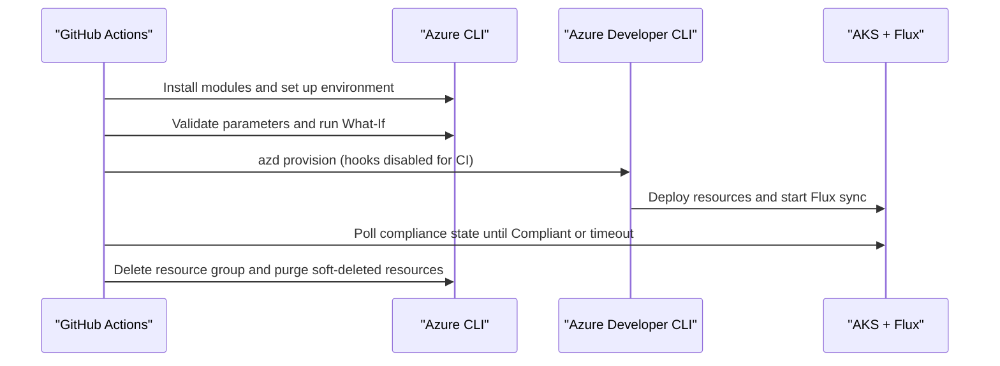
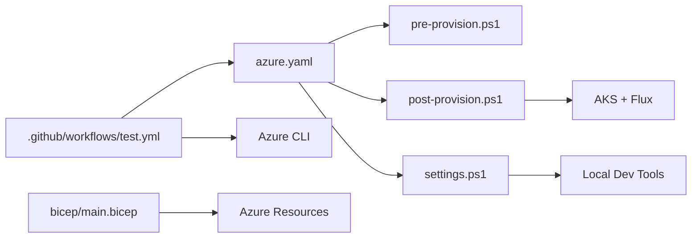

# Deployment Strategies and Automation

<cite>
**Referenced Files in This Document**
- [azure.yaml](file://azure.yaml)
- [pre-provision.ps1](file://scripts/pre-provision.ps1)
- [post-provision.ps1](file://scripts/post-provision.ps1)
- [settings.ps1](file://scripts/settings.ps1)
- [test.yml](file://.github/workflows/test.yml)
- [release.yml](file://.github/workflows/release.yml)
- [main.bicep](file://bicep/main.bicep)
- [blob_upload.sh](file://bicep/modules/deploy-scripts/blob_upload.sh)
- [software-upload.sh](file://bicep/modules/deploy-scripts/software-upload.sh)
- [monitor-flux.sh](file://monitor-flux.sh)
- [fix-compliance.sh](file://fix-compliance.sh)
</cite>

## Table of Contents
1. [Introduction](#introduction)
2. [Project Structure](#project-structure)
3. [Core Components](#core-components)
4. [Architecture Overview](#architecture-overview)
5. [Detailed Component Analysis](#detailed-component-analysis)
6. [Dependency Analysis](#dependency-analysis)
7. [Performance Considerations](#performance-considerations)
8. [Troubleshooting Guide](#troubleshooting-guide)
9. [Conclusion](#conclusion)
10. [Appendices](#appendices)

## Introduction
This document explains the deployment strategies and automation scripts that provision and manage the OSDU Developer infrastructure on Azure. It covers pre-provisioning and post-provisioning workflows, Azure CLI integration, GitHub Actions CI/CD pipelines, validation and monitoring, error handling, rollback procedures, local development setup with Azure Developer CLI (azd), and performance optimization techniques for large-scale deployments.

## Project Structure
The repository organizes deployment assets into clear layers:
- Infrastructure as Code (IaC): Bicep templates under bicep/
- Application manifests and Helm charts under charts/
- Scripts for provisioning hooks and utilities under scripts/
- CI/CD workflows under .github/workflows/
- Monitoring and compliance helpers at the repository root

**Diagram sources**
- [azure.yaml:8-25](file://azure.yaml#L8-L25)
- [test.yml:317-357](file://.github/workflows/test.yml#L317-L357)
- [main.bicep:1-200](file://bicep/main.bicep#L1-L200)

**Section sources**
- [azure.yaml:1-26](file://azure.yaml#L1-L26)
- [main.bicep:1-200](file://bicep/main.bicep#L1-L200)

## Core Components
- Pre-provision hook: Validates Azure CLI version, ensures required extensions, authenticates, creates or reuses an AD application, sets environment variables, and configures App Configuration authentication.
- Post-provision hook: Waits for Flux software installation to be compliant, secures App Configuration by enabling local auth, discovers ingress endpoints, updates AD application redirect URIs, and opens the web UI.
- Settings hook: Retrieves ingress IP, obtains a refresh token using an authorization code, generates environment files and VS Code settings for local development.
- CI/CD pipeline: Validates IaC, performs What-If analysis, provisions infrastructure with azd, verifies Flux compliance, and cleans up resources.
- Bicep template: Defines core resources including managed identity, logging, storage, and cluster configuration; integrates with Flux-based GitOps for software delivery.
- Utility scripts: Blob upload and software packaging helpers used during provisioning; monitoring and compliance fix scripts for operational support.

**Section sources**
- [pre-provision.ps1:49-254](file://scripts/pre-provision.ps1#L49-L254)
- [post-provision.ps1:42-320](file://scripts/post-provision.ps1#L42-L320)
- [settings.ps1:72-524](file://scripts/settings.ps1#L72-L524)
- [test.yml:104-496](file://.github/workflows/test.yml#L104-L496)
- [main.bicep:1-200](file://bicep/main.bicep#L1-L200)
- [blob_upload.sh:1-12](file://bicep/modules/deploy-scripts/blob_upload.sh#L1-L12)
- [software-upload.sh:1-46](file://bicep/modules/deploy-scripts/software-upload.sh#L1-L46)
- [monitor-flux.sh:1-52](file://monitor-flux.sh#L1-L52)
- [fix-compliance.sh:1-69](file://fix-compliance.sh#L1-L69)

## Architecture Overview
End-to-end flow from code changes to running services:

**Diagram sources**
- [test.yml:169-357](file://.github/workflows/test.yml#L169-L357)
- [post-provision.ps1:174-247](file://scripts/post-provision.ps1#L174-L247)
- [main.bicep:1-200](file://bicep/main.bicep#L1-L200)

## Detailed Component Analysis

### Pre-Provision Workflow
Purpose: Prepare the Azure environment before infrastructure provisioning.
- Ensures Azure CLI meets minimum version requirements.
- Installs or updates required extensions (e.g., k8s-configuration).
- Authenticates user and sets subscription context.
- Creates or reuses an AD application and service principal; stores identifiers in azd environment.
- Sets environment variables such as client OID and email address.
- Optionally adjusts App Configuration local authentication settings.

**Diagram sources**
- [pre-provision.ps1:49-254](file://scripts/pre-provision.ps1#L49-L254)

**Section sources**
- [pre-provision.ps1:49-254](file://scripts/pre-provision.ps1#L49-L254)

### Post-Provision Workflow
Purpose: Validate software installation and finalize application configuration after infrastructure is ready.
- Logs in and targets the correct subscription/resource group.
- Detects AKS cluster name and checks Flux compliance state.
- Waits until Flux reports Compliant or times out.
- Enables local authentication on App Configuration.
- Discovers public/private ingress endpoints and updates AD application redirect URIs.
- Opens the web UI for initial login.

**Diagram sources**
- [post-provision.ps1:42-320](file://scripts/post-provision.ps1#L42-L320)

**Section sources**
- [post-provision.ps1:42-320](file://scripts/post-provision.ps1#L42-L320)

### Local Development Setup (Settings Hook)
Purpose: Configure local development environment for interactive testing and debugging.
- Determines ingress IP (internal or external) based on environment.
- Exchanges an authorization code for a refresh token against Microsoft identity.
- Generates environment files and VS Code settings for REST client usage.
- Downloads Application Insights agent for local instrumentation.

**Diagram sources**
- [settings.ps1:72-524](file://scripts/settings.ps1#L72-L524)

**Section sources**
- [settings.ps1:72-524](file://scripts/settings.ps1#L72-L524)

### CI/CD Pipeline (GitHub Actions)
Purpose: Automate validation, provisioning, verification, and cleanup of infrastructure.
- Standards check using PSRule for Azure Well-Architected guidance.
- Parameter validation and What-If analysis to preview changes.
- Provisioning via azd with federated credentials and environment variables.
- Verification step waits for Flux compliance and fails if not achieved within timeout.
- Cleanup job deletes resource groups and purges deleted Key Vaults and App Configurations.

**Diagram sources**
- [test.yml:78-496](file://.github/workflows/test.yml#L78-L496)

**Section sources**
- [test.yml:78-496](file://.github/workflows/test.yml#L78-L496)

### Release Pipeline
Purpose: Build and publish release artifacts.
- Authenticates to Azure and installs Bicep.
- Builds ARM template from Bicep.
- Bumps version, commits generated artifacts, and creates a GitHub release with changelog.

**Section sources**
- [release.yml:1-82](file://.github/workflows/release.yml#L1-L82)

### Software Upload Utilities
Purpose: Support software distribution during provisioning.
- blob_upload.sh: Writes content to a file and uploads it to a storage container using managed identity.
- software-download-and-upload.sh: Downloads a zip package, extracts it, modifies references for Flux bucket source, and uploads contents to a container.

**Section sources**
- [blob_upload.sh:1-12](file://bicep/modules/deploy-scripts/blob_upload.sh#L1-L12)
- [software-upload.sh:1-46](file://bicep/modules/deploy-scripts/software-upload.sh#L1-L46)

## Dependency Analysis
- azure.yaml defines azd hooks that invoke PowerShell scripts for pre/post provisioning and settings.
- test.yml orchestrates validation, provisioning, verification, and cleanup using Azure CLI and azd.
- main.bicep declares core resources consumed by AKS and Flux; it accepts parameters for software overrides and cluster configuration.
- Scripts depend on Azure CLI extensions and authenticated sessions; they read/write azd environment variables to coordinate state across steps.

**Diagram sources**
- [azure.yaml:8-25](file://azure.yaml#L8-L25)
- [test.yml:169-357](file://.github/workflows/test.yml#L169-L357)
- [main.bicep:1-200](file://bicep/main.bicep#L1-L200)

**Section sources**
- [azure.yaml:8-25](file://azure.yaml#L8-L25)
- [test.yml:169-357](file://.github/workflows/test.yml#L169-L357)
- [main.bicep:1-200](file://bicep/main.bicep#L1-L200)

## Performance Considerations
- Use What-If analysis to minimize unnecessary deployments and reduce churn.
- Prefer incremental parameter overrides to limit scope of changes.
- Ensure AKS node pools are sized appropriately; monitor vCPU quotas and consider regional shifts when quotas are exhausted.
- Tune Flux retry intervals and timeouts to balance speed and reliability.
- Cache dependencies (e.g., CLI extensions, tools) in CI runners to reduce cold-start times.
- For large-scale deployments, stage software artifacts in storage and use efficient upload patterns (batched uploads).

[No sources needed since this section provides general guidance]

## Troubleshooting Guide
Common issues and resolutions:
- Authentication failures:
  - Ensure Azure CLI is logged in and targeting the correct subscription.
  - Verify federated credentials are configured for GitHub Actions.
  - Confirm required scopes for Microsoft Graph are granted.
- Flux non-compliant:
  - Monitor compliance state and wait for completion; adjust timeouts if necessary.
  - Use monitoring script to check status and obtain next steps.
- Resource quota exhaustion:
  - If vCPU quota is insufficient, switch regions or request quota increases.
  - Review node pool sizes and scale-down temporarily if needed.
- Ingress discovery:
  - Confirm public/private IPs are available and DNS names resolve.
  - Update AD application redirect URIs accordingly.
- Compliance fixes:
  - Use compliance helper to update environment variables and redeploy.

Operational scripts:
- monitor-flux.sh: Checks AKS status and Flux compliance; prints auth URL and next steps.
- fix-compliance.sh: Backs up current environment, updates repository/branch/version flags, enables reference services and admin UI, then guides redeployment.

**Section sources**
- [monitor-flux.sh:1-52](file://monitor-flux.sh#L1-L52)
- [fix-compliance.sh:1-69](file://fix-compliance.sh#L1-L69)
- [post-provision.ps1:174-247](file://scripts/post-provision.ps1#L174-L247)
- [test.yml:386-438](file://.github/workflows/test.yml#L386-L438)

## Conclusion
The deployment strategy combines IaC with GitOps-driven application delivery, orchestrated by Azure Developer CLI and automated through GitHub Actions. Pre- and post-provisioning hooks ensure consistent environment setup, secure authentication flows, and reliable readiness checks. Monitoring and compliance utilities provide visibility and remediation paths. With careful attention to quotas, timeouts, and artifact management, this approach scales to large deployments while maintaining safety and repeatability.

[No sources needed since this section summarizes without analyzing specific files]

## Appendices

### Rollback Procedures
- Infrastructure rollbacks:
  - Re-run previous known-good Bicep parameters or use Azure deployment history to revert changes.
  - Use What-If to preview rollback impact before applying.
- Application rollbacks:
  - Adjust Flux repository branch/tag to a prior stable version and allow Flux to reconcile.
  - If using Helm/Kustomize overlays, revert values and let GitOps apply changes.
- Data protection:
  - Ensure backups exist for critical data stores before major changes.
  - Validate restore procedures periodically.

[No sources needed since this section provides general guidance]

### Validation Checklist
- Parameters validated and What-If shows expected changes.
- Azure CLI version and extensions meet requirements.
- AD application exists with correct redirect URIs.
- Flux compliance state reaches Compliant within defined timeout.
- Ingress endpoints accessible and authentication flow works.
- Monitoring and logs are enabled and accessible.

[No sources needed since this section provides general guidance]