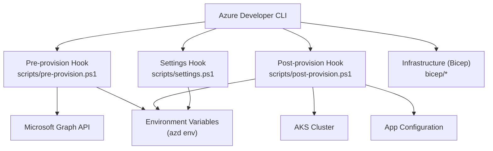
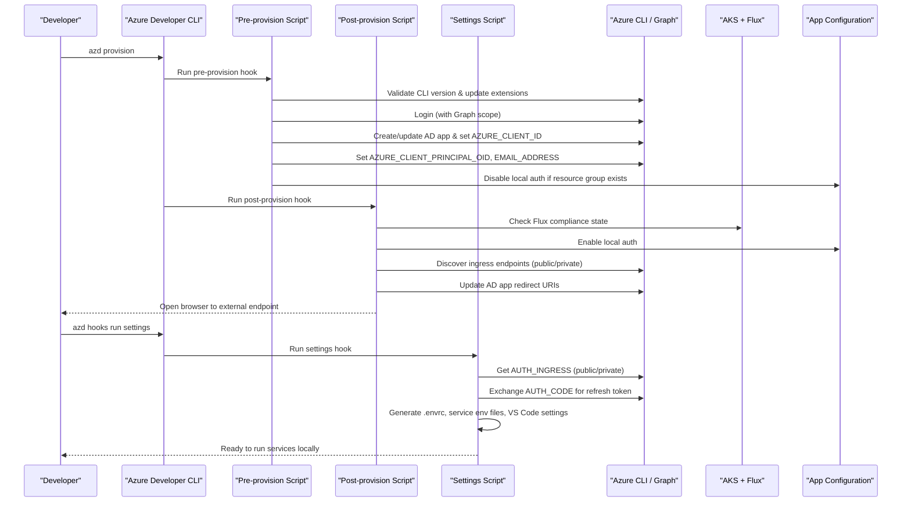
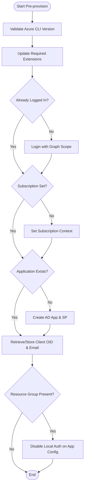
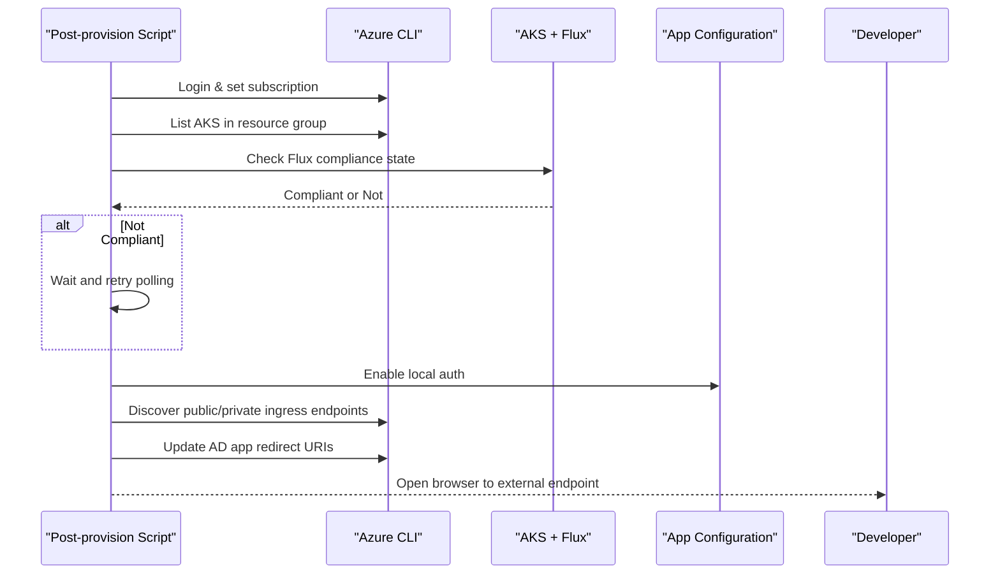
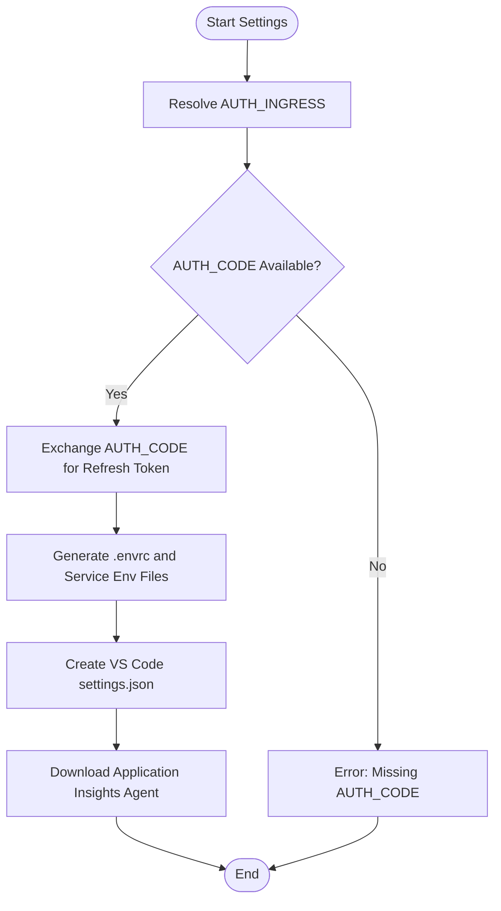
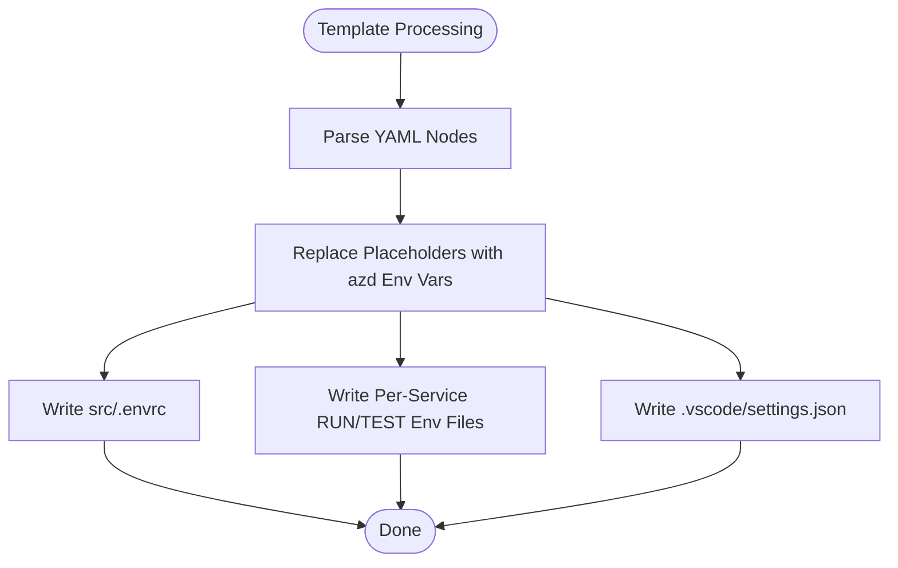
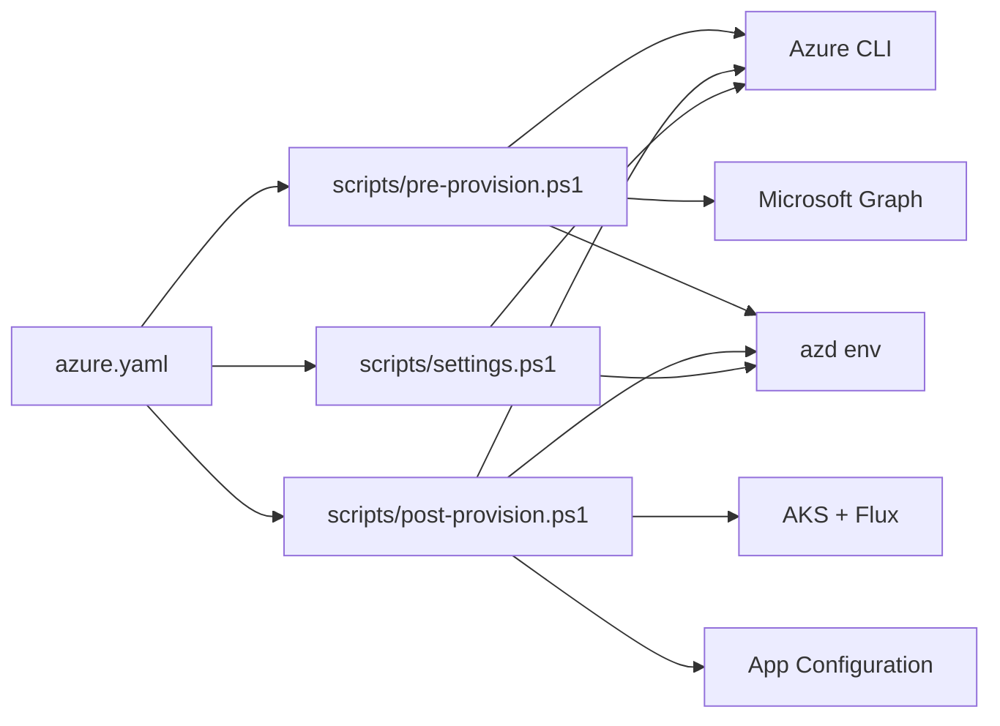

# Local Development Deployment

<cite>
**Referenced Files in This Document**
- [azure.yaml](file://azure.yaml)
- [pre-provision.ps1](file://scripts/pre-provision.ps1)
- [post-provision.ps1](file://scripts/post-provision.ps1)
- [settings.ps1](file://scripts/settings.ps1)
- [template.yaml](file://scripts/template.yaml)
- [README.md](file://README.md)
- [getting_started.md](file://docs/src/getting_started.md)
- [install_prerequisites.md](file://docs/src/install_prerequisites.md)
- [install_cli.md](file://docs/src/install_cli.md)
- [tutorial_cli.md](file://docs/src/tutorial_cli.md)
</cite>

## Table of Contents
1. Introduction
2. Project Structure
3. Core Components
4. Architecture Overview
5. Detailed Component Analysis
6. Dependency Analysis
7. Performance Considerations
8. Troubleshooting Guide
9. Conclusion
10. Appendices

## Introduction
This document explains how to deploy and run the OSDU platform locally using Azure Developer CLI (azd) and PowerShell scripts. It covers pre-provisioning tasks such as Azure CLI version validation, extension management, authentication setup, and Microsoft Entra application creation; post-provisioning tasks including waiting for software installation, updating the application with ingress endpoints, and enabling local authentication; environment variable configuration via settings generation; and steps to start services locally for development. It also includes troubleshooting guidance and performance tips tailored for local development workflows.

## Project Structure
The deployment workflow is orchestrated by Azure Developer CLI through a configuration file that invokes PowerShell hooks for pre-provisioning, post-provisioning, and settings generation. The scripts interact with Azure resources (AKS, App Configuration, Microsoft Graph), manage environment variables, and prepare the local development environment.

**Diagram sources**
- [azure.yaml:8-25](file://azure.yaml#L8-L25)
- [pre-provision.ps1:49-100](file://scripts/pre-provision.ps1#L49-L100)
- [post-provision.ps1:78-138](file://scripts/post-provision.ps1#L78-L138)
- [settings.ps1:129-220](file://scripts/settings.ps1#L129-L220)

**Section sources**
- [azure.yaml:1-26](file://azure.yaml#L1-L26)
- [README.md:25-65](file://README.md#L25-L65)

## Core Components
- Pre-provision script: Validates Azure CLI version, updates required extensions, ensures login, creates or reuses an AD application, sets environment variables, and toggles local auth on App Configuration when applicable.
- Post-provision script: Waits for Flux-compliant software installation on AKS, enables local authentication on App Configuration, discovers ingress endpoints, updates the AD application redirect URIs, and opens the web UI.
- Settings script: Retrieves ingress IP, obtains a refresh token using an authorization code, generates .envrc and service-specific environment files, downloads Application Insights agent, and creates VS Code settings for REST client usage.
- Template YAML: Provides per-service environment templates for RUN and TEST configurations, substituting placeholders with azd environment values.

**Section sources**
- [pre-provision.ps1:22-36](file://scripts/pre-provision.ps1#L22-L36)
- [post-provision.ps1:20-31](file://scripts/post-provision.ps1#L20-L31)
- [settings.ps1:25-39](file://scripts/settings.ps1#L25-L39)
- [template.yaml:1-282](file://scripts/template.yaml#L1-L282)

## Architecture Overview
The end-to-end flow integrates Azure Developer CLI hooks with Azure services to provision infrastructure, configure identity, and prepare the local development environment.

**Diagram sources**
- [azure.yaml:8-25](file://azure.yaml#L8-L25)
- [pre-provision.ps1:49-100](file://scripts/pre-provision.ps1#L49-L100)
- [pre-provision.ps1:103-193](file://scripts/pre-provision.ps1#L103-L193)
- [post-provision.ps1:78-138](file://scripts/post-provision.ps1#L78-L138)
- [post-provision.ps1:174-247](file://scripts/post-provision.ps1#L174-L247)
- [settings.ps1:72-127](file://scripts/settings.ps1#L72-L127)
- [settings.ps1:129-220](file://scripts/settings.ps1#L129-L220)

## Detailed Component Analysis

### Pre-provision Workflow
- CLI version check: Ensures Azure CLI meets minimum version requirements.
- Extension management: Installs or updates required extensions (e.g., k8s-configuration).
- Authentication: Checks login status and prompts login with Graph scope if needed; sets subscription context.
- AD application creation: Creates an application with appropriate redirect URIs and required resource access; stores AZURE_CLIENT_ID and related OID in azd environment.
- Environment variables: Populates AZURE_CLIENT_PRINCIPAL_OID and EMAIL_ADDRESS if not already set.
- Local auth toggle: Disables local authentication on App Configuration when a resource group is present.

**Diagram sources**
- [pre-provision.ps1:49-100](file://scripts/pre-provision.ps1#L49-L100)
- [pre-provision.ps1:103-193](file://scripts/pre-provision.ps1#L103-L193)
- [pre-provision.ps1:195-242](file://scripts/pre-provision.ps1#L195-L242)

**Section sources**
- [pre-provision.ps1:22-36](file://scripts/pre-provision.ps1#L22-L36)
- [pre-provision.ps1:49-100](file://scripts/pre-provision.ps1#L49-L100)
- [pre-provision.ps1:103-193](file://scripts/pre-provision.ps1#L103-L193)
- [pre-provision.ps1:195-242](file://scripts/pre-provision.ps1#L195-L242)

### Post-provision Workflow
- Login and AKS discovery: Ensures login and retrieves AKS cluster name from the resource group.
- Software readiness: Polls Flux compliance state until compliant or timeout.
- Local auth toggle: Enables local authentication on App Configuration for local development.
- Ingress discovery: Finds public DNS/IP and private load balancer IP; sets INGRESS_EXTERNAL and INGRESS_INTERNAL in azd environment.
- AD application update: Adds discovered endpoints as redirect URIs for both web and SPA flows.
- Browser launch: Opens the external endpoint URL automatically on supported platforms.

**Diagram sources**
- [post-provision.ps1:42-76](file://scripts/post-provision.ps1#L42-L76)
- [post-provision.ps1:78-138](file://scripts/post-provision.ps1#L78-L138)
- [post-provision.ps1:174-247](file://scripts/post-provision.ps1#L174-L247)
- [post-provision.ps1:299-320](file://scripts/post-provision.ps1#L299-L320)

**Section sources**
- [post-provision.ps1:20-31](file://scripts/post-provision.ps1#L20-L31)
- [post-provision.ps1:78-138](file://scripts/post-provision.ps1#L78-L138)
- [post-provision.ps1:174-247](file://scripts/post-provision.ps1#L174-L247)
- [post-provision.ps1:299-320](file://scripts/post-provision.ps1#L299-L320)

### Settings Workflow
- Ingress resolution: Determines AUTH_INGRESS based on internal or external mode.
- Refresh token acquisition: Uses AUTH_CODE to obtain a refresh token from Microsoft identity platform.
- Environment generation: Creates .envrc and per-service environment files by templating template.yaml with azd environment values.
- VS Code integration: Generates settings.json with REST client environment variables for convenient API testing.
- Application Insights agent: Downloads the agent JAR for local instrumentation.

**Diagram sources**
- [settings.ps1:72-127](file://scripts/settings.ps1#L72-L127)
- [settings.ps1:129-220](file://scripts/settings.ps1#L129-L220)
- [settings.ps1:463-478](file://scripts/settings.ps1#L463-L478)

**Section sources**
- [settings.ps1:25-39](file://scripts/settings.ps1#L25-L39)
- [settings.ps1:72-127](file://scripts/settings.ps1#L72-L127)
- [settings.ps1:129-220](file://scripts/settings.ps1#L129-L220)
- [settings.ps1:463-478](file://scripts/settings.ps1#L463-L478)

### Environment Variable Configuration
- Template-driven generation: template.yaml defines per-service RUN and TEST environment variables with placeholders resolved from azd environment variables.
- Output artifacts:
  - src/.envrc: Shell-friendly environment file for loading variables into the current session.
  - Per-service env files: Generated under src/<core|reference>/<service>/ for both RUN and TEST tasks.
  - VS Code settings.json: Contains REST client environment variables for quick API calls.

**Diagram sources**
- [template.yaml:1-282](file://scripts/template.yaml#L1-L282)
- [settings.ps1:129-220](file://scripts/settings.ps1#L129-L220)
- [settings.ps1:222-461](file://scripts/settings.ps1#L222-L461)

**Section sources**
- [template.yaml:1-282](file://scripts/template.yaml#L1-L282)
- [settings.ps1:129-220](file://scripts/settings.ps1#L129-L220)
- [settings.ps1:222-461](file://scripts/settings.ps1#L222-L461)

## Dependency Analysis
- azure.yaml orchestrates azd hooks:
  - preprovision runs scripts/pre-provision.ps1
  - postprovision runs scripts/post-provision.ps1
  - settings runs scripts/settings.ps1
- Scripts depend on:
  - Azure CLI and extensions (k8s-configuration)
  - Microsoft Graph API for AD app management
  - AKS and Flux for software installation status
  - App Configuration for local auth toggling
  - azd environment for storing credentials and endpoints

**Diagram sources**
- [azure.yaml:8-25](file://azure.yaml#L8-L25)
- [pre-provision.ps1:49-100](file://scripts/pre-provision.ps1#L49-L100)
- [post-provision.ps1:78-138](file://scripts/post-provision.ps1#L78-L138)
- [settings.ps1:72-127](file://scripts/settings.ps1#L72-L127)

**Section sources**
- [azure.yaml:8-25](file://azure.yaml#L8-L25)

## Performance Considerations
- Use sufficient compute quota in your region to avoid provisioning delays; ensure availability of VM families and Cosmos DB regions as documented.
- Prefer internal ingress for local development when possible to reduce latency and network overhead.
- Limit logging verbosity for services during local runs to reduce I/O pressure; adjust logging levels in generated environment files where appropriate.
- Reuse azd environment across sessions to avoid repeated credential exchanges and app lookups.
- When running multiple services locally, stagger startup to prevent resource contention on CPU/memory.

[No sources needed since this section provides general guidance]

## Troubleshooting Guide
- Azure CLI version mismatch: Ensure Azure CLI meets the minimum version requirement enforced by the pre-provision script. Upgrade if necessary.
- Missing extensions: The pre-provision script installs or updates required extensions; verify connectivity and permissions if installation fails.
- Authentication failures: Confirm you are logged in with Graph scope; re-run login if prompted. Ensure subscription context is set correctly.
- AD application issues: If creating or updating the AD app fails, verify permissions and that the application name does not conflict. Check redirect URIs after post-provision completes.
- Flux compliance timeout: Post-provision waits for Flux to reach compliant state; if it times out, re-run post-provision or check AKS logs for errors.
- Ingress discovery problems: If external or private endpoints are not found, verify network configuration and load balancer settings in the node resource group.
- Settings generation errors: Ensure AUTH_CODE is provided and valid; confirm tenant ID and ingress IP are available before generating environment files.

**Section sources**
- [pre-provision.ps1:49-100](file://scripts/pre-provision.ps1#L49-L100)
- [post-provision.ps1:78-138](file://scripts/post-provision.ps1#L78-L138)
- [post-provision.ps1:174-247](file://scripts/post-provision.ps1#L174-L247)
- [settings.ps1:72-127](file://scripts/settings.ps1#L72-L127)

## Conclusion
The OSDU developer deployment leverages Azure Developer CLI hooks and PowerShell scripts to automate pre- and post-provisioning tasks, manage identity, configure environments, and streamline local development. By following the documented steps, developers can reliably provision infrastructure, configure authentication, generate environment files, and run services locally with minimal friction.

[No sources needed since this section summarizes without analyzing specific files]

## Appendices

### Getting Started Commands
- Authenticate and initialize:
  - az login --scope https://graph.microsoft.com//.default
  - azd auth login
  - az account set --subscription <your_subscription_id>
  - azd init -e <your_env_name>
- Provision:
  - azd provision
- Configure:
  - azd env set AUTH_CODE <auth_code>
  - azd hooks run settings
- Cleanup:
  - azd down --force --purge

**Section sources**
- [README.md:46-65](file://README.md#L46-L65)
- [install_cli.md:23-72](file://docs/src/install_cli.md#L23-L72)
- [tutorial_cli.md:122-131](file://docs/src/tutorial_cli.md#L122-L131)

### Prerequisites and Roles
- Install Visual Studio Code, PowerShell Core, Azure CLI, and Azure Developer CLI.
- Register required resource providers and feature flags for AKS.
- Assign Contributor, RBAC Administrator, and Resource Policy Contributor roles as needed.

**Section sources**
- [install_prerequisites.md:27-45](file://docs/src/install_prerequisites.md#L27-L45)
- [getting_started.md:70-130](file://docs/src/getting_started.md#L70-L130)