# Production Deployment Strategies

<cite>
**Referenced Files in This Document**
- [README.md](file://README.md)
- [DEPLOYMENT_SUMMARY.md](file://DEPLOYMENT_SUMMARY.md)
- [bicep/README.md](file://bicep/README.md)
- [docs/src/design_infrastructure.md](file://docs/src/design_infrastructure.md)
- [bicep/main.bicep](file://bicep/main.bicep)
- [bicep/main.parameters.json](file://bicep/main.parameters.json)
- [charts/osdu-developer-service/values.yaml](file://charts/osdu-developer-service/values.yaml)
- [charts/osdu-developer-base/values.yaml](file://charts/osdu-developer-base/values.yaml)
- [software/components/observability/prometheus.yaml](file://software/components/observability/prometheus.yaml)
- [software/components/osdu-system/database.yaml](file://software/components/osdu-system/database.yaml)
- [charts/osdu-developer-init/templates/partition-init.yaml](file://charts/osdu-developer-init/templates/partition-init.yaml)
- [scripts/post-provision.ps1](file://scripts/post-provision.ps1)
</cite>

## Table of Contents
1. Introduction
2. Project Structure
3. Core Components
4. Architecture Overview
5. Detailed Component Analysis
6. Dependency Analysis
7. Performance Considerations
8. Troubleshooting Guide
9. Conclusion
10. Appendices

## Introduction
This document provides production deployment strategies and best practices for the OSDU platform as implemented in this repository. It covers multi-environment deployment approaches, resource scaling considerations, high availability configurations, production-specific parameters, security hardening, compliance requirements, zero-downtime deployments, database migrations, backup strategies, capacity planning, cost optimization, monitoring, disaster recovery, incident response, and operational maintenance tasks. The guidance is grounded in the repository’s Infrastructure-as-Code (Bicep), Helm charts, Flux-driven GitOps, and observability components.

## Project Structure
The project uses a stamp-based architecture with modular Bicep “blades” to compose infrastructure, and Helm charts managed via Flux on AKS. Key areas:
- Infrastructure orchestration and modules under bicep/
- Kubernetes manifests and Helm values under charts/
- Software components and system services under software/components/
- Documentation and design references under docs/src/

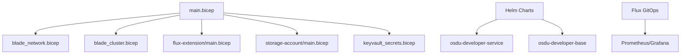

**Diagram sources**
- [bicep/main.bicep:353-421](file://bicep/main.bicep#L353-L421)
- [bicep/README.md:1-87](file://bicep/README.md#L1-L87)
- [charts/osdu-developer-service/values.yaml:1-142](file://charts/osdu-developer-service/values.yaml#L1-L142)
- [charts/osdu-developer-base/values.yaml:1-38](file://charts/osdu-developer-base/values.yaml#L1-L38)
- [software/components/observability/prometheus.yaml:1-554](file://software/components/observability/prometheus.yaml#L1-L554)

**Section sources**
- [README.md:16-35](file://README.md#L16-L35)
- [bicep/README.md:1-87](file://bicep/README.md#L1-L87)
- [docs/src/design_infrastructure.md:1-308](file://docs/src/design_infrastructure.md#L1-L308)

## Core Components
- Infrastructure as Code (IaC): Bicep orchestrates AKS, networking, storage, Key Vault, App Insights, Redis, and Flux extension. Parameters are supplied via main.parameters.json.
- Application Platform: AKS hosts OSDU services deployed by Helm charts; autoscaling and ingress are configurable per service.
- Observability: Prometheus and Grafana installed via Flux; logs and metrics flow to Log Analytics and Application Insights.
- Data Services: Cosmos DB and PostgreSQL (via CloudNativePG operator) provisioned and configured for partitioning and backups.
- Security: Managed identities, Key Vault RBAC, network ACLs, private cluster options, and least-privilege roles.

**Section sources**
- [bicep/main.bicep:166-800](file://bicep/main.bicep#L166-L800)
- [bicep/main.parameters.json:1-83](file://bicep/main.parameters.json#L1-L83)
- [software/components/osdu-system/database.yaml:1-29](file://software/components/osdu-system/database.yaml#L1-L29)
- [software/components/observability/prometheus.yaml:1-554](file://software/components/observability/prometheus.yaml#L1-L554)

## Architecture Overview
The production stack deploys a stampable environment with:
- AKS cluster with optional node auto-provisioning and private cluster mode
- Networking blade supporting VNet injection and subnets
- Storage accounts with containers and tables, secured via Key Vault secrets
- Cosmos DB with backup policies and optional multi-region writes
- Flux extension enabling GitOps-driven Helm releases
- Observability via Prometheus/Grafana and Azure-native telemetry

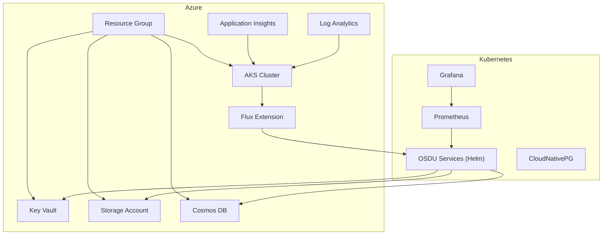

**Diagram sources**
- [bicep/main.bicep:166-800](file://bicep/main.bicep#L166-L800)
- [bicep/README.md:1-87](file://bicep/README.md#L1-L87)
- [software/components/observability/prometheus.yaml:1-554](file://software/components/observability/prometheus.yaml#L1-L554)
- [software/components/osdu-system/database.yaml:1-29](file://software/components/osdu-system/database.yaml#L1-L29)

## Detailed Component Analysis

### Multi-Environment Deployment Strategy
- Use parameter files and environment variables to switch environments (dev/test/prod). The main parameters file maps environment variables to deployment settings such as location, ingress type, cluster configuration, server VM sizes, VNet injection, and software toggles.
- Feature flags control inclusion of core/reference software and experimental features.
- For isolated stamps per tenant or environment, deploy separate resource groups and use unique naming derived from resource group identity.

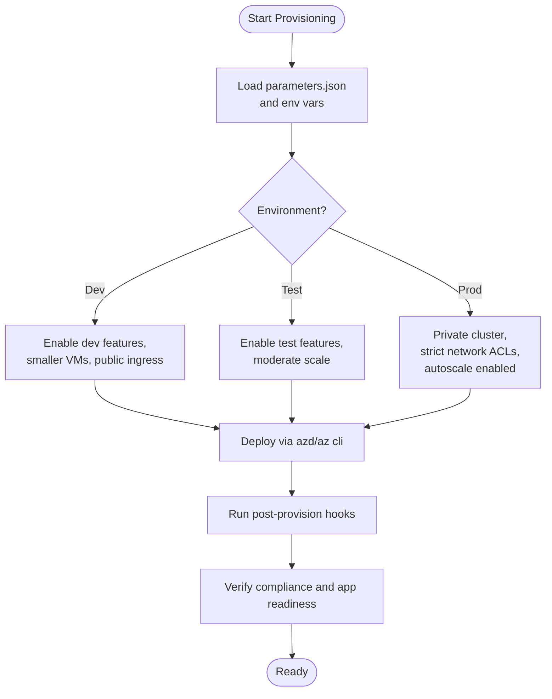

**Diagram sources**
- [bicep/main.parameters.json:1-83](file://bicep/main.parameters.json#L1-L83)
- [bicep/main.bicep:28-81](file://bicep/main.bicep#L28-L81)
- [scripts/post-provision.ps1:284-319](file://scripts/post-provision.ps1#L284-L319)

**Section sources**
- [bicep/main.parameters.json:1-83](file://bicep/main.parameters.json#L1-L83)
- [bicep/main.bicep:28-81](file://bicep/main.bicep#L28-L81)
- [scripts/post-provision.ps1:284-319](file://scripts/post-provision.ps1#L284-L319)

### Resource Scaling and High Availability
- Horizontal Pod Autoscaler (HPA) templates are provided per service; configure min/max replicas and CPU target utilization in service values.
- Node pools can be sized per role (system/user) and optionally enable node auto-provisioning for elastic capacity.
- Cosmos DB supports periodic or continuous backups and multi-region write regions for geo-HA.
- AKS private cluster option restricts inbound traffic; combine with private endpoints and network ACLs for secure access.

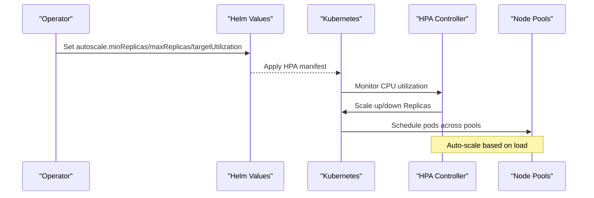

**Diagram sources**
- [charts/osdu-developer-service/values.yaml:20-25](file://charts/osdu-developer-service/values.yaml#L20-L25)
- [bicep/main.bicep:353-385](file://bicep/main.bicep#L353-L385)
- [bicep/modules/cosmos-db/main.bicep:269-307](file://bicep/modules/cosmos-db/main.bicep#L269-L307)

**Section sources**
- [charts/osdu-developer-service/values.yaml:20-25](file://charts/osdu-developer-service/values.yaml#L20-L25)
- [bicep/main.bicep:353-385](file://bicep/main.bicep#L353-L385)
- [bicep/modules/cosmos-db/main.bicep:101-133](file://bicep/modules/cosmos-db/main.bicep#L101-L133)
- [bicep/modules/cosmos-db/main.bicep:269-307](file://bicep/modules/cosmos-db/main.bicep#L269-L307)

### Production-Specific Parameters and Security Hardening
- Ingress type: External/Internal/Both; choose Internal for production isolation.
- Cluster lockdown and private cluster modes reduce exposure surface.
- Key Vault RBAC and network ACLs restrict secret access to trusted IPs (e.g., cluster NAT IP).
- Storage account network ACLs and shared key access controls; disable public blob access where possible.
- Managed identities used throughout for least-privilege access.

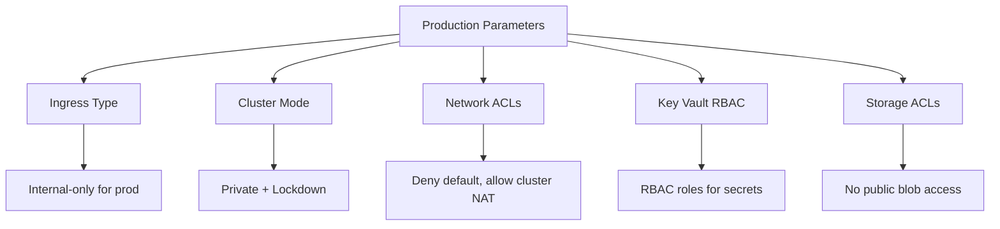

**Diagram sources**
- [bicep/main.parameters.json:17-31](file://bicep/main.parameters.json#L17-L31)
- [bicep/main.bicep:618-660](file://bicep/main.bicep#L618-L660)
- [bicep/main.bicep:775-792](file://bicep/main.bicep#L775-L792)

**Section sources**
- [bicep/main.parameters.json:17-31](file://bicep/main.parameters.json#L17-L31)
- [bicep/main.bicep:618-660](file://bicep/main.bicep#L618-L660)
- [bicep/main.bicep:775-792](file://bicep/main.bicep#L775-L792)

### Zero-Downtime Deployments
- Use rolling updates for service deployments with readiness probes defined in Helm values to ensure traffic only routes to healthy pods.
- Configure HPA to maintain minimum replicas during rollouts.
- For stateful data, rely on managed backups and point-in-time restore capabilities rather than in-place schema changes during peak hours.

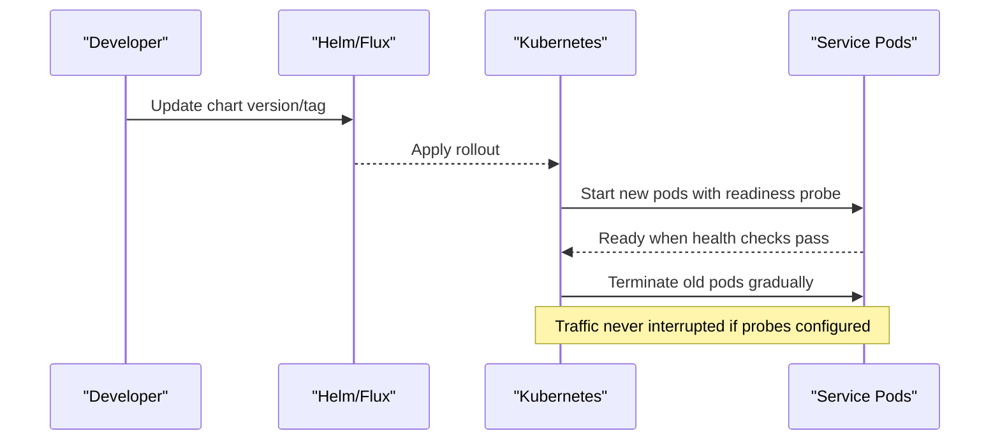

**Diagram sources**
- [charts/osdu-developer-service/values.yaml:60-79](file://charts/osdu-developer-service/values.yaml#L60-L79)
- [charts/osdu-developer-service/values.yaml:20-25](file://charts/osdu-developer-service/values.yaml#L20-L25)

**Section sources**
- [charts/osdu-developer-service/values.yaml:60-79](file://charts/osdu-developer-service/values.yaml#L60-L79)
- [charts/osdu-developer-service/values.yaml:20-25](file://charts/osdu-developer-service/values.yaml#L20-L25)

### Database Migrations
- PostgreSQL: CloudNativePG operator is installed via Flux; plan migrations using operator-managed clusters and scheduled jobs.
- Cosmos DB: Use backup policies and migration scripts executed via Jobs or pipelines; leverage continuous backups for safe rollback points.
- Partition initialization scripts are templated and injected via ConfigMaps; ensure sensitive fields are sourced from Key Vault.

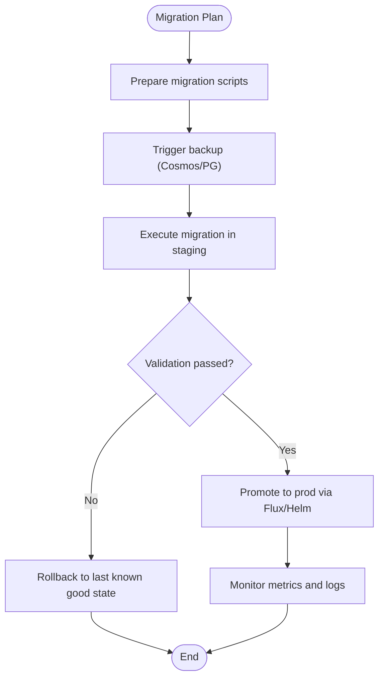

**Diagram sources**
- [software/components/osdu-system/database.yaml:1-29](file://software/components/osdu-system/database.yaml#L1-L29)
- [bicep/modules/cosmos-db/main.bicep:101-133](file://bicep/modules/cosmos-db/main.bicep#L101-L133)
- [charts/osdu-developer-init/templates/partition-init.yaml:51-94](file://charts/osdu-developer-init/templates/partition-init.yaml#L51-L94)

**Section sources**
- [software/components/osdu-system/database.yaml:1-29](file://software/components/osdu-system/database.yaml#L1-L29)
- [bicep/modules/cosmos-db/main.bicep:101-133](file://bicep/modules/cosmos-db/main.bicep#L101-L133)
- [charts/osdu-developer-init/templates/partition-init.yaml:51-94](file://charts/osdu-developer-init/templates/partition-init.yaml#L51-L94)

### Backup Strategies
- Cosmos DB: Configure periodic or continuous backups with retention windows and redundancy levels suitable for RPO/RTO targets.
- Storage Accounts: Use immutable policies and lifecycle management; export secrets to Key Vault for auditability.
- PostgreSQL: Rely on CloudNativePG snapshots and PITR; schedule regular backups and test restores.

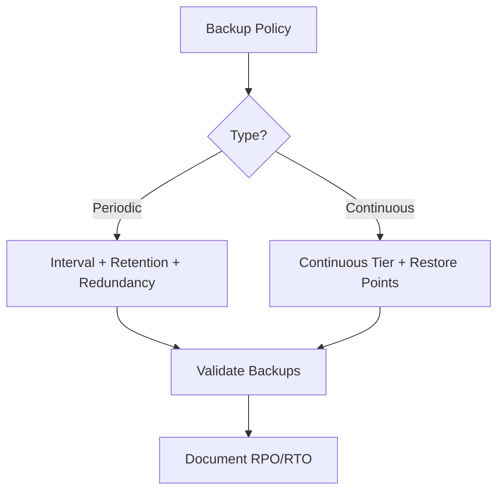

**Diagram sources**
- [bicep/modules/cosmos-db/main.bicep:101-133](file://bicep/modules/cosmos-db/main.bicep#L101-L133)
- [bicep/main.bicep:715-800](file://bicep/main.bicep#L715-L800)
- [software/components/osdu-system/database.yaml:1-29](file://software/components/osdu-system/database.yaml#L1-L29)

**Section sources**
- [bicep/modules/cosmos-db/main.bicep:101-133](file://bicep/modules/cosmos-db/main.bicep#L101-L133)
- [bicep/main.bicep:715-800](file://bicep/main.bicep#L715-L800)
- [software/components/osdu-system/database.yaml:1-29](file://software/components/osdu-system/database.yaml#L1-L29)

### Capacity Planning and Cost Optimization
- Right-size node pools (system/user) and consider burstable SKUs for non-critical workloads; adjust VM sizes via parameters.
- Enable node auto-provisioning to handle spikes while maintaining baseline costs.
- Use HPA to scale horizontally based on CPU utilization thresholds.
- Choose appropriate storage tiers and retention policies to balance performance and cost.

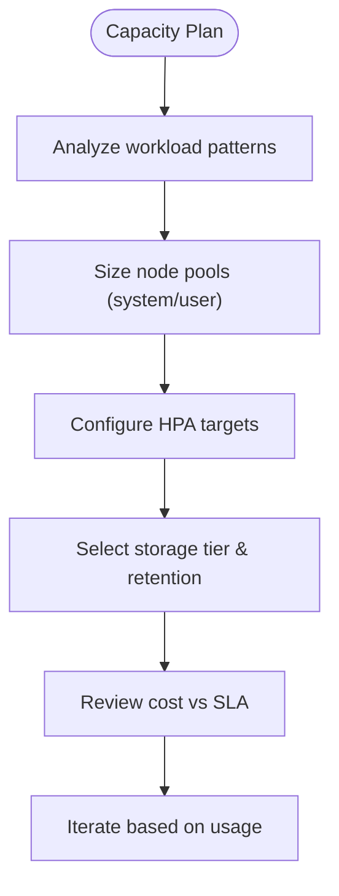

**Diagram sources**
- [bicep/main.bicep:46-57](file://bicep/main.bicep#L46-L57)
- [charts/osdu-developer-service/values.yaml:20-25](file://charts/osdu-developer-service/values.yaml#L20-L25)
- [DEPLOYMENT_SUMMARY.md:124-133](file://DEPLOYMENT_SUMMARY.md#L124-L133)

**Section sources**
- [bicep/main.bicep:46-57](file://bicep/main.bicep#L46-L57)
- [charts/osdu-developer-service/values.yaml:20-25](file://charts/osdu-developer-service/values.yaml#L20-L25)
- [DEPLOYMENT_SUMMARY.md:124-133](file://DEPLOYMENT_SUMMARY.md#L124-L133)

### Monitoring Production Deployments
- Prometheus scrapes Kubernetes APIs, nodes, and services; Grafana visualizes metrics.
- Application Insights and Log Analytics provide centralized telemetry and alerting.
- Configure scrape intervals and slow jobs to balance detail and overhead.

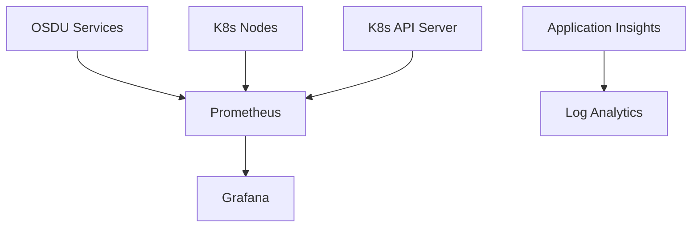

**Diagram sources**
- [software/components/observability/prometheus.yaml:33-348](file://software/components/observability/prometheus.yaml#L33-L348)
- [bicep/main.bicep:191-247](file://bicep/main.bicep#L191-L247)

**Section sources**
- [software/components/observability/prometheus.yaml:33-348](file://software/components/observability/prometheus.yaml#L33-L348)
- [bicep/main.bicep:191-247](file://bicep/main.bicep#L191-L247)

### Disaster Recovery and Incident Response
- Define RPO/RTO aligned with backup strategies (Cosmos DB continuous/periodic, PG snapshots).
- Maintain runbooks for failover scenarios and restore procedures.
- Use alerts in Application Insights and Grafana to trigger incident response workflows.
- Post-provision hooks validate compliance and application readiness before opening access.

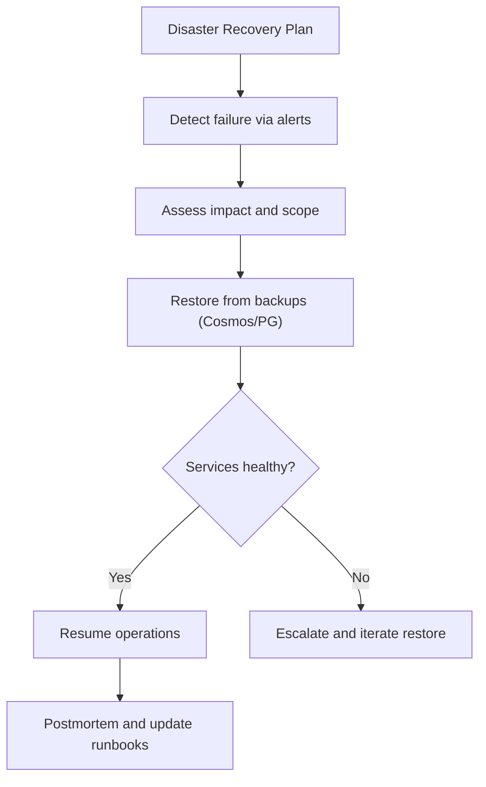

**Diagram sources**
- [bicep/modules/cosmos-db/main.bicep:101-133](file://bicep/modules/cosmos-db/main.bicep#L101-L133)
- [software/components/osdu-system/database.yaml:1-29](file://software/components/osdu-system/database.yaml#L1-L29)
- [scripts/post-provision.ps1:284-319](file://scripts/post-provision.ps1#L284-L319)

**Section sources**
- [bicep/modules/cosmos-db/main.bicep:101-133](file://bicep/modules/cosmos-db/main.bicep#L101-L133)
- [software/components/osdu-system/database.yaml:1-29](file://software/components/osdu-system/database.yaml#L1-L29)
- [scripts/post-provision.ps1:284-319](file://scripts/post-provision.ps1#L284-L319)

### Operational Maintenance Tasks
- Regularly review and tune HPA thresholds and node pool sizes based on observed metrics.
- Rotate secrets stored in Key Vault and enforce RBAC least privilege.
- Update Helm charts and base images through Flux-controlled repositories.
- Audit network ACLs and firewall rules periodically.

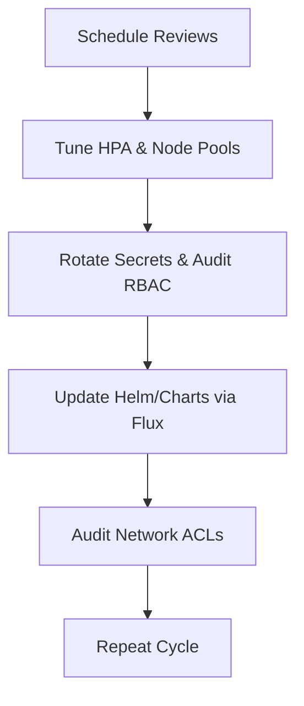

[No sources needed since this section provides general guidance]

## Dependency Analysis
Infrastructure modules depend on identity, logging, and networking; services depend on storage, databases, and secrets. Helm charts manage application dependencies within the cluster.

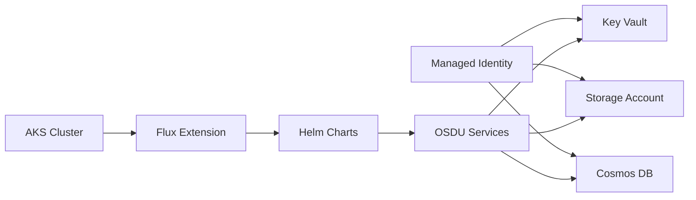

**Diagram sources**
- [bicep/main.bicep:166-800](file://bicep/main.bicep#L166-L800)
- [bicep/README.md:1-87](file://bicep/README.md#L1-L87)
- [charts/osdu-developer-service/values.yaml:1-142](file://charts/osdu-developer-service/values.yaml#L1-L142)

**Section sources**
- [bicep/main.bicep:166-800](file://bicep/main.bicep#L166-L800)
- [bicep/README.md:1-87](file://bicep/README.md#L1-L87)
- [charts/osdu-developer-service/values.yaml:1-142](file://charts/osdu-developer-service/values.yaml#L1-L142)

## Performance Considerations
- Tune Prometheus scrape intervals and slow jobs to avoid excessive overhead.
- Use readiness probes and HPA to ensure smooth scaling and minimal latency spikes.
- Select appropriate storage SKUs and retention policies to meet performance needs without overspending.
- Keep cluster private and restrict ingress to internal networks in production.

[No sources needed since this section provides general guidance]

## Troubleshooting Guide
- Use post-provision hooks to verify compliance and application readiness; open browser to ingress URL upon success.
- Check Application Insights and Log Analytics for errors and performance bottlenecks.
- Validate Key Vault access and network ACLs if services cannot retrieve secrets.
- Inspect Prometheus targets and Grafana dashboards for metric collection issues.

**Section sources**
- [scripts/post-provision.ps1:284-319](file://scripts/post-provision.ps1#L284-L319)
- [bicep/main.bicep:191-247](file://bicep/main.bicep#L191-L247)
- [bicep/main.bicep:618-660](file://bicep/main.bicep#L618-L660)
- [software/components/observability/prometheus.yaml:33-348](file://software/components/observability/prometheus.yaml#L33-L348)

## Conclusion
This repository provides a robust, stampable production foundation for OSDU on Azure. By leveraging Bicep modules, Helm charts, Flux GitOps, and comprehensive observability, teams can deploy secure, scalable, and highly available environments. Adhering to the recommended parameters, scaling strategies, backup policies, and operational practices ensures reliable production operations and efficient cost management.

[No sources needed since this section summarizes without analyzing specific files]

## Appendices

### Compliance Requirements
- Ensure all resources are tagged and monitored via Log Analytics and Application Insights.
- Enforce RBAC on Key Vault and storage accounts; disable public access where feasible.
- Validate software compliance via post-provision checks before exposing services.

**Section sources**
- [bicep/main.bicep:191-247](file://bicep/main.bicep#L191-L247)
- [bicep/main.bicep:618-660](file://bicep/main.bicep#L618-L660)
- [scripts/post-provision.ps1:284-319](file://scripts/post-provision.ps1#L284-L319)

### Best Practices Summary
- Use private clusters and internal ingress for production.
- Configure HPA with sensible thresholds and maintain minimum replicas.
- Implement continuous backups for critical data stores and test restores regularly.
- Centralize telemetry and set up alerts for proactive incident response.

[No sources needed since this section provides general guidance]