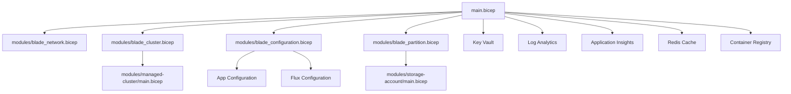
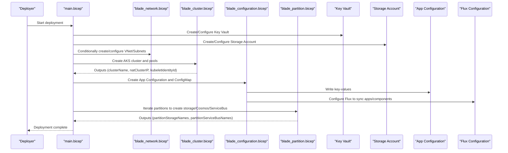
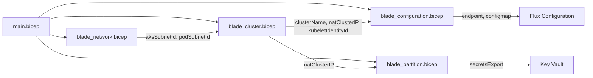

# Infrastructure as Code

<cite>
**Referenced Files in This Document**
- [bicep/README.md](file://bicep/README.md)
- [bicep/main.bicep](file://bicep/main.bicep)
- [bicep/main-minimal.bicep](file://bicep/main-minimal.bicep)
- [bicep/main.parameters.json](file://bicep/main.parameters.json)
- [bicep/main-minimal.parameters.json](file://bicep/main-minimal.parameters.json)
- [bicep/modules/blade_network.bicep](file://bicep/modules/blade_network.bicep)
- [bicep/modules/blade_cluster.bicep](file://bicep/modules/blade_cluster.bicep)
- [bicep/modules/blade_configuration.bicep](file://bicep/modules/blade_configuration.bicep)
- [bicep/modules/blade_partition.bicep](file://bicep/modules/blade_partition.bicep)
- [bicep/modules/storage-account/main.bicep](file://bicep/modules/storage-account/main.bicep)
- [bicep/modules/managed-cluster/main.bicep](file://bicep/modules/managed-cluster/main.bicep)
- [bicepconfig.json](file://bicepconfig.json)
- [version.json](file://version.json)
</cite>

## Table of Contents
1. [Introduction](#introduction)
2. [Project Structure](#project-structure)
3. [Core Components](#core-components)
4. [Architecture Overview](#architecture-overview)
5. [Detailed Component Analysis](#detailed-component-analysis)
6. [Dependency Analysis](#dependency-analysis)
7. [Performance Considerations](#performance-considerations)
8. [Troubleshooting Guide](#troubleshooting-guide)
9. [Conclusion](#conclusion)
10. [Appendices](#appendices)

## Introduction
This document explains the Infrastructure as Code (IaC) for the OSDU platform using Azure Bicep templates. It covers the modular architecture, parameter management, environment-specific configurations, main deployment structure, blade modules for resource groups, reusable module patterns, and best practices for versioning, state management, and automation.

The repository provides:
- A full-stack deployment template that provisions identity, monitoring, networking, AKS cluster, storage, Key Vault, App Configuration, Flux GitOps, and partitioned data services.
- A minimal deployment template for quick setup with core resources only.
- Reusable modules for storage accounts and managed clusters.
- Blade modules to encapsulate logical sections (network, cluster, configuration, partitions).

## Project Structure
At a high level:
- Root-level Bicep templates define the overall deployment and orchestrate blade modules.
- Blade modules encapsulate specific resource domains and expose typed parameters and outputs.
- Reusable modules provide standardized infrastructure components.
- Parameter files drive environment-specific values via environment variables or JSON overrides.

**Diagram sources**
- [bicep/main.bicep:166-800](file://bicep/main.bicep#L166-L800)
- [bicep/modules/blade_network.bicep:1-332](file://bicep/modules/blade_network.bicep#L1-L332)
- [bicep/modules/blade_cluster.bicep:1-355](file://bicep/modules/blade_cluster.bicep#L1-L355)
- [bicep/modules/blade_configuration.bicep:1-599](file://bicep/modules/blade_configuration.bicep#L1-L599)
- [bicep/modules/blade_partition.bicep:1-787](file://bicep/modules/blade_partition.bicep#L1-L787)
- [bicep/modules/managed-cluster/main.bicep:1-200](file://bicep/modules/managed-cluster/main.bicep#L1-L200)
- [bicep/modules/storage-account/main.bicep:1-200](file://bicep/modules/storage-account/main.bicep#L1-L200)

**Section sources**
- [bicep/README.md:1-87](file://bicep/README.md#L1-L87)
- [bicep/main.bicep:1-157](file://bicep/main.bicep#L1-L157)

## Core Components
- Identity and Monitoring: User-assigned identity, Log Analytics workspace, Application Insights.
- Networking: Optional VNet injection or creation with subnets and NSGs; supports pod subnet and service endpoints.
- Compute: AKS cluster with system and user node pools, extensions, policies, and NAT IP.
- Storage: Storage account with blob/file/table services, containers/shares/tables, role assignments, and secrets export to Key Vault.
- Secrets and Configuration: Key Vault with RBAC and network ACLs; App Configuration key-values; Kubernetes ConfigMap for Helm values.
- Data Partitions: Per-partition storage accounts, Cosmos DB databases/containers, Service Bus namespaces/topics/subscriptions, and secret propagation.
- GitOps: Flux extension on AKS and Flux configuration to sync components/applications from a Git repository or private blob source.

Key configurable areas:
- Region, email, application client identity, ingress type.
- Software loading flags and repository/branch/tag references.
- Cluster behavior (private, lockdown, auto-provisioning), VM sizes.
- Bring-your-own-VNet settings and subnets.
- Feature toggles for telemetry, software, experimental features.

**Section sources**
- [bicep/main.bicep:1-157](file://bicep/main.bicep#L1-L157)
- [bicep/main.bicep:166-800](file://bicep/main.bicep#L166-L800)
- [bicep/modules/blade_network.bicep:1-332](file://bicep/modules/blade_network.bicep#L1-L332)
- [bicep/modules/blade_cluster.bicep:1-355](file://bicep/modules/blade_cluster.bicep#L1-L355)
- [bicep/modules/blade_configuration.bicep:1-599](file://bicep/modules/blade_configuration.bicep#L1-L599)
- [bicep/modules/blade_partition.bicep:1-787](file://bicep/modules/blade_partition.bicep#L1-L787)

## Architecture Overview
The deployment composes multiple modules into a cohesive stack:
- Identity and monitoring are foundational.
- Networking is conditional based on VNet injection.
- Cluster depends on identity and optionally networking.
- Storage and Key Vault are created early to support secrets and diagnostics.
- Configuration sets up App Configuration and Kubernetes ConfigMap.
- Partition resources are iterated per partition definition.
- Flux extension and configuration enable GitOps-driven application delivery.

**Diagram sources**
- [bicep/main.bicep:166-800](file://bicep/main.bicep#L166-L800)
- [bicep/modules/blade_network.bicep:1-332](file://bicep/modules/blade_network.bicep#L1-L332)
- [bicep/modules/blade_cluster.bicep:1-355](file://bicep/modules/blade_cluster.bicep#L1-L355)
- [bicep/modules/blade_configuration.bicep:1-599](file://bicep/modules/blade_configuration.bicep#L1-L599)
- [bicep/modules/blade_partition.bicep:1-787](file://bicep/modules/blade_partition.bicep#L1-L787)

## Detailed Component Analysis

### Main Deployment Template (main.bicep)
Responsibilities:
- Declares top-level parameters and feature flags.
- Composes modules for identity, monitoring, networking, cluster, storage, Key Vault, App Configuration, and partitions.
- Manages dependencies explicitly via dependsOn where needed.
- Uses Azure Verified Modules (AVM) for common resources.

Key behaviors:
- Conditional networking based on VNet injection flags.
- Early start of long-running resources like Redis and Flux extension.
- Centralized tagging and diagnostic settings.
- Secret population in Key Vault and exports to storage/service bus.

Parameter highlights:
- location, emailAddress, applicationClientId, applicationClientPrincipalOid.
- ingressType controls internal/external ingress configuration.
- clusterSoftware and experimentalSoftware toggle software loading and versions.
- clusterConfiguration toggles private cluster, lockdown, and auto-provisioning.
- serverConfiguration defines VM sizes for system/user pools.
- vnetConfiguration supports BYO VNet and subnets.

Recommended usage:
- Use main.parameters.json to inject environment-specific values via environment variables.
- For minimal deployments, use main-minimal.bicep and its parameters file.

**Section sources**
- [bicep/main.bicep:1-157](file://bicep/main.bicep#L1-L157)
- [bicep/main.bicep:166-800](file://bicep/main.bicep#L166-L800)
- [bicep/main.parameters.json:1-83](file://bicep/main.parameters.json#L1-L83)

### Minimal Deployment Template (main-minimal.bicep)
Purpose:
- Quickstart with essential resources: identity, Log Analytics, Application Insights, Key Vault, Storage Account, Static Web App.
- Suitable for evaluation or environments without AKS/partitions.

Parameters:
- location, applicationClientId, applicationClientPrincipalOid, enableTelemetry.

Outputs:
- Tenant ID, client ID, storage account name, instrumentation key, Key Vault URI, static web app URL, resource group name.

**Section sources**
- [bicep/main-minimal.bicep:1-297](file://bicep/main-minimal.bicep#L1-L297)
- [bicep/main-minimal.parameters.json:1-19](file://bicep/main-minimal.parameters.json#L1-L19)

### Network Blade (blade_network.bicep)
Capabilities:
- Creates or uses existing VNet and subnets for AKS and pods.
- Applies NSG rules for inbound/outbound traffic.
- Assigns roles to managed identities for network access.
- Exposes subnet IDs and VNet ID for downstream modules.

Conditional logic:
- If VNet injection is enabled, it reuses provided VNet/subnets; otherwise creates new ones.
- Pod subnet is optional based on feature flag.

Security:
- Service endpoints for Storage, Key Vault, and Container Registry on cluster subnet.
- Role assignments for network contributor and reader.

**Section sources**
- [bicep/modules/blade_network.bicep:1-332](file://bicep/modules/blade_network.bicep#L1-L332)

### Cluster Blade (blade_cluster.bicep)
Capabilities:
- Deploys AKS cluster with system and user node pools.
- Enables RBAC, AAD integration, policy, and monitoring.
- Configures outbound routing (NAT Gateway or load balancer).
- Adds extensions and policies post-cluster creation.
- Provides outputs for cluster name, NAT IP, OIDC issuer, and kubelet identity.

Customization:
- VM sizes for system/user pools via parameters.
- Private cluster and lockdown options.
- Auto-scaling and maintenance windows.

Dependencies:
- Requires identity and optionally networking outputs.
- Depends on cluster completion before adding NAT IP and policies.

**Section sources**
- [bicep/modules/blade_cluster.bicep:1-355](file://bicep/modules/blade_cluster.bicep#L1-L355)

### Configuration Blade (blade_configuration.bicep)
Capabilities:
- Sets up App Configuration with key-values for services, Helm values, and application toggles.
- Creates a Kubernetes ConfigMap containing values.yaml for Helm charts.
- Configures federated identities for workload identity across namespaces.
- Deploys Flux extension and configuration to manage GitOps-based deployments.

Inputs:
- Key Vault details, cluster info, OIDC issuer, application identities, storage names, service bus names.
- Feature flags for software loading, experimental features, and ingress mode.

Outputs:
- App Configuration endpoint and name.

GitOps:
- Source can be Git repository or private blob.
- Kustomizations for components, applications, and optional experimental layer.

**Section sources**
- [bicep/modules/blade_configuration.bicep:1-599](file://bicep/modules/blade_configuration.bicep#L1-L599)

### Partition Blade (blade_partition.bicep)
Capabilities:
- Iterates over partitions to provision:
  - Storage accounts with containers and role assignments.
  - Cosmos DB accounts with SQL databases and containers.
  - Service Bus namespaces with topics and subscriptions.
  - Deployment scripts to upload initial content.
  - Secrets propagation to Key Vault.

Security and isolation:
- Per-partition tags and purpose labels.
- Network ACLs referencing NAT cluster IP.
- Optional CMEK support for Cosmos DB.

Outputs:
- Lists of partition storage names and service bus names for configuration.

**Section sources**
- [bicep/modules/blade_partition.bicep:1-787](file://bicep/modules/blade_partition.bicep#L1-L787)

### Reusable Module: Storage Account (storage-account/main.bicep)
Features:
- Comprehensive storage account configuration including blob/file/table services.
- Role assignments, network ACLs, diagnostics, and security settings.
- Support for hierarchical namespace, SFTP/NFS, and customer-managed keys.
- Secrets export configuration to Key Vault.

Usage:
- Used by main and partition blades to create storage resources consistently.

**Section sources**
- [bicep/modules/storage-account/main.bicep:1-200](file://bicep/modules/storage-account/main.bicep#L1-L200)

### Reusable Module: Managed Cluster (managed-cluster/main.bicep)
Features:
- Full-featured AKS cluster deployment with extensive configuration options.
- Supports multiple network plugins/dataplanes, policies, addons, and scaling.
- Integrates with monitoring, cost analysis, and security add-ons.

Usage:
- Invoked by cluster blade to create the AKS cluster and agent pools.

**Section sources**
- [bicep/modules/managed-cluster/main.bicep:1-200](file://bicep/modules/managed-cluster/main.bicep#L1-L200)

## Dependency Analysis
Module relationships and data flow:
- main.bicep orchestrates all blades and core resources.
- blade_network.bicep provides subnet IDs used by blade_cluster.bicep.
- blade_cluster.bicep outputs clusterName, natClusterIP, kubeletIdentityId consumed by other blades.
- blade_configuration.bicep consumes Key Vault and cluster outputs to set up App Configuration and Flux.
- blade_partition.bicep consumes natClusterIP and Key Vault to configure storage, Cosmos DB, and Service Bus.

**Diagram sources**
- [bicep/main.bicep:166-800](file://bicep/main.bicep#L166-L800)
- [bicep/modules/blade_network.bicep:1-332](file://bicep/modules/blade_network.bicep#L1-L332)
- [bicep/modules/blade_cluster.bicep:1-355](file://bicep/modules/blade_cluster.bicep#L1-L355)
- [bicep/modules/blade_configuration.bicep:1-599](file://bicep/modules/blade_configuration.bicep#L1-L599)
- [bicep/modules/blade_partition.bicep:1-787](file://bicep/modules/blade_partition.bicep#L1-L787)

**Section sources**
- [bicep/main.bicep:166-800](file://bicep/main.bicep#L166-L800)
- [bicep/modules/blade_network.bicep:1-332](file://bicep/modules/blade_network.bicep#L1-L332)
- [bicep/modules/blade_cluster.bicep:1-355](file://bicep/modules/blade_cluster.bicep#L1-L355)
- [bicep/modules/blade_configuration.bicep:1-599](file://bicep/modules/blade_configuration.bicep#L1-L599)
- [bicep/modules/blade_partition.bicep:1-787](file://bicep/modules/blade_partition.bicep#L1-L787)

## Performance Considerations
- Node sizing: Default VM sizes are optimized for cost; adjust system/user pool sizes based on workload requirements.
- Auto-provisioning: Enable node auto-provisioning for dynamic scaling; otherwise configure min/max counts for pools.
- Diagnostics: Ensure Log Analytics and Application Insights are configured for observability.
- Storage tiers: Choose appropriate SKU and access tier for performance and cost balance.
- Throughput: Adjust Cosmos DB throughput and backup policies per partition needs.
- Network: Use VNet injection and service endpoints to reduce latency and improve security.

[No sources needed since this section provides general guidance]

## Troubleshooting Guide
Common issues and resolutions:
- Networking:
  - If VNet injection fails, verify subnet prefixes and service endpoints.
  - Ensure NSG rules allow required inbound/outbound traffic.
- Cluster:
  - Check node pool VM size availability in the region.
  - Validate outbound routing (NAT vs load balancer) and permissions.
- Storage:
  - Confirm role assignments for managed identities.
  - Verify network ACLs and allowed IPs.
- Key Vault:
  - Ensure RBAC roles are assigned correctly.
  - Check network ACLs and bypass settings.
- App Configuration:
  - Validate key-value labels and content types.
  - Confirm federated identities and OIDC issuer URLs.
- Flux:
  - Verify repository access and branch/tag references.
  - Check kustomization paths and dependencies.

Operational tips:
- Use dependsOn judiciously to enforce ordering when outputs are required.
- Monitor deployment script logs for runtime errors.
- Export secrets securely and rotate periodically.

**Section sources**
- [bicep/modules/blade_network.bicep:1-332](file://bicep/modules/blade_network.bicep#L1-L332)
- [bicep/modules/blade_cluster.bicep:1-355](file://bicep/modules/blade_cluster.bicep#L1-L355)
- [bicep/modules/blade_configuration.bicep:1-599](file://bicep/modules/blade_configuration.bicep#L1-L599)
- [bicep/modules/blade_partition.bicep:1-787](file://bicep/modules/blade_partition.bicep#L1-L787)

## Conclusion
The OSDU IaC solution leverages a modular Bicep architecture to deliver a scalable, secure, and observable platform. The main template orchestrates blade modules for networking, compute, configuration, and partitions, while reusable modules ensure consistency and maintainability. Parameterization and feature flags enable environment-specific customization. GitOps via Flux supports automated application delivery. Following the recommended practices for versioning, state management, and automation will streamline deployments and operations.

[No sources needed since this section summarizes without analyzing specific files]

## Appendices

### Parameter Reference and Recommended Values
- location: Azure region; choose a region with required SKUs and capacity.
- emailAddress: First user email for initial admin setup.
- applicationClientId / applicationClientPrincipalOid: Azure AD application identifiers for authentication.
- ingressType: Internal, External, Both; select based on exposure requirements.
- clusterSoftware: Toggle core/reference software, repository, branch/tag; defaults to master release.
- experimentalSoftware: Toggle admin UI and experimental features.
- clusterConfiguration: Private cluster, lockdown, auto-provisioning; tune for security and scalability.
- serverConfiguration: System/user pool VM sizes; default B-series for cost optimization.
- vnetConfiguration: BYO VNet and subnets; leave empty to create managed VNet.

Environment-specific guidance:
- Development: External ingress, smaller VM sizes, basic registry SKU.
- Staging: Internal or Both ingress, moderate VM sizes, standard registry SKU.
- Production: Internal ingress, larger VM sizes, premium registry SKU, strict network ACLs.

**Section sources**
- [bicep/main.bicep:1-157](file://bicep/main.bicep#L1-L157)
- [bicep/main.parameters.json:1-83](file://bicep/main.parameters.json#L1-L83)
- [bicep/main-minimal.parameters.json:1-19](file://bicep/main-minimal.parameters.json#L1-L19)

### Customizing Deployments
- Add new resources:
  - Create or extend a blade module to encapsulate the new resource.
  - Define parameters, tags, diagnostics, and role assignments.
  - Wire outputs back to main or other blades if needed.
- Manage dependencies:
  - Use dependsOn to enforce order when outputs are required.
  - Prefer module outputs over hard-coded references.
- Versioning:
  - Use version.json to pin software releases.
  - Tag modules and repositories for traceability.
- State management:
  - Use Azure Resource Manager deployments with consistent naming and tagging.
  - Store parameter files in version control; avoid committing secrets.
- Automation:
  - Integrate with CI/CD pipelines to deploy templates and apply parameters.
  - Use environment variables to inject secrets and configuration.

**Section sources**
- [bicep/main.bicep:166-800](file://bicep/main.bicep#L166-L800)
- [bicep/modules/blade_configuration.bicep:1-599](file://bicep/modules/blade_configuration.bicep#L1-L599)
- [version.json:1-2](file://version.json#L1-L2)

### Best Practices
- Security:
  - Enable private clusters and restrict public access where possible.
  - Use managed identities and least-privilege roles.
  - Apply network ACLs and service endpoints.
- Observability:
  - Configure diagnostics to Log Analytics and Application Insights.
  - Enable monitoring add-ons on AKS.
- Reliability:
  - Use availability zones and zone-redundant services.
  - Plan maintenance windows and update strategies.
- Maintainability:
  - Keep modules small and focused.
  - Use consistent tagging and naming conventions.
  - Document parameters and their impacts.

[No sources needed since this section provides general guidance]