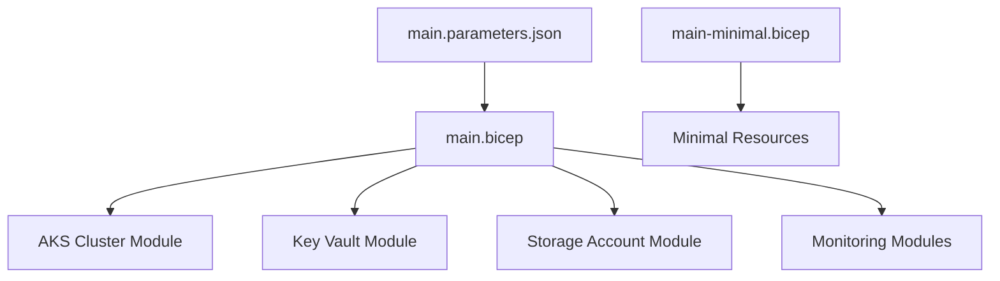
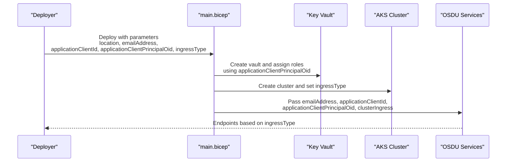
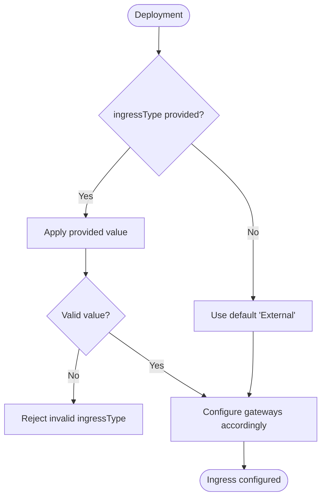
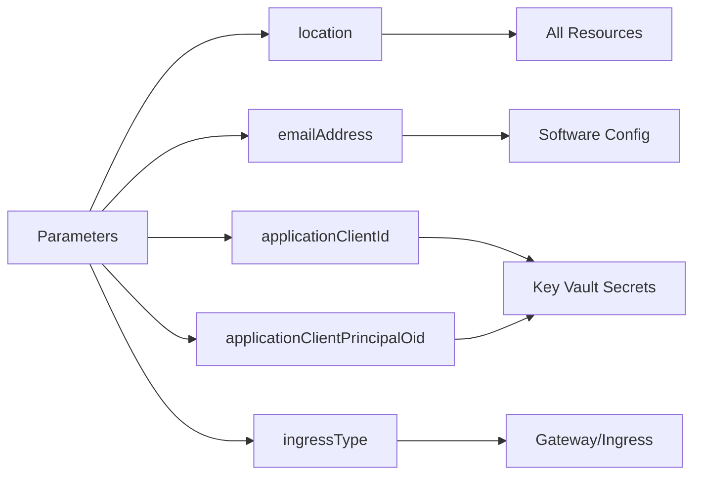

# Basic Configuration and Parameters

<cite>
**Referenced Files in This Document**
- [main.bicep](file://bicep/main.bicep)
- [main-minimal.bicep](file://bicep/main-minimal.bicep)
- [main.parameters.json](file://bicep/main.parameters.json)
- [main-minimal.parameters.json](file://bicep/main-minimal.parameters.json)
- [parameters-template.json](file://parameters-template.json)
- [getting_started.md](file://docs/src/getting_started.md)
- [README.md](file://README.md)
</cite>

## Table of Contents
1. [Introduction](#introduction)
2. [Project Structure](#project-structure)
3. [Core Components](#core-components)
4. [Architecture Overview](#architecture-overview)
5. [Detailed Component Analysis](#detailed-component-analysis)
6. [Dependency Analysis](#dependency-analysis)
7. [Performance Considerations](#performance-considerations)
8. [Troubleshooting Guide](#troubleshooting-guide)
9. [Conclusion](#conclusion)
10. [Appendices](#appendices)

## Introduction
This document explains the basic configuration parameters for the main Bicep template used to deploy the OSDU Developer environment on Azure. It focuses on top-level parameters including location, emailAddress, applicationClientId, applicationClientPrincipalOid, and ingressType. For each parameter, you will find its purpose, acceptable values, defaults, usage examples, and how it influences infrastructure deployment. Guidance is also provided for authentication setup, network ingress configuration, and environment-specific overrides.

## Project Structure
The primary entry point for full deployments is the main Bicep template, which defines core infrastructure (identity, monitoring, storage, Key Vault, AKS cluster, etc.) and passes key parameters into downstream modules. A minimal Bicep template exists for lightweight scenarios with fewer resources. Parameter files demonstrate how to supply values via environment variables or JSON templates.

**Diagram sources**
- [main.bicep:1-120](file://bicep/main.bicep#L1-L120)
- [main.parameters.json:1-83](file://bicep/main.parameters.json#L1-L83)
- [main-minimal.bicep:1-60](file://bicep/main-minimal.bicep#L1-L60)

**Section sources**
- [main.bicep:1-120](file://bicep/main.bicep#L1-L120)
- [main-minimal.bicep:1-60](file://bicep/main-minimal.bicep#L1-L60)
- [main.parameters.json:1-83](file://bicep/main.parameters.json#L1-L83)

## Core Components
This section documents the top-level parameters that control the deployment behavior and integration points.

- location
  - Purpose: Specifies the Azure region where resources are deployed.
  - Acceptable values: Any valid Azure region identifier supported by your subscription and quotas.
  - Default: In the full template, this parameter is required; in the minimal template, it defaults to the resource group’s location.
  - Usage example: Provide via environment variable AZURE_LOCATION when using the main parameters file.
  - Impact: Determines placement of all created resources; ensure sufficient quota in the chosen region.

- emailAddress
  - Purpose: Used as a contact email for services such as certificate issuance or notifications.
  - Acceptable values: A valid email address string.
  - Default: None; must be supplied when deploying the full template.
  - Usage example: Provide via EMAIL_ADDRESS environment variable in the parameters file.
  - Impact: Passed into software configuration modules; affects certificate and notification workflows.

- applicationClientId
  - Purpose: The Microsoft Entra application client ID used for authentication and authorization flows.
  - Acceptable values: A valid GUID representing an app registration’s client ID.
  - Default: None; required for full deployments.
  - Usage example: Provide via AZURE_CLIENT_ID environment variable or directly in a parameters JSON.
  - Impact: Stored in Key Vault and passed to downstream components; essential for OIDC-based authentication.

- applicationClientPrincipalOid
  - Purpose: The object ID of the service principal associated with the application; used to grant permissions (e.g., Key Vault access).
  - Acceptable values: A valid GUID representing the service principal’s object ID.
  - Default: None; optional in some paths but recommended for RBAC assignments.
  - Usage example: Provide via AZURE_CLIENT_PRINCIPAL_OID environment variable or directly in a parameters JSON.
  - Impact: Grants Key Vault Secrets User role to the application principal in the full template; enables secure secret access.

- ingressType
  - Purpose: Controls whether the Kubernetes ingress is exposed externally, internally, or both.
  - Acceptable values: External, Internal, Both, or empty string.
  - Default: External if not provided.
  - Usage example: Provide via CLUSTER_INGRESS environment variable in the parameters file.
  - Impact: Determines gateway configuration and exposure of services; affects networking and DNS setup.

**Section sources**
- [main.bicep:1-26](file://bicep/main.bicep#L1-L26)
- [main.parameters.json:4-19](file://bicep/main.parameters.json#L4-L19)
- [parameters-template.json:1-19](file://parameters-template.json#L1-L19)

## Architecture Overview
The main template orchestrates multiple modules and passes critical parameters to configure identity, networking, and software deployment. The ingressType parameter influences how traffic enters the cluster, while authentication relies on the application client ID and principal object ID to integrate with Key Vault and downstream services.

**Diagram sources**
- [main.bicep:1041-1076](file://bicep/main.bicep#L1041-L1076)
- [main.bicep:599-661](file://bicep/main.bicep#L599-L661)
- [main.bicep:353-385](file://bicep/main.bicep#L353-L385)

## Detailed Component Analysis

### Parameter: location
- Purpose: Selects the Azure region for resource deployment.
- Defaults: Required in the full template; defaults to resource group location in the minimal template.
- Environment mapping: AZURE_LOCATION in main.parameters.json.
- Example usage:
  - Via environment variable: Set AZURE_LOCATION to your desired region before running azd provision or ARM deployment.
  - Direct override: Edit parameters-template.json to set a specific region.
- Deployment impact: All resources (cluster, storage, Key Vault, monitoring) are created in this region; verify regional quotas and availability.

**Section sources**
- [main.bicep:5-7](file://bicep/main.bicep#L5-L7)
- [main-minimal.bicep:3-4](file://bicep/main-minimal.bicep#L3-L4)
- [main.parameters.json:5-7](file://bicep/main.parameters.json#L5-L7)
- [parameters-template.json:14-16](file://parameters-template.json#L14-L16)

### Parameter: emailAddress
- Purpose: Contact email for certificates and notifications.
- Defaults: None; must be provided for full deployments.
- Environment mapping: EMAIL_ADDRESS in main.parameters.json.
- Example usage:
  - Set EMAIL_ADDRESS to a valid email prior to deployment.
  - Use parameters-template.json to provide a placeholder email for initial runs.
- Deployment impact: Passed into software configuration; may affect TLS certificate provisioning and alerting.

**Section sources**
- [main.bicep:9-10](file://bicep/main.bicep#L9-L10)
- [main.parameters.json:14-16](file://bicep/main.parameters.json#L14-L16)
- [parameters-template.json:5-7](file://parameters-template.json#L5-L7)
- [main.bicep:1058-1060](file://bicep/main.bicep#L1058-L1060)

### Parameter: applicationClientId
- Purpose: Identifies the Microsoft Entra application used for authentication.
- Defaults: None; required for full deployments.
- Environment mapping: AZURE_CLIENT_ID in main.parameters.json.
- Example usage:
  - Set AZURE_CLIENT_ID to your app registration’s client ID.
  - Or edit parameters-template.json to include the client ID.
- Deployment impact: Stored in Key Vault and passed to services; necessary for OIDC flows and service-to-service auth.

**Section sources**
- [main.bicep:12-13](file://bicep/main.bicep#L12-L13)
- [main.parameters.json:8-10](file://bicep/main.parameters.json#L8-L10)
- [parameters-template.json:8-10](file://parameters-template.json#L8-L10)
- [main.bicep:558-560](file://bicep/main.bicep#L558-L560)
- [main.bicep:1059-1060](file://bicep/main.bicep#L1059-L1060)

### Parameter: applicationClientPrincipalOid
- Purpose: Object ID of the service principal for permission grants (e.g., Key Vault access).
- Defaults: None; optional but recommended for RBAC assignments.
- Environment mapping: AZURE_CLIENT_PRINCIPAL_OID in main.parameters.json.
- Example usage:
  - Set AZURE_CLIENT_PRINCIPAL_OID to the service principal’s object ID.
  - Or edit parameters-template.json to include the object ID.
- Deployment impact: Grants Key Vault Secrets User role to the application principal; enables secure secret retrieval at runtime.

**Section sources**
- [main.bicep:15-16](file://bicep/main.bicep#L15-L16)
- [main.parameters.json:11-13](file://bicep/main.parameters.json#L11-L13)
- [parameters-template.json:11-13](file://parameters-template.json#L11-L13)
- [main.bicep:622-637](file://bicep/main.bicep#L622-L637)

### Parameter: ingressType
- Purpose: Controls exposure of the Kubernetes ingress (external, internal, both).
- Acceptable values: External, Internal, Both, or empty string.
- Defaults: External if not provided.
- Environment mapping: CLUSTER_INGRESS in main.parameters.json.
- Example usage:
  - Set CLUSTER_INGRESS to Internal for private-only access.
  - Set CLUSTER_INGRESS to Both to expose external and internal gateways.
  - Leave empty to use default External behavior.
- Deployment impact: Influences gateway creation and service exposure; affects DNS and firewall rules.

**Diagram sources**
- [main.bicep:18-25](file://bicep/main.bicep#L18-L25)
- [main.bicep:1072-1072](file://bicep/main.bicep#L1072-L1072)

**Section sources**
- [main.bicep:18-25](file://bicep/main.bicep#L18-L25)
- [main.parameters.json:17-19](file://bicep/main.parameters.json#L17-L19)
- [main.bicep:1072-1072](file://bicep/main.bicep#L1072-L1072)

## Dependency Analysis
The parameters influence multiple downstream modules and resources:

- location affects all resource placements.
- emailAddress is passed into software configuration modules.
- applicationClientId and applicationClientPrincipalOid are stored in Key Vault and used for authentication and RBAC.
- ingressType determines gateway configuration and service exposure.

**Diagram sources**
- [main.bicep:1041-1076](file://bicep/main.bicep#L1041-L1076)
- [main.bicep:599-661](file://bicep/main.bicep#L599-L661)
- [main.bicep:353-385](file://bicep/main.bicep#L353-L385)

**Section sources**
- [main.bicep:1041-1076](file://bicep/main.bicep#L1041-L1076)
- [main.bicep:599-661](file://bicep/main.bicep#L599-L661)
- [main.bicep:353-385](file://bicep/main.bicep#L353-L385)

## Performance Considerations
- Ensure sufficient vCPU quotas in the selected region; consult the getting started guide for recommended minimums.
- Choose ingressType based on performance needs: external ingress may add latency due to public endpoints; internal ingress can reduce exposure and improve security posture.
- Monitor resource utilization post-deployment and adjust cluster node pools as needed.

[No sources needed since this section provides general guidance]

## Troubleshooting Guide
Common issues and resolutions related to basic parameters:

- Missing or invalid applicationClientId/applicationClientPrincipalOid
  - Symptom: Authentication failures or Key Vault access denied.
  - Resolution: Verify the values match your Microsoft Entra app registration and service principal; ensure correct tenant context during deployment.

- Incorrect emailAddress
  - Symptom: Certificate issuance or notifications fail.
  - Resolution: Provide a valid email; check logs for issuer responses.

- ingressType misconfiguration
  - Symptom: Services unreachable or unexpectedly exposed.
  - Resolution: Confirm CLUSTER_INGRESS matches intended exposure; validate gateway and DNS settings.

- Region quota constraints
  - Symptom: Deployment fails due to insufficient compute or Cosmos DB availability.
  - Resolution: Request quota increases or choose a different region per the getting started guide.

**Section sources**
- [getting_started.md:131-169](file://docs/src/getting_started.md#L131-L169)
- [main.bicep:622-637](file://bicep/main.bicep#L622-L637)
- [main.bicep:1072-1072](file://bicep/main.bicep#L1072-L1072)

## Conclusion
The top-level parameters in the main Bicep template define the foundational configuration for deploying OSDU on Azure. Correctly setting location, emailAddress, applicationClientId, applicationClientPrincipalOid, and ingressType ensures proper resource placement, secure authentication, and appropriate network exposure. Use environment variables or parameter templates to manage environment-specific overrides and streamline deployments across development, staging, and production.

[No sources needed since this section summarizes without analyzing specific files]

## Appendices

### Environment-Specific Parameter Overrides
- Use main.parameters.json to map environment variables to parameter values:
  - AZURE_LOCATION -> location
  - EMAIL_ADDRESS -> emailAddress
  - AZURE_CLIENT_ID -> applicationClientId
  - AZURE_CLIENT_PRINCIPAL_OID -> applicationClientPrincipalOid
  - CLUSTER_INGRESS -> ingressType
- For minimal deployments, use main-minimal.parameters.json to supply only required values.

**Section sources**
- [main.parameters.json:4-19](file://bicep/main.parameters.json#L4-L19)
- [main-minimal.parameters.json:4-16](file://bicep/main-minimal.parameters.json#L4-L16)

### Practical Deployment Scenarios
- Development (external ingress):
  - Set CLUSTER_INGRESS to External or leave empty to use default.
  - Provide emailAddress, applicationClientId, and applicationClientPrincipalOid.
  - Use a public region with sufficient quotas.

- Staging (internal ingress):
  - Set CLUSTER_INGRESS to Internal to restrict access to private networks.
  - Ensure internal DNS and routing are configured for service discovery.

- Production (both ingresses):
  - Set CLUSTER_INGRESS to Both to expose services externally while maintaining internal access.
  - Review security policies and firewall rules to protect external endpoints.

[No sources needed since this section provides conceptual guidance]