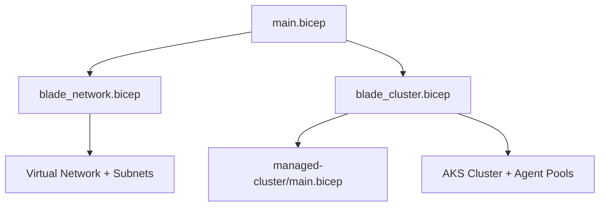
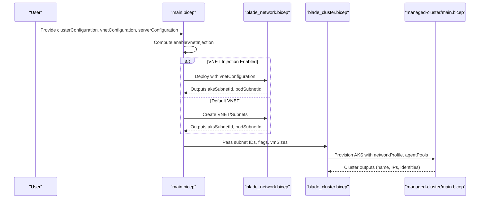
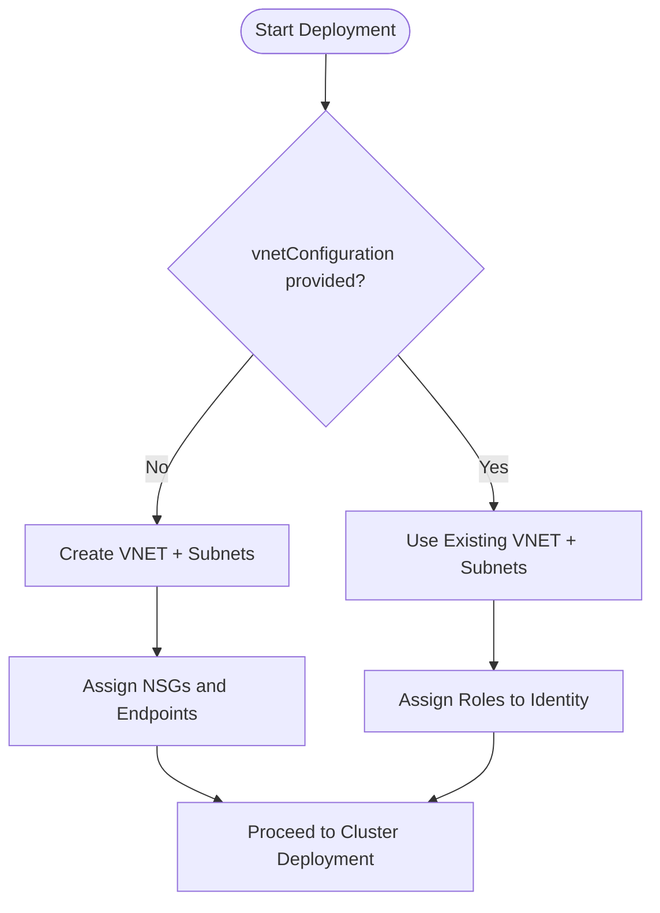
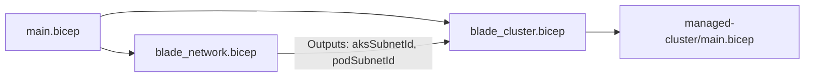

# Cluster and Network Configuration

<cite>
**Referenced Files in This Document**
- [main.bicep](file://bicep/main.bicep)
- [blade_cluster.bicep](file://bicep/modules/blade_cluster.bicep)
- [blade_network.bicep](file://bicep/modules/blade_network.bicep)
- [managed-cluster/main.bicep](file://bicep/modules/managed-cluster/main.bicep)
- [advanced_vnet.md](file://docs/src/advanced_vnet.md)
- [design_infrastructure.md](file://docs/src/design_infrastructure.md)
- [main.parameters.json](file://bicep/main.parameters.json)
</cite>

## Table of Contents
1. Introduction
2. Project Structure
3. Core Components
4. Architecture Overview
5. Detailed Component Analysis
6. Dependency Analysis
7. Performance Considerations
8. Troubleshooting Guide
9. Conclusion
10. Appendices

## Introduction
This document explains cluster and network configuration options for deploying an Azure Kubernetes Service (AKS) cluster within this repository’s infrastructure-as-code (IaC). It focuses on:
- clusterConfiguration parameters for node auto-provisioning, private cluster settings, and lockdown options
- vnetConfiguration structure for bring-your-own-VNET scenarios and subnet configurations for AKS nodes, pods, VMs, and bastion
- serverConfiguration for node pool sizing and types
- Networking best practices, VNET injection scenarios, private cluster deployments, and performance tuning recommendations for different workload types

## Project Structure
The deployment is orchestrated by a top-level Bicep file that composes modular “blades” for networking and cluster resources. The cluster blade provisions the AKS cluster with configurable networking, security, and autoscaling. The network blade creates or integrates with a Virtual Network and subnets, including optional pod subnets and NSGs when not using BYO VNET.

**Diagram sources**
- [main.bicep:296-385](file://bicep/main.bicep#L296-L385)
- [blade_cluster.bicep:103-265](file://bicep/modules/blade_cluster.bicep#L103-L265)
- [blade_network.bicep:237-287](file://bicep/modules/blade_network.bicep#L237-L287)

**Section sources**
- [main.bicep:46-92](file://bicep/main.bicep#L46-L92)
- [design_infrastructure.md:14-42](file://docs/src/design_infrastructure.md#L14-L42)

## Core Components
- clusterConfiguration: Controls node auto-provisioning, private cluster enablement, and node resource group lockdown.
- vnetConfiguration: Defines bring-your-own-VNET integration and subnet definitions for AKS nodes, pods, VMs, and bastion.
- serverConfiguration: Sets VM sizes for system and user node pools to tune capacity and cost.

Key parameter locations:
- Top-level parameters and defaults: [main.bicep:46-81](file://bicep/main.bicep#L46-L81)
- Parameter mapping from environment: [main.parameters.json:26-63](file://bicep/main.parameters.json#L26-L63)

**Section sources**
- [main.bicep:46-92](file://bicep/main.bicep#L46-L92)
- [main.parameters.json:26-63](file://bicep/main.parameters.json#L26-L63)

## Architecture Overview
The main Bicep file computes whether VNET injection is enabled based on vnetConfiguration fields and conditionally deploys the network blade. The cluster blade then consumes subnet IDs and applies networking, security, and autoscaling settings to the AKS cluster.

**Diagram sources**
- [main.bicep:91-92](file://bicep/main.bicep#L91-L92)
- [main.bicep:296-385](file://bicep/main.bicep#L296-L385)
- [blade_network.bicep:237-297](file://bicep/modules/blade_network.bicep#L237-L297)
- [blade_cluster.bicep:103-265](file://bicep/modules/blade_cluster.bicep#L103-L265)
- [managed-cluster/main.bicep:556-735](file://bicep/modules/managed-cluster/main.bicep#L556-L735)

## Detailed Component Analysis

### clusterConfiguration Parameters
Controls core cluster behavior:
- enableNodeAutoProvisioning: Enables/disables AKS Node Auto Provisioning (NAP). When true, the cluster relies on NAP rather than fixed-size agent pools.
- enablePrivateCluster: Creates a private API server endpoint; controls access via private DNS and restricted public exposure.
- enableLockDown: Locks down the node resource group to prevent accidental deletion.

Behavioral mapping:
- Top-level defaults and overrides: [main.bicep:46-51](file://bicep/main.bicep#L46-L51)
- Mapping to cluster blade: [main.bicep:368-370](file://bicep/main.bicep#L368-L370)
- Cluster blade usage: [blade_cluster.bicep:50-57](file://bicep/modules/blade_cluster.bicep#L50-L57), [blade_cluster.bicep:159-165](file://bicep/modules/blade_cluster.bicep#L159-L165)
- Private cluster and access profile in managed cluster module: [managed-cluster/main.bicep:156-163](file://bicep/modules/managed-cluster/main.bicep#L156-L163), [managed-cluster/main.bicep:729-735](file://bicep/modules/managed-cluster/main.bicep#L729-L735)

Recommendations:
- Use enablePrivateCluster for production environments requiring restricted API server access.
- Enable enableLockDown to protect node resource groups from accidental changes.
- Use enableNodeAutoProvisioning for dynamic scaling; otherwise configure explicit min/max counts on agent pools.

**Section sources**
- [main.bicep:46-51](file://bicep/main.bicep#L46-L51)
- [main.bicep:368-370](file://bicep/main.bicep#L368-L370)
- [blade_cluster.bicep:50-57](file://bicep/modules/blade_cluster.bicep#L50-L57)
- [blade_cluster.bicep:159-165](file://bicep/modules/blade_cluster.bicep#L159-L165)
- [managed-cluster/main.bicep:156-163](file://bicep/modules/managed-cluster/main.bicep#L156-L163)
- [managed-cluster/main.bicep:729-735](file://bicep/modules/managed-cluster/main.bicep#L729-L735)

### vnetConfiguration Structure and BYO VNET
Defines how the deployment integrates with an existing Virtual Network or creates one:
- group, name, prefix: Identify the target VNET when bringing your own.
- identityId: Managed identity used for network operations.
- aksSubnet, podSubnet, vmSubnet, bastionSubnet: Subnet names and address prefixes.

Behavioral mapping:
- Top-level parameter definition: [main.bicep:59-81](file://bicep/main.bicep#L59-L81)
- VNET injection flag computation: [main.bicep:91-92](file://bicep/main.bicep#L91-L92)
- Conditional network blade invocation and parameter passing: [main.bicep:296-336](file://bicep/main.bicep#L296-L336)
- Network blade default vs BYO logic and outputs: [blade_network.bicep:37-49](file://bicep/modules/blade_network.bicep#L37-L49), [blade_network.bicep:294-297](file://bicep/modules/blade_network.bicep#L294-L297)
- Subnet service endpoints and NSG assignment: [blade_network.bicep:158-194](file://bicep/modules/blade_network.bicep#L158-L194)

BYO VNET scenario steps:
- Pre-create VNET and required subnets (AKS node subnet, optional pod subnet, optional VM/bastion subnets).
- Assign a managed identity with Network Contributor role to the VNET scope.
- Set vnetConfiguration.group/name/prefix and identityId to point to the existing VNET.
- Optionally enable pod subnet for Azure CNI dynamic IP allocation.

Best practices:
- Size subnets adequately: minimum size formula considers nodes and max pods per node.
- Use service endpoints on the AKS node subnet for Storage, Key Vault, and Container Registry.
- Apply NSGs only when not using BYO VNET; otherwise manage NSGs externally.

**Section sources**
- [main.bicep:59-92](file://bicep/main.bicep#L59-L92)
- [main.bicep:296-336](file://bicep/main.bicep#L296-L336)
- [blade_network.bicep:37-49](file://bicep/modules/blade_network.bicep#L37-L49)
- [blade_network.bicep:158-194](file://bicep/modules/blade_network.bicep#L158-L194)
- [blade_network.bicep:294-297](file://bicep/modules/blade_network.bicep#L294-L297)
- [advanced_vnet.md:6-67](file://docs/src/advanced_vnet.md#L6-L67)

### serverConfiguration for Node Pool Sizing and Types
Controls VM sizes for system and user node pools:
- systemPool: VM size for the system pool (hosting critical addons).
- userPool: VM size for the user pool (running application workloads).

Behavioral mapping:
- Top-level parameter definition: [main.bicep:53-57](file://bicep/main.bicep#L53-L57)
- Passing to cluster blade: [main.bicep:378-379](file://bicep/main.bicep#L378-L379)
- Cluster blade parameters and usage: [blade_cluster.bicep:20-26](file://bicep/modules/blade_cluster.bicep#L20-L26), [blade_cluster.bicep:219-263](file://bicep/modules/blade_cluster.bicep#L219-L263)
- Agent pool profiles in managed cluster module: [managed-cluster/main.bicep:1037-1074](file://bicep/modules/managed-cluster/main.bicep#L1037-L1074)

Guidance:
- Start with small burstable VMs for development and scale up to compute-optimized families for production.
- Separate system and user pools to isolate control plane components from workload traffic.
- Combine with autoscaling (either NAP or explicit min/max) to match demand.

**Section sources**
- [main.bicep:53-57](file://bicep/main.bicep#L53-L57)
- [main.bicep:378-379](file://bicep/main.bicep#L378-L379)
- [blade_cluster.bicep:20-26](file://bicep/modules/blade_cluster.bicep#L20-L26)
- [blade_cluster.bicep:219-263](file://bicep/modules/blade_cluster.bicep#L219-L263)
- [managed-cluster/main.bicep:1037-1074](file://bicep/modules/managed-cluster/main.bicep#L1037-L1074)

### Networking Best Practices
- Choose appropriate network plugin and dataplane:
  - Azure CNI overlay for simple setups without pod subnet.
  - Azure CNI with dedicated pod subnet for dynamic IP allocation and advanced networking.
- Outbound connectivity:
  - Use managed NAT Gateway or load balancer outbound depending on egress requirements.
- Security:
  - Restrict API server access via private cluster and authorized IP ranges.
  - Apply NSGs to subnets when not using BYO VNET; otherwise manage NSGs centrally.
- Observability:
  - Enable container insights and diagnostic settings to monitor performance and issues.

References:
- Network planning and CIDR guidance: [advanced_vnet.md:6-67](file://docs/src/advanced_vnet.md#L6-L67)
- Network blade defaults and NSG rules: [blade_network.bicep:52-156](file://bicep/modules/blade_network.bicep#L52-L156)
- Outbound type and load balancer settings: [managed-cluster/main.bicep:52-80](file://bicep/modules/managed-cluster/main.bicep#L52-L80)

**Section sources**
- [advanced_vnet.md:6-67](file://docs/src/advanced_vnet.md#L6-L67)
- [blade_network.bicep:52-156](file://bicep/modules/blade_network.bicep#L52-L156)
- [managed-cluster/main.bicep:52-80](file://bicep/modules/managed-cluster/main.bicep#L52-L80)

### VNET Injection Scenarios
- Default VNET creation:
  - When vnetConfiguration is empty, the network blade creates a VNET and subnets with service endpoints and NSGs.
- Bring-your-own-VNET:
  - Provide group/name/prefix and identityId; the deployment reuses existing VNET/subnets and assigns necessary roles.

Flow:

**Diagram sources**
- [main.bicep:91-92](file://bicep/main.bicep#L91-L92)
- [main.bicep:296-336](file://bicep/main.bicep#L296-L336)
- [blade_network.bicep:37-49](file://bicep/modules/blade_network.bicep#L37-L49)
- [blade_network.bicep:158-194](file://bicep/modules/blade_network.bicep#L158-L194)

**Section sources**
- [main.bicep:91-92](file://bicep/main.bicep#L91-L92)
- [main.bicep:296-336](file://bicep/main.bicep#L296-L336)
- [blade_network.bicep:37-49](file://bicep/modules/blade_network.bicep#L37-L49)
- [blade_network.bicep:158-194](file://bicep/modules/blade_network.bicep#L158-L194)

### Private Cluster Deployments
- Enable private cluster to restrict API server to internal networks.
- Configure private DNS zone or use public FQDN if needed.
- Ensure management tools can reach the cluster via private endpoints or VPN/ExpressRoute.

References:
- Private cluster parameters and API server access profile: [managed-cluster/main.bicep:156-163](file://bicep/modules/managed-cluster/main.bicep#L156-L163), [managed-cluster/main.bicep:729-735](file://bicep/modules/managed-cluster/main.bicep#L729-L735)
- Cluster blade enabling private cluster: [blade_cluster.bicep:159-165](file://bicep/modules/blade_cluster.bicep#L159-L165)

**Section sources**
- [managed-cluster/main.bicep:156-163](file://bicep/modules/managed-cluster/main.bicep#L156-L163)
- [managed-cluster/main.bicep:729-735](file://bicep/modules/managed-cluster/main.bicep#L729-L735)
- [blade_cluster.bicep:159-165](file://bicep/modules/blade_cluster.bicep#L159-L165)

### Performance Tuning Recommendations
- Autoscaling:
  - Use Node Auto Provisioning for elastic scaling across node pools.
  - Alternatively, set explicit min/max counts on agent pools and enable vertical pod autoscaler (VPA) and KEDA where applicable.
- Network performance:
  - Prefer Azure CNI with pod subnet for high throughput and direct IP addressing.
  - Tune outboundType and load balancer SKU/outbound IPs for egress-heavy workloads.
- Monitoring and optimization:
  - Enable container insights and metrics collection for observability.
  - Right-size VM families per workload (compute-optimized for CPU-bound, memory-optimized for memory-bound).

References:
- Autoscaling and addons: [blade_cluster.bicep:196-199](file://bicep/modules/blade_cluster.bicep#L196-L199)
- Network profile and outbound settings: [managed-cluster/main.bicep:52-80](file://bicep/modules/managed-cluster/main.bicep#L52-L80), [managed-cluster/main.bicep:670-696](file://bicep/modules/managed-cluster/main.bicep#L670-L696)
- Monitoring and metrics: [managed-cluster/main.bicep:736-755](file://bicep/modules/managed-cluster/main.bicep#L736-L755)

**Section sources**
- [blade_cluster.bicep:196-199](file://bicep/modules/blade_cluster.bicep#L196-L199)
- [managed-cluster/main.bicep:52-80](file://bicep/modules/managed-cluster/main.bicep#L52-L80)
- [managed-cluster/main.bicep:670-696](file://bicep/modules/managed-cluster/main.bicep#L670-L696)
- [managed-cluster/main.bicep:736-755](file://bicep/modules/managed-cluster/main.bicep#L736-L755)

## Dependency Analysis
The main Bicep file orchestrates dependencies between networking and cluster modules. The network blade must be deployed first when BYO VNET is used to provide subnet IDs. The cluster blade depends on these outputs and configures the AKS cluster accordingly.

**Diagram sources**
- [main.bicep:296-385](file://bicep/main.bicep#L296-L385)
- [blade_network.bicep:294-297](file://bicep/modules/blade_network.bicep#L294-L297)
- [blade_cluster.bicep:103-265](file://bicep/modules/blade_cluster.bicep#L103-L265)

**Section sources**
- [main.bicep:296-385](file://bicep/main.bicep#L296-L385)
- [blade_network.bicep:294-297](file://bicep/modules/blade_network.bicep#L294-L297)
- [blade_cluster.bicep:103-265](file://bicep/modules/blade_cluster.bicep#L103-L265)

## Performance Considerations
- Select VM sizes aligned with workload characteristics (CPU/memory/disk I/O).
- Use separate system and user pools to isolate control plane and workload traffic.
- Enable autoscaling (NAP or explicit pool limits) to handle variable loads efficiently.
- Optimize network plugin and outbound connectivity for expected traffic patterns.
- Monitor with container insights and adjust resources based on observed utilization.

[No sources needed since this section provides general guidance]

## Troubleshooting Guide
Common issues and checks:
- VNET injection failures:
  - Verify vnetConfiguration.group/name/prefix and identityId are correct.
  - Ensure the managed identity has Network Contributor role on the VNET.
  - Confirm subnets exist and have sufficient IP space.
- Private cluster access:
  - Validate private DNS resolution and firewall rules allowing API server access.
  - Check authorized IP ranges if restricting management access.
- Outbound connectivity:
  - Review outboundType and load balancer/NAT gateway configuration.
  - Ensure service endpoints are enabled on the AKS node subnet for Storage/KeyVault/ACR.
- Autoscaling:
  - If using explicit pools, verify min/max counts and availability zones.
  - If using NAP, check quota limits and node pool constraints.

References:
- Network blade outputs and conditions: [blade_network.bicep:294-297](file://bicep/modules/blade_network.bicep#L294-L297)
- Cluster blade network and access settings: [blade_cluster.bicep:153-165](file://bicep/modules/blade_cluster.bicep#L153-L165)
- Managed cluster network profile and API server access: [managed-cluster/main.bicep:670-696](file://bicep/modules/managed-cluster/main.bicep#L670-L696), [managed-cluster/main.bicep:729-735](file://bicep/modules/managed-cluster/main.bicep#L729-L735)

**Section sources**
- [blade_network.bicep:294-297](file://bicep/modules/blade_network.bicep#L294-L297)
- [blade_cluster.bicep:153-165](file://bicep/modules/blade_cluster.bicep#L153-L165)
- [managed-cluster/main.bicep:670-696](file://bicep/modules/managed-cluster/main.bicep#L670-L696)
- [managed-cluster/main.bicep:729-735](file://bicep/modules/managed-cluster/main.bicep#L729-L735)

## Conclusion
This repository provides a flexible, modular approach to deploying AKS clusters with strong networking and security controls. By configuring clusterConfiguration, vnetConfiguration, and serverConfiguration appropriately, you can tailor deployments to meet diverse workload requirements, from development to production-grade private clusters with optimized performance and secure networking.

[No sources needed since this section summarizes without analyzing specific files]

## Appendices

### Parameter Reference Summary
- clusterConfiguration:
  - enableNodeAutoProvisioning: bool
  - enablePrivateCluster: bool
  - enableLockDown: bool
- vnetConfiguration:
  - group, name, prefix: string
  - identityId: string
  - aksSubnet.name, aksSubnet.prefix: string
  - podSubnet.name, podSubnet.prefix: string
  - vmSubnet.name, vmSubnet.prefix: string
  - bastionSubnet.name, bastionSubnet.prefix: string
- serverConfiguration:
  - systemPool: string (VM size)
  - userPool: string (VM size)

References:
- [main.bicep:46-81](file://bicep/main.bicep#L46-L81)
- [main.parameters.json:26-63](file://bicep/main.parameters.json#L26-L63)

**Section sources**
- [main.bicep:46-81](file://bicep/main.bicep#L46-L81)
- [main.parameters.json:26-63](file://bicep/main.parameters.json#L26-L63)