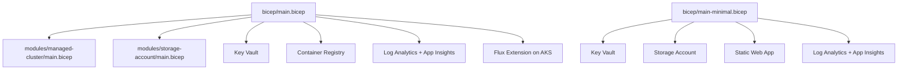
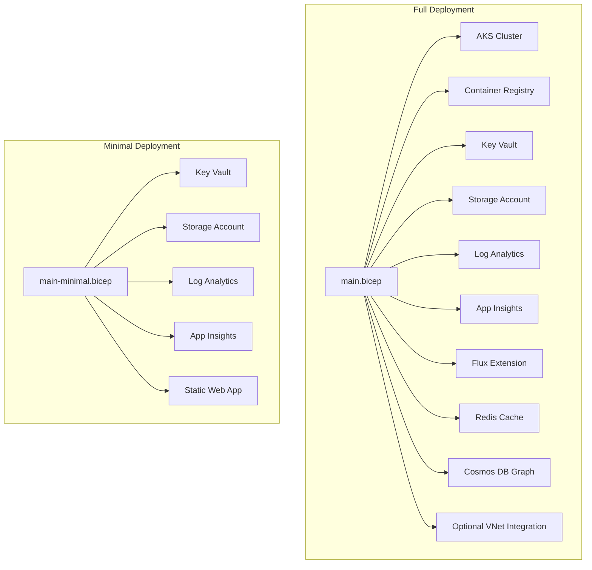
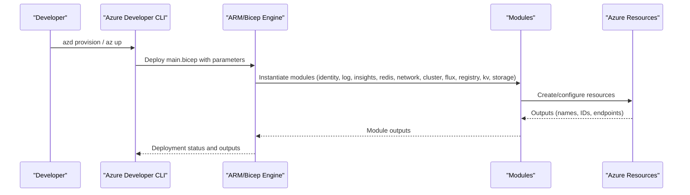
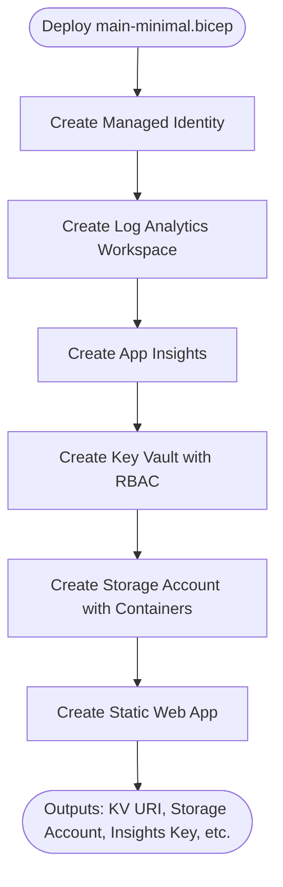
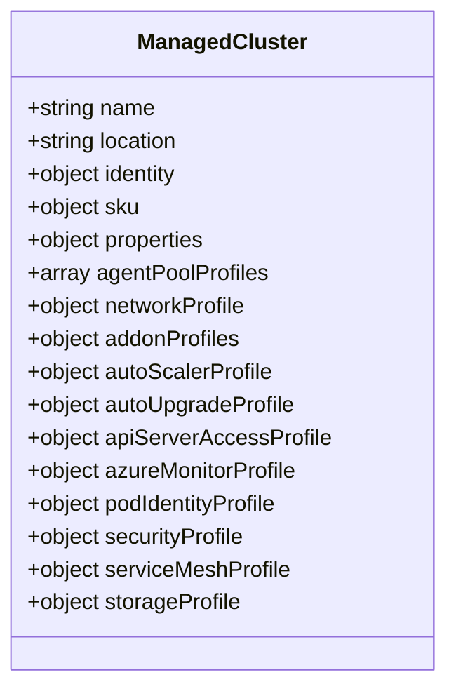
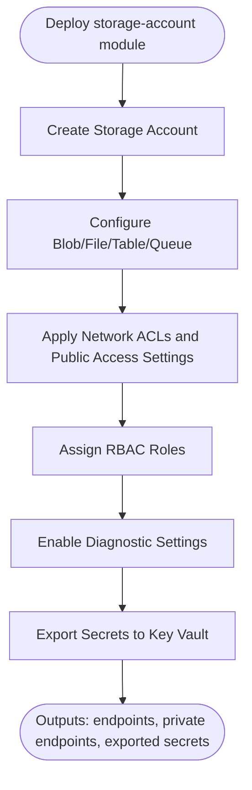
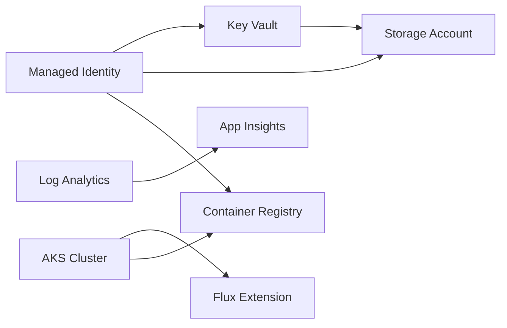

# Deployment Scenarios and Examples

<cite>
**Referenced Files in This Document**
- [main.bicep](file://bicep/main.bicep)
- [main-minimal.bicep](file://bicep/main-minimal.bicep)
- [main.parameters.json](file://bicep/main.parameters.json)
- [main-minimal.parameters.json](file://bicep/main-minimal.parameters.json)
- [parameters.json](file://parameters.json)
- [parameters-template.json](file://parameters-template.json)
- [parameters-eastus2.json](file://parameters-eastus2.json)
- [parameters-eastus2-minimal.json](file://parameters-eastus2-minimal.json)
- [getting_started.md](file://docs/src/getting_started.md)
- [tutorial_cli.md](file://docs/src/tutorial_cli.md)
- [advanced_vnet.md](file://docs/src/advanced_vnet.md)
- [feature_flags.md](file://docs/src/feature_flags.md)
- [README.md](file://README.md)
- [DEPLOYMENT_SUMMARY.md](file://DEPLOYMENT_SUMMARY.md)
- [fix-compliance.sh](file://fix-compliance.sh)
- [managed-cluster/main.bicep](file://bicep/modules/managed-cluster/main.bicep)
- [storage-account/main.bicep](file://bicep/modules/storage-account/main.bicep)
</cite>

## Table of Contents
1. Introduction
2. Project Structure
3. Core Components
4. Architecture Overview
5. Detailed Component Analysis
6. Dependency Analysis
7. Performance Considerations
8. Troubleshooting Guide
9. Conclusion
10. Appendices

## Introduction
This document explains the deployment scenarios supported by the main templates, compares minimal versus full deployments, and provides step-by-step instructions for development, testing, and production-like environments. It includes parameter examples, scaling considerations, cost optimization strategies, compliance requirements, expected outcomes, and validation steps.

The repository supports two primary infrastructure templates:
- Full OSDU deployment (AKS-based platform with observability, storage, Key Vault, container registry, and optional VNet integration)
- Minimal deployment (lightweight foundation with identity, logging, Key Vault, storage, and a static web app)

These are driven by Bicep templates and parameter files, with Azure Developer CLI (azd) workflows documented for end-to-end provisioning and configuration.

**Section sources**
- [README.md:16-22](file://README.md#L16-L22)
- [getting_started.md:1-10](file://docs/src/getting_started.md#L1-L10)

## Project Structure
At a high level:
- bicep/main.bicep: Full deployment template orchestrating AKS, networking, storage, Key Vault, container registry, monitoring, and Flux extension for GitOps-driven software delivery.
- bicep/main-minimal.bicep: Minimal deployment template providing identity, Log Analytics, Application Insights, Key Vault, Storage Account, and Static Web App.
- Parameter files under bicep/ and root-level parameters-*.json define environment-specific values.
- docs/* provide tutorials and prerequisites for deployment via azd and portal.

**Diagram sources**
- [main.bicep:166-800](file://bicep/main.bicep#L166-L800)
- [main-minimal.bicep:26-252](file://bicep/main-minimal.bicep#L26-L252)
- [managed-cluster/main.bicep:556-800](file://bicep/modules/managed-cluster/main.bicep#L556-L800)
- [storage-account/main.bicep:351-451](file://bicep/modules/storage-account/main.bicep#L351-L451)

**Section sources**
- [main.bicep:1-153](file://bicep/main.bicep#L1-L153)
- [main-minimal.bicep:1-252](file://bicep/main-minimal.bicep#L1-L252)

## Core Components
- Identity and Access: User-assigned managed identity used across resources; RBAC roles assigned to Key Vault, Storage, and Container Registry.
- Compute and Orchestration: AKS cluster with configurable node pools, autoscaling, and optional private cluster mode; Flux extension enables GitOps-based application delivery.
- Data and Storage: Storage account with blob/file/table/queue services; optional Cosmos DB graph database configured for entitlements.
- Observability: Log Analytics workspace and Application Insights component with diagnostic settings.
- Secrets Management: Key Vault storing runtime secrets and service endpoints; secrets exported from storage and other resources.
- Networking: Optional Bring Your Own VNet with AKS and pod subnets; network ACLs for Key Vault and Storage.

Key differences between full and minimal:
- Full: AKS cluster, Redis cache, container registry, Flux extension, extensive storage services, and advanced networking options.
- Minimal: No AKS or Redis; focuses on identity, logging, Key Vault, storage, and a static web app.

**Section sources**
- [main.bicep:166-800](file://bicep/main.bicep#L166-L800)
- [main-minimal.bicep:26-252](file://bicep/main-minimal.bicep#L26-L252)
- [DEPLOYMENT_SUMMARY.md:46-100](file://DEPLOYMENT_SUMMARY.md#L46-L100)

## Architecture Overview
The full deployment composes multiple Azure services orchestrated by the main template. The minimal deployment simplifies this to essential building blocks.

**Diagram sources**
- [main.bicep:166-800](file://bicep/main.bicep#L166-L800)
- [main-minimal.bicep:26-252](file://bicep/main-minimal.bicep#L26-L252)

## Detailed Component Analysis

### Full Deployment Template (main.bicep)
- Parameters: region, email, Entra app client id/object id, ingress type, software overrides, cluster configuration, server VM sizes, VNet bring-your-own-network.
- Modules:
  - Managed Identity: stamp identity for resource access.
  - Log Analytics and App Insights: telemetry and diagnostics.
  - Redis Cache: Basic SKU for caching.
  - Network Blade: Conditional VNet injection with AKS/pod subnets.
  - Cluster Blade: AKS cluster with autoscaling, private cluster option, and node pool sizing.
  - Flux Extension: Enables GitOps controllers on AKS.
  - Container Registry: ACR with pull permissions for cluster and identity.
  - Key Vault: RBAC, network ACLs, secrets populated at deploy time.
  - Storage Account: Blob/file/table/queue services, role assignments, network ACLs, secrets export to Key Vault.
  - Cosmos DB Graph: Entitlements graph with indexing and throughput.

**Diagram sources**
- [main.bicep:166-800](file://bicep/main.bicep#L166-L800)
- [tutorial_cli.md:104-116](file://docs/src/tutorial_cli.md#L104-L116)

**Section sources**
- [main.bicep:1-153](file://bicep/main.bicep#L1-L153)
- [main.bicep:166-800](file://bicep/main.bicep#L166-L800)

### Minimal Deployment Template (main-minimal.bicep)
- Parameters: location, Entra app client id/object id, telemetry flag.
- Modules:
  - Managed Identity: stamp identity.
  - Log Analytics and App Insights: telemetry and diagnostics.
  - Key Vault: RBAC and diagnostic settings.
  - Storage Account: Blob containers with public access disabled.
  - Static Web App: Free SKU for simple hosting.

**Diagram sources**
- [main-minimal.bicep:26-252](file://bicep/main-minimal.bicep#L26-L252)

**Section sources**
- [main-minimal.bicep:1-252](file://bicep/main-minimal.bicep#L1-L252)

### AKS Module (managed-cluster/main.bicep)
- Configurable SKUs, tiers, addons (policy, dashboard, keyvault secrets provider), networking (plugins, policies, outbound types), autoscaler profiles, security (defender, image cleaner), and monitoring integrations.
- Supports private clusters, OIDC/workload identity, and service mesh profiles.

**Diagram sources**
- [managed-cluster/main.bicep:556-800](file://bicep/modules/managed-cluster/main.bicep#L556-L800)

**Section sources**
- [managed-cluster/main.bicep:1-400](file://bicep/modules/managed-cluster/main.bicep#L1-L400)
- [managed-cluster/main.bicep:556-800](file://bicep/modules/managed-cluster/main.bicep#L556-L800)

### Storage Account Module (storage-account/main.bicep)
- Provides blob/file/table/queue services, network ACLs, encryption, lifecycle policies, local users for SFTP, and secrets export to Key Vault.
- Role assignments and diagnostic settings integrated.

**Diagram sources**
- [storage-account/main.bicep:351-451](file://bicep/modules/storage-account/main.bicep#L351-L451)
- [storage-account/main.bicep:648-701](file://bicep/modules/storage-account/main.bicep#L648-L701)

**Section sources**
- [storage-account/main.bicep:1-190](file://bicep/modules/storage-account/main.bicep#L1-L190)
- [storage-account/main.bicep:351-451](file://bicep/modules/storage-account/main.bicep#L351-L451)
- [storage-account/main.bicep:648-701](file://bicep/modules/storage-account/main.bicep#L648-L701)

## Dependency Analysis
- Full deployment dependencies:
  - AKS depends on managed identity and Log Analytics.
  - Flux extension depends on AKS.
  - Container Registry requires pull roles for cluster and identity.
  - Key Vault requires RBAC and network ACLs; secrets depend on created resources.
  - Storage Account requires role assignments and optionally integrates with Key Vault for secrets export.
- Minimal deployment dependencies:
  - Key Vault depends on managed identity.
  - Storage Account depends on managed identity for role assignment.
  - Static Web App depends on identity for contributor role.

**Diagram sources**
- [main.bicep:166-800](file://bicep/main.bicep#L166-L800)
- [main-minimal.bicep:26-252](file://bicep/main-minimal.bicep#L26-L252)

**Section sources**
- [main.bicep:166-800](file://bicep/main.bicep#L166-L800)
- [main-minimal.bicep:26-252](file://bicep/main-minimal.bicep#L26-L252)

## Performance Considerations
- Node Pools and Autoscaling:
  - Use appropriate VM sizes for system and user pools; consider burstable vs. dedicated families based on workload patterns.
  - Enable node auto-provisioning for dynamic scaling when needed; configure autoscaler thresholds and delays to balance responsiveness and cost.
- Networking:
  - Private clusters reduce exposure but require careful DNS and egress configuration.
  - Pod subnets enable advanced networking and isolation.
- Storage:
  - Choose storage SKU and tier aligned with performance needs; enable lifecycle policies for cost optimization.
  - Use private endpoints where possible to minimize data transfer costs and improve security posture.
- Observability:
  - Configure diagnostic settings to capture critical metrics and logs; tune retention to control costs.
- Container Registry:
  - Select SKU based on features required (e.g., geo-replication); ensure pull permissions are set for AKS nodes and identities.

[No sources needed since this section provides general guidance]

## Troubleshooting Guide
Common issues and resolutions:
- Quota Limits:
  - Ensure sufficient vCPU quotas per region for desired VM families; check availability using provided commands.
- Feature Flags and Preview Features:
  - Register required preview features for AKS Automatic and related capabilities before deployment.
- Resource Providers:
  - Verify all necessary resource providers are registered in the subscription.
- Authentication and Authorization:
  - Confirm Entra app registration and correct client id/object id; validate role assignments for Key Vault and Storage.
- Post-deployment Configuration:
  - After provisioning, generate settings and run hooks to configure environment variables and initialize services.

Validation steps:
- Check deployment outputs (KV URI, storage account, insights key).
- Verify AKS connectivity and Flux extension status.
- Validate storage containers and Key Vault secrets accessibility.
- Run integration tests against deployed services as per tutorial guidance.

**Section sources**
- [getting_started.md:5-130](file://docs/src/getting_started.md#L5-L130)
- [tutorial_cli.md:124-164](file://docs/src/tutorial_cli.md#L124-L164)

## Conclusion
The repository offers flexible deployment paths:
- Full deployment for comprehensive OSDU platform capabilities with AKS, observability, storage, and GitOps-driven software delivery.
- Minimal deployment for lightweight foundations suitable for development and early-stage prototyping.

Use parameter files to tailor environments, apply feature flags for customization, and follow tutorials for end-to-end provisioning and validation. For compliance, leverage scripts to align configurations with organizational standards and enable additional services like Admin UI and reference components.

[No sources needed since this section summarizes without analyzing specific files]

## Appendices

### Parameter File Examples by Environment
- Full deployment parameters:
  - bicep/main.parameters.json: Maps environment variables to template parameters including location, Entra credentials, ingress type, cluster configuration, server configuration, VNet configuration, and software overrides.
  - parameters-eastus2.json: Example with application client id and location.
  - parameters-eastus2-minimal.json: Example with full template parameters including server and cluster configuration toggles.
- Minimal deployment parameters:
  - bicep/main-minimal.parameters.json: Example with location, Entra credentials, and telemetry flag.
  - parameters.json and parameters-template.json: Templates for quick start with placeholder values.

Usage tips:
- Set environment variables prior to provisioning using azd env set.
- Review feature flags documentation for available toggles that modify behavior and infrastructure.

**Section sources**
- [main.parameters.json:1-83](file://bicep/main.parameters.json#L1-L83)
- [parameters-eastus2.json:1-13](file://parameters-eastus2.json#L1-L13)
- [parameters-eastus2-minimal.json:1-44](file://parameters-eastus2-minimal.json#L1-L44)
- [main-minimal.parameters.json:1-19](file://bicep/main-minimal.parameters.json#L1-L19)
- [parameters.json:1-9](file://parameters.json#L1-L9)
- [parameters-template.json:1-19](file://parameters-template.json#L1-L19)
- [feature_flags.md:1-31](file://docs/src/feature_flags.md#L1-L31)

### Step-by-Step Deployment Instructions

#### Development (Minimal)
1. Prepare environment:
   - Authenticate and set subscription.
   - Initialize azd environment.
2. Provision minimal infrastructure:
   - Deploy main-minimal.bicep with corresponding parameters.
3. Configure post-deployment:
   - Generate settings and run hooks to populate environment variables.
4. Validate:
   - Retrieve outputs (KV URI, storage account, insights key).
   - Confirm Key Vault and Storage Account accessibility.

Expected outcomes:
- Identity, logging, Key Vault, storage, and static web app deployed.
- Outputs available for further configuration.

**Section sources**
- [tutorial_cli.md:104-131](file://docs/src/tutorial_cli.md#L104-L131)
- [main-minimal.bicep:288-297](file://bicep/main-minimal.bicep#L288-L297)

#### Testing (Full)
1. Prepare environment:
   - Register required preview features and resource providers.
   - Ensure sufficient vCPU quotas.
2. Provision full infrastructure:
   - Deploy main.bicep with parameters reflecting your environment (location, Entra credentials, cluster and server configuration, VNet if applicable).
3. Configure software:
   - Use software overrides to select OSDU core/reference components and version.
4. Validate:
   - Check AKS cluster status and Flux extension installation.
   - Verify storage containers and Key Vault secrets.
   - Run integration tests for core services.

Expected outcomes:
- AKS cluster, storage, Key Vault, container registry, observability, and Flux extension deployed.
- Software components installed via Flux.

**Section sources**
- [getting_started.md:70-130](file://docs/src/getting_started.md#L70-L130)
- [main.parameters.json:1-83](file://bicep/main.parameters.json#L1-L83)
- [tutorial_cli.md:124-164](file://docs/src/tutorial_cli.md#L124-L164)

#### Production-like (Full with Compliance)
1. Align configuration:
   - Use fix-compliance.sh to set stable software version, enable reference services, and Admin UI.
2. Provision:
   - Deploy main.bicep with production-oriented parameters (private cluster, secure networking, appropriate VM sizes, retention policies).
3. Validate compliance:
   - Confirm enabled features and services.
   - Review diagnostic settings and retention.
   - Verify access controls and secret management.

Expected outcomes:
- Compliant configuration with monitoring, reference services, and Admin UI enabled.
- Secure networking and storage settings applied.

**Section sources**
- [fix-compliance.sh:41-68](file://fix-compliance.sh#L41-L68)
- [main.bicep:166-800](file://bicep/main.bicep#L166-L800)

### Scaling Considerations
- Node Auto-Provisioning:
  - Enable for dynamic scaling; configure thresholds to avoid overprovisioning.
- VM Sizes:
  - Choose burstable VMs for dev/test; dedicated VMs for production workloads.
- Storage Lifecycle Policies:
  - Implement rules to move data to cooler tiers and reduce costs.
- Observability Retention:
  - Tune log and metric retention to balance visibility and cost.

[No sources needed since this section provides general guidance]

### Cost Optimization Strategies
- Use minimal deployment for non-production environments.
- Right-size VMs and disable unnecessary services.
- Apply storage lifecycle policies and reduce retention periods.
- Leverage private endpoints to minimize data egress costs.
- Monitor usage via App Insights and adjust resources accordingly.

[No sources needed since this section provides general guidance]

### Compliance Requirements
- Register required resource providers and preview features.
- Enable Admin UI and reference services for better monitoring and compliance tracking.
- Configure network ACLs and private endpoints for sensitive services.
- Use Key Vault RBAC and least-privilege roles for access control.
- Apply retention policies and diagnostic settings aligned with organizational standards.

**Section sources**
- [getting_started.md:100-130](file://docs/src/getting_started.md#L100-L130)
- [fix-compliance.sh:41-68](file://fix-compliance.sh#L41-L68)