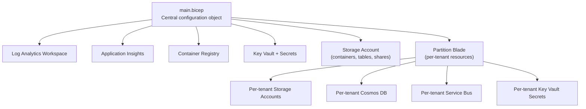
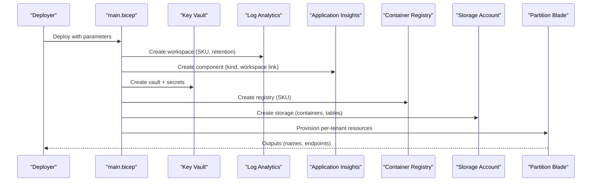
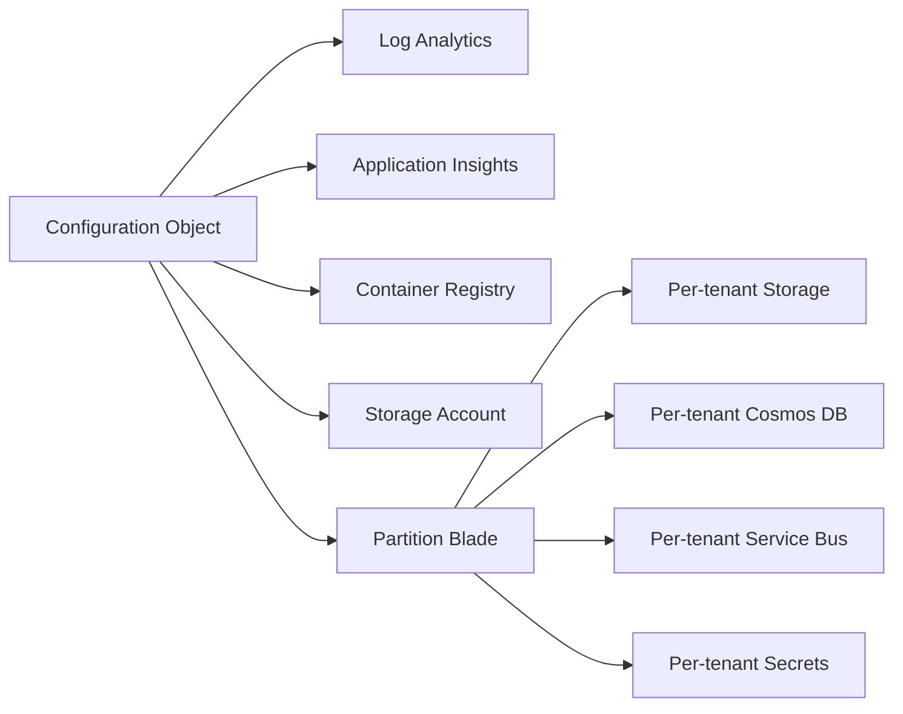

# Main Configuration Object Structure

<cite>
**Referenced Files in This Document**
- [main.bicep](file://bicep/main.bicep)
- [blade_partition.bicep](file://bicep/modules/blade_partition.bicep)
- [keyvault_secrets_partition.bicep](file://bicep/modules/keyvault_secrets_partition.bicep)
- [storage-account main.bicep](file://bicep/modules/storage-account/main.bicep)
- [parameters-template.json](file://parameters-template.json)
- [design_infrastructure.md](file://docs/src/design_infrastructure.md)
</cite>

## Table of Contents
1. [Introduction](#introduction)
2. [Project Structure](#project-structure)
3. [Core Components](#core-components)
4. [Architecture Overview](#architecture-overview)
5. [Detailed Component Analysis](#detailed-component-analysis)
6. [Dependency Analysis](#dependency-analysis)
7. [Performance Considerations](#performance-considerations)
8. [Troubleshooting Guide](#troubleshooting-guide)
9. [Conclusion](#conclusion)
10. [Appendices](#appendices)

## Introduction
This document explains the main configuration object that defines core platform resources for the OSDU stamp-based deployment. It focuses on how secrets, logging, container registry, Application Insights, storage accounts (with containers and tables), and multi-tenant partitions are configured. You will learn naming conventions, retention policies, SKU options, storage tiers, and how to customize these areas for different environments and use cases.

## Project Structure
The infrastructure is defined using Bicep modules organized into “blades.” The top-level entry point defines a central configuration object that drives resource creation across blades. A partition blade provisions per-tenant resources such as storage accounts, Cosmos DB databases, Service Bus namespaces, and secrets.

**Diagram sources**
- [main.bicep:104-153](file://bicep/main.bicep#L104-L153)
- [blade_partition.bicep:46-64](file://bicep/modules/blade_partition.bicep#L46-L64)
- [blade_partition.bicep:475-547](file://bicep/modules/blade_partition.bicep#L475-L547)
- [blade_partition.bicep:550-618](file://bicep/modules/blade_partition.bicep#L550-L618)
- [blade_partition.bicep:651-711](file://bicep/modules/blade_partition.bicep#L651-L711)
- [keyvault_secrets_partition.bicep:21-75](file://bicep/modules/keyvault_secrets_partition.bicep#L21-L75)

**Section sources**
- [main.bicep:104-153](file://bicep/main.bicep#L104-L153)
- [design_infrastructure.md:24-38](file://docs/src/design_infrastructure.md#L24-L38)

## Core Components
At the heart of the deployment is a single configuration object that centralizes settings for:
- Secrets references used by services
- Logging workspace SKU and retention
- Container registry SKU
- Application Insights kind
- Storage account SKU, blob containers, table names, and file shares
- Partition definitions for multi-tenancy

This object is consumed by multiple modules to provision resources consistently.

**Section sources**
- [main.bicep:104-153](file://bicep/main.bicep#L104-L153)

## Architecture Overview
The configuration object drives the following resource families:
- Log Analytics workspace with a specified SKU
- Application Insights linked to the workspace
- Azure Container Registry with a chosen SKU
- Key Vault populated with secrets derived from runtime values
- Storage account with pre-created containers and tables
- Per-tenant partitions each getting their own storage, database, messaging, and secrets

**Diagram sources**
- [main.bicep:191-247](file://bicep/main.bicep#L191-L247)
- [main.bicep:485-529](file://bicep/main.bicep#L485-L529)
- [main.bicep:599-661](file://bicep/main.bicep#L599-L661)
- [main.bicep:715-800](file://bicep/main.bicep#L715-L800)
- [blade_partition.bicep:475-547](file://bicep/modules/blade_partition.bicep#L475-L547)
- [blade_partition.bicep:550-618](file://bicep/modules/blade_partition.bicep#L550-L618)
- [blade_partition.bicep:651-711](file://bicep/modules/blade_partition.bicep#L651-L711)

## Detailed Component Analysis

### Secrets Management
- Centralized secret references are declared in the configuration object for tenant, subscription, registry, identity, storage, Cosmos DB, and Application Insights keys.
- At deploy time, additional secrets are created in Key Vault, including environment-derived values (e.g., generated passwords, connection strings).
- Per-tenant secrets include service bus connection details, Elasticsearch endpoint/user/password, and encryption keys.

Secret naming conventions observed:
- Common secrets: tenant-id, subscription-id, app-dev-sp-id, cpng-user-name, cpng-user-password, cpng-superuser-name, cpng-superuser-password, airflow-db-connection, airflow-admin-username, airflow-admin-password, airflow-fernet-key, airflow-webserver-key
- Per-tenant secrets: {partition}-sb-connection, {partition}-sb-namespace, {partition}-elastic-endpoint, {partition}-elastic-username, {partition}-elastic-password, {partition}-elastic-key
- Storage and Cosmos secrets exported to Key Vault with prefixes like {partition}-storage-account-name, {partition}-cosmos-endpoint, etc.

Customization examples:
- Development: Use shorter generated passwords and enable public network access where acceptable; keep secrets minimal.
- Staging: Rotate generated passwords regularly; add RBAC for Key Vault read access to CI/CD identities.
- Production: Enforce strict RBAC, disable public network access, enable purge protection, and rotate secrets periodically.

**Section sources**
- [main.bicep:104-153](file://bicep/main.bicep#L104-L153)
- [main.bicep:543-597](file://bicep/main.bicep#L543-L597)
- [main.bicep:599-661](file://bicep/main.bicep#L599-L661)
- [keyvault_secrets_partition.bicep:21-75](file://bicep/modules/keyvault_secrets_partition.bicep#L21-L75)

### Logging Settings
- Log Analytics workspace is created with a specific SKU.
- Retention policy is defined in the configuration object and can be adjusted per environment.

Retention policy guidance:
- Development: Short retention to reduce cost (e.g., 7–15 days).
- Staging: Moderate retention (e.g., 30 days).
- Production: Longer retention aligned with compliance needs (e.g., 90+ days).

**Section sources**
- [main.bicep:191-206](file://bicep/main.bicep#L191-L206)
- [main.bicep:104-153](file://bicep/main.bicep#L104-L153)

### Container Registry Configuration
- The registry SKU is set via the configuration object.
- Role assignments grant pull access to managed identities and cluster kubelet identity.

SKU options and selection:
- Basic: Suitable for development and small teams.
- Standard/Premium: For production workloads requiring higher throughput, geo-replication, or advanced features.

Customization examples:
- Development: Basic SKU to minimize cost.
- Staging: Standard SKU for better performance and reliability.
- Production: Premium SKU with geo-redundant replication and private endpoints.

**Section sources**
- [main.bicep:124-126](file://bicep/main.bicep#L124-L126)
- [main.bicep:485-529](file://bicep/main.bicep#L485-L529)

### Application Insights Setup
- Application Insights is created with a kind setting and linked to the Log Analytics workspace.
- Diagnostic settings forward metrics to the workspace.

Kind options and selection:
- web: Typical for application telemetry.
- Other kinds may be selected based on workload type.

Customization examples:
- Development: Enable basic diagnostics.
- Staging: Add custom diagnostic categories.
- Production: Ensure comprehensive metric collection and alerting rules.

**Section sources**
- [main.bicep:127-129](file://bicep/main.bicep#L127-L129)
- [main.bicep:218-247](file://bicep/main.bicep#L218-L247)

### Storage Account Configuration
- Storage account SKU is defined centrally.
- Blob containers and table names are declared in the configuration object and mapped during deployment.
- File shares can be added via the same mechanism.

Storage tiers and SKUs:
- SKU options include Standard_LRS, Standard_GRS, Standard_RAGRS, Standard_ZRS, Premium_LRS, Premium_ZRS, Standard_GZRS, Standard_RAGZRS.
- Access tier options include Hot, Cool, and Premium depending on workload patterns.

Containers and tables:
- Default containers include system, azure-webjobs-hosts, azure-webjobs-eventhub, gitops, airflow-logs, airflow-dags, share-unit, share-crs, share-crs-conversion.
- Tables include partitionInfo by default.

Customization examples:
- Development: Minimal containers and LRS SKU for cost efficiency.
- Staging: Add staging-specific containers and consider ZRS for zone resilience.
- Production: Use GRS/RAGRS for geo-redundancy, enable management policies for lifecycle (tiering and deletion), and restrict public access.

**Section sources**
- [main.bicep:130-147](file://bicep/main.bicep#L130-L147)
- [main.bicep:715-800](file://bicep/main.bicep#L715-L800)
- [storage-account main.bicep:30-49](file://bicep/modules/storage-account/main.bicep#L30-L49)
- [storage-account main.bicep:97-114](file://bicep/modules/storage-account/main.bicep#L97-L114)

### Multi-Tenant Partition Definitions
- Partitions are defined as an array of objects with at least a name field.
- Each partition gets its own storage account (with containers), Cosmos DB databases, Service Bus namespace (topics/subscriptions), and Key Vault secrets.

Partition setup guidance:
- System vs data partitions: The first partition is treated as system; subsequent ones are data partitions.
- Naming: Use clear, consistent partition names (e.g., opendes, partnerA, partnerB).

Customization examples:
- Single-tenant dev: One partition named opendes.
- Multi-tenant staging: Multiple partitions per tenant or team.
- Multi-tenant production: Separate partitions per customer with appropriate isolation and quotas.

**Section sources**
- [main.bicep:148-153](file://bicep/main.bicep#L148-L153)
- [blade_partition.bicep:30-35](file://bicep/modules/blade_partition.bicep#L30-L35)
- [blade_partition.bicep:475-547](file://bicep/modules/blade_partition.bicep#L475-L547)
- [blade_partition.bicep:550-618](file://bicep/modules/blade_partition.bicep#L550-L618)
- [blade_partition.bicep:651-711](file://bicep/modules/blade_partition.bicep#L651-L711)

## Dependency Analysis
The configuration object influences multiple downstream modules:
- Log Analytics and Application Insights depend on the logs and insights sections.
- Container Registry depends on the registry section.
- Storage Account depends on the storage section.
- Partition Blade depends on the partitions array and uses shared secrets and workspace IDs.

**Diagram sources**
- [main.bicep:104-153](file://bicep/main.bicep#L104-L153)
- [blade_partition.bicep:475-547](file://bicep/modules/blade_partition.bicep#L475-L547)
- [blade_partition.bicep:550-618](file://bicep/modules/blade_partition.bicep#L550-L618)
- [blade_partition.bicep:651-711](file://bicep/modules/blade_partition.bicep#L651-L711)

**Section sources**
- [main.bicep:104-153](file://bicep/main.bicep#L104-L153)
- [blade_partition.bicep:475-547](file://bicep/modules/blade_partition.bicep#L475-L547)

## Performance Considerations
- Choose storage SKUs and tiers based on access patterns: Hot for frequent reads/writes, Cool for infrequent access, Premium for high IOPS requirements.
- Adjust log retention to balance observability and cost.
- Select Application Insights kind and diagnostic categories appropriate for your workload.
- Scale container registry SKU to match build/pull demands.
- For multi-tenant setups, ensure per-tenant resources are sized appropriately and isolated.

[No sources needed since this section provides general guidance]

## Troubleshooting Guide
Common issues and checks:
- Missing or incorrect secret names: Verify secret naming conventions and ensure all required secrets exist in Key Vault before deploying services.
- Network restrictions: If public network access is disabled, ensure IP rules or private endpoints allow necessary traffic.
- Storage permissions: Confirm role assignments for managed identities to access storage blobs, files, and tables.
- Partition secrets: Ensure per-tenant secrets (service bus connection, Elasticsearch credentials) are present and correctly named.

Remediation steps:
- Validate Key Vault RBAC and secret existence.
- Review network ACLs and firewall rules.
- Re-run deployments with increased verbosity to capture errors.
- Check outputs from partition blade for resource names and endpoints.

**Section sources**
- [main.bicep:599-661](file://bicep/main.bicep#L599-L661)
- [main.bicep:715-800](file://bicep/main.bicep#L715-L800)
- [keyvault_secrets_partition.bicep:21-75](file://bicep/modules/keyvault_secrets_partition.bicep#L21-L75)

## Conclusion
The central configuration object provides a single source of truth for core platform resources. By adjusting secrets, logging, registry, Insights, storage, and partitions, you can tailor the deployment for development, staging, and production environments while maintaining consistency and scalability across tenants.

[No sources needed since this section summarizes without analyzing specific files]

## Appendices

### Environment Customization Examples
- Development:
  - Logs: Lower retention (e.g., 7–15 days).
  - Registry: Basic SKU.
  - Storage: LRS SKU, minimal containers.
  - Partitions: Single partition named opendes.
- Staging:
  - Logs: Moderate retention (e.g., 30 days).
  - Registry: Standard SKU.
  - Storage: ZRS SKU, add staging-specific containers.
  - Partitions: Multiple partitions per team or feature.
- Production:
  - Logs: Extended retention aligned with compliance.
  - Registry: Premium SKU with geo-replication.
  - Storage: GRS/RAGRS SKU, lifecycle policies for tiering/deletion.
  - Partitions: One partition per tenant with strict isolation.

**Section sources**
- [main.bicep:104-153](file://bicep/main.bicep#L104-L153)
- [parameters-template.json:1-19](file://parameters-template.json#L1-L19)
- [design_infrastructure.md:44-101](file://docs/src/design_infrastructure.md#L44-L101)