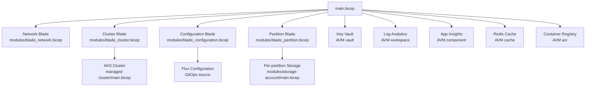
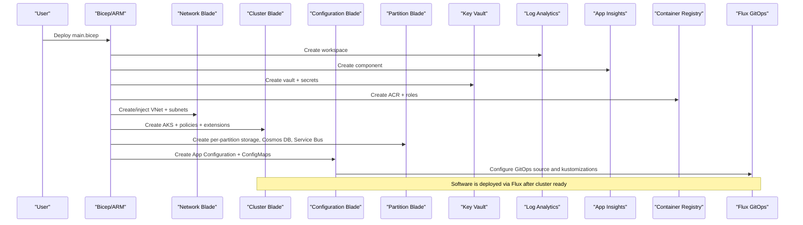
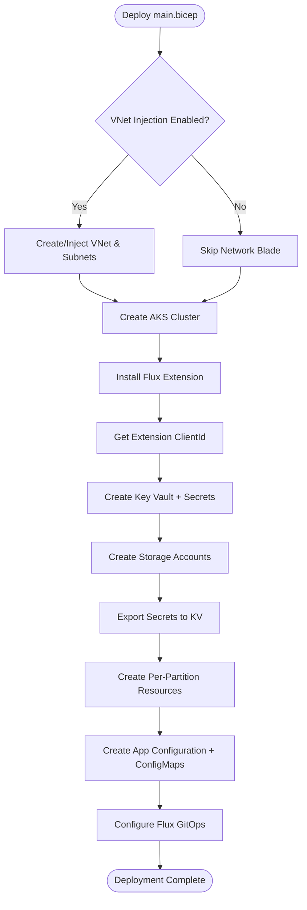

# Main Templates and Configuration

<cite>
**Referenced Files in This Document**
- [main.bicep](file://bicep/main.bicep)
- [main-minimal.bicep](file://bicep/main-minimal.bicep)
- [main.parameters.json](file://bicep/main.parameters.json)
- [main-minimal.parameters.json](file://bicep/main-minimal.parameters.json)
- [blade_cluster.bicep](file://bicep/modules/blade_cluster.bicep)
- [blade_network.bicep](file://bicep/modules/blade_network.bicep)
- [blade_partition.bicep](file://bicep/modules/blade_partition.bicep)
- [blade_configuration.bicep](file://bicep/modules/blade_configuration.bicep)
- [storage-account main.bicep](file://bicep/modules/storage-account/main.bicep)
</cite>

## Table of Contents
1. Introduction
2. Project Structure
3. Core Components
4. Architecture Overview
5. Detailed Component Analysis
6. Dependency Analysis
7. Performance Considerations
8. Troubleshooting Guide
9. Conclusion
10. Appendices

## Introduction
This document explains the main Bicep templates that orchestrate OSDU platform deployment on Azure. It focuses on:
- The primary deployment template structure and how it composes infrastructure “blades”
- Top-level parameters for location, authentication, cluster configuration, network options, and software overrides
- The internal configuration object model for secrets, logs, registry, storage, and partitions
- Deployment scenarios (minimal vs full), parameter customization, and environment-specific configurations
- Dependencies between modules, resource naming conventions, and tagging strategies

## Project Structure
The repository provides two top-level deployment entry points:
- Full deployment: bicep/main.bicep with bicep/main.parameters.json
- Minimal deployment: bicep/main-minimal.bicep with bicep/main-minimal.parameters.json

The full deployment composes several blade modules to provision core infrastructure and configure GitOps-driven software delivery:
- Network blade: optional VNet injection or creation
- Cluster blade: AKS cluster, policies, extensions
- Configuration blade: App Configuration, Flux GitOps source, federated identities, config maps
- Partition blade: per-partition storage, Cosmos DB, Service Bus, and secrets
- Supporting resources: Key Vault, Log Analytics, Application Insights, Redis Cache, Container Registry

**Diagram sources**
- [main.bicep:166-800](file://bicep/main.bicep#L166-L800)
- [blade_cluster.bicep:103-265](file://bicep/modules/blade_cluster.bicep#L103-L265)
- [blade_network.bicep:237-287](file://bicep/modules/blade_network.bicep#L237-L287)
- [blade_configuration.bicep:494-564](file://bicep/modules/blade_configuration.bicep#L494-L564)
- [blade_partition.bicep:475-711](file://bicep/modules/blade_partition.bicep#L475-L711)
- [storage-account main.bicep:97-114](file://bicep/modules/storage-account/main.bicep#L97-L114)

**Section sources**
- [main.bicep:1-157](file://bicep/main.bicep#L1-L157)
- [main-minimal.bicep:1-38](file://bicep/main-minimal.bicep#L1-L38)

## Core Components
- Entry points:
  - Full deployment: main.bicep defines all top-level parameters and composes blades and supporting resources
  - Minimal deployment: main-minimal.bicep provisions a reduced set of resources (identity, log analytics, insights, key vault, storage, static web app)
- Parameterization:
  - main.parameters.json maps environment variables to template parameters
  - main-minimal.parameters.json provides sample values for quick start
- Blades:
  - Network: creates or injects VNet/subnets and NSGs; supports pod subnet
  - Cluster: deploys AKS with system/user pools, policies, extensions, and monitoring
  - Configuration: sets up App Configuration, Flux GitOps, federated identities, and config maps
  - Partition: provisions per-partition storage, Cosmos DB, Service Bus, and secrets
- Supporting resources:
  - Key Vault stores runtime secrets and exports storage/Cosmos credentials
  - Log Analytics and App Insights provide diagnostics and metrics
  - Redis Cache used by services
  - Container Registry hosts images with role assignments for AKS and deployment identity

**Section sources**
- [main.bicep:29-81](file://bicep/main.bicep#L29-L81)
- [main.parameters.json:1-83](file://bicep/main.parameters.json#L1-L83)
- [main-minimal.parameters.json:1-19](file://bicep/main-minimal.parameters.json#L1-L19)
- [blade_cluster.bicep:20-57](file://bicep/modules/blade_cluster.bicep#L20-L57)
- [blade_network.bicep:20-30](file://bicep/modules/blade_network.bicep#L20-L30)
- [blade_configuration.bicep:14-107](file://bicep/modules/blade_configuration.bicep#L14-L107)
- [blade_partition.bicep:14-41](file://bicep/modules/blade_partition.bicep#L14-L41)

## Architecture Overview
The full deployment orchestrates infrastructure and software delivery through a layered approach:
- Infrastructure layer: VNet, AKS, storage, databases, messaging, logging, and secrets
- Configuration layer: App Configuration and Kubernetes ConfigMaps for service settings
- Software delivery layer: Flux GitOps configured to sync components, applications, and experimental workloads from a repository or private blob source

**Diagram sources**
- [main.bicep:191-247](file://bicep/main.bicep#L191-L247)
- [main.bicep:485-529](file://bicep/main.bicep#L485-L529)
- [main.bicep:599-661](file://bicep/main.bicep#L599-L661)
- [blade_cluster.bicep:103-265](file://bicep/modules/blade_cluster.bicep#L103-L265)
- [blade_configuration.bicep:494-564](file://bicep/modules/blade_configuration.bicep#L494-L564)
- [blade_partition.bicep:475-711](file://bicep/modules/blade_partition.bicep#L475-L711)

## Detailed Component Analysis

### Full Deployment Template (main.bicep)
- Top-level parameters include:
  - Location, email address, application client id and principal oid
  - Ingress type (External/Internal/Both)
  - Software override objects:
    - clusterSoftware: enable flags, osduCore/osduReference toggles, version/repository/branch/tag
    - experimentalSoftware: enable admin UI
  - Cluster configuration: node auto provisioning, private cluster, lock down
  - Server configuration: VM sizes for system and user pools
  - VNet configuration: bring-your-own-VNet with subnets and identity
- Internal configuration object:
  - secrets: placeholders for tenant, subscription, registry, identity, storage, cosmos, insights
  - logs: SKU and retention
  - registry: SKU
  - insights: kind
  - storage: SKU, containers, tables, shares
  - partitions: default partition list
- Resource composition:
  - Managed Identity, Log Analytics, App Insights, Redis Cache
  - Network blade (conditional on VNet injection)
  - Cluster blade (AKS, NAT IP, policy, app config extension)
  - Flux extension installation
  - Script to retrieve extension client ID
  - Container Registry with roles for deployment identity and kubelet
  - Key Vault with RBAC, network ACLs, and secrets
  - Secrets export for storage accounts
  - Storage account module usage with containers, tables, shares, roles, and network ACLs

Parameter mapping:
- main.parameters.json maps environment variables to template parameters including ingress type, cluster/server/vnet configurations, and software overrides

Naming and tagging:
- Unique IDs derived from resource group ID and name
- Tags include layer and id fields for consistent identification across resources

**Section sources**
- [main.bicep:5-81](file://bicep/main.bicep#L5-L81)
- [main.bicep:104-153](file://bicep/main.bicep#L104-L153)
- [main.bicep:166-247](file://bicep/main.bicep#L166-L247)
- [main.bicep:259-336](file://bicep/main.bicep#L259-L336)
- [main.bicep:353-421](file://bicep/main.bicep#L353-L421)
- [main.bicep:432-474](file://bicep/main.bicep#L432-L474)
- [main.bicep:485-529](file://bicep/main.bicep#L485-L529)
- [main.bicep:541-661](file://bicep/main.bicep#L541-L661)
- [main.bicep:672-800](file://bicep/main.bicep#L672-L800)
- [main.parameters.json:1-83](file://bicep/main.parameters.json#L1-L83)

### Minimal Deployment Template (main-minimal.bicep)
- Deploys a minimal set of resources:
  - Managed Identity
  - Log Analytics workspace
  - Application Insights component
  - Key Vault with RBAC and diagnostic settings
  - Storage Account with basic containers and roles
  - Static Web App with contributor role
- Outputs expose common identifiers such as tenant id, client id, storage account, instrumentation key, key vault URI, static web app URL, and resource group name
- Intended for quick starts or environments where only foundational resources are needed before adding secrets post-deployment

**Section sources**
- [main-minimal.bicep:1-38](file://bicep/main-minimal.bicep#L1-L38)
- [main-minimal.bicep:48-96](file://bicep/main-minimal.bicep#L48-L96)
- [main-minimal.bicep:106-153](file://bicep/main-minimal.bicep#L106-L153)
- [main-minimal.bicep:163-213](file://bicep/main-minimal.bicep#L163-L213)
- [main-minimal.bicep:229-252](file://bicep/main-minimal.bicep#L229-L252)
- [main-minimal.bicep:289-297](file://bicep/main-minimal.bicep#L289-L297)

### Network Blade
- Supports bringing your own VNet or creating one
- Creates NSG rules for HTTP/HTTPS inbound and SSH outbound when not injecting an existing VNet
- Defines subnets for cluster and optional pod subnet with service endpoints and role assignments
- Exposes outputs for VNet ID, AKS subnet ID, and pod subnet ID

**Section sources**
- [blade_network.bicep:20-30](file://bicep/modules/blade_network.bicep#L20-L30)
- [blade_network.bicep:37-49](file://bicep/modules/blade_network.bicep#L37-L49)
- [blade_network.bicep:52-156](file://bicep/modules/blade_network.bicep#L52-L156)
- [blade_network.bicep:158-194](file://bicep/modules/blade_network.bicep#L158-L194)
- [blade_network.bicep:205-287](file://bicep/modules/blade_network.bicep#L205-L287)
- [blade_network.bicep:294-332](file://bicep/modules/blade_network.bicep#L294-L332)

### Cluster Blade
- Deploys AKS with:
  - System and user agent pools with configurable VM sizes and scaling behavior
  - Network plugin mode based on presence of pod subnet
  - Private cluster option and managed NAT gateway or load balancer outbound
  - RBAC, AAD profile, defender, container insights, cost analysis
  - Add-ons: storage profiles, keyvault secrets provider, image cleaner, OIDC issuer, workload identity, Azure Policy, OMS agent
  - Maintenance window configuration
- Outputs include cluster name, NAT public IP, OIDC issuer URL, and kubelet identity ID

**Section sources**
- [blade_cluster.bicep:20-57](file://bicep/modules/blade_cluster.bicep#L20-L57)
- [blade_cluster.bicep:65-84](file://bicep/modules/blade_cluster.bicep#L65-L84)
- [blade_cluster.bicep:103-265](file://bicep/modules/blade_cluster.bicep#L103-L265)
- [blade_cluster.bicep:276-305](file://bicep/modules/blade_cluster.bicep#L276-L305)
- [blade_cluster.bicep:333-355](file://bicep/modules/blade_cluster.bicep#L333-L355)

### Configuration Blade
- Sets up:
  - Federated identities for multiple namespaces and service accounts
  - App Configuration with key-value settings for services, airflow, and application flags
  - Kubernetes ConfigMap containing values for workload identity and ingress configuration
  - Flux GitOps configuration pointing to a repository or private blob source with kustomizations for components, applications, and experimental workloads
- Parameters control software loading, versions, and ingress modes

**Section sources**
- [blade_configuration.bicep:14-107](file://bicep/modules/blade_configuration.bicep#L14-L107)
- [blade_configuration.bicep:141-206](file://bicep/modules/blade_configuration.bicep#L141-L206)
- [blade_configuration.bicep:210-344](file://bicep/modules/blade_configuration.bicep#L210-L344)
- [blade_configuration.bicep:355-388](file://bicep/modules/blade_configuration.bicep#L355-L388)
- [blade_configuration.bicep:396-465](file://bicep/modules/blade_configuration.bicep#L396-L465)
- [blade_configuration.bicep:470-564](file://bicep/modules/blade_configuration.bicep#L470-L564)

### Partition Blade
- For each partition:
  - Creates a storage account with containers and hierarchical namespace enabled
  - Provisions Cosmos DB with SQL databases and containers, optionally using CMK
  - Creates Service Bus namespace with topics and subscriptions
  - Uploads legal configuration files via deployment script
  - Persists secrets (storage keys, endpoints, connection strings) to Key Vault
- Outputs expose names of storage accounts and Service Bus namespaces

**Section sources**
- [blade_partition.bicep:14-41](file://bicep/modules/blade_partition.bicep#L14-L41)
- [blade_partition.bicep:46-440](file://bicep/modules/blade_partition.bicep#L46-L440)
- [blade_partition.bicep:475-547](file://bicep/modules/blade_partition.bicep#L475-L547)
- [blade_partition.bicep:550-618](file://bicep/modules/blade_partition.bicep#L550-L618)
- [blade_partition.bicep:621-631](file://bicep/modules/blade_partition.bicep#L621-L631)
- [blade_partition.bicep:634-711](file://bicep/modules/blade_partition.bicep#L634-L711)
- [blade_partition.bicep:715-766](file://bicep/modules/blade_partition.bicep#L715-L766)
- [blade_partition.bicep:773-787](file://bicep/modules/blade_partition.bicep#L773-L787)

### Storage Account Module
- Provides comprehensive storage account configuration:
  - Kind, SKU, access tier, large file shares, TLS minimum version
  - Blob/file/queue/table services and containers/shares/tables
  - Network ACLs, public network access, hierarchical namespace, SFTP/NFS support
  - Diagnostic settings, locks, tags, telemetry
  - Customer-managed keys and secret export to Key Vault

**Section sources**
- [storage-account main.bicep:5-191](file://bicep/modules/storage-account/main.bicep#L5-L191)

## Dependency Analysis
- Conditional dependencies:
  - Network blade is created only when VNet injection is enabled
  - Flux extension depends on cluster readiness
  - Extension client ID retrieval script depends on Flux extension outputs
  - Key Vault secrets depend on Key Vault creation
  - Storage secrets export depends on storage account creation
  - Partition blade depends on Key Vault and managed identity
- Role assignments:
  - Container Registry grants AcrPull to deployment identity and kubelet identity
  - Storage accounts grant data contributor roles to deployment identity
  - Cosmos DB grants data contributor roles to deployment identity
  - Service Bus grants sender/receiver roles to deployment identity

**Diagram sources**
- [main.bicep:296-336](file://bicep/main.bicep#L296-L336)
- [main.bicep:398-421](file://bicep/main.bicep#L398-L421)
- [main.bicep:432-474](file://bicep/main.bicep#L432-L474)
- [main.bicep:599-661](file://bicep/main.bicep#L599-L661)
- [main.bicep:715-800](file://bicep/main.bicep#L715-L800)
- [blade_configuration.bicep:494-564](file://bicep/modules/blade_configuration.bicep#L494-L564)

**Section sources**
- [main.bicep:296-336](file://bicep/main.bicep#L296-L336)
- [main.bicep:398-421](file://bicep/main.bicep#L398-L421)
- [main.bicep:432-474](file://bicep/main.bicep#L432-L474)
- [main.bicep:599-661](file://bicep/main.bicep#L599-L661)
- [main.bicep:715-800](file://bicep/main.bicep#L715-L800)
- [blade_configuration.bicep:494-564](file://bicep/modules/blade_configuration.bicep#L494-L564)

## Performance Considerations
- Node auto provisioning vs fixed pool sizing:
  - When disabled, explicit min/max counts are set for system and user pools
- VM sizes:
  - Default to cost-optimized burstable instances; can be overridden via serverConfiguration
- Monitoring and diagnostics:
  - Log Analytics and App Insights enabled for all major resources
- Image cleanup and maintenance:
  - Image cleaner addon and scheduled maintenance windows configured
- Throughput and capacity:
  - Cosmos DB throughput and Service Bus SKU/capacity can be tuned per environment

[No sources needed since this section provides general guidance]

## Troubleshooting Guide
- Network issues:
  - Ensure NSG rules allow required inbound/outbound traffic when not using BYO VNet
  - Verify pod subnet service endpoints for Storage, Key Vault, and Container Registry
- Access issues:
  - Confirm role assignments for deployment identity on Key Vault, Storage, Cosmos DB, Service Bus, and Container Registry
  - Validate Key Vault network ACLs allow cluster NAT IP
- Software delivery:
  - Flux GitOps source must be reachable; ensure repository URL, branch/tag, and private blob access are correct
  - Check kustomization paths and dependencies for components, applications, and experimental
- Secrets:
  - Ensure secrets exist in Key Vault with expected names; verify export mappings for storage and Cosmos DB
  - Use Key Vault RBAC to grant appropriate permissions to deployment identity and application principals

**Section sources**
- [blade_network.bicep:52-156](file://bicep/modules/blade_network.bicep#L52-L156)
- [main.bicep:599-661](file://bicep/main.bicep#L599-L661)
- [main.bicep:715-800](file://bicep/main.bicep#L715-L800)
- [blade_configuration.bicep:494-564](file://bicep/modules/blade_configuration.bicep#L494-L564)

## Conclusion
The main Bicep templates provide a structured, modular approach to deploying OSDU on Azure. The full template composes network, cluster, configuration, and partition blades along with supporting resources, while the minimal template offers a lightweight foundation. Parameters and configuration objects enable flexible customization for different environments and deployment scenarios. Proper dependency management, naming conventions, and tagging ensure maintainability and observability.

[No sources needed since this section summarizes without analyzing specific files]

## Appendices

### Top-Level Parameters Summary
- Location: Azure region for deployment
- Authentication: application client id and principal oid for Key Vault access
- Ingress type: External/Internal/Both for cluster ingress
- Software overrides:
  - clusterSoftware: enable flags, feature toggles, version/repository/branch/tag
  - experimentalSoftware: enable admin UI
- Cluster configuration: node auto provisioning, private cluster, lock down
- Server configuration: VM sizes for system and user pools
- VNet configuration: BYO VNet with subnets and identity

**Section sources**
- [main.bicep:5-81](file://bicep/main.bicep#L5-L81)
- [main.parameters.json:1-83](file://bicep/main.parameters.json#L1-L83)

### Configuration Object Structure
- secrets: placeholders for tenant, subscription, registry, identity, storage, cosmos, insights
- logs: SKU and retention
- registry: SKU
- insights: kind
- storage: SKU, containers, tables, shares
- partitions: default partition list

**Section sources**
- [main.bicep:104-153](file://bicep/main.bicep#L104-L153)

### Deployment Scenarios
- Minimal:
  - Use main-minimal.bicep for foundational resources
  - Populate Key Vault secrets post-deployment
- Full:
  - Use main.bicep for complete infrastructure and software delivery
  - Customize parameters via main.parameters.json or environment variables

**Section sources**
- [main-minimal.bicep:1-38](file://bicep/main-minimal.bicep#L1-L38)
- [main-minimal.parameters.json:1-19](file://bicep/main-minimal.parameters.json#L1-L19)
- [main.bicep:1-81](file://bicep/main.bicep#L1-L81)
- [main.parameters.json:1-83](file://bicep/main.parameters.json#L1-L83)

### Environment-Specific Configurations
- Map environment variables to parameters in main.parameters.json
- Adjust clusterSoftware and experimentalSoftware for feature toggles
- Set vnetConfiguration for BYO VNet scenarios
- Tune serverConfiguration for performance and cost targets

**Section sources**
- [main.parameters.json:1-83](file://bicep/main.parameters.json#L1-L83)
- [main.bicep:29-81](file://bicep/main.bicep#L29-L81)

### Resource Naming Conventions and Tagging Strategies
- Names use unique strings derived from resource group ID and deployment name
- Tags include layer and id for consistent identification
- Partitioned resources add partition and purpose tags

**Section sources**
- [main.bicep:155-157](file://bicep/main.bicep#L155-L157)
- [blade_partition.bicep:483-491](file://bicep/modules/blade_partition.bicep#L483-L491)