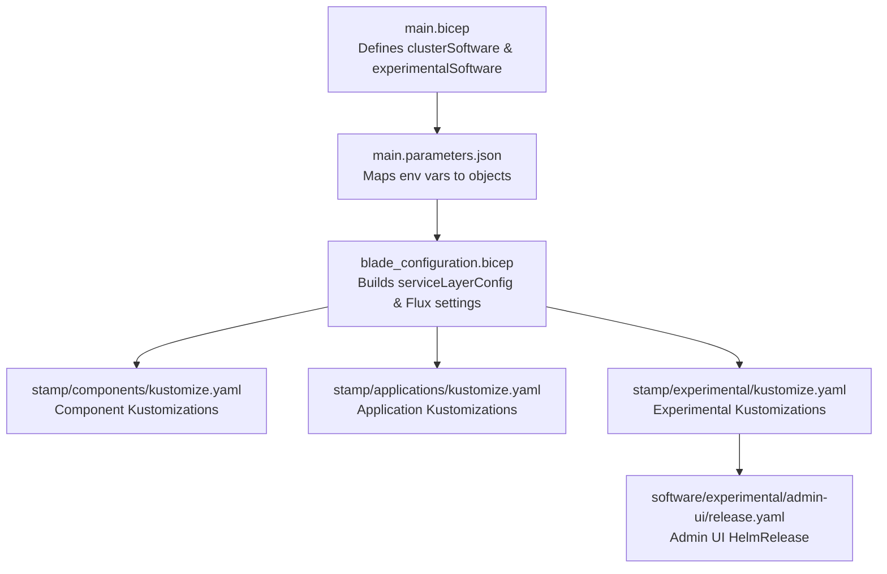
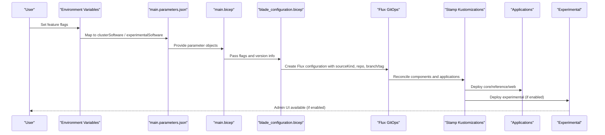
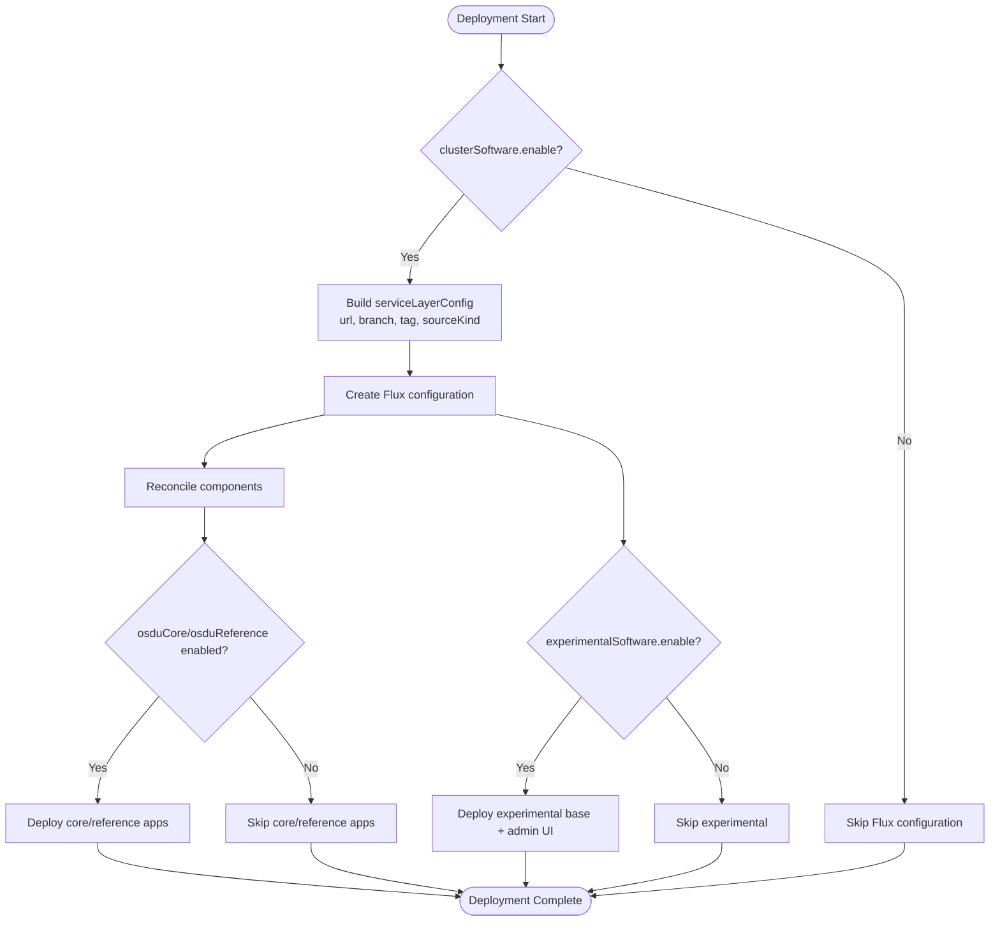
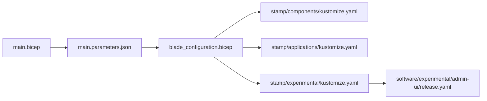

# Software Override Configuration

<cite>
**Referenced Files in This Document**
- [main.bicep](file://bicep/main.bicep)
- [main.parameters.json](file://bicep/main.parameters.json)
- [blade_configuration.bicep](file://bicep/modules/blade_configuration.bicep)
- [feature_flags.md](file://docs/src/feature_flags.md)
- [experimental_adminui.md](file://docs/src/experimental_adminui.md)
- [design_software.md](file://docs/src/design_software.md)
- [stamp/applications/kustomize.yaml](file://stamp/applications/kustomize.yaml)
- [stamp/components/kustomize.yaml](file://stamp/components/kustomize.yaml)
- [software/applications/kustomization.yaml](file://software/applications/kustomization.yaml)
- [software/experimental/admin-ui/release.yaml](file://software/experimental/admin-ui/release.yaml)
</cite>

## Table of Contents
1. Introduction
2. Project Structure
3. Core Components
4. Architecture Overview
5. Detailed Component Analysis
6. Dependency Analysis
7. Performance Considerations
8. Troubleshooting Guide
9. Conclusion

## Introduction
This document explains how to configure software overrides for an OSDU deployment using the clusterSoftware and experimentalSoftware objects. It covers the structure and behavior of each property, when to use them, and their impact on deployment scope. It also provides examples of different combinations such as minimal vs full deployments, custom repository references, version pinning via branch or tag, and feature toggles for enabling or disabling specific components like core services, reference services, and the Admin UI.

## Project Structure
The software override configuration is defined at the top-level Bicep entry point and passed through parameter files into a configuration blade that drives Flux-based GitOps reconciliation. The key elements are:
- Top-level parameters defining clusterSoftware and experimentalSoftware
- Parameter mapping from environment variables to these objects
- A configuration module that translates flags into Flux sources and Kustomizations
- Stamp manifests that declare which components and applications to reconcile
- Experimental features (Admin UI) controlled by a separate flag set

**Diagram sources**
- [main.bicep:28-44](file://bicep/main.bicep#L28-L44)
- [main.parameters.json:64-80](file://bicep/main.parameters.json#L64-L80)
- [blade_configuration.bicep:470-559](file://bicep/modules/blade_configuration.bicep#L470-L559)
- [stamp/components/kustomize.yaml:1-306](file://stamp/components/kustomize.yaml#L1-L306)
- [stamp/applications/kustomize.yaml:1-205](file://stamp/applications/kustomize.yaml#L1-L205)
- [software/experimental/admin-ui/release.yaml:1-54](file://software/experimental/admin-ui/release.yaml#L1-L54)

**Section sources**
- [main.bicep:28-44](file://bicep/main.bicep#L28-L44)
- [main.parameters.json:64-80](file://bicep/main.parameters.json#L64-L80)
- [blade_configuration.bicep:470-559](file://bicep/modules/blade_configuration.bicep#L470-L559)

## Core Components
- clusterSoftware object controls whether software is loaded and which parts are included, where it is sourced from, and which version to use.
- experimentalSoftware object enables experimental features, notably the Admin UI.

Key properties and behaviors:
- enable: Controls overall software loading. When false, no software is reconciled by Flux.
- private: Switches source type between GitRepository and Azure Blob storage for software definitions.
- osduCore: Enables or disables OSDU core services.
- osduReference: Enables or disables OSDU reference services.
- osduVersion: Sets the desired OSDU version; used to derive default tag when neither branch nor tag is specified.
- repository: Overrides the default Git repository URL for software definitions.
- branch: Pins the software to a specific branch.
- tag: Pins the software to a specific tag; takes precedence over branch when both are provided.

Experimental options:
- enable: Toggles loading of experimental software.
- adminUI: Specifically enables the Admin UI within experimental software.

These flags are exposed via environment variables and mapped into the parameter objects during deployment.

**Section sources**
- [main.bicep:28-44](file://bicep/main.bicep#L28-L44)
- [main.parameters.json:64-80](file://bicep/main.parameters.json#L64-L80)
- [feature_flags.md:58-80](file://docs/src/feature_flags.md#L58-L80)

## Architecture Overview
The override flow connects environment-driven parameters to Flux configuration, which then reconciles component and application Kustomizations from either a Git repository or Azure Blob storage. Experimental features are gated separately and depend on base experimental resources.

**Diagram sources**
- [main.parameters.json:64-80](file://bicep/main.parameters.json#L64-L80)
- [main.bicep:28-44](file://bicep/main.bicep#L28-L44)
- [blade_configuration.bicep:470-559](file://bicep/modules/blade_configuration.bicep#L470-L559)
- [stamp/applications/kustomize.yaml:1-205](file://stamp/applications/kustomize.yaml#L1-L205)
- [stamp/components/kustomize.yaml:1-306](file://stamp/components/kustomize.yaml#L1-L306)

## Detailed Component Analysis

### clusterSoftware Object
Structure:
- enable: Boolean to load all software.
- private: Boolean to switch source to Azure Blob instead of Git.
- osduCore: Boolean to include core services.
- osduReference: Boolean to include reference services.
- osduVersion: String representing the desired OSDU version; influences default tag selection.
- repository: String to override the default Git repository URL.
- branch: String to pin to a specific branch.
- tag: String to pin to a specific tag; if present, typically preferred over branch for deterministic builds.

Behavioral notes:
- When enable is false, Flux configuration is not created; no software is deployed.
- When private is true, the source kind changes to Azure Blob; scripts transform manifests accordingly before upload.
- If repository is empty, defaults to the official repository.
- If branch and tag are both empty, the default tag is derived from osduVersion.
- Setting repository, branch, or tag allows customizing the software source and version pinning.

Impact on deployment scope:
- Disabling osduCore removes core services (e.g., partition, schema, search, legal, storage).
- Disabling osduReference removes reference services (e.g., CRS catalog/conversion, unit).
- Changing repository/branch/tag affects all components and applications pulled from that source.

Examples:
- Minimal deployment: Set enable to true, osduCore to false, osduReference to false, keep other fields default.
- Full deployment: Set enable to true, osduCore to true, osduReference to true.
- Custom repository: Set repository to your fork or mirror URL.
- Version pinning: Set branch to a release branch or tag to a specific commit tag.

**Section sources**
- [main.bicep:28-38](file://bicep/main.bicep#L28-L38)
- [main.parameters.json:64-74](file://bicep/main.parameters.json#L64-L74)
- [feature_flags.md:58-71](file://docs/src/feature_flags.md#L58-L71)
- [blade_configuration.bicep:470-510](file://bicep/modules/blade_configuration.bicep#L470-L510)

### experimentalSoftware Object
Structure:
- enable: Boolean to load experimental software.
- adminUI: Boolean to specifically enable the Admin UI.

Behavioral notes:
- When enable is false, experimental Kustomizations are not created.
- When adminUI is true, the Admin UI HelmRelease is reconciled after experimental base resources are ready.

Impact on deployment scope:
- Only affects experimental namespace and related resources.
- Does not change core or reference services unless explicitly enabled via clusterSoftware.

Examples:
- Enable only Admin UI: Set enable to true, adminUI to true.
- Disable experimental: Set enable to false; adminUI has no effect.

**Section sources**
- [main.bicep:40-44](file://bicep/main.bicep#L40-L44)
- [main.parameters.json:76-80](file://bicep/main.parameters.json#L76-L80)
- [feature_flags.md:73-80](file://docs/src/feature_flags.md#L73-L80)
- [design_software.md:251-275](file://docs/src/design_software.md#L251-L275)
- [software/experimental/admin-ui/release.yaml:1-54](file://software/experimental/admin-ui/release.yaml#L1-L54)

### How Overrides Influence Flux Sources and Kustomizations
- The configuration module builds a service layer config that sets:
  - Repository URL (default or overridden)
  - Branch and tag (with fallback logic based on version)
  - Source kind (GitRepository or AzureBlob)
- Flux creates Kustomizations for:
  - Components (global, system, mesh ingress, observability, etc.)
  - Applications (auth, core, reference, web site)
  - Experimental (base and admin UI)
- Health checks and dependencies ensure correct ordering and readiness.

**Diagram sources**
- [blade_configuration.bicep:470-559](file://bicep/modules/blade_configuration.bicep#L470-L559)
- [stamp/applications/kustomize.yaml:1-205](file://stamp/applications/kustomize.yaml#L1-L205)
- [stamp/components/kustomize.yaml:1-306](file://stamp/components/kustomize.yaml#L1-L306)

## Dependency Analysis
- main.bicep defines the override objects and passes them into the configuration blade.
- main.parameters.json maps environment variables to these objects.
- blade_configuration.bicep consumes the flags to build Flux configuration and determines which Kustomizations to create.
- stamp manifests define the actual components and applications to be reconciled.
- Experimental Admin UI depends on experimental base resources and reads values from ConfigMaps and Secrets.

**Diagram sources**
- [main.bicep:28-44](file://bicep/main.bicep#L28-L44)
- [main.parameters.json:64-80](file://bicep/main.parameters.json#L64-L80)
- [blade_configuration.bicep:470-559](file://bicep/modules/blade_configuration.bicep#L470-L559)
- [stamp/components/kustomize.yaml:1-306](file://stamp/components/kustomize.yaml#L1-L306)
- [stamp/applications/kustomize.yaml:1-205](file://stamp/applications/kustomize.yaml#L1-L205)
- [software/experimental/admin-ui/release.yaml:1-54](file://software/experimental/admin-ui/release.yaml#L1-L54)

**Section sources**
- [main.bicep:28-44](file://bicep/main.bicep#L28-L44)
- [main.parameters.json:64-80](file://bicep/main.parameters.json#L64-L80)
- [blade_configuration.bicep:470-559](file://bicep/modules/blade_configuration.bicep#L470-L559)

## Performance Considerations
- Disabling unnecessary components reduces reconciliation time and resource usage.
- Using tags instead of branches improves determinism and can reduce fetch overhead.
- Private software via Azure Blob may improve reliability in restricted networks but requires proper access configuration.
- Enabling experimental features adds additional reconciliation steps and potential latency.

[No sources needed since this section provides general guidance]

## Troubleshooting Guide
Common issues and resolutions:
- No software deployed: Verify clusterSoftware.enable is true and Flux configuration was created.
- Wrong version deployed: Ensure branch or tag is set correctly; check osduVersion fallback behavior.
- Access errors to repository: Confirm repository URL and credentials; consider switching to private mode if required.
- Admin UI not available: Ensure experimentalSoftware.enable and adminUI are true; verify experimental base resources are ready.
- Inconsistent state: Check Flux logs for reconciliation errors and health checks for component readiness.

**Section sources**
- [feature_flags.md:58-80](file://docs/src/feature_flags.md#L58-L80)
- [software/experimental/admin-ui/release.yaml:1-54](file://software/experimental/admin-ui/release.yaml#L1-L54)

## Conclusion
Use clusterSoftware to control the inclusion and sourcing of core and reference services, and to pin versions via branch or tag. Use experimentalSoftware to selectively enable experimental features like the Admin UI. Combine these overrides to tailor deployments from minimal to full, and to integrate custom repositories or pinned versions for stability and compliance.

[No sources needed since this section summarizes without analyzing specific files]