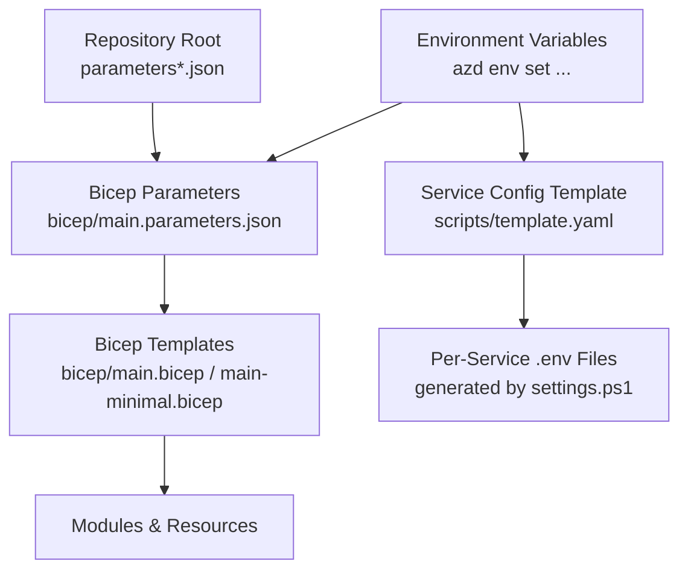
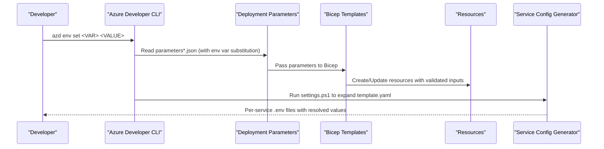
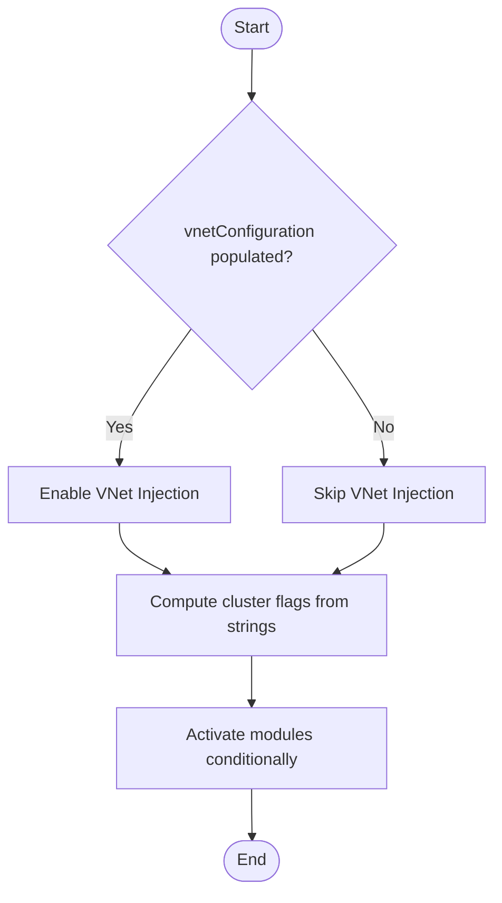
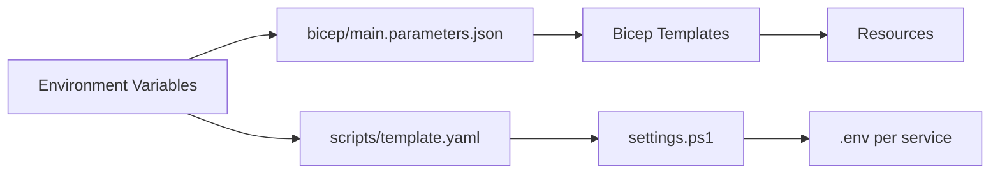

# Parameter Management and Environment Configuration

<cite>
**Referenced Files in This Document**
- [parameters.json](file://parameters.json)
- [parameters-template.json](file://parameters-template.json)
- [parameters-eastus2.json](file://parameters-eastus2.json)
- [parameters-eastus2-minimal.json](file://parameters-eastus2-minimal.json)
- [parameters-eastus2-deploy.json](file://parameters-eastus2-deploy.json)
- [main.parameters.json](file://bicep/main.parameters.json)
- [main.bicep](file://bicep/main.bicep)
- [main-minimal.bicep](file://bicep/main-minimal.bicep)
- [template.yaml](file://scripts/template.yaml)
- [settings.ps1](file://scripts/settings.ps1)
- [advanced_vnet.md](file://docs/src/advanced_vnet.md)
- [feature_flags.md](file://docs/src/feature_flags.md)
</cite>

## Table of Contents
1. Introduction
2. Project Structure
3. Core Components
4. Architecture Overview
5. Detailed Component Analysis
6. Dependency Analysis
7. Performance Considerations
8. Troubleshooting Guide
9. Conclusion

## Introduction
This document explains the parameter management system used to configure and deploy the solution across environments (development, staging, production). It covers:
- Parameter file structure and inheritance patterns
- Environment variable integration with Azure Deployment Manager and Bicep
- Complete parameter catalog with types, defaults, and constraints
- How to create environment-specific parameter files and manage sensitive values securely
- Validation, conditional logic, and best practices for consistency

## Project Structure
The parameter system spans multiple layers:
- ARM/Bicep deployment parameters at the repository root and under bicep/
- Bicep templates that define parameters, validation, and conditional behavior
- Service configuration templates that generate per-service .env files from a YAML template
- Documentation and scripts that show how to set environment variables via Azure Developer CLI (azd)

**Diagram sources**
- [parameters.json:1-9](file://parameters.json#L1-L9)
- [parameters-template.json:1-19](file://parameters-template.json#L1-L19)
- [parameters-eastus2.json:1-13](file://parameters-eastus2.json#L1-L13)
- [parameters-eastus2-minimal.json:1-44](file://parameters-eastus2-minimal.json#L1-L44)
- [parameters-eastus2-deploy.json:1-19](file://parameters-eastus2-deploy.json#L1-L19)
- [main.parameters.json:1-83](file://bicep/main.parameters.json#L1-L83)
- [main.bicep:1-800](file://bicep/main.bicep#L1-L800)
- [main-minimal.bicep:1-297](file://bicep/main-minimal.bicep#L1-L297)
- [template.yaml:1-282](file://scripts/template.yaml#L1-L282)
- [settings.ps1:142-181](file://scripts/settings.ps1#L142-L181)

**Section sources**
- [parameters.json:1-9](file://parameters.json#L1-L9)
- [parameters-template.json:1-19](file://parameters-template.json#L1-L19)
- [parameters-eastus2.json:1-13](file://parameters-eastus2.json#L1-L13)
- [parameters-eastus2-minimal.json:1-44](file://parameters-eastus2-minimal.json#L1-L44)
- [parameters-eastus2-deploy.json:1-19](file://parameters-eastus2-deploy.json#L1-L19)
- [main.parameters.json:1-83](file://bicep/main.parameters.json#L1-L83)
- [main.bicep:1-800](file://bicep/main.bicep#L1-L800)
- [main-minimal.bicep:1-297](file://bicep/main-minimal.bicep#L1-L297)
- [template.yaml:1-282](file://scripts/template.yaml#L1-L282)
- [settings.ps1:142-181](file://scripts/settings.ps1#L142-L181)

## Core Components
- Deployment parameter files (ARM format) define environment-specific values and are consumed by Bicep deployments.
- Bicep templates declare parameters, provide defaults, apply validation (allowed values), and implement conditional logic based on parameters.
- Environment variables bridge CI/CD or azd environments into both infrastructure and application configuration.
- Service configuration is templated and expanded into per-service .env files using a PowerShell script.

Key responsibilities:
- parameters*.json: Provide concrete values per environment or serve as templates.
- bicep/main.parameters.json: Maps environment variables to Bicep parameters.
- bicep/main.bicep and main-minimal.bicep: Define parameters, defaults, validations, and resource creation.
- scripts/template.yaml + settings.ps1: Generate runtime service configuration from environment variables.

**Section sources**
- [main.parameters.json:1-83](file://bicep/main.parameters.json#L1-L83)
- [main.bicep:1-800](file://bicep/main.bicep#L1-L800)
- [main-minimal.bicep:1-297](file://bicep/main-minimal.bicep#L1-L297)
- [template.yaml:1-282](file://scripts/template.yaml#L1-L282)
- [settings.ps1:142-181](file://scripts/settings.ps1#L142-L181)

## Architecture Overview
The parameter flow integrates environment variables, ARM/Bicep parameters, and service configuration generation.

**Diagram sources**
- [main.parameters.json:1-83](file://bicep/main.parameters.json#L1-L83)
- [main.bicep:1-800](file://bicep/main.bicep#L1-L800)
- [template.yaml:1-282](file://scripts/template.yaml#L1-L282)
- [settings.ps1:142-181](file://scripts/settings.ps1#L142-L181)
- [advanced_vnet.md:282-342](file://docs/src/advanced_vnet.md#L282-L342)

## Detailed Component Analysis

### Parameter File Structure and Inheritance
- Root-level parameters*.json files follow the ARM deployment parameters schema and can be used directly or as templates.
- bicep/main.parameters.json maps environment variables to Bicep parameters using ${ENV_VAR} placeholders.
- Environment-specific files (e.g., parameters-eastus2*.json) override or extend base values for target regions/environments.
- Minimal vs full profiles:
  - Full profile uses bicep/main.parameters.json with many environment-driven parameters.
  - Minimal profile uses bicep/main-minimal.bicep with a small set of required parameters and sensible defaults.

Inheritance pattern:
- Start with a base or template parameter file.
- Override only what differs per environment (region, client IDs, toggles).
- Use environment variables for secrets and dynamic values to avoid hardcoding.

**Section sources**
- [parameters.json:1-9](file://parameters.json#L1-L9)
- [parameters-template.json:1-19](file://parameters-template.json#L1-L19)
- [parameters-eastus2.json:1-13](file://parameters-eastus2.json#L1-L13)
- [parameters-eastus2-minimal.json:1-44](file://parameters-eastus2-minimal.json#L1-L44)
- [parameters-eastus2-deploy.json:1-19](file://parameters-eastus2-deploy.json#L1-L19)
- [main.parameters.json:1-83](file://bicep/main.parameters.json#L1-L83)

### Environment Variable Integration
- Infrastructure layer:
  - bicep/main.parameters.json substitutes ${ENV_VAR} placeholders for parameters such as location, client IDs, cluster toggles, and software source details.
  - These variables are typically set via azd env set or CI/CD secrets.
- Application layer:
  - scripts/template.yaml contains per-service keys referencing %ENV_VAR% placeholders.
  - settings.ps1 expands these placeholders into per-service .env files, reading values from the current environment.

Best practices:
- Keep secrets out of parameter files; use environment variables or secure stores (e.g., Key Vault) and reference them via environment variables.
- Centralize environment definitions with azd to ensure consistent variable sets across tools.

**Section sources**
- [main.parameters.json:1-83](file://bicep/main.parameters.json#L1-L83)
- [template.yaml:1-282](file://scripts/template.yaml#L1-L282)
- [settings.ps1:142-181](file://scripts/settings.ps1#L142-L181)
- [advanced_vnet.md:282-342](file://docs/src/advanced_vnet.md#L282-L342)

### Parameter Catalog, Types, Defaults, and Constraints
Infrastructure parameters (from Bicep and parameter files):
- location
  - Type: string
  - Default: resourceGroup().location (minimal) or provided via environment
  - Notes: Target Azure region for deployment
- emailAddress
  - Type: string
  - Default: none (required in full profile)
  - Notes: Used for notifications or admin contact
- applicationClientId
  - Type: string
  - Default: none (required)
  - Notes: Azure AD application identifier
- applicationClientPrincipalOid
  - Type: string
  - Default: none (optional in some flows)
  - Notes: Object ID of the enterprise application/service principal
- ingressType
  - Type: string
  - Default: External
  - Allowed: External, Internal, Both, empty
  - Notes: Controls cluster ingress exposure
- enableTelemetry
  - Type: bool
  - Default: true (minimal), false (full profile internal flag)
  - Notes: Enables telemetry for deployed resources
- clusterConfiguration (object)
  - Fields:
    - enableNodeAutoProvisioning: bool-like string ("true"/"false")
    - enablePrivateCluster: bool-like string ("true"/"false")
    - enableLockDown: bool-like string ("true"/"false")
  - Default: see Bicep defaults
  - Notes: Controls AKS cluster features
- serverConfiguration (object)
  - Fields:
    - systemPool: string (VM size)
    - userPool: string (VM size)
  - Default: Standard_B2s
  - Notes: Node pool VM sizes
- vnetConfiguration (object)
  - Fields: group, name, prefix, identityId, aksSubnet{name,prefix}, podSubnet{name,prefix}, vmSubnet{name,prefix}, bastionSubnet{name,prefix}
  - Default: empty objects
  - Notes: Optional bring-your-own-VNet configuration
- clusterSoftware (object)
  - Fields: enable, private, osduCore, osduReference, osduVersion, repository, branch, tag
  - Default: see Bicep defaults
  - Notes: Software source and feature toggles
- experimentalSoftware (object)
  - Fields: enable, adminUI
  - Default: see Bicep defaults
  - Notes: Experimental features toggle

Application/service parameters (from template.yaml):
- Each service section defines RUN and TEST blocks with environment-specific keys (e.g., APPINSIGHTS_KEY, KEYVAULT_URI, AAD_CLIENT_ID, SERVER_PORT, SPRING_APPLICATION_NAME, etc.).
- Values use %ENV_VAR% placeholders that are expanded by settings.ps1.

Constraints and validation:
- ingressType is constrained to allowed values in Bicep.
- Some values must be non-empty (e.g., applicationClientId).
- Ensure SOFTWARE_VERSION aligns with allowed values enforced by templates.

**Section sources**
- [main.bicep:1-800](file://bicep/main.bicep#L1-L800)
- [main-minimal.bicep:1-297](file://bicep/main-minimal.bicep#L1-L297)
- [main.parameters.json:1-83](file://bicep/main.parameters.json#L1-L83)
- [template.yaml:1-282](file://scripts/template.yaml#L1-L282)

### Creating New Parameter Files for Environments
Steps:
1. Choose a base:
   - For full deployments, start from bicep/main.parameters.json and supply environment variables.
   - For minimal deployments, use bicep/main-minimal.bicep and a simple parameters file.
2. Create an environment-specific file:
   - Copy a relevant example (e.g., parameters-eastus2.json or parameters-eastus2-minimal.json).
   - Update values specific to the environment (location, client IDs, toggles).
3. Set environment variables:
   - Use azd env set to define variables referenced in bicep/main.parameters.json and scripts/template.yaml.
4. Validate:
   - Run a dry-run or preview if available to catch invalid values early.
5. Deploy:
   - Execute the deployment pipeline with the chosen parameter file.

Example references:
- Full profile mapping via environment variables: [main.parameters.json:1-83](file://bicep/main.parameters.json#L1-L83)
- Minimal profile parameters: [parameters-eastus2-minimal.json:1-44](file://parameters-eastus2-minimal.json#L1-L44)
- Setting environment variables with azd: [advanced_vnet.md:282-342](file://docs/src/advanced_vnet.md#L282-L342)

**Section sources**
- [parameters-eastus2-minimal.json:1-44](file://parameters-eastus2-minimal.json#L1-L44)
- [main.parameters.json:1-83](file://bicep/main.parameters.json#L1-L83)
- [advanced_vnet.md:282-342](file://docs/src/advanced_vnet.md#L282-L342)

### Managing Sensitive Values Securely
- Avoid committing secrets to parameter files.
- Use environment variables for secrets (client IDs, tenant IDs, connection strings).
- Reference Key Vault URIs and secrets through environment variables or post-deployment secret injection.
- The templates demonstrate storing generated or retrieved secrets in Key Vault during deployment.

Security notes:
- Restrict access to Key Vault via RBAC and network rules where applicable.
- Rotate secrets regularly and store them in secure vaults.

**Section sources**
- [main.bicep:540-660](file://bicep/main.bicep#L540-L660)
- [main-minimal.bicep:254-296](file://bicep/main-minimal.bicep#L254-L296)

### Parameter Validation and Conditional Logic
Validation:
- ingressType is restricted to allowed values in Bicep.
- Ensure SOFTWARE_VERSION matches allowed values enforced by templates.

Conditional logic examples:
- VNet injection is enabled when vnetConfiguration fields are provided.
- Cluster features (private cluster, node auto-provisioning, lock-down) are derived from string flags converted to booleans.
- Module activation depends on computed flags (e.g., enableVnetInjection).

**Diagram sources**
- [main.bicep:87-102](file://bicep/main.bicep#L87-L102)
- [main.bicep:296-336](file://bicep/main.bicep#L296-L336)
- [main.bicep:353-385](file://bicep/main.bicep#L353-L385)

**Section sources**
- [main.bicep:18-25](file://bicep/main.bicep#L18-L25)
- [main.bicep:87-102](file://bicep/main.bicep#L87-L102)
- [main.bicep:296-336](file://bicep/main.bicep#L296-L336)
- [main.bicep:353-385](file://bicep/main.bicep#L353-L385)

### Best Practices for Consistency Across Environments
- Centralize environment variables with azd to keep settings consistent across tools.
- Use minimal overrides in environment-specific parameter files; rely on defaults and environment variables for differences.
- Keep secrets out of version control; inject via environment variables or secure stores.
- Validate parameters before deploying (use previews and tests).
- Document all parameters and their constraints in a shared reference.

**Section sources**
- [feature_flags.md:1-31](file://docs/src/feature_flags.md#L1-L31)
- [advanced_vnet.md:282-342](file://docs/src/advanced_vnet.md#L282-L342)

## Dependency Analysis
Parameter dependencies and flows:
- Environment variables feed into bicep/main.parameters.json, which passes values to Bicep templates.
- Bicep templates compute derived values and activate modules conditionally.
- Service configuration templates consume environment variables to produce per-service .env files.

**Diagram sources**
- [main.parameters.json:1-83](file://bicep/main.parameters.json#L1-L83)
- [main.bicep:1-800](file://bicep/main.bicep#L1-L800)
- [template.yaml:1-282](file://scripts/template.yaml#L1-L282)
- [settings.ps1:142-181](file://scripts/settings.ps1#L142-L181)

**Section sources**
- [main.parameters.json:1-83](file://bicep/main.parameters.json#L1-L83)
- [main.bicep:1-800](file://bicep/main.bicep#L1-L800)
- [template.yaml:1-282](file://scripts/template.yaml#L1-L282)
- [settings.ps1:142-181](file://scripts/settings.ps1#L142-L181)

## Performance Considerations
- Prefer minimal parameter files and environment variables to reduce duplication and risk of drift.
- Use defaults in Bicep to minimize changes between environments.
- Avoid unnecessary module activations by keeping conditional flags precise.
- Cache or reuse environment variable sets via azd to speed up repeated deployments.

[No sources needed since this section provides general guidance]

## Troubleshooting Guide
Common issues and resolutions:
- Invalid parameter value:
  - Ensure SOFTWARE_VERSION matches allowed values enforced by templates.
  - Verify ingressType is one of the allowed values.
- Missing environment variables:
  - Confirm all variables referenced in bicep/main.parameters.json and scripts/template.yaml are set.
  - Use azd env get-values to inspect current environment.
- Secrets not applied:
  - Ensure Key Vault is provisioned and accessible; add secrets post-deployment if necessary.
- Conditional logic not triggering:
  - Check vnetConfiguration fields and boolean-like string flags for correct casing and values.

References:
- Feature flags and environment usage: [feature_flags.md:1-31](file://docs/src/feature_flags.md#L1-L31)
- Environment setup steps: [advanced_vnet.md:282-342](file://docs/src/advanced_vnet.md#L282-L342)
- Parameter mapping and substitutions: [main.parameters.json:1-83](file://bicep/main.parameters.json#L1-L83)

**Section sources**
- [feature_flags.md:1-31](file://docs/src/feature_flags.md#L1-L31)
- [advanced_vnet.md:282-342](file://docs/src/advanced_vnet.md#L282-L342)
- [main.parameters.json:1-83](file://bicep/main.parameters.json#L1-L83)

## Conclusion
This parameter management system combines ARM/Bicep parameters, environment variables, and service configuration templates to deliver consistent, secure, and configurable deployments across environments. By following the outlined practices—using environment variables for secrets, leveraging defaults and conditional logic, and maintaining minimal environment-specific overrides—you can reliably manage configurations for development, staging, and production.

[No sources needed since this section summarizes without analyzing specific files]