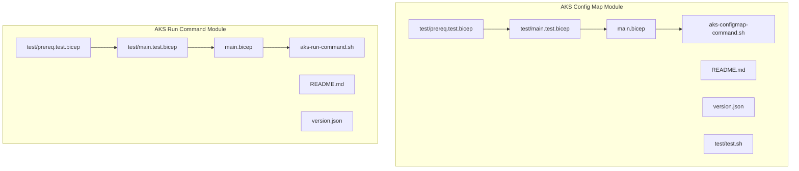
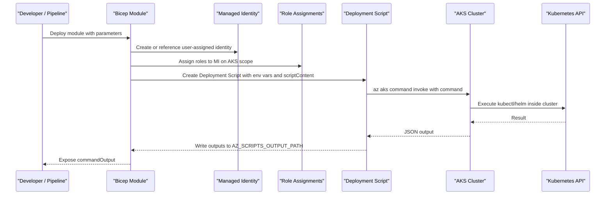
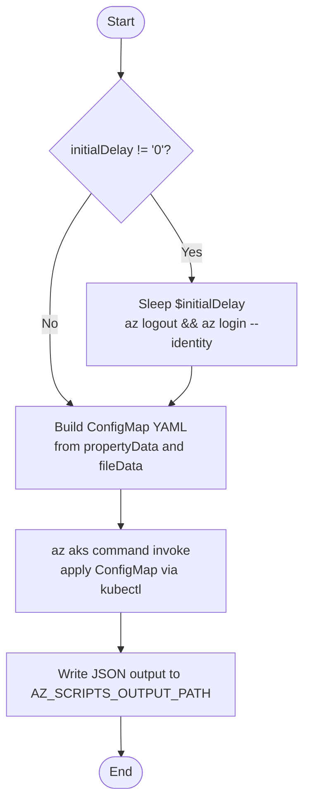
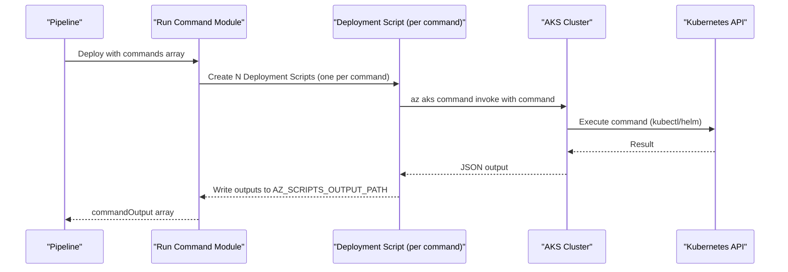
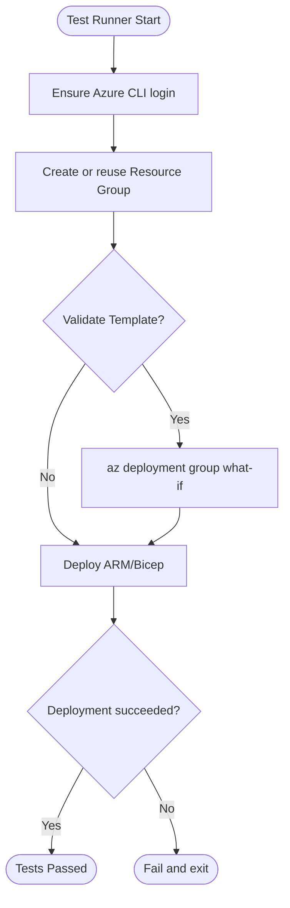
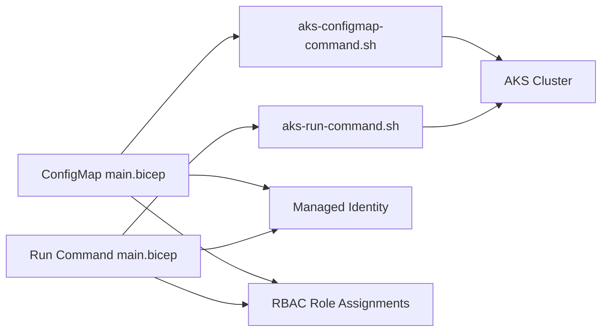

# AKS Tools Modules

<cite>
**Referenced Files in This Document**
- [README.md](file://bicep/modules/aks-config-map/README.md)
- [main.bicep](file://bicep/modules/aks-config-map/main.bicep)
- [aks-configmap-command.sh](file://bicep/modules/aks-config-map/aks-configmap-command.sh)
- [version.json](file://bicep/modules/aks-config-map/version.json)
- [main.test.bicep](file://bicep/modules/aks-config-map/test/main.test.bicep)
- [prereq.test.bicep](file://bicep/modules/aks-config-map/test/prereq.test.bicep)
- [test.sh](file://bicep/modules/aks-config-map/test/test.sh)
- [README.md](file://bicep/modules/aks-run-command/README.md)
- [main.bicep](file://bicep/modules/aks-run-command/main.bicep)
- [aks-run-command.sh](file://bicep/modules/aks-run-command/aks-run-command.sh)
- [version.json](file://bicep/modules/aks-run-command/version.json)
- [main.test.bicep](file://bicep/modules/aks-run-command/test/main.test.bicep)
- [prereq.test.bicep](file://bicep/modules/aks-run-command/test/prereq.test.bicep)
</cite>

## Table of Contents
1. Introduction
2. Project Structure
3. Core Components
4. Architecture Overview
5. Detailed Component Analysis
6. Dependency Analysis
7. Performance Considerations
8. Troubleshooting Guide
9. Conclusion
10. Appendices

## Introduction
This document provides comprehensive documentation for the AKS utility modules that enable operational management of Azure Kubernetes Service clusters using Infrastructure as Code and Azure CLI deployment scripts. It focuses on two modules:
- ConfigMap module: Creates and manages Kubernetes ConfigMaps with environment-specific values via Azure CLI Deployment Scripts.
- Run Command module: Executes arbitrary commands (e.g., kubectl, helm) inside an AKS cluster through the AKS API using Azure CLI Deployment Scripts.

These modules encapsulate RBAC setup, managed identity handling, script execution, and output capture to simplify common operational tasks in CI/CD pipelines.

## Project Structure
The AKS tools are organized as Bicep modules under bicep/modules, each containing:
- main.bicep: Module definition, parameters, resources (managed identity, role assignments, deployment script), and outputs.
- aks-*-command.sh: Shell scripts executed by Azure CLI Deployment Scripts to perform operations against the AKS cluster.
- README.md: Parameter and usage documentation.
- test/: Automated tests including prerequisites, test scenarios, and a shell harness for validation and deployment.
- version.json: Module versioning metadata for registry publishing.

**Diagram sources**
- [main.bicep](file://bicep/modules/aks-config-map/main.bicep)
- [aks-configmap-command.sh](file://bicep/modules/aks-config-map/aks-configmap-command.sh)
- [main.bicep](file://bicep/modules/aks-run-command/main.bicep)
- [aks-run-command.sh](file://bicep/modules/aks-run-command/aks-run-command.sh)
- [main.test.bicep](file://bicep/modules/aks-config-map/test/main.test.bicep)
- [main.test.bicep](file://bicep/modules/aks-run-command/test/main.test.bicep)
- [prereq.test.bicep](file://bicep/modules/aks-config-map/test/prereq.test.bicep)
- [prereq.test.bicep](file://bicep/modules/aks-run-command/test/prereq.test.bicep)

**Section sources**
- [main.bicep](file://bicep/modules/aks-config-map/main.bicep)
- [aks-configmap-command.sh](file://bicep/modules/aks-config-map/aks-configmap-command.sh)
- [main.bicep](file://bicep/modules/aks-run-command/main.bicep)
- [aks-run-command.sh](file://bicep/modules/aks-run-command/aks-run-command.sh)
- [main.test.bicep](file://bicep/modules/aks-config-map/test/main.test.bicep)
- [main.test.bicep](file://bicep/modules/aks-run-command/test/main.test.bicep)
- [prereq.test.bicep](file://bicep/modules/aks-config-map/test/prereq.test.bicep)
- [prereq.test.bicep](file://bicep/modules/aks-run-command/test/prereq.test.bicep)
- [test.sh](file://bicep/modules/aks-config-map/test/test.sh)

## Core Components
- AKS ConfigMap Module
  - Purpose: Create or update a Kubernetes ConfigMap in a target namespace with property-like and file-like data.
  - Key capabilities: Managed identity creation or reuse, RBAC role assignments to the deployment script identity, environment-driven YAML generation, and command invocation via az aks command invoke.
  - Parameters include cluster name, location, identity selection, RBAC roles, config map name, namespace, property and file data arrays, delay, cleanup preference, and cross-tenant support.
  - Outputs provide the deployment script name and captured command output.

- AKS Run Command Module
  - Purpose: Execute one or more commands (e.g., kubectl, helm) within an AKS cluster using Azure CLI Deployment Scripts.
  - Key capabilities: Per-command deployment script instances with batching control, managed identity and RBAC setup, environment variables for context, and per-command output capture.
  - Parameters include cluster name, location, identity selection, RBAC roles, commands array, delay, cleanup preference, and cross-tenant support.
  - Outputs provide an array of results indexed by command order.

**Section sources**
- [README.md](file://bicep/modules/aks-config-map/README.md)
- [main.bicep](file://bicep/modules/aks-config-map/main.bicep)
- [aks-configmap-command.sh](file://bicep/modules/aks-config-map/aks-configmap-command.sh)
- [README.md](file://bicep/modules/aks-run-command/README.md)
- [main.bicep](file://bicep/modules/aks-run-command/main.bicep)
- [aks-run-command.sh](file://bicep/modules/aks-run-command/aks-run-command.sh)

## Architecture Overview
Both modules follow a consistent architecture pattern:
- Bicep module defines resources:
  - Existing AKS cluster reference
  - User-assigned managed identity (new or existing)
  - Role assignments scoped to the AKS cluster for required permissions
  - Azure CLI Deployment Script resource(s) configured with environment variables and embedded script content
- The Deployment Script executes az aks command invoke to run commands against the AKS control plane, which then runs kubectl/helm inside the cluster.
- Outputs from the Deployment Script are captured and exposed by the module.

**Diagram sources**
- [main.bicep](file://bicep/modules/aks-config-map/main.bicep)
- [aks-configmap-command.sh](file://bicep/modules/aks-config-map/aks-configmap-command.sh)
- [main.bicep](file://bicep/modules/aks-run-command/main.bicep)
- [aks-run-command.sh](file://bicep/modules/aks-run-command/aks-run-command.sh)

## Detailed Component Analysis

### AKS ConfigMap Module
- Responsibilities
  - Build a ConfigMap manifest from parameterized property and file data.
  - Apply it to the specified namespace in the target AKS cluster.
  - Manage identity and permissions for secure execution.

- Data flow
  - Property-like entries are converted into key-value pairs in YAML.
  - File-like entries are appended as multi-line blocks in YAML.
  - The combined YAML is piped to kubectl apply via az aks command invoke.

- Error handling
  - Script exits on error to fail fast.
  - Optional initial delay and forced re-login to mitigate RBAC propagation delays.
  - Cleanup preferences control retention of deployment script artifacts.

- Security considerations
  - Uses least-privilege RBAC roles scoped to the AKS cluster.
  - Supports existing managed identities to avoid unnecessary privilege escalation.
  - Cross-tenant deployments supported via delegated managed identity resource ID.

**Diagram sources**
- [aks-configmap-command.sh](file://bicep/modules/aks-config-map/aks-configmap-command.sh)

**Section sources**
- [main.bicep](file://bicep/modules/aks-config-map/main.bicep)
- [aks-configmap-command.sh](file://bicep/modules/aks-configmap-command.sh)
- [README.md](file://bicep/modules/aks-config-map/README.md)

### AKS Run Command Module
- Responsibilities
  - Execute one or more commands in the AKS cluster using Azure CLI Deployment Scripts.
  - Provide per-command isolation and output capture.

- Data flow
  - Each command becomes a separate Deployment Script instance (batch size 1).
  - Environment variables pass context (resource group, cluster name, command, loop index).
  - Commands are executed via az aks command invoke; outputs are captured and returned.

- Error handling
  - First command waits for RBAC replication if configured, then forces identity refresh.
  - Exit-on-error ensures failures propagate to the pipeline.

- Security considerations
  - RBAC roles assigned to the deployment script’s managed identity.
  - Supports existing managed identities and cross-tenant delegation.

**Diagram sources**
- [main.bicep](file://bicep/modules/aks-run-command/main.bicep)
- [aks-run-command.sh](file://bicep/modules/aks-run-command/aks-run-command.sh)

**Section sources**
- [main.bicep](file://bicep/modules/aks-run-command/main.bicep)
- [aks-run-command.sh](file://bicep/modules/aks-run-command/aks-run-command.sh)
- [README.md](file://bicep/modules/aks-run-command/README.md)

### Testing Approaches and Parameter Validation
- Test structure
  - Prerequisite modules provision minimal AKS clusters for testing.
  - Test modules exercise both simple and complex scenarios:
    - ConfigMap: property-only, file-only, and mixed data; also templated values for Helm.
    - Run Command: read-only queries, write operations, and Helm installs.
  - A shell runner validates templates (What-If and validate modes) and deploys them to a dedicated resource group.

- Parameter validation
  - Tests explicitly set RBAC roles needed for each scenario to ensure least-privilege behavior.
  - Tests demonstrate use of existing managed identities and zero-delay configurations when appropriate.

- Automation
  - The test harness handles login checks, resource group lifecycle, template validation, and deployment outcomes.

**Diagram sources**
- [test.sh](file://bicep/modules/aks-config-map/test/test.sh)
- [main.test.bicep](file://bicep/modules/aks-config-map/test/main.test.bicep)
- [main.test.bicep](file://bicep/modules/aks-run-command/test/main.test.bicep)
- [prereq.test.bicep](file://bicep/modules/aks-config-map/test/prereq.test.bicep)
- [prereq.test.bicep](file://bicep/modules/aks-run-command/test/prereq.test.bicep)

**Section sources**
- [main.test.bicep](file://bicep/modules/aks-config-map/test/main.test.bicep)
- [main.test.bicep](file://bicep/modules/aks-run-command/test/main.test.bicep)
- [test.sh](file://bicep/modules/aks-config-map/test/test.sh)
- [prereq.test.bicep](file://bicep/modules/aks-config-map/test/prereq.test.bicep)
- [prereq.test.bicep](file://bicep/modules/aks-run-command/test/prereq.test.bicep)

## Dependency Analysis
- Module-level dependencies
  - Both modules depend on:
    - An existing AKS cluster resource reference
    - User-assigned managed identity (new or existing)
    - Role assignments scoped to the AKS cluster
    - Azure CLI Deployment Script resource(s)
  - ConfigMap module depends on its shell script to generate and apply YAML.
  - Run Command module depends on its shell script to execute commands.

- External integrations
  - Azure CLI (az aks command invoke)
  - Kubernetes API (via kubectl/helm executed in-cluster)
  - Azure RBAC for authorization

**Diagram sources**
- [main.bicep](file://bicep/modules/aks-config-map/main.bicep)
- [aks-configmap-command.sh](file://bicep/modules/aks-config-map/aks-configmap-command.sh)
- [main.bicep](file://bicep/modules/aks-run-command/main.bicep)
- [aks-run-command.sh](file://bicep/modules/aks-run-command/aks-run-command.sh)

**Section sources**
- [main.bicep](file://bicep/modules/aks-config-map/main.bicep)
- [main.bicep](file://bicep/modules/aks-run-command/main.bicep)

## Performance Considerations
- Deployment Script overhead
  - Each command in the Run Command module creates a separate Deployment Script instance; batch size is set to 1 to sequence execution and isolate outputs.
  - Use multiple commands in a single string where appropriate to reduce provisioning overhead.

- RBAC propagation
  - Initial delays and forced identity refresh help mitigate timing issues after role assignment.
  - For repeated executions, consider using existing managed identities with pre-provisioned roles to minimize delays.

- Timeout and retention
  - Timeouts and retention intervals are configured to balance reliability and cost.
  - Adjust cleanupPreference based on debugging needs versus storage costs.

[No sources needed since this section provides general guidance]

## Troubleshooting Guide
- Common issues
  - RBAC not applied yet: Increase initialScriptDelay or force identity refresh by logging out/in within the script.
  - Permission denied: Ensure the managed identity has the required RBAC roles on the AKS cluster.
  - Command failures: Inspect commandOutput from the module outputs; check cluster connectivity and command syntax.

- Debugging steps
  - Enable What-If validations before deploying to preview changes.
  - Review Deployment Script logs via Azure portal or CLI to inspect stdout/stderr and environment variables.
  - Reduce complexity by running a single command first to isolate issues.

- Error patterns
  - Scripts exit on error to fail fast; pipeline should surface non-zero exit codes.
  - For cross-tenant deployments, verify delegatedManagedIdentityResourceId is set correctly.

**Section sources**
- [aks-configmap-command.sh](file://bicep/modules/aks-configmap-command.sh)
- [aks-run-command.sh](file://bicep/modules/aks-run-command/aks-run-command.sh)
- [main.bicep](file://bicep/modules/aks-config-map/main.bicep)
- [main.bicep](file://bicep/modules/aks-run-command/main.bicep)

## Conclusion
The AKS ConfigMap and Run Command modules provide robust, secure, and reusable building blocks for operational tasks in AKS clusters. They abstract away identity management, RBAC configuration, and script execution while exposing clear inputs and outputs suitable for automation in CI/CD pipelines. By following the recommended practices for RBAC, delays, and cleanup, teams can reliably manage cluster state and execute operational commands at scale.

[No sources needed since this section summarizes without analyzing specific files]

## Appendices

### Common Operational Tasks
- Create a simple ConfigMap with key-value properties.
- Create a ConfigMap with multi-line file contents for application configuration.
- Use a ConfigMap as Helm values by templating file data.
- Run kubectl commands to inspect cluster state.
- Install or upgrade Helm charts via the Run Command module.

**Section sources**
- [README.md](file://bicep/modules/aks-config-map/README.md)
- [README.md](file://bicep/modules/aks-run-command/README.md)
- [main.test.bicep](file://bicep/modules/aks-config-map/test/main.test.bicep)
- [main.test.bicep](file://bicep/modules/aks-run-command/test/main.test.bicep)

### Integration with Deployment Pipelines
- Use the test harness to validate templates before deployment.
- Store sensitive values in environment variables or secret managers; pass them to modules via parameters or environment variables.
- Capture commandOutput for downstream tasks such as reporting or rollback decisions.

**Section sources**
- [test.sh](file://bicep/modules/aks-config-map/test/test.sh)
- [main.bicep](file://bicep/modules/aks-config-map/main.bicep)
- [main.bicep](file://bicep/modules/aks-run-command/main.bicep)

### Security Considerations
- Prefer existing managed identities with least-privilege roles to reduce blast radius.
- Scope RBAC roles to the AKS cluster only.
- Avoid embedding secrets in scripts; use environment variables or external secret stores.
- For cross-tenant scenarios, configure delegated managed identity resource IDs.

**Section sources**
- [main.bicep](file://bicep/modules/aks-config-map/main.bicep)
- [main.bicep](file://bicep/modules/aks-run-command/main.bicep)

### Logging and Monitoring
- Deployment Script outputs are written to AZ_SCRIPTS_OUTPUT_PATH and exposed by the module.
- Inspect Deployment Script logs in Azure Portal or via CLI for detailed diagnostics.
- Integrate with Azure Monitor or Log Analytics by forwarding logs from your pipeline or cluster components as needed.

**Section sources**
- [aks-configmap-command.sh](file://bicep/modules/aks-configmap-command.sh)
- [aks-run-command.sh](file://bicep/modules/aks-run-command/aks-run-command.sh)
- [main.bicep](file://bicep/modules/aks-config-map/main.bicep)
- [main.bicep](file://bicep/modules/aks-run-command/main.bicep)