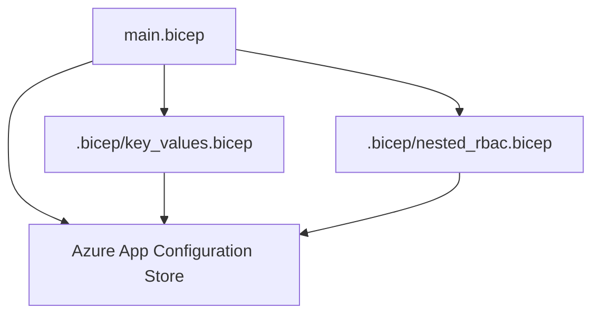
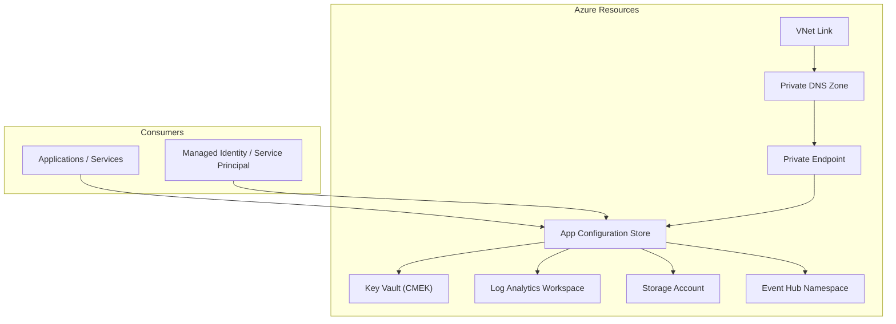
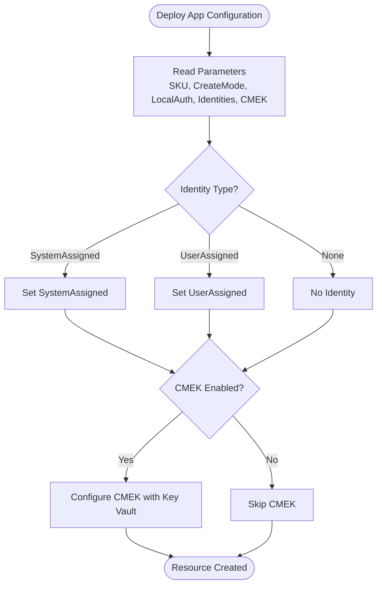
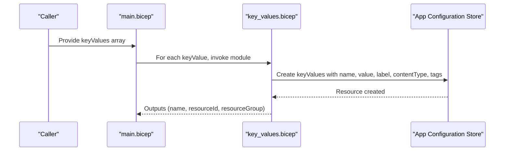
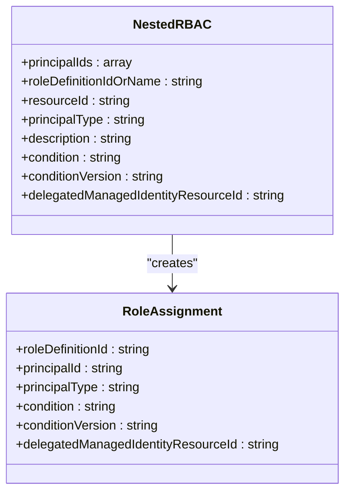
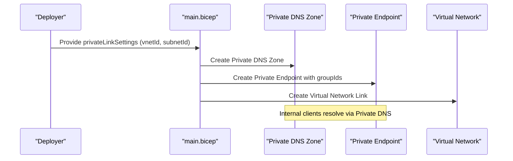
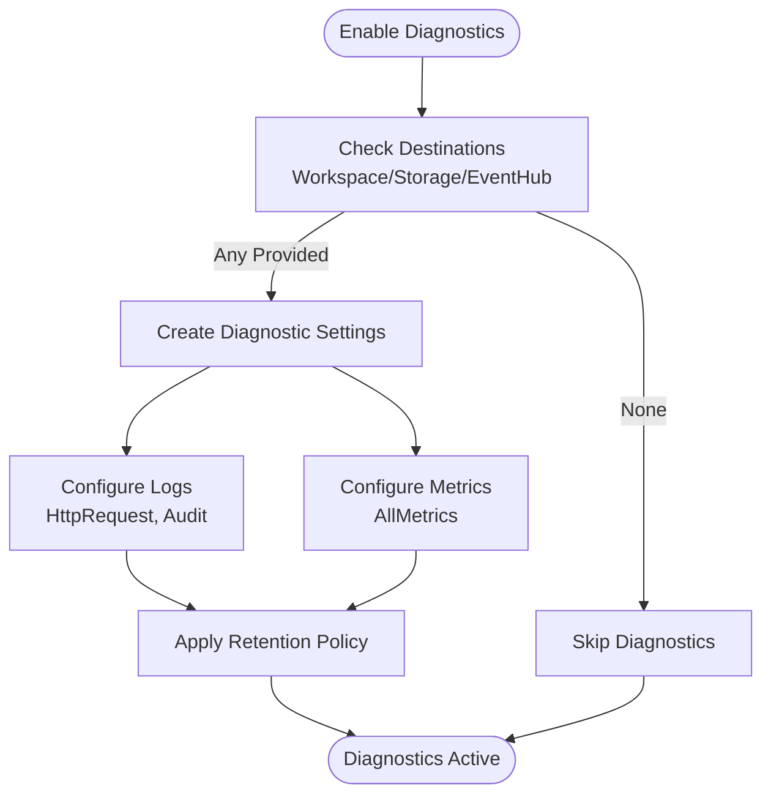
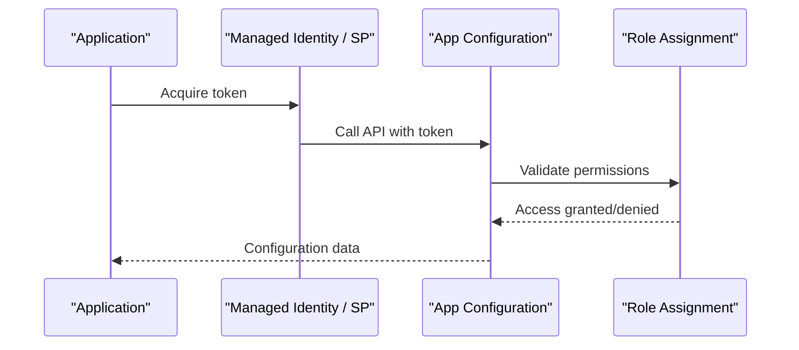
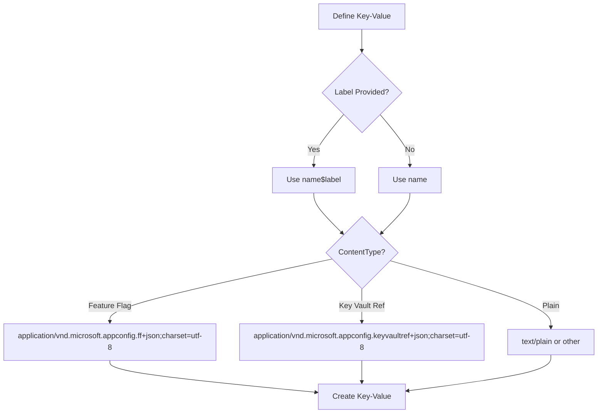
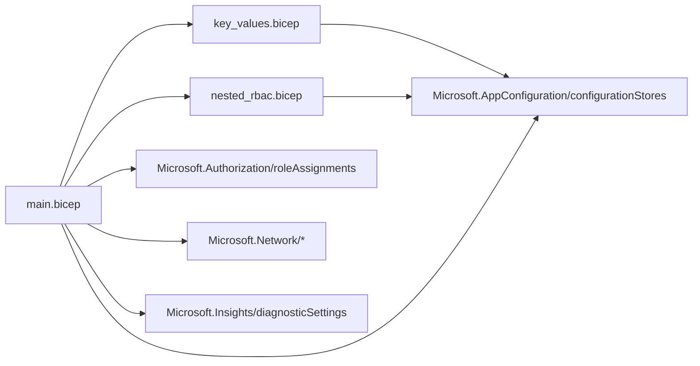

# Application Configuration Module

<cite>
**Referenced Files in This Document**
- [main.bicep](file://bicep/modules/app-configuration/main.bicep)
- [key_values.bicep](file://bicep/modules/app-configuration/.bicep/key_values.bicep)
- [nested_rbac.bicep](file://bicep/modules/app-configuration/.bicep/nested_rbac.bicep)
- [README.md](file://bicep/modules/app-configuration/README.md)
- [metadata.json](file://bicep/modules/app-configuration/metadata.json)
- [blade_configuration.bicep](file://bicep/modules/blade_configuration.bicep)
</cite>

## Table of Contents
1. [Introduction](#introduction)
2. [Project Structure](#project-structure)
3. [Core Components](#core-components)
4. [Architecture Overview](#architecture-overview)
5. [Detailed Component Analysis](#detailed-component-analysis)
6. [Dependency Analysis](#dependency-analysis)
7. [Performance Considerations](#performance-considerations)
8. [Troubleshooting Guide](#troubleshooting-guide)
9. [Conclusion](#conclusion)
10. [Appendices](#appendices)

## Introduction
This document provides comprehensive documentation for the Application Configuration Bicep module that provisions Azure App Configuration resources. It covers key-value store creation with feature flags, labels, and content types; nested RBAC configuration for fine-grained access control; integration patterns using managed identities and service principals; configuration hierarchies and versioning strategies; synchronization across environments; security best practices; backup procedures; and monitoring configuration for production usage.

## Project Structure
The module is organized into a main entrypoint and two nested modules:
- Main module: provisions the App Configuration store, optional private link, diagnostics, encryption, locks, and orchestrates nested modules for key values and RBAC.
- Key values module: creates individual key-value entries with labels and content types under the parent store.
- Nested RBAC module: assigns roles to principals at the App Configuration scope with support for conditions and delegated managed identity.

**Diagram sources**
- [main.bicep:142-218](file://bicep/modules/app-configuration/main.bicep#L142-L218)
- [key_values.bicep:19-34](file://bicep/modules/app-configuration/.bicep/key_values.bicep#L19-L34)
- [nested_rbac.bicep:56-72](file://bicep/modules/app-configuration/.bicep/nested_rbac.bicep#L56-L72)

**Section sources**
- [main.bicep:1-312](file://bicep/modules/app-configuration/main.bicep#L1-L312)
- [key_values.bicep:1-43](file://bicep/modules/app-configuration/.bicep/key_values.bicep#L1-L43)
- [nested_rbac.bicep:1-73](file://bicep/modules/app-configuration/.bicep/nested_rbac.bicep#L1-L73)
- [README.md:1-179](file://bicep/modules/app-configuration/README.md#L1-L179)

## Core Components
- App Configuration store provisioning with SKU, create mode, local auth controls, and optional system/user-assigned managed identities.
- Optional Customer Managed Encryption Key (CMEK) via Key Vault.
- Optional Private Link with Private Endpoint, Private DNS Zone, and Virtual Network Link.
- Diagnostics streaming to Log Analytics, Storage Account, or Event Hubs with configurable retention and categories.
- Resource lock to protect against accidental changes or deletions.
- Key-value entries with labels, content types, and tags.
- Fine-grained RBAC assignments with built-in role mapping, conditions, and principal type support.

Key capabilities are exposed through parameters and outputs, enabling consumption by higher-level deployments.

**Section sources**
- [main.bicep:7-112](file://bicep/modules/app-configuration/main.bicep#L7-L112)
- [main.bicep:142-218](file://bicep/modules/app-configuration/main.bicep#L142-L218)
- [main.bicep:233-311](file://bicep/modules/app-configuration/main.bicep#L233-L311)
- [key_values.bicep:1-43](file://bicep/modules/app-configuration/.bicep/key_values.bicep#L1-L43)
- [nested_rbac.bicep:1-73](file://bicep/modules/app-configuration/.bicep/nested_rbac.bicep#L1-L73)

## Architecture Overview
The module composes several Azure resources to deliver a secure, observable, and accessible App Configuration service. Applications consume configuration via endpoints and can authenticate using managed identities or service principals.

**Diagram sources**
- [main.bicep:142-170](file://bicep/modules/app-configuration/main.bicep#L142-L170)
- [main.bicep:195-206](file://bicep/modules/app-configuration/main.bicep#L195-L206)
- [main.bicep:249-311](file://bicep/modules/app-configuration/main.bicep#L249-L311)

## Detailed Component Analysis

### App Configuration Store Provisioning
- Creates an App Configuration resource with configurable SKU, create mode, and authentication settings.
- Supports disabling local auth to enforce AAD-only access.
- Enables system-assigned or user-assigned managed identities for secure access.
- Optionally configures CMEK using a Key Vault key and client identity.

**Diagram sources**
- [main.bicep:139-170](file://bicep/modules/app-configuration/main.bicep#L139-L170)

**Section sources**
- [main.bicep:139-170](file://bicep/modules/app-configuration/main.bicep#L139-L170)

### Key-Value Entries with Labels and Content Types
- Each key-value item is created as a child resource under the App Configuration store.
- Supports labels for environment/version scoping and content types for structured data such as feature flags or Key Vault references.
- Tags can be applied per key-value for governance and filtering.

**Diagram sources**
- [main.bicep:172-182](file://bicep/modules/app-configuration/main.bicep#L172-L182)
- [key_values.bicep:19-34](file://bicep/modules/app-configuration/.bicep/key_values.bicep#L19-L34)

**Section sources**
- [key_values.bicep:1-43](file://bicep/modules/app-configuration/.bicep/key_values.bicep#L1-L43)
- [main.bicep:172-182](file://bicep/modules/app-configuration/main.bicep#L172-L182)

### Nested RBAC Configuration
- Assigns roles to principals on the App Configuration store with support for built-in roles and custom role IDs.
- Allows specifying principal types and optional conditions with condition versions.
- Supports delegated managed identity scenarios.

**Diagram sources**
- [nested_rbac.bicep:1-73](file://bicep/modules/app-configuration/.bicep/nested_rbac.bicep#L1-L73)

**Section sources**
- [nested_rbac.bicep:1-73](file://bicep/modules/app-configuration/.bicep/nested_rbac.bicep#L1-L73)

### Private Link Integration
- Conditionally creates a Private Endpoint linked to the App Configuration store.
- Sets up a Private DNS Zone and links it to the consumer Virtual Network for internal resolution.

**Diagram sources**
- [main.bicep:233-311](file://bicep/modules/app-configuration/main.bicep#L233-L311)

**Section sources**
- [main.bicep:233-311](file://bicep/modules/app-configuration/main.bicep#L233-L311)

### Diagnostics and Monitoring
- Configures diagnostic settings to stream logs and metrics to Log Analytics, Storage Account, or Event Hubs.
- Supports configurable retention days and specific log categories (e.g., HttpRequest, Audit).

**Diagram sources**
- [main.bicep:120-137](file://bicep/modules/app-configuration/main.bicep#L120-L137)
- [main.bicep:195-206](file://bicep/modules/app-configuration/main.bicep#L195-L206)

**Section sources**
- [main.bicep:120-137](file://bicep/modules/app-configuration/main.bicep#L120-L137)
- [main.bicep:195-206](file://bicep/modules/app-configuration/main.bicep#L195-L206)

### Integration Patterns with Managed Identities and Service Principals
- The module supports both system-assigned and user-assigned managed identities for the App Configuration store.
- Role assignments can grant read/write access to applications using service principals or managed identities.
- In practice, consumers can use workload identities or service principals to authenticate to the App Configuration endpoint securely.

**Diagram sources**
- [main.bicep:139-170](file://bicep/modules/app-configuration/main.bicep#L139-L170)
- [nested_rbac.bicep:56-72](file://bicep/modules/app-configuration/.bicep/nested_rbac.bicep#L56-L72)
- [blade_configuration.bicep:355-387](file://bicep/modules/blade_configuration.bicep#L355-L387)

**Section sources**
- [main.bicep:139-170](file://bicep/modules/app-configuration/main.bicep#L139-L170)
- [nested_rbac.bicep:56-72](file://bicep/modules/app-configuration/.bicep/nested_rbac.bicep#L56-L72)
- [blade_configuration.bicep:355-387](file://bicep/modules/blade_configuration.bicep#L355-L387)

### Feature Flags, Labels, and Content Types
- Feature flags are represented as key-values with a special naming convention and content type indicating feature flag payloads.
- Labels enable environment or version scoping (e.g., development, staging, production).
- Content types allow structured values such as Key Vault references or JSON configurations.

**Diagram sources**
- [key_values.bicep:23-34](file://bicep/modules/app-configuration/.bicep/key_values.bicep#L23-L34)
- [README.md:59-112](file://bicep/modules/app-configuration/README.md#L59-L112)

**Section sources**
- [key_values.bicep:23-34](file://bicep/modules/app-configuration/.bicep/key_values.bicep#L23-L34)
- [README.md:59-112](file://bicep/modules/app-configuration/README.md#L59-L112)

## Dependency Analysis
- The main module depends on Azure provider APIs for App Configuration, Authorization, Network, and Insights resources.
- Nested modules depend on the parent App Configuration store resource.
- RBAC module maps built-in role names to their subscription-scoped role definition IDs and applies them at the store scope.

**Diagram sources**
- [main.bicep:142-218](file://bicep/modules/app-configuration/main.bicep#L142-L218)
- [nested_rbac.bicep:36-72](file://bicep/modules/app-configuration/.bicep/nested_rbac.bicep#L36-L72)

**Section sources**
- [main.bicep:142-218](file://bicep/modules/app-configuration/main.bicep#L142-L218)
- [nested_rbac.bicep:36-72](file://bicep/modules/app-configuration/.bicep/nested_rbac.bicep#L36-L72)

## Performance Considerations
- Use labels to segment configuration by environment or version to minimize retrieval overhead and avoid unnecessary branching logic in applications.
- Prefer content types that enable server-side transformations (e.g., Key Vault references) to reduce secret handling complexity in applications.
- Limit the number of key-value entries per store to maintain efficient lookups; consider multiple stores if scaling beyond typical limits.
- Enable diagnostics selectively to balance observability with cost.

[No sources needed since this section provides general guidance]

## Troubleshooting Guide
Common issues and resolutions:
- Authentication failures: Ensure the consuming identity has appropriate RBAC roles (e.g., App Configuration Data Reader/Owner) assigned at the store scope.
- Private Link connectivity: Verify that the Private Endpoint is created, the Private DNS Zone exists, and the Virtual Network Link is configured correctly.
- Diagnostics not streaming: Confirm that destination IDs (workspace, storage account, event hub) are valid and that diagnostic settings are enabled.
- CMEK errors: Validate Key Vault permissions for the configured client identity and ensure the key identifier format is correct.

**Section sources**
- [nested_rbac.bicep:56-72](file://bicep/modules/app-configuration/.bicep/nested_rbac.bicep#L56-L72)
- [main.bicep:195-206](file://bicep/modules/app-configuration/main.bicep#L195-L206)
- [main.bicep:249-311](file://bicep/modules/app-configuration/main.bicep#L249-L311)
- [main.bicep:163-168](file://bicep/modules/app-configuration/main.bicep#L163-L168)

## Conclusion
The Application Configuration Bicep module provides a robust foundation for managing Azure App Configuration resources with strong security, observability, and networking controls. It supports feature flags, labels, and content types for flexible configuration management, while offering fine-grained RBAC and integration patterns for modern applications using managed identities and service principals. With optional Private Link, CMEK, and diagnostics, it meets production-grade requirements for confidentiality, integrity, and availability.

[No sources needed since this section summarizes without analyzing specific files]

## Appendices

### Configuration Hierarchies and Versioning Strategies
- Use labels to represent environments (development, staging, production) and versions (v1, v2) to organize configuration hierarchically.
- Combine labels with content types to manage different configuration formats (plain text, JSON, feature flags, Key Vault references).
- Maintain separate key namespaces for distinct services or domains within the same store to avoid collisions.

[No sources needed since this section provides general guidance]

### Synchronization Approaches Across Environments
- Replicate configuration structures across environments using consistent labeling and naming conventions.
- Leverage CI/CD pipelines to deploy environment-specific key-values with targeted labels.
- Use GitOps workflows to synchronize configuration changes consistently across environments.

[No sources needed since this section provides general guidance]

### Security Best Practices
- Disable local auth to enforce AAD-based authentication.
- Use least-privilege RBAC roles for application identities.
- Enable CMEK for encryption at rest with a dedicated Key Vault and controlled access.
- Restrict network access via Private Link and firewall rules where applicable.

**Section sources**
- [main.bicep:156-168](file://bicep/modules/app-configuration/main.bicep#L156-L168)
- [nested_rbac.bicep:36-72](file://bicep/modules/app-configuration/.bicep/nested_rbac.bicep#L36-L72)

### Backup Procedures
- While the module does not implement backups directly, configure diagnostic logging and integrate with external backup solutions as needed.
- Use Azure-native tools or third-party services to export configuration periodically for disaster recovery.

[No sources needed since this section provides general guidance]

### Monitoring Configuration
- Enable HttpRequest and Audit logs along with AllMetrics for comprehensive visibility.
- Stream logs to Log Analytics for querying and alerting; optionally use Storage or Event Hubs for long-term retention or real-time processing.
- Set retention policies aligned with compliance requirements.

**Section sources**
- [main.bicep:120-137](file://bicep/modules/app-configuration/main.bicep#L120-L137)
- [main.bicep:195-206](file://bicep/modules/app-configuration/main.bicep#L195-L206)