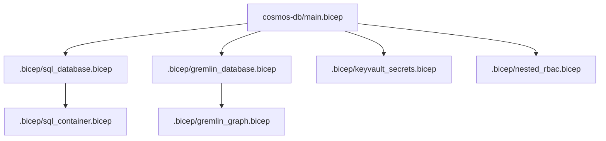
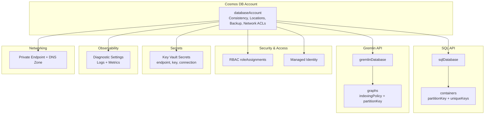
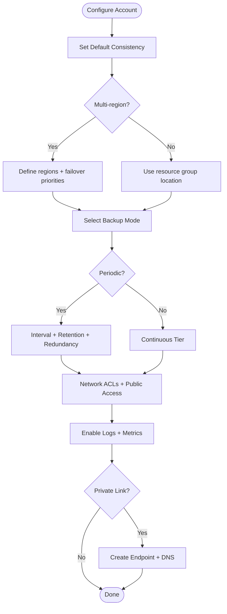
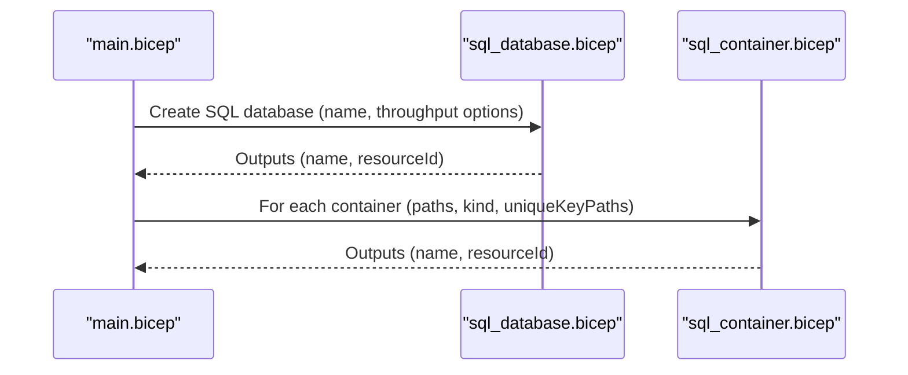
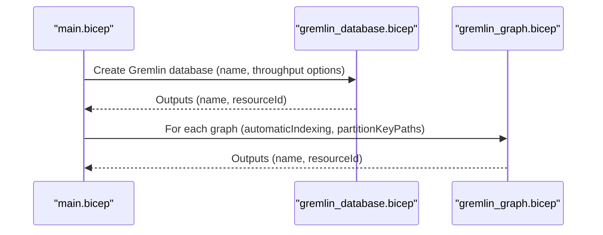
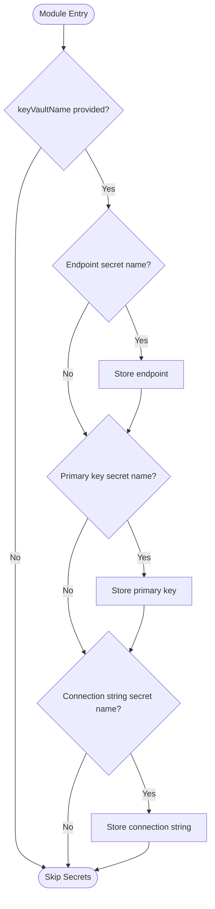
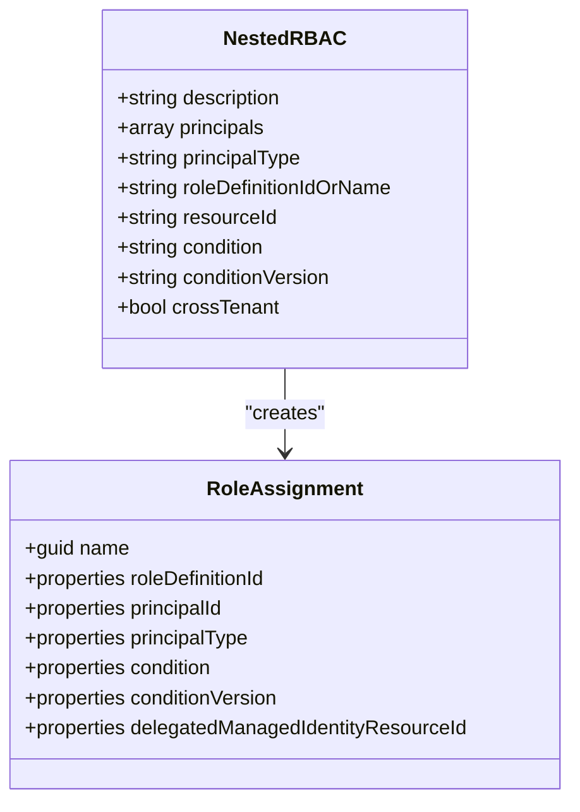
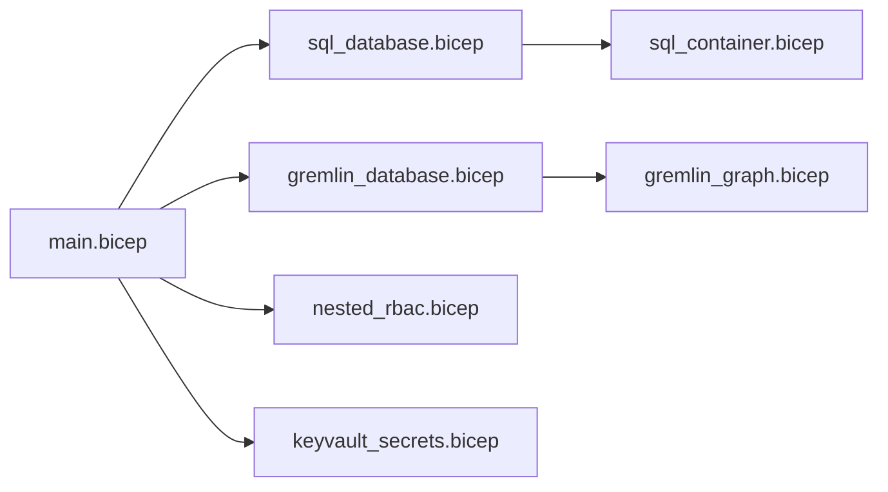

# Cosmos DB Module

<cite>
**Referenced Files in This Document**
- [main.bicep](file://bicep/modules/cosmos-db/main.bicep)
- [README.md](file://bicep/modules/cosmos-db/README.md)
- [sql_database.bicep](file://bicep/modules/cosmos-db/.bicep/sql_database.bicep)
- [sql_container.bicep](file://bicep/modules/cosmos-db/.bicep/sql_container.bicep)
- [gremlin_database.bicep](file://bicep/modules/cosmos-db/.bicep/gremlin_database.bicep)
- [gremlin_graph.bicep](file://bicep/modules/cosmos-db/.bicep/gremlin_graph.bicep)
- [keyvault_secrets.bicep](file://bicep/modules/cosmos-db/.bicep/keyvault_secrets.bicep)
- [nested_rbac.bicep](file://bicep/modules/cosmos-db/.bicep/nested_rbac.bicep)
</cite>

## Table of Contents
1. Introduction
2. Project Structure
3. Core Components
4. Architecture Overview
5. Detailed Component Analysis
6. Dependency Analysis
7. Performance Considerations
8. Troubleshooting Guide
9. Conclusion
10. Appendices

## Introduction
This document provides comprehensive guidance for the Cosmos DB Bicep module that provisions Azure Cosmos DB accounts with multiple API types (SQL, Gremlin, and MongoDB). It explains how to create SQL databases and containers with partitioning strategies, throughput settings, and indexing policies; set up Gremlin graph databases with vertex and edge definitions; integrate Key Vault for secret management; and assign RBAC roles. It also covers backup policies, geo-redundancy settings, monitoring configuration, capacity planning, and performance tuning for production deployments.

## Project Structure
The module is organized as a top-level Bicep module that creates a Cosmos DB account and then instantiates nested modules for SQL and Gremlin resources, along with optional Key Vault secret storage and RBAC role assignments.

**Diagram sources**
- [main.bicep:343-417](file://bicep/modules/cosmos-db/main.bicep#L343-L417)
- [sql_database.bicep:19-52](file://bicep/modules/cosmos-db/.bicep/sql_database.bicep#L19-L52)
- [gremlin_database.bicep:19-51](file://bicep/modules/cosmos-db/.bicep/gremlin_database.bicep#L19-L51)
- [sql_container.bicep:30-61](file://bicep/modules/cosmos-db/.bicep/sql_container.bicep#L30-L61)
- [gremlin_graph.bicep:19-42](file://bicep/modules/cosmos-db/.bicep/gremlin_graph.bicep#L19-L42)
- [keyvault_secrets.bicep:11-22](file://bicep/modules/cosmos-db/.bicep/keyvault_secrets.bicep#L11-L22)
- [nested_rbac.bicep:65-81](file://bicep/modules/cosmos-db/.bicep/nested_rbac.bicep#L65-L81)

**Section sources**
- [main.bicep:1-211](file://bicep/modules/cosmos-db/main.bicep#L1-L211)
- [README.md:9-53](file://bicep/modules/cosmos-db/README.md#L9-L53)

## Core Components
- Cosmos DB Account: Configurable consistency, multi-region writes, backup policy, network ACLs, private link, diagnostics, and encryption key integration.
- SQL API: Database and container creation with autoscale or RU provisioning, partition keys, unique keys, and kind-based partitioning.
- Gremlin API: Graph database and graphs with automatic indexing and partition key paths.
- Key Vault Integration: Optional storage of endpoint, primary key, and connection string secrets.
- RBAC: Role assignments scoped to the Cosmos DB account with support for cross-tenant scenarios.

Key capabilities include:
- Consistency levels: Eventual, ConsistentPrefix, Session, BoundedStaleness, Strong.
- Backup modes: Periodic and Continuous with configurable tiers and retention.
- Multi-region write: Configure failover priorities and zone redundancy per region.
- Diagnostics: Stream logs and metrics to Log Analytics, Storage, or Event Hubs.
- Private Link: Private endpoints with DNS zones for secure access.

**Section sources**
- [main.bicep:17-211](file://bicep/modules/cosmos-db/main.bicep#L17-L211)
- [main.bicep:249-353](file://bicep/modules/cosmos-db/main.bicep#L249-L353)
- [main.bicep:389-417](file://bicep/modules/cosmos-db/main.bicep#L389-L417)
- [main.bicep:453-512](file://bicep/modules/cosmos-db/main.bicep#L453-L512)
- [main.bicep:519-586](file://bicep/modules/cosmos-db/main.bicep#L519-L586)

## Architecture Overview
The module composes a Cosmos DB account with child resources and integrates security, networking, observability, and secrets management.

**Diagram sources**
- [main.bicep:295-353](file://bicep/modules/cosmos-db/main.bicep#L295-L353)
- [sql_database.bicep:19-41](file://bicep/modules/cosmos-db/.bicep/sql_database.bicep#L19-L41)
- [sql_container.bicep:38-61](file://bicep/modules/cosmos-db/.bicep/sql_container.bicep#L38-L61)
- [gremlin_database.bicep:19-40](file://bicep/modules/cosmos-db/.bicep/gremlin_database.bicep#L19-L40)
- [gremlin_graph.bicep:27-42](file://bicep/modules/cosmos-db/.bicep/gremlin_graph.bicep#L27-L42)
- [nested_rbac.bicep:65-81](file://bicep/modules/cosmos-db/.bicep/nested_rbac.bicep#L65-L81)
- [keyvault_secrets.bicep:11-22](file://bicep/modules/cosmos-db/.bicep/keyvault_secrets.bicep#L11-L22)
- [main.bicep:389-417](file://bicep/modules/cosmos-db/main.bicep#L389-L417)
- [main.bicep:453-512](file://bicep/modules/cosmos-db/main.bicep#L453-L512)

## Detailed Component Analysis

### Cosmos DB Account Configuration
- Consistency Policy: Select from Eventual, ConsistentPrefix, Session, BoundedStaleness, Strong. For Bounded Staleness, configure max stale prefix and interval.
- Multi-region Writes: Define locations with failover priority and zone redundancy. If empty, defaults to single region.
- Backup Policy: Choose Periodic or Continuous. For Periodic, set interval and retention hours and storage redundancy. For Continuous, choose tier.
- Network Restrictions: IP rules, virtual network rules, public network access, and ACL bypass.
- Diagnostics: Enable logs and metrics streaming to Log Analytics, Storage, or Event Hubs with retention.
- Private Link: Create private endpoint and DNS zone group for secure connectivity.
- Encryption: Optionally provide a customer-managed key URI.

**Diagram sources**
- [main.bicep:249-353](file://bicep/modules/cosmos-db/main.bicep#L249-L353)
- [main.bicep:389-417](file://bicep/modules/cosmos-db/main.bicep#L389-L417)
- [main.bicep:453-512](file://bicep/modules/cosmos-db/main.bicep#L453-L512)

**Section sources**
- [main.bicep:17-211](file://bicep/modules/cosmos-db/main.bicep#L17-L211)
- [main.bicep:249-353](file://bicep/modules/cosmos-db/main.bicep#L249-L353)
- [main.bicep:389-417](file://bicep/modules/cosmos-db/main.bicep#L389-L417)
- [main.bicep:453-512](file://bicep/modules/cosmos-db/main.bicep#L453-L512)

### SQL Database and Container Creation
- SQL Database: Created under the account with autoscale or RU throughput based on serverless capability detection.
- Containers: Define partition key paths, unique key paths, and partition kind (Hash, MultiHash, Range). Throughput can be set at container level unless serverless is enabled.

**Diagram sources**
- [main.bicep:355-364](file://bicep/modules/cosmos-db/main.bicep#L355-L364)
- [sql_database.bicep:19-52](file://bicep/modules/cosmos-db/.bicep/sql_database.bicep#L19-L52)
- [sql_container.bicep:30-61](file://bicep/modules/cosmos-db/.bicep/sql_container.bicep#L30-L61)

**Section sources**
- [sql_database.bicep:1-62](file://bicep/modules/cosmos-db/.bicep/sql_database.bicep#L1-L62)
- [sql_container.bicep:1-71](file://bicep/modules/cosmos-db/.bicep/sql_container.bicep#L1-L71)

### Gremlin Graph Database Setup
- Gremlin Database: Created under the account with autoscale or RU throughput.
- Graphs: Configure automatic indexing and partition key paths for vertices and edges.

**Diagram sources**
- [main.bicep:366-375](file://bicep/modules/cosmos-db/main.bicep#L366-L375)
- [gremlin_database.bicep:19-51](file://bicep/modules/cosmos-db/.bicep/gremlin_database.bicep#L19-L51)
- [gremlin_graph.bicep:19-42](file://bicep/modules/cosmos-db/.bicep/gremlin_graph.bicep#L19-L42)

**Section sources**
- [gremlin_database.bicep:1-61](file://bicep/modules/cosmos-db/.bicep/gremlin_database.bicep#L1-L61)
- [gremlin_graph.bicep:1-52](file://bicep/modules/cosmos-db/.bicep/gremlin_graph.bicep#L1-L52)

### Key Vault Integration for Secret Management
- Secrets stored: Document endpoint, primary master key, and connection string.
- Conditional creation: Secrets are created when corresponding parameters are provided. System partition mode supports dedicated secret names.

**Diagram sources**
- [main.bicep:519-586](file://bicep/modules/cosmos-db/main.bicep#L519-L586)
- [keyvault_secrets.bicep:11-22](file://bicep/modules/cosmos-db/.bicep/keyvault_secrets.bicep#L11-L22)

**Section sources**
- [main.bicep:519-586](file://bicep/modules/cosmos-db/main.bicep#L519-L586)
- [keyvault_secrets.bicep:1-32](file://bicep/modules/cosmos-db/.bicep/keyvault_secrets.bicep#L1-L32)

### RBAC Role Assignments
- Role assignments are applied to the Cosmos DB account with support for built-in roles and custom role IDs.
- Cross-tenant scenarios supported via delegated managed identity resource ID.

**Diagram sources**
- [nested_rbac.bicep:1-82](file://bicep/modules/cosmos-db/.bicep/nested_rbac.bicep#L1-L82)

**Section sources**
- [main.bicep:407-417](file://bicep/modules/cosmos-db/main.bicep#L407-L417)
- [nested_rbac.bicep:1-82](file://bicep/modules/cosmos-db/.bicep/nested_rbac.bicep#L1-L82)

## Dependency Analysis
- The main module depends on nested modules for SQL and Gremlin resources, RBAC, and Key Vault secrets.
- SQL and Gremlin modules reference existing Cosmos DB accounts by name.
- RBAC module references the account by parsing the resource ID.

**Diagram sources**
- [main.bicep:343-417](file://bicep/modules/cosmos-db/main.bicep#L343-L417)
- [sql_database.bicep:19-52](file://bicep/modules/cosmos-db/.bicep/sql_database.bicep#L19-L52)
- [gremlin_database.bicep:19-51](file://bicep/modules/cosmos-db/.bicep/gremlin_database.bicep#L19-L51)
- [nested_rbac.bicep:65-81](file://bicep/modules/cosmos-db/.bicep/nested_rbac.bicep#L65-L81)
- [keyvault_secrets.bicep:11-22](file://bicep/modules/cosmos-db/.bicep/keyvault_secrets.bicep#L11-L22)

**Section sources**
- [main.bicep:343-417](file://bicep/modules/cosmos-db/main.bicep#L343-L417)

## Performance Considerations
- Throughput vs Autoscale: Use either fixed RU throughput or autoscale maxThroughput. Serverless-capable accounts skip explicit throughput settings.
- Partitioning Strategy: Choose appropriate partition key paths to distribute load evenly across partitions. Avoid hot partitions by selecting high-cardinality keys.
- Indexing Policies: For Gremlin graphs, enable automatic indexing to simplify query performance; customize if needed.
- Consistency Level: Stronger consistency increases latency; use Session or Eventual where acceptable.
- Multi-region Writes: Configure failover priorities and consider zone redundancy for resilience; note compatibility with backup modes.
- Monitoring: Enable diagnostic logs and metrics to track RU consumption, query runtime statistics, and partition key usage.

[No sources needed since this section provides general guidance]

## Troubleshooting Guide
- Backup Mode Compatibility: Multi-region writes require Periodic backups; Continuous mode may not coexist with multiple write regions.
- Network Access: Ensure IP rules and virtual network rules allow required traffic; verify public network access setting.
- Private Link: Confirm subnet and VNet IDs are valid; ensure DNS zone group resolves correctly.
- RBAC Errors: Validate role definition IDs or names; for cross-tenant, provide delegated managed identity resource ID.
- Key Vault Secrets: Verify Key Vault exists and permissions allow secret creation; confirm secret names are unique.

**Section sources**
- [main.bicep:281-293](file://bicep/modules/cosmos-db/main.bicep#L281-L293)
- [main.bicep:205-223](file://bicep/modules/cosmos-db/main.bicep#L205-L223)
- [main.bicep:453-512](file://bicep/modules/cosmos-db/main.bicep#L453-L512)
- [nested_rbac.bicep:65-81](file://bicep/modules/cosmos-db/.bicep/nested_rbac.bicep#L65-L81)
- [keyvault_secrets.bicep:11-22](file://bicep/modules/cosmos-db/.bicep/keyvault_secrets.bicep#L11-L22)

## Conclusion
The Cosmos DB Bicep module offers a robust foundation for deploying multi-API Cosmos DB accounts with flexible configuration for consistency, backups, networking, observability, and security. By leveraging partitioning strategies, throughput settings, and indexing policies, teams can optimize performance and reliability. Integrating Key Vault and RBAC ensures secure access and secret management, while diagnostics and private link support production-grade operations.

[No sources needed since this section summarizes without analyzing specific files]

## Appendices

### Deployment Scenarios
- SQL-only deployment: Create one or more SQL databases with containers configured for partitioning and throughput.
- Gremlin graph deployment: Enable Gremlin capability and define graphs with automatic indexing and partition keys.
- Mixed APIs: Combine SQL and Gremlin in a single account; ensure backup policy aligns with multi-region requirements.
- Production hardening: Enable diagnostics, private link, managed identities, and RBAC; configure CMK if required.

Examples and parameter guidance are available in the module documentation.

**Section sources**
- [README.md:64-168](file://bicep/modules/cosmos-db/README.md#L64-L168)