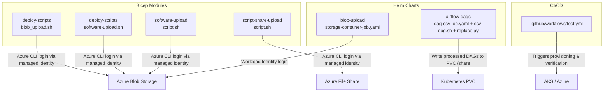
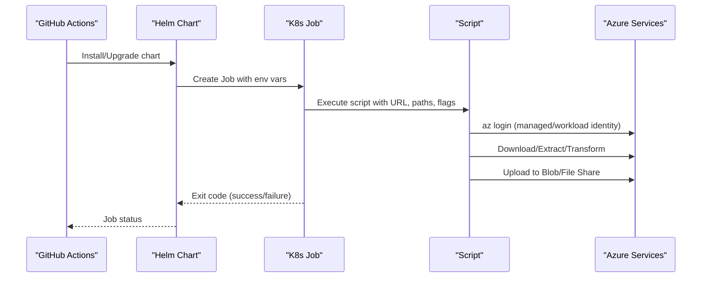
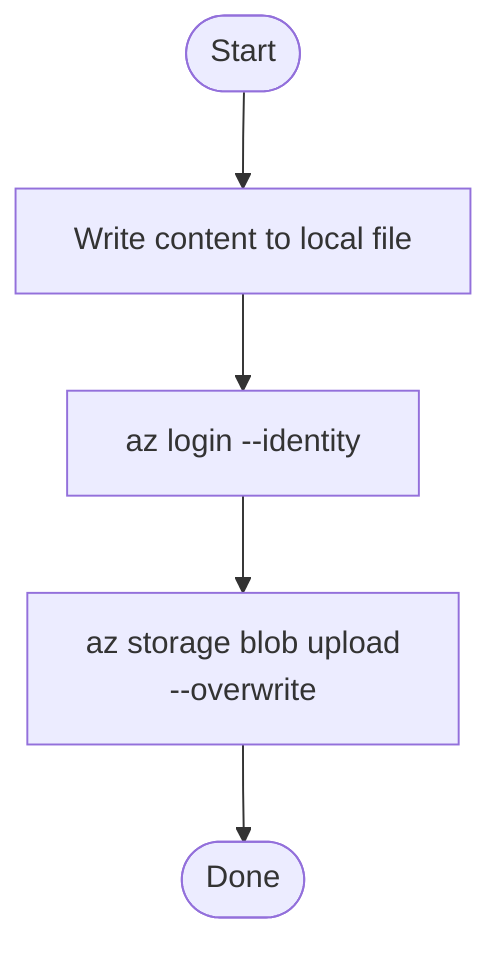
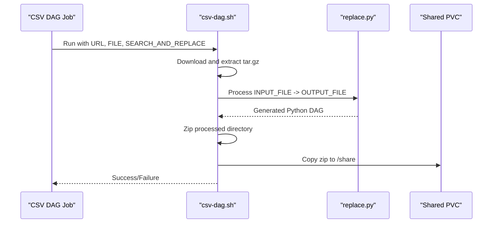
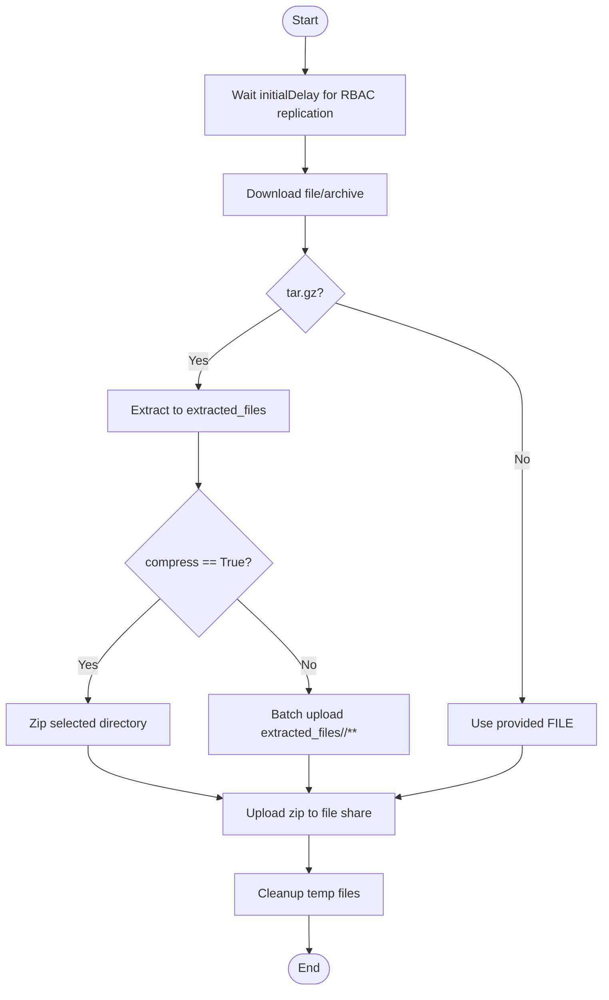
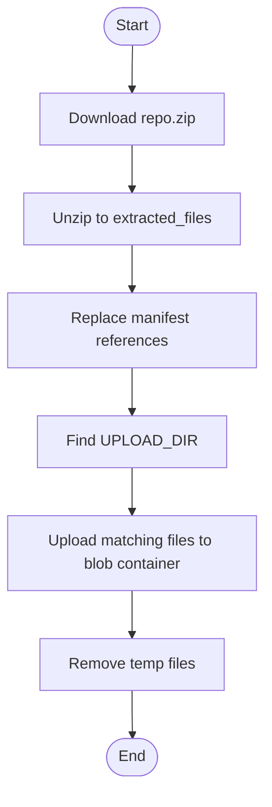
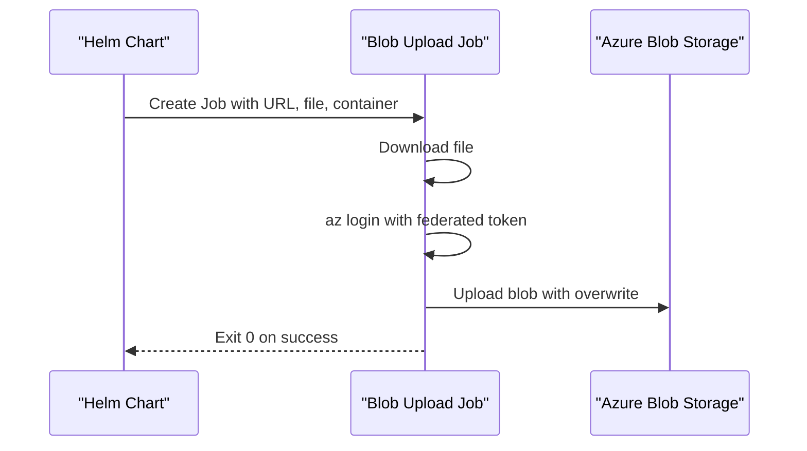
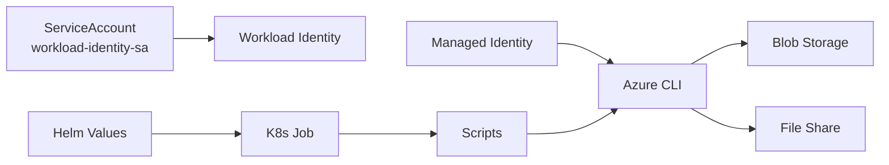

# Deployment Scripts Modules

<cite>
**Referenced Files in This Document**
- [blob_upload.sh](file://bicep/modules/deploy-scripts/blob_upload.sh)
- [software-upload.sh](file://bicep/modules/deploy-scripts/software-upload.sh)
- [Legal_COO.json](file://bicep/modules/deploy-scripts/Legal_COO.json)
- [csv-dag.sh](file://charts/airflow-dags/scripts/csv-dag.sh)
- [replace.py](file://charts/airflow-dags/scripts/replace.py)
- [storage-container-job.yaml](file://charts/blob-upload/templates/storage-container-job.yaml)
- [dag-csv-job.yaml](file://charts/airflow-dags/templates/dag-csv-job.yaml)
- [script.sh (script-share-upload)](file://bicep/modules/script-share-upload/script.sh)
- [script.sh (software-upload)](file://bicep/modules/software-upload/script.sh)
- [main.bicep (software-upload module)](file://bicep/modules/software-upload/main.bicep)
- [serviceaccount.yaml (base)](file://charts/osdu-developer-base/templates/serviceaccount.yaml)
- [serviceaccount.yaml (config-maps)](file://charts/config-maps/templates/service-account.yaml)
- [test.yml (GitHub Actions)](file://.github/workflows/test.yml)
</cite>

## Table of Contents
1. [Introduction](#introduction)
2. [Project Structure](#project-structure)
3. [Core Components](#core-components)
4. [Architecture Overview](#architecture-overview)
5. [Detailed Component Analysis](#detailed-component-analysis)
6. [Dependency Analysis](#dependency-analysis)
7. [Performance Considerations](#performance-considerations)
8. [Troubleshooting Guide](#troubleshooting-guide)
9. [Conclusion](#conclusion)
10. [Appendices](#appendices)

## Introduction
This document explains the deployment script modules that automate software distribution and data ingestion across Azure services. It covers:
- Legal compliance data upload and blob storage operations
- CSV DAG processing scripts for data transformation workflows
- File share upload utilities and software distribution mechanisms
- Automation workflows, error handling, progress monitoring
- Security considerations, retry logic, and CI/CD integration

The goal is to provide a clear, code-grounded understanding of how these scripts orchestrate downloads, transformations, uploads, and identity-based authentication within Kubernetes Jobs and Azure resources.

## Project Structure
The deployment automation spans Bicep modules, Helm charts, and GitHub Actions:
- Bicep modules define Azure CLI tasks executed as AKS Run Commands or containerized jobs
- Helm charts package Kubernetes Jobs that run scripts inside containers
- GitHub Actions coordinate validation, provisioning, verification, and cleanup

**Diagram sources**
- [blob_upload.sh:1-12](file://bicep/modules/deploy-scripts/blob_upload.sh#L1-L12)
- [software-upload.sh:1-46](file://bicep/modules/deploy-scripts/software-upload.sh#L1-L46)
- [script.sh (script-share-upload):1-59](file://bicep/modules/script-share-upload/script.sh#L1-L59)
- [script.sh (software-upload):1-49](file://bicep/modules/software-upload/script.sh#L1-L49)
- [storage-container-job.yaml:1-60](file://charts/blob-upload/templates/storage-container-job.yaml#L1-L60)
- [dag-csv-job.yaml:1-50](file://charts/airflow-dags/templates/dag-csv-job.yaml#L1-L50)
- [csv-dag.sh:1-39](file://charts/airflow-dags/scripts/csv-dag.sh#L1-L39)
- [replace.py:1-63](file://charts/airflow-dags/scripts/replace.py#L1-L63)
- [test.yml:205-471](file://.github/workflows/test.yml#L205-L471)

**Section sources**
- [blob_upload.sh:1-12](file://bicep/modules/deploy-scripts/blob_upload.sh#L1-L12)
- [software-upload.sh:1-46](file://bicep/modules/deploy-scripts/software-upload.sh#L1-L46)
- [script.sh (script-share-upload):1-59](file://bicep/modules/script-share-upload/script.sh#L1-L59)
- [script.sh (software-upload):1-49](file://bicep/modules/software-upload/script.sh#L1-L49)
- [storage-container-job.yaml:1-60](file://charts/blob-upload/templates/storage-container-job.yaml#L1-L60)
- [dag-csv-job.yaml:1-50](file://charts/airflow-dags/templates/dag-csv-job.yaml#L1-L50)
- [csv-dag.sh:1-39](file://charts/airflow-dags/scripts/csv-dag.sh#L1-L39)
- [replace.py:1-63](file://charts/airflow-dags/scripts/replace.py#L1-L63)
- [test.yml:205-471](file://.github/workflows/test.yml#L205-L471)

## Core Components
- Legal compliance data upload: JSON dataset used by legal workflows; uploaded via blob storage scripts
- Blob storage upload: Azure CLI-based upload using managed identity or workload identity
- Software distribution: Download, extract, transform manifests, and upload to blob storage
- CSV DAG processing: Download, extract, template-replace Python DAG files, zip, and place on shared volume
- File share upload: Download archives, optionally compress, and upload to Azure File Share

Key responsibilities:
- Authentication via managed identity or workload identity
- Robust download and extraction
- Template substitution for dynamic configuration
- Reliable upload with overwrite semantics
- Cleanup of temporary artifacts

**Section sources**
- [Legal_COO.json:1-800](file://bicep/modules/deploy-scripts/Legal_COO.json#L1-L800)
- [blob_upload.sh:1-12](file://bicep/modules/deploy-scripts/blob_upload.sh#L1-L12)
- [software-upload.sh:1-46](file://bicep/modules/deploy-scripts/software-upload.sh#L1-L46)
- [csv-dag.sh:1-39](file://charts/airflow-dags/scripts/csv-dag.sh#L1-L39)
- [replace.py:1-63](file://charts/airflow-dags/scripts/replace.py#L1-L63)
- [script.sh (script-share-upload):1-59](file://bicep/modules/script-share-upload/script.sh#L1-L59)
- [script.sh (software-upload):1-49](file://bicep/modules/software-upload/script.sh#L1-L49)

## Architecture Overview
The system uses Kubernetes Jobs orchestrated by Helm charts and Bicep modules to perform transient tasks:
- Managed Identity or Workload Identity authenticates to Azure services
- Azure CLI performs blob/file operations
- Helm values drive job parameters (URLs, paths, compression flags)
- GitHub Actions trigger provisioning and verification steps

**Diagram sources**
- [storage-container-job.yaml:1-60](file://charts/blob-upload/templates/storage-container-job.yaml#L1-L60)
- [dag-csv-job.yaml:1-50](file://charts/airflow-dags/templates/dag-csv-job.yaml#L1-L50)
- [blob_upload.sh:1-12](file://bicep/modules/deploy-scripts/blob_upload.sh#L1-L12)
- [script.sh (script-share-upload):1-59](file://bicep/modules/script-share-upload/script.sh#L1-L59)
- [test.yml:205-471](file://.github/workflows/test.yml#L205-L471)

## Detailed Component Analysis

### Legal Compliance Data Upload and Blob Storage
- Purpose: Provide legal reference data (e.g., country residency rules) and upload it into blob storage for downstream processes
- Data model: JSON array containing country entries with fields such as name, codes, residency risk, and exemptions
- Upload mechanism:
  - Containerized script writes content to a file and uploads to a specified blob container using Azure CLI with managed identity
  - Overwrite behavior ensures idempotent updates

**Diagram sources**
- [blob_upload.sh:1-12](file://bicep/modules/deploy-scripts/blob_upload.sh#L1-L12)

Security and reliability:
- Uses managed identity for zero-secret authentication
- Strict exit-on-error mode ensures failures are surfaced immediately

Operational notes:
- Ensure the target container exists and permissions are granted to the identity
- Validate environment variables for file name and container

**Section sources**
- [Legal_COO.json:1-800](file://bicep/modules/deploy-scripts/Legal_COO.json#L1-L800)
- [blob_upload.sh:1-12](file://bicep/modules/deploy-scripts/blob_upload.sh#L1-L12)

### CSV DAG Processing Scripts
- Purpose: Prepare Airflow DAGs from a packaged source by substituting placeholders and packaging for consumption
- Workflow:
  - Download tar.gz archive
  - Extract contents
  - Replace placeholders in Python DAG templates using a JSON mapping
  - Remove template file, zip the processed directory, and copy to a shared volume (PVC)
- Configuration:
  - Environment variables include URL, folder path, and SEARCH_AND_REPLACE JSON
  - The replacement engine supports simple strings, booleans, and complex objects while preserving template syntax where needed

**Diagram sources**
- [csv-dag.sh:1-39](file://charts/airflow-dags/scripts/csv-dag.sh#L1-L39)
- [replace.py:1-63](file://charts/airflow-dags/scripts/replace.py#L1-L63)
- [dag-csv-job.yaml:1-50](file://charts/airflow-dags/templates/dag-csv-job.yaml#L1-L50)

Error handling and robustness:
- set -e ensures immediate failure on errors
- Temporary directories cleaned up after processing
- Output written to a persistent volume for subsequent consumers

**Section sources**
- [csv-dag.sh:1-39](file://charts/airflow-dags/scripts/csv-dag.sh#L1-L39)
- [replace.py:1-63](file://charts/airflow-dags/scripts/replace.py#L1-L63)
- [dag-csv-job.yaml:1-50](file://charts/airflow-dags/templates/dag-csv-job.yaml#L1-L50)

### File Share Upload Utilities
- Purpose: Download archives or single files and upload to Azure File Share, with optional compression
- Capabilities:
  - Detect tar.gz archives and extract contents
  - Optionally zip specific subdirectories before upload
  - Use batch upload for efficiency when not compressing
  - Wait for identity RBAC replication before executing to avoid permission races

**Diagram sources**
- [script.sh (script-share-upload):1-59](file://bicep/modules/script-share-upload/script.sh#L1-L59)

Security and reliability:
- Uses managed identity for authentication
- Enables backup request intent for resilience during upload
- Exits on error to prevent partial states

**Section sources**
- [script.sh (script-share-upload):1-59](file://bicep/modules/script-share-upload/script.sh#L1-L59)

### Software Distribution Mechanisms
- Purpose: Distribute software packages to blob storage for consumption by downstream systems
- Workflow:
  - Download zip archive
  - Extract contents
  - Transform manifest references (e.g., GitRepository to Bucket)
  - Locate software directory and upload matching files to blob container
  - Clean up temporary files

**Diagram sources**
- [software-upload.sh:1-46](file://bicep/modules/deploy-scripts/software-upload.sh#L1-L46)
- [script.sh (software-upload):1-49](file://bicep/modules/software-upload/script.sh#L1-L49)

Environment and configuration:
- Parameters include URL, CONTAINER, UPLOAD_DIR, and optional delays
- Bicep module injects environment variables and loads script content

**Section sources**
- [software-upload.sh:1-46](file://bicep/modules/deploy-scripts/software-upload.sh#L1-L46)
- [script.sh (software-upload):1-49](file://bicep/modules/software-upload/script.sh#L1-L49)
- [main.bicep (software-upload module):77-90](file://bicep/modules/software-upload/main.bicep#L77-L90)

### Blob Upload via Helm Job
- Purpose: Provide a Helm-driven job to download and upload files to blob storage using workload identity
- Behavior:
  - Iterates over partition-specific storage accounts
  - Downloads file to a local path
  - Authenticates using federated token from workload identity
  - Uploads to the configured container with overwrite enabled

**Diagram sources**
- [storage-container-job.yaml:1-60](file://charts/blob-upload/templates/storage-container-job.yaml#L1-L60)

Security and reliability:
- Uses workload identity with federated tokens for secure, secretless auth
- Explicit exit codes propagate failures to Kubernetes

**Section sources**
- [storage-container-job.yaml:1-60](file://charts/blob-upload/templates/storage-container-job.yaml#L1-L60)

## Dependency Analysis
- Identity dependencies:
  - Managed identity for AKS Run Commands and Azure CLI tasks
  - Workload identity service accounts annotated for Kubernetes workloads
- External dependencies:
  - Azure Blob Storage and File Share
  - Network access to download URLs
- Helm/Bicep coupling:
  - Bicep modules configure environment variables and scripts
  - Helm charts render Jobs with values controlling behavior

**Diagram sources**
- [serviceaccount.yaml (base):1-9](file://charts/osdu-developer-base/templates/serviceaccount.yaml#L1-L9)
- [serviceaccount.yaml (config-maps):1-11](file://charts/config-maps/templates/service-account.yaml#L1-L11)
- [blob_upload.sh:1-12](file://bicep/modules/deploy-scripts/blob_upload.sh#L1-L12)
- [script.sh (script-share-upload):1-59](file://bicep/modules/script-share-upload/script.sh#L1-L59)
- [storage-container-job.yaml:1-60](file://charts/blob-upload/templates/storage-container-job.yaml#L1-L60)

**Section sources**
- [serviceaccount.yaml (base):1-9](file://charts/osdu-developer-base/templates/serviceaccount.yaml#L1-L9)
- [serviceaccount.yaml (config-maps):1-11](file://charts/config-maps/templates/service-account.yaml#L1-L11)
- [blob_upload.sh:1-12](file://bicep/modules/deploy-scripts/blob_upload.sh#L1-L12)
- [script.sh (script-share-upload):1-59](file://bicep/modules/script-share-upload/script.sh#L1-L59)
- [storage-container-job.yaml:1-60](file://charts/blob-upload/templates/storage-container-job.yaml#L1-L60)

## Performance Considerations
- Prefer batch uploads for large sets of files to reduce overhead
- Use compression selectively to balance network transfer size vs CPU usage
- Avoid unnecessary retries; implement bounded retries only where network instability is expected
- Clean up temporary files promptly to conserve disk space in ephemeral containers

[No sources needed since this section provides general guidance]

## Troubleshooting Guide
Common issues and resolutions:
- Authentication failures:
  - Verify managed identity or workload identity is properly bound and has required roles on target storage
  - For workload identity, ensure federated token is available and service account annotations are correct
- Permission errors:
  - Confirm RBAC replication delay is sufficient; some scripts include an initial delay to mitigate race conditions
- Download failures:
  - Some jobs implement retry loops with exponential backoff; verify network connectivity and URL accessibility
- Partial uploads:
  - Ensure overwrite flags are set appropriately; check logs for exit codes
- Quota constraints:
  - Resource quota exhaustion can block deployments; adjust region or request quota increases

Evidence in repository:
- Retry logic present in certain jobs for resilient downloads
- Initial delays added to allow identity RBAC replication
- Strict error handling via exit codes and set -e

**Section sources**
- [script.sh (script-share-upload):1-59](file://bicep/modules/script-share-upload/script.sh#L1-L59)
- [storage-container-job.yaml:1-60](file://charts/blob-upload/templates/storage-container-job.yaml#L1-L60)
- [test.yml:205-471](file://.github/workflows/test.yml#L205-L471)

## Conclusion
The deployment scripts modules provide a cohesive, secure, and automated approach to distributing software and ingesting data. They leverage managed identity and workload identity for authentication, use Azure CLI for reliable storage operations, and integrate with Helm and GitHub Actions for end-to-end automation. With careful attention to error handling, retries, and resource management, these components support robust CI/CD pipelines and scalable data workflows.

[No sources needed since this section summarizes without analyzing specific files]

## Appendices

### Example Automation Workflows
- Legal data upload:
  - Prepare JSON dataset
  - Execute blob upload script with managed identity
  - Verify upload via storage explorer or CLI
- CSV DAG preparation:
  - Configure Helm values (URL, folder, replacements)
  - Run Helm job to process and stage DAGs on PVC
  - Trigger Airflow to pick up new DAGs
- Software distribution:
  - Package software with manifest references
  - Run software upload script to transform and distribute
  - Validate availability in blob storage

[No sources needed since this section provides conceptual examples]

### Security Considerations
- Use managed identity or workload identity instead of secrets
- Restrict permissions to least privilege
- Validate URLs and inputs to prevent injection
- Enable audit logging on storage accounts

[No sources needed since this section provides general guidance]

### Integration with CI/CD Pipelines
- GitHub Actions orchestrate validation, provisioning, verification, and cleanup
- Jobs and scripts are triggered by Helm installs and Bicep deployments
- Timeouts and cleanup steps ensure consistent state

**Section sources**
- [test.yml:205-471](file://.github/workflows/test.yml#L205-L471)