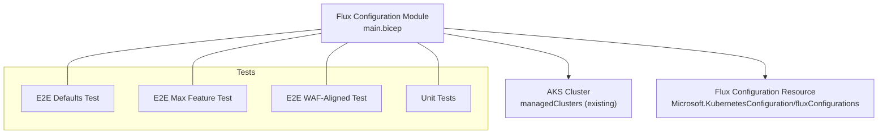
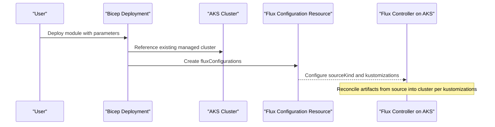
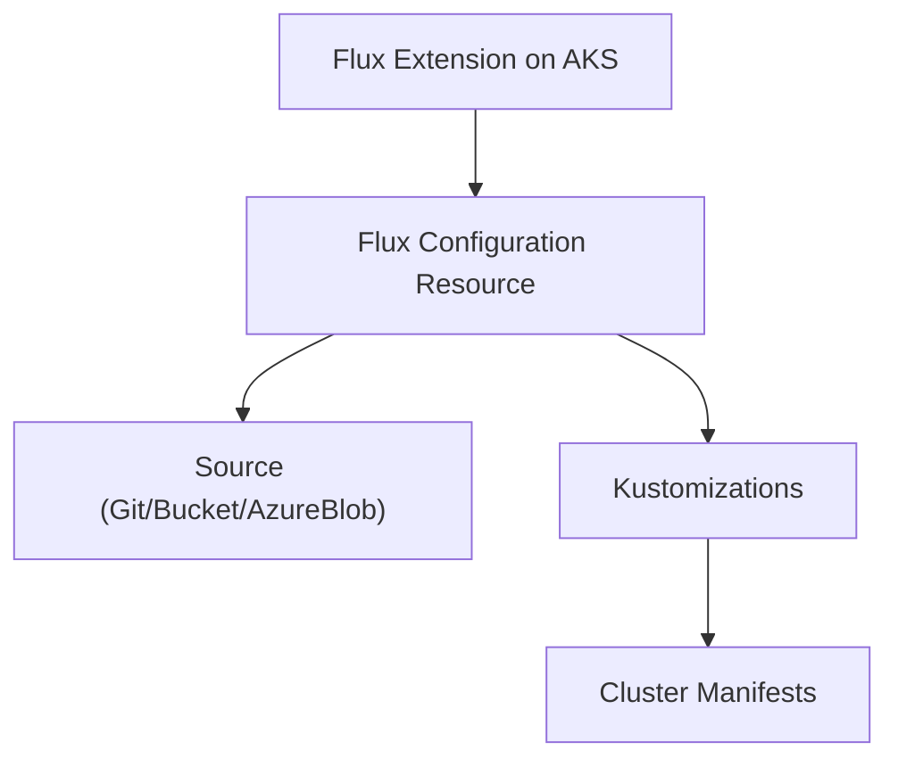

# Flux Configuration Module

<cite>
**Referenced Files in This Document**
- [main.bicep](file://bicep/modules/flux-configuration/main.bicep)
- [README.md](file://bicep/modules/flux-configuration/README.md)
- [version.json](file://bicep/modules/flux-configuration/version.json)
- [defaults main.test.bicep](file://bicep/modules/flux-configuration/tests/e2e/defaults/main.test.bicep)
- [max main.test.bicep](file://bicep/modules/flux-configuration/tests/e2e/max/main.test.bicep)
- [waf-aligned main.test.bicep](file://bicep/modules/flux-configuration/tests/e2e/waf-aligned/main.test.bicep)
- [custom.tests.ps1](file://bicep/modules/flux-configuration/tests/unit/custom.tests.ps1)
- [dependencies.bicep](file://bicep/modules/flux-configuration/tests/e2e/defaults/dependencies.bicep)
- [flux-extension main.bicep](file://bicep/modules/flux-extension/main.bicep)
</cite>

## Table of Contents
1. [Introduction](#introduction)
2. [Project Structure](#project-structure)
3. [Core Components](#core-components)
4. [Architecture Overview](#architecture-overview)
5. [Detailed Component Analysis](#detailed-component-analysis)
6. [Dependency Analysis](#dependency-analysis)
7. [Performance Considerations](#performance-considerations)
8. [Troubleshooting Guide](#troubleshooting-guide)
9. [Conclusion](#conclusion)
10. [Appendices](#appendices)

## Introduction
This document provides comprehensive documentation for the Flux Configuration Bicep module that deploys Kubernetes Flux Configurations to Azure Kubernetes Service (AKS) clusters. It explains configuration parameters, supported source types (GitRepository, Bucket, AzureBlob), kustomization settings, namespace and scope options, security configurations using protected settings, reconciliation policies, outputs, integration patterns with other Azure resources, testing strategies, and troubleshooting guidance.

The module creates a Microsoft.KubernetesConfiguration/fluxConfigurations resource scoped to an existing AKS cluster and configures how Flux reconciles artifacts from a specified source into one or more Kustomizations on the cluster.

## Project Structure
The module is located under bicep/modules/flux-configuration and includes:
- main.bicep: The core module definition with parameters, resource creation, and outputs.
- README.md: Usage examples, parameter reference, notes, and data collection information.
- version.json: Module version metadata.
- tests/: End-to-end and unit test scenarios demonstrating usage patterns and validation.

**Diagram sources**
- [main.bicep:73-91](file://bicep/modules/flux-configuration/main.bicep#L73-L91)
- [defaults main.test.bicep:49-80](file://bicep/modules/flux-configuration/tests/e2e/defaults/main.test.bicep#L49-L80)
- [max main.test.bicep:49-91](file://bicep/modules/flux-configuration/tests/e2e/max/main.test.bicep#L49-L91)
- [waf-aligned main.test.bicep:49-85](file://bicep/modules/flux-configuration/tests/e2e/waf-aligned/main.test.bicep#L49-L85)
- [custom.tests.ps1:1-8](file://bicep/modules/flux-configuration/tests/unit/custom.tests.ps1#L1-L8)

**Section sources**
- [main.bicep:1-101](file://bicep/modules/flux-configuration/main.bicep#L1-L101)
- [README.md:1-629](file://bicep/modules/flux-configuration/README.md#L1-L629)
- [version.json:1-7](file://bicep/modules/flux-configuration/version.json#L1-L7)

## Core Components
- Parameters:
  - name: Name of the Flux Configuration.
  - clusterName: Existing AKS cluster name to target.
  - namespace: Namespace where Flux will install the configuration.
  - scope: Scope of installation; allowed values are cluster or namespace.
  - sourceKind: Source kind to pull configuration data from; allowed values include Bucket, GitRepository, and AzureBlob.
  - gitRepository: Required when sourceKind is GitRepository.
  - bucket: Required when sourceKind is Bucket.
  - azureBlob: Required when sourceKind is AzureBlob.
  - kustomizations: One or more Kustomization definitions describing how to reconcile artifacts on the cluster.
  - configurationProtectedSettings: Secure key-value pairs for sensitive configuration.
  - suspend: Boolean to pause reconciliation.
  - enableTelemetry: Optional telemetry toggle.
  - location: Resource location defaulting to resource group location.

- Resource:
  - Creates a Microsoft.KubernetesConfiguration/fluxConfigurations resource scoped to the specified AKS cluster.

- Outputs:
  - name: Flux Configuration name.
  - resourceId: Resource ID of the created Flux Configuration.
  - resourceGroupName: Resource group name where it was deployed.

**Section sources**
- [main.bicep:5-52](file://bicep/modules/flux-configuration/main.bicep#L5-L52)
- [main.bicep:77-101](file://bicep/modules/flux-configuration/main.bicep#L77-L101)
- [README.md:470-599](file://bicep/modules/flux-configuration/README.md#L470-L599)

## Architecture Overview
The module targets an existing AKS cluster and provisions a Flux Configuration resource. Depending on the chosen sourceKind, it references either GitRepository, Bucket, or AzureBlob source parameters. Kustomizations define what manifests to apply and how to reconcile them. Protected settings allow secure injection of secrets.

**Diagram sources**
- [main.bicep:73-91](file://bicep/modules/flux-configuration/main.bicep#L73-L91)
- [README.md:470-599](file://bicep/modules/flux-configuration/README.md#L470-L599)

## Detailed Component Analysis

### Parameter Reference and Validation Rules
- Required parameters:
  - clusterName: Must reference an existing AKS cluster.
  - kustomizations: Object defining one or more Kustomization entries.
  - name: Unique name for the Flux Configuration.
  - namespace: Target namespace for installation.
  - scope: Allowed values are cluster or namespace.
  - sourceKind: Allowed values include Bucket, GitRepository, and AzureBlob.

- Conditional parameters:
  - gitRepository: Required if sourceKind is GitRepository.
  - bucket: Required if sourceKind is Bucket.
  - azureBlob: Required if sourceKind is AzureBlob.

- Optional parameters:
  - configurationProtectedSettings: Secure object for sensitive values.
  - suspend: Pause reconciliation when set to true.
  - enableTelemetry: Toggle telemetry.
  - location: Defaults to resource group location.

Validation rules enforced by the module:
- scope must be one of the allowed values.
- sourceKind must be one of the allowed values.
- Conditional parameters must match the selected sourceKind.

**Section sources**
- [main.bicep:17-52](file://bicep/modules/flux-configuration/main.bicep#L17-L52)
- [README.md:470-599](file://bicep/modules/flux-configuration/README.md#L470-L599)

### Source Types and Configuration
- GitRepository:
  - Use when your configuration is stored in a Git repository.
  - Provide gitRepository parameters including repository URL, branch/tag reference, sync intervals, timeouts, and SSH known hosts if needed.
  - Example usage patterns are demonstrated in tests and README examples.

- Bucket:
  - Use when your configuration is stored in a storage bucket.
  - Provide bucket parameters appropriate for your bucket provider.
  - The module supports Bucket as a sourceKind and requires the bucket object when selected.

- AzureBlob:
  - Use when your configuration is stored in Azure Blob Storage.
  - Provide azureBlob parameters appropriate for blob access and authentication.
  - The module supports AzureBlob as a sourceKind and requires the azureBlob object when selected.

Note: While the module’s README lists allowed source kinds as Bucket and GitRepository, the module code also allows AzureBlob. Ensure you provide the corresponding conditional parameters based on your chosen sourceKind.

**Section sources**
- [main.bicep:17-28](file://bicep/modules/flux-configuration/main.bicep#L17-L28)
- [main.bicep:43-49](file://bicep/modules/flux-configuration/main.bicep#L43-L49)
- [README.md:541-567](file://bicep/modules/flux-configuration/README.md#L541-L567)

### Kustomization Settings
Kustomizations define how Flux applies manifests from the configured source:
- path: Directory within the source containing Kustomize overlays.
- prune: Whether to remove resources not present in the source.
- syncIntervalInSeconds: How often Flux checks for updates.
- timeoutInSeconds: Timeout for applying changes.
- postBuild.substitute: Variable substitution during build.
- dependsOn: Dependencies between Kustomizations.
- force: Force application even if unchanged.

These fields are demonstrated in test scenarios and README examples.

**Section sources**
- [README.md:167-212](file://bicep/modules/flux-configuration/README.md#L167-L212)
- [max main.test.bicep:70-85](file://bicep/modules/flux-configuration/tests/e2e/max/main.test.bicep#L70-L85)

### Namespace and Scope Options
- namespace: Specifies the namespace where Flux installs the configuration.
- scope: Determines whether the configuration applies at cluster level or within a specific namespace.
  - cluster: Applies cluster-wide.
  - namespace: Applies within the specified namespace.

**Section sources**
- [main.bicep:33-41](file://bicep/modules/flux-configuration/main.bicep#L33-L41)
- [README.md:520-539](file://bicep/modules/flux-configuration/README.md#L520-L539)

### Security Configurations
- configurationProtectedSettings: Secure key-value pairs for sensitive configuration such as tokens or credentials.
- When using GitRepository with private repositories, configure SSH known hosts and authentication via protected settings or repository credentials.
- For Bucket or AzureBlob, ensure proper access controls and credentials are provided through the respective source parameters or protected settings.

**Section sources**
- [main.bicep:23-25](file://bicep/modules/flux-configuration/main.bicep#L23-L25)
- [README.md:569-575](file://bicep/modules/flux-configuration/README.md#L569-L575)

### Reconciliation Policies
- suspend: Pauses reconciliation when set to true. Useful for maintenance windows or debugging.
- syncIntervalInSeconds and timeoutInSeconds within kustomizations control update frequency and operation timeouts.
- prune ensures resources not present in the source are removed from the cluster.

**Section sources**
- [main.bicep:51-52](file://bicep/modules/flux-configuration/main.bicep#L51-L52)
- [README.md:167-212](file://bicep/modules/flux-configuration/README.md#L167-L212)

### Practical Deployment Scenarios
- Minimal deployment:
  - Use GitRepository as sourceKind with a public repository and basic kustomization path.
  - Demonstrated in defaults test and README example.

- Advanced deployment:
  - Enable additional kustomization features like prune, postBuild substitutions, and timeouts.
  - Demonstrated in max feature test and README example.

- WAF-aligned deployment:
  - Follow best practices with prune enabled and reasonable timeouts.
  - Demonstrated in waf-aligned test and README example.

**Section sources**
- [defaults main.test.bicep:49-80](file://bicep/modules/flux-configuration/tests/e2e/defaults/main.test.bicep#L49-L80)
- [max main.test.bicep:49-91](file://bicep/modules/flux-configuration/tests/e2e/max/main.test.bicep#L49-L91)
- [waf-aligned main.test.bicep:49-85](file://bicep/modules/flux-configuration/tests/e2e/waf-aligned/main.test.bicep#L49-L85)
- [README.md:32-160](file://bicep/modules/flux-configuration/README.md#L32-L160)
- [README.md:162-323](file://bicep/modules/flux-configuration/README.md#L162-L323)
- [README.md:325-468](file://bicep/modules/flux-configuration/README.md#L325-L468)

### Module Outputs and Integration Patterns
Outputs:
- name: Flux Configuration name.
- resourceId: Resource ID for referencing the configuration elsewhere.
- resourceGroupName: Resource group name for auditing and management.

Integration patterns:
- Reference the Flux Configuration resource ID in other modules or scripts to manage lifecycle.
- Combine with AKS extensions (Flux extension) to ensure prerequisites are met before deploying configurations.

**Section sources**
- [main.bicep:93-101](file://bicep/modules/flux-configuration/main.bicep#L93-L101)
- [flux-extension main.bicep:90-109](file://bicep/modules/flux-extension/main.bicep#L90-L109)

## Dependency Analysis
The module depends on:
- An existing AKS cluster referenced by clusterName.
- The AKS cluster must have the Flux extension installed and configured.
- Appropriate permissions to create Microsoft.KubernetesConfiguration/fluxConfigurations resources.

**Diagram sources**
- [dependencies.bicep:34-46](file://bicep/modules/flux-configuration/tests/e2e/defaults/dependencies.bicep#L34-L46)
- [main.bicep:73-91](file://bicep/modules/flux-configuration/main.bicep#L73-L91)

**Section sources**
- [dependencies.bicep:13-46](file://bicep/modules/flux-configuration/tests/e2e/defaults/dependencies.bicep#L13-L46)
- [main.bicep:73-91](file://bicep/modules/flux-configuration/main.bicep#L73-L91)

## Performance Considerations
- Set appropriate syncIntervalInSeconds to balance freshness and load.
- Use prune judiciously to avoid unintended deletions.
- Configure timeoutInSeconds based on expected manifest sizes and network conditions.
- Suspend reconciliation during large batch updates to reduce churn.

[No sources needed since this section provides general guidance]

## Troubleshooting Guide
Common issues and resolutions:
- Prerequisites not registered:
  - Ensure the AKS-ExtensionManager feature is registered and required service providers are enabled.
  - Refer to module notes for registration commands.

- Missing or incorrect sourceKind parameters:
  - Verify that the conditional parameters (gitRepository, bucket, azureBlob) match the selected sourceKind.
  - Check allowed values and required fields.

- Authentication failures:
  - For GitRepository, validate SSH known hosts and credentials.
  - For Bucket or AzureBlob, verify access permissions and connection details.

- Reconciliation not occurring:
  - Check if suspend is set to true.
  - Review kustomization paths and source URLs.
  - Inspect Flux logs on the cluster for errors.

- Extension not installed:
  - Ensure the Flux extension is installed on the AKS cluster before deploying configurations.

**Section sources**
- [README.md:608-624](file://bicep/modules/flux-configuration/README.md#L608-L624)
- [main.bicep:17-52](file://bicep/modules/flux-configuration/main.bicep#L17-L52)
- [dependencies.bicep:34-46](file://bicep/modules/flux-configuration/tests/e2e/defaults/dependencies.bicep#L34-L46)

## Conclusion
The Flux Configuration Bicep module provides a robust way to deploy and manage Flux configurations on AKS clusters. By selecting the appropriate sourceKind, configuring kustomizations, and securing sensitive data with protected settings, teams can automate consistent deployments across environments. The included tests demonstrate common usage patterns and best practices, while the module’s outputs facilitate integration with other Azure resources. Proper prerequisite registration and careful parameter configuration are essential for successful deployments.

[No sources needed since this section summarizes without analyzing specific files]

## Appendices

### Testing Strategies
- End-to-end tests:
  - Defaults: Minimal configuration with GitRepository source.
  - Max: Comprehensive kustomization features including prune, timeouts, and variable substitution.
  - WAF-aligned: Best-practice configuration aligned with Azure Well-Architected Framework.

- Unit tests:
  - Custom PowerShell tests available for static validation and additional checks.

- Test infrastructure:
  - Dependencies module creates an AKS cluster and installs the Flux extension to support testing.

**Section sources**
- [defaults main.test.bicep:49-80](file://bicep/modules/flux-configuration/tests/e2e/defaults/main.test.bicep#L49-L80)
- [max main.test.bicep:49-91](file://bicep/modules/flux-configuration/tests/e2e/max/main.test.bicep#L49-L91)
- [waf-aligned main.test.bicep:49-85](file://bicep/modules/flux-configuration/tests/e2e/waf-aligned/main.test.bicep#L49-L85)
- [custom.tests.ps1:1-8](file://bicep/modules/flux-configuration/tests/unit/custom.tests.ps1#L1-L8)
- [dependencies.bicep:13-46](file://bicep/modules/flux-configuration/tests/e2e/defaults/dependencies.bicep#L13-L46)

### Module Versioning
- Current module version is defined in version.json.
- Path filters indicate compiled output artifacts used for publishing.

**Section sources**
- [version.json:1-7](file://bicep/modules/flux-configuration/version.json#L1-L7)