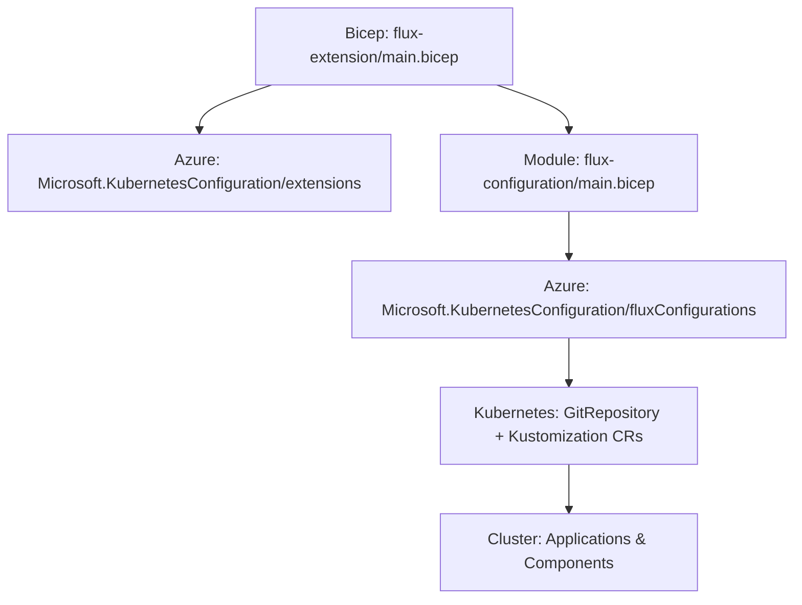
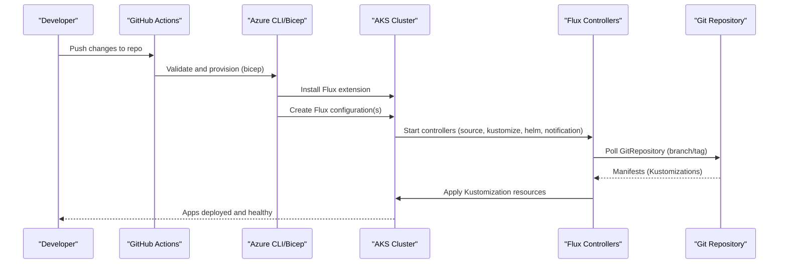
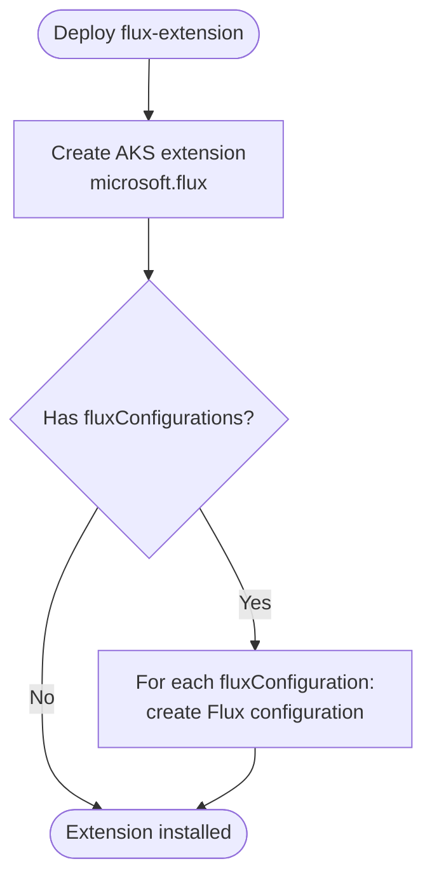
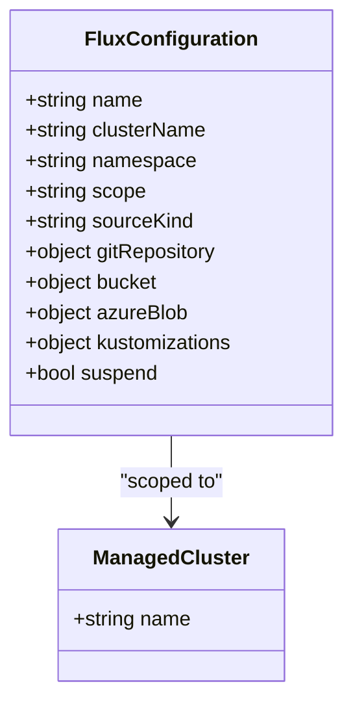
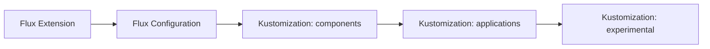
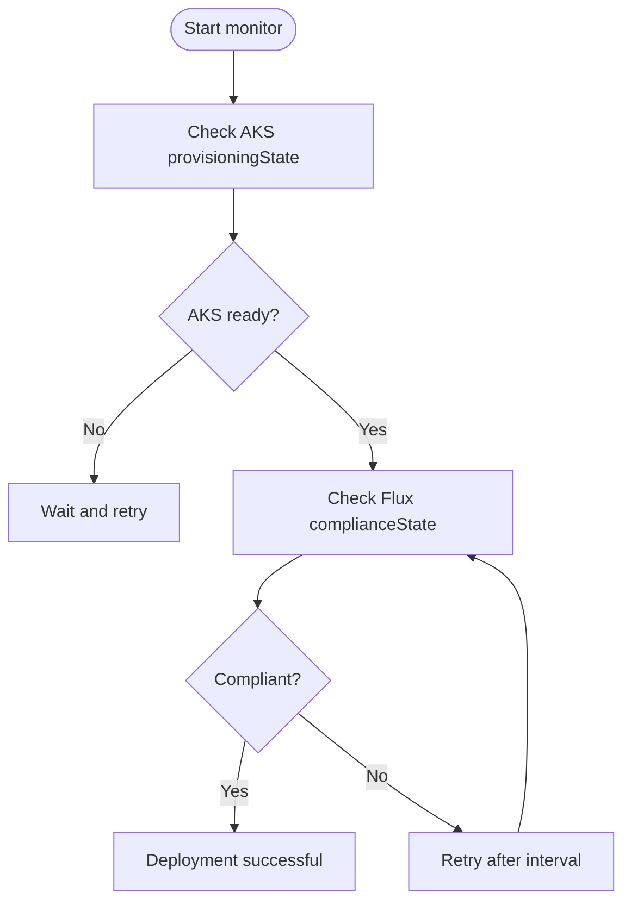

# Flux Configuration Modules

<cite>
**Referenced Files in This Document**
- [main.bicep](file://bicep/modules/flux-configuration/main.bicep)
- [README.md](file://bicep/modules/flux-configuration/README.md)
- [main.bicep](file://bicep/modules/flux-extension/main.bicep)
- [README.md](file://bicep/modules/flux-extension/README.md)
- [main.test.bicep](file://bicep/modules/flux-configuration/tests/e2e/defaults/main.test.bicep)
- [main.test.bicep](file://bicep/modules/flux-extension/tests/e2e/defaults/main.test.bicep)
- [test.yml](file://.github/workflows/test.yml)
- [release.yml](file://.github/workflows/release.yml)
- [kustomize.yaml](file://stamp/components/kustomize.yaml)
- [kustomization.yaml](file://software/applications/kustomization.yaml)
- [blade_configuration.bicep](file://bicep/blade_configuration.bicep)
- [monitor-flux.sh](file://monitor-flux.sh)
- [monitor-eastus-deployment.sh](file://monitor-eastus-deployment.sh)
</cite>

## Table of Contents
1. [Introduction](#introduction)
2. [Project Structure](#project-structure)
3. [Core Components](#core-components)
4. [Architecture Overview](#architecture-overview)
5. [Detailed Component Analysis](#detailed-component-analysis)
6. [Dependency Analysis](#dependency-analysis)
7. [Performance Considerations](#performance-considerations)
8. [Troubleshooting Guide](#troubleshooting-guide)
9. [Conclusion](#conclusion)
10. [Appendices](#appendices)

## Introduction
This document explains the Flux GitOps modules that enable declarative application deployment and management on Azure Kubernetes Service (AKS). It covers:
- How to configure Flux via Bicep modules for source repositories, target clusters, and sync policies
- How to install Flux extensions to enable capabilities such as Helm releases and Kustomize overlays
- Testing strategies using unit and end-to-end test suites
- CI/CD pipeline integration with GitHub Actions
- Rollback procedures and monitoring of Flux operations
- Security considerations, access control, and troubleshooting workflows

## Project Structure
The repository provides two primary Bicep modules for Flux:
- flux-configuration: Deploys a Flux configuration resource bound to an AKS cluster, defining sources and kustomizations
- flux-extension: Installs the Flux extension on AKS and can create one or more Flux configurations

Additionally, the project includes:
- E2E tests for both modules under tests/e2e
- GitHub Actions workflows for validation, provisioning, verification, and release
- Kustomization manifests that define component/application ordering and health checks
- Monitoring scripts to poll Flux compliance state

**Diagram sources**
- [main.bicep:61-88](file://bicep/modules/flux-extension/main.bicep#L61-L88)
- [main.bicep:73-91](file://bicep/modules/flux-configuration/main.bicep#L73-L91)
- [kustomize.yaml:21-91](file://stamp/components/kustomize.yaml#L21-L91)

**Section sources**
- [main.bicep:1-122](file://bicep/modules/flux-extension/main.bicep#L1-L122)
- [main.bicep:1-101](file://bicep/modules/flux-configuration/main.bicep#L1-L101)

## Core Components
- Flux Extension Module:
  - Creates the AKS extension for Flux with configurable controllers (Helm, Kustomize, Source, Notification)
  - Optionally creates multiple Flux configurations depending on input parameters
  - Outputs identity information for downstream permissions
- Flux Configuration Module:
  - Declares a Flux configuration scoped to cluster or namespace
  - Defines source kind (GitRepository, Bucket, AzureBlob) and associated settings
  - Configures one or more Kustomizations with paths, pruning, timeouts, and dependencies

Key configuration aspects:
- Target cluster is referenced by name; module resolves the existing managed cluster
- Namespace and scope determine where the Flux configuration applies
- Suspend flag allows pausing reconciliation during maintenance
- Protected settings support sensitive configuration values

**Section sources**
- [main.bicep:61-88](file://bicep/modules/flux-extension/main.bicep#L61-L88)
- [main.bicep:73-91](file://bicep/modules/flux-configuration/main.bicep#L73-L91)
- [README.md:470-598](file://bicep/modules/flux-configuration/README.md#L470-L598)
- [README.md:472-580](file://bicep/modules/flux-extension/README.md#L472-L580)

## Architecture Overview
The deployment flow installs Flux on AKS and then configures it to reconcile Git-based sources into the cluster. Kustomizations define ordered layers (components, applications, experimental) with health checks to ensure readiness.

**Diagram sources**
- [main.bicep:61-88](file://bicep/modules/flux-extension/main.bicep#L61-L88)
- [main.bicep:73-91](file://bicep/modules/flux-configuration/main.bicep#L73-L91)
- [kustomize.yaml:21-91](file://stamp/components/kustomize.yaml#L21-L91)
- [test.yml:317-438](file://.github/workflows/test.yml#L317-L438)

## Detailed Component Analysis

### Flux Extension Module
- Purpose: Install the Flux extension on AKS and optionally create Flux configurations
- Key behaviors:
  - Enables specific controllers via configurationSettings (e.g., Helm, Kustomize, Source, Notification)
  - Supports releaseNamespace/targetNamespace scoping
  - Can auto-upgrade minor versions unless pinned to a version
  - Creates dependent Flux configurations via a module loop

**Diagram sources**
- [main.bicep:61-88](file://bicep/modules/flux-extension/main.bicep#L61-L88)
- [main.bicep:90-110](file://bicep/modules/flux-extension/main.bicep#L90-L110)

**Section sources**
- [main.bicep:1-122](file://bicep/modules/flux-extension/main.bicep#L1-L122)
- [README.md:472-580](file://bicep/modules/flux-extension/README.md#L472-L580)

### Flux Configuration Module
- Purpose: Define a Flux configuration bound to a cluster or namespace
- Key behaviors:
  - Selects sourceKind (GitRepository, Bucket, AzureBlob) and passes corresponding settings
  - Declares one or more Kustomizations with path, prune, timeouts, and optional postBuild substitutions
  - Supports suspend to pause reconciliation

**Diagram sources**
- [main.bicep:73-91](file://bicep/modules/flux-configuration/main.bicep#L73-L91)

**Section sources**
- [main.bicep:1-101](file://bicep/modules/flux-configuration/main.bicep#L1-L101)
- [README.md:470-598](file://bicep/modules/flux-configuration/README.md#L470-L598)

### Kustomization Ordering and Health Checks
- The stamp defines Kustomization resources that order components and applications, set intervals/timeouts, and declare health checks for critical deployments/services
- This ensures predictable rollout and reliable readiness detection

**Diagram sources**
- [kustomize.yaml:21-91](file://stamp/components/kustomize.yaml#L21-L91)
- [kustomize.yaml:243-306](file://stamp/components/kustomize.yaml#L243-L306)

**Section sources**
- [kustomize.yaml:21-91](file://stamp/components/kustomize.yaml#L21-L91)
- [kustomize.yaml:243-306](file://stamp/components/kustomize.yaml#L243-L306)

### Application Layer Kustomization
- Aggregates application manifests (config maps, core services, auth, reference data, web site)
- Provides a single entry point for deploying the application layer

**Section sources**
- [kustomization.yaml:1-10](file://software/applications/kustomization.yaml#L1-L10)

### Integration with Top-Level Deployment
- The top-level blade configuration conditionally deploys Flux based on feature flags
- It configures GitRepository sources and multiple Kustomizations (components, applications, experimental) with explicit dependencies and pruning

**Section sources**
- [blade_configuration.bicep:494-564](file://bicep/blade_configuration.bicep#L494-L564)

## Dependency Analysis
- The extension must be installed before creating Flux configurations
- Kustomizations depend on each other to enforce installation order
- CI/CD validates infrastructure and waits for Flux compliance before completing

**Diagram sources**
- [main.bicep:90-110](file://bicep/modules/flux-extension/main.bicep#L90-L110)
- [blade_configuration.bicep:512-558](file://bicep/blade_configuration.bicep#L512-L558)
- [kustomize.yaml:243-306](file://stamp/components/kustomize.yaml#L243-L306)

**Section sources**
- [main.bicep:90-110](file://bicep/modules/flux-extension/main.bicep#L90-L110)
- [blade_configuration.bicep:512-558](file://bicep/blade_configuration.bicep#L512-L558)

## Performance Considerations
- Set appropriate sync intervals and timeouts per Kustomization to balance responsiveness and load
- Use pruning to avoid drift and reduce reconciliation overhead
- Limit enabled controllers to only those required (e.g., disable image automation if not used)
- Group related resources into logical Kustomizations to minimize churn

[No sources needed since this section provides general guidance]

## Troubleshooting Guide
- Monitor Flux compliance state via Azure CLI to detect non-compliant states early
- Use provided scripts to poll status and surface next steps (e.g., obtaining auth endpoints)
- In CI/CD, the verify job waits for compliance with a timeout to prevent indefinite hangs
- For local debugging, check AKS provisioning state and Flux configuration availability

**Diagram sources**
- [monitor-flux.sh:1-52](file://monitor-flux.sh#L1-L52)
- [monitor-eastus-deployment.sh:1-42](file://monitor-eastus-deployment.sh#L1-L42)
- [test.yml:386-438](file://.github/workflows/test.yml#L386-L438)

**Section sources**
- [monitor-flux.sh:1-52](file://monitor-flux.sh#L1-L52)
- [monitor-eastus-deployment.sh:1-42](file://monitor-eastus-deployment.sh#L1-L42)
- [test.yml:386-438](file://.github/workflows/test.yml#L386-L438)

## Conclusion
The repository’s Flux GitOps modules provide a robust, declarative approach to deploying and managing applications on AKS. By combining the Flux extension with carefully configured Flux configurations and ordered Kustomizations, teams can achieve consistent, auditable, and reversible deployments. Integrated CI/CD and monitoring scripts streamline validation, verification, and operational visibility.

[No sources needed since this section summarizes without analyzing specific files]

## Appendices

### Flux Configuration Setup
- Source Repositories:
  - Configure GitRepository with URL, branch/tag, sync intervals, and timeouts
  - Alternatively use Bucket or AzureBlob sources when applicable
- Target Clusters:
  - Reference the AKS cluster name; modules resolve the existing managed cluster
- Sync Policies:
  - Per Kustomization: path, prune, syncIntervalInSeconds, timeoutInSeconds, dependsOn
  - Global controls: suspend flag to pause reconciliation

**Section sources**
- [README.md:470-598](file://bicep/modules/flux-configuration/README.md#L470-L598)
- [blade_configuration.bicep:503-558](file://bicep/blade_configuration.bicep#L503-L558)

### Flux Extensions Installation
- Enable controllers:
  - Helm controller for Helm releases
  - Kustomize controller for overlays
  - Source controller for Git polling
  - Notification controller for alerts
- Pin versions or allow auto-upgrades via releaseTrain

**Section sources**
- [main.bicep:61-88](file://bicep/modules/flux-extension/main.bicep#L61-L88)
- [README.md:472-580](file://bicep/modules/flux-extension/README.md#L472-L580)

### Testing Strategies
- Unit Tests:
  - Parameter validation and idempotency checks within module definitions
- End-to-End Tests:
  - Deploy minimal and full parameter sets against real AKS clusters
  - Verify creation of Flux extension and configurations
- CI/CD Verification:
  - Validate and What-If analysis before provisioning
  - Wait for Flux compliance with timeouts

**Section sources**
- [main.test.bicep:1-81](file://bicep/modules/flux-configuration/tests/e2e/defaults/main.test.bicep#L1-L81)
- [main.test.bicep:1-65](file://bicep/modules/flux-extension/tests/e2e/defaults/main.test.bicep#L1-L65)
- [test.yml:104-316](file://.github/workflows/test.yml#L104-L316)
- [test.yml:317-438](file://.github/workflows/test.yml#L317-L438)

### CI/CD Pipeline Integration
- Validation:
  - PSRule checks and ARM parameter validation
  - What-If to preview changes
- Provisioning:
  - azd provision to deploy infrastructure
- Verification:
  - Poll Flux compliance until success or timeout
- Release:
  - Version bumping, Bicep build, changelog generation, and artifact publishing

**Section sources**
- [test.yml:78-316](file://.github/workflows/test.yml#L78-L316)
- [test.yml:317-438](file://.github/workflows/test.yml#L317-L438)
- [release.yml:1-82](file://.github/workflows/release.yml#L1-L82)

### Rollback Procedures
- Revert Git changes to a known good commit or tag
- Ensure Flux reconciles back to the previous desired state
- Use Kustomization pruning to remove unintended resources
- If necessary, suspend Flux temporarily to perform manual remediation

[No sources needed since this section provides general guidance]

### Monitoring Flux Operations
- Use Azure CLI to check Flux compliance state
- Leverage provided scripts to automate status checks and surface next steps
- Integrate compliance checks into CI/CD to gate deployments

**Section sources**
- [monitor-flux.sh:1-52](file://monitor-flux.sh#L1-L52)
- [monitor-eastus-deployment.sh:1-42](file://monitor-eastus-deployment.sh#L1-L42)
- [test.yml:386-438](file://.github/workflows/test.yml#L386-L438)

### Security Considerations and Access Control
- Protect sensitive configuration via protected settings
- Restrict Git repository access using authentication mechanisms (e.g., SSH known hosts, tokens)
- Scope Flux configurations appropriately (cluster vs namespace)
- Follow least privilege for identities created by extensions

**Section sources**
- [main.bicep:23-25](file://bicep/modules/flux-configuration/main.bicep#L23-L25)
- [main.bicep:17-19](file://bicep/modules/flux-extension/main.bicep#L17-L19)
- [README.md:569-598](file://bicep/modules/flux-configuration/README.md#L569-L598)
- [README.md:517-580](file://bicep/modules/flux-extension/README.md#L517-L580)