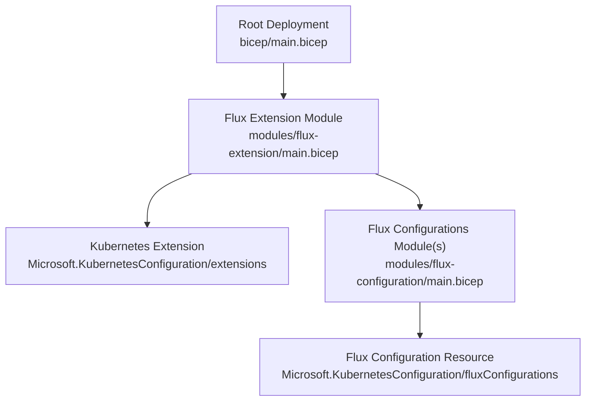
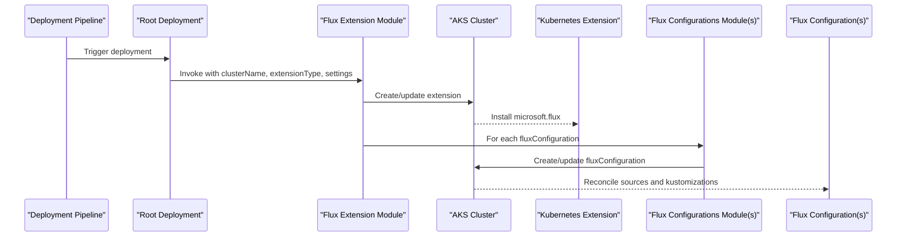
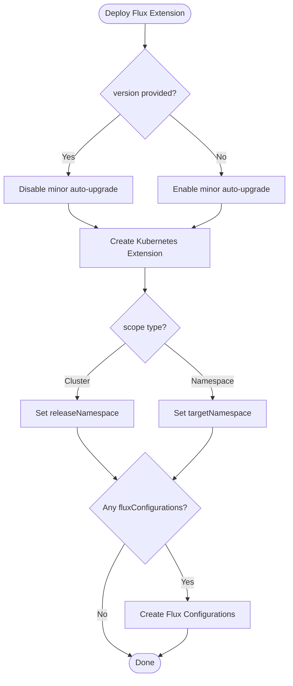
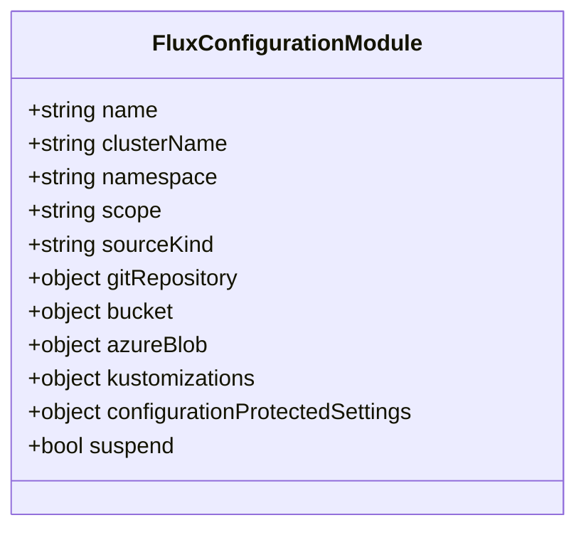
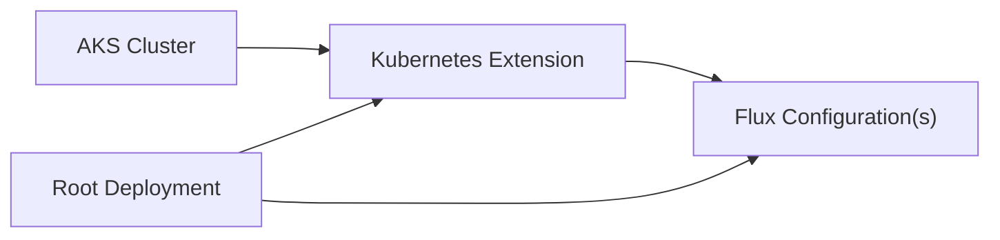

# Flux Extension Module

<cite>
**Referenced Files in This Document**
- [main.bicep](file://bicep/modules/flux-extension/main.bicep)
- [README.md](file://bicep/modules/flux-extension/README.md)
- [version.json](file://bicep/modules/flux-extension/version.json)
- [main.bicep (Flux Configuration)](file://bicep/modules/flux-configuration/main.bicep)
- [main.bicep (Root Deployment)](file://bicep/main.bicep)
- [defaults test](file://bicep/modules/flux-extension/tests/e2e/defaults/main.test.bicep)
- [max test](file://bicep/modules/flux-extension/tests/e2e/max/main.test.bicep)
- [waf-aligned test](file://bicep/modules/flux-extension/tests/e2e/waf-aligned/main.test.bicep)
</cite>

## Table of Contents
1. Introduction
2. Project Structure
3. Core Components
4. Architecture Overview
5. Detailed Component Analysis
6. Dependency Analysis
7. Performance Considerations
8. Troubleshooting Guide
9. Conclusion
10. Appendices

## Introduction
This document explains the Flux Extension Bicep module that installs and configures the Microsoft Flux extension on Azure Kubernetes Service (AKS) clusters. It covers installation parameters, version management, enabling additional Flux capabilities (Helm releases, Kustomize overlays, custom controllers), lifecycle management (upgrade and rollback strategies), monitoring health, troubleshooting failures, security considerations, and best practices for production deployments. It also clarifies how core Flux configuration relates to extensions and how dependencies are managed.

## Project Structure
The Flux Extension module is a reusable Bicep module that:
- Deploys an AKS Kubernetes Configuration Extension of type microsoft.flux
- Optionally creates one or more Flux configurations to reconcile Git repositories or buckets into the cluster
- Exposes outputs for integration with other modules

**Diagram sources**
- [main.bicep (Root Deployment):398-421](file://bicep/main.bicep#L398-L421)
- [main.bicep (Extension):1-122](file://bicep/modules/flux-extension/main.bicep#L1-L122)
- [main.bicep (Flux Configuration):1-101](file://bicep/modules/flux-configuration/main.bicep#L1-L101)

**Section sources**
- [main.bicep (Root Deployment):398-421](file://bicep/main.bicep#L398-L421)
- [main.bicep (Extension):1-122](file://bicep/modules/flux-extension/main.bicep#L1-L122)
- [main.bicep (Flux Configuration):1-101](file://bicep/modules/flux-configuration/main.bicep#L1-L101)

## Core Components
- Flux Extension resource: Installs the microsoft.flux extension onto an existing AKS cluster with optional auto-upgrade behavior and release train selection.
- Flux Configuration resources: Define where Flux should pull manifests from (GitRepository or Bucket/AzureBlob) and which Kustomizations to apply.
- Root deployment wiring: Demonstrates enabling specific Flux controllers (Helm, Kustomize, Source, Notification) via configuration settings.

Key capabilities exposed by configuration settings include enabling/disabling individual Flux controllers such as Helm, Kustomize, Source, Notification, Image Automation, and Image Reflector. The module supports both cluster-scoped and namespace-scoped Flux configurations.

**Section sources**
- [main.bicep (Extension):65-88](file://bicep/modules/flux-extension/main.bicep#L65-L88)
- [main.bicep (Extension):90-110](file://bicep/modules/flux-extension/main.bicep#L90-L110)
- [main.bicep (Flux Configuration):77-91](file://bicep/modules/flux-configuration/main.bicep#L77-L91)
- [main.bicep (Root Deployment):408-416](file://bicep/main.bicep#L408-L416)

## Architecture Overview
The module composes two primary Azure resources:
- Microsoft.KubernetesConfiguration/extensions: The Flux extension installed on the AKS cluster.
- Microsoft.KubernetesConfiguration/fluxConfigurations: One or more Flux configurations that point to source repositories and define Kustomizations to reconcile.

**Diagram sources**
- [main.bicep (Extension):65-88](file://bicep/modules/flux-extension/main.bicep#L65-L88)
- [main.bicep (Extension):90-110](file://bicep/modules/flux-extension/main.bicep#L90-L110)
- [main.bicep (Flux Configuration):77-91](file://bicep/modules/flux-configuration/main.bicep#L77-L91)

## Detailed Component Analysis

### Flux Extension Module
- Purpose: Installs the microsoft.flux extension on an AKS cluster and optionally provisions Flux configurations to reconcile Git or bucket sources.
- Key parameters:
  - name: Identifier for the extension instance
  - clusterName: Target AKS cluster
  - extensionType: microsoft.flux
  - releaseNamespace: Namespace for cluster-scoped extension release
  - targetNamespace: Namespace for namespace-scoped extension
  - version: Pin to a specific extension version; if omitted, minor auto-upgrades are enabled
  - releaseTrain: Auto-upgrade channel (e.g., Stable)
  - configurationSettings: Enable/disable Flux controllers (e.g., helm-controller, kustomize-controller, source-controller, notification-controller)
  - configurationProtectedSettings: Sensitive key-value pairs for extension configuration
  - fluxConfigurations: Array of Flux configuration definitions
- Behavior:
  - If version is provided, autoUpgradeMinorVersion is disabled; otherwise it is enabled
  - Automatically creates namespaces when needed for scope targets
  - Depends on the AKS cluster resource reference
- Outputs:
  - name, resourceId, principalId (for identity-based integrations), resourceGroupName

**Diagram sources**
- [main.bicep (Extension):65-88](file://bicep/modules/flux-extension/main.bicep#L65-L88)
- [main.bicep (Extension):90-110](file://bicep/modules/flux-extension/main.bicep#L90-L110)

**Section sources**
- [main.bicep (Extension):5-38](file://bicep/modules/flux-extension/main.bicep#L5-L38)
- [main.bicep (Extension):65-88](file://bicep/modules/flux-extension/main.bicep#L65-L88)
- [main.bicep (Extension):90-110](file://bicep/modules/flux-extension/main.bicep#L90-L110)
- [main.bicep (Extension):112-122](file://bicep/modules/flux-extension/main.bicep#L112-L122)

### Flux Configuration Module
- Purpose: Creates a Flux configuration resource that reconciles artifacts from a source (GitRepository or Bucket/AzureBlob) using Kustomizations.
- Key parameters:
  - name, clusterName, namespace, scope (cluster or namespace)
  - sourceKind: GitRepository, Bucket, or AzureBlob
  - gitRepository/bucket/azureBlob: Source-specific configuration
  - kustomizations: Map of named Kustomization specs to apply
  - configurationProtectedSettings: Sensitive values for authentication or secrets
  - suspend: Pause reconciliation if needed
- Behavior:
  - Creates the Flux configuration scoped to the specified AKS cluster
  - Applies Kustomizations defined in the parameter map

**Diagram sources**
- [main.bicep (Flux Configuration):5-52](file://bicep/modules/flux-configuration/main.bicep#L5-L52)
- [main.bicep (Flux Configuration):77-91](file://bicep/modules/flux-configuration/main.bicep#L77-L91)

**Section sources**
- [main.bicep (Flux Configuration):5-52](file://bicep/modules/flux-configuration/main.bicep#L5-L52)
- [main.bicep (Flux Configuration):77-91](file://bicep/modules/flux-configuration/main.bicep#L77-L91)

### Root Deployment Integration
- The root deployment invokes the Flux Extension module with:
  - extensionType set to microsoft.flux
  - releaseNamespace set to flux-system
  - releaseTrain set to Stable
  - configurationSettings enabling Helm, Kustomize, Source, and Notification controllers while disabling image automation/reflection controllers
- This wiring demonstrates how to enable additional Flux capabilities through configuration settings.

**Section sources**
- [main.bicep (Root Deployment):398-421](file://bicep/main.bicep#L398-L421)

## Dependency Analysis
- The Flux Extension depends on an existing AKS cluster.
- Flux Configurations depend on the extension being present; the module enforces this dependency explicitly.
- The root deployment depends on the cluster blade output to obtain the cluster name.

**Diagram sources**
- [main.bicep (Extension):61-63](file://bicep/modules/flux-extension/main.bicep#L61-L63)
- [main.bicep (Extension):90-110](file://bicep/modules/flux-extension/main.bicep#L90-L110)
- [main.bicep (Root Deployment):398-421](file://bicep/main.bicep#L398-L421)

**Section sources**
- [main.bicep (Extension):61-63](file://bicep/modules/flux-extension/main.bicep#L61-L63)
- [main.bicep (Extension):90-110](file://bicep/modules/flux-extension/main.bicep#L90-L110)
- [main.bicep (Root Deployment):398-421](file://bicep/main.bicep#L398-L421)

## Performance Considerations
- Use version pinning for production stability: Provide a specific version to disable auto-upgrades and ensure predictable rollouts.
- Limit enabled controllers to only those required to reduce controller overhead and attack surface.
- Configure appropriate sync intervals and timeouts in Flux configurations to balance responsiveness and load.
- Prefer cluster-scoped configurations for shared infrastructure components and namespace-scoped for application workloads to minimize contention.

[No sources needed since this section provides general guidance]

## Troubleshooting Guide
Common issues and resolutions:
- Feature registration prerequisites: Ensure AKS-ExtensionManager feature and required service providers are registered before deploying.
- Identity and permissions: The extension assigns an identity; ensure it has necessary permissions to access source repositories or storage.
- Version conflicts: If auto-upgrades cause unexpected changes, pin the version to lock the extension.
- Controller toggles: Verify configurationSettings to enable only needed controllers; misconfiguration can prevent reconciliation.
- Flux configuration errors: Validate sourceKind and corresponding source parameters (gitRepository or bucket/azureBlob). Confirm namespace and scope match expectations.

Operational tips:
- Use suspend to pause reconciliation during maintenance.
- Inspect extension and Flux configuration status via Azure CLI or portal.
- Review logs for the extension and Flux controllers in the cluster.

**Section sources**
- [README.md:598-614](file://bicep/modules/flux-extension/README.md#L598-L614)
- [main.bicep (Extension):65-88](file://bicep/modules/flux-extension/main.bicep#L65-L88)
- [main.bicep (Flux Configuration):77-91](file://bicep/modules/flux-configuration/main.bicep#L77-L91)

## Conclusion
The Flux Extension module provides a robust, configurable way to install and manage Flux on AKS clusters. By leveraging configurationSettings, you can tailor Flux capabilities to your needs (Helm, Kustomize, notifications, etc.). Use version pinning and controlled upgrades for production reliability, and rely on Flux configurations to declaratively reconcile your desired state from Git or storage sources. Follow security best practices and monitor extension health to maintain a stable GitOps foundation.

[No sources needed since this section summarizes without analyzing specific files]

## Appendices

### Installation Parameters Reference
- Required:
  - name: Extension instance name
  - clusterName: Target AKS cluster
  - extensionType: microsoft.flux
- Optional:
  - location: Defaults to resource group location
  - releaseNamespace: Namespace for cluster-scoped extension release
  - targetNamespace: Namespace for namespace-scoped extension
  - version: Pin to a specific version
  - releaseTrain: Auto-upgrade channel (e.g., Stable)
  - configurationSettings: Enable/disable controllers
  - configurationProtectedSettings: Sensitive key-value pairs
  - fluxConfigurations: Array of Flux configuration definitions

**Section sources**
- [main.bicep (Extension):5-38](file://bicep/modules/flux-extension/main.bicep#L5-L38)
- [README.md:472-580](file://bicep/modules/flux-extension/README.md#L472-L580)

### Enabling Additional Flux Capabilities
- Enable Helm releases: Set 'helm-controller.enabled' to true in configurationSettings
- Enable Kustomize overlays: Set 'kustomize-controller.enabled' to true and define Kustomizations in fluxConfigurations
- Enable notifications: Set 'notification-controller.enabled' to true
- Control image automation/reflection: Set respective flags to false unless required

Examples in tests demonstrate these toggles.

**Section sources**
- [main.bicep (Root Deployment):408-416](file://bicep/main.bicep#L408-L416)
- [max test:58-67](file://bicep/modules/flux-extension/tests/e2e/max/main.test.bicep#L58-L67)
- [waf-aligned test:58-67](file://bicep/modules/flux-extension/tests/e2e/waf-aligned/main.test.bicep#L58-L67)

### Version Management and Upgrade Procedures
- Auto-upgrade behavior:
  - If version is not provided, minor auto-upgrades are enabled
  - If version is provided, auto-upgrades are disabled for pinned versions
- Release train:
  - Specify releaseTrain (e.g., Stable) to control upgrade channel when auto-upgrades are enabled
- Recommended procedure:
  - Pin versions in production
  - Test upgrades in non-production environments
  - Roll back by redeploying with the previous pinned version

**Section sources**
- [main.bicep (Extension):65-88](file://bicep/modules/flux-extension/main.bicep#L65-L88)
- [README.md:561-577](file://bicep/modules/flux-extension/README.md#L561-L577)

### Lifecycle Management and Rollback Strategies
- Lifecycle:
  - Create extension and Flux configurations
  - Reconcile sources and apply Kustomizations
  - Monitor status and adjust configurationSettings as needed
- Rollback:
  - Redeploy with a previous pinned version
  - Temporarily suspend Flux configurations during maintenance
  - Revert Git repository references or Kustomization paths if necessary

**Section sources**
- [main.bicep (Extension):65-88](file://bicep/modules/flux-extension/main.bicep#L65-L88)
- [main.bicep (Flux Configuration):51-52](file://bicep/modules/flux-configuration/main.bicep#L51-L52)

### Monitoring Extension Health
- Check extension status in Azure portal or via CLI
- Inspect Flux configuration status and reconciliation events
- Review controller logs in the cluster for errors
- Use telemetry settings to gather usage insights if enabled

**Section sources**
- [main.bicep (Extension):8-9](file://bicep/modules/flux-extension/main.bicep#L8-L9)
- [main.bicep (Flux Configuration):8-9](file://bicep/modules/flux-configuration/main.bicep#L8-L9)

### Security Considerations
- Use configurationProtectedSettings for sensitive values
- Restrict enabled controllers to minimize attack surface
- Ensure proper RBAC and identity permissions for accessing sources (Git repos, storage)
- Align with organizational policies and compliance requirements

**Section sources**
- [main.bicep (Extension):17-22](file://bicep/modules/flux-extension/main.bicep#L17-L22)
- [main.bicep (Flux Configuration):23-25](file://bicep/modules/flux-configuration/main.bicep#L23-L25)

### Examples and References
- Minimal deployment example: defaults test
- Full-featured deployment example: max test
- WAF-aligned deployment example: waf-aligned test
- Root deployment wiring shows enabling multiple controllers

**Section sources**
- [defaults test:48-64](file://bicep/modules/flux-extension/tests/e2e/defaults/main.test.bicep#L48-L64)
- [max test:48-94](file://bicep/modules/flux-extension/tests/e2e/max/main.test.bicep#L48-L94)
- [waf-aligned test:48-94](file://bicep/modules/flux-extension/tests/e2e/waf-aligned/main.test.bicep#L48-L94)
- [main.bicep (Root Deployment):398-421](file://bicep/main.bicep#L398-L421)