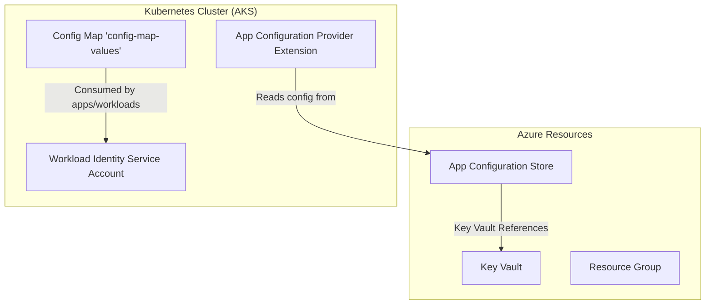
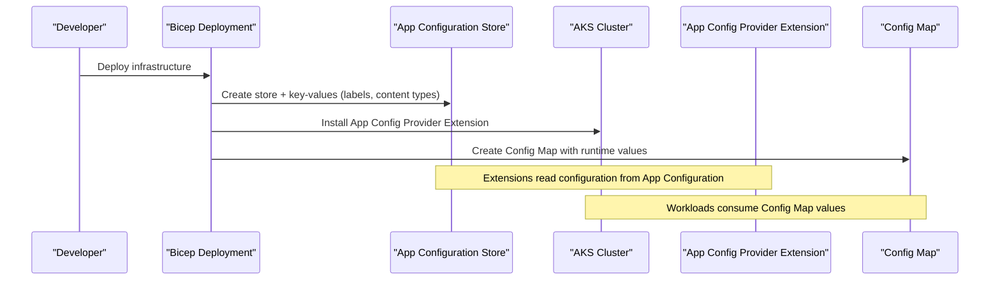
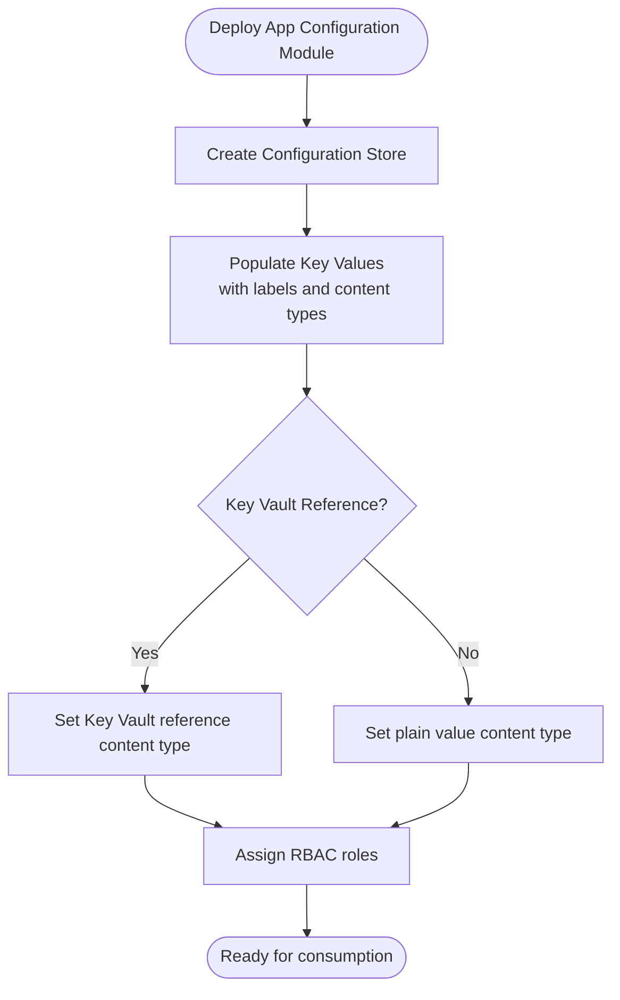
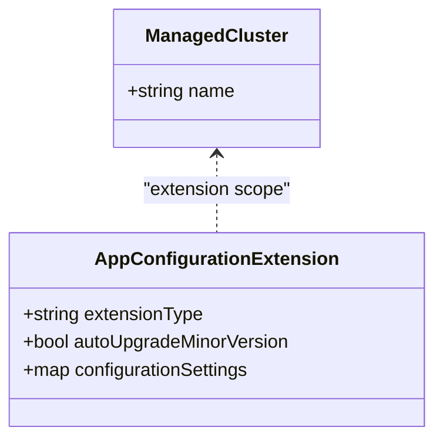
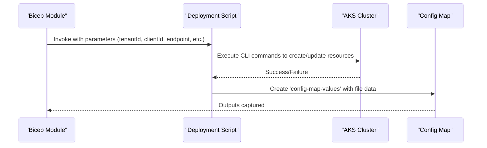
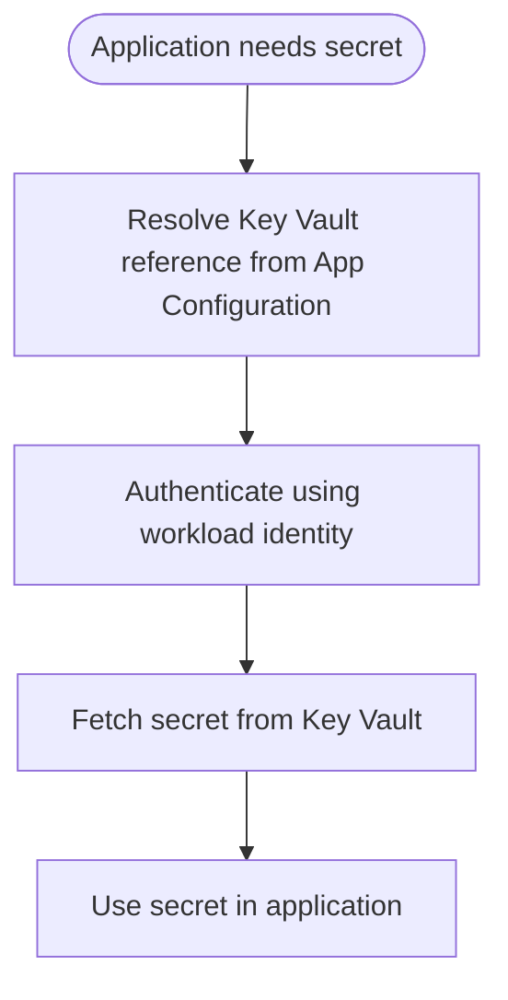
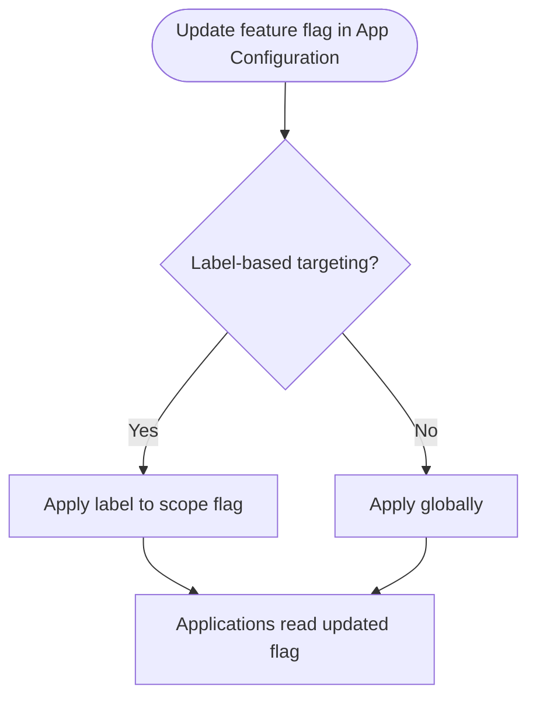
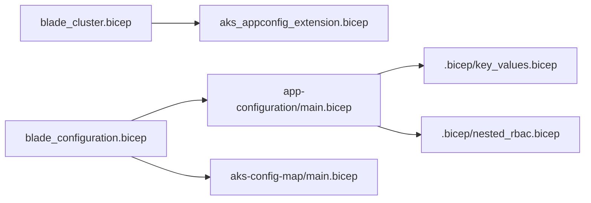

# AKS App Configuration Extension

<cite>
**Referenced Files in This Document**
- [aks_appconfig_extension.bicep](file://bicep/modules/managed-cluster/aks_appconfig_extension.bicep)
- [main.bicep (App Configuration module)](file://bicep/modules/app-configuration/main.bicep)
- [key_values.bicep](file://bicep/modules/app-configuration/.bicep/key_values.bicep)
- [nested_rbac.bicep](file://bicep/modules/app-configuration/.bicep/nested_rbac.bicep)
- [blade_configuration.bicep](file://bicep/modules/blade_configuration.bicep)
- [blade_cluster.bicep](file://bicep/modules/blade_cluster.bicep)
- [aks-config-map main.bicep](file://bicep/modules/aks-config-map/main.bicep)
- [feature_flags.md](file://docs/src/feature_flags.md)
- [app-configuration README.md](file://bicep/modules/app-configuration/README.md)
- [pre-provision.ps1](file://scripts/pre-provision.ps1)
</cite>

## Table of Contents
1. [Introduction](#introduction)
2. [Project Structure](#project-structure)
3. [Core Components](#core-components)
4. [Architecture Overview](#architecture-overview)
5. [Detailed Component Analysis](#detailed-component-analysis)
6. [Dependency Analysis](#dependency-analysis)
7. [Performance Considerations](#performance-considerations)
8. [Troubleshooting Guide](#troubleshooting-guide)
9. [Conclusion](#conclusion)
10. [Appendices](#appendices)

## Introduction
This document explains how to set up and configure the Azure Kubernetes Service (AKS) Application Configuration extension to integrate Azure App Configuration with your cluster for centralized, dynamic application settings management. It covers extension installation via Bicep, configuration parameters, secret synchronization patterns using Key Vault references, feature flags, and environment-specific strategies using labels. The guidance is grounded in the repository’s infrastructure-as-code modules and scripts.

## Project Structure
The repository implements a layered approach:
- Infrastructure provisioning uses Bicep modules to deploy an App Configuration store, assign RBAC, and create key-value entries (including feature flags and Key Vault references).
- AKS integration is achieved by installing the App Configuration Kubernetes provider extension on the managed cluster.
- A Config Map is created in the cluster containing values consumed by applications or GitOps tooling.
- Scripts manage pre-provision steps such as enabling/disabling local authentication for App Configuration.

**Diagram sources**
- [aks_appconfig_extension.bicep:8-18](file://bicep/modules/managed-cluster/aks_appconfig_extension.bicep#L8-L18)
- [main.bicep (App Configuration module):142-182](file://bicep/modules/app-configuration/main.bicep#L142-L182)
- [blade_configuration.bicep:396-463](file://bicep/modules/blade_configuration.bicep#L396-L463)

**Section sources**
- [aks_appconfig_extension.bicep:1-19](file://bicep/modules/managed-cluster/aks_appconfig_extension.bicep#L1-L19)
- [main.bicep (App Configuration module):1-312](file://bicep/modules/app-configuration/main.bicep#L1-L312)
- [blade_configuration.bicep:350-549](file://bicep/modules/blade_configuration.bicep#L350-L549)
- [aks-config-map main.bicep:1-124](file://bicep/modules/aks-config-map/main.bicep#L1-L124)

## Core Components
- App Configuration Store: Centralized configuration source with support for labels, content types, and Key Vault references.
- AKS Extension: Installs the App Configuration Kubernetes provider on the managed cluster to enable dynamic configuration consumption.
- RBAC: Role assignments grant appropriate access to identities for reading configuration and secrets.
- Config Map: A cluster-side Config Map populated with values derived from deployment-time parameters and endpoints.
- Pre-provision Script: Ensures local authentication settings are configured for App Configuration during setup.

Key responsibilities:
- Provision App Configuration and populate key-values (including feature flags and Key Vault references).
- Install the App Configuration provider extension on AKS.
- Create a Config Map with runtime values for workloads.
- Assign RBAC roles to identities that need access to App Configuration.

**Section sources**
- [main.bicep (App Configuration module):142-182](file://bicep/modules/app-configuration/main.bicep#L142-L182)
- [aks_appconfig_extension.bicep:8-18](file://bicep/modules/managed-cluster/aks_appconfig_extension.bicep#L8-L18)
- [nested_rbac.bicep:56-72](file://bicep/modules/app-configuration/.bicep/nested_rbac.bicep#L56-L72)
- [aks-config-map main.bicep:87-117](file://bicep/modules/aks-config-map/main.bicep#L87-L117)
- [pre-provision.ps1:225-241](file://scripts/pre-provision.ps1#L225-L241)

## Architecture Overview
The architecture integrates Azure App Configuration with AKS through the official provider extension. Applications consume configuration either directly via the extension or indirectly through a Config Map generated at deployment time. Feature flags and environment-specific settings are modeled using labels and content types.

**Diagram sources**
- [main.bicep (App Configuration module):142-182](file://bicep/modules/app-configuration/main.bicep#L142-L182)
- [aks_appconfig_extension.bicep:8-18](file://bicep/modules/managed-cluster/aks_appconfig_extension.bicep#L8-L18)
- [blade_configuration.bicep:396-463](file://bicep/modules/blade_configuration.bicep#L396-L463)

## Detailed Component Analysis

### App Configuration Store and Key Values
- Creates an App Configuration store with optional identity and encryption settings.
- Populates key-values using a loop over provided arrays; supports labels and content types.
- Supports Key Vault references via a specific content type, enabling secure secret retrieval at runtime.
- Provides role assignments to grant access to principals.

**Diagram sources**
- [main.bicep (App Configuration module):142-182](file://bicep/modules/app-configuration/main.bicep#L142-L182)
- [key_values.bicep:19-34](file://bicep/modules/app-configuration/.bicep/key_values.bicep#L19-L34)
- [nested_rbac.bicep:56-72](file://bicep/modules/app-configuration/.bicep/nested_rbac.bicep#L56-L72)

**Section sources**
- [main.bicep (App Configuration module):142-182](file://bicep/modules/app-configuration/main.bicep#L142-L182)
- [key_values.bicep:1-43](file://bicep/modules/app-configuration/.bicep/key_values.bicep#L1-L43)
- [nested_rbac.bicep:1-73](file://bicep/modules/app-configuration/.bicep/nested_rbac.bicep#L1-L73)
- [app-configuration README.md:56-149](file://bicep/modules/app-configuration/README.md#L56-L149)

### AKS App Configuration Provider Extension
- Installs the App Configuration Kubernetes provider extension on the managed cluster.
- Sets auto-upgrade behavior and identifies the cluster type.

**Diagram sources**
- [aks_appconfig_extension.bicep:4-18](file://bicep/modules/managed-cluster/aks_appconfig_extension.bicep#L4-L18)

**Section sources**
- [aks_appconfig_extension.bicep:1-19](file://bicep/modules/managed-cluster/aks_appconfig_extension.bicep#L1-L19)
- [blade_cluster.bicep:316-325](file://bicep/modules/blade_cluster.bicep#L316-L325)

### Config Map Creation for Runtime Values
- Uses a deployment script to run commands against AKS and create a Config Map named 'config-map-values'.
- Injects runtime values including tenant ID, client ID, App Configuration endpoint, Key Vault URI, and other operational parameters.

**Diagram sources**
- [aks-config-map main.bicep:87-117](file://bicep/modules/aks-config-map/main.bicep#L87-L117)
- [blade_configuration.bicep:396-463](file://bicep/modules/blade_configuration.bicep#L396-L463)

**Section sources**
- [aks-config-map main.bicep:1-124](file://bicep/modules/aks-config-map/main.bicep#L1-L124)
- [blade_configuration.bicep:396-463](file://bicep/modules/blade_configuration.bicep#L396-L463)

### Secret Synchronization Strategy
- Secrets are not copied into App Configuration; instead, Key Vault references are stored in App Configuration with a dedicated content type.
- At runtime, consumers can resolve these references to retrieve secrets securely from Key Vault.
- For cluster-level secrets, use the existing Key Vault secrets Helm chart pattern to sync Key Vault secrets into Kubernetes Secrets.

**Diagram sources**
- [main.bicep (App Configuration module):142-182](file://bicep/modules/app-configuration/main.bicep#L142-L182)
- [app-configuration README.md:64-98](file://bicep/modules/app-configuration/README.md#L64-L98)

**Section sources**
- [app-configuration README.md:64-98](file://bicep/modules/app-configuration/README.md#L64-L98)

### Dynamic Configuration Updates and Feature Flags
- Feature flags are implemented using special key names and content types within App Configuration.
- Labels enable environment-specific configurations (e.g., development, staging, production).
- Applications can consume feature flags dynamically if integrated with the App Configuration provider.

**Diagram sources**
- [app-configuration README.md:56-149](file://bicep/modules/app-configuration/README.md#L56-L149)

**Section sources**
- [app-configuration README.md:56-149](file://bicep/modules/app-configuration/README.md#L56-L149)

### Environment-Specific Configuration Strategies
- Use labels to segment configuration per environment.
- Combine labels with content types to deliver different payloads (plain text, JSON, Key Vault references, feature flags).
- Configure RBAC to restrict access to sensitive environments.

**Section sources**
- [main.bicep (App Configuration module):172-182](file://bicep/modules/app-configuration/main.bicep#L172-L182)
- [nested_rbac.bicep:56-72](file://bicep/modules/app-configuration/.bicep/nested_rbac.bicep#L56-L72)

## Dependency Analysis
The following diagram shows key dependencies between components involved in setting up App Configuration and integrating it with AKS.

**Diagram sources**
- [blade_cluster.bicep:316-325](file://bicep/modules/blade_cluster.bicep#L316-L325)
- [aks_appconfig_extension.bicep:8-18](file://bicep/modules/managed-cluster/aks_appconfig_extension.bicep#L8-L18)
- [blade_configuration.bicep:350-463](file://bicep/modules/blade_configuration.bicep#L350-L463)
- [main.bicep (App Configuration module):142-182](file://bicep/modules/app-configuration/main.bicep#L142-L182)
- [key_values.bicep:19-34](file://bicep/modules/app-configuration/.bicep/key_values.bicep#L19-L34)
- [nested_rbac.bicep:56-72](file://bicep/modules/app-configuration/.bicep/nested_rbac.bicep#L56-L72)
- [aks-config-map main.bicep:87-117](file://bicep/modules/aks-config-map/main.bicep#L87-L117)

**Section sources**
- [blade_cluster.bicep:316-325](file://bicep/modules/blade_cluster.bicep#L316-L325)
- [blade_configuration.bicep:350-463](file://bicep/modules/blade_configuration.bicep#L350-L463)
- [main.bicep (App Configuration module):142-182](file://bicep/modules/app-configuration/main.bicep#L142-L182)
- [aks-appconfig_extension.bicep:8-18](file://bicep/modules/managed-cluster/aks_appconfig_extension.bicep#L8-L18)
- [aks-config-map main.bicep:87-117](file://bicep/modules/aks-config-map/main.bicep#L87-L117)

## Performance Considerations
- Prefer Key Vault references over embedding secrets in App Configuration to reduce payload size and improve security posture.
- Use labels to avoid duplicating large configuration sets across environments.
- Ensure RBAC is scoped to minimize permission overhead and potential latency due to excessive checks.
- Monitor diagnostic logs and metrics for the App Configuration store to detect performance bottlenecks.

[No sources needed since this section provides general guidance]

## Troubleshooting Guide
Common issues and resolutions:
- Local Authentication: If local authentication is disabled unexpectedly, ensure the pre-provision script runs to set the correct state before deployment.
- RBAC Errors: Verify role assignments target the correct principal and resource scope; confirm built-in role names are mapped correctly.
- Extension Installation Failures: Confirm the managed cluster exists and the extension type matches the supported provider.
- Config Map Not Created: Validate deployment script permissions and environment variables passed to the script.

**Section sources**
- [pre-provision.ps1:225-241](file://scripts/pre-provision.ps1#L225-L241)
- [nested_rbac.bicep:36-72](file://bicep/modules/app-configuration/.bicep/nested_rbac.bicep#L36-L72)
- [aks_appconfig_extension.bicep:8-18](file://bicep/modules/managed-cluster/aks_appconfig_extension.bicep#L8-L18)
- [aks-config-map main.bicep:87-117](file://bicep/modules/aks-config-map/main.bicep#L87-L117)

## Conclusion
By deploying the App Configuration store, installing the AKS provider extension, and configuring RBAC and key-values (including feature flags and Key Vault references), you achieve centralized, dynamic configuration management for AKS workloads. Environment-specific strategies leverage labels and content types, while secret synchronization is handled securely via Key Vault references and optional Kubernetes Secret sync patterns.

[No sources needed since this section summarizes without analyzing specific files]

## Appendices

### Feature Flags Overview
Feature flags are used to toggle functionality, override defaults, and customize software behavior. They are typically set prior to provisioning and can be managed via environment variables in the deployment workflow.

**Section sources**
- [feature_flags.md:1-97](file://docs/src/feature_flags.md#L1-L97)