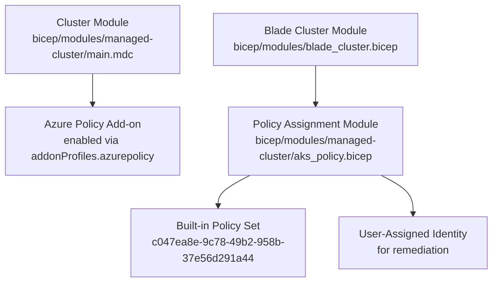
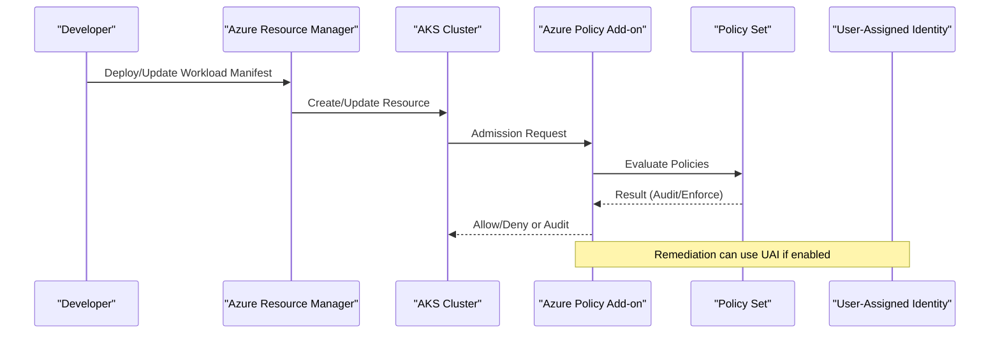
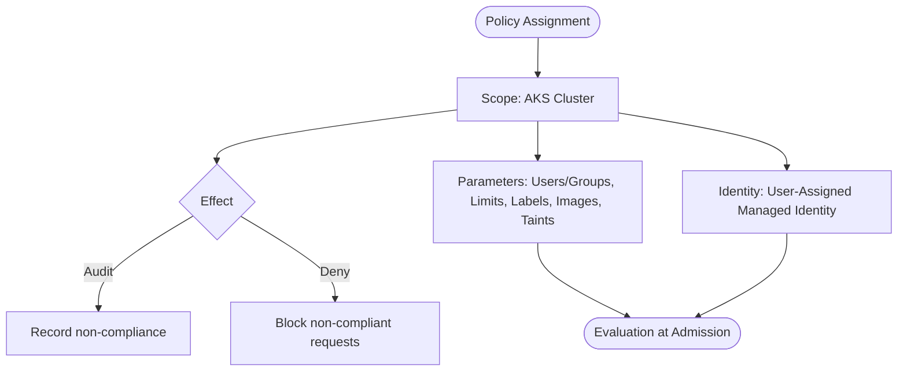
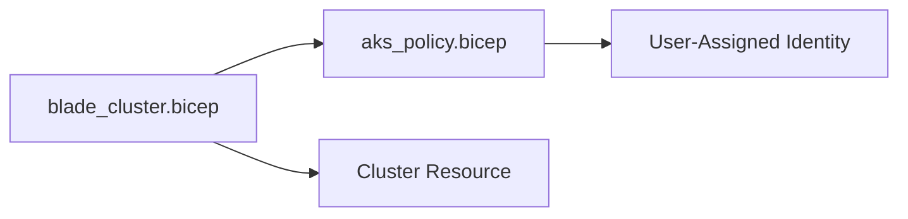
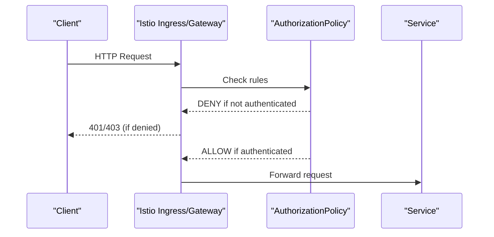
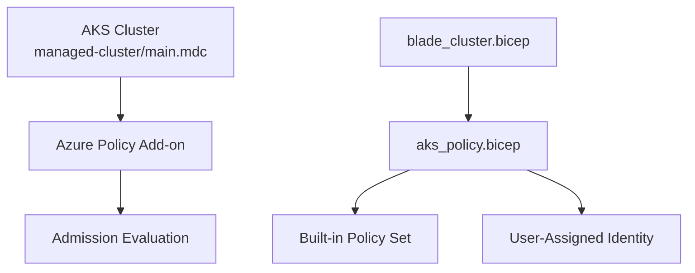

# AKS Policy Management

<cite>
**Referenced Files in This Document**
- [aks_policy.bicep](file://bicep/modules/managed-cluster/aks_policy.bicep)
- [blade_cluster.bicep](file://bicep/modules/blade_cluster.bicep)
- [main.mdc (managed cluster)](file://bicep/modules/managed-cluster/main.mdc)
- [auth-policy.yaml](file://charts/osdu-developer-service/templates/auth-policy.yaml)
- [design_platform.md](file://docs/src/design_platform.md)
</cite>

## Table of Contents
1. [Introduction](#introduction)
2. [Project Structure](#project-structure)
3. [Core Components](#core-components)
4. [Architecture Overview](#architecture-overview)
5. [Detailed Component Analysis](#detailed-component-analysis)
6. [Dependency Analysis](#dependency-analysis)
7. [Performance Considerations](#performance-considerations)
8. [Troubleshooting Guide](#troubleshooting-guide)
9. [Conclusion](#conclusion)
10. [Appendices](#appendices)

## Introduction
This document explains how Azure Policy is integrated with Azure Kubernetes Service (AKS) in this repository to enforce container security and compliance for Kubernetes workloads. It covers policy assignments, enforcement modes, built-in policy sets used by the project, and how RBAC and network policies complement policy-driven governance. It also provides guidance on evaluating policy results and troubleshooting common issues.

## Project Structure
The AKS policy integration is implemented via Infrastructure-as-Code (Bicep) modules that:
- Enable Azure Policy on the AKS cluster
- Assign a built-in policy set focused on deployment safeguards
- Configure parameters such as allowed users/groups, resource limits, labels, image allowlists, and reserved taints
- Integrate with identity for remediation using a user-assigned managed identity

**Diagram sources**
- [blade_cluster.bicep:295-305](file://bicep/modules/blade_cluster.bicep#L295-L305)
- [aks_policy.bicep:11-52](file://bicep/modules/managed-cluster/aks_policy.bicep#L11-L52)
- [main.mdc (managed cluster):626-633](file://bicep/modules/managed-cluster/main.mdc#L626-L633)

**Section sources**
- [blade_cluster.bicep:295-305](file://bicep/modules/blade_cluster.bicep#L295-L305)
- [aks_policy.bicep:11-52](file://bicep/modules/managed-cluster/aks_policy.bicep#L11-L52)
- [main.mdc (managed cluster):626-633](file://bicep/modules/managed-cluster/main.mdc#L626-L633)

## Core Components
- Azure Policy add-on on AKS: The cluster module enables the Azure Policy add-on through the addonProfiles configuration.
- Policy assignment: The policy module assigns a built-in policy set scoped to the AKS cluster, with a user-assigned identity for remediation and an audit effect.
- Parameters: The assignment configures allowed users/groups, CPU/memory limits, required labels, allowed container images regex, and reserved taints.
- Network and service mesh policies: Istio AuthorizationPolicy templates are included to enforce request authentication at the service level.

Key implementation references:
- Enabling Azure Policy add-on on the cluster
- Creating the policy assignment with parameters and identity
- Applying Istio AuthorizationPolicy for per-service auth

**Section sources**
- [main.mdc (managed cluster):626-633](file://bicep/modules/managed-cluster/main.mdc#L626-L633)
- [aks_policy.bicep:11-52](file://bicep/modules/managed-cluster/aks_policy.bicep#L11-L52)
- [auth-policy.yaml:1-29](file://charts/osdu-developer-service/templates/auth-policy.yaml#L1-L29)

## Architecture Overview
The architecture integrates Azure Policy with AKS to enforce guardrails during deployments and runtime:

**Diagram sources**
- [blade_cluster.bicep:295-305](file://bicep/modules/blade_cluster.bicep#L295-L305)
- [aks_policy.bicep:11-52](file://bicep/modules/managed-cluster/aks_policy.bicep#L11-L52)
- [main.mdc (managed cluster):626-633](file://bicep/modules/managed-cluster/main.mdc#L626-L633)

## Detailed Component Analysis

### Azure Policy Add-on on AKS
- The cluster module enables the Azure Policy add-on via addonProfiles.azurepolicy.
- This allows the AKS API server to evaluate policies against incoming requests.

Operational notes:
- Ensure the add-on is enabled before assigning policies.
- Policy evaluation occurs at admission time for supported resources.

**Section sources**
- [main.mdc (managed cluster):626-633](file://bicep/modules/managed-cluster/main.mdc#L626-L633)

### Policy Assignment: AKS Deployment Safeguards
- A policy assignment targets the AKS cluster and uses a built-in policy set ID for deployment safeguards.
- Enforcement mode is set to DoNotEnforce; effect is configured to Audit.
- Parameters include:
  - Allowed users and groups
  - CPU and memory limits
  - Required labels
  - Allowed container images regex
  - Reserved taints
- A user-assigned identity is provided for remediation operations.

**Diagram sources**
- [aks_policy.bicep:11-52](file://bicep/modules/managed-cluster/aks_policy.bicep#L11-L52)

**Section sources**
- [aks_policy.bicep:11-52](file://bicep/modules/managed-cluster/aks_policy.bicep#L11-L52)

### Integration with Blade Cluster Module
- The blade cluster module invokes the policy assignment module, passing the cluster name and user-assigned identity ID.
- Dependencies ensure the cluster exists before applying policies.

**Diagram sources**
- [blade_cluster.bicep:295-305](file://bicep/modules/blade_cluster.bicep#L295-L305)
- [aks_policy.bicep:11-52](file://bicep/modules/managed-cluster/aks_policy.bicep#L11-L52)

**Section sources**
- [blade_cluster.bicep:295-305](file://bicep/modules/blade_cluster.bicep#L295-L305)

### RBAC and Identity Controls
- The platform documentation highlights RBAC and Microsoft Entra ID integration for granular access control.
- Role-based roles and assignments are defined across modules to support least privilege access.

Practical implications:
- Combine Azure Policy for resource-level guardrails with RBAC for API-level permissions.
- Use workload identity where appropriate to minimize privileges.

**Section sources**
- [design_platform.md:26-42](file://docs/src/design_platform.md#L26-L42)

### Network Policies and Service Mesh Security
- Istio AuthorizationPolicy templates are included to enforce request authentication for services.
- These policies deny requests without valid principals except for explicitly allowed paths.

**Diagram sources**
- [auth-policy.yaml:1-29](file://charts/osdu-developer-service/templates/auth-policy.yaml#L1-L29)

**Section sources**
- [auth-policy.yaml:1-29](file://charts/osdu-developer-service/templates/auth-policy.yaml#L1-L29)

## Dependency Analysis
- The policy assignment depends on:
  - An existing AKS cluster resource
  - A user-assigned managed identity for remediation
- The cluster module must enable the Azure Policy add-on prior to policy evaluation.
- The blade cluster module orchestrates these dependencies.

**Diagram sources**
- [main.mdc (managed cluster):626-633](file://bicep/modules/managed-cluster/main.mdc#L626-L633)
- [blade_cluster.bicep:295-305](file://bicep/modules/blade_cluster.bicep#L295-L305)
- [aks_policy.bicep:11-52](file://bicep/modules/managed-cluster/aks_policy.bicep#L11-L52)

**Section sources**
- [main.mdc (managed cluster):626-633](file://bicep/modules/managed-cluster/main.mdc#L626-L633)
- [blade_cluster.bicep:295-305](file://bicep/modules/blade_cluster.bicep#L295-L305)
- [aks_policy.bicep:11-52](file://bicep/modules/managed-cluster/aks_policy.bicep#L11-L52)

## Performance Considerations
- Policy evaluation occurs at admission time; overly broad or complex policies can increase latency.
- Prefer specific allowlists and precise constraints to reduce evaluation overhead.
- Use audit mode during rollout to observe impacts before enforcing.

[No sources needed since this section provides general guidance]

## Troubleshooting Guide
Common issues and resolutions:
- Policy add-on not enabled:
  - Verify addonProfiles.azurepolicy is enabled in the cluster module.
- Assignment scope or identity errors:
  - Confirm the policy assignment targets the correct AKS cluster and that the user-assigned identity exists and has necessary permissions.
- Non-compliant workloads blocked or audited:
  - Review policy parameters (allowed images, labels, limits).
  - Adjust parameters or update manifests to comply.
- RBAC delays:
  - Role assignment changes may take up to 30 minutes to propagate; sign out/in or retry after delay.

Relevant references:
- Policy assignment parameters and enforcement mode
- RBAC role assignment behavior noted in tests

**Section sources**
- [aks_policy.bicep:11-52](file://bicep/modules/managed-cluster/aks_policy.bicep#L11-L52)
- [main.mdc (managed cluster):626-633](file://bicep/modules/managed-cluster/main.mdc#L626-L633)

## Conclusion
This repository implements AKS policy integration by enabling the Azure Policy add-on and assigning a built-in policy set for deployment safeguards. Parameters govern allowed users/groups, resource limits, labels, images, and taints. RBAC and Istio AuthorizationPolicies complement policy enforcement to secure both cluster resources and service-to-service communication. Use audit mode during rollouts and refine parameters to balance compliance and operational needs.

[No sources needed since this section summarizes without analyzing specific files]

## Appendices

### Built-in Policy Set Used
- The assignment references a built-in policy set ID for deployment safeguards.
- This set includes multiple policies covering common AKS security and compliance requirements.

**Section sources**
- [aks_policy.bicep:11-11](file://bicep/modules/managed-cluster/aks_policy.bicep#L11-L11)

### Example Scenarios
- Restricting container images:
  - Update the allowedContainerImagesRegex parameter to match approved registries and images.
- Enforcing resource limits:
  - Set cpuLimit and memoryLimit to cap resource usage per workload.
- Requiring metadata:
  - Define required labels to ensure consistent tagging and governance.
- Reserving node taints:
  - Specify reservedTaints to protect critical nodes from scheduling regular workloads.

**Section sources**
- [aks_policy.bicep:27-50](file://bicep/modules/managed-cluster/aks_policy.bicep#L27-L50)

### Policy Evaluation Results
- With effect set to Audit, non-compliant requests are recorded but allowed.
- To block non-compliant requests, change enforcementMode and effect accordingly in the assignment.

**Section sources**
- [aks_policy.bicep:22-28](file://bicep/modules/managed-cluster/aks_policy.bicep#L22-L28)