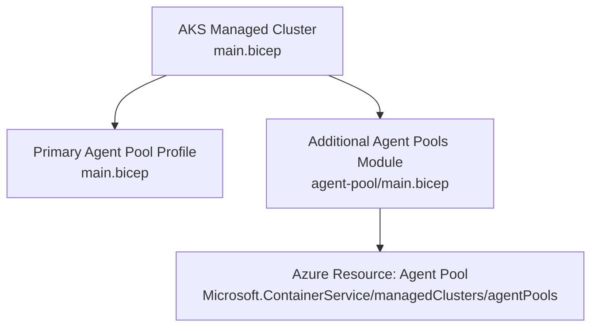
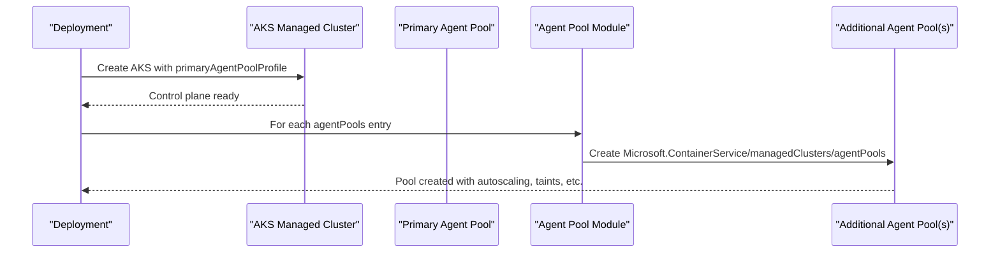
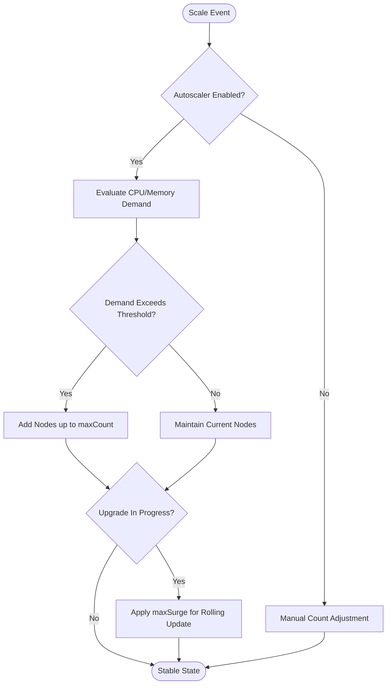
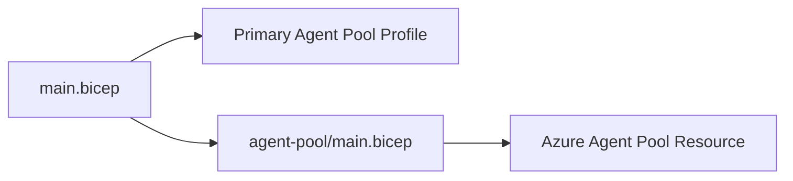

# Agent Pools Configuration

<cite>
**Referenced Files in This Document**
- [main.bicep](file://bicep/modules/managed-cluster/main.bicep)
- [agent-pool/main.bicep](file://bicep/modules/managed-cluster/agent-pool/main.bicep)
- [agent-pool/README.md](file://bicep/modules/managed-cluster/agent-pool/README.md)
- [blade_cluster.bicep](file://bicep/modules/blade_cluster.bicep)
- [main.parameters.json](file://bicep/main.parameters.json)
- [elastic-search.yaml](file://software/components/elastic-search/elastic-search.yaml)
- [cache.yaml](file://software/components/osdu-system/cache.yaml)
</cite>

## Table of Contents
1. [Introduction](#introduction)
2. [Project Structure](#project-structure)
3. [Core Components](#core-components)
4. [Architecture Overview](#architecture-overview)
5. [Detailed Component Analysis](#detailed-component-analysis)
6. [Dependency Analysis](#dependency-analysis)
7. [Performance Considerations](#performance-considerations)
8. [Troubleshooting Guide](#troubleshooting-guide)
9. [Conclusion](#conclusion)
10. [Appendices](#appendices)

## Introduction
This document explains how the AKS agent pool configuration module is implemented and used to provision primary and secondary (additional) node pools, covering node sizing, autoscaling, spot instance support, custom node pool options, lifecycle management, scaling strategies, performance optimization, taints and tolerations, workload distribution patterns, and deployment scenarios from development to production with cost optimization guidance.

## Project Structure
The AKS agent pool configuration is implemented as a reusable Bicep module that:
- Declares an AKS managed cluster and its primary agent pool profile
- Instantiates one or more additional agent pools via a dedicated module
- Exposes parameters for autoscaling, VM sizes, OS types, networking, security, and upgrade behavior

**Diagram sources**
- [main.bicep:556-817](file://bicep/modules/managed-cluster/main.bicep#L556-L817)
- [main.bicep:828-871](file://bicep/modules/managed-cluster/main.bicep#L828-L871)
- [agent-pool/main.bicep:160-208](file://bicep/modules/managed-cluster/agent-pool/main.bicep#L160-L208)

**Section sources**
- [main.bicep:165-169](file://bicep/modules/managed-cluster/main.bicep#L165-L169)
- [main.bicep:828-871](file://bicep/modules/managed-cluster/main.bicep#L828-L871)
- [agent-pool/main.bicep:1-218](file://bicep/modules/managed-cluster/agent-pool/main.bicep#L1-L218)

## Core Components
- Primary agent pool profile: Defined in the main cluster module and passed into the managed cluster resource. It supports system mode, availability zones, subnetting, SSH access, and autoscaling controls.
- Additional agent pools: Iterated and deployed using the agent-pool module, which maps parameters to the Azure API for each pool.
- Agent pool module: Encapsulates all node pool properties including VM size, OS type, disk settings, autoscaling, taints, labels, networking, upgrades, and spot pricing.

Key capabilities exposed by the modules:
- Node sizing via vmSize
- Autoscaling via enableAutoScaling, minCount, maxCount
- Spot instances via scaleSetPriority and spotMaxPrice
- Custom node pool options such as osDiskType, osSku, kubeletDiskType, enableUltraSSD, gpuInstanceProfile
- Taints and labels via nodeTaints and nodeLabels
- Networking via vnetSubnetID and podSubnetId
- Upgrade behavior via orchestratorVersion and maxSurge

**Section sources**
- [main.bicep:165-169](file://bicep/modules/managed-cluster/main.bicep#L165-L169)
- [main.bicep:828-871](file://bicep/modules/managed-cluster/main.bicep#L828-L871)
- [agent-pool/main.bicep:1-218](file://bicep/modules/managed-cluster/agent-pool/main.bicep#L1-L218)
- [agent-pool/README.md:17-68](file://bicep/modules/managed-cluster/agent-pool/README.md#L17-L68)

## Architecture Overview
The architecture separates cluster-level configuration from node pool specifics. The main module provisions the AKS control plane and passes the primary agent pool profile directly. Additional pools are created through the agent-pool module, enabling reuse and consistent parameterization across multiple pools.

**Diagram sources**
- [main.bicep:556-817](file://bicep/modules/managed-cluster/main.bicep#L556-L817)
- [main.bicep:828-871](file://bicep/modules/managed-cluster/main.bicep#L828-L871)
- [agent-pool/main.bicep:160-208](file://bicep/modules/managed-cluster/agent-pool/main.bicep#L160-L208)

## Detailed Component Analysis

### Primary Agent Pool Profile
- Mode: System pools host critical workloads and must exist at all times.
- Sizing: vmSize determines compute resources per node; count sets initial nodes when autoscaling is disabled.
- Autoscaling: When node auto-provisioning is disabled, minCount/maxCount define bounds; otherwise, count can be set to 1 and autoscaler manages capacity.
- Networking: vnetSubnetID and podSubnetId allow separation of node and pod IP spaces.
- Security: sshAccess can be disabled; availabilityZones improve resilience.
- Taints: CriticalAddonsOnly=true:NoSchedule ensures only essential system pods run on the system pool.

Example usage pattern:
- System pool with availability zone, Linux OS, AzureLinux SKU, disabled SSH, and taints to restrict scheduling.

**Section sources**
- [blade_cluster.bicep:219-242](file://bicep/modules/blade_cluster.bicep#L219-L242)
- [main.bicep:556-817](file://bicep/modules/managed-cluster/main.bicep#L556-L817)

### Additional Agent Pools (User Pools)
- Mode: User pools run application workloads and can be scaled independently.
- Sizing: vmSize tailored to workload needs; count/minCount/maxCount configured based on autoscaling strategy.
- Autoscaling: Enable autoscaling to dynamically adjust capacity; configure min/max bounds.
- Spot instances: Use scaleSetPriority=Spot and optionally spotMaxPrice to cap costs; eviction policy controls behavior on preemption.
- Networking: Separate pod subnet enables advanced networking topologies.
- Labels and taints: Apply nodeLabels for affinity; use nodeTaints to isolate workloads.

Example usage pattern:
- User pool with autoscaling enabled, Linux OS, AzureLinux SKU, availability zones, and optional pod subnet.

**Section sources**
- [blade_cluster.bicep:244-263](file://bicep/modules/blade_cluster.bicep#L244-L263)
- [agent-pool/main.bicep:1-218](file://bicep/modules/managed-cluster/agent-pool/main.bicep#L1-L218)

### Agent Pool Module Parameters and Mapping
The agent-pool module exposes comprehensive parameters that map directly to the Azure API for agent pools. Key categories include:
- Scaling: count, enableAutoScaling, minCount, maxCount, maxSurge
- Compute: vmSize, gpuInstanceProfile, kubeletDiskType
- Storage: osDiskSizeGB, osDiskType, enableUltraSSD
- Networking: vnetSubnetID, podSubnetID, nodePublicIpPrefixID, enableNodePublicIP
- Security: enableEncryptionAtHost, enableFIPS, sshAccess
- Workload placement: nodeLabels, nodeTaints, mode
- Upgrades: orchestratorVersion
- Spot pricing: scaleSetPriority, spotMaxPrice, scaleSetEvictionPolicy

These parameters are iteratively applied to each additional agent pool defined in the main module.

**Section sources**
- [agent-pool/main.bicep:1-218](file://bicep/modules/managed-cluster/agent-pool/main.bicep#L1-L218)
- [agent-pool/README.md:17-68](file://bicep/modules/managed-cluster/agent-pool/README.md#L17-L68)
- [main.bicep:828-871](file://bicep/modules/managed-cluster/main.bicep#L828-L871)

### Node Pool Lifecycle Management
- Creation: Agent pools are created during cluster provisioning (primary) or as part of additional pools via the module loop.
- Scaling: Autoscaler adjusts node counts within min/max bounds; surge upgrades create temporary extra nodes during rolling updates.
- Upgrades: orchestratorVersion aligns node pool Kubernetes version with control plane; maxSurge controls upgrade concurrency.
- Deletion: Nodes can be deallocated or deleted on scale-down depending on scaleDownMode; spot VMs follow eviction policy.

**Diagram sources**
- [main.bicep:707-725](file://bicep/modules/managed-cluster/main.bicep#L707-L725)
- [agent-pool/main.bicep:137-139](file://bicep/modules/managed-cluster/agent-pool/main.bicep#L137-L139)

**Section sources**
- [main.bicep:707-725](file://bicep/modules/managed-cluster/main.bicep#L707-L725)
- [agent-pool/main.bicep:107-139](file://bicep/modules/managed-cluster/agent-pool/main.bicep#L107-L139)

### Scaling Strategies
- Horizontal Pod Autoscaler (HPA) and Vertical Pod Autoscaler (VPA): Configure at workload level; VPA addon can be enabled at cluster level.
- Cluster Autoscaler: Tune scan intervals, thresholds, and expansion strategies via autoScalerProfile parameters.
- Node Auto Provisioning: Can be enabled to automatically add nodes when pending pods cannot be scheduled.

Best practices:
- Set appropriate min/max bounds to prevent overprovisioning
- Use surge upgrades to maintain availability during rollouts
- Combine HPA/VPA with cluster autoscaler for end-to-end elasticity

**Section sources**
- [main.bicep:234-289](file://bicep/modules/managed-cluster/main.bicep#L234-L289)
- [main.bicep:414-416](file://bicep/modules/managed-cluster/main.bicep#L414-L416)

### Spot Instance Support and Cost Optimization
- Spot priority: Use scaleSetPriority=Spot for fault-tolerant workloads to reduce costs.
- Max price: Optionally set spotMaxPrice to cap spending; -1 indicates willingness to pay any on-demand price.
- Eviction policy: Choose Delete or Deallocate to handle preemption gracefully.
- Workload design: Ensure applications are resilient to interruptions and can reschedule quickly.

Cost optimization strategies:
- Mix regular and spot pools for different workload tiers
- Right-size VMs and use autoscaling to match demand
- Leverage availability zones for resilience without overprovisioning

**Section sources**
- [agent-pool/main.bicep:114-129](file://bicep/modules/managed-cluster/agent-pool/main.bicep#L114-L129)
- [agent-pool/README.md:308-349](file://bicep/modules/managed-cluster/agent-pool/README.md#L308-L349)

### Taints and Tolerations
- System pool taints: CriticalAddonsOnly=true:NoSchedule restricts scheduling to critical system pods.
- Application taints: Define nodeTaints to isolate sensitive or specialized workloads.
- Tolerations: Workloads specify tolerations to schedule onto tainted nodes.

Workload distribution patterns:
- Use nodeSelector and nodeAffinity to target specific pools or zones
- Apply topologySpreadConstraints to distribute stateful workloads across zones

Examples in this repository:
- Elastic Search uses nodeAffinity targeting agentpool values and topology.kubernetes.io/zone for multi-zone distribution.
- Cache component targets specific pools and zones via nodeAffinity.

**Section sources**
- [blade_cluster.bicep:238-240](file://bicep/modules/blade_cluster.bicep#L238-L240)
- [elastic-search.yaml:45-87](file://software/components/elastic-search/elastic-search.yaml#L45-L87)
- [cache.yaml:152-171](file://software/components/osdu-system/cache.yaml#L152-L171)

### Deployment Scenarios and Examples

#### Development Environment
- Small system pool (e.g., Standard_DS2_v2) with minimal count
- Single user pool with autoscaling disabled or small bounds
- Spot instances not typically used; focus on simplicity and low cost

Configuration reference:
- Default test deployment demonstrates a minimal system pool with mode=System and basic sizing.

**Section sources**
- [main.test.bicep:45-52](file://bicep/modules/managed-cluster/tests/e2e/defaults/main.test.bicep#L45-L52)

#### Staging Environment
- Medium-sized system pool with availability zones
- User pool with autoscaling enabled and moderate min/max bounds
- Optional spot instances for non-critical batch jobs

Configuration reference:
- Blade cluster example shows system pool with availability zones, taints, and a user pool with autoscaling.

**Section sources**
- [blade_cluster.bicep:219-263](file://bicep/modules/blade_cluster.bicep#L219-L263)

#### Production Environment
- Robust system pool with availability zones and strict taints
- Multiple user pools for different workload classes (CPU, memory, GPU)
- Autoscaling tuned with conservative bounds and surge upgrades
- Spot instances for fault-tolerant workloads with eviction policies
- Network isolation with separate pod subnets

Configuration reference:
- Main parameters expose serverConfiguration for system, zone, and user pools, allowing environment-specific sizing.

**Section sources**
- [main.parameters.json:33-38](file://bicep/main.parameters.json#L33-L38)
- [agent-pool/main.bicep:1-218](file://bicep/modules/managed-cluster/agent-pool/main.bicep#L1-L218)

## Dependency Analysis
The main cluster module depends on:
- Primary agent pool profile passed directly to the managed cluster resource
- Additional agent pools instantiated via the agent-pool module
- Optional addons and configurations (autoscaler, monitoring, storage drivers)

The agent-pool module depends on:
- Existing managed cluster reference
- Azure API for creating agent pools with specified properties

**Diagram sources**
- [main.bicep:556-817](file://bicep/modules/managed-cluster/main.bicep#L556-L817)
- [main.bicep:828-871](file://bicep/modules/managed-cluster/main.bicep#L828-L871)
- [agent-pool/main.bicep:160-208](file://bicep/modules/managed-cluster/agent-pool/main.bicep#L160-L208)

**Section sources**
- [main.bicep:556-817](file://bicep/modules/managed-cluster/main.bicep#L556-L817)
- [main.bicep:828-871](file://bicep/modules/managed-cluster/main.bicep#L828-L871)
- [agent-pool/main.bicep:160-208](file://bicep/modules/managed-cluster/agent-pool/main.bicep#L160-L208)

## Performance Considerations
- Node sizing: Choose vmSize aligned with workload requirements; avoid overprovisioning.
- Disk performance: Use appropriate osDiskType and consider UltraSSD for high I/O workloads.
- Networking: Separate pod subnets can improve performance and scalability; ensure CIDR ranges do not overlap.
- Autoscaling: Tune cluster autoscaler profiles to balance responsiveness and stability.
- Upgrades: Use maxSurge to minimize downtime during rolling updates.
- Monitoring: Enable container insights and metrics to track utilization and identify bottlenecks.

[No sources needed since this section provides general guidance]

## Troubleshooting Guide
Common issues and resolutions:
- Pods failing to schedule due to insufficient resources: Adjust min/max bounds or right-size VMs.
- Spot VM evictions causing workload disruptions: Implement resilient designs and appropriate tolerations; review eviction policy.
- Network conflicts: Verify pod and node subnet CIDRs do not overlap with existing networks.
- Upgrade failures: Review orchestratorVersion alignment and maxSurge settings; ensure compatibility with control plane.

Diagnostic steps:
- Inspect node pool status and events via kubectl and Azure portal
- Review autoscaler logs and metrics to understand scaling decisions
- Validate taints and tolerations to ensure correct workload placement

**Section sources**
- [agent-pool/main.bicep:107-139](file://bicep/modules/managed-cluster/agent-pool/main.bicep#L107-L139)
- [main.bicep:707-725](file://bicep/modules/managed-cluster/main.bicep#L707-L725)

## Conclusion
The AKS agent pool configuration module provides a robust, reusable foundation for managing both system and user node pools. It supports comprehensive customization for sizing, autoscaling, networking, security, and cost optimization. By leveraging taints, tolerations, and affinity rules, teams can implement effective workload distribution patterns across development, staging, and production environments. Proper tuning of autoscaling and upgrade strategies ensures reliability and performance while controlling costs.

[No sources needed since this section summarizes without analyzing specific files]

## Appendices

### Parameter Reference Summary
- Primary agent pool profile: name, mode, vmSize, count, minCount, maxCount, availabilityZones, vnetSubnetID, podSubnetId, sshAccess, nodeTaints
- Additional agent pools: All parameters available in the agent-pool module, including autoscaling, spot pricing, disk settings, networking, and upgrade behavior

**Section sources**
- [agent-pool/README.md:17-68](file://bicep/modules/managed-cluster/agent-pool/README.md#L17-L68)
- [main.bicep:1024-1138](file://bicep/modules/managed-cluster/main.bicep#L1024-L1138)