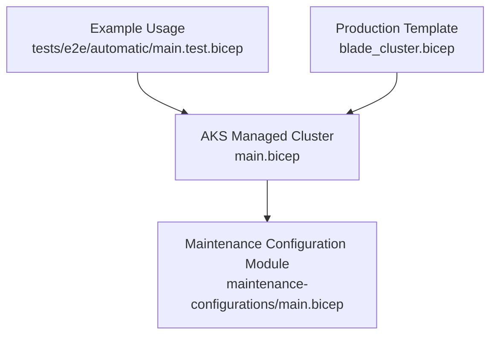
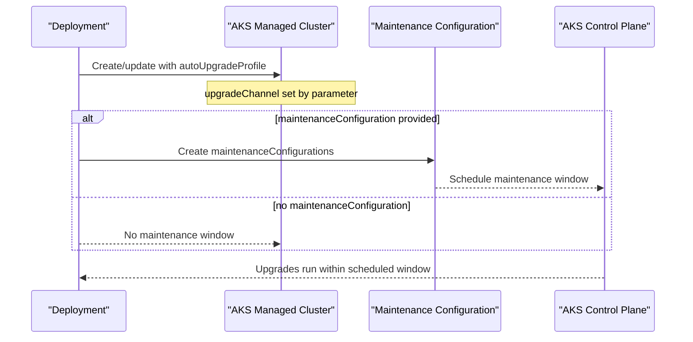
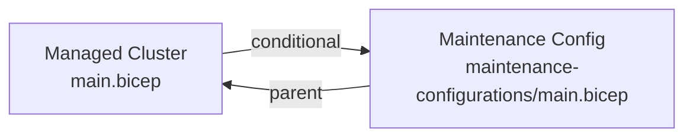

# Maintenance Configurations

<cite>
**Referenced Files in This Document**
- [main.bicep](file://bicep/modules/managed-cluster/main.bicep)
- [maintenance-configurations/main.bicep](file://bicep/modules/managed-cluster/maintenance-configurations/main.bicep)
- [README.md](file://bicep/modules/managed-cluster/maintenance-configurations/README.md)
- [main.test.bicep](file://bicep/modules/managed-cluster/tests/e2e/automatic/main.test.bicep)
- [blade_cluster.bicep](file://bicep/modules/blade_cluster.bicep)
</cite>

## Table of Contents
1. Introduction
2. Project Structure
3. Core Components
4. Architecture Overview
5. Detailed Component Analysis
6. Dependency Analysis
7. Performance Considerations
8. Troubleshooting Guide
9. Conclusion

## Introduction
This document explains how AKS maintenance configurations are managed in this repository, focusing on:
- Maintenance window scheduling for controlled upgrade timing
- Automatic upgrade channels and cluster update policies
- Templates and examples for custom maintenance windows
- Upgrade strategies for production environments
- Security patching schedules, Kubernetes version upgrades, and node image updates
- Best practices to minimize downtime during maintenance operations and rollback procedures

The implementation uses Azure Verified Modules (AVM) Bicep modules to deploy an AKS managed cluster and a dedicated maintenance configuration resource that defines when and how the cluster is updated.

## Project Structure
The AKS maintenance configuration is implemented through two primary components:
- The AKS managed cluster module, which configures auto-upgrade behavior and exposes a parameter to attach a maintenance configuration
- A dedicated maintenance configuration module that creates the maintenance schedule resource scoped to the AKS cluster

**Diagram sources**
- [main.bicep:726-728](file://bicep/modules/managed-cluster/main.bicep#L726-L728)
- [main.bicep:820-826](file://bicep/modules/managed-cluster/main.bicep#L820-L826)
- [maintenance-configurations/main.bicep:18-24](file://bicep/modules/managed-cluster/maintenance-configurations/main.bicep#L18-L24)
- [main.test.bicep:42-58](file://bicep/modules/managed-cluster/tests/e2e/automatic/main.test.bicep#L42-L58)
- [blade_cluster.bicep:201-217](file://bicep/modules/blade_cluster.bicep#L201-L217)

**Section sources**
- [main.bicep:726-728](file://bicep/modules/managed-cluster/main.bicep#L726-L728)
- [main.bicep:820-826](file://bicep/modules/managed-cluster/main.bicep#L820-L826)
- [maintenance-configurations/main.bicep:1-34](file://bicep/modules/managed-cluster/maintenance-configurations/main.bicep#L1-L34)
- [main.test.bicep:42-58](file://bicep/modules/managed-cluster/tests/e2e/automatic/main.test.bicep#L42-L58)
- [blade_cluster.bicep:201-217](file://bicep/modules/blade_cluster.bicep#L201-L217)

## Core Components
- AKS managed cluster module
  - Declares the AKS cluster with an auto-upgrade profile channel
  - Conditionally deploys a maintenance configuration module when a maintenance window is provided
- Maintenance configuration module
  - Creates a maintenance configuration resource attached to the AKS cluster
  - Accepts a maintenance window object describing schedule, duration, time zone, start date, and start time
- Example usage and production template
  - Demonstrates weekly maintenance windows and integration into the overall deployment

Key behaviors:
- Auto-upgrade channel controls the cadence and type of Kubernetes control plane and node image updates
- Maintenance window constrains when AKS can perform upgrades and patches
- The maintenance configuration is optional and only created when configured

**Section sources**
- [main.bicep:291-299](file://bicep/modules/managed-cluster/main.bicep#L291-L299)
- [main.bicep:726-728](file://bicep/modules/managed-cluster/main.bicep#L726-L728)
- [main.bicep:820-826](file://bicep/modules/managed-cluster/main.bicep#L820-L826)
- [maintenance-configurations/main.bicep:5-24](file://bicep/modules/managed-cluster/maintenance-configurations/main.bicep#L5-L24)
- [README.md:17-57](file://bicep/modules/managed-cluster/maintenance-configurations/README.md#L17-L57)
- [main.test.bicep:42-58](file://bicep/modules/managed-cluster/tests/e2e/automatic/main.test.bicep#L42-L58)
- [blade_cluster.bicep:201-217](file://bicep/modules/blade_cluster.bicep#L201-L217)

## Architecture Overview
The architecture composes the AKS cluster with an optional maintenance configuration. The cluster’s auto-upgrade profile determines the upgrade channel, while the maintenance configuration restricts when upgrades occur.

**Diagram sources**
- [main.bicep:726-728](file://bicep/modules/managed-cluster/main.bicep#L726-L728)
- [main.bicep:820-826](file://bicep/modules/managed-cluster/main.bicep#L820-L826)
- [maintenance-configurations/main.bicep:18-24](file://bicep/modules/managed-cluster/maintenance-configurations/main.bicep#L18-L24)

## Detailed Component Analysis

### AKS Managed Cluster Module
- Auto-upgrade channel
  - Configured via a parameter that sets the cluster’s autoUpgradeProfile.upgradeChannel
  - Supported values include options such as rapid, stable, patch, node-image, none
- Conditional maintenance configuration
  - When maintenanceConfiguration is provided, the module deploys the maintenance configuration module and passes the maintenanceWindow and cluster name
- Integration points
  - Works alongside other cluster settings like networking, addons, monitoring, and security profiles

Operational implications:
- Choosing a more aggressive channel (e.g., rapid) increases update frequency; pairing it with a restrictive maintenance window reduces risk
- Node image updates can be aligned with the same or separate schedules depending on policy

**Section sources**
- [main.bicep:291-299](file://bicep/modules/managed-cluster/main.bicep#L291-L299)
- [main.bicep:726-728](file://bicep/modules/managed-cluster/main.bicep#L726-L728)
- [main.bicep:820-826](file://bicep/modules/managed-cluster/main.bicep#L820-L826)

### Maintenance Configuration Module
- Resource creation
  - Deploys a maintenance configuration resource scoped under the AKS managed cluster
  - Uses the provided maintenanceWindow object to define schedule, duration, timezone offset, start date, and start time
- Parameters and outputs
  - Requires a maintenanceWindow object
  - Optionally accepts a parent managed cluster name when used standalone
  - Outputs the configuration name, resource ID, and resource group

Usage patterns:
- Weekly maintenance windows are demonstrated in tests and production templates
- Duration and UTC offset should align with operational constraints and regional requirements

**Section sources**
- [maintenance-configurations/main.bicep:5-24](file://bicep/modules/managed-cluster/maintenance-configurations/main.bicep#L5-L24)
- [maintenance-configurations/README.md:17-57](file://bicep/modules/managed-cluster/maintenance-configurations/README.md#L17-L57)
- [maintenance-configurations/README.md:59-66](file://bicep/modules/managed-cluster/maintenance-configurations/README.md#L59-L66)

### Example: Weekly Maintenance Window
- Test example
  - Defines a weekly schedule on Sunday with a 4-hour duration, UTC offset, and start date/time
- Production template
  - Mirrors a similar weekly schedule for consistency across environments

These examples illustrate how to structure the maintenanceWindow object for predictable, controlled maintenance.

**Section sources**
- [main.test.bicep:42-58](file://bicep/modules/managed-cluster/tests/e2e/automatic/main.test.bicep#L42-L58)
- [blade_cluster.bicep:201-217](file://bicep/modules/blade_cluster.bicep#L201-L217)

### Upgrade Strategies and Policies
- Auto-upgrade channel selection
  - rapid: earliest availability of new versions
  - stable: curated, tested releases
  - patch: security and bug fixes
  - node-image: OS-level node image updates
  - none: disable automatic upgrades
- Policy alignment
  - Pair a conservative channel (stable or patch) with a restricted maintenance window for production stability
  - Use node-image channel to coordinate OS-level updates separately from Kubernetes control plane upgrades if needed

Best practices:
- Start with stable or patch channels in production
- Enforce maintenance windows to limit exposure
- Monitor upgrade progress and health post-maintenance

**Section sources**
- [main.bicep:291-299](file://bicep/modules/managed-cluster/main.bicep#L291-L299)
- [main.bicep:726-728](file://bicep/modules/managed-cluster/main.bicep#L726-L728)

### Custom Maintenance Windows
- Scheduling options
  - Weekly intervals with day-of-week selection
  - Daily or monthly schedules supported by the underlying API
- Timezone and duration
  - Configure UTC offset and duration hours to fit operational windows
- Start date and time
  - Define when the first maintenance window begins

Templates:
- See test and production examples for concrete structures of the maintenanceWindow object

**Section sources**
- [main.test.bicep:42-58](file://bicep/modules/managed-cluster/tests/e2e/automatic/main.test.bicep#L42-L58)
- [blade_cluster.bicep:201-217](file://bicep/modules/blade_cluster.bicep#L201-L217)
- [maintenance-configurations/README.md:17-57](file://bicep/modules/managed-cluster/maintenance-configurations/README.md#L17-L57)

### Security Patching, Kubernetes Version Upgrades, and Node Image Updates
- Security patching
  - Controlled by the auto-upgrade channel (patch) and executed within the maintenance window
- Kubernetes version upgrades
  - Controlled by the auto-upgrade channel (rapid/stable) and executed within the maintenance window
- Node image updates
  - Controlled by the node-image channel; can be coordinated with the same or different maintenance windows depending on policy

Operational guidance:
- Align all upgrade types with your maintenance window to avoid unexpected downtime
- Validate cluster health after each upgrade phase

**Section sources**
- [main.bicep:291-299](file://bicep/modules/managed-cluster/main.bicep#L291-L299)
- [main.bicep:726-728](file://bicep/modules/managed-cluster/main.bicep#L726-L728)

### Best Practices for Minimizing Downtime and Rollback Procedures
- Minimize downtime
  - Use rolling upgrades via AKS maintenance windows
  - Keep multiple agent pools where possible to drain and replace nodes incrementally
  - Set appropriate max surge and drain timeouts at the pool level
  - Pre-warm images and ensure readiness probes are robust
- Rollback procedures
  - If an upgrade causes issues, use AKS rollback capabilities to revert to a previous known-good version
  - Revert node pool orchestrator versions if necessary
  - Reapply any application-level changes that may have been disrupted

Note: These practices complement the automated scheduling defined by the maintenance configuration and auto-upgrade profile.

[No sources needed since this section provides general guidance]

## Dependency Analysis
The AKS cluster module conditionally depends on the maintenance configuration module. The maintenance configuration resource depends on the existence of the AKS cluster.

**Diagram sources**
- [main.bicep:820-826](file://bicep/modules/managed-cluster/main.bicep#L820-L826)
- [maintenance-configurations/main.bicep:14-24](file://bicep/modules/managed-cluster/maintenance-configurations/main.bicep#L14-L24)

**Section sources**
- [main.bicep:820-826](file://bicep/modules/managed-cluster/main.bicep#L820-L826)
- [maintenance-configurations/main.bicep:14-24](file://bicep/modules/managed-cluster/maintenance-configurations/main.bicep#L14-L24)

## Performance Considerations
- Choose the smallest effective maintenance window to reduce exposure
- Avoid overlapping maintenance windows with peak traffic periods
- Use node-image channel judiciously to balance OS-level updates with workload stability
- Monitor upgrade durations and adjust window size accordingly

[No sources needed since this section provides general guidance]

## Troubleshooting Guide
Common issues and checks:
- Maintenance window not applied
  - Verify that maintenanceConfiguration was provided and non-empty in the cluster parameters
  - Confirm the maintenance configuration resource exists and references the correct cluster
- Unexpected upgrades outside the window
  - Check the auto-upgrade channel setting; consider switching to a more conservative channel
  - Validate the maintenance window schedule, duration, and UTC offset
- Upgrade failures
  - Review AKS upgrade events and logs
  - Use AKS rollback to revert to a previous version if necessary

Validation steps:
- Inspect the cluster’s autoUpgradeProfile.upgradeChannel
- Inspect the maintenance configuration’s schedule and timing
- Correlate upgrade timestamps with the configured maintenance window

**Section sources**
- [main.bicep:291-299](file://bicep/modules/managed-cluster/main.bicep#L291-L299)
- [main.bicep:726-728](file://bicep/modules/managed-cluster/main.bicep#L726-L728)
- [main.bicep:820-826](file://bicep/modules/managed-cluster/main.bicep#L820-L826)
- [maintenance-configurations/main.bicep:18-24](file://bicep/modules/managed-cluster/maintenance-configurations/main.bicep#L18-L24)

## Conclusion
This repository implements AKS maintenance configuration management using Bicep modules that:
- Define an auto-upgrade channel to control the pace and type of updates
- Attach a maintenance configuration to constrain when upgrades occur
- Provide reusable templates and examples for consistent scheduling across environments

For production environments, pair a conservative upgrade channel with a well-defined maintenance window, monitor upgrades closely, and maintain rollback procedures to ensure minimal downtime and rapid recovery.

[No sources needed since this section summarizes without analyzing specific files]