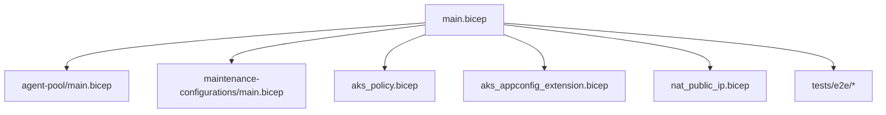
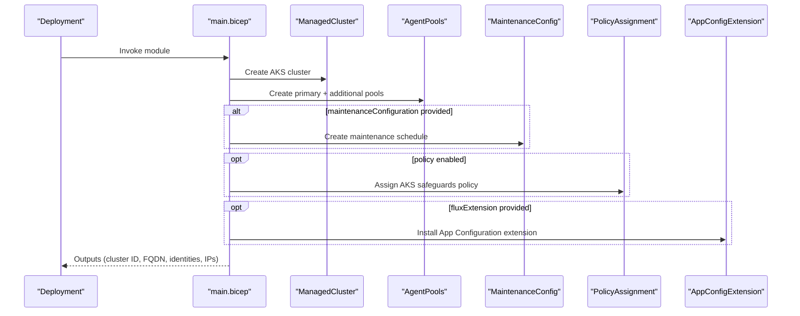
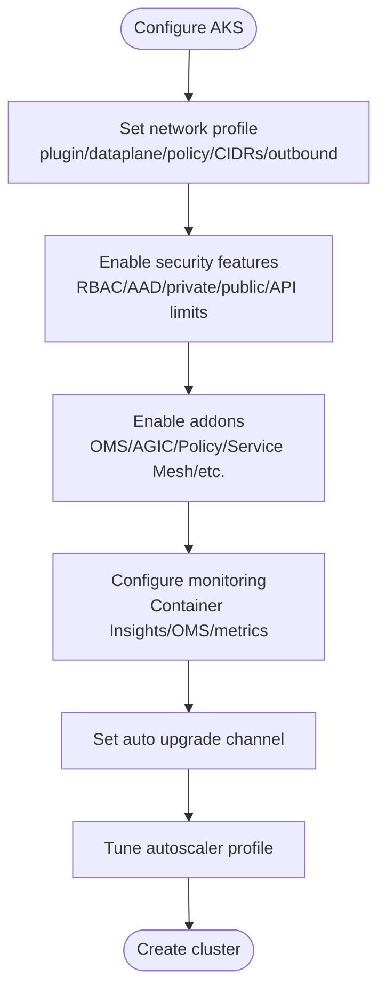
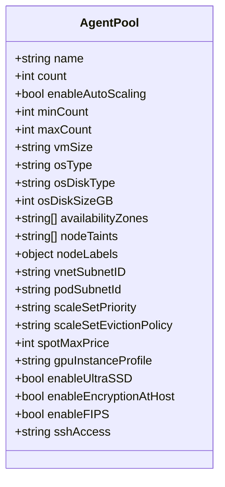
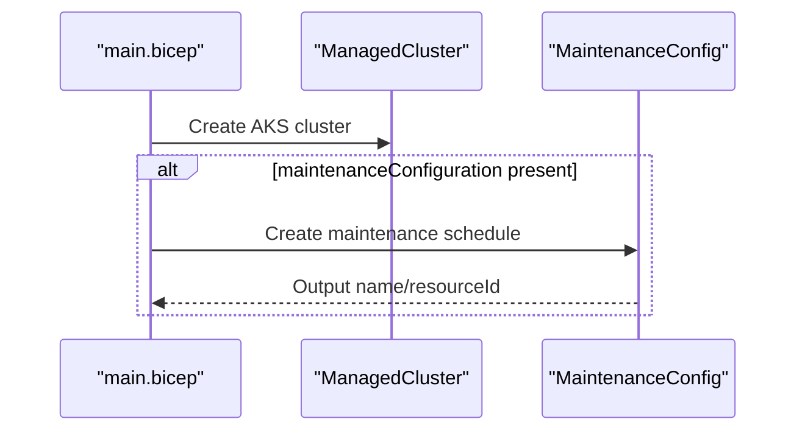
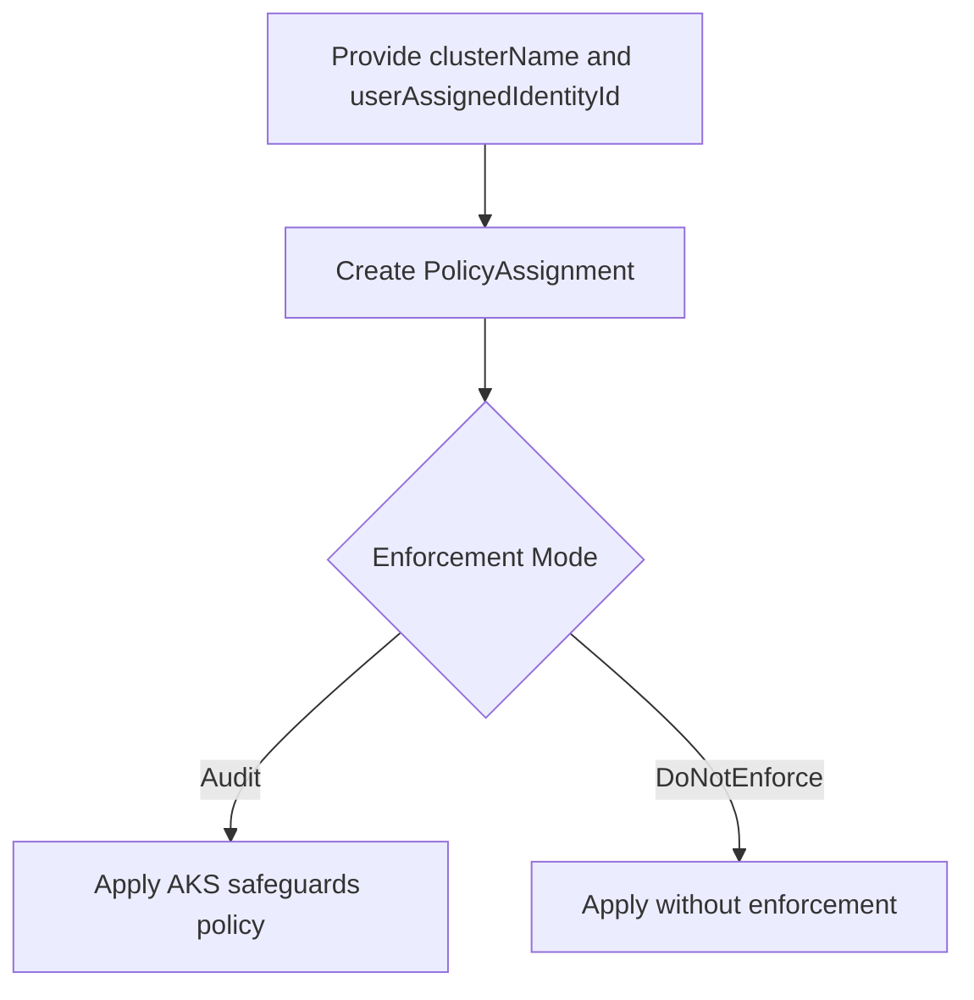
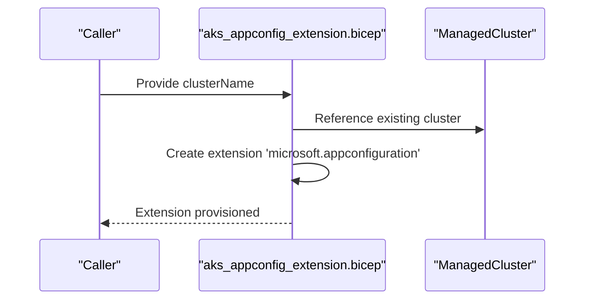
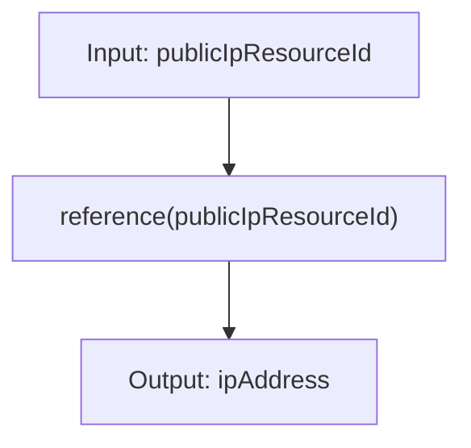
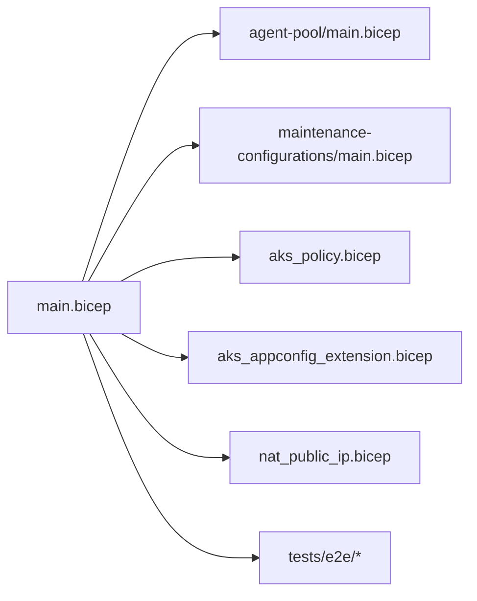

# Managed Cluster Module

<cite>
**Referenced Files in This Document**
- [main.bicep](file://bicep/modules/managed-cluster/main.bicep)
- [README.md](file://bicep/modules/managed-cluster/README.md)
- [agent-pool/main.bicep](file://bicep/modules/managed-cluster/agent-pool/main.bicep)
- [maintenance-configurations/main.bicep](file://bicep/modules/managed-cluster/maintenance-configurations/main.bicep)
- [aks_policy.bicep](file://bicep/modules/managed-cluster/aks_policy.bicep)
- [aks_appconfig_extension.bicep](file://bicep/modules/managed-cluster/aks_appconfig_extension.bicep)
- [nat_public_ip.bicep](file://bicep/modules/managed-cluster/nat_public_ip.bicep)
- [tests/e2e/defaults/main.test.bicep](file://bicep/modules/managed-cluster/tests/e2e/defaults/main.test.bicep)
- [tests/e2e/azure/main.test.bicep](file://bicep/modules/managed-cluster/tests/e2e/azure/main.test.bicep)
- [tests/e2e/kubenet/main.test.bicep](file://bicep/modules/managed-cluster/tests/e2e/kubenet/main.test.bicep)
- [tests/e2e/priv/main.test.bicep](file://bicep/modules/managed-cluster/tests/e2e/priv/main.test.bicep)
</cite>

## Table of Contents
1. Introduction
2. Project Structure
3. Core Components
4. Architecture Overview
5. Detailed Component Analysis
6. Dependency Analysis
7. Performance Considerations
8. Troubleshooting Guide
9. Conclusion
10. Appendices

## Introduction
This document provides comprehensive documentation for the Managed Cluster Bicep module that provisions Azure Kubernetes Service (AKS) clusters. It covers cluster configuration, node pools, networking options, security policies, maintenance scheduling, AKS App Configuration extension setup, NAT public IP management, monitoring, troubleshooting, scaling strategies, cost optimization, and production best practices. The guidance is grounded in the module’s parameters, resources, and end-to-end test scenarios included in the repository.

## Project Structure
The Managed Cluster module is organized into a main orchestration file and focused submodules:
- Main module: defines the AKS cluster, addons, autoscaler, network profile, identity, diagnostics, roles, and optional extensions.
- Agent pool submodule: creates one or more agent pools with autoscaling, spot instances, and custom node settings.
- Maintenance configurations submodule: schedules automated upgrades via maintenance windows.
- Policy submodule: assigns an AKS deployment safeguards policy set to audit cluster deployments.
- App Configuration extension submodule: installs the App Configuration provider extension on the cluster.
- NAT public IP helper: outputs the IP address of a provided Public IP resource for NAT scenarios.
- End-to-end tests: demonstrate default, Azure CNI, Kubenet, and private cluster deployments.

**Diagram sources**
- [main.bicep:556-818](file://bicep/modules/managed-cluster/main.bicep#L556-L818)
- [agent-pool/main.bicep:156-208](file://bicep/modules/managed-cluster/agent-pool/main.bicep#L156-L208)
- [maintenance-configurations/main.bicep:14-24](file://bicep/modules/managed-cluster/maintenance-configurations/main.bicep#L14-L24)
- [aks_policy.bicep:7-52](file://bicep/modules/managed-cluster/aks_policy.bicep#L7-L52)
- [aks_appconfig_extension.bicep:4-18](file://bicep/modules/managed-cluster/aks_appconfig_extension.bicep#L4-L18)
- [nat_public_ip.bicep:1-6](file://bicep/modules/managed-cluster/nat_public_ip.bicep#L1-L6)

**Section sources**
- [main.bicep:1-416](file://bicep/modules/managed-cluster/main.bicep#L1-L416)
- [README.md:1-41](file://bicep/modules/managed-cluster/README.md#L1-L41)

## Core Components
- AKS cluster resource: Configures SKU tier/name, Kubernetes version, RBAC, AAD integration, public/private access, API server restrictions, and addon profiles (OMS, AGIC, Open Service Mesh, Key Vault Secrets Provider, etc.).
- Network profile: Supports Azure CNI or Kubenet, overlay mode, Calico/Azure network policies, pod/service CIDRs, DNS service IP, outbound type (load balancer, user-defined routing, managed NAT gateway), and load balancer settings.
- Autoscaler profile: Fine-grained control over scale-up/scale-down behavior, utilization thresholds, expander strategy, and timing parameters.
- Auto upgrade profile: Upgrade channel selection (stable, rapid, patch, node-image).
- Identity and security: System/user-assigned identities, OIDC issuer, Workload Identity, Pod Identity, Defender, Image Cleaner, storage CSI drivers, snapshot controller.
- Monitoring: Container Insights, OMS agent, metrics allowlists, syslog port.
- Diagnostics and roles: Diagnostic settings to Log Analytics/Storage/Event Hubs; role assignments for principals.
- Locks: Optional resource locks to prevent accidental deletion/modification.
- Extensions: Flux extension support via external module; App Configuration extension via dedicated module.

**Section sources**
- [main.bicep:556-818](file://bicep/modules/managed-cluster/main.bicep#L556-L818)
- [main.bicep:670-799](file://bicep/modules/managed-cluster/main.bicep#L670-L799)
- [main.bicep:707-728](file://bicep/modules/managed-cluster/main.bicep#L707-L728)
- [main.bicep:736-782](file://bicep/modules/managed-cluster/main.bicep#L736-L782)
- [main.bicep:901-928](file://bicep/modules/managed-cluster/main.bicep#L901-L928)
- [main.bicep:930-944](file://bicep/modules/managed-cluster/main.bicep#L930-L944)
- [main.bicep:890-899](file://bicep/modules/managed-cluster/main.bicep#L890-L899)
- [main.bicep:873-888](file://bicep/modules/managed-cluster/main.bicep#L873-L888)

## Architecture Overview
The module composes the AKS cluster with optional components:
- Primary and additional agent pools are created via a looped module invocation.
- Maintenance configurations are conditionally deployed when a maintenance window is provided.
- Policy assignment can be applied to enforce guardrails in audit mode.
- App Configuration extension is installed separately for centralized configuration management.
- NAT Public IP helper supports retrieving the effective outbound IP for NAT scenarios.

**Diagram sources**
- [main.bicep:556-818](file://bicep/modules/managed-cluster/main.bicep#L556-L818)
- [main.bicep:820-888](file://bicep/modules/managed-cluster/main.bicep#L820-L888)
- [aks_policy.bicep:7-52](file://bicep/modules/managed-cluster/aks_policy.bicep#L7-L52)
- [aks_appconfig_extension.bicep:4-18](file://bicep/modules/managed-cluster/aks_appconfig_extension.bicep#L4-L18)

## Detailed Component Analysis

### AKS Cluster Configuration
- Cluster identity: system-assigned or user-assigned managed identities.
- Networking: plugin (Azure/Cilium), dataplane, plugin mode (overlay), policy (Calico/Azure), CIDRs, DNS service IP, outbound type, load balancer SKU and profile.
- Security: RBAC, AAD integration (managed or client/server app IDs), private cluster, public network access, authorized API server IP ranges, run command disablement, pod identity, OIDC issuer, Workload Identity, Defender, image cleaner.
- Addons: HTTP/Web app routing, AGIC, OMS, ACI connector, Azure Policy, Open Service Mesh, Kube Dashboard, Key Vault Secrets Provider, Istio service mesh.
- Monitoring: Container Insights, OMS agent, metrics allowlists, syslog port.
- Storage: Blob/Disk/File CSI drivers, snapshot controller.
- Auto upgrade channel and autoscaler profile tuning.

**Diagram sources**
- [main.bicep:556-818](file://bicep/modules/managed-cluster/main.bicep#L556-L818)
- [main.bicep:670-799](file://bicep/modules/managed-cluster/main.bicep#L670-L799)

**Section sources**
- [main.bicep:1-416](file://bicep/modules/managed-cluster/main.bicep#L1-L416)
- [main.bicep:556-818](file://bicep/modules/managed-cluster/main.bicep#L556-L818)

### Agent Pool Management
- Supports multiple pools with autoscaling (min/max count), availability zones, taints/labels, OS disk type/size, VM size, pod subnet, proximity placement groups, and workload runtime.
- Spot instances: configure scale set priority to Spot and optionally set max price; eviction policy controls behavior on eviction.
- Custom node configurations: GPU instance profile, UltraSSD, encryption at host, FIPS, kubelet disk type, SSH access.
- Orchestration: orchestrator version defaults to cluster version if not specified.

**Diagram sources**
- [agent-pool/main.bicep:156-208](file://bicep/modules/managed-cluster/agent-pool/main.bicep#L156-L208)

**Section sources**
- [agent-pool/main.bicep:1-218](file://bicep/modules/managed-cluster/agent-pool/main.bicep#L1-L218)
- [main.bicep:828-871](file://bicep/modules/managed-cluster/main.bicep#L828-L871)

### Maintenance Configuration Scheduling
- Deploys a maintenance configuration linked to the AKS cluster with a defined maintenance window (schedule, start date/time, duration, UTC offset).
- Conditionally created only when maintenanceConfiguration is provided.

**Diagram sources**
- [main.bicep:820-826](file://bicep/modules/managed-cluster/main.bicep#L820-L826)
- [maintenance-configurations/main.bicep:14-24](file://bicep/modules/managed-cluster/maintenance-configurations/main.bicep#L14-L24)

**Section sources**
- [maintenance-configurations/main.bicep:1-34](file://bicep/modules/managed-cluster/maintenance-configurations/main.bicep#L1-L34)
- [main.bicep:820-826](file://bicep/modules/managed-cluster/main.bicep#L820-L826)

### Policy Enforcement Using Azure Policy
- Assigns an AKS Deployment Safeguards policy set scoped to the cluster using a user-assigned identity.
- Enforced in Audit mode by default; parameters include CPU/memory limits, allowed images regex, labels, reserved taints, and allowed users/groups.

**Diagram sources**
- [aks_policy.bicep:7-52](file://bicep/modules/managed-cluster/aks_policy.bicep#L7-L52)

**Section sources**
- [aks_policy.bicep:1-53](file://bicep/modules/managed-cluster/aks_policy.bicep#L1-L53)

### AKS App Configuration Extension Setup
- Installs the App Configuration Kubernetes provider extension on the target cluster with minor version auto-upgrade and global cluster type setting.

**Diagram sources**
- [aks_appconfig_extension.bicep:4-18](file://bicep/modules/managed-cluster/aks_appconfig_extension.bicep#L4-L18)

**Section sources**
- [aks_appconfig_extension.bicep:1-19](file://bicep/modules/managed-cluster/aks_appconfig_extension.bicep#L1-L19)

### NAT Public IP Management
- Helper module outputs the IP address of a provided Public IP resource using ARM functions, enabling NAT scenarios where the outbound IP must be known.

**Diagram sources**
- [nat_public_ip.bicep:1-6](file://bicep/modules/managed-cluster/nat_public_ip.bicep#L1-L6)

**Section sources**
- [nat_public_ip.bicep:1-6](file://bicep/modules/managed-cluster/nat_public_ip.bicep#L1-L6)

### Deployment Scenarios from Tests
- Defaults: minimal cluster with system pool and system-assigned identity.
- Azure CNI: full-featured cluster with Azure CNI, overlay mode, multiple pools, diagnostics, storage CSI drivers, Open Service Mesh, Defender, Key Vault Secrets Provider, customer-managed keys, locks, role assignments, and Flux extension.
- Kubenet: cluster using Kubenet with diagnostics and role assignments.
- Private cluster: private AKS with private DNS zone, Azure CNI, and specific service CIDR/DNS service IP.

**Section sources**
- [tests/e2e/defaults/main.test.bicep:1-56](file://bicep/modules/managed-cluster/tests/e2e/defaults/main.test.bicep#L1-L56)
- [tests/e2e/azure/main.test.bicep:1-289](file://bicep/modules/managed-cluster/tests/e2e/azure/main.test.bicep#L1-L289)
- [tests/e2e/kubenet/main.test.bicep:1-187](file://bicep/modules/managed-cluster/tests/e2e/kubenet/main.test.bicep#L1-L187)
- [tests/e2e/priv/main.test.bicep:1-139](file://bicep/modules/managed-cluster/tests/e2e/priv/main.test.bicep#L1-L139)

## Dependency Analysis
- The main module depends on:
  - Agent pool submodule for each additional pool.
  - Maintenance configurations submodule when a maintenance window is provided.
  - Optional policy assignment for guardrails.
  - Optional Flux extension via external module.
  - Optional App Configuration extension via dedicated module.
  - Optional NAT Public IP helper for outbound IP retrieval.
- External dependencies include Azure Policy definitions, diagnostic destinations (Log Analytics, Storage, Event Hubs), and optional services like Application Gateway (for AGIC).

**Diagram sources**
- [main.bicep:820-888](file://bicep/modules/managed-cluster/main.bicep#L820-L888)
- [agent-pool/main.bicep:156-208](file://bicep/modules/managed-cluster/agent-pool/main.bicep#L156-L208)
- [maintenance-configurations/main.bicep:14-24](file://bicep/modules/managed-cluster/maintenance-configurations/main.bicep#L14-L24)
- [aks_policy.bicep:7-52](file://bicep/modules/managed-cluster/aks_policy.bicep#L7-L52)
- [aks_appconfig_extension.bicep:4-18](file://bicep/modules/managed-cluster/aks_appconfig_extension.bicep#L4-L18)
- [nat_public_ip.bicep:1-6](file://bicep/modules/managed-cluster/nat_public_ip.bicep#L1-L6)

**Section sources**
- [main.bicep:820-888](file://bicep/modules/managed-cluster/main.bicep#L820-L888)

## Performance Considerations
- Autoscaler tuning: adjust scan interval, scale-down delays, utilization threshold, expander strategy, max node provision time, unready thresholds, and new pod scale-up delay to balance responsiveness and stability.
- Node pool sizing: right-size VM SKUs, use availability zones for resilience, and consider spot instances for fault-tolerant workloads with appropriate eviction policies.
- Networking: choose Azure CNI for preallocated IPs and better performance; Kubenet may reduce IP consumption but has different capabilities.
- Outbound connectivity: prefer managed NAT gateway or explicit outbound IPs for predictable egress; tune load balancer SKU and profile.
- Monitoring: enable Container Insights and OMS agent; limit metric labels/annotations to reduce overhead.
- Storage: enable required CSI drivers; use snapshot controller for backups; consider ephemeral OS disks for stateless nodes.

[No sources needed since this section provides general guidance]

## Troubleshooting Guide
- Cluster creation failures: validate network CIDRs do not overlap with VNet subnets; ensure outbound type and LB/NAT settings are compatible; confirm required permissions for managed identities and role assignments.
- Networking issues: verify network plugin compatibility (Azure vs Kubenet), policy settings, and private cluster DNS configuration; check authorized API server IP ranges and run command settings.
- Autoscaler problems: review autoscaler logs and metrics; adjust thresholds and delays; ensure node pools have capacity and correct taints/labels.
- Spot instance evictions: confirm eviction policy and spot max price; design workloads to tolerate interruptions.
- Monitoring gaps: ensure diagnostic settings point to valid destinations; verify OMS agent and Container Insights are enabled; check syslog port and metric allowlists.
- Policy conflicts: review AKS safeguards policy parameters; switch enforcement mode temporarily to identify violations.
- Extension installation: confirm cluster connectivity and permissions for installing extensions; validate configuration settings.

**Section sources**
- [main.bicep:670-799](file://bicep/modules/managed-cluster/main.bicep#L670-L799)
- [main.bicep:901-928](file://bicep/modules/managed-cluster/main.bicep#L901-L928)
- [aks_policy.bicep:22-51](file://bicep/modules/managed-cluster/aks_policy.bicep#L22-L51)

## Conclusion
The Managed Cluster module offers a robust, configurable foundation for deploying AKS clusters with strong security, observability, and operational controls. By leveraging its parameters and submodules, teams can implement diverse networking models, secure access, scheduled maintenance, policy enforcement, and advanced integrations such as App Configuration and Flux. The included end-to-end tests provide practical blueprints for common and advanced scenarios, while the module’s extensibility supports evolving platform needs.

[No sources needed since this section summarizes without analyzing specific files]

## Appendices

### Scaling Strategies
- Use horizontal pod autoscaling (HPA) alongside cluster autoscaler; set appropriate requests/limits to trigger scaling accurately.
- Configure multiple node pools for heterogeneous workloads (system vs user, GPU vs CPU).
- Enable vertical pod autoscaler (VPA) add-on for right-sizing recommendations.

**Section sources**
- [main.bicep:662-669](file://bicep/modules/managed-cluster/main.bicep#L662-L669)
- [agent-pool/main.bicep:171-180](file://bicep/modules/managed-cluster/agent-pool/main.bicep#L171-L180)

### Cost Optimization
- Use spot instances for non-critical workloads with suitable eviction policies.
- Right-size VM SKUs and leverage availability zones for resilience without overprovisioning.
- Tune autoscaler thresholds to avoid unnecessary scale-ups; monitor utilization and adjust accordingly.
- Disable unused addons and CSI drivers to reduce overhead.

**Section sources**
- [agent-pool/main.bicep:114-129](file://bicep/modules/managed-cluster/agent-pool/main.bicep#L114-L129)
- [main.bicep:707-728](file://bicep/modules/managed-cluster/main.bicep#L707-L728)

### Production Best Practices
- Enable private clusters with restricted API server access and private DNS zones.
- Use managed identities and least-privilege role assignments; apply locks to protect critical resources.
- Enable Azure Policy and AKS safeguards in audit mode initially, then enforce as needed.
- Implement comprehensive monitoring and diagnostics to Log Analytics/Storage/Event Hubs.
- Schedule maintenance windows for controlled upgrades; keep Kubernetes versions aligned across control plane and node pools.

**Section sources**
- [main.bicep:697-735](file://bicep/modules/managed-cluster/main.bicep#L697-L735)
- [main.bicep:890-944](file://bicep/modules/managed-cluster/main.bicep#L890-L944)
- [maintenance-configurations/main.bicep:14-24](file://bicep/modules/managed-cluster/maintenance-configurations/main.bicep#L14-L24)
- [aks_policy.bicep:22-51](file://bicep/modules/managed-cluster/aks_policy.bicep#L22-L51)