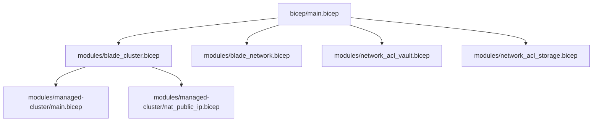
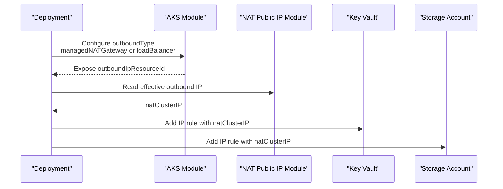
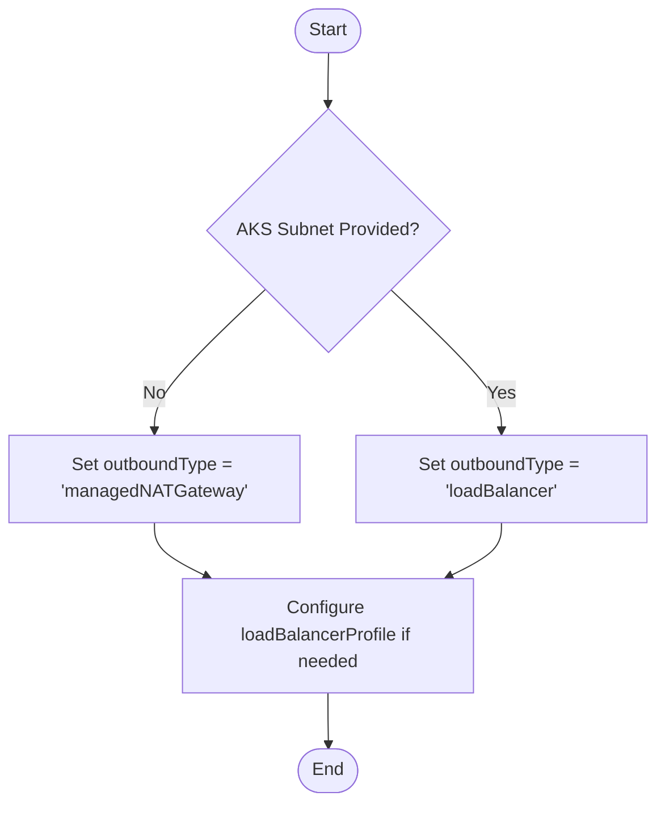
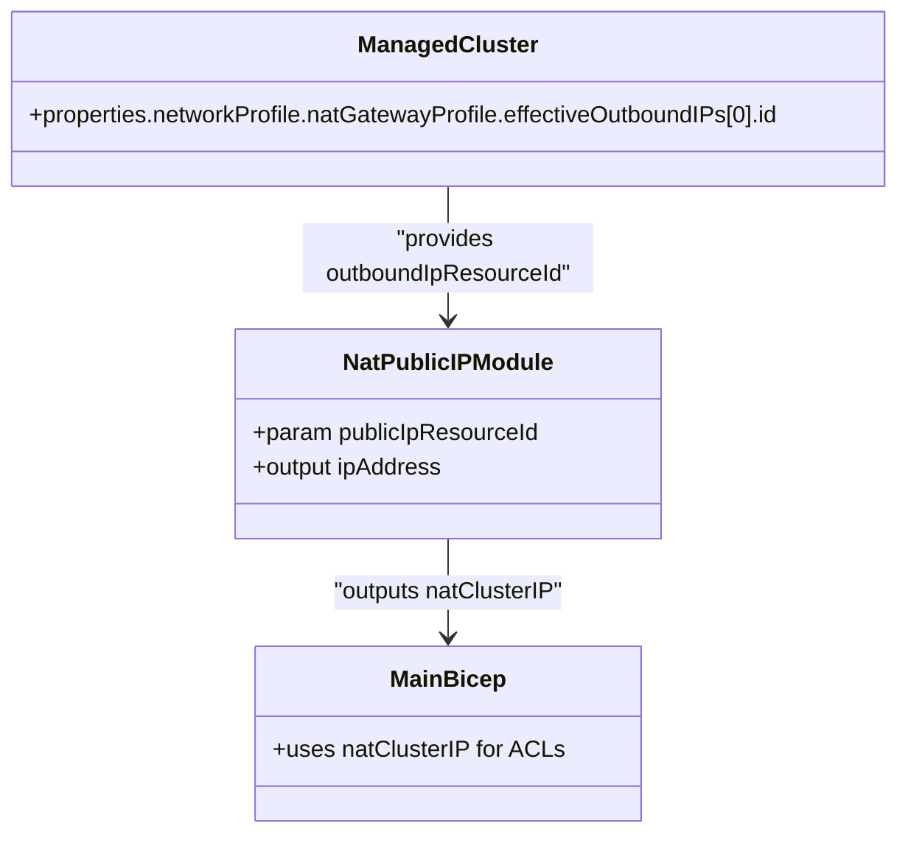
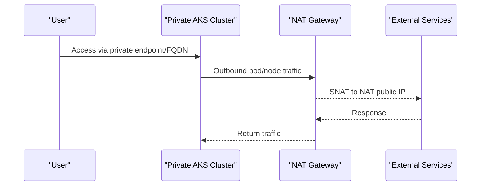
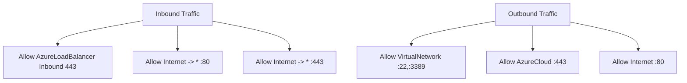
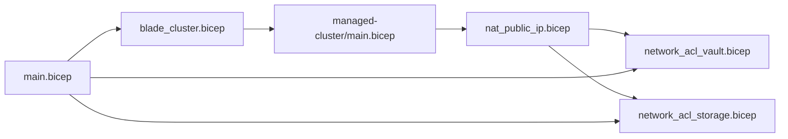

# NAT Public IP Management

<cite>
**Referenced Files in This Document**
- [main.bicep](file://bicep/main.bicep)
- [blade_cluster.bicep](file://bicep/modules/blade_cluster.bicep)
- [managed-cluster/main.bicep](file://bicep/modules/managed-cluster/main.bicep)
- [nat_public_ip.bicep](file://bicep/modules/managed-cluster/nat_public_ip.bicep)
- [blade_network.bicep](file://bicep/modules/blade_network.bicep)
- [network_acl_vault.bicep](file://bicep/modules/network_acl_vault.bicep)
- [network_acl_storage.bicep](file://bicep/modules/network_acl_storage.bicep)
- [advanced_vnet.md](file://docs/src/advanced_vnet.md)
- [design_infrastructure.md](file://docs/src/design_infrastructure.md)
</cite>

## Table of Contents
1. [Introduction](#introduction)
2. [Project Structure](#project-structure)
3. [Core Components](#core-components)
4. [Architecture Overview](#architecture-overview)
5. [Detailed Component Analysis](#detailed-component-analysis)
6. [Dependency Analysis](#dependency-analysis)
7. [Performance Considerations](#performance-considerations)
8. [Troubleshooting Guide](#troubleshooting-guide)
9. [Conclusion](#conclusion)
10. [Appendices](#appendices)

## Introduction
This document explains how the repository configures and manages NAT public IP egress for Azure Kubernetes Service (AKS) clusters. It covers NAT gateway configuration, outbound connectivity strategies, integration with private clusters, egress routing, firewall rules, performance considerations, cost optimization, and troubleshooting guidance. The implementation uses Bicep modules to deploy AKS with either managed NAT Gateway or load balancer-based outbound, and exposes the NAT public IP for downstream services such as Key Vault and Storage network ACLs.

## Project Structure
The deployment is organized into a main Bicep entrypoint that composes “blades” for networking, cluster, and shared resources. The cluster blade provisions AKS and determines the outbound type based on VNet injection settings. A small helper module extracts the NAT public IP from the cluster’s outbound resource. Network security groups and service network ACLs are configured to allow traffic from the NAT IP.

**Diagram sources**
- [main.bicep:353-385](file://bicep/main.bicep#L353-L385)
- [blade_cluster.bicep:103-160](file://bicep/modules/blade_cluster.bicep#L103-L160)
- [managed-cluster/main.bicep:670-696](file://bicep/modules/managed-cluster/main.bicep#L670-L696)
- [nat_public_ip.bicep:1-6](file://bicep/modules/managed-cluster/nat_public_ip.bicep#L1-L6)
- [blade_network.bicep:205-287](file://bicep/modules/blade_network.bicep#L205-L287)
- [network_acl_vault.bicep:8-34](file://bicep/modules/network_acl_vault.bicep#L8-L34)
- [network_acl_storage.bicep:11-31](file://bicep/modules/network_acl_storage.bicep#L11-L31)

**Section sources**
- [main.bicep:353-385](file://bicep/main.bicep#L353-L385)
- [design_infrastructure.md:132-188](file://docs/src/design_infrastructure.md#L132-L188)

## Core Components
- AKS outbound strategy selection:
  - When no AKS subnet is provided, outboundType is set to managed NAT Gateway; otherwise, it uses load balancer outbound.
  - Outbound options include loadBalancer, userDefinedRouting, managedNATGateway, and userAssignedNATGateway.
- NAT public IP extraction:
  - A dedicated module reads the effective outbound IP from the managed cluster’s NAT gateway profile and outputs it for use by other components.
- Network ACLs:
  - Key Vault and Storage accounts can restrict access to only the NAT IP via IP rules.
- NSG rules:
  - Default NSGs allow essential inbound/outbound flows including HTTP/HTTPS and Azure Cloud endpoints.

**Section sources**
- [blade_cluster.bicep:153-159](file://bicep/modules/blade_cluster.bicep#L153-L159)
- [managed-cluster/main.bicep:72-79](file://bicep/modules/managed-cluster/main.bicep#L72-L79)
- [managed-cluster/main.bicep:670-696](file://bicep/modules/managed-cluster/main.bicep#L670-L696)
- [nat_public_ip.bicep:1-6](file://bicep/modules/managed-cluster/nat_public_ip.bicep#L1-L6)
- [blade_network.bicep:52-156](file://bicep/modules/blade_network.bicep#L52-L156)
- [network_acl_vault.bicep:8-34](file://bicep/modules/network_acl_vault.bicep#L8-L34)
- [network_acl_storage.bicep:11-31](file://bicep/modules/network_acl_storage.bicep#L11-L31)

## Architecture Overview
The architecture selects an outbound method at deployment time and centralizes the NAT IP for downstream network policies.

**Diagram sources**
- [blade_cluster.bicep:153-159](file://bicep/modules/blade_cluster.bicep#L153-L159)
- [managed-cluster/main.bicep:670-696](file://bicep/modules/managed-cluster/main.bicep#L670-L696)
- [nat_public_ip.bicep:1-6](file://bicep/modules/managed-cluster/nat_public_ip.bicep#L1-L6)
- [network_acl_vault.bicep:8-34](file://bicep/modules/network_acl_vault.bicep#L8-L34)
- [network_acl_storage.bicep:11-31](file://bicep/modules/network_acl_storage.bicep#L11-L31)

## Detailed Component Analysis

### AKS Outbound Strategy and NAT Configuration
- Outbound type is selected based on whether an AKS subnet is provided:
  - If no AKS subnet: managed NAT Gateway is used.
  - If AKS subnet exists: load balancer outbound is used.
- The AKS module supports multiple outbound types, including managed NAT Gateway and user-assigned NAT Gateway.
- Load balancer profile supports managed outbound IPs and explicit outbound public IP lists.

**Diagram sources**
- [blade_cluster.bicep:153-159](file://bicep/modules/blade_cluster.bicep#L153-L159)
- [managed-cluster/main.bicep:72-79](file://bicep/modules/managed-cluster/main.bicep#L72-L79)
- [managed-cluster/main.bicep:670-696](file://bicep/modules/managed-cluster/main.bicep#L670-L696)

**Section sources**
- [blade_cluster.bicep:153-159](file://bicep/modules/blade_cluster.bicep#L153-L159)
- [managed-cluster/main.bicep:72-79](file://bicep/modules/managed-cluster/main.bicep#L72-L79)
- [managed-cluster/main.bicep:670-696](file://bicep/modules/managed-cluster/main.bicep#L670-L696)

### NAT Public IP Extraction and Usage
- The NAT public IP module takes the outbound IP resource ID from the AKS module and outputs the actual IP address.
- The main deployment references this NAT IP to configure network ACLs for Key Vault and Storage, ensuring egress-only through the NAT IP.

**Diagram sources**
- [managed-cluster/main.bicep:1018-1018](file://bicep/modules/managed-cluster/main.bicep#L1018-L1018)
- [nat_public_ip.bicep:1-6](file://bicep/modules/managed-cluster/nat_public_ip.bicep#L1-L6)
- [main.bicep:646-649](file://bicep/main.bicep#L646-L649)
- [main.bicep:789-792](file://bicep/main.bicep#L789-L792)

**Section sources**
- [nat_public_ip.bicep:1-6](file://bicep/modules/managed-cluster/nat_public_ip.bicep#L1-L6)
- [managed-cluster/main.bicep:1018-1018](file://bicep/modules/managed-cluster/main.bicep#L1018-L1018)
- [main.bicep:646-649](file://bicep/main.bicep#L646-L649)
- [main.bicep:789-792](file://bicep/main.bicep#L789-L792)

### Private Cluster Integration and Egress Routing
- The cluster supports enabling a private cluster and controlling public API server access.
- When using managed NAT Gateway, outbound traffic from pods and nodes is routed through the NAT IP, allowing secure egress while keeping the API plane private.
- For scenarios without VNet injection, the default outbound type switches to managed NAT Gateway; with VNet injection, load balancer outbound is used.

**Diagram sources**
- [managed-cluster/main.bicep:148-160](file://bicep/modules/managed-cluster/main.bicep#L148-L160)
- [blade_cluster.bicep:153-159](file://bicep/modules/blade_cluster.bicep#L153-L159)
- [managed-cluster/main.bicep:670-696](file://bicep/modules/managed-cluster/main.bicep#L670-L696)

**Section sources**
- [managed-cluster/main.bicep:148-160](file://bicep/modules/managed-cluster/main.bicep#L148-L160)
- [blade_cluster.bicep:153-159](file://bicep/modules/blade_cluster.bicep#L153-L159)
- [managed-cluster/main.bicep:670-696](file://bicep/modules/managed-cluster/main.bicep#L670-L696)

### Firewall Rules and NSG Configuration
- NSGs include rules for SSH, Azure Cloud HTTPS, HTTP outbound, and inbound HTTP/HTTPS for load balancer health probes.
- Key Vault and Storage network ACLs can be restricted to the NAT IP, ensuring all egress goes through the NAT gateway.

**Diagram sources**
- [blade_network.bicep:52-156](file://bicep/modules/blade_network.bicep#L52-L156)
- [network_acl_vault.bicep:8-34](file://bicep/modules/network_acl_vault.bicep#L8-L34)
- [network_acl_storage.bicep:11-31](file://bicep/modules/network_acl_storage.bicep#L11-L31)

**Section sources**
- [blade_network.bicep:52-156](file://bicep/modules/blade_network.bicep#L52-L156)
- [network_acl_vault.bicep:8-34](file://bicep/modules/network_acl_vault.bicep#L8-L34)
- [network_acl_storage.bicep:11-31](file://bicep/modules/network_acl_storage.bicep#L11-L31)

### Networking Scenarios and Best Practices
- Scenario: No VNet injection (default):
  - Uses managed NAT Gateway for outbound connectivity.
  - Suitable for quick deployments with minimal networking complexity.
- Scenario: VNet injection with pod subnet:
  - Uses load balancer outbound; enables dynamic IP allocation for pods.
  - Provides more granular control over pod networking and egress.
- Best practices:
  - Restrict Key Vault and Storage network ACLs to NAT IP.
  - Keep API server private and enable private cluster when possible.
  - Use NSGs to limit unnecessary egress and ensure required cloud endpoints are allowed.

**Section sources**
- [advanced_vnet.md:18-38](file://docs/src/advanced_vnet.md#L18-L38)
- [advanced_vnet.md:38-51](file://docs/src/advanced_vnet.md#L38-L51)
- [main.bicep:646-649](file://bicep/main.bicep#L646-L649)
- [main.bicep:789-792](file://bicep/main.bicep#L789-L792)

## Dependency Analysis
The NAT IP depends on the AKS cluster’s outbound configuration. Downstream resources (Key Vault, Storage) depend on the NAT IP output to apply network ACLs.

**Diagram sources**
- [managed-cluster/main.bicep:670-696](file://bicep/modules/managed-cluster/main.bicep#L670-L696)
- [nat_public_ip.bicep:1-6](file://bicep/modules/managed-cluster/nat_public_ip.bicep#L1-L6)
- [network_acl_vault.bicep:8-34](file://bicep/modules/network_acl_vault.bicep#L8-L34)
- [network_acl_storage.bicep:11-31](file://bicep/modules/network_acl_storage.bicep#L11-L31)
- [blade_cluster.bicep:103-160](file://bicep/modules/blade_cluster.bicep#L103-L160)
- [main.bicep:353-385](file://bicep/main.bicep#L353-L385)

**Section sources**
- [managed-cluster/main.bicep:670-696](file://bicep/modules/managed-cluster/main.bicep#L670-L696)
- [nat_public_ip.bicep:1-6](file://bicep/modules/managed-cluster/nat_public_ip.bicep#L1-L6)
- [network_acl_vault.bicep:8-34](file://bicep/modules/network_acl_vault.bicep#L8-L34)
- [network_acl_storage.bicep:11-31](file://bicep/modules/network_acl_storage.bicep#L11-L31)
- [blade_cluster.bicep:103-160](file://bicep/modules/blade_cluster.bicep#L103-L160)
- [main.bicep:353-385](file://bicep/main.bicep#L353-L385)

## Performance Considerations
- NAT Gateway throughput and SNAT capacity scale with the number of public IPs and VM instances behind the gateway. Ensure sufficient capacity for expected outbound connections.
- Using managed NAT Gateway simplifies scaling and reduces operational overhead compared to per-node public IPs.
- Load balancer outbound can be tuned via managed outbound IP count or explicit outbound public IPs for predictable egress addresses.

[No sources needed since this section provides general guidance]

## Troubleshooting Guide
- Verify outbound type:
  - Confirm whether managed NAT Gateway or load balancer outbound is active based on VNet injection status.
- Validate NAT IP propagation:
  - Ensure the NAT public IP module receives the correct outbound IP resource ID and outputs the IP address.
- Check network ACLs:
  - Confirm Key Vault and Storage network ACLs include the NAT IP in their IP rules.
- Review NSG rules:
  - Ensure outbound rules allow necessary destinations (Azure Cloud, Internet) and inbound rules permit required traffic.
- Private cluster access:
  - Confirm API server is accessible via private endpoints and that egress routes through NAT for external dependencies.

**Section sources**
- [blade_cluster.bicep:153-159](file://bicep/modules/blade_cluster.bicep#L153-L159)
- [nat_public_ip.bicep:1-6](file://bicep/modules/managed-cluster/nat_public_ip.bicep#L1-L6)
- [network_acl_vault.bicep:8-34](file://bicep/modules/network_acl_vault.bicep#L8-L34)
- [network_acl_storage.bicep:11-31](file://bicep/modules/network_acl_storage.bicep#L11-L31)
- [blade_network.bicep:52-156](file://bicep/modules/blade_network.bicep#L52-L156)

## Conclusion
The repository implements a robust NAT public IP management strategy for AKS clusters by dynamically selecting outbound methods and centralizing the NAT IP for network policies. This approach supports private clusters, controlled egress, and secure integrations with Key Vault and Storage. By following the outlined configurations and best practices, teams can achieve secure, scalable, and cost-effective outbound connectivity.

[No sources needed since this section summarizes without analyzing specific files]

## Appendices
- Advanced networking guidance and planning notes are available for custom VNet deployments and pod subnet usage.

**Section sources**
- [advanced_vnet.md:18-51](file://docs/src/advanced_vnet.md#L18-L51)
- [design_infrastructure.md:132-188](file://docs/src/design_infrastructure.md#L132-L188)