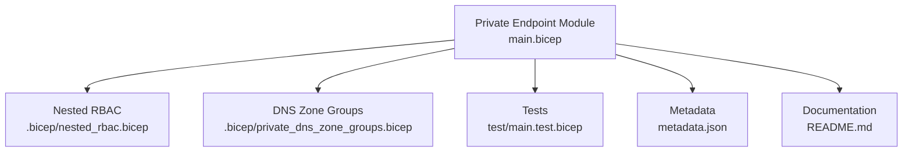
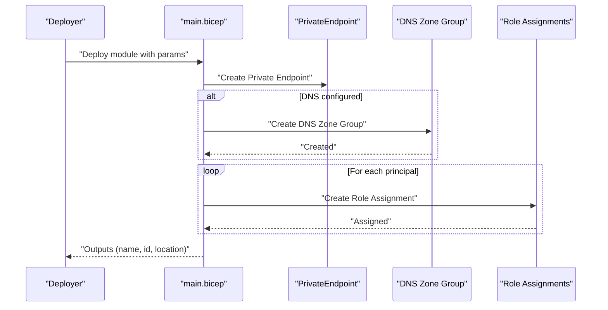
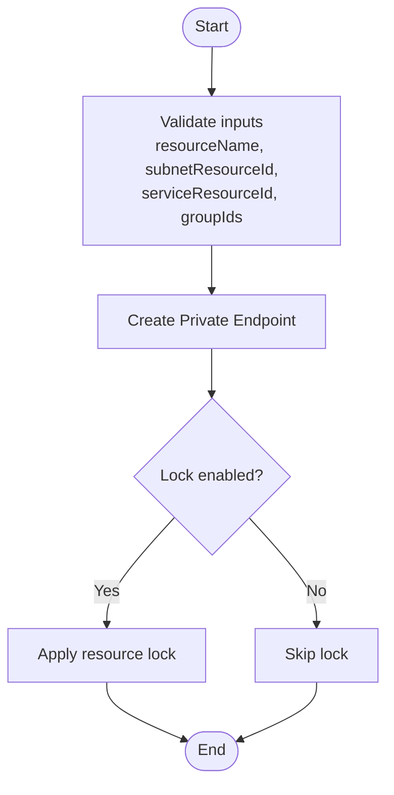
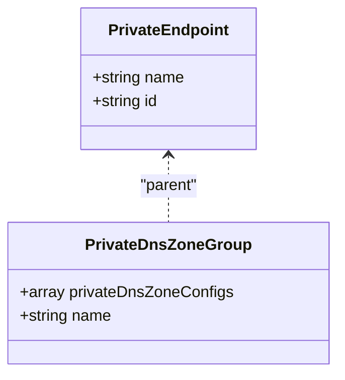
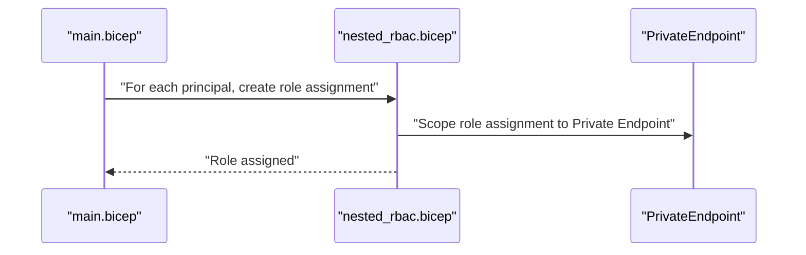
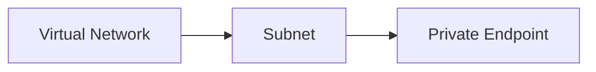
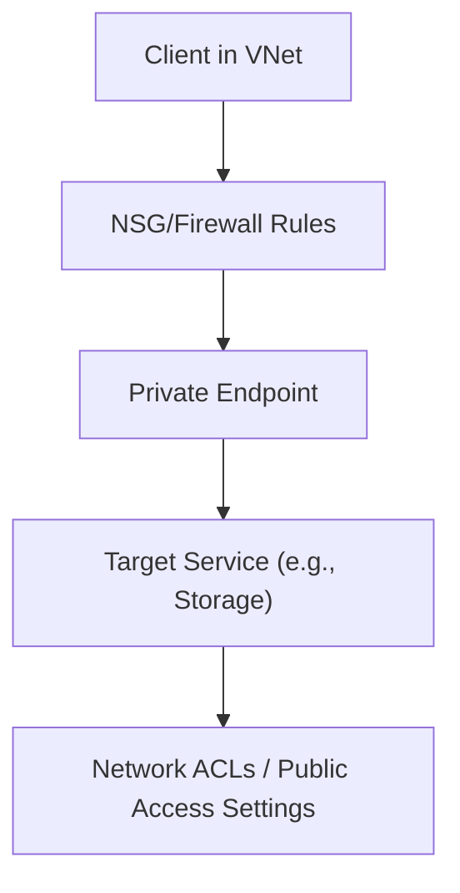
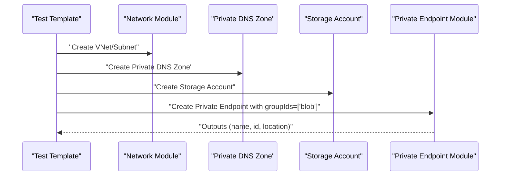
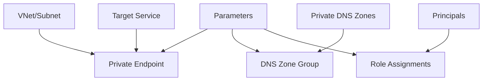

# Private Endpoint Module

<cite>
**Referenced Files in This Document**
- [main.bicep](file://bicep/modules/private-endpoint/main.bicep)
- [nested_rbac.bicep](file://bicep/modules/private-endpoint/.bicep/nested_rbac.bicep)
- [private_dns_zone_groups.bicep](file://bicep/modules/private-endpoint/.bicep/private_dns_zone_groups.bicep)
- [README.md](file://bicep/modules/private-endpoint/README.md)
- [metadata.json](file://bicep/modules/private-endpoint/metadata.json)
- [main.test.bicep](file://bicep/modules/private-endpoint/test/main.test.bicep)
- [parameters.json](file://bicep/modules/private-endpoint/test/parameters.json)
- [storage-account main.bicep](file://bicep/modules/storage-account/main.bicep)
</cite>

## Table of Contents
1. [Introduction](#introduction)
2. [Project Structure](#project-structure)
3. [Core Components](#core-components)
4. [Architecture Overview](#architecture-overview)
5. [Detailed Component Analysis](#detailed-component-analysis)
6. [Dependency Analysis](#dependency-analysis)
7. [Performance Considerations](#performance-considerations)
8. [Troubleshooting Guide](#troubleshooting-guide)
9. [Conclusion](#conclusion)
10. [Appendices](#appendices)

## Introduction
This document provides comprehensive documentation for the Private Endpoint Bicep module that establishes secure private connectivity to Azure services. It explains how the module creates a Private Endpoint, configures DNS zone groups, and applies nested RBAC permissions. It also covers integration with virtual networks and subnets, firewall rules, examples for connecting to various Azure services, troubleshooting connectivity issues, monitoring endpoint health, and security and performance considerations.

## Project Structure
The Private Endpoint module is organized as a reusable Bicep module with:
- A primary entrypoint that defines parameters, creates the Private Endpoint resource, and optionally provisions DNS zone groups and role assignments.
- Nested modules for RBAC and DNS zone group configuration.
- Tests demonstrating usage with storage and networking dependencies.
- Metadata describing the module’s purpose and ownership.

**Diagram sources**
- [main.bicep:71-117](file://bicep/modules/private-endpoint/main.bicep#L71-L117)
- [nested_rbac.bicep:50-66](file://bicep/modules/private-endpoint/.bicep/nested_rbac.bicep#L50-L66)
- [private_dns_zone_groups.bicep:21-31](file://bicep/modules/private-endpoint/.bicep/private_dns_zone_groups.bicep#L21-L31)
- [main.test.bicep:47-58](file://bicep/modules/private-endpoint/test/main.test.bicep#L47-L58)
- [metadata.json:1-6](file://bicep/modules/private-endpoint/metadata.json#L1-L6)
- [README.md:1-30](file://bicep/modules/private-endpoint/README.md#L1-L30)

**Section sources**
- [main.bicep:1-67](file://bicep/modules/private-endpoint/main.bicep#L1-L67)
- [README.md:1-30](file://bicep/modules/private-endpoint/README.md#L1-L30)
- [metadata.json:1-6](file://bicep/modules/private-endpoint/metadata.json#L1-L6)

## Core Components
- Private Endpoint creation: The module declares a Private Endpoint resource bound to a subnet and linked to a target service via a private link service connection. It supports application security groups, custom network interface names, IP configurations, manual connections, and custom DNS configs.
- DNS zone group configuration: An optional nested module associates one or more private DNS zones with the Private Endpoint through a DNS zone group (up to five zones).
- Nested RBAC: A nested module assigns roles to principals on the Private Endpoint, supporting built-in roles by name or ID, conditions, condition versions, and cross-tenant scenarios using delegated managed identity resource IDs.
- Resource locks: Optional resource locks protect the Private Endpoint from accidental modification or deletion.
- Outputs: The module exposes resource group, name, id, and location outputs for downstream use.

Key parameter highlights:
- Required: resourceName, subnetResourceId, serviceResourceId, groupIds
- Optional: applicationSecurityGroups, customNetworkInterfaceName, ipConfigurations, privateDnsZoneGroup, location, crossTenant, roleAssignments, tags, lock, customDnsConfigs, manualPrivateLinkServiceConnections

**Section sources**
- [main.bicep:4-67](file://bicep/modules/private-endpoint/main.bicep#L4-L67)
- [main.bicep:71-140](file://bicep/modules/private-endpoint/main.bicep#L71-L140)
- [nested_rbac.bicep:1-66](file://bicep/modules/private-endpoint/.bicep/nested_rbac.bicep#L1-L66)
- [private_dns_zone_groups.bicep:1-42](file://bicep/modules/private-endpoint/.bicep/private_dns_zone_groups.bicep#L1-L42)

## Architecture Overview
The module composes three primary resources:
- Microsoft.Network/privateEndpoints
- Microsoft.Network/privateEndpoints/privateDnsZoneGroups (optional)
- Microsoft.Authorization/roleAssignments (per principal)

It integrates with existing virtual networks and subnets, and can be paired with private DNS zones to resolve service endpoints privately.

**Diagram sources**
- [main.bicep:71-117](file://bicep/modules/private-endpoint/main.bicep#L71-L117)
- [private_dns_zone_groups.bicep:21-31](file://bicep/modules/private-endpoint/.bicep/private_dns_zone_groups.bicep#L21-L31)
- [nested_rbac.bicep:50-66](file://bicep/modules/private-endpoint/.bicep/nested_rbac.bicep#L50-L66)

## Detailed Component Analysis

### Private Endpoint Creation
- Creates a Private Endpoint in the specified subnet and links it to a target service using a private link service connection.
- Supports additional configurations such as application security groups, custom network interface naming, IP configurations, manual connections, and custom DNS configs.
- Applies an optional resource lock to prevent unintended changes.

**Diagram sources**
- [main.bicep:71-94](file://bicep/modules/private-endpoint/main.bicep#L71-L94)
- [main.bicep:119-127](file://bicep/modules/private-endpoint/main.bicep#L119-L127)

**Section sources**
- [main.bicep:71-94](file://bicep/modules/private-endpoint/main.bicep#L71-L94)
- [main.bicep:119-127](file://bicep/modules/private-endpoint/main.bicep#L119-L127)

### DNS Zone Group Configuration
- Optionally associates one or more private DNS zones with the Private Endpoint via a DNS zone group.
- Enforces up to five DNS zones per group.
- Uses the parent Private Endpoint reference to scope the DNS zone group.

**Diagram sources**
- [private_dns_zone_groups.bicep:21-31](file://bicep/modules/private-endpoint/.bicep/private_dns_zone_groups.bicep#L21-L31)

**Section sources**
- [private_dns_zone_groups.bicep:1-42](file://bicep/modules/private-endpoint/.bicep/private_dns_zone_groups.bicep#L1-L42)

### Nested RBAC Permissions
- Assigns roles to principals on the Private Endpoint.
- Supports built-in roles by name or ID, role conditions, condition versions, and cross-tenant delegation via delegated managed identity resource IDs.
- Iterates over provided principals to create individual role assignments scoped to the Private Endpoint.

**Diagram sources**
- [main.bicep:105-117](file://bicep/modules/private-endpoint/main.bicep#L105-L117)
- [nested_rbac.bicep:50-66](file://bicep/modules/private-endpoint/.bicep/nested_rbac.bicep#L50-L66)

**Section sources**
- [nested_rbac.bicep:1-66](file://bicep/modules/private-endpoint/.bicep/nested_rbac.bicep#L1-L66)
- [main.bicep:105-117](file://bicep/modules/private-endpoint/main.bicep#L105-L117)

### Integration with Virtual Networks and Subnets
- The module requires a subnet resource ID where the Private Endpoint will be placed.
- In tests, a virtual network module is used to provision a subnet with policies suitable for Private Endpoint deployment.
- Ensure the subnet has appropriate network policies for Private Endpoint workloads.

**Diagram sources**
- [main.test.bicep:27-44](file://bicep/modules/private-endpoint/test/main.test.bicep#L27-L44)
- [main.bicep:71-94](file://bicep/modules/private-endpoint/main.bicep#L71-L94)

**Section sources**
- [main.test.bicep:27-44](file://bicep/modules/private-endpoint/test/main.test.bicep#L27-L44)
- [main.bicep:71-94](file://bicep/modules/private-endpoint/main.bicep#L71-L94)

### Firewall Rules and Network Access Controls
- While the Private Endpoint module itself does not define firewall rules, integration with services like Storage Accounts allows configuring network ACLs and public access settings.
- For example, the Storage Account module supports networkAcls and publicNetworkAccess parameters to restrict access and enforce private connectivity.

**Diagram sources**
- [storage-account main.bicep:67-76](file://bicep/modules/storage-account/main.bicep#L67-L76)
- [storage-account main.bicep:163-172](file://bicep/modules/storage-account/main.bicep#L163-L172)

**Section sources**
- [storage-account main.bicep:67-76](file://bicep/modules/storage-account/main.bicep#L67-L76)
- [storage-account main.bicep:163-172](file://bicep/modules/storage-account/main.bicep#L163-L172)

### Examples: Connecting to Various Azure Services
- The test demonstrates connecting to a Storage Account via a Private Endpoint and associating a private DNS zone for resolution.
- Use the module’s parameters to connect to other Azure services by providing the correct serviceResourceId and groupIds specific to the target service type.

**Diagram sources**
- [main.test.bicep:8-58](file://bicep/modules/private-endpoint/test/main.test.bicep#L8-L58)
- [README.md:42-115](file://bicep/modules/private-endpoint/README.md#L42-L115)

**Section sources**
- [main.test.bicep:8-58](file://bicep/modules/private-endpoint/test/main.test.bicep#L8-L58)
- [README.md:42-115](file://bicep/modules/private-endpoint/README.md#L42-L115)

## Dependency Analysis
The module depends on:
- Existing virtual network and subnet resources (provided as parameters).
- Target service resources (provided as serviceResourceId).
- Optional private DNS zones (provided via privateDnsZoneGroup).
- Optional principals for RBAC (provided via roleAssignments).

**Diagram sources**
- [main.bicep:4-67](file://bicep/modules/private-endpoint/main.bicep#L4-L67)
- [main.bicep:71-117](file://bicep/modules/private-endpoint/main.bicep#L71-L117)

**Section sources**
- [main.bicep:4-67](file://bicep/modules/private-endpoint/main.bicep#L4-L67)
- [main.bicep:71-117](file://bicep/modules/private-endpoint/main.bicep#L71-L117)

## Performance Considerations
- Minimize the number of DNS zones per DNS zone group (up to five) to reduce complexity and improve manageability.
- Use targeted groupIds to ensure only necessary service interfaces are exposed.
- Apply resource locks judiciously to avoid deployment friction while protecting critical resources.
- Integrate with network ACLs and firewall rules at the service level to limit unnecessary traffic and optimize throughput.

[No sources needed since this section provides general guidance]

## Troubleshooting Guide
Common issues and resolutions:
- DNS resolution failures: Ensure the Private Endpoint is associated with the correct private DNS zone(s) via the DNS zone group and that clients are routed to the correct DNS servers.
- Connectivity timeouts: Verify subnet policies allow Private Endpoint placement and that NSGs/firewalls permit required traffic between client and service.
- RBAC errors: Confirm role assignments are correctly scoped to the Private Endpoint and principals have sufficient permissions.
- Cross-tenant scenarios: When using crossTenant=true, ensure delegated managed identity resource IDs are provided for principals.

Operational checks:
- Validate Private Endpoint provisioning state and link status.
- Review DNS zone group configuration and zone record mappings.
- Inspect role assignments and principal types.

**Section sources**
- [private_dns_zone_groups.bicep:21-31](file://bicep/modules/private-endpoint/.bicep/private_dns_zone_groups.bicep#L21-L31)
- [nested_rbac.bicep:50-66](file://bicep/modules/private-endpoint/.bicep/nested_rbac.bicep#L50-L66)
- [main.bicep:71-94](file://bicep/modules/private-endpoint/main.bicep#L71-L94)

## Conclusion
The Private Endpoint module provides a robust, modular approach to establishing secure private connectivity to Azure services. It encapsulates Private Endpoint creation, DNS zone group configuration, and fine-grained RBAC management, while integrating seamlessly with virtual networks and service-level firewall controls. By following best practices for DNS, networking, and permissions, teams can deploy reliable and compliant private connectivity across diverse Azure services.

[No sources needed since this section summarizes without analyzing specific files]

## Appendices

### Parameters Reference
- resourceName: Name of the Private Endpoint resource.
- subnetResourceId: Resource ID of the subnet for placement.
- serviceResourceId: Resource ID of the target service.
- groupIds: Array of service-specific group identifiers.
- applicationSecurityGroups: Optional ASGs for IP configuration.
- customNetworkInterfaceName: Optional custom NIC name.
- ipConfigurations: Optional IP configurations for first-party services.
- privateDnsZoneGroup: Optional object containing private DNS zone IDs.
- location: Optional deployment location.
- crossTenant: Optional flag for cross-tenant scenarios.
- roleAssignments: Optional array of role definitions and principals.
- tags: Optional resource tags.
- lock: Optional resource lock type.
- customDnsConfigs: Optional custom DNS configurations.
- manualPrivateLinkServiceConnections: Optional manual connections.

**Section sources**
- [main.bicep:4-67](file://bicep/modules/private-endpoint/main.bicep#L4-L67)
- [README.md:11-30](file://bicep/modules/private-endpoint/README.md#L11-L30)

### Outputs Reference
- resourceGroupName: Resource group name.
- name: Private Endpoint name.
- id: Private Endpoint resource ID.
- location: Deployment location.

**Section sources**
- [main.bicep:129-140](file://bicep/modules/private-endpoint/main.bicep#L129-L140)

### Example Usage
- See the test template for a complete example deploying a Private Endpoint to a Storage Account with a private DNS zone and network dependencies.

**Section sources**
- [main.test.bicep:8-58](file://bicep/modules/private-endpoint/test/main.test.bicep#L8-L58)
- [parameters.json:1-12](file://bicep/modules/private-endpoint/test/parameters.json#L1-L12)